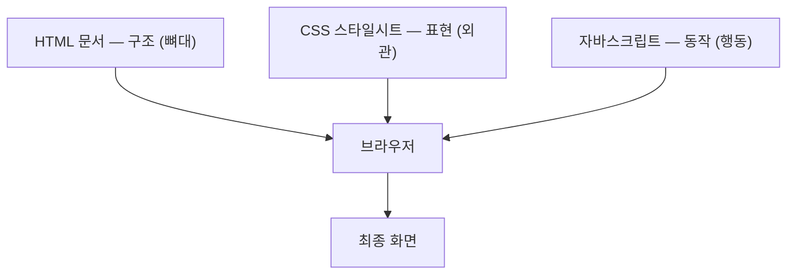
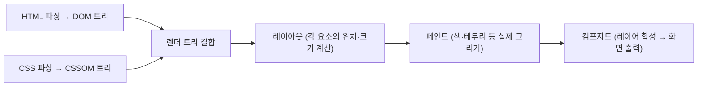

<Callout type="info">
  **이번 문서의 목표:** 이 문서를 다 읽으면 CSS라는 이름이 무엇의 줄임말인지 근거를 들어 설명하고, HTML·CSS·JS 세 언어가 왜 각자 다른 일을 맡도록 나뉘었는지, 브라우저가 이 파일을 받아 화면에 그리기까지 대략 어떤 단계를 거치는지 큰 그림으로 그릴 수 있게 됩니다.
</Callout>

## 왜 "표현"을 따로 떼어냈는가

HTML(html_fundamentals 과목을 이미 읽었다면 익숙할) 문서 하나만 있어도 브라우저는 글자를 화면에 띄울 수 있습니다. 제목은 크게, 문단은 줄바꿈해서, 목록은 점을 찍어서 — 브라우저마다 정해둔 기본 모양대로 말이죠. 그런데 이 기본 모양만으로는 우리가 매일 보는 웹사이트를 만들 수 없습니다. 버튼에 색을 칠하고, 카드를 나란히 배치하고, 글자 크기를 조절하는 일은 HTML만으로는 불가능합니다.

여기서 문제가 하나 생깁니다. "이 글자를 파란색으로 칠하라"는 지시를 HTML 태그 안에 직접 욱여넣으면 어떻게 될까요? 초기 웹이 실제로 이랬습니다. ``처럼 모양을 지정하는 태그를 문서 곳곳에 흩뿌렸습니다. 그 결과 문서 하나의 색을 바꾸려면 그 색이 쓰인 모든 태그를 일일이 찾아 고쳐야 했습니다. 문서가 수백 페이지라면 재앙입니다.

> **쉽게 말하면:** "무엇을 말할지"(구조)와 "어떻게 보이게 할지"(표현)를 한 서류에 뒤섞으면, 디자인 하나 바꿀 때마다 서류 전체를 뒤져야 합니다. 이 둘을 아예 다른 서류로 분리하자는 것이 CSS의 출발점입니다.

## CSS의 정의와 어원

**CSS**는 **Cascading Style Sheets**(캐스케이딩 스타일 시트)의 줄임말입니다. 세 단어를 하나씩 뜯어보면 이 언어가 무엇을 하는지 이름 자체에 이미 담겨 있습니다.

- **Style**(스타일, 양식): 색·크기·간격·배치처럼 "어떻게 보이는가"에 관한 규칙 전체를 가리킵니다.
- **Sheet**(시트, 장): 그 규칙들을 모아 적어 놓은 한 장의 종이라는 비유입니다. 실제로 확장자 `.css` 파일 하나가 시트 한 장에 해당합니다.
- **Cascading**(캐스케이딩, 폭포처럼 흘러내리는): 여러 규칙이 위에서 아래로 겹겹이 쌓여 흘러내리다가, 서로 충돌하면 정해진 순서로 승자를 가리는 방식을 뜻합니다. 마치 계단식 폭포에서 물이 위 칸에서 아래 칸으로 순서대로 떨어지듯, 여러 출처의 스타일 규칙이 정해진 순서를 타고 흘러 최종 모양을 결정합니다.

즉 CSS는 "화면에 어떻게 보일지를 정하는 규칙들을, 여러 출처에서 와도 정해진 순서로 겹쳐 쌓아 최종 결과를 만드는 시트 언어"입니다. 이 "여러 규칙이 충돌할 때 누가 이기는가"라는 캐스케이딩의 실제 계산 과정은 이 과목의 08~10편(캐스케이드·명시도·상속)에서 아주 깊게 다룹니다. 지금은 이름에 이미 이 언어의 핵심 아이디어가 박혀 있다는 것만 기억해도 충분합니다.

CSS는 프로그래밍 언어가 아니라 **스타일시트 언어**(style sheet language)입니다. 조건문이나 반복문으로 "무엇을 할지" 명령하는 대신, "이런 요소는 이렇게 보여라"라는 **선언**(declaration)을 나열합니다. 이런 방식을 **선언형**(declarative)이라고 부릅니다. 반대로 "어떤 순서로 계산해서 어떻게 만들라"고 절차를 하나하나 지시하는 방식은 **명령형**(imperative)이라고 하는데, 자바스크립트가 여기 해당합니다.

## 스타일시트라는 개념

**스타일시트**(style sheet)는 스타일 규칙들의 모음입니다. 비유하자면 건물의 **인테리어 지침서**와 같습니다. 건축 설계도(HTML)가 "여기는 벽, 저기는 문, 이쪽은 계단"이라는 구조를 정한다면, 인테리어 지침서(CSS)는 "이 벽은 흰색으로, 저 문은 원목으로, 계단 난간은 검은색으로"를 정합니다. 같은 설계도(구조)에 지침서(스타일시트)만 바꿔 끼우면 완전히 다른 분위기의 공간이 나옵니다.

이 비유가 중요한 이유는, CSS 파일 하나가 HTML 문서 여러 개에 재사용될 수 있다는 사실을 보여주기 때문입니다. 같은 스타일시트 하나를 사이트의 모든 페이지가 함께 불러다 쓰면, 스타일시트 한 곳만 고쳐도 사이트 전체의 디자인이 동시에 바뀝니다. 이것이 문서 구조와 표현을 분리한 실질적인 이득입니다. 스타일시트를 문서에 연결하는 구체적인 방법(인라인·내부·외부)은 바로 다음 02편에서 다룹니다.

## HTML·CSS·JS 역할 분리

웹을 이루는 세 축은 각자 다른 질문에 답합니다.

| 언어 | 담당 질문 | 예시 |
|------|-----------|------|
| HTML | 무엇이 있는가(구조) | "여기는 제목, 저기는 문단, 이건 버튼이다" |
| CSS | 어떻게 보이는가(표현) | "제목은 크고 굵게, 버튼은 파란 배경에 흰 글자" |
| JS | 어떻게 움직이는가(동작) | "버튼을 클릭하면 메뉴가 열린다" |

이 표를 외우는 것보다 중요한 것은 **왜** 이렇게 나뉘어야 하는지입니다. 세 관심사를 뒤섞으면 한 가지를 고칠 때 다른 두 가지를 건드릴 위험이 커집니다. 버튼 색을 바꾸려다 실수로 버튼이 눌리는 동작까지 망가뜨리는 식입니다. 반대로 관심사를 분리하면, 디자이너는 CSS만 만지고, 마크업 담당자는 HTML 구조만 신경 쓰고, 개발자는 JS 동작만 책임지는 식으로 역할을 나눌 수 있습니다. 이를 **관심사의 분리**(separation of concerns)라고 부릅니다.

세 언어의 관계를 그림으로 보면 이렇습니다.

<Callout type="warning">
  **자주 틀리는 점:** "CSS는 그냥 꾸미기용이라 대충 해도 된다"는 생각은 틀렸습니다. 요소가 화면 어디에 어떤 크기로 놓이는지(레이아웃), 색 대비가 충분해 글자가 읽히는지(접근성) 같은 문제는 전부 CSS의 책임입니다. 표현이 곧 사용성인 경우가 대부분입니다.
</Callout>

## 브라우저가 CSS를 적용하기까지 — 큰 그림만

CSS 파일을 저장하고 브라우저에서 새로고침을 누르면, 화면이 바뀌는 그 짧은 순간 브라우저 내부에서는 몇 단계가 순서대로 일어납니다. 지금 단계에서는 이름과 순서만 알아두면 충분합니다. 각 단계의 세부 동작(파싱 알고리즘, 트리 구조, 실제 렌더링 최적화 등)은 이 사이트의 `javascript/web_apis` 03편이 이미 깊게 다루므로 그쪽을 참조하십시오.

- **DOM**(Document Object Model, 문서 객체 모델): HTML을 파싱해 만든, 요소들의 부모-자식 관계를 나타내는 트리 구조입니다.
- **CSSOM**(CSS Object Model, CSS 객체 모델): CSS를 파싱해 만든, 각 선택자와 선언 규칙을 담은 트리 구조입니다.
- 브라우저는 DOM과 CSSOM을 합쳐 "이 요소에 이 스타일이 적용된다"는 **렌더 트리**를 만들고, 그다음 실제 화면 좌표를 계산(레이아웃)하고 색을 칠(페인트)한 뒤 최종 화면으로 합성(컴포지트)합니다.

> **쉽게 말하면:** HTML은 재료 목록, CSS는 조리법입니다. 브라우저(요리사)는 두 문서를 각각 읽고 나서야 "이 재료를 이렇게 조리하면 이 접시가 나온다"고 합쳐 계산할 수 있습니다. CSS 파일을 읽기 전까지는 최종 모양을 알 수 없습니다.

이 흐름에서 지금 꼭 기억해야 할 실무적 함의 하나는, **CSS 파일이 늦게 도착하면 화면이 스타일 없는 맨 HTML로 잠깐 보일 수 있다**는 점입니다. 이런 현상을 **FOUC**(Flash of Unstyled Content, 스타일 없는 콘텐츠가 잠깐 번쩍이는 현상)라고 부릅니다. CSS를 문서의 어디에 어떻게 연결해야 이런 문제를 피할 수 있는지는 다음 02편에서 다룹니다.

## 핵심 정리

- CSS는 Cascading(폭포처럼 흐르는 우선순위 규칙) + Style(양식) + Sheets(규칙 모음 문서)의 줄임말이며, 이름 자체가 "여러 규칙이 겹칠 때 순서대로 승자를 가린다"는 핵심 동작을 담고 있다.
- CSS는 선언형 스타일시트 언어로, HTML의 구조와 표현을 분리해 재사용성과 유지보수성을 확보한다.
- HTML(구조)·CSS(표현)·JS(동작)의 역할 분리는 관심사의 분리 원칙을 웹에 적용한 결과다.
- 브라우저는 DOM(HTML 파싱 결과)과 CSSOM(CSS 파싱 결과)을 합쳐 렌더 트리를 만든 뒤에야 레이아웃·페인트·컴포지트를 거쳐 화면을 그린다. 세부 렌더링 파이프라인은 `javascript/web_apis` 03편 참조.

## 마무리 복습

<Quiz
  questionNumber={1}
  question="CSS라는 이름의 줄임말로 옳은 것은?"
  options={['Computer Style Syntax', 'Cascading Style Sheets', 'Creative Styling System', 'Content Style Structure']}
  correctAnswer={2}
  explanation="CSS는 Cascading Style Sheets의 줄임말이다. Cascading은 여러 스타일 규칙이 정해진 순서로 흘러내리며 충돌을 해결한다는 뜻을 담고 있다."
  optionExplanations={['실존하지 않는 조합이다', '정답 — 폭포처럼 흐르는 우선순위 규칙이라는 뜻이 이름에 담겨 있다', '얼핏 그럴듯하지만 실제 약어가 아니다', 'CSS의 실제 철자와 다르다']}
/>

<Quiz
  questionNumber={2}
  question="HTML과 CSS를 분리해서 얻는 실질적인 이득으로 가장 알맞은 것은?"
  options={['자바스크립트 없이도 애니메이션을 만들 수 있게 된다', '스타일시트 하나를 여러 문서가 함께 불러 쓰면, 한 곳만 고쳐도 전체 디자인이 동시에 바뀐다', 'HTML 파일의 용량이 항상 줄어든다', '브라우저가 CSS를 아예 읽지 않아도 되게 된다']}
  correctAnswer={2}
  explanation="구조와 표현을 분리하면 스타일시트를 여러 문서가 공유할 수 있어, 스타일시트 한 곳만 고쳐도 그것을 불러 쓰는 모든 문서의 디자인이 함께 바뀐다."
  optionExplanations={['전환·애니메이션은 CSS 자체 기능이지만 이것이 분리의 핵심 이득은 아니다', '정답 — 재사용성과 유지보수성이 핵심 이득이다', '분리 여부와 파일 용량은 직접 관련이 없다', '브라우저는 여전히 CSS를 읽어야 화면을 완성한다']}
/>

<Quiz
  questionNumber={3}
  question="다음 중 CSS가 담당하는 질문에 해당하는 것은?"
  options={['이 페이지에 어떤 요소들이 존재하는가', '버튼을 클릭하면 어떤 함수가 실행되는가', '제목 글자는 얼마나 크고 무슨 색인가', '서버로부터 데이터를 어떻게 받아오는가']}
  correctAnswer={3}
  explanation="글자 크기와 색은 표현에 관한 질문이며 CSS의 책임이다. 나머지는 각각 HTML(구조)과 JS(동작)의 책임이다."
  optionExplanations={['요소의 존재 여부는 HTML(구조)의 책임이다', '클릭 시 동작은 JS의 책임이다', '정답 — 크기와 색은 표현(CSS)의 영역이다', '데이터 요청은 JS(동작)의 책임이다']}
/>

<Quiz
  questionNumber={4}
  question="브라우저가 화면을 그리는 과정에 대한 설명으로 옳은 것은?"
  options={['CSS는 무시하고 DOM만으로 화면을 먼저 그린 뒤 나중에 색을 입힌다', 'DOM과 CSSOM을 합쳐 렌더 트리를 만든 뒤에야 레이아웃과 페인트가 이루어진다', 'JS가 항상 CSS보다 먼저 실행되어야 스타일이 적용된다', 'CSSOM은 HTML을 파싱한 결과물이다']}
  correctAnswer={2}
  explanation="브라우저는 HTML을 파싱한 DOM과 CSS를 파싱한 CSSOM을 결합해 렌더 트리를 만들고, 그 이후에 레이아웃과 페인트 단계를 진행한다."
  optionExplanations={['CSS 없이 먼저 그리는 방식이 아니라 CSSOM 완성 후 결합해서 그린다', '정답 — DOM과 CSSOM의 결합이 렌더링의 전제 조건이다', 'JS 실행 순서와 CSS 적용은 별개의 이야기다', 'CSSOM은 CSS를, DOM은 HTML을 파싱한 결과물이다']}
/>

<Quiz
  questionNumber={5}
  question="CSS를 선언형 언어라고 부르는 이유로 가장 알맞은 것은?"
  options={['조건문과 반복문으로 계산 순서를 하나하나 지시하기 때문에', '어떤 요소가 이렇게 보여야 하는지 결과만 선언하고, 그 결과를 만드는 절차는 브라우저가 알아서 계산하기 때문에', '자바스크립트보다 코드 실행 속도가 빠르기 때문에', 'HTML 태그 안에서만 작성할 수 있기 때문에']}
  correctAnswer={2}
  explanation="선언형은 원하는 결과만 선언하고 그것을 만드는 절차를 브라우저에 맡기는 방식이다. 절차를 하나하나 지시하는 방식은 명령형이며 자바스크립트가 여기 해당한다."
  optionExplanations={['절차를 하나하나 지시하는 것은 명령형의 특징이다', '정답 — 결과 선언과 절차 위임이 선언형의 핵심이다', '실행 속도와 선언형 여부는 직접 관련이 없다', 'CSS는 외부 파일이나 style 태그 등 다양한 위치에 작성할 수 있다']}
/>

<Quiz
  questionNumber={6}
  question="FOUC(Flash of Unstyled Content)에 대한 설명으로 옳은 것은?"
  options={['자바스크립트 오류로 화면이 멈추는 현상이다', 'CSS 파일이 늦게 도착해 스타일 없는 맨 HTML이 잠깐 보이는 현상이다', 'CSS 애니메이션이 너무 빨리 끝나는 현상이다', '브라우저가 CSSOM을 아예 만들지 못하는 오류다']}
  correctAnswer={2}
  explanation="FOUC는 CSS 파일이 늦게 도착해 브라우저가 잠깐 스타일 없는 HTML을 그대로 보여주는 현상을 가리킨다."
  optionExplanations={['자바스크립트 오류와는 관련이 없다', '정답 — CSS 도착 지연으로 생기는 시각적 현상이다', '애니메이션 재생 속도와는 관련이 없는 개념이다', 'CSSOM 생성 실패가 아니라 도착 지연이 원인이다']}
/>

## 참고 자료

- [MDN — CSS syntax](https://developer.mozilla.org/en-US/docs/Web/CSS/Guides/Syntax)
