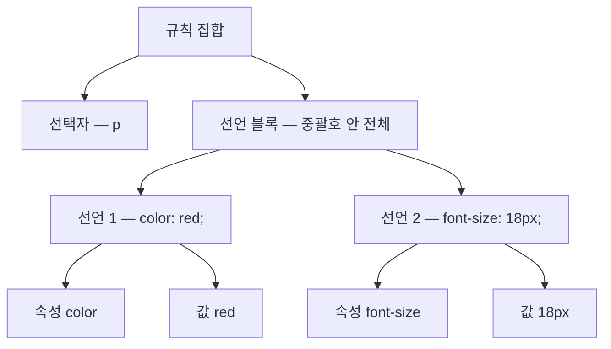

<Callout type="info">
  **이번 문서의 목표:** 이 문서를 다 읽으면 CSS를 HTML 문서에 연결하는 세 가지 방법의 차이와 언제 무엇을 써야 하는지 설명하고, CSS 규칙 하나를 구성 요소별로(선택자·선언·속성·값) 정확히 읽을 수 있게 됩니다.
</Callout>

## 왜 세 가지 방법이 다 필요한가

01편에서 CSS는 스타일시트를 HTML 문서와 분리해 재사용하기 위해 태어났다고 배웠습니다. 그런데 실무에는 "지금 이 요소 하나만 급하게 색을 바꿔야 하는" 상황부터 "사이트 전체 수백 페이지에 같은 디자인을 입혀야 하는" 상황까지 스펙트럼이 넓습니다. 방법이 하나뿐이면 극단적인 상황 중 하나는 항상 불편해집니다. 그래서 CSS는 적용 범위가 다른 세 가지 방법을 제공합니다.

## 세 가지 적용 방법

### 1. 인라인 스타일 — `style` 속성

HTML 요소 태그 안에 `style` 속성으로 직접 스타일을 적는 방식입니다.

```html
<p style="color: red; font-size: 18px;">이 문단만 빨갛게</p>
```

이 방식은 딱 그 요소 하나에만 적용되며, 재사용이 전혀 안 됩니다. 요소가 100개 있으면 100번 반복해서 써야 합니다. 01편에서 봤던 "구조와 표현을 뒤섞는" 초기 웹의 문제가 그대로 재현되는 방식입니다. 그래서 실무에서는 특수한 경우(자바스크립트가 계산한 값을 그 순간 딱 하나의 요소에만 즉시 반영해야 할 때 등)를 빼면 거의 쓰지 않습니다.

### 2. 내부 스타일시트 — `<style>` 태그

문서의 `<head>` 안에 `<style>` 태그를 두고 그 안에 규칙을 모아 적는 방식입니다.

```html
<head>
  <style>
    p { color: red; }
    h1 { font-size: 32px; }
  </style>
</head>
```

문서 전체 어디에서든 재사용은 되지만, 딱 이 문서 하나에만 적용됩니다. 다른 페이지에서 같은 스타일을 쓰려면 `<style>` 블록 전체를 복사해 붙여야 합니다. 페이지가 한두 개뿐인 간단한 예제나 데모에는 편리하지만, 페이지가 늘어나면 관리가 무너집니다.

### 3. 외부 스타일시트 — `<link>` 태그

`.css` 확장자를 가진 별도 파일을 만들고, `<head>` 안에서 `<link>` 요소로 그 파일을 불러옵니다.

```html
<head>
  <link rel="stylesheet" href="styles.css">
</head>
```

```css
/* styles.css */
p { color: red; }
h1 { font-size: 32px; }
```

`rel="stylesheet"`의 `rel`은 relationship(관계)의 줄임말로, "이 링크가 문서와 어떤 관계인지"를 브라우저에 알려줍니다. `stylesheet`라고 지정하면 브라우저는 이 파일을 CSS 규칙 모음으로 해석합니다. `<link>`와 `<style>` 태그 자체의 HTML 문법(속성 구조 등)은 이미 `html_fundamentals`에서 다뤘다고 가정하고, 여기서는 CSS 쪽 관점에만 집중합니다.

같은 `.css` 파일 하나를 사이트의 모든 HTML 페이지가 `<link>`로 불러오면, 파일 하나만 고쳐도 그 파일을 불러오는 모든 페이지의 디자인이 동시에 바뀝니다. 이것이 01편에서 말한 "재사용성"이 실제로 구현되는 방식입니다. 이 때문에 실무에서는 외부 스타일시트가 기본값이고, 나머지 두 방법은 예외적인 상황에서만 씁니다.

> **쉽게 말하면:** 인라인은 포스트잇 한 장에 메모, 내부 스타일시트는 이 문서 맨 앞장에 붙인 공지문, 외부 스타일시트는 회사 전체에 배포되는 규정집입니다. 규정집을 한 번 고치면 그 규정집을 따르는 모든 부서(페이지)가 자동으로 새 규칙을 따릅니다.

## 우선순위 감각 — 지금은 감으로만

세 방법을 같은 요소에 동시에 걸면 어느 것이 이길까요? 결론부터 말하면 **인라인 스타일이 가장 강하고, 내부와 외부 스타일시트는 문서 안에서 나중에 나온 규칙이 이깁니다.** (같은 선택자를 쓴다는 전제에서요.) 지금 단계에서는 이 정도 감각만 잡아 두면 충분합니다. "왜" 인라인이 항상 이기는지, 선택자의 구체성에 따라 순서가 어떻게 뒤집힐 수 있는지는 이 과목의 08편(캐스케이드)과 09편(명시도)에서 계산 과정까지 정확히 다룹니다. 지금 외우려 하지 마십시오 — 아직 필요한 개념(선택자, 명시도)을 배우지 않았습니다.

## CSS 규칙의 문법 — 선택자와 선언 블록

CSS 파일은 **규칙 집합**(rule set, 흔히 줄여서 "규칙"이라 부름)의 나열입니다. 규칙 집합 하나의 구조는 이렇습니다.

```css
p {
  color: red;
  font-size: 18px;
}
```

이 짧은 코드에도 다섯 가지 용어가 들어 있습니다.

| 용어 | 이 예시에서 해당하는 부분 | 뜻 |
|------|---------------------------|-----|
| 선택자(selector) | `p` | "이 규칙을 어떤 요소에 적용할지" 고르는 부분 |
| 선언 블록(declaration block) | `{ color: red; font-size: 18px; }` | 중괄호로 감싼, 선언들의 모음 |
| 선언(declaration) | `color: red;` 각 줄 | 속성과 값의 짝 하나 |
| 속성(property) | `color`, `font-size` | 무엇을 바꿀지 이름 |
| 값(value) | `red`, `18px` | 그 속성을 무엇으로 바꿀지 |

문장으로 풀면 "`p` 요소를 선택해서, 그 안에서 글자색(color) 속성은 빨강(red)으로, 글자 크기(font-size) 속성은 18픽셀(px)로 하라는 두 개의 선언을 적용하라"는 뜻입니다.



문법상 반드시 지켜야 할 세부 규칙 세 가지가 있습니다.

1. 선언은 `속성: 값;` 형태로, 콜론(`:`)으로 속성과 값을 나누고 세미콜론(`;`)으로 선언을 끝냅니다.
2. 선언 블록의 마지막 선언 뒤 세미콜론은 생략해도 문법 오류는 아니지만, 나중에 선언을 하나 더 추가할 때 세미콜론을 빠뜨리는 실수를 막기 위해 항상 붙이는 것이 관행입니다.
3. 선택자 여러 개를 쉼표(`,`)로 나열하면 같은 선언 블록을 여러 선택자에 한꺼번에 적용할 수 있습니다.

```css
h1, h2, h3 {
  font-weight: bold;
}
```

이 코드는 "h1 또는 h2 또는 h3 요소 모두에 굵은 글씨(font-weight: bold)를 적용하라"는 뜻입니다. 선택자를 하나씩 따로 규칙으로 쓸 필요 없이, 같은 스타일을 공유하는 요소들을 한 번에 묶습니다. 이렇게 여러 선택자를 목록으로 묶는 방식을 **선택자 목록**(selector list)이라고 부릅니다.

<Callout type="warning">
  **자주 틀리는 점:** 콜론(`:`)과 세미콜론(`;`)을 헷갈리면 브라우저가 그 선언 전체를 무시합니다. `color: red;`를 `color; red:`처럼 잘못 쓰면 스타일이 조용히 적용되지 않습니다. CSS는 문법 오류가 있어도 페이지 전체를 멈추지 않고, 문제가 된 선언 하나만 조용히 건너뜁니다 — 그래서 오류를 눈으로 알아채기 어렵습니다. 03편에서 DevTools로 이런 무시된 선언을 확인하는 법을 미리 봅니다.
</Callout>

## 주석 — 코드에 남기는 메모

CSS 주석은 `/* */`로 감쌉니다. HTML의 `<!-- -->`나 JS의 `//`와는 다른 문법이라는 점에 주의하십시오.

```css
/* 이 아래는 헤더 영역 스타일이다 */
header {
  background-color: navy;
}

/* 여러 줄에 걸친
   설명도 가능하다 */
```

주석은 브라우저가 완전히 무시하므로 스타일에 아무 영향을 주지 않습니다. 팀 협업 시 "이 규칙이 왜 필요한지", "이 값을 바꾸면 안 되는 이유" 같은 맥락을 남기는 데 씁니다.

## `@import`와 로드 순서 문제

CSS 파일 안에서 다른 CSS 파일을 불러오는 방법도 있습니다. `@import` 규칙을 파일 맨 앞부분에 씁니다.

```css
@import url("base.css");

body {
  font-family: sans-serif;
}
```

`@import`는 `<link>`처럼 별도 요청을 만들지만, 결정적인 차이가 있습니다. **브라우저가 이 CSS 파일을 파싱하다가 `@import`를 만나야 비로소 그 파일을 요청합니다.** 반면 `<link>`는 HTML을 파싱하는 시점에 병렬로 요청이 시작됩니다. 즉 `@import`를 쓰면 요청이 순차적으로 줄줄이 이어져(A 파일을 받아야 그 안의 `@import`를 읽고 B 파일을 요청) 전체 로딩이 늦어지는 성능 문제가 생길 수 있습니다.

| 방식 | 요청 시작 시점 | 사용 위치 |
|------|----------------|-----------|
| `<link rel="stylesheet">` | HTML 파싱 중 즉시, 병렬 요청 | HTML의 `<head>` |
| `@import url(...)` | 상위 CSS 파일을 파싱하는 도중 | CSS 파일 내부, 다른 규칙보다 먼저 |

이런 이유로 실무에서는 대부분 `<link>`를 여러 개 나열하거나, 빌드 도구로 CSS 파일들을 하나로 합치는 방식을 선호하고 `@import`는 잘 쓰지 않습니다. 다만 문법으로는 여전히 존재하고, 규칙을 조건에 따라 다른 파일로 쪼개 관리하고 싶을 때 등 제한적으로 쓰이므로 존재는 알아 두어야 합니다.

<Callout type="warning">
  **자주 틀리는 점:** `@import`는 반드시 스타일시트의 다른 규칙보다 앞, 파일 맨 위쪽에 와야 합니다. 다른 선언 뒤에 `@import`를 쓰면 브라우저가 그 규칙을 무시합니다.
</Callout>

## 핵심 정리

- CSS를 적용하는 세 가지 방법은 인라인(요소 하나, `style` 속성)·내부(문서 하나, `<style>`)·외부(여러 문서 공유, `<link>` + `.css` 파일)이며, 실무 기본값은 외부 스타일시트다.
- 세 방법이 충돌하면 인라인이 가장 강하다는 감각만 지금 잡고, 정확한 계산은 08~09편(캐스케이드·명시도)으로 미룬다.
- CSS 규칙 집합은 선택자 + 선언 블록으로 이루어지고, 선언 블록 안에는 `속성: 값;` 형태의 선언이 여러 개 들어간다.
- 주석은 `/* */`이며 브라우저가 완전히 무시한다.
- `@import`는 CSS 파일 안에서 다른 CSS 파일을 부르지만, 순차적 요청 때문에 로딩이 느려질 수 있어 실무에서는 `<link>`를 선호한다.

## 마무리 복습

<Quiz
  questionNumber={1}
  question="실무에서 여러 페이지에 같은 디자인을 적용할 때 가장 적합한 CSS 적용 방법은?"
  options={['인라인 스타일', '내부 스타일시트', '외부 스타일시트', '자바스크립트로 매번 style 속성 지정']}
  correctAnswer={3}
  explanation="외부 스타일시트는 파일 하나를 여러 HTML 문서가 함께 불러 쓸 수 있어, 한 곳만 고쳐도 모든 문서에 반영된다."
  optionExplanations={['요소 하나에만 적용되어 재사용이 불가능하다', '문서 하나에만 적용되어 다른 페이지와 공유되지 않는다', '정답 — 여러 문서가 하나의 파일을 공유할 수 있다', '가능은 하지만 CSS의 선언형 방식을 버리는 비효율적인 접근이다']}
/>

<Quiz
  questionNumber={2}
  question="다음 CSS 코드에서 color가 가리키는 용어는? h1 { color: navy; }"
  options={['선택자', '선언 블록', '속성', '값']}
  correctAnswer={3}
  explanation="color는 무엇을 바꿀지 이름을 나타내는 속성이다. h1은 선택자, navy는 값, 중괄호 전체는 선언 블록이다."
  optionExplanations={['선택자는 h1이다', '선언 블록은 중괄호로 감싼 전체다', '정답 — color는 속성 이름이다', '값은 navy다']}
/>

<Quiz
  questionNumber={3}
  question="h1, h2, h3 { font-weight: bold; } 처럼 쉼표로 선택자를 나열하는 방식의 이름은?"
  options={['자손 결합자', '선택자 목록', '의사 클래스 목록', '속성 선택자']}
  correctAnswer={2}
  explanation="쉼표로 여러 선택자를 나열해 같은 선언 블록을 한 번에 적용하는 방식을 선택자 목록이라 부른다."
  optionExplanations={['자손 결합자는 공백으로 계층 관계를 표현하는 별개의 문법이다(05편)', '정답 — 쉼표로 묶은 선택자들의 나열이다', '의사 클래스는 상태나 구조를 나타내는 다른 개념이다(06편)', '속성 선택자는 대괄호를 쓰는 다른 문법이다(04편)']}
/>

<Quiz
  questionNumber={4}
  question="@import와 link rel=stylesheet의 차이로 옳은 것은?"
  options={['@import는 HTML 파싱과 동시에 병렬로 요청이 시작된다', 'link 요소는 CSS 파일 내부에서만 쓸 수 있다', '@import는 상위 CSS 파일을 파싱하는 도중에야 요청이 시작되어 순차적으로 지연될 수 있다', '두 방식은 로딩 속도에 아무 차이가 없다']}
  correctAnswer={3}
  explanation="link는 HTML 파싱 시점에 병렬 요청이 시작되지만, @import는 그것을 담은 CSS 파일을 먼저 받아 파싱해야 요청이 시작되어 순차적 지연이 생길 수 있다."
  optionExplanations={['병렬로 즉시 시작되는 쪽은 link다', 'link는 HTML의 head 안에서 쓴다', '정답 — 순차적 요청 구조 때문에 로딩이 느려질 수 있다', '요청 시점 차이 때문에 실제로 속도 차이가 발생한다']}
/>

<Quiz
  questionNumber={5}
  question="rel=stylesheet 에서 rel 속성이 브라우저에 알려주는 것은?"
  options={['불러올 파일의 용량', '이 링크가 문서와 어떤 관계인지', '스타일시트를 적용할 요소의 개수', '파일을 내려받을 서버의 위치']}
  correctAnswer={2}
  explanation="rel은 relationship의 줄임말로, 링크된 자원이 문서와 어떤 관계인지를 나타낸다. stylesheet 값은 이 자원이 CSS 규칙 모음임을 알려준다."
  optionExplanations={['rel 속성은 파일 용량과 관련이 없다', '정답 — rel은 relationship의 줄임말이다', '적용 대상 요소 개수는 CSS 선택자가 결정하는 부분이다', '파일 위치는 href 속성이 담당한다']}
/>

<Quiz
  questionNumber={6}
  question="CSS 선언에서 콜론(:)과 세미콜론(;)의 역할로 옳은 것은?"
  options={['콜론은 선언을 끝내고, 세미콜론은 속성과 값을 나눈다', '콜론은 속성과 값을 나누고, 세미콜론은 선언을 끝낸다', '둘 다 선택자를 구분하는 데만 쓰인다', '콜론과 세미콜론은 서로 바꿔 써도 항상 똑같이 동작한다']}
  correctAnswer={2}
  explanation="속성과 값은 콜론으로 나누고, 하나의 선언이 끝났음은 세미콜론으로 표시한다. color: red; 에서 콜론 앞뒤가 속성과 값, 세미콜론이 선언의 끝이다."
  optionExplanations={['역할이 뒤바뀐 설명이다', '정답 — 콜론은 속성과 값 사이, 세미콜론은 선언의 끝이다', '선택자 구분은 쉼표나 결합자가 담당한다(05편)', '둘을 바꿔 쓰면 문법 오류로 선언이 무시된다']}
/>

## 참고 자료

- [MDN — CSS syntax](https://developer.mozilla.org/en-US/docs/Web/CSS/Guides/Syntax)
