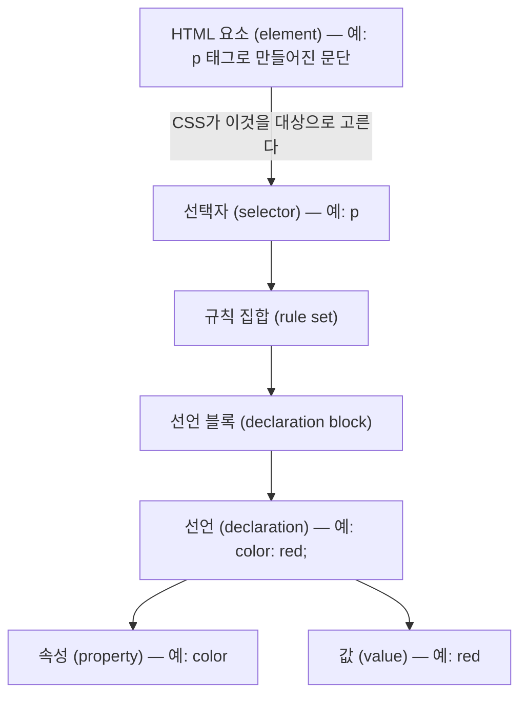

<Callout type="info">
  **이번 문서의 목표:** 이 문서를 다 읽으면 CSS를 이야기할 때 쓰는 핵심 용어를 헷갈리지 않고 정확히 구분해 부르고, 브라우저 개발자 도구를 열어 지금 보이는 스타일이 어디서 왔는지 화면에서 직접 확인할 수 있게 됩니다.
</Callout>

## 왜 용어 지도를 한 번 더 그리는가

02편에서 CSS 규칙의 구성 요소(선택자·선언·속성·값)를 배웠습니다. 그런데 실무 대화와 문서에서는 여기에 "요소"라는 단어까지 섞여 다섯 개 이상의 용어가 비슷한 자리에서 오갑니다. "이 요소의 이 속성 값이 왜 저 선택자한테 안 먹히지?" 같은 문장을 정확히 이해하려면, 각 단어가 정확히 무엇을 가리키는지 흔들림 없이 알아야 합니다. 용어가 헷갈리면 질문 자체를 못 만들고, 질문을 못 만들면 검색도 못 합니다.

## 용어 지도 — 요소부터 선언까지

이번 편은 새로운 문법을 배우지 않습니다. 대신 지금까지 나온 용어들이 서로 어떤 위치 관계에 있는지 하나의 그림으로 정리합니다.



각 용어를 다시 짚으면 이렇습니다.

| 용어 | 정의 | 헷갈리는 짝 |
|------|------|-------------|
| 요소(element) | HTML 문서를 이루는 낱개 단위(`<p>`, `<div>` 등으로 만들어진 것) | CSS 밖(HTML)의 개념. CSS는 이것을 "고르는" 역할만 한다 |
| 선택자(selector) | 어떤 요소를 고를지 정하는 패턴 | 선택자 자체는 스타일이 아니라 "누구에게 적용할지"를 정하는 부분 |
| 규칙 집합(rule set) | 선택자 + 선언 블록의 전체 묶음 | 흔히 그냥 "규칙"이라고도 부른다 |
| 선언 블록(declaration block) | 중괄호로 감싼, 선언들의 모음 | 선언 하나가 아니라 여러 개를 담는 그릇 |
| 선언(declaration) | `속성: 값;` 한 줄 | 선언 블록(그릇) 안에 든 내용물 하나 |
| 속성(property) | 무엇을 바꿀지 이름(`color`, `font-size` 등) | 값과 짝을 이루는 앞부분 |
| 값(value) | 속성을 무엇으로 바꿀지(`red`, `18px` 등) | 속성과 짝을 이루는 뒷부분 |

> **쉽게 말하면:** 요소는 손님, 선택자는 "이 손님을 부르는 방법"(이름·번호표), 규칙 집합은 그 손님에게 내려진 지시서 전체, 선언 하나하나는 지시서 안의 한 줄("음료는 아이스로", "좌석은 창가로")입니다.

<Callout type="warning">
  **자주 틀리는 점:** "선택자"와 "속성"을 뒤바꿔 말하는 경우가 흔합니다. `p { color: red; }`에서 `p`는 선택자이고 `color`는 속성입니다. 선택자는 항상 중괄호 **바깥**에, 속성은 중괄호 **안** 콜론 **앞**에 옵니다. 이 위치 감각만 있으면 절대 헷갈리지 않습니다.
</Callout>

## 개발자 도구 — 이 과목의 확인 습관

이 과목은 앞으로 30편이 넘게 이어지며, 그 안에서 캐스케이드가 왜 이렇게 계산됐는지, 박스 모델의 여백이 왜 저 크기인지, Flexbox의 정렬이 왜 저렇게 됐는지를 계속 물을 것입니다. 이런 질문에 "느낌"이 아니라 "확인된 사실"로 답하는 유일한 방법이 브라우저 **개발자 도구**(DevTools, Developer Tools)입니다. 그래서 지금, 아직 캐스케이드도 배우기 전인 이 시점에 도구부터 열어봅니다.

### DevTools를 여는 법

<Steps>

1. **크롬(Chrome)이나 엣지(Edge) 기준**으로 웹 페이지의 아무 요소 위에서 마우스 오른쪽 버튼을 누르고 "검사"(Inspect)를 선택합니다.
2. 또는 키보드 단축키(Windows: `F12` 또는 `Ctrl+Shift+I`, macOS: `Cmd+Option+I`)를 누릅니다.
3. 화면 한쪽에 새 패널이 열립니다. 이 패널을 **DevTools**라고 부릅니다.

</Steps>

DevTools 안에는 여러 탭이 있는데, 이 과목에서 가장 자주 쓸 것은 **Elements**(엘리먼츠, 요소) 패널입니다. Elements 패널은 다시 두 영역으로 나뉩니다.

- 왼쪽: 현재 페이지의 DOM 트리(01편에서 본, HTML을 파싱해 만든 요소들의 트리 구조)를 그대로 보여줍니다. 요소를 클릭하면 화면에서 그 요소가 하이라이트됩니다.
- 오른쪽: 선택한 요소에 **어떤 CSS 규칙이 적용됐는지**를 보여주는 **Styles**(스타일) 패널입니다.

### Styles 패널 첫인상

Styles 패널을 처음 보면 이런 정보가 눈에 들어옵니다.

- 어떤 규칙 집합이 이 요소에 적용됐는지, 그 규칙이 어느 CSS 파일의 몇 번째 줄에서 왔는지
- 적용되지 않고 **취소선**이 그어진 선언 — 다른 규칙에 밀려 진 규칙입니다(왜 밀렸는지는 09편 명시도에서 정확히 배웁니다)
- 지금 이 화면에서 각 선언의 값을 직접 수정해 보며 실시간으로 결과를 확인할 수 있는 편집 기능

<Callout type="warning">
  **자주 틀리는 점:** DevTools에서 값을 수정하면 화면이 바뀌지만, 이 수정은 **원본 CSS 파일에 저장되지 않습니다.** 새로고침하면 원래대로 돌아갑니다. DevTools는 "실험해 보는 곳"이지 "최종 수정하는 곳"이 아닙니다. 실제 수정은 항상 코드 편집기에서 `.css` 파일을 고쳐야 합니다.
</Callout>

지금 단계에서는 이 정도만 "미리보기"로 확인합니다. Styles 패널로 명시도를 읽는 법, Computed(컴퓨티드, 계산됨) 탭으로 최종 값을 추적하는 법, 박스 모델 다이어그램을 읽는 법, Flexbox·Grid 오버레이를 켜는 법 같은 실전 활용은 개념이 충분히 쌓인 뒤 30편에서 통째로 다룹니다. 지금은 "모르면 DevTools를 연다"는 반사적인 습관만 만들면 충분합니다.

### 간단한 확인 예제

아래 플레이그라운드를 브라우저에서 열어보고, 실제로 마우스 오른쪽 버튼으로 문단을 눌러 "검사"를 선택해 보십시오. Styles 패널에 `p` 선택자로 적용된 규칙이 보이는지 확인하는 것이 이번 예제의 목표입니다.

```html
<p class="안내문">이 문단을 마우스 오른쪽 버튼으로 눌러 "검사"를 선택해 보세요.</p>
```

```css
.안내문 {
  color: teal;
  font-size: 20px;
  border: 1px solid teal;
  padding: 8px;
}
```

이 예제는 정적 코드블록으로 충분합니다. 지금은 "선택자가 실제로 어떤 요소를 골랐는지 도구로 확인한다"는 습관을 만드는 것이 목표이지, 값을 바꿔가며 결과를 비교하는 실험은 아직 다룰 CSS 개념(선택자·박스 모델 등)이 부족해 04편 이후부터 본격적으로 시작합니다.

## 핵심 정리

- 요소(HTML의 낱개 단위) → 선택자(고르는 패턴) → 규칙 집합(선택자+선언 블록) → 선언(속성:값 한 줄) → 속성/값 순서로 용어의 포함 관계를 정리했다.
- 선택자는 항상 중괄호 바깥, 속성은 중괄호 안 콜론 앞이라는 위치로 두 용어를 구분한다.
- DevTools의 Elements 패널은 DOM 트리(왼쪽)와 Styles 패널(오른쪽, 적용된 CSS 규칙)로 나뉜다.
- DevTools에서의 값 수정은 실시간 실험용이며 원본 파일에 저장되지 않는다.
- 이 과목 전체에서 "확인은 DevTools로 한다"는 습관이 30편(디버깅 실전)에서 완성된다.

## 마무리 복습

<Quiz
  questionNumber={1}
  question="다음 중 CSS의 선택자에 해당하는 것은? h2 { font-weight: bold; }"
  options={['font-weight', 'bold', 'h2', 'h2 { font-weight: bold; } 전체']}
  correctAnswer={3}
  explanation="h2는 중괄호 바깥에 위치해 어떤 요소를 고를지 정하는 선택자다. font-weight는 속성, bold는 값, 전체는 규칙 집합이다."
  optionExplanations={['이것은 속성이다', '이것은 값이다', '정답 — 중괄호 바깥의 h2가 선택자다', '이것은 규칙 집합 전체를 가리키는 표현이다']}
/>

<Quiz
  questionNumber={2}
  question="DevTools의 Elements 패널에서 오른쪽에 위치하며, 적용된 CSS 규칙과 어느 파일에서 왔는지를 보여주는 것은?"
  options={['Console 패널', 'Styles 패널', 'Network 패널', 'Sources 패널']}
  correctAnswer={2}
  explanation="Styles 패널은 선택한 요소에 적용된 CSS 규칙과 출처 파일·줄 번호를 보여준다."
  optionExplanations={['Console은 로그와 에러를 확인하는 패널이다', '정답 — Styles 패널이 적용된 규칙을 보여준다', 'Network는 네트워크 요청을 확인하는 패널이다', 'Sources는 파일 원본을 보는 패널이다']}
/>

<Quiz
  questionNumber={3}
  question="DevTools의 Styles 패널에서 값을 직접 수정했을 때 일어나는 일로 옳은 것은?"
  options={['수정한 값이 즉시 원본 CSS 파일에 저장된다', '화면에는 실시간으로 반영되지만 새로고침하면 원래대로 돌아간다', '수정이 서버에 있는 CSS 파일까지 함께 바뀐다', '수정은 화면에 전혀 반영되지 않는다']}
  correctAnswer={2}
  explanation="DevTools에서의 수정은 브라우저 안에서만 임시로 반영되는 실험이며, 원본 파일은 전혀 바뀌지 않아 새로고침하면 사라진다."
  optionExplanations={['원본 파일 저장은 되지 않는다', '정답 — 임시 반영이며 새로고침 시 사라진다', '서버 파일은 전혀 영향을 받지 않는다', '화면에는 실시간으로 반영된다']}
/>

<Quiz
  questionNumber={4}
  question="선택자와 규칙 집합의 관계로 옳은 것은?"
  options={['선택자는 규칙 집합보다 더 큰 단위다', '규칙 집합은 선택자와 선언 블록을 합친 전체를 가리킨다', '선택자와 규칙 집합은 완전히 같은 뜻이다', '규칙 집합 안에는 선택자가 여러 개씩 필수로 들어간다']}
  correctAnswer={2}
  explanation="규칙 집합은 선택자 하나(또는 선택자 목록)와 그 뒤에 오는 선언 블록을 합친 전체를 가리키는 더 큰 단위다."
  optionExplanations={['선택자는 규칙 집합을 이루는 부분이지 더 큰 단위가 아니다', '정답 — 규칙 집합은 선택자와 선언 블록의 합이다', '선택자는 규칙 집합의 구성 요소 중 하나일 뿐 동의어가 아니다', '선택자는 하나만 있어도 규칙 집합이 성립한다']}
/>

<Quiz
  questionNumber={5}
  question="DevTools의 Elements 패널 왼쪽 영역이 보여주는 것은?"
  options={['현재 페이지의 DOM 트리', '네트워크 요청 목록', '콘솔에 출력된 로그', '자바스크립트 소스 코드 원본']}
  correctAnswer={1}
  explanation="Elements 패널 왼쪽은 HTML을 파싱해 만든 DOM 트리를 보여주며, 오른쪽에 그 요소에 적용된 CSS 규칙을 보여주는 Styles 패널이 있다."
  optionExplanations={['정답 — 왼쪽은 DOM 트리를 보여준다', '네트워크 요청은 Network 패널의 역할이다', '콘솔 로그는 Console 패널의 역할이다', '소스 코드 원본은 Sources 패널의 역할이다']}
/>

<Quiz
  questionNumber={6}
  question="이 과목에서 DevTools를 계속 강조하는 근본적인 이유로 가장 알맞은 것은?"
  options={['DevTools 없이는 CSS 파일을 작성할 수 없기 때문에', '캐스케이드·박스 모델·레이아웃이 왜 그렇게 계산됐는지를 느낌이 아니라 확인된 사실로 답하기 위해서', 'DevTools를 열면 CSS 파일이 자동으로 최적화되기 때문에', 'DevTools가 없으면 브라우저가 CSS를 아예 적용하지 않기 때문에']}
  correctAnswer={2}
  explanation="이 과목은 앞으로 캐스케이드·박스 모델·레이아웃 등에서 왜 이런 결과가 나왔는지 계속 물으며, 그 답을 눈짐작이 아니라 DevTools로 확인된 사실로 얻는 습관을 만드는 것이 목표다."
  optionExplanations={['CSS 작성 자체는 코드 편집기만으로 가능하다', '정답 — 확인된 사실로 원인을 추적하는 습관이 목표다', 'DevTools는 확인 도구일 뿐 파일을 최적화하지 않는다', 'DevTools 실행 여부와 CSS 적용 여부는 무관하다']}
/>

## 참고 자료

- [MDN — CSS syntax](https://developer.mozilla.org/en-US/docs/Web/CSS/Guides/Syntax)
- [Chrome DevTools — View and change CSS](https://developer.chrome.com/docs/devtools/css)
