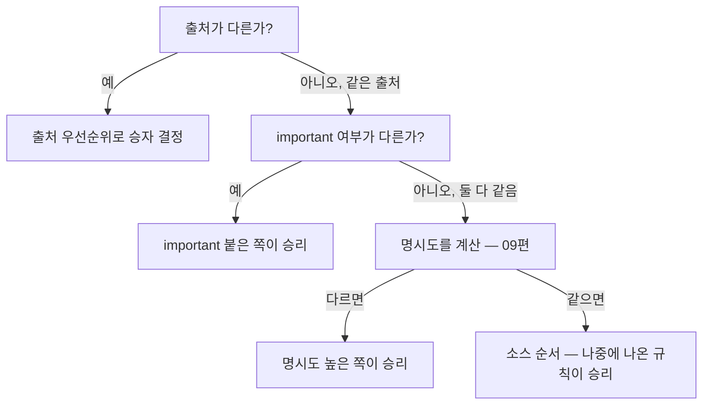

<Callout type="info">
  **이번 문서의 목표:** 이 문서를 다 읽으면 같은 요소에 스타일이 겹칠 때 브라우저가 "출처 → important 여부 → (다음 편에서 배울 명시도) → 소스 순서"를 어떤 흐름으로 따져 승자를 정하는지 설명하고, `!important`를 아무 데나 붙이게 되는 근본 원인을 진단할 수 있게 됩니다.
</Callout>

## CSS 이름 속의 그 단어 — Cascading

01편에서 **CSS**가 **Cascading Style Sheets**(캐스케이딩 스타일 시트)의 약자라고 배웠습니다. 그런데 정작 "캐스케이딩"이 무엇인지는 그때 미뤄 두었습니다. 이제 이 과목에서 가장 중요한 개념 중 하나를 다룰 차례입니다.

**캐스케이드**(cascade)는 원래 "계단식으로 떨어지는 작은 폭포"를 뜻하는 영어 단어입니다. 물이 위에서 아래로 여러 단을 거치며 떨어지듯, CSS의 캐스케이드는 **여러 곳에서 온 스타일 규칙들이 한 요소 위로 쏟아졌을 때, 정해진 단계를 하나씩 거쳐 최종적으로 어느 규칙이 이길지 가려내는 절차**입니다.

왜 이런 절차가 필요할까요. 한 요소에 적용될 수 있는 CSS 규칙은 절대 하나뿐이지 않습니다. 브라우저 자체가 기본으로 깔아 둔 스타일, 내가 작성한 스타일시트의 여러 규칙, 심지어 사용자가 브라우저 설정에서 강제한 스타일까지 뒤섞입니다. 이 여러 목소리 중 누구 말을 들을지 정하는 심판 규칙이 없다면 브라우저마다, 순간마다 결과가 달라질 것입니다. 캐스케이드는 그 심판 규칙을 **결정적**(deterministic, 같은 입력이면 항상 같은 결과)으로 정의해 둔 것입니다.

> **쉽게 말하면:** 캐스케이드는 "이 요소, 이 속성에 대해 누구 말을 들을지"를 정하는 브라우저의 재판 절차입니다. 절차는 항상 같은 순서로 진행되고, 앞 단계에서 승부가 나면 뒤 단계는 보지도 않습니다.

## 캐스케이드가 훑는 4단계

캐스케이드는 충돌하는 선언(declaration)들을 놓고 아래 순서로 하나씩 비교합니다. **앞 단계에서 승부가 갈리면 그 즉시 승자가 정해지고, 뒤 단계는 확인조차 하지 않습니다.**



이번 편에서는 1단계(출처)와 2단계(important), 그리고 마지막 단계(소스 순서)를 다룹니다. 가운데 낀 **명시도**(specificity) 계산은 그 자체로 규칙이 복잡해 09편 전체를 따로 씁니다.

## 1. 출처 — 이 스타일은 누가 정했는가

### 세 가지 출처

**출처**(origin, 오리진)는 그 CSS 선언이 어디서 왔는지를 뜻합니다. 브라우저는 크게 세 출처를 구분합니다.

| 출처 | 누가 만드는가 | 예시 |
|------|----------------|------|
| 사용자 에이전트(User Agent) 스타일시트 | 브라우저 제조사가 기본으로 내장 | `h1`이 굵고 크게, `a`가 파란 밑줄로 보이는 기본 스타일 |
| 저자(Author) 스타일시트 | 웹사이트를 만드는 개발자, 즉 우리 | `.css` 파일이나 `<style>` 태그에 우리가 쓰는 모든 규칙 |
| 사용자(User) 스타일시트 | 웹사이트 방문자 본인 | 접근성을 위해 브라우저 설정에서 강제로 지정한 큰 글자 크기 등 |

**사용자 에이전트**(User Agent, UA)라는 표현이 낯설 수 있는데, 브라우저를 가리키는 웹 표준 용어입니다. "에이전트"(agent)는 "대리인"이라는 뜻으로, 사용자를 대신해 서버와 대화하고 화면을 그려 주는 대리인이 브라우저라는 관점에서 붙은 이름입니다.

### 왜 이 순서인가

기본 우선순위는 **사용자 에이전트 < 저자 < 사용자(important 없는 상태 기준)** 입니다. 우리가 CSS 파일 하나 쓰지 않아도 `h1`, `p`, `button` 같은 요소들이 이미 어느 정도 모양을 갖추고 나오는 이유가 사용자 에이전트 스타일시트 때문입니다. 우리가 작성한 저자 스타일시트는 기본적으로 이 브라우저 기본값을 덮어씁니다. 그래서 `h1 { color: navy; }` 한 줄만 써도 브라우저 기본 검정 글자색을 이길 수 있는 것입니다.

<Callout type="warning">
  **자주 틀리는 점:** "리셋 CSS"(reset CSS)나 정규화 스타일시트(normalize.css 같은)를 쓰는 이유가 바로 이 사용자 에이전트 스타일시트가 **브라우저마다 조금씩 다르기** 때문입니다. 크롬과 파이어폭스의 기본 `button` 여백이 다를 수 있어, 저자 스타일시트로 이를 통일해 덮어쓰는 것이 실무 관행입니다.
</Callout>

## 2. `!important` — 출처 순위를 뒤집는 유일한 방법

### 정의

`!important`는 선언 끝에 붙이는 표시로, 그 선언을 **일반 선언보다 훨씬 강한 취급**을 받게 만듭니다.

```css
p {
  color: blue !important;
}
```

중요한 점은 `!important`가 명시도(다음 편 주제)를 더 높이는 것이 **아니라는** 것입니다. `!important`는 캐스케이드의 훨씬 앞 단계, 즉 **같은 출처 안에서 important 여부**를 따지는 별도 단계에서 작동합니다. `!important`가 붙은 저자 선언은 `!important`가 없는 저자 선언을 항상 이깁니다. 심지어 원래 순위가 낮은 사용자 스타일시트라도 `!important`가 붙으면, `!important`가 없는 저자 스타일시트보다 우선하도록 전체 순위가 뒤집힙니다.

### 실제 전체 순위 (important 포함)

`!important`를 더하면 캐스케이드 1~2단계의 실제 순위는 다음과 같습니다(약한 것부터 강한 순).

1. 사용자 에이전트 스타일시트
2. 저자 스타일시트 (일반)
3. 사용자 스타일시트 (일반)
4. 저자 스타일시트 (`!important`)
5. 사용자 스타일시트 (`!important`)

> **쉽게 말하면:** `!important`는 "이 규칙만은 원래 순서를 무시하고 최우선으로 봐 달라"는 새치기 표입니다. 그리고 이 새치기 표는 같은 출처 안의 다른 일반 규칙뿐 아니라, 원래는 나보다 순위가 낮았던 다른 출처의 일반 규칙까지도 이겨 버립니다.

### `!important`를 무조건 나쁘다고 하지 않는 이유

`!important`는 "쓰지 말라"는 규칙으로만 외우면 왜 실무 코드에 여전히 등장하는지 설명할 수 없습니다. 명시도와 출처 규칙을 정확히 이해하면, `!important`가 실제로 필요해지는 상황이 분명히 있습니다.

- **유틸리티 클래스**(utility class): `.숨김 { display: none !important; }`처럼 "어디서 어떤 규칙과 부딪히든 반드시 이겨야 하는" 성격의 클래스는, 나중에 추가된 더 구체적인 선택자에 밀리지 않도록 의도적으로 `!important`를 씁니다.
- **서드파티(third-party) CSS 덮어쓰기**: 내가 소스 코드를 고칠 수 없는 외부 라이브러리의 CSS가 매우 높은 명시도로 스타일을 강제하고 있을 때, 그것을 덮어써야 하는 유일한 실전 수단이 `!important`인 경우가 있습니다.

문제는 `!important`의 존재 자체가 아니라, **명시도 관리에 실패했을 때 그 증상을 감추는 용도로 남용**하는 것입니다. 규칙이 안 먹힐 때마다 원인을 분석하지 않고 습관적으로 `!important`를 붙이기 시작하면, 나중에는 `!important`끼리 부딪히는(둘 다 important인 경우 결국 09편의 명시도와 소스 순서로 다시 승부를 가림) 더 풀기 어려운 상황이 만들어집니다. 09편에서 명시도를 정확히 계산할 수 있게 되면 `!important` 없이도 원하는 규칙을 이기게 만드는 경우가 훨씬 많아집니다.

## 3. 소스 순서 — 모든 것이 같을 때의 마지막 기준

출처도 같고, `!important` 여부도 같고, 09편에서 배울 명시도까지 완전히 같다면, 캐스케이드는 마지막으로 **소스 순서**(source order)를 봅니다. 규칙은 단순합니다. **더 나중에 나온(later in the source) 선언이 이깁니다.**

```css
p {
  color: blue;
}

p {
  color: red;
}
```

두 규칙은 선택자(`p`)가 완전히 동일해 명시도가 똑같습니다. 이 경우 나중에 나온 `color: red`가 최종 적용됩니다. 이 원리는 한 `<style>` 태그 안의 순서뿐 아니라, `<link>`로 여러 CSS 파일을 불러올 때 **HTML 문서에 적힌 순서**에도 그대로 적용됩니다. 나중에 불러온 파일의 동급 규칙이 앞서 불러온 파일의 규칙을 덮어씁니다.

<Callout type="warning">
  **자주 틀리는 점:** "CSS 파일 안에서 아래에 있는 규칙이 무조건 이긴다"고 오해하기 쉽습니다. 정확히는 **명시도가 같을 때만** 소스 순서가 결정권을 가집니다. 명시도가 다르면 파일에서 위에 있어도 명시도 높은 규칙이 이깁니다. 소스 순서는 캐스케이드의 마지막 단계일 뿐, 첫 번째 기준이 아닙니다.
</Callout>

## 4. 왜 초보자가 `!important`를 남발하게 되는가

이 편 전체를 관통하는 진단을 하나 짚고 넘어갑니다. 초보자가 스타일이 안 먹힐 때 `!important`부터 붙이는 이유는, 캐스케이드가 **여러 단계를 거친다는 사실 자체를 모르기 때문**입니다. "내가 나중에 썼는데 왜 안 먹히지?"라는 질문의 답은 대부분 "명시도가 더 높은 다른 규칙이 있어서"인데, 소스 순서는 명시도가 같을 때만 보는 마지막 기준이라는 것을 모르면 계속 파일 아래쪽에 같은 선택자를 덧붙이며 헤매게 됩니다. 이 매커니즘은 09편(명시도)까지 마쳐야 완전히 풀립니다.

## 값을 바꿔가며 확인하기

<CodePlayground
  template="static"
  activeFile="/styles.css"
  label="같은 요소를 두고 규칙 순서를 바꿔 승자를 확인하기"
  files={{
    '/index.html': `<!DOCTYPE html>
<html lang="ko">
<head>
  <meta charset="UTF-8" />
  <link rel="stylesheet" href="styles.css" />
</head>
<body>
  <p class="안내">이 문단의 색을 확인하세요.</p>
</body>
</html>`,
    '/styles.css': `/* 선택자가 완전히 같으면(.안내), 아래에 있는 규칙이 이깁니다.
   순서를 바꾸거나, 두 번째 규칙에 !important를 지워 보세요. */
.안내 {
  color: blue;
}

.안내 {
  color: green !important;
}

.안내 {
  color: red;
}`,
  }}
/>

지금 상태에서는 두 번째 규칙(`green !important`)이 승리합니다. `!important`가 없다면 마지막에 나온 `red`가 소스 순서상 이겨야 하지만, `!important`가 붙은 규칙은 같은 출처의 일반 규칙보다 항상 앞서기 때문입니다. `!important`를 지우고 다시 실행해 마지막 규칙(`red`)이 이기는지 확인해 보세요.

## 핵심 정리

- 캐스케이드는 출처 → important 여부 → 명시도(09편) → 소스 순서 순으로, 앞에서 승부가 나면 뒤는 보지 않고 승자를 정하는 결정적 절차다.
- 출처는 사용자 에이전트(브라우저 기본) < 저자(우리 코드) < 사용자(방문자 설정) 순이며, 저자 스타일시트가 브라우저 기본값을 덮어쓰기 때문에 우리가 CSS를 쓸 수 있다.
- `!important`는 명시도를 높이는 것이 아니라 같은 출처 안의 우선순위 단계 자체를 바꾸며, 원래 순위가 낮던 출처까지 역전시킬 수 있다.
- `!important` 자체가 나쁜 것이 아니라, 명시도 관리 실패를 감추는 용도로 습관적으로 남용하는 것이 문제다.
- 출처·important·명시도가 모두 같을 때만 소스 순서(나중에 나온 규칙)가 최종 결정권을 가진다.

## 마무리 복습

<Quiz
  questionNumber={1}
  question="CSS 이름의 Cascading이 가리키는 것으로 가장 알맞은 것은?"
  options={['스타일시트 파일을 여러 개로 나누는 기법', '여러 출처의 규칙이 겹칠 때 정해진 단계를 거쳐 승자를 결정적으로 가려내는 절차', '선택자의 명시도를 숫자로 계산하는 공식', 'HTML과 CSS를 하나의 파일로 합치는 방식']}
  correctAnswer={2}
  explanation="캐스케이드는 계단식 폭포에서 따온 이름으로, 여러 출처에서 온 스타일 규칙이 충돌할 때 항상 같은 순서의 단계를 거쳐 결정적으로 승자를 가리는 절차를 뜻한다."
  optionExplanations={['파일 분리 기법과는 무관한 개념이다', '정답 — 단계적으로 승자를 가리는 절차라는 뜻이다', '명시도는 캐스케이드 단계 중 하나일 뿐 이름의 어원이 아니다', '파일 합치기와는 무관하다']}
/>

<Quiz
  questionNumber={2}
  question="세 출처(user agent, author, user) 중 우리가 작성하는 CSS 파일이 속하는 출처는?"
  options={['사용자 에이전트(User Agent) 스타일시트', '저자(Author) 스타일시트', '사용자(User) 스타일시트', '세 출처 어디에도 속하지 않는다']}
  correctAnswer={2}
  explanation="개발자가 작성하는 CSS 파일이나 style 태그의 규칙은 저자 스타일시트에 해당한다. 브라우저 기본값은 사용자 에이전트, 방문자의 브라우저 설정은 사용자 출처다."
  optionExplanations={['이는 브라우저가 기본 제공하는 스타일이다', '정답 — 개발자가 작성한 규칙이 저자 스타일시트다', '이는 방문자가 직접 설정한 스타일이다', '반드시 세 출처 중 하나에 속한다']}
/>

<Quiz
  questionNumber={3}
  question="p { color: blue !important; }와 같은 저자 스타일시트 안의 p { color: red; }가 충돌할 때 결과는?"
  options={['항상 나중에 나온 규칙이 이기므로 순서에 따라 다르다', 'important가 붙은 blue가 항상 이긴다', 'red가 명시도상 항상 이긴다', '브라우저마다 결과가 다르게 나타난다']}
  correctAnswer={2}
  explanation="important는 같은 출처 안에서 일반 선언보다 강한 취급을 받는 별도 단계이므로, 소스 순서와 무관하게 important가 붙은 선언이 승리한다."
  optionExplanations={['important가 있으면 소스 순서보다 먼저 승부가 갈린다', '정답 — important 여부가 소스 순서보다 우선하는 기준이다', '선택자가 동일해 명시도는 같으며 important가 결정한다', '캐스케이드는 결정적 절차이므로 브라우저마다 달라지지 않는다']}
/>

<Quiz
  questionNumber={4}
  question="important가 붙은 저자 스타일시트 선언과 important가 없는 사용자 스타일시트 선언이 충돌하면?"
  options={['사용자 스타일시트가 항상 이긴다 — 사용자 출처가 저자보다 우선하므로', '저자 스타일시트의 important 선언이 이긴다 — important는 원래 낮은 순위였던 저자 출처까지 끌어올린다', '두 선언 모두 무효 처리된다', '브라우저 기본값으로 되돌아간다']}
  correctAnswer={2}
  explanation="important가 붙으면 출처 우선순위 자체가 재배열되어, important가 붙은 저자 선언이 important 없는 사용자 선언보다 우선하게 된다."
  optionExplanations={['important가 없는 상태의 순위만 그렇다', '정답 — important는 순위표 자체를 다시 정렬한다', '무효 처리라는 개념은 캐스케이드에 없다', '두 선언 모두 유효한 저자 스타일시트가 존재하므로 기본값으로 돌아가지 않는다']}
/>

<Quiz
  questionNumber={5}
  question="명시도가 완전히 같은 두 규칙이 같은 요소의 같은 속성에 충돌할 때 최종 승자를 정하는 기준은?"
  options={['알파벳 순서가 빠른 선택자', 'CSS 파일 이름의 오름차순', '소스에서 더 나중에 나온 선언', '속성값의 글자 수가 짧은 쪽']}
  correctAnswer={3}
  explanation="출처와 important 여부, 명시도까지 모두 같다면 캐스케이드의 마지막 기준인 소스 순서가 적용되어 더 나중에 나온 선언이 승리한다."
  optionExplanations={['그런 알파벳 기준은 캐스케이드에 없다', '파일 이름 기준이 아니라 로드 순서 및 소스 위치가 기준이다', '정답 — 마지막 기준은 소스 순서다', '글자 수는 캐스케이드와 무관하다']}
/>

<Quiz
  questionNumber={6}
  question="!important 사용에 대한 설명으로 가장 정확한 것은?"
  options={['어떤 경우에도 사용해서는 안 되는 안티패턴이다', '명시도를 계산에서 제외시키는 기능이다', '유틸리티 클래스나 서드파티 CSS 덮어쓰기처럼 필요한 상황이 있지만, 명시도 관리 실패를 감추는 용도의 남용은 문제다', '명시도가 가장 낮은 선택자에만 적용할 수 있다']}
  correctAnswer={3}
  explanation="important 자체가 무조건 나쁜 것이 아니라, 필요한 상황에서 의도적으로 쓰는 것과 명시도 문제를 이해하지 못해 습관적으로 남용하는 것을 구분해야 한다."
  optionExplanations={['무조건 금지로 단정할 수 없다', '명시도 계산 자체를 없애는 것이 아니라 별도 우선순위 단계로 작동한다', '정답 — 필요한 상황과 남용을 구분하는 것이 핵심이다', '선택자의 명시도와 important 사용 여부는 별개다']}
/>

<Quiz
  questionNumber={7}
  question="브라우저의 사용자 에이전트 스타일시트에 대한 설명으로 옳지 않은 것은?"
  options={['h1, p, button 같은 요소가 CSS 없이도 어느 정도 모양을 갖추게 하는 기본 스타일이다', '브라우저 제조사마다 세부값이 다를 수 있어 리셋 CSS를 쓰는 이유가 된다', '캐스케이드에서 가장 낮은 우선순위 출처다', '개발자가 작성한 저자 스타일시트보다 항상 우선한다']}
  correctAnswer={4}
  explanation="사용자 에이전트 스타일시트는 캐스케이드에서 가장 낮은 우선순위이며, important가 없는 한 저자 스타일시트가 이를 덮어쓴다."
  optionExplanations={['브라우저 기본 스타일에 대한 정확한 설명이다', '브라우저 간 차이 때문에 리셋 CSS가 필요하다는 설명이 맞다', '가장 낮은 우선순위라는 설명도 맞다', '정답(옳지 않은 설명) — 저자 스타일시트가 일반적으로 이를 덮어쓴다']}
/>

## 참고 자료

- [MDN - CSS cascading and inheritance](https://developer.mozilla.org/en-US/docs/Web/CSS/Guides/Cascade)
- [MDN - Specificity](https://developer.mozilla.org/en-US/docs/Web/CSS/Guides/Cascade/Specificity)
