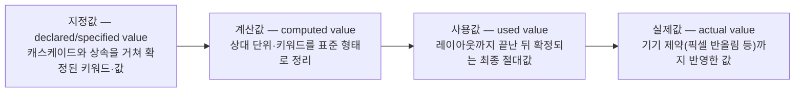

<Callout type="info">
  **이번 문서의 목표:** 이 문서를 다 읽으면 어떤 속성이 왜 상속되고 왜 안 되는지 이유를 설명할 수 있고, `inherit`·`initial`·`unset`·`revert` 네 키워드의 차이를 정확히 구분하며, `width: 50%` 같은 값이 실제 픽셀로 확정되기까지 거치는 네 단계를 순서대로 말할 수 있게 됩니다.
</Callout>

## 왜 상속이 필요한가

`<body>`에 `font-family: '맑은 고딕'`, `color: #333`을 걸었더니 그 안의 `<p>`, `<li>`, `<td>` 전부에 같은 글꼴과 글자색이 적용됩니다. 이 규칙을 요소마다 하나하나 다시 적어야 했다면 문서 하나에 같은 선언이 수백 번 반복됐을 것입니다. **상속**(inheritance)은 이 반복을 없애기 위해 일부 속성값을 부모 요소에서 자식 요소로 자동으로 흘려보내는 CSS의 기본 동작입니다.

> **쉽게 말하면:** 상속은 부모의 특징을 자식이 물려받는 것입니다. 다만 CSS는 "생김새와 관련된 특징"만 물려주고, "자리와 크기에 관련된 특징"은 물려주지 않습니다.

## 상속되는 속성과 안 되는 속성

### 왜 전부 상속되지 않는가

만약 `border`나 `margin`, `width` 같은 박스 모델 속성까지 상속됐다면 어떻게 될까요. 부모에게 `border: 1px solid black`을 걸었을 뿐인데 모든 자식 요소에 테두리가 겹겹이 그려지고, `width: 300px`을 걸면 자식들도 전부 300px로 눌려 레이아웃이 무너집니다. 그래서 CSS 명세는 속성을 만들 때마다 "이 속성은 상속되는가"를 하나씩 정해 두었습니다. 대체로 다음 기준을 따릅니다.

| 구분 | 대표 속성 | 이유 |
|------|-----------|------|
| 상속됨 (주로 타이포그래피·시각) | `color`, `font-family`, `font-size`, `font-weight`, `line-height`, `text-align`, `letter-spacing`, `visibility`, `cursor` | 문서 전체의 글자 모양·읽기 방향은 보통 통일되어야 자연스럽다 |
| 상속 안 됨 (주로 박스·배치) | `margin`, `padding`, `border`, `width`, `height`, `background`, `display`, `position` | 요소마다 자리와 크기가 다른 것이 정상이므로 자동으로 물려주면 오히려 방해가 된다 |

<Callout type="warning">
  **자주 틀리는 점:** "예쁘게 보이는 속성은 다 상속되겠지"라는 감으로 판단하면 틀립니다. `background`는 시각적인 속성처럼 보이지만 상속되지 않습니다. 배경색을 부모와 자식 모두에 입히려면 각각 지정해야 합니다. 반대로 `visibility`는 박스와 관련된 속성 같지만 상속됩니다. 이런 예외 때문에 감이 아니라 필요할 때마다 MDN 문서의 "Inherited" 항목을 확인하는 습관이 낫습니다.
</Callout>

### 확인 예시

```css
body {
  color: #222;
  font-family: sans-serif;
  border: 3px solid red; /* 상속 안 되는 속성 */
}
```

```html
<body>
  <p>이 문단은 color와 font-family를 물려받지만, border는 물려받지 않는다.</p>
</body>
```

`<p>`는 검은 글자에 산세리프 글꼴로 보이지만, 빨간 테두리가 `<p>`에도 그려지지는 않습니다. `<body>` 자기 자신에만 테두리가 그려집니다.

## 상속을 다루는 네 가지 키워드

CSS는 "자동으로 정해진 상속 여부"를 개발자가 필요할 때 뒤집을 수 있도록 네 가지 키워드를 제공합니다. 넷 다 어떤 속성에도 쓸 수 있는 전역 키워드(global keyword)입니다.

| 키워드 | 하는 일 | 예시 상황 |
|--------|---------|-----------|
| `inherit` | 원래 상속 안 되는 속성이라도 강제로 부모의 계산값을 그대로 물려받는다 | 버튼의 `border`를 감싼 링크에도 그대로 쓰고 싶을 때 |
| `initial` | 브라우저(사이트)가 무엇을 정했든 무시하고 CSS 명세가 정의한 초기값으로 되돌린다 | `display: initial`은 요소 종류와 무관하게 명세상 초기값 `inline`이 된다 |
| `unset` | 그 속성이 원래 상속되는 속성이면 `inherit`처럼, 상속 안 되는 속성이면 `initial`처럼 동작한다 | 어떤 속성인지 매번 외우기 귀찮을 때의 "안전한 기본값 되돌리기" |
| `revert` | 명세의 초기값이 아니라 **브라우저 기본 스타일시트(user agent stylesheet)의 값**으로 되돌린다 | `<li>`의 `display`를 리셋 CSS 적용 이전 상태(`list-item`)로 되돌리고 싶을 때 |

`initial`과 `revert`를 헷갈리는 경우가 많습니다. 둘 다 "되돌린다"는 느낌이지만 되돌리는 **기준선**이 다릅니다. `initial`은 CSS 명세 자체가 정한 값(예: `display`의 명세 초기값은 `inline`)으로, `revert`는 브라우저가 원래 그 태그에 깔아 둔 기본 스타일(예: `<li>`는 브라우저 기본 스타일시트에서 `display: list-item`)로 돌아갑니다.

<CodePlayground
  template="static"
  activeFile="/styles.css"
  label="initial과 revert의 차이 — li의 display로 확인하기"
  files={{
    '/index.html': `<!DOCTYPE html>
<html>
<head>
  <link rel="stylesheet" href="styles.css" />
</head>
<body>
  <ul>
    <li class="a">initial 적용</li>
    <li class="b">revert 적용</li>
    <li class="c">아무것도 안 함(비교용)</li>
  </ul>
</body>
</html>`,
    '/styles.css': `/* 리셋 CSS가 흔히 하는 것처럼 목록 스타일을 먼저 없앤다 */
li {
  display: none;
}

/* initial: 명세가 정한 초기값 inline으로 간다 — 글머리 기호가 사라진다 */
.a {
  display: initial;
}

/* revert: 브라우저가 <li>에 원래 깔아 둔 list-item으로 되돌아간다 — 글머리 기호가 살아난다 */
.b {
  display: revert;
}
`,
  }}
/>

`.a`는 글머리 기호 없이 그냥 줄글처럼 보이고, `.b`는 원래 목록처럼 글머리 기호가 붙은 채로 보입니다. `display: none`을 걸었던 규칙을 "완전히 지운 것"과 같은 효과를 내려면 `initial`이 아니라 `revert`를 써야 한다는 뜻입니다.

## 값이 확정되기까지 4단계

브라우저가 `color: inherit`이나 `width: 50%` 같은 선언을 화면에 그릴 실제 숫자로 바꾸기까지는 네 단계를 거칩니다. 이 파이프라인을 알아야 "계산상으로는 이 값이어야 하는데 화면은 다르게 나온다" 같은 상황을 추적할 수 있습니다.



### 1단계 — 지정값 (specified value)

08편의 캐스케이드와 이번 편의 상속을 거쳐 "이 요소의 이 속성에는 무슨 선언이 최종 채택되는가"가 정해진 상태입니다. `inherit`이면 부모의 계산값을 그대로 받아오고, 아무 규칙도 없으면 그 속성의 명세 초기값이 지정값이 됩니다.

### 2단계 — 계산값 (computed value)

`em`처럼 다른 값에 상대적인 단위나 `bold` 같은 키워드를 표준화된 형태로 정리하는 단계입니다. 예를 들어 부모 `font-size`가 20px이고 자식이 `font-size: 1.5em`이라면, 계산값 단계에서 `30px`로 정리됩니다. 이 계산값이 바로 자식에게 상속될 때 전달되는 값입니다(상속은 지정값이 아니라 계산값을 물려준다는 점이 중요합니다).

### 3단계 — 사용값 (used value)

`%`처럼 **레이아웃이 끝나야만** 실제 크기를 알 수 있는 값을 최종 확정하는 단계입니다. `width: 50%`는 부모의 실제 너비가 정해지기 전까지는 몇 픽셀인지 알 수 없습니다.

$$
\text{사용값(px)} = \text{부모 콘텐츠 너비(px)} \times 0.5
$$

부모의 콘텐츠 너비가 802px이라면 사용값은 401px입니다.

### 4단계 — 실제값 (actual value)

브라우저가 실제로 화면에 그리는 값으로, 기기의 픽셀 격자에 맞춰 반올림되거나 그 브라우저가 지원하지 못하는 값이 대체되는 등 마지막 제약이 반영됩니다. 위 401px이 고해상도 디스플레이의 픽셀 배율 때문에 소수점 하위 픽셀(예: 401.3px)로 계산됐다면, 실제로 화면에 그려지는 실제값은 브라우저가 반올림한 정수 픽셀입니다.

<Callout type="warning">
  **자주 틀리는 점:** "계산값과 사용값은 같은 것 아닌가"라고 생각하기 쉽지만 다릅니다. 계산값 단계에서는 `%` 값을 그대로 둡니다(레이아웃 전이라 계산할 수 없기 때문). `%`가 실제 숫자로 바뀌는 것은 사용값 단계입니다. `em`, `rem`처럼 다른 값을 알면 바로 계산할 수 있는 단위는 계산값 단계에서 이미 픽셀로 정리되지만, `%`와 `auto`처럼 레이아웃 결과에 의존하는 값은 사용값 단계까지 미뤄집니다. 단위별 정확한 계산 기준은 13편에서 다룹니다.
</Callout>

## 값을 바꿔가며 확인하기

<CodePlayground
  template="vanilla"
  activeFile="/index.js"
  showConsole
  label="상속되는 계산값과 % 사용값을 콘솔로 직접 확인하기"
  files={{
    '/index.html': `<div id="부모" style="font-size: 20px; width: 400px; border: 1px solid #999; padding: 1px;">
  <p id="자식" style="font-size: 1.5em; width: 50%;">
    이 문단의 글자 크기는 부모의 계산값을 이어받아 em으로 계산되고,
    너비는 부모 콘텐츠 너비에 대한 %로 사용값이 확정된다.
  </p>
</div>`,
    '/index.js': `const 부모 = document.getElementById("부모");
const 자식 = document.getElementById("자식");

const 자식스타일 = getComputedStyle(자식);

console.log("부모 font-size(px로 정리된 계산값):", getComputedStyle(부모).fontSize);
console.log("자식 font-size — 1.5em이 계산값 단계에서 이미 px로 확정됨:", 자식스타일.fontSize);
console.log("자식 width — 사용값(레이아웃 완료 후 실제 px):", 자식.getBoundingClientRect().width + "px");`,
  }}
/>

콘솔에서 자식의 `font-size`가 이미 `30px`(부모 20px의 1.5배)로 계산되어 있고, `width`는 부모의 실제 콘텐츠 너비에서 계산된 픽셀 값으로 나오는 것을 확인할 수 있습니다. `getComputedStyle`이 반환하는 값이 바로 계산값에 가깝고, `getBoundingClientRect`가 반환하는 값이 레이아웃까지 반영된 사용값에 해당합니다.

## 핵심 정리

- 상속은 반복을 줄이기 위한 장치이며, 타이포그래피·시각 속성은 주로 상속되고 박스·배치 속성은 주로 상속되지 않는다. 속성마다 정해져 있으므로 필요할 때 문서로 확인한다.
- `inherit`은 강제 상속, `initial`은 명세 초기값으로 리셋, `unset`은 속성 특성에 따라 `inherit` 또는 `initial`처럼 동작, `revert`는 브라우저 기본 스타일시트 값으로 리셋한다.
- 값은 지정값 → 계산값 → 사용값 → 실제값 순으로 확정된다. 상속은 계산값을 물려준다.
- `%` 같은 값은 계산값 단계에서 확정되지 못하고, 레이아웃이 끝난 사용값 단계에서야 실제 픽셀로 정해진다.
- 실제값은 기기의 픽셀 제약까지 반영한 마지막 단계로, 계산상의 숫자와 화면에 그려지는 숫자가 미세하게 다를 수 있는 이유다.

## 마무리 복습

<Quiz
  questionNumber={1}
  question="다음 중 기본적으로 상속되는 CSS 속성은?"
  options={['margin', 'border', 'color', 'width']}
  correctAnswer={3}
  explanation="color는 타이포그래피 관련 속성으로 기본적으로 상속된다. margin, border, width는 박스 모델·배치 관련 속성으로 상속되지 않는다."
  optionExplanations={['박스 모델 속성으로 상속되지 않는다', '박스 모델 속성으로 상속되지 않는다', '정답 — 대표적인 상속 속성이다', '박스 모델 속성으로 상속되지 않는다']}
/>

<Quiz
  questionNumber={2}
  question="display: initial과 display: revert의 차이를 옳게 설명한 것은?"
  options={['둘 다 완전히 같은 동작을 한다', 'initial은 브라우저 기본 스타일시트 값으로, revert는 명세 초기값으로 되돌린다', 'initial은 CSS 명세의 초기값으로, revert는 브라우저 기본 스타일시트 값으로 되돌린다', 'initial과 revert 모두 부모의 값을 그대로 물려받는다']}
  correctAnswer={3}
  explanation="initial은 CSS 명세가 정의한 초기값(예: display는 inline)으로, revert는 그 요소에 브라우저가 원래 깔아 둔 기본 스타일(예: li는 list-item)로 되돌린다."
  optionExplanations={['되돌리는 기준선이 서로 다르므로 같은 동작이 아니다', '설명이 서로 뒤바뀌었다', '정답 — 기준선이 명세 초기값이냐 브라우저 기본값이냐로 구분된다', '두 키워드 모두 부모 상속과는 관련이 없다']}
/>

<Quiz
  questionNumber={3}
  question="unset 키워드의 동작을 옳게 설명한 것은?"
  options={['모든 속성을 무조건 initial처럼 되돌린다', '모든 속성을 무조건 inherit처럼 되돌린다', '상속되는 속성이면 inherit처럼, 상속되지 않는 속성이면 initial처럼 동작한다', '값 처리 파이프라인의 사용값 단계로 강제 이동시킨다']}
  correctAnswer={3}
  explanation="unset은 그 속성이 원래 상속되는 속성이면 inherit처럼, 상속되지 않는 속성이면 initial처럼 동작하는 조건부 키워드다."
  optionExplanations={['상속되는 속성에는 inherit처럼 동작하므로 무조건은 아니다', '상속되지 않는 속성에는 initial처럼 동작하므로 무조건은 아니다', '정답 — 속성의 상속 여부에 따라 동작이 갈린다', '값 처리 단계와는 관련 없는 키워드다']}
/>

<Quiz
  questionNumber={4}
  question="부모 font-size가 20px이고 자식에 font-size: 1.5em을 지정했을 때, 값 처리 4단계 중 어느 단계에서 30px로 확정되는가?"
  options={['지정값', '계산값', '사용값', '실제값']}
  correctAnswer={2}
  explanation="em처럼 다른 값을 알면 바로 계산할 수 있는 상대 단위는 계산값 단계에서 이미 절대 픽셀로 정리된다. %처럼 레이아웃 결과가 필요한 값만 사용값 단계로 미뤄진다."
  optionExplanations={['지정값 단계에서는 아직 1.5em이라는 키워드 그대로다', '정답 — em은 계산값 단계에서 px로 확정된다', 'em은 레이아웃 없이도 계산 가능하므로 사용값까지 미뤄지지 않는다', '실제값은 기기 제약까지 반영한 마지막 단계로 이 계산과는 별개다']}
/>

<Quiz
  questionNumber={5}
  question="width: 50%가 실제 픽셀 값으로 확정되는 시점에 대한 설명으로 옳은 것은?"
  options={['지정값 단계에서 바로 픽셀로 바뀐다', '계산값 단계에서 바로 픽셀로 바뀐다', '부모의 레이아웃이 끝나 콘텐츠 너비가 확정된 뒤인 사용값 단계에서 픽셀로 바뀐다', '상속 여부와 무관하게 항상 초기값으로 대체된다']}
  correctAnswer={3}
  explanation="퍼센트 값은 부모의 실제 크기를 알아야 계산할 수 있으므로 레이아웃이 끝난 뒤인 사용값 단계에서야 절대 픽셀로 확정된다."
  optionExplanations={['지정값 단계에서는 아직 %라는 표현 그대로 남아 있다', '계산값 단계에서도 %는 아직 절대값으로 바뀌지 않는다', '정답 — 레이아웃 완료 후 사용값 단계에서 확정된다', '퍼센트는 초기값으로 대체되는 대상이 아니다']}
/>

<Quiz
  questionNumber={6}
  question="background 속성이 기본적으로 상속되지 않는 이유로 가장 적절한 설명은?"
  options={['배경은 시각적인 속성이 아니기 때문이다', '요소마다 배경을 다르게 두는 것이 일반적이며, 자동 상속되면 오히려 방해가 되기 때문이다', 'CSS 명세가 아직 이 속성의 상속 여부를 정하지 못했기 때문이다', 'background는 애초에 값 처리 파이프라인을 거치지 않기 때문이다']}
  correctAnswer={2}
  explanation="박스·배치와 관련된 속성은 요소마다 다른 것이 자연스러우므로 상속시키지 않는 것이 CSS의 일반적인 설계 기준이다."
  optionExplanations={['시각적인 속성이지만 상속 여부는 시각성과 직접 대응되지 않는다', '정답 — 박스·배치 계열 속성의 일반적인 비상속 원칙과 같은 이유다', '상속 여부는 명세에 이미 확정되어 있다', '모든 CSS 속성은 값 처리 파이프라인을 거친다']}
/>

## 참고 자료

- [MDN — Inheritance](https://developer.mozilla.org/en-US/docs/Web/CSS/Guides/Cascade/Inheritance)
- [MDN — CSS cascading and inheritance](https://developer.mozilla.org/en-US/docs/Web/CSS/Guides/Cascade)
- [MDN — Specificity](https://developer.mozilla.org/en-US/docs/Web/CSS/Guides/Cascade/Specificity)
