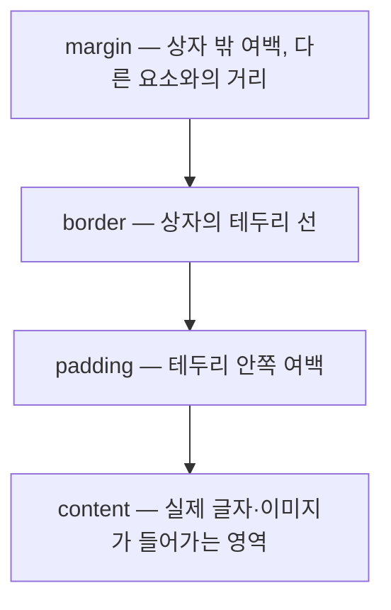

<Callout type="info">
  **이번 문서의 목표:** 이 문서를 다 읽으면 `width: 200px`을 지정한 요소가 실제로 화면에서 얼마나 넓은 자리를 차지하는지 `padding`·`border`·`box-sizing` 값을 보고 직접 계산할 수 있고, 실무에서 왜 `box-sizing: border-box`를 전역으로 까는지 설명할 수 있게 됩니다.
</Callout>

## 왜 박스 모델부터 정확히 알아야 하는가

`width: 200px`, `padding: 20px`을 준 상자가 있습니다. 그런데 실제로 화면에서 이 상자가 차지하는 폭을 재보면 200px이 아니라 240px입니다. 처음 CSS를 만지는 사람 대부분이 여기서 "버그인가"라고 의심합니다. 버그가 아닙니다. CSS는 모든 요소를 겉보기 모양과 무관하게 항상 **사각형 상자**로 취급하고, 이 상자를 네 겹으로 쌓아 크기를 계산합니다. 그 계산 규칙을 **박스 모델**(box model)이라고 부릅니다.

> **쉽게 말하면:** 박스 모델은 상자 포장을 생각하면 됩니다. 내용물(콘텐츠) 위에 완충재(패딩)를 두르고, 그 위에 상자 벽(보더)을 두르고, 상자 밖에는 다른 상자와의 간격(마진)을 둡니다. `width`는 기본적으로 **내용물만의 폭**이라, 완충재와 벽은 별도로 더해집니다.

## 박스 모델의 4겹 구조



| 겹 | 뜻 | 배경색이 칠해지는가 | 크기에 포함되는가(초기값 기준) |
|----|----|--------------------|-------------------------------|
| content | 글자·이미지 등 실제 내용이 놓이는 영역 | 칠해짐 | `width`/`height`가 이 영역을 지정 |
| padding | 내용과 테두리 사이 안쪽 여백 | 칠해짐(배경색이 패딩까지 번짐) | `width`에 포함 안 됨(더해짐) |
| border | 상자를 두르는 테두리 선 | 테두리 자체 색만 | `width`에 포함 안 됨(더해짐) |
| margin | 다른 요소와의 바깥 간격 | 칠해지지 않음(항상 투명) | 상자 자기 크기에는 포함 안 됨 |

`padding`까지는 배경색이 번진다는 점이 `margin`과의 결정적 차이입니다. 배경색이 안 보이는 여백을 만들고 싶다면 `padding`이 아니라 `margin`을 써야 합니다.

## content-box — 초기값의 계산 방식

`box-sizing`(박스 크기 결정 방식)의 초기값은 **`content-box`**입니다. 이 값에서는 `width`·`height`가 딱 content 영역만을 가리키고, `padding`과 `border`는 거기에 더해집니다.

$$
\text{전체 폭} = width + padding_{left} + padding_{right} + border_{left} + border_{right}
$$

- $width$: 지정한 콘텐츠 폭
- $padding_{left}, padding_{right}$: 좌우 안쪽 여백
- $border_{left}, border_{right}$: 좌우 테두리 두께

### 계산 연습

```css
.box {
  box-sizing: content-box; /* 초기값이므로 생략해도 동일 */
  width: 200px;
  padding: 20px;
  border: 5px solid navy;
}
```

| 항목 | 값(px) |
|------|--------|
| content 폭 (`width`) | 200 |
| 좌우 padding 합 | 20 + 20 = 40 |
| 좌우 border 합 | 5 + 5 = 10 |
| **전체 폭** | 200 + 40 + 10 = **250** |

`width: 200px`을 줬는데 실제로 화면에서 250px짜리 자리를 차지합니다. 처음에 이 문서 앞머리에서 든 상황이 바로 이것입니다.

## border-box — width에 padding·border를 포함시키기

`box-sizing: border-box`는 계산 기준 자체를 바꿉니다. 이제 `width`가 **content + padding + border를 모두 합친 전체 폭**을 가리킵니다. 그래서 `padding`이나 `border`를 늘리면 상자의 전체 크기는 그대로 유지되고, 대신 content 영역이 그만큼 줄어듭니다.

$$
\text{content 폭} = width - padding_{left} - padding_{right} - border_{left} - border_{right}
$$

### 같은 조건, 다른 계산

```css
.box {
  box-sizing: border-box;
  width: 200px;
  padding: 20px;
  border: 5px solid navy;
}
```

| 항목 | 값(px) |
|------|--------|
| 지정한 `width`(이제 전체 폭) | 200 |
| 좌우 padding 합 | 40 |
| 좌우 border 합 | 10 |
| **실제 content 폭** | 200 − 40 − 10 = **150** |
| **전체 폭(변화 없음)** | **200** |

같은 CSS 선언인데 `box-sizing` 한 줄 차이로 전체 폭이 250px과 200px로 갈립니다. `content-box`는 "내용물 크기를 고정하고 포장이 늘어난 만큼 상자가 커지는" 방식이고, `border-box`는 "상자 크기를 고정하고 포장이 늘어난 만큼 내용물이 줄어드는" 방식입니다.

| 비교 | `content-box`(초기값) | `border-box` |
|------|------------------------|--------------|
| `width`가 가리키는 범위 | content만 | content + padding + border |
| padding·border를 늘리면 | 전체 크기가 커짐 | 전체 크기 고정, content가 줄어듦 |
| 퍼센트 레이아웃에서 | padding 추가 시 총합이 100% 넘기 쉬움 | 100% 안에서 안전하게 맞아떨어짐 |

## 실무에서 border-box를 전역으로 까는 이유

여러 단을 나눠 퍼센트로 폭을 배분하는 레이아웃을 생각해 보겠습니다. 두 칸을 각각 `width: 50%`로 나누고 카드마다 `padding: 16px`, `border: 1px solid`을 주고 싶습니다. `content-box`라면 각 칸의 실제 폭은 "50% + 패딩 32px + 보더 2px"이 되어, 두 칸을 합치면 100%를 훌쩍 넘어 줄바꿈되거나 겹칩니다. `border-box`라면 `width: 50%`가 패딩·보더를 포함한 값이므로, 두 칸을 합치면 정확히 100%로 맞아떨어집니다.

이런 이유로 실무 CSS는 거의 항상 문서 맨 앞에서 전체 요소에 `border-box`를 강제합니다.

```css
*,
*::before,
*::after {
  box-sizing: border-box;
}
```

전체 선택자(`*`)로 모든 요소에 적용하고, 의사 요소(`::before`, `::after`)도 콘텐츠를 만들어내는 별도 상자이므로 함께 포함시키는 것이 관행입니다.

<Callout type="warning">
  **자주 틀리는 점:** `box-sizing: border-box`가 padding과 border를 "없애는" 것으로 착각하기 쉽습니다. 그렇지 않습니다. padding과 border는 여전히 그려집니다. 다만 그 몫을 `width`가 지정한 전체 크기 **안에서 빼먹는** 것이지, `width` 계산에서 완전히 빠지는 것이 아닙니다.
</Callout>

## 값을 바꿔가며 확인하기

<CodePlayground
  template="static"
  activeFile="/styles.css"
  label="box-sizing 값을 바꿔가며 상자 전체 폭이 어떻게 달라지는지 확인하기"
  files={{
    '/index.html': `<!DOCTYPE html>
<html>
<head>
  <link rel="stylesheet" href="styles.css" />
</head>
<body>
  <div class="wrapper">
    <div class="box">
      width: 200px, padding: 20px, border: 5px
    </div>
  </div>
</body>
</html>`,
    '/styles.css': `.wrapper {
  width: 260px;
  background: #eee;
  padding: 4px;
}

.box {
  /* box-sizing 값을 content-box <-> border-box로 바꿔가며
     상자가 wrapper를 넘치는지, 딱 맞는지 관찰해 보세요 */
  box-sizing: content-box;
  width: 200px;
  padding: 20px;
  border: 5px solid navy;
  background: skyblue;
}
`,
  }}
/>

`content-box` 상태에서는 상자의 전체 폭(250px)이 회색 `wrapper`(260px)보다 살짝 좁아 보이지만, `padding`을 30px로 늘리면 금방 `wrapper`를 넘칩니다. `box-sizing: border-box`로 바꾸면 `padding`을 아무리 늘려도 상자의 전체 폭은 항상 200px로 고정되고, 그 대신 안쪽 내용 영역이 좁아지는 것을 확인할 수 있습니다.

## 마진은 상자 크기 계산에 들어가지 않는다

지금까지의 계산식 어디에도 `margin`은 없었습니다. `margin`은 상자 **자신의 크기**가 아니라 그 상자가 다른 요소와 얼마나 떨어져 있는가를 정하는 값이기 때문입니다. 그래서 `margin: 20px`을 줘도 그 요소의 `width`나 `getBoundingClientRect().width` 값은 변하지 않고, 대신 옆이나 아래 요소와의 간격이 벌어집니다. 이 간격이 항상 예상대로 더해지지는 않는다는 것, 특히 세로 방향에서 두 마진이 겹쳐 하나로 합쳐지는 현상이 있다는 것을 다음 12편(마진 상쇄)에서 실제 픽셀로 추적합니다.

## 핵심 정리

- 박스 모델은 모든 요소를 content·padding·border·margin 네 겹으로 계산한다. margin만 유일하게 배경색이 칠해지지 않고 상자 자체 크기에도 포함되지 않는다.
- `box-sizing`의 초기값 `content-box`에서는 전체 폭이 `width + 좌우 padding + 좌우 border`로, padding·border가 늘어날수록 상자가 커진다.
- `box-sizing: border-box`에서는 `width`가 전체 폭을 가리키고, padding·border가 늘어날수록 content 영역이 줄어들며 전체 크기는 고정된다.
- 퍼센트로 폭을 나누는 레이아웃에서 `border-box`가 100%를 안전하게 맞추기 쉬워, 실무는 `*` 선택자로 전역 `border-box`를 깐다.
- `box-sizing`이 padding·border를 없애는 것이 아니라, 그 몫을 `width`가 지정한 범위 안에서 나눠 가지도록 계산 기준만 바꾼다.

## 마무리 복습

<Quiz
  questionNumber={1}
  question="box-sizing: content-box에서 width: 150px, padding: 10px, border: 2px solid일 때(좌우 각각) 전체 폭은?"
  options={['150px', '160px', '174px', '162px']}
  correctAnswer={3}
  explanation="전체 폭 = width + 좌우 padding + 좌우 border = 150 + (10+10) + (2+2) = 174px."
  optionExplanations={['padding과 border가 더해지지 않은 값이다', 'border를 빠뜨린 계산이다', '정답 — 150 + 20 + 4 = 174px', 'padding 한쪽만 더한 계산이다']}
/>

<Quiz
  questionNumber={2}
  question="box-sizing: border-box에서 width: 150px, padding: 10px, border: 2px solid일 때(좌우 각각) 실제 content 폭은?"
  options={['150px', '126px', '138px', '174px']}
  correctAnswer={2}
  explanation="content 폭 = width - 좌우 padding - 좌우 border = 150 - 20 - 4 = 126px. 전체 폭은 150px로 고정된다."
  optionExplanations={['150px은 전체 폭이지 content 폭이 아니다', '정답 — 150 - 20 - 4 = 126px', 'border만 뺀 계산으로 padding이 누락됐다', '이는 content-box일 때의 전체 폭 계산이다']}
/>

<Quiz
  questionNumber={3}
  question="박스 모델의 네 겹 중 배경색이 칠해지지 않고 상자 자신의 크기 계산에도 포함되지 않는 것은?"
  options={['content', 'padding', 'border', 'margin']}
  correctAnswer={4}
  explanation="margin은 항상 투명하며, 상자 자기 크기가 아니라 다른 요소와의 거리를 나타내는 값이라 크기 계산에 포함되지 않는다."
  optionExplanations={['배경색이 칠해지는 영역이다', '배경색이 번지는 영역이다', '테두리 색이 칠해지는 영역이다', '정답 — margin은 투명하고 크기 계산에서 별도다']}
/>

<Quiz
  questionNumber={4}
  question="실무에서 `*`, `*::before`, `*::after`에 box-sizing: border-box를 전역으로 거는 가장 핵심적인 이유는?"
  options={['border-box가 content-box보다 렌더링 속도가 빠르기 때문이다', '퍼센트 기반 레이아웃에서 padding·border를 더해도 전체 합이 100%를 넘지 않게 하기 위해서다', 'content-box는 브라우저마다 결과가 다르게 나오는 버그가 있기 때문이다', 'margin 상쇄 현상을 없애기 위해서다']}
  correctAnswer={2}
  explanation="border-box는 width가 padding·border까지 포함하므로 퍼센트로 나눈 칸에 안쪽 여백과 테두리를 추가해도 전체 폭 합이 의도한 100%를 넘지 않는다."
  optionExplanations={['렌더링 속도 차이는 이 선택의 근거가 아니다', '정답 — 퍼센트 레이아웃의 예측 가능성 때문이다', 'content-box는 명세대로 동작하며 버그가 아니다', 'margin 상쇄는 box-sizing과 별개의 현상이다']}
/>

<Quiz
  questionNumber={5}
  question="width: 100px인 요소에 margin: 20px을 추가로 주면 이 요소의 width 계산값에 생기는 변화는?"
  options={['100px에서 140px로 늘어난다', '100px에서 120px로 늘어난다', '변화 없이 100px 그대로이며, 다른 요소와의 간격만 늘어난다', 'box-sizing 값에 따라 다르게 계산된다']}
  correctAnswer={3}
  explanation="margin은 상자 자신의 width 계산에 들어가지 않는다. 요소 자체의 폭은 그대로이고, 옆이나 위아래 요소와의 거리만 벌어진다."
  optionExplanations={['margin은 width 계산에 더해지지 않는다', '마찬가지로 margin은 width에 더해지지 않는다', '정답 — margin은 간격만 바꾸고 자기 크기는 바꾸지 않는다', 'margin의 처리 방식은 box-sizing과 무관하게 항상 동일하다']}
/>

<Quiz
  questionNumber={6}
  question="CSS box-sizing 속성의 초기값(별도로 지정하지 않았을 때 브라우저가 쓰는 값)은?"
  options={['border-box', 'content-box', 'padding-box', 'margin-box']}
  correctAnswer={2}
  explanation="box-sizing의 명세상 초기값은 content-box다. width가 padding·border를 포함하지 않는 전통적인 계산 방식이 기본값이다."
  optionExplanations={['border-box는 초기값이 아니라 명시적으로 지정해야 하는 값이다', '정답 — content-box가 초기값이다', 'padding-box는 CSS box-sizing 값으로 존재하지 않는다', 'margin-box도 box-sizing 값으로 존재하지 않는다']}
/>

## 참고 자료

- [MDN — CSS box model](https://developer.mozilla.org/en-US/docs/Web/CSS/Guides/Box_model)
- [MDN — CSS box sizing](https://developer.mozilla.org/en-US/docs/Web/CSS/Guides/Box_sizing)
