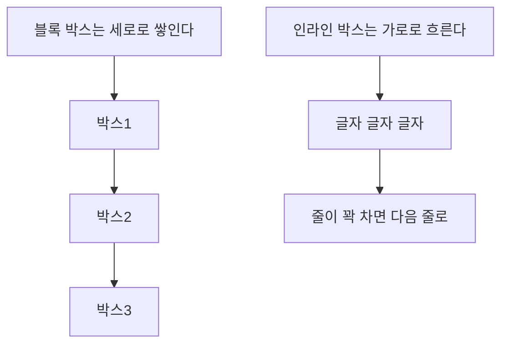

<Callout type="info">
  **이번 문서의 목표:** 이 문서를 다 읽으면 어떤 요소가 왜 줄 바꿈되어 쌓이고 어떤 요소는 옆으로 나란히 붙는지 `display` 값으로 설명하고, `<span>`에 `width`를 줘도 반영되지 않는 이유를 근본 원리로 짚을 수 있게 됩니다.
</Callout>

## 왜 같은 태그인데 어떤 건 세로로, 어떤 건 가로로 쌓이는가

`<div>` 두 개를 나란히 두면 위아래로 쌓이는데, `<span>` 두 개를 나란히 두면 옆으로 붙습니다. HTML 태그 이름 자체가 이 배치를 결정하는 것이 아닙니다. **모든 브라우저가 기본으로 갖고 있는 스타일시트**(user agent stylesheet, 사용자 에이전트 스타일시트 — 08편에서 다룬 캐스케이드의 "출처" 중 하나)가 `div`에는 `display: block`을, `span`에는 `display: inline`을 미리 지정해 두었기 때문입니다. 즉 **display는 CSS 속성**이고, 태그 이름은 그 속성의 기본값을 결정하는 실마리일 뿐입니다.

## 1. display의 네 가지 기본값

### block — 한 줄을 통째로 차지

`display: block`인 요소는 부모의 가용 너비를 가로로 꽉 채우고, 앞뒤 요소를 밀어내며 새 줄에서 시작합니다. `<div>`, `<p>`, `<h1>`~`<h6>`, `<ul>`, `<li>`가 기본값이 `block`인 대표적인 요소입니다.

- `width`, `height`가 그대로 적용됩니다.
- `margin`, `padding`을 위아래·좌우 모두 지정한 대로 반영합니다.
- `width`를 지정하지 않으면 부모의 가용 너비를 자동으로 채웁니다.

### inline — 글자처럼 흐름을 따라 흐름

`display: inline`인 요소는 마치 글자 한 덩어리처럼 취급되어, 줄바꿈 없이 앞뒤 콘텐츠와 나란히 흐릅니다. `<span>`, `<a>`, `<strong>`, `<em>`이 기본값이 `inline`인 대표적인 요소입니다.

- `width`, `height`를 지정해도 **무시됩니다.**
- `margin`, `padding`의 **위·아래**는 시각적으로 다른 줄을 침범하는 방향으로는 적용되지 않습니다(좌우는 정상 적용).
- 콘텐츠의 실제 크기만큼만 공간을 차지합니다.

### inline-block — 흐름은 인라인처럼, 크기는 블록처럼

`display: inline-block`은 두 성질을 절반씩 가져옵니다. **줄바꿈 없이 옆으로 나란히 놓이면서도**, `width`·`height`·상하좌우 `margin`·`padding`을 블록 요소처럼 온전히 적용받습니다. 버튼이나 네브바 메뉴 항목처럼 "옆으로 나란히 두되 크기는 내가 정하고 싶다"는 요구에 오랫동안 쓰여온 값입니다(다만 20편의 Flexbox가 이 역할을 더 유연하게 대체하는 경우가 많습니다).

### none — 아예 존재하지 않는 것처럼

`display: none`인 요소는 화면에서 완전히 사라지고, **공간조차 차지하지 않습니다.** 다른 요소들이 마치 그 요소가 원래 없었던 것처럼 자리를 채웁니다.

| 값 | 줄바꿈 | width/height 적용 | 상하 margin/padding | 공간 차지 |
|-----|--------|---------------------|----------------------|-----------|
| `block` | 함(새 줄에서 시작) | 적용됨 | 적용됨 | 함 |
| `inline` | 안 함(글자처럼 흐름) | 무시됨 | 시각적으로 미적용(좌우는 적용) | 콘텐츠 크기만큼 |
| `inline-block` | 안 함 | 적용됨 | 적용됨 | 콘텐츠 또는 지정 크기만큼 |
| `none` | 해당 없음 | 해당 없음 | 해당 없음 | 안 함(공간 자체가 사라짐) |

<Callout type="warning">
  **자주 틀리는 점:** `display: none`과 자주 헷갈리는 것이 `visibility: hidden`입니다. `visibility: hidden`은 요소를 눈에 안 보이게만 할 뿐 **자리는 그대로 차지**합니다. 반면 `display: none`은 자리 자체를 없앱니다. 접근성 관점에서도 차이가 있습니다. 스크린 리더는 `display: none`과 `visibility: hidden` 요소를 모두 건너뛰지만, 키보드로 `Tab` 이동 시에는 `visibility: hidden` 요소도 애초에 화면에 없는 것과 같이 취급되어 포커스가 가지 않습니다. "화면에서만 숨기고 스크린 리더에는 읽히게 하고 싶다"는 요구(흔히 `sr-only` 클래스로 구현)는 이 둘과 또 다른 별도의 기법이 필요하며, 이 과목의 범위를 넘어서므로 이름만 짚고 넘어갑니다.
</Callout>

## 2. 정상 흐름 — 브라우저의 기본 배치 알고리즘

**정상 흐름**(normal flow, 노멀 플로우)은 `position`(18편)이나 `float`(19편)로 특별히 손대지 않았을 때, 브라우저가 문서에 나타난 순서 그대로 요소를 배치하는 기본 규칙입니다. 이 흐름 안에서 블록 박스와 인라인 박스는 서로 다른 방향으로 쌓입니다.



블록 박스는 **블록 축**(block axis, 보통 세로 방향)을 따라 위에서 아래로 순서대로 쌓입니다. 인라인 박스는 **인라인 축**(inline axis, 보통 가로 방향)을 따라 흐르다가, 한 줄의 너비를 넘으면 다음 줄로 자동으로 넘어갑니다. 이 두 축 이름이 "블록"과 "인라인"이라는 값 이름의 유래이기도 합니다.

<Callout type="warning">
  **자주 틀리는 점:** "블록 축이 항상 세로"라고 절대적으로 외우면 안 됩니다. 문서가 세로쓰기(`writing-mode`)로 설정된 경우 블록 축이 가로가 될 수 있습니다. 다만 이는 이 과목의 범위를 넘는 드문 상황이며, 이 문서와 이 과목 전체는 일반적인 가로쓰기 기준(블록 축 = 세로, 인라인 축 = 가로)으로 설명합니다.
</Callout>

## 3. 왜 인라인 요소에 width가 안 먹히는가

인라인 요소가 `width`를 무시하는 것은 버그가 아니라 **설계 의도**입니다. 인라인 박스는 "문장 중간에 낀 글자 조각"으로 취급되기 때문에, 한 줄 안에서 줄바꿈이 일어나면 **하나의 인라인 요소가 여러 줄에 걸쳐 쪼개질 수 있습니다.**

```html
<p>이 문장 중간에 <a href="#">아주 길어서 줄바꿈이 일어날 수도 있는 링크 텍스트</a>가 있습니다.</p>
```

위 코드에서 `<a>` 태그 하나가 화면에서는 두 줄에 걸쳐 나뉘어 보일 수 있습니다. 하나의 상자가 두 줄로 쪼개진 상태에서 "이 요소의 너비는 300px"라는 지시는 애초에 성립하지 않습니다. 그래서 스펙 차원에서 인라인 요소는 `width`/`height`를 아예 받지 않도록 정의되어 있습니다.

<CodePlayground
  template="static"
  activeFile="/styles.css"
  label="display 값을 바꿔가며 width·height·margin 적용 여부를 비교하세요"
  files={{
    '/index.html': `<link rel="stylesheet" href="styles.css">
<p>
  텍스트 안에 <span class="상자">span 요소</span>가 끼어 있습니다.
  display 값을 바꿔 width가 적용되는지 확인하세요.
</p>`,
    '/styles.css': `.상자 {
  /* display를 inline, inline-block, block으로 바꿔가며 비교하세요 */
  display: inline;
  width: 150px;
  height: 40px;
  margin: 20px;
  background: #bfdbfe;
  border: 1px solid #3b82f6;
}`,
  }}
/>

`display: inline`일 때는 `width: 150px`와 `height: 40px`가 무시되고 글자 크기만큼만 배경색이 칠해지는 것을 확인할 수 있습니다. `inline-block`이나 `block`으로 바꾸면 지정한 크기 그대로 반영됩니다.

## 4. display 값 자체가 요소의 "역할"을 바꾼다

여기서 반드시 짚어야 할 사실이 있습니다. `display`는 **시각적 배치 방식만 바꾸는 것이 아니라, 그 요소가 CSS 레이아웃 알고리즘 안에서 하는 역할 자체를 바꿉니다.** 예를 들어 `<li>`의 기본값은 `list-item`이라는 별도의 값으로, 목록 마커(불릿·번호)를 자동으로 붙이는 역할까지 겸합니다. `<li>`에 `display: block`을 주면 시각적으로는 비슷해 보여도 목록 마커가 사라집니다.

또한 `display: flex`(20편)나 `display: grid`(23편)를 주면, 그 요소의 **자식들**이 정상 흐름을 완전히 벗어나 각각 다른 배치 알고리즘(플렉스 레이아웃, 그리드 레이아웃)을 따르게 됩니다. 즉 `display`는 "나 자신을 어떻게 보여줄까"와 "내 자식들을 어떤 규칙으로 배치할까"라는 두 가지를 동시에 정하는 속성입니다. 이 이중 역할은 CSS 사양에서 `display: block flex`처럼 두 키워드로 나눠 쓸 수도 있지만, 실무에서는 여전히 `flex`, `grid` 같은 단일 키워드 표기가 훨씬 널리 쓰입니다.

## 핵심 정리

- `display`는 HTML 태그가 아니라 CSS 속성이며, 브라우저 기본 스타일시트가 태그마다 다른 초깃값을 미리 지정해 둔 것뿐이다.
- `block`은 줄 전체를 차지하며 세로로 쌓이고, `inline`은 글자처럼 가로로 흐르며 `width`/`height`가 무시되고, `inline-block`은 가로로 흐르면서도 크기를 온전히 지정할 수 있고, `none`은 자리 자체를 없앤다.
- 인라인 요소가 `width`를 무시하는 이유는 하나의 인라인 박스가 줄바꿈에 따라 여러 줄로 쪼개질 수 있어 "너비"라는 개념이 애초에 성립하지 않기 때문이다.
- `display`는 시각적 배치뿐 아니라 요소의 역할(목록 마커 등)과 자식들이 따를 배치 알고리즘까지 함께 결정한다.

## 마무리 복습

<Quiz
  questionNumber={1}
  question="div 요소가 기본적으로 새 줄에서 시작해 가로 폭 전체를 차지하는 이유는?"
  options={['div 태그 자체에 그런 성질이 내장되어 있어서', '브라우저 기본 스타일시트가 div의 display를 block으로 지정해 두었기 때문', 'HTML 파서가 div를 특별 취급하기 때문', 'CSS를 전혀 적용하지 않으면 모든 요소가 이렇게 동작하기 때문']}
  correctAnswer={2}
  explanation="div 태그 자체에 배치 성질이 내장된 것이 아니라, 브라우저의 기본(user agent) 스타일시트가 div 선택자에 display: block을 지정해 둔 CSS 규칙 때문이다."
  optionExplanations={['태그 이름 자체에는 배치 성질이 없다', '정답 — 기본 스타일시트의 CSS 규칙 때문이다', 'HTML 파서는 배치를 결정하지 않는다', 'CSS가 없어도 브라우저 기본 스타일시트는 항상 적용된다']}
/>

<Quiz
  questionNumber={2}
  question="span 요소에 width: 200px을 지정했는데 반영되지 않는다면 가장 먼저 의심할 것은?"
  options={['오타로 width 속성 이름이 잘못되었다', 'display가 inline으로 되어 있어 width가 무시되고 있다', 'span은 애초에 스타일을 적용할 수 없는 태그다', '브라우저가 오래되어 CSS를 지원하지 않는다']}
  correctAnswer={2}
  explanation="span의 기본 display 값은 inline이며, inline 요소는 width·height를 지정해도 무시하도록 스펙에 정의되어 있다. inline-block이나 block으로 바꾸면 반영된다."
  optionExplanations={['width는 표준 속성 이름이므로 오타 문제가 아니다', '정답 — inline 요소는 width를 무시한다', 'span도 다른 요소처럼 대부분의 CSS 속성을 적용받을 수 있다', '현재 대부분의 브라우저는 이 기본 CSS를 지원한다']}
/>

<Quiz
  questionNumber={3}
  question="인라인 요소가 width를 받지 않도록 설계된 근본적인 이유는?"
  options={['인라인 요소는 색상 속성만 적용할 수 있기 때문', '하나의 인라인 박스가 줄바꿈에 따라 여러 줄로 쪼개질 수 있어 너비 개념이 성립하지 않기 때문', '브라우저 성능을 아끼기 위한 임의의 제약이기 때문', '인라인 요소는 항상 화면 전체 너비를 차지해야 하기 때문']}
  correctAnswer={2}
  explanation="인라인 박스는 문장 중간에 있다가 줄바꿈 지점에서 여러 줄로 나뉠 수 있다. 하나의 요소가 여러 줄에 걸쳐 쪼개진 상태에서는 단일한 너비 값이 의미를 가질 수 없다."
  optionExplanations={['인라인 요소도 폰트·여백 등 다양한 속성을 적용받는다', '정답 — 줄바꿈에 따라 쪼개질 수 있어 너비 개념이 성립하지 않는다', '성능과는 무관한 레이아웃 모델상의 이유다', '오히려 콘텐츠 크기만큼만 차지하며 전체 너비를 차지하지 않는다']}
/>

<Quiz
  questionNumber={4}
  question="display: none과 visibility: hidden의 차이로 옳은 것은?"
  options={['둘 다 요소가 차지하던 공간을 그대로 남긴다', 'display: none은 공간을 없애고, visibility: hidden은 공간을 그대로 차지한다', 'display: none은 스크린 리더에 읽히고 visibility: hidden은 읽히지 않는다', '두 속성은 완전히 동일하게 동작한다']}
  correctAnswer={2}
  explanation="display: none은 요소를 레이아웃에서 완전히 제거해 공간 자체가 사라지지만, visibility: hidden은 눈에만 안 보일 뿐 원래 차지하던 공간을 그대로 유지한다."
  optionExplanations={['display: none은 공간 자체를 없앤다', '정답 — 공간 처리 방식이 다르다', '둘 다 기본적으로 스크린 리더가 건너뛴다', '공간 처리와 포커스 이동 방식이 서로 다르다']}
/>

<Quiz
  questionNumber={5}
  question="display: inline-block에 대한 설명으로 옳은 것은?"
  options={['block처럼 항상 새 줄에서 시작한다', 'inline처럼 옆으로 나란히 놓이면서도 width·height·상하 margin이 온전히 적용된다', 'width·height를 지정해도 inline과 마찬가지로 무시된다', 'none과 동일하게 공간을 차지하지 않는다']}
  correctAnswer={2}
  explanation="inline-block은 배치(줄바꿈 없이 나란히 놓임)는 inline을 따르면서도, 크기와 여백 처리(width·height·상하 margin/padding 적용)는 block처럼 동작하는 값이다."
  optionExplanations={['inline-block은 새 줄에서 시작하지 않고 나란히 놓인다', '정답 — 배치는 inline, 크기 처리는 block을 따른다', 'inline-block은 크기 지정이 정상적으로 반영된다', '공간을 정상적으로 차지하며 none과는 완전히 다르다']}
/>

<Quiz
  questionNumber={6}
  question="li 요소의 기본 display 값인 list-item 대신 display: block을 지정하면 일어나는 일은?"
  options={['요소가 화면에서 완전히 사라진다', '목록 마커(불릿·번호)가 사라진다', 'width와 height가 무시된다', '형제 요소들이 가로로 나란히 재배치된다']}
  correctAnswer={2}
  explanation="list-item은 시각적 배치뿐 아니라 목록 마커를 자동으로 붙이는 역할까지 겸하는 값이다. block으로 바꾸면 세로로 쌓이는 시각적 배치는 비슷해 보여도 마커를 붙이는 역할은 사라진다."
  optionExplanations={['display: block도 여전히 공간을 차지하며 화면에 표시된다', '정답 — 마커를 붙이는 역할이 list-item에만 있어 사라진다', 'block은 inline과 달리 width·height를 그대로 적용한다', 'block은 세로로 쌓이는 값이며 가로 배치와 무관하다']}
/>

<Quiz
  questionNumber={7}
  question="부모 요소에 display: flex를 지정했을 때 직접적인 영향을 받는 대상은?"
  options={['부모의 조부모 요소', '부모의 형제 요소들', '부모 요소의 자식들이 따르는 배치 알고리즘', '문서 전체의 기본 글꼴']}
  correctAnswer={3}
  explanation="display는 요소 자신의 배치뿐 아니라 그 자식들이 어떤 배치 알고리즘을 따를지도 함께 정한다. display: flex를 준 요소의 자식들은 정상 흐름을 벗어나 플렉스 레이아웃 규칙을 따르게 된다."
  optionExplanations={['조부모 요소의 배치 방식은 이 속성과 무관하게 유지된다', '형제 요소는 이 부모의 display 값과 관계없이 자신의 display를 따른다', '정답 — 자식들이 플렉스 레이아웃 규칙을 따르게 된다', 'display는 글꼴이 아니라 배치 알고리즘을 결정하는 속성이다']}
/>

## 참고 자료

- [MDN — Block and inline layout in normal flow](https://developer.mozilla.org/en-US/docs/Web/CSS/Guides/Display/Block_and_inline_layout)
