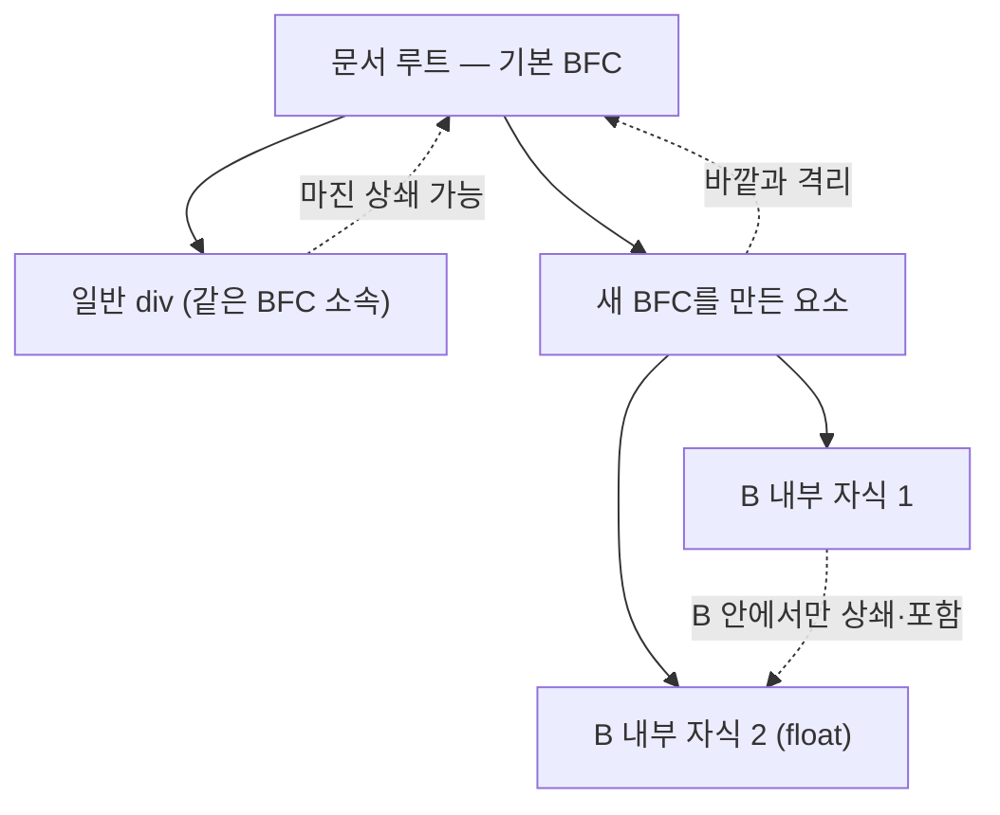

<Callout type="info">
  **이번 문서의 목표:** 이 문서를 다 읽으면 특정 요소 안에서 마진 상쇄가 갑자기 멈추거나 float 자식이 부모 높이를 무너뜨리지 않는 이유를 "블록 서식 맥락"이라는 하나의 개념으로 설명하고, `display: flow-root`로 원하는 곳에 이 맥락을 직접 만들 수 있게 됩니다.
</Callout>

## 왜 이 개념이 필요한가

앞선 12편(마진 상쇄)에서 형제 요소끼리, 또는 부모와 자식끼리 마진(margin, 여백)이 합쳐지는 규칙을 봤습니다. 그런데 실무에서 코드를 짜다 보면 이상한 순간을 만납니다. 분명 마진 상쇄 조건을 만족하는데 **어떤 부모 안에서는 상쇄가 안 일어납니다.** 또 다른 상황에서는, 자식 요소에 `float`를 걸었더니 부모 요소의 높이가 `0`이 되어 버립니다. 자식이 눈에 보이는데도 부모가 자식을 "못 본 척"하는 것입니다.

두 현상은 서로 관련 없어 보이지만 원인이 하나입니다. 특정 조건에서 요소가 **독립된 미니 레이아웃 영역**이 되고, 그 안과 밖의 상호작용 규칙이 달라지기 때문입니다. 이 영역을 **블록 서식 맥락**(Block Formatting Context, BFC, 블록 포매팅 컨텍스트)이라고 부릅니다.

> **쉽게 말하면:** BFC는 방음 스튜디오입니다. 스튜디오 밖의 소음(마진 상쇄, float의 영향)이 안으로 못 들어오고, 안의 소리(내부 float의 삐져나옴)도 밖으로 못 나갑니다.

## 서식 맥락이란 무엇인가

**서식 맥락**(formatting context, 포매팅 컨텍스트)이라는 용어부터 뜯어봅니다. **포매팅**(formatting)은 "요소를 화면에 어떻게 배치할지 정하는 규칙", **컨텍스트**(context, 맥락)는 "그 규칙이 적용되는 범위"입니다. 즉 서식 맥락이란 **"이 영역 안의 자식들은 이런 규칙으로 배치된다"는 규칙 묶음이 적용되는 영역**입니다.

브라우저가 지금까지 다룬 정상 흐름(normal flow)도 사실은 하나의 서식 맥락입니다. 블록 박스는 위아래로 쌓이고 인라인 박스는 옆으로 흐른다는 16편의 규칙 전체가 바로 **BFC의 기본 동작**입니다. 문서 최상위(루트 요소)는 항상 하나의 BFC이고, 그 안에서 특정 조건을 만족한 요소는 **자기 자신만의 새로운 BFC**를 만들어 그 규칙 적용 범위를 자기 내부로 한정합니다.



## BFC는 언제 새로 생기는가

다음 조건 중 하나만 만족해도 그 요소는 새로운 BFC의 시작점이 됩니다.

| 조건 | 지원 상태 | 비고 |
|------|-----------|------|
| `float`가 `none`이 아님 | 널리 사용 가능 | float 자기 자신이 BFC를 만든다 |
| `position`이 `absolute` 또는 `fixed` | 널리 사용 가능 | 18편에서 다루는 배치 방식 |
| `display: inline-block` | 널리 사용 가능 | 인라인처럼 흐르지만 내부는 BFC |
| `display: flow-root` | 널리 사용 가능 | BFC 생성을 목적으로 W3C가 만든 전용 값 |
| `display: flex`, `display: grid`인 요소의 **직계 자식이 아닌 자기 자신** | 널리 사용 가능 | flex·grid 컨테이너 자체가 BFC(또는 이에 준하는 독립 맥락)를 형성 |
| `overflow`가 `visible`이 아님 (`hidden`·`scroll`·`auto`) | 널리 사용 가능 | 가장 흔히 "우연히" 쓰이던 방법 |

표에서 눈여겨볼 것은 `overflow: hidden`입니다. 이 속성은 원래 "넘치는 내용을 잘라내라"는 뜻인데, 부수 효과로 BFC를 만듭니다. 과거 개발자들은 이 부수 효과를 이용해 float 문제를 해결해 왔습니다. 문제는 `overflow: hidden`이 진짜로 내용을 잘라내 버려서, 그림자(box-shadow)나 툴팁처럼 박스 밖으로 나가야 하는 요소가 잘려나가는 부작용이 있었다는 점입니다. 이 부작용을 없애기 위해 W3C가 "잘라내기는 없이 BFC만 만드는" 전용 값 `flow-root`를 나중에 추가했습니다.

## BFC가 실제로 하는 일 1 — 마진 상쇄를 그 안에 가둔다

12편에서 부모-자식 마진 상쇄가 일어나려면 부모와 자식 사이에 경계(패딩·보더·BFC 등)가 없어야 한다고 배웠습니다. 부모가 새로운 BFC라면, 그 자체가 "경계"로 작동해 부모 바깥의 마진과 자식의 마진이 서로 만나지 못합니다.

```html
<!-- 부모가 일반 요소일 때: 자식의 margin-top이 부모를 뚫고 나가 부모 바깥 마진과 상쇄된다 -->
<div class="parent">
  <p class="child">첫 문단</p>
</div>
```

```css
.parent { background: lightyellow; }
.child { margin-top: 40px; }
```

```html
<!-- 부모에 overflow: hidden 또는 flow-root를 걸면, 자식의 margin-top이 부모 안쪽에 그대로 남는다 -->
<div class="parent parent--bfc">
  <p class="child">첫 문단</p>
</div>
```

```css
.parent--bfc { display: flow-root; background: lightyellow; }
```

## BFC가 실제로 하는 일 2 — float를 자기 안에 포함시킨다(clearfix의 원리)

float 요소는 정상 흐름에서 빠져나가기 때문에(19편에서 자세히 다룹니다), 부모가 float 자식만 가지고 있으면 **부모는 그 자식의 높이를 계산에 넣지 않습니다.** 부모가 새로운 BFC라면 이야기가 다릅니다. **BFC는 내부의 float까지 포함해서 자기 높이를 계산해야 한다**는 규칙이 있기 때문입니다. 이것이 바로 다음 편에서 다룰 clearfix 기법의 근본 원리입니다.

<CodePlayground
  template="static"
  activeFile="/styles.css"
  label="overflow와 flow-root로 float를 부모 안에 가두기 — .box-b의 값을 바꿔가며 부모 높이가 어떻게 달라지는지 확인하세요"
  files={{
    '/index.html': `<div class="wrapper">
  <h3>1. 일반 부모 (float 미포함)</h3>
  <div class="box box-a">
    <div class="float-child">float됨</div>
  </div>

  <h3>2. flow-root 부모 (float 포함)</h3>
  <div class="box box-b">
    <div class="float-child">float됨</div>
  </div>
</div>`,
    '/styles.css': `.wrapper { font-family: sans-serif; padding: 16px; }
.box {
  border: 3px solid #6366f1;
  margin-bottom: 24px;
}
.float-child {
  float: left;
  width: 120px;
  padding: 12px;
  background: #c7d2fe;
}

/* (A) 아무 것도 없는 상태 — 이 값을 지우면 박스 A의 테두리가 0 높이로 붕괴한다 */
.box-a {
}

/* (B) BFC를 만드는 값 — display: inline-block 이나 overflow: hidden 으로 바꿔서도 실험해 보세요 */
.box-b {
  display: flow-root;
}`,
  }}
/>

박스 A의 테두리는 `float-child`의 높이를 무시하고 그대로 찌그러집니다. 반면 `flow-root`가 걸린 박스 B는 float 자식을 포함해 테두리가 자식 높이만큼 늘어납니다. 브라우저 개발자 도구(DevTools)의 요소 검사 패널에서 두 박스의 계산된 높이(Computed 탭의 `height`)를 비교해 보면 A는 `0px`에 가깝고 B는 자식 높이만큼 나오는 것을 직접 확인할 수 있습니다.

## 접근성 관점

BFC 자체는 시각적 레이아웃 계산 규칙이라 스크린 리더(screen reader, 화면을 읽어주는 보조 기술)가 인식하는 접근성 트리(accessibility tree)에는 영향을 주지 않습니다. 다만 `overflow: hidden`으로 BFC를 만드는 예전 방식은 실수로 포커스를 받은 자식 요소(예: 키보드로 탭 이동 중인 링크)의 일부를 잘라내 시각적으로 보이지 않게 만들 위험이 있습니다. 시각적으로 숨기지 않고 BFC만 필요하다면 `overflow: hidden` 대신 `display: flow-root`를 쓰는 것이 더 안전한 선택입니다.

## 자주 틀리는 점

- **"BFC는 특별한 CSS 속성이다"라고 오해하는 것.** BFC는 속성이 아니라 **특정 속성값의 부수 효과로 생기는 상태**입니다. `display: flow-root`만이 "BFC를 만드는 것 자체"가 목적인 값입니다.
- **`overflow: auto`나 `hidden`을 걸면 항상 안전하다고 생각하는 것.** 내용이 실제로 넘칠 때는 스크롤바가 생기거나(`auto`) 내용이 잘립니다(`hidden`). BFC가 필요할 뿐 잘라내기는 원치 않는다면 `flow-root`가 정답입니다.
- **BFC가 부모-자식 마진 상쇄만 막는다고 생각하는 것.** 형제 요소 사이의 마진 상쇄는 두 형제가 **같은** BFC 안에 있을 때 일어나는 규칙이라, BFC 경계와는 별개의 이야기입니다. BFC가 관여하는 것은 "바깥 마진과 안쪽 마진이 서로 넘나드는가"입니다.

## 핵심 정리

- 서식 맥락(formatting context)은 "이 영역 안 자식들이 배치되는 규칙 묶음"이며, 문서 루트는 항상 하나의 블록 서식 맥락(BFC)이다.
- `float`가 아닌 값, `position: absolute`/`fixed`, `inline-block`, `overflow: hidden`/`auto`/`scroll`, `display: flow-root` 등이 새 BFC를 만든다.
- BFC는 안과 밖의 마진 상쇄를 차단하고, 내부의 float 자식까지 포함해 자기 높이를 계산한다.
- `flow-root`는 잘라내기 부작용 없이 BFC 생성만을 목적으로 만들어진 전용 값이라 최신 코드에서는 `overflow: hidden` 대신 권장된다.

## 마무리 복습

<Quiz
  questionNumber={1}
  question="블록 서식 맥락(BFC)에 대한 설명으로 옳은 것은?"
  options={['BFC는 CSS 속성 이름이다', '문서의 루트 요소는 항상 하나의 BFC를 이룬다', 'BFC는 인라인 요소에서만 만들어진다', 'BFC를 만들면 항상 스크롤바가 나타난다']}
  correctAnswer={2}
  explanation="문서 루트는 항상 기본 블록 서식 맥락이며, 그 안의 특정 요소가 조건을 만족하면 자기만의 새 BFC를 만든다. BFC는 속성이 아니라 상태다."
  optionExplanations={['BFC는 특정 속성값의 부수 효과로 생기는 상태이지 속성 이름이 아니다', '정답 — 문서 루트는 항상 기본 BFC다', 'float, position, overflow 등 다양한 조건으로 생긴다', 'overflow: auto일 때만 조건부로 나타난다']}
/>

<Quiz
  questionNumber={2}
  question="다음 중 새로운 BFC를 만드는 조건이 아닌 것은?"
  options={['float: left', 'position: absolute', 'display: inline', 'overflow: hidden']}
  correctAnswer={3}
  explanation="display: inline은 새 BFC를 만들지 않는다. display: inline-block이라면 새 BFC를 만들지만, 순수 inline은 정상 흐름의 인라인 박스일 뿐이다."
  optionExplanations={['float가 걸린 요소 자신이 BFC를 만든다', 'absolute·fixed 배치 요소는 BFC를 만든다', '정답 — inline-block과 달리 순수 inline은 BFC를 만들지 않는다', 'overflow가 visible이 아니면 BFC를 만든다']}
/>

<Quiz
  questionNumber={3}
  question="부모 요소가 float 자식만 가지고 있을 때, 부모에 아무 처리도 하지 않으면 어떤 일이 일어나는가?"
  options={['부모의 높이가 자식 높이만큼 자동으로 늘어난다', '부모의 높이가 0에 가깝게 줄어든다', '자식이 부모 밖으로 나가지 못하고 강제로 잘린다', 'float 자식이 자동으로 relative로 바뀐다']}
  correctAnswer={2}
  explanation="float 요소는 정상 흐름에서 빠져나가므로, 새 BFC가 아닌 일반 부모는 float 자식의 높이를 계산에 포함하지 않아 높이가 붕괴한다."
  optionExplanations={['일반 부모는 float 자식을 높이 계산에서 제외한다', '정답 — 부모가 float 자식을 포함하지 않아 높이가 무너진다', '잘림은 overflow: hidden을 명시했을 때만 일어난다', 'float와 position은 서로 무관한 속성이다']}
/>

<Quiz
  questionNumber={4}
  question="overflow: hidden으로 BFC를 만드는 예전 방식의 단점으로 가장 알맞은 것은?"
  options={['성능이 flow-root보다 크게 느리다', '박스 밖으로 나가야 하는 그림자나 팝업 같은 내용이 실제로 잘려나간다', 'overflow: hidden은 BFC를 만들지 못한다', '모바일 브라우저에서는 동작하지 않는다']}
  correctAnswer={2}
  explanation="overflow: hidden은 넘치는 내용을 실제로 잘라내는 부작용이 있다. flow-root는 잘라내기 없이 BFC 생성만 하도록 설계된 값이다."
  optionExplanations={['성능 차이를 단정할 근거는 없다', '정답 — 잘라내기 부작용이 실제 문제다', 'overflow: hidden도 BFC를 만드는 조건 중 하나다', '모바일·데스크톱 구분 없이 동일하게 동작한다']}
/>

<Quiz
  questionNumber={5}
  question="display: flow-root의 목적으로 가장 알맞은 것은?"
  options={['요소를 화면 중앙에 정렬하기 위해', 'flex 컨테이너를 만들기 위해', '잘라내기 부작용 없이 새로운 BFC를 만들기 위해', '텍스트를 인라인으로 흐르게 하기 위해']}
  correctAnswer={3}
  explanation="flow-root는 overflow: hidden 같은 부수 효과 없이 순수하게 BFC 생성만을 목적으로 W3C가 추가한 display 값이다."
  optionExplanations={['정렬은 flexbox나 grid, position의 역할이다', 'flex 컨테이너를 만들려면 display: flex를 써야 한다', '정답 — BFC 생성 전용 값이다', '인라인 흐름은 display: inline의 역할이다']}
/>

<Quiz
  questionNumber={6}
  question="새 BFC가 마진 상쇄에 미치는 영향으로 옳은 것은?"
  options={['BFC 안의 모든 형제 요소 사이 마진 상쇄를 막는다', 'BFC 경계 안쪽과 바깥쪽 마진이 서로 넘나들지 못하게 막는다', 'BFC는 마진 상쇄와 아무 관련이 없다', 'BFC 안에서는 margin 속성 자체가 무시된다']}
  correctAnswer={2}
  explanation="BFC는 경계 역할을 해서 부모(바깥)와 자식(안쪽) 사이의 마진이 서로 상쇄되는 것을 막는다. 같은 BFC 안 형제 사이의 상쇄는 그대로 일어날 수 있다."
  optionExplanations={['형제 사이 상쇄는 같은 BFC 안에서 여전히 일어난다', '정답 — 안과 밖의 경계로 작동해 상쇄를 차단한다', '마진 상쇄 규칙과 직접 연결된 개념이다', 'margin 자체는 정상적으로 적용된다']}
/>

## 참고 자료

- [MDN — Introduction to formatting contexts](https://developer.mozilla.org/en-US/docs/Web/CSS/Guides/Display/Formatting_contexts)

