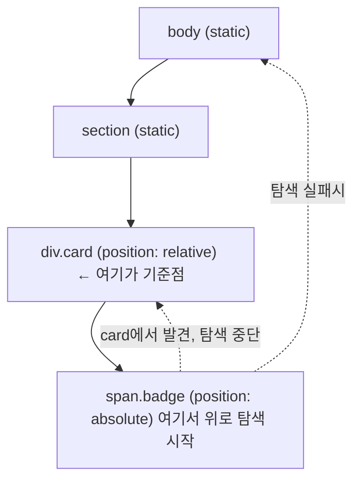
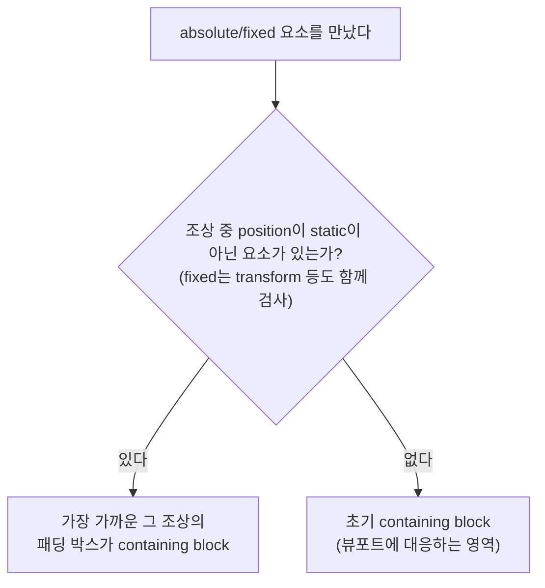

<Callout type="info">
  **이번 문서의 목표:** 이 문서를 다 읽으면 `position: absolute`를 건 요소가 "왜 하필 저 자리에" 나타나는지 containing block(포함 블록)을 역추적해 설명하고, `sticky`가 스크롤과 상호작용하는 원리까지 다섯 가지 `position` 값을 정확히 구분할 수 있게 됩니다.
</Callout>

## 왜 필요한가

지금까지 다룬 레이아웃은 전부 **정상 흐름**(normal flow) 안의 이야기였습니다. 요소들이 문서에 쓰인 순서대로 위에서 아래로, 왼쪽에서 오른쪽으로 쌓였습니다. 그런데 실무에서는 정상 흐름을 깨고 요소를 원하는 자리에 "붙여야" 할 때가 많습니다. 모달 창을 화면 정중앙에 띄우거나, 배지(badge) 아이콘을 버튼 모서리에 겹쳐 놓거나, 스크롤해도 화면 위에 계속 붙어 있는 네비게이션 바를 만드는 경우입니다.

이걸 가능하게 하는 속성이 `position`(포지션, 위치)입니다. 그런데 `position: absolute`를 처음 써 본 사람은 거의 예외 없이 당황합니다. 원하는 자리가 아니라 **엉뚱한 위치**에 요소가 나타나기 때문입니다. 이 편의 목표는 그 "엉뚱함"이 사실은 정확한 규칙을 따른 결과라는 것을 보여주는 것입니다.

> **쉽게 말하면:** `position`은 요소에게 "네 위치를 어떤 기준점으로부터 재라"고 지시하는 속성입니다. 문제는 그 기준점(containing block)을 못 찾아서 헤매는 것이지, 규칙이 없어서가 아닙니다.

## 다섯 가지 값 한눈에 비교

| 값 | 정상 흐름 유지 | `top`/`left` 등 동작 | 기준이 되는 상자 |
|----|---------------|---------------------|------------------|
| `static` (초기값) | 유지 | 무시됨 | 없음 |
| `relative` | 유지(원래 자리를 차지) | 원래 자리에서 상대 이동 | 자기 자신의 원래 위치 |
| `absolute` | 이탈(자리 차지 안 함) | 절대 위치 지정 | 가장 가까운 **positioned** 조상 |
| `fixed` | 이탈 | 절대 위치 지정 | 뷰포트(또는 특정 조상) |
| `sticky` | 유지 + 조건부 이탈 | 임계값 도달 시 고정 | 가장 가까운 스크롤 조상 |

## static — 아무 것도 하지 않는 기본값

`position: static`은 초기값입니다. 지금까지 배운 정상 흐름 그대로 배치되며, `top`·`right`·`bottom`·`left` 값을 줘도 **완전히 무시됩니다.** "이 요소는 특별한 위치 지정을 받지 않는다"는 뜻의 기준선입니다.

## relative — 제자리는 지키되 시각적으로만 이동

`position: relative`(상대 위치)를 건 요소는 정상 흐름에서 **자기 자리를 그대로 차지합니다.** 다른 요소들은 이 요소가 원래 있어야 할 자리를 기준으로 배치를 계속합니다. 그런데 `top`/`left` 등을 주면 **그 원래 자리를 기준으로** 시각적으로만 이동합니다.

```css
.badge {
  position: relative;
  top: -4px;   /* 원래 자리에서 위로 4px */
  left: 8px;   /* 원래 자리에서 오른쪽으로 8px */
}
```

레이아웃 계산(다른 요소들이 이 요소를 어디로 여기는지)은 이동 전 위치를 기준으로 하고, 화면에 그리는 페인트(paint) 단계에서만 이동한 것처럼 보입니다. 그래서 `relative`로 옮긴 요소 뒤에는 원래 있던 빈 공간이 그대로 남습니다.

`relative`가 자주 쓰이는 진짜 이유는 이동 자체보다 **다음 절의 기준점을 만들기 위해서**입니다.

## containing block — absolute·fixed가 기준으로 삼는 상자

**Containing block**(컨테이닝 블록, 포함 블록)은 "이 요소가 자기 위치와 크기를 계산할 때 기준으로 삼는 가상의 사각형"입니다. 정상 흐름의 요소는 보통 부모의 콘텐츠 영역이 containing block이지만, `position` 값에 따라 이 기준이 완전히 달라집니다.

### absolute의 규칙 — "positioned 조상을 찾아 위로 올라간다"

`position: absolute`가 걸린 요소는 정상 흐름에서 완전히 빠져나갑니다(다른 요소들은 이 요소가 없는 셈 치고 배치됩니다). 그리고 자기 위치를 계산할 때, **가장 가까운 조상 중에서 `position`이 `static`이 아닌 요소**를 찾아 그 요소의 패딩 박스를 containing block으로 삼습니다. 그런 조상이 하나도 없으면 최상위, 즉 초기 containing block(대략 뷰포트에 대응하는 영역)까지 올라갑니다.

이것이 `absolute`가 "엉뚱한 자리"에 나타나는 진짜 이유입니다. 개발자는 "이 버튼 안에 배지를 붙이고 싶다"고 생각했지만, 그 버튼에 `position: relative`를 깜빡 잊으면 배지는 조상을 타고 계속 위로 올라가다가 결국 문서 전체를 기준으로 배치됩니다.



<CodePlayground
  template="static"
  activeFile="/styles.css"
  label="부모에 position: relative를 껐다 꺼가며 배지 위치가 어떻게 바뀌는지 확인하세요"
  files={{
    '/index.html': `<div class="page">
  <p>페이지 상단 안내문입니다.</p>
  <div class="card">
    <h3>카드 제목</h3>
    <p>카드 내용입니다.</p>
    <span class="badge">NEW</span>
  </div>
</div>`,
    '/styles.css': `.page { font-family: sans-serif; padding: 24px; }
.card {
  width: 240px;
  padding: 16px;
  border: 2px solid #6366f1;
  margin-top: 40px;
  /* 이 줄을 지우면 badge가 card가 아니라 문서 전체를 기준으로 튄다 */
  position: relative;
}
.badge {
  position: absolute;
  top: -10px;
  right: -10px;
  background: #ef4444;
  color: white;
  padding: 4px 8px;
  border-radius: 999px;
  font-size: 12px;
}`,
  }}
/>

`.card`의 `position: relative` 줄을 지우고 다시 실행해 보면, 배지가 카드 모서리가 아니라 페이지 전체 기준의 오른쪽 위 구석으로 튀어 오르는 것을 볼 수 있습니다. 이것이 실무에서 가장 흔한 `absolute` 버그의 정체입니다.

### fixed의 규칙 — 뷰포트에 고정, 단 예외 있음

`position: fixed`(고정 위치)는 원리가 같지만 탐색 대상이 다릅니다. 조상 중 `transform`·`filter`·`will-change` 같은 특정 속성이 걸린 요소가 있으면 그 요소가 기준이 되고, 없으면 **뷰포트**(viewport, 브라우저가 보여주는 화면 영역) 자체가 containing block이 됩니다. 그래서 스크롤을 해도 화면에서 움직이지 않는 "떠 있는" 요소(항상 보이는 채팅 버튼, 쿠키 동의 배너)를 만들 때 씁니다.

<Callout type="warning">
  **자주 틀리는 점:** 부모에 `transform: translateX(0)`처럼 겉보기에 아무 효과가 없어 보이는 값을 걸어 두면, 그 부모가 뷰포트 대신 `fixed` 자식의 containing block이 되어 버립니다. "분명 fixed인데 스크롤하면 같이 움직인다"는 버그는 대부분 조상 어딘가의 `transform` 때문입니다.
</Callout>

## sticky — 흐름과 고정의 중간

`position: sticky`(끈끈한 위치)는 두 상태를 오가는 값입니다. 평소에는 `relative`처럼 정상 흐름 안에서 제자리를 지키다가, 스크롤이 진행되어 지정한 임계값(`top: 0` 등)에 닿는 순간 `fixed`처럼 화면에 달라붙습니다.

```css
.nav {
  position: sticky;
  top: 0; /* 스크롤 컨테이너 위쪽 끝에서 0px 지점에 도달하면 고정 */
}
```

`sticky`가 기준으로 삼는 것은 **가장 가까운 스크롤 가능한 조상**입니다. 그 조상의 스크롤 영역을 벗어날 수 없다는 점이 중요합니다. 부모의 높이가 자식(sticky 요소)보다 크지 않으면 붙어 있을 공간 자체가 없어 sticky가 작동하지 않은 것처럼 보입니다.

<CodePlayground
  template="static"
  activeFile="/styles.css"
  label="스크롤하면서 sticky 헤더가 어느 지점에서 고정되는지 확인하세요"
  files={{
    '/index.html': `<div class="scroll-area">
  <div class="section">섹션 1 위쪽 내용</div>
  <h3 class="sticky-title">고정되는 소제목</h3>
  <div class="section">섹션 1 아래쪽 내용. 스크롤을 내려보세요.</div>
  <div class="section">섹션 1 더 아래쪽 내용.</div>
  <div class="section">섹션 1 끝 부분.</div>
</div>`,
    '/styles.css': `.scroll-area {
  height: 220px;
  overflow-y: auto; /* 이 요소 자신이 스크롤 조상이 된다 */
  border: 2px solid #6366f1;
  font-family: sans-serif;
}
.section { padding: 40px 16px; background: #f1f5f9; }
.sticky-title {
  position: sticky;
  top: 0; /* 이 값을 8px 등으로 바꿔 여백을 두고 고정해 보세요 */
  margin: 0;
  padding: 8px 16px;
  background: #6366f1;
  color: white;
}`,
  }}
/>

## containing block 판단을 한 장으로 정리



## 접근성 관점

시각적 위치와 문서의 논리적 순서(DOM 순서)는 별개입니다. 스크린 리더는 기본적으로 DOM에 쓰인 순서대로 내용을 읽으므로, `position`으로 화면상 위치를 옮겨도 읽는 순서는 바뀌지 않습니다. 모달을 `fixed`로 화면 중앙에 띄웠다면, 시각적으로는 맨 위에 있어도 DOM 순서상 문서 맨 아래에 있으면 스크린 리더 사용자는 그 모달을 한참 뒤에야 만나게 됩니다. 시각적 순서와 논리적 순서를 맞추는 것이 중요합니다.

## 자주 틀리는 점

- **"absolute는 항상 부모를 기준으로 한다"고 오해하는 것.** 부모에 `position`이 없으면(`static`이면) 건너뛰고 그 위 조상을 계속 찾습니다. "부모"가 아니라 "가장 가까운 positioned 조상"이 정확한 표현입니다.
- **`relative`를 걸었는데 아무 것도 안 바뀐다고 당황하는 것.** `top`/`left` 등의 값을 함께 주지 않으면 `relative`는 시각적으로 `static`과 똑같아 보입니다. 하지만 후손 `absolute` 요소의 기준점 역할은 이미 하고 있습니다.
- **`sticky`가 전혀 안 붙는다고 신고하는 것.** 부모나 조상 중 하나가 `overflow: hidden`이거나, sticky 요소를 담은 컨테이너의 높이가 요소 자체와 같으면 고정될 여유 공간이 없어 작동하지 않습니다.

## 핵심 정리

- `static`은 정상 흐름, `relative`는 제자리를 지키며 시각적으로만 이동, `absolute`/`fixed`는 정상 흐름을 이탈해 containing block 기준으로 배치, `sticky`는 둘의 중간이다.
- `absolute`는 가장 가까운 `position: static`이 아닌 조상을 containing block으로 삼으며, 없으면 초기 containing block(뷰포트 기준)까지 올라간다.
- `fixed`는 기본적으로 뷰포트를 기준으로 삼지만, 조상에 `transform` 등이 걸려 있으면 그 조상이 기준이 된다.
- `sticky`는 가장 가까운 스크롤 조상의 영역 안에서만 동작하며, 그 조상을 벗어나 고정될 수 없다.

## 마무리 복습

<Quiz
  questionNumber={1}
  question="position: relative를 건 요소에 대한 설명으로 옳은 것은?"
  options={['정상 흐름에서 완전히 제외된다', 'top/left 값을 주지 않아도 항상 화면 중앙으로 이동한다', '원래 차지하던 자리를 그대로 유지하면서 시각적으로만 이동한다', '자식 absolute 요소의 containing block이 될 수 없다']}
  correctAnswer={3}
  explanation="relative는 정상 흐름 안에서 원래 자리를 그대로 차지하고, top/left 등의 값은 그 원래 위치를 기준으로 시각적 이동만 일으킨다. 후손 absolute 요소의 containing block으로도 흔히 쓰인다."
  optionExplanations={['relative는 정상 흐름을 유지한다', 'top/left를 주지 않으면 static과 시각적으로 동일하다', '정답 — 원래 자리를 유지하며 시각적으로만 이동한다', 'position이 static이 아니므로 containing block이 될 수 있다']}
/>

<Quiz
  questionNumber={2}
  question="position: absolute 요소가 containing block을 찾는 규칙으로 옳은 것은?"
  options={['항상 직계 부모를 기준으로 삼는다', '가장 가까운 조상 중 position이 static이 아닌 요소를 찾는다', '항상 문서 전체(뷰포트)를 기준으로 삼는다', 'display가 block인 가장 가까운 조상을 찾는다']}
  correctAnswer={2}
  explanation="absolute는 가장 가까운 positioned 조상(position이 static이 아닌 요소)을 찾아 그 패딩 박스를 기준으로 삼고, 없으면 초기 containing block까지 올라간다."
  optionExplanations={['직계 부모가 static이면 건너뛰고 더 위로 올라간다', '정답 — positioned 조상을 찾는 것이 핵심 규칙이다', '조상 중 positioned 요소가 있으면 그 요소가 우선이다', 'display 값과는 무관하며 position 값만 본다']}
/>

<Quiz
  questionNumber={3}
  question="카드 안 배지가 카드 모서리가 아니라 페이지 전체 기준의 구석으로 튀어 오르는 흔한 원인은?"
  options={['카드에 border를 주지 않아서', '카드에 position: relative를 걸지 않아서', '배지에 z-index를 주지 않아서', '카드의 width가 지정되지 않아서']}
  correctAnswer={2}
  explanation="카드가 position: static이면 absolute 배지는 카드를 건너뛰고 더 위 조상, 결국 초기 containing block까지 올라가 문서 전체를 기준으로 배치된다."
  optionExplanations={['border 유무는 containing block 계산과 무관하다', '정답 — 카드가 positioned 조상이 아니면 기준점이 되지 못한다', 'z-index는 스택 순서 문제이지 위치 기준과는 무관하다', 'width 지정 여부는 containing block 판단 기준이 아니다']}
/>

<Quiz
  questionNumber={4}
  question="position: fixed 요소가 뷰포트가 아닌 조상을 기준으로 삼게 되는 경우는?"
  options={['조상에 color 속성이 지정되어 있을 때', '조상에 transform 속성이 지정되어 있을 때', '조상의 font-size가 클 때', '조상에 padding이 있을 때']}
  correctAnswer={2}
  explanation="조상에 transform, filter, will-change 등 특정 속성이 걸려 있으면 그 조상이 fixed 요소의 containing block이 되어 스크롤 시 함께 움직이는 것처럼 보인다."
  optionExplanations={['color는 containing block 계산과 무관한 속성이다', '정답 — transform이 대표적인 예외 조건이다', 'font-size는 텍스트 크기일 뿐 위치 기준과 무관하다', 'padding은 박스 크기에만 영향을 준다']}
/>

<Quiz
  questionNumber={5}
  question="position: sticky의 동작 방식으로 옳은 것은?"
  options={['처음부터 끝까지 항상 뷰포트에 고정된다', '평소에는 정상 흐름을 따르다가 임계값에 도달하면 고정된다', 'absolute와 완전히 동일하게 동작한다', '가장 가까운 스크롤 조상과 무관하게 항상 문서 전체 기준으로 고정된다']}
  correctAnswer={2}
  explanation="sticky는 relative처럼 정상 흐름을 유지하다가, 지정한 임계값(top: 0 등)에 도달하는 순간 fixed처럼 고정된다. 단, 가장 가까운 스크롤 조상 영역을 벗어나지 못한다."
  optionExplanations={['처음부터 고정이면 fixed와 다를 바 없다', '정답 — 흐름과 고정을 오가는 것이 sticky의 핵심이다', 'absolute는 처음부터 정상 흐름을 이탈한다는 점에서 다르다', '가장 가까운 스크롤 조상 영역 안에서만 동작한다']}
/>

<Quiz
  questionNumber={6}
  question="position: sticky가 전혀 고정되지 않는 흔한 원인으로 알맞은 것은?"
  options={['top 값을 지정하지 않아서', '부모나 스크롤 컨테이너의 높이가 sticky 요소 자체와 거의 같아 고정될 여유 공간이 없어서', 'sticky 요소에 배경색이 없어서', 'HTML 문서에 DOCTYPE 선언이 없어서']}
  correctAnswer={2}
  explanation="sticky는 가장 가까운 스크롤 조상 영역 안에서만 고정되므로, 그 영역에 남는 스크롤 공간이 없으면 고정될 기회 자체가 없다."
  optionExplanations={['top 값 없이는 고정 위치를 계산할 기준이 없어 실제로 필요하지만, 가장 흔한 원인은 공간 부족이다', '정답 — 스크롤 여유 공간이 없으면 고정될 수 없다', '배경색 유무는 동작 자체와 무관하다', 'DOCTYPE은 렌더링 모드와 관련되지만 sticky 동작의 직접 원인은 아니다']}
/>

## 참고 자료

- [MDN — position (CSS property)](https://developer.mozilla.org/en-US/docs/Web/CSS/Reference/Properties/position)
