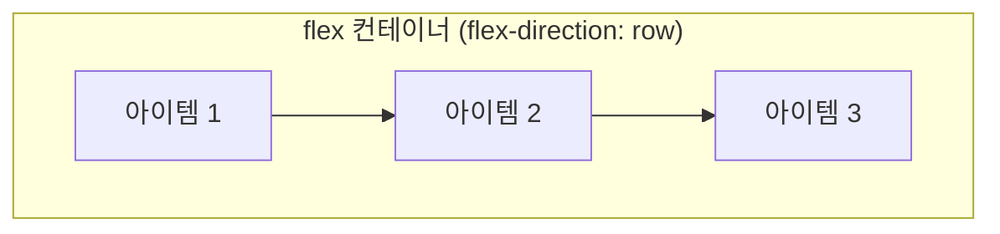

<Callout type="info">
  **이번 문서의 목표:** 이 문서를 다 읽으면 `display: flex`를 건 요소 안에서 "메인 축"과 "크로스 축"이 무엇인지 구분하고, `flex-direction`·`flex-wrap`·`justify-content`·`align-items`·`align-content` 다섯 속성으로 원하는 정렬을 직접 만들 수 있게 됩니다.
</Callout>

## 왜 필요한가

19편에서 확인했듯, float로 만든 레이아웃은 세로 정렬이 사실상 불가능하고 간격 계산도 수동이었습니다. 실무에서 가장 자주 마주치는 요구는 이런 것들입니다. "네비게이션 바의 로고는 왼쪽, 메뉴는 오른쪽에." "카드 안의 아이콘과 텍스트를 세로로 가운데 정렬." "버튼 여러 개를 균등한 간격으로." 이 모든 요구의 공통점은 "**한 줄(또는 한 방향)로 늘어선 요소들을 정렬한다**"는 것입니다.

이 요구에 정확히 맞춰 설계된 도구가 **Flexbox**입니다. 이름을 풀어보면 **Flexible Box**(플렉서블 박스, 유연한 상자) — "늘어나거나 줄어들 수 있는 상자들의 배치 방식"이라는 뜻입니다.

> **쉽게 말하면:** Flexbox는 한 줄로 늘어선 요소들에게 "이 방향으로 늘어서고, 이렇게 정렬해"라고 지시하는 1차원(한 방향) 정렬 시스템입니다.

## flex 컨테이너 만들기

부모 요소에 `display: flex`(또는 `display: inline-flex`)를 걸면, 그 요소는 **flex 컨테이너**(flex container, 유연 상자 담는 그릇)가 되고 **직계 자식들은 자동으로 flex 아이템**(flex item)이 됩니다. 별도로 자식에게 무언가를 지정하지 않아도 즉시 변화가 일어납니다.

```css
.nav {
  display: flex; /* 이 한 줄로 자식들이 가로로 나란히 배치되기 시작한다 */
}
```

`display: flex`는 컨테이너 자신을 블록 박스처럼 만들고(한 줄 전체를 차지), `display: inline-flex`는 컨테이너 자신을 인라인 박스처럼 만듭니다(내용 크기만큼만 차지하며 다른 인라인 요소와 한 줄에 놓일 수 있음). 컨테이너 내부의 정렬 동작 자체는 둘 다 같습니다.

| 지원 상태 | 비고 |
|-----------|------|
| 널리 사용 가능 | Flexbox는 현재 모든 주요 브라우저에서 완전히 지원되며, 실무 표준 레이아웃 도구로 자리 잡았다 |

## 메인 축과 크로스 축 — Flexbox를 이해하는 핵심 개념

Flexbox의 모든 정렬 속성은 두 개의 가상의 축을 기준으로 동작합니다.

- **메인 축**(main axis, 주 축): 아이템들이 늘어서는 방향. `flex-direction`으로 바꿀 수 있습니다.
- **크로스 축**(cross axis, 교차 축): 메인 축과 항상 직각을 이루는 방향.



`flex-direction: row`(기본값, 가로 방향)일 때는 메인 축이 가로, 크로스 축이 세로입니다. `flex-direction: column`(세로 방향)으로 바꾸면 메인 축과 크로스 축이 통째로 90도 회전합니다. **정렬 속성의 이름은 고정되어 있지만, 실제 어느 방향으로 정렬되는지는 이 축의 방향에 따라 달라진다**는 점이 Flexbox를 처음 배울 때 가장 헷갈리는 지점입니다.

| `flex-direction` 값 | 메인 축 방향 | 크로스 축 방향 |
|---------------------|--------------|-----------------|
| `row` (초기값) | 왼쪽 → 오른쪽 | 위 → 아래 |
| `row-reverse` | 오른쪽 → 왼쪽 | 위 → 아래 |
| `column` | 위 → 아래 | 왼쪽 → 오른쪽 |
| `column-reverse` | 아래 → 위 | 왼쪽 → 오른쪽 |

## flex-wrap — 한 줄이 부족하면 다음 줄로

기본적으로 flex 아이템들은 **한 줄에 다 우겨넣으려고** 합니다. 공간이 부족하면 아이템들이 찌그러들 뿐, 다음 줄로 넘어가지 않습니다. 이를 바꾸는 것이 `flex-wrap`(줄바꿈 여부)입니다.

| 값 | 동작 |
|----|------|
| `nowrap` (초기값) | 한 줄을 유지하며 공간이 부족하면 아이템이 줄어든다 |
| `wrap` | 공간이 부족하면 다음 줄로 넘어간다 |
| `wrap-reverse` | 다음 줄이 위쪽(또는 반대쪽)에 쌓인다 |

여러 줄이 되면, 그 "줄들의 묶음" 자체를 크로스 축 방향으로 어떻게 배치할지도 정할 수 있는데 이것이 뒤에 나올 `align-content`입니다.

## justify-content — 메인 축 정렬

`justify-content`(주 축 정렬)는 아이템들을 **메인 축 방향**으로 어떻게 배치할지 정합니다.

| 값 | 동작 |
|----|------|
| `flex-start` (초기값) | 메인 축 시작점부터 붙여서 배치 |
| `flex-end` | 메인 축 끝점부터 붙여서 배치 |
| `center` | 메인 축 방향으로 가운데 정렬 |
| `space-between` | 양 끝 아이템은 컨테이너 끝에 붙이고, 나머지 간격을 균등 배분 |
| `space-around` | 각 아이템 양옆에 동일한 여백을 주어 균등 배분 |
| `space-evenly` | 아이템 사이·양 끝 모두 완전히 동일한 간격 |

## align-items — 크로스 축 정렬(한 줄 내부)

`align-items`(교차 축 아이템 정렬)는 아이템들을 **크로스 축 방향**으로 어떻게 배치할지 정합니다. `flex-direction: row`일 때는 "세로 정렬"에 해당하는 것이 바로 이 속성입니다.

| 값 | 동작 |
|----|------|
| `stretch` (초기값) | 크로스 축 방향으로 컨테이너 크기만큼 늘어남(높이가 지정 안 된 경우) |
| `flex-start` | 크로스 축 시작점에 정렬 |
| `flex-end` | 크로스 축 끝점에 정렬 |
| `center` | 크로스 축 방향 가운데 정렬 |
| `baseline` | 텍스트 기준선(baseline)에 맞춰 정렬 |

## align-content — 크로스 축 정렬(여러 줄 전체)

`align-content`(교차 축 콘텐츠 정렬)는 `flex-wrap: wrap`으로 **여러 줄**이 생겼을 때, 그 줄들의 묶음 전체를 크로스 축 방향으로 어떻게 배치할지 정합니다. 값의 이름은 `justify-content`와 거의 같지만(`flex-start`·`center`·`space-between` 등), 적용 대상이 "아이템 하나하나"가 아니라 "줄 전체"라는 점이 다릅니다. 줄이 한 줄뿐이면 `align-content`는 시각적으로 아무 효과가 없습니다.

<Callout type="warning">
  **자주 틀리는 점:** `justify-content`와 `align-items`를 헷갈리는 것이 가장 흔한 실수입니다. **"메인 축이면 justify, 크로스 축이면 align"** 이라고 외우면 됩니다. `flex-direction: column`으로 바꾸면 두 속성이 담당하는 화면상 방향이 서로 뒤바뀐다는 점도 반드시 기억해야 합니다.
</Callout>

<CodePlayground
  template="static"
  activeFile="/styles.css"
  label="flex-direction·justify-content·align-items 값을 바꿔가며 정렬이 어떻게 달라지는지 확인하세요"
  files={{
    '/index.html': `<div class="box">
  <div class="item">1</div>
  <div class="item">2</div>
  <div class="item">3</div>
</div>`,
    '/styles.css': `.box {
  display: flex;
  height: 220px;
  border: 3px solid #6366f1;

  /* 아래 세 값을 하나씩 바꿔가며 결과를 관찰하세요 */
  flex-direction: row;       /* row → column 으로 바꿔 축이 뒤바뀌는 것을 확인 */
  justify-content: flex-start; /* center, space-between, space-evenly 도 시도 */
  align-items: stretch;      /* center, flex-end, baseline 도 시도 */
}
.item {
  width: 80px;
  padding: 16px;
  background: #c7d2fe;
  text-align: center;
  font-family: sans-serif;
  font-size: 24px;
}`,
  }}
/>

`flex-direction`을 `column`으로 바꾸는 순간, `justify-content: flex-start`가 담당하던 "왼쪽 정렬"이 "위쪽 정렬"로 바뀌고, `align-items`가 담당하던 "세로 정렬"이 "가로 정렬"로 뒤바뀌는 것을 직접 확인할 수 있습니다. 이 실험 하나가 축 개념을 몸으로 익히는 가장 빠른 방법입니다.

## 실전 예 — 네비게이션 바 골격

Flexbox가 왜 float보다 나은지 가장 잘 보여주는 예가 네비게이션 바입니다.

```css
.navbar {
  display: flex;
  justify-content: space-between; /* 로고는 왼쪽, 메뉴는 오른쪽 끝으로 */
  align-items: center;            /* 로고와 메뉴 텍스트 높이가 달라도 세로 중앙 정렬 */
}
```

float로는 `clear`와 마진 계산을 동원해야 겨우 흉내 내던 배치가, Flexbox에서는 두 줄로 끝납니다. 세로 중앙 정렬은 float로는 사실상 표현할 수 없던 것이었다는 점도 다시 떠올려 볼 만합니다.

## 접근성 관점

Flexbox는 시각적 배치만 바꿀 뿐 기본적으로 DOM 순서(문서에 쓰인 순서)를 유지하므로, 스크린 리더가 읽는 순서는 그대로 유지됩니다. 다만 21편에서 다룰 `order` 속성으로 시각적 순서를 DOM 순서와 다르게 만들 수 있는데, 이 경우 시각 사용자가 보는 순서와 스크린 리더 사용자가 듣는 순서가 어긋날 수 있습니다. 키보드로 `Tab` 키를 눌러 이동하는 순서도 기본적으로 DOM 순서를 따르므로, 시각적 순서만 바꾸고 DOM 순서를 그대로 두면 키보드 사용자가 예상과 다른 순서로 이동하게 됩니다.

## 자주 틀리는 점

- **`display: flex`만 걸면 정렬이 자동으로 예쁘게 된다고 기대하는 것.** `display: flex`는 "1차원으로 늘어놓는다"는 것만 정할 뿐, 실제 정렬은 `justify-content`·`align-items` 등을 명시적으로 지정해야 원하는 모양이 나옵니다.
- **`align-items`와 `align-content`를 같은 것으로 착각하는 것.** `align-items`는 한 줄 안 아이템 각각의 정렬이고, `align-content`는 여러 줄이 생겼을 때 그 줄들 전체의 정렬입니다. 한 줄뿐이면 `align-content`는 효과가 없습니다.
- **`flex-wrap`을 안 걸어 놓고 "왜 줄바꿈이 안 되냐"고 묻는 것.** 초기값이 `nowrap`이므로 여러 줄 배치가 필요하면 반드시 `flex-wrap: wrap`을 명시해야 합니다.

## 핵심 정리

- `display: flex`(또는 `inline-flex`)를 걸면 그 요소는 flex 컨테이너, 직계 자식들은 flex 아이템이 된다.
- 메인 축(아이템이 늘어서는 방향)과 크로스 축(그와 직각인 방향)이 `flex-direction`에 따라 정해지며, 정렬 속성의 실제 방향도 이에 따라 바뀐다.
- `flex-wrap`으로 줄바꿈 여부를, `justify-content`로 메인 축 정렬을, `align-items`로 한 줄 내부 크로스 축 정렬을, `align-content`로 여러 줄 전체의 크로스 축 정렬을 지정한다.
- 세로 중앙 정렬처럼 float로는 사실상 불가능하던 배치가 Flexbox에서는 속성 한두 개로 해결된다.

## 마무리 복습

<Quiz
  questionNumber={1}
  question="display: flex를 부모 요소에 걸었을 때 일어나는 일로 옳은 것은?"
  options={['모든 후손 요소가 flex 아이템이 된다', '직계 자식 요소들만 flex 아이템이 된다', '부모의 배경색이 자동으로 사라진다', '자식 요소에 float가 자동으로 적용된다']}
  correctAnswer={2}
  explanation="flex 컨테이너가 되면 그 직계 자식만 flex 아이템이 되며, 손자 이하 후손은 영향을 받지 않는다."
  optionExplanations={['후손 전체가 아니라 직계 자식만 대상이다', '정답 — 직계 자식만 flex 아이템이 된다', '배경색과는 무관한 변화다', 'flex와 float는 서로 다른 배치 방식이며 함께 자동 적용되지 않는다']}
/>

<Quiz
  questionNumber={2}
  question="flex-direction: column으로 바꾸면 일어나는 일로 옳은 것은?"
  options={['justify-content가 하던 역할과 align-items가 하던 역할의 화면상 방향이 서로 바뀐다', 'flex 컨테이너가 grid 컨테이너로 바뀐다', '자식 요소의 개수가 줄어든다', '메인 축과 크로스 축의 개념 자체가 사라진다']}
  correctAnswer={1}
  explanation="메인 축이 세로로 바뀌면서, 메인 축을 다루던 justify-content는 세로 정렬을, 크로스 축을 다루던 align-items는 가로 정렬을 담당하게 되어 화면상 역할이 뒤바뀐다."
  optionExplanations={['정답 — 축이 회전하면서 두 속성의 실제 방향이 뒤바뀐다', 'display 값 자체는 flex로 그대로 유지된다', '아이템 개수와는 무관한 속성이다', '축 개념은 그대로 유지되며 방향만 달라진다']}
/>

<Quiz
  questionNumber={3}
  question="flex-wrap의 초기값과 그 의미로 옳은 것은?"
  options={['wrap이며, 공간이 부족하면 자동으로 다음 줄로 넘어간다', 'nowrap이며, 공간이 부족해도 한 줄을 유지하고 아이템이 줄어든다', 'wrap-reverse이며, 항상 역순으로 줄이 쌓인다', 'auto이며, 브라우저가 알아서 판단한다']}
  correctAnswer={2}
  explanation="flex-wrap의 초기값은 nowrap이다. 여러 줄로 나뉘게 하려면 명시적으로 wrap을 지정해야 한다."
  optionExplanations={['초기값은 wrap이 아니라 nowrap이다', '정답 — 초기값 nowrap은 한 줄을 유지하며 아이템을 줄인다', 'wrap-reverse는 초기값이 아니라 명시적으로 지정하는 값이다', 'auto라는 값 자체가 flex-wrap에 존재하지 않는다']}
/>

<Quiz
  questionNumber={4}
  question="justify-content와 align-items의 차이로 옳은 것은?"
  options={['justify-content는 크로스 축, align-items는 메인 축을 정렬한다', 'justify-content는 메인 축, align-items는 크로스 축(한 줄 내부)을 정렬한다', '두 속성은 완전히 같은 기능을 한다', 'align-items는 여러 줄 전체를 정렬하는 속성이다']}
  correctAnswer={2}
  explanation="justify-content는 메인 축 방향 정렬을, align-items는 크로스 축 방향에서 한 줄 내부 아이템 정렬을 담당한다. 여러 줄 전체의 크로스 축 정렬은 align-content의 역할이다."
  optionExplanations={['축이 서로 반대로 서술되어 있다', '정답 — 메인 축은 justify, 크로스 축(한 줄)은 align-items다', '두 속성은 서로 다른 축을 담당한다', '여러 줄 전체 정렬은 align-content의 역할이다']}
/>

<Quiz
  questionNumber={5}
  question="flex-wrap: wrap으로 여러 줄이 생겼을 때, 그 줄들의 묶음 전체를 크로스 축 방향으로 배치하는 속성은?"
  options={['justify-content', 'align-items', 'align-content', 'flex-direction']}
  correctAnswer={3}
  explanation="align-content는 여러 줄이 생겼을 때 줄들의 묶음 전체를 크로스 축 방향으로 정렬한다. 줄이 하나뿐이면 시각적으로 효과가 없다."
  optionExplanations={['justify-content는 메인 축 방향의 아이템 정렬이다', 'align-items는 한 줄 내부 아이템의 크로스 축 정렬이다', '정답 — 여러 줄 전체의 크로스 축 정렬을 담당한다', 'flex-direction은 축의 방향 자체를 정하는 속성이다']}
/>

<Quiz
  questionNumber={6}
  question="네비게이션 바에서 로고는 왼쪽, 메뉴는 오른쪽 끝에 배치하고 싶을 때 가장 알맞은 속성 값은?"
  options={['justify-content: center', 'justify-content: space-between', 'align-items: flex-end', 'flex-wrap: wrap']}
  correctAnswer={2}
  explanation="space-between은 양 끝 아이템을 컨테이너 시작과 끝에 붙이고 나머지 간격을 균등 배분하므로, 두 아이템만 있을 때 정확히 양쪽 끝에 배치하는 효과를 낸다."
  optionExplanations={['center는 모든 아이템을 가운데로 모은다', '정답 — 양 끝에 붙이는 데 가장 알맞은 값이다', 'align-items는 세로(크로스 축) 정렬이라 가로 배치와는 무관하다', 'flex-wrap은 줄바꿈 여부일 뿐 가로 배치와 무관하다']}
/>

<Quiz
  questionNumber={7}
  question="Flexbox와 접근성에 대한 설명으로 옳은 것은?"
  options={['Flexbox를 쓰면 스크린 리더가 읽는 순서가 자동으로 시각적 순서와 같아진다', 'order 속성으로 시각적 순서를 바꾸면 DOM 순서를 따르는 키보드 이동·스크린 리더 순서와 어긋날 수 있다', 'Flexbox는 접근성 트리에 아무 영향도 줄 수 없다', 'Flexbox를 쓰면 alt 속성이 필요 없어진다']}
  correctAnswer={2}
  explanation="order로 시각적 순서를 DOM 순서와 다르게 바꾸면, 기본적으로 DOM 순서를 따르는 키보드 Tab 이동이나 스크린 리더 낭독 순서와 시각적 순서가 어긋날 수 있다."
  optionExplanations={['order를 쓰면 오히려 순서가 어긋날 수 있다', '정답 — order 사용 시 순서 불일치를 주의해야 한다', '시각적 순서 변경은 실질적으로 접근성에 영향을 줄 수 있다', 'alt 속성은 이미지 대체 텍스트로 레이아웃 방식과 무관하다']}
/>

## 참고 자료

- [MDN — Basic concepts of flexbox](https://developer.mozilla.org/en-US/docs/Web/CSS/CSS_flexible_box_layout/Basic_concepts_of_flexbox)
