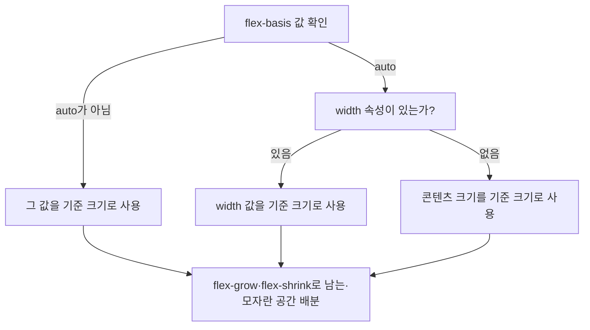

<Callout type="info">
  **이번 문서의 목표:** 이 문서를 다 읽으면 `flex-grow`·`flex-shrink`·`flex-basis` 세 속성이 남는 공간과 모자란 공간을 각각 어떻게 나누는지 계산 과정으로 설명하고, `order`·`align-self`·자동 마진으로 flex 아이템 하나하나를 개별적으로 다룰 수 있게 됩니다.
</Callout>

## 왜 필요한가

20편에서 `display: flex`로 컨테이너를 만들고 `justify-content`·`align-items`로 아이템 전체를 정렬하는 법을 배웠습니다. 그런데 실무 레이아웃에는 "전체 정렬"만으로는 안 풀리는 요구가 반드시 섞입니다.

- 사이드바는 고정 너비(예 240px)를 유지하고, 본문만 남는 공간을 다 차지해야 한다.
- 카드 3개 중 가운데 카드만 유독 넓게 잡고 싶다.
- 로그아웃 버튼만 오른쪽 끝으로 밀어내고 싶다(나머지는 왼쪽에 모아둔 채).
- 이 아이템만 다른 아이템과 다르게 세로 정렬하고 싶다.

이런 요구는 컨테이너 전체 속성이 아니라 **아이템 하나하나에 개별적으로 붙이는 속성**으로 해결합니다.

> **쉽게 말하면:** 컨테이너 속성이 "줄 전체를 어떻게 세울까"를 정한다면, 아이템 속성은 "그 줄 안의 이 사람 한 명을 어떻게 다룰까"를 정합니다.

## flex-grow — 남는 공간을 나눠 가지는 비율

**flex-grow**(플렉스 그로우, 유연하게 늘어남)는 flex 컨테이너 안에 **남는 공간**이 있을 때, 그 남는 공간을 아이템들이 얼마나 가져갈지를 정하는 비율입니다. 초기값은 `0`이며, 이는 "남는 공간이 있어도 나는 늘어나지 않는다"는 뜻입니다.

```css
.item-a { flex-grow: 1; }
.item-b { flex-grow: 2; }
.item-c { flex-grow: 1; }
```

세 아이템의 원래 크기를 채우고도 컨테이너에 남는 공간이 있다면, 그 남는 공간은 `1 : 2 : 1` 비율로 나뉩니다. 예를 들어 남는 공간이 총 80px이라면 `item-a`는 20px, `item-b`는 40px, `item-c`는 20px을 추가로 더 가져가 늘어납니다. **주의할 점은 이 숫자가 "전체 너비의 비율"이 아니라 "남는 공간만의 비율"이라는 것**입니다. 아이템들의 원래 크기가 서로 다르면, `flex-grow` 값이 같아도 최종 크기는 다를 수 있습니다.

## flex-shrink — 모자란 공간을 줄어드는 비율

**flex-shrink**(플렉스 슈링크, 유연하게 줄어듦)는 반대 상황, 즉 컨테이너가 아이템들의 원래 크기를 다 담을 만큼 넓지 않을 때, 각 아이템이 얼마나 줄어들지를 정하는 비율입니다. 초기값은 `1`이며, 이는 "공간이 모자라면 다른 아이템들과 비례해서 줄어든다"는 뜻입니다. `flex-shrink: 0`을 주면 그 아이템은 절대 줄어들지 않습니다(대신 다른 아이템이 더 많이 줄어들거나, 컨테이너를 넘칠 수 있습니다).

`flex-shrink`의 실제 계산은 `flex-grow`보다 조금 더 복잡합니다. 단순히 지정한 비율대로만 줄어드는 것이 아니라, **아이템의 원래 크기(flex-basis)에 비례한 가중치**가 함께 곱해집니다. 즉 같은 `flex-shrink: 1`이라도 원래 크기가 큰 아이템이 절대량으로 더 많이 줄어듭니다. 실무에서는 "정확한 축소 비율을 암산한다"기보다 "0으로 고정할지 말지"를 판단하는 용도로 가장 많이 씁니다.

| 지원 상태 | 비고 |
|-----------|------|
| 널리 사용 가능 | `flex-grow`·`flex-shrink`·`flex-basis` 모두 모든 주요 브라우저에서 오랫동안 안정적으로 지원된다 |

## flex-basis — 늘어나거나 줄어들기 전의 기준 크기

**flex-basis**(플렉스 베이시스, 유연 기준 크기)는 `flex-grow`·`flex-shrink`가 공간을 나누기 **전에** 각 아이템이 차지하는 기준 크기입니다. 초기값은 `auto`이며, 이 경우 아이템에 지정된 `width`(메인 축이 가로일 때) 또는 콘텐츠 크기를 기준으로 삼습니다. 픽셀·퍼센트·`auto` 등 `width`와 같은 값을 그대로 받을 수 있습니다.

여기서 자주 헷갈리는 것이 `flex-basis`와 `width`의 관계입니다. 메인 축이 가로일 때 **둘 다 지정되어 있으면 `flex-basis`가 우선**합니다. `width`는 `flex-basis`가 `auto`일 때만 대신 참조되는 값입니다.



## flex 축약형 — 세 속성을 한 줄로

세 속성을 매번 따로 쓰는 대신, `flex` 축약형(shorthand) 하나로 묶어 쓰는 것이 실무 관행입니다.

```css
.item {
  flex: 1 1 0;
  /* flex-grow: 1; flex-shrink: 1; flex-basis: 0; 과 완전히 같다 */
}
```

`flex` 축약형에는 값 개수에 따라 흔히 쓰이는 세 가지 관용구가 있습니다.

| 축약형 | 풀어 쓴 값 | 의미 |
|--------|------------|------|
| `flex: 1` | `flex-grow: 1; flex-shrink: 1; flex-basis: 0%` | 원래 크기를 무시하고 남는 공간을 균등 배분 — "칸을 똑같이 나눠라" |
| `flex: auto` | `flex-grow: 1; flex-shrink: 1; flex-basis: auto` | 콘텐츠 크기를 기준으로 삼되, 남는·모자란 공간에 맞춰 유연하게 조정 |
| `flex: none` | `flex-grow: 0; flex-shrink: 0; flex-basis: auto` | 절대 늘어나지도 줄어들지도 않는 고정 크기 |

<Callout type="warning">
  **자주 틀리는 점:** `flex: 1`을 쓰면 "아이템이 균등하게 나뉜다"고만 외우고, `flex-basis`가 `0%`으로 설정된다는 사실을 놓치는 경우가 많습니다. `flex: 1`이 걸린 아이템은 원래 콘텐츠 크기와 무관하게 남는 공간을 똑같이 나눠 갖도록 강제됩니다. 반면 `flex: auto`는 원래 크기 차이를 유지한 채로 유연하게 늘고 줄어, 결과가 `flex: 1`과 다릅니다.
</Callout>

<CodePlayground
  template="static"
  activeFile="/styles.css"
  label="사이드바는 고정 너비, 본문은 flex-grow로 남는 공간을 모두 차지하도록 값을 바꿔 보세요"
  files={{
    '/index.html': `<div class="layout">
  <div class="sidebar">사이드바</div>
  <div class="main">본문 (남는 공간을 전부 차지)</div>
</div>`,
    '/styles.css': `.layout {
  display: flex;
  height: 160px;
  border: 3px solid #6366f1;
}
.sidebar {
  /* flex-shrink를 0으로 바꿔보고, 다시 기본값 1로 되돌려 비교하세요 */
  flex: 0 0 160px; /* grow 0, shrink 0, basis 160px = 절대 고정 */
  background: #c7d2fe;
  padding: 12px;
  font-family: sans-serif;
}
.main {
  /* 1로 바꾸면 남는 공간을 전부 차지, 0으로 바꾸면 콘텐츠 크기만큼만 */
  flex-grow: 1;
  background: #e0e7ff;
  padding: 12px;
  font-family: sans-serif;
}`,
  }}
/>

브라우저 창(플레이그라운드의 컨테이너)을 넓히거나 좁혀도 `.sidebar`는 항상 160px을 유지하고, `.main`만 늘었다 줄었다 하는 것을 확인할 수 있습니다. 이것이 실무에서 사이드바 레이아웃을 짤 때 가장 많이 쓰는 조합입니다.

## order — 시각적 순서 바꾸기

**order**(오더, 순서)는 flex 아이템이 화면에 그려지는 순서를 DOM(Document Object Model, 문서 객체 모델 — HTML 마크업이 브라우저 메모리 안에서 나무 구조로 표현된 것)에 쓰인 순서와 다르게 바꿉니다. 초기값은 `0`이며, 값이 작을수록 앞에 배치됩니다. 값이 같으면 원래 DOM 순서를 유지합니다.

```css
.item-먼저-보이고-싶은-것 { order: -1; }
```

## align-self — 이 아이템만 다르게 정렬하기

**align-self**(얼라인 셀프, 스스로 정렬)는 컨테이너의 `align-items`가 정한 크로스 축 정렬을, 특정 아이템 하나만 예외로 다르게 지정하고 싶을 때 씁니다. 값은 `align-items`와 동일하게 `stretch`·`flex-start`·`flex-end`·`center`·`baseline`을 받으며, 초기값은 `auto`(부모의 `align-items` 값을 그대로 따름)입니다.

```css
.container { display: flex; align-items: center; }
.item-혼자-위로 { align-self: flex-start; } /* 이 아이템만 위쪽 정렬 */
```

## 자동 마진 — margin: auto로 밀어내기

Flexbox 안에서 `margin`에 `auto`를 지정하면, 그 마진은 **남는 공간을 전부 자기 쪽으로 흡수**합니다. 이 성질을 이용하면 별도의 정렬 속성 없이도 특정 아이템만 반대쪽으로 밀어낼 수 있습니다.

```css
.navbar { display: flex; }
.logout-button { margin-left: auto; } /* 이 아이템과 그 왼쪽 사이의 남는 공간을 전부 흡수 → 오른쪽 끝으로 밀림 */
```

`justify-content: space-between`으로도 비슷한 효과를 낼 수 있지만, 자동 마진은 "아이템 3개 중 특정 하나만" 분리해서 밀어내는 경우처럼 더 세밀한 제어가 필요할 때 유용합니다.

## 접근성 관점

`order`로 시각적 순서를 바꾸면, 스크린 리더의 낭독 순서와 `Tab` 키 이동 순서는 여전히 DOM 순서를 따릅니다. 즉 화면에 A-B-C 순서로 보이지만 실제로는 B-A-C 순서로 `order`를 조정했다면, 시각 사용자는 A-B-C로 읽고 스크린 리더 사용자는 B-A-C로 듣게 되어 두 경험이 어긋납니다. 이런 어긋남은 폼(form)이나 단계별 안내처럼 순서 자체가 의미를 가지는 콘텐츠에서 특히 치명적이므로, `order`는 되도록 순수하게 시각적인 재배치(예: 모바일에서 사이드바를 아래로)에만 한정해서 쓰고, 논리적 순서에 영향을 주는 콘텐츠에는 DOM 순서 자체를 바꾸는 것이 안전합니다.

## 자주 틀리는 점

- **`flex-grow`의 값을 "전체 너비 대비 비율"로 착각하는 것.** `flex-grow`는 남는 공간만을 나누는 비율이지, 컨테이너 전체 너비를 나누는 비율이 아닙니다.
- **`width`를 지정했는데 `flex-basis`가 `auto`가 아닌 값으로 겹쳐 있어 `width`가 무시되는 것.** 메인 축이 가로일 때 `flex-basis`가 `auto`가 아니면 `width`보다 우선합니다.
- **`flex: 1`과 `flex: auto`를 같은 것으로 착각하는 것.** `flex: 1`은 `flex-basis: 0%`로 원래 크기를 무시하고 균등 배분하지만, `flex: auto`는 원래 콘텐츠 크기를 유지한 채 유연하게 늘고 줄어듭니다.
- **`order`로 시각적 순서만 바꾸고 접근성 영향을 고려하지 않는 것.** 스크린 리더와 키보드 이동 순서는 DOM 순서를 따르므로 시각 순서와 어긋날 수 있습니다.

## 핵심 정리

- `flex-grow`는 남는 공간을, `flex-shrink`는 모자란 공간을 아이템들이 나눠 가지는 비율이며, 둘 다 초기값이 다르다(`0`과 `1`).
- `flex-basis`는 늘고 줄기 전 기준 크기이며, `auto`가 아니면 `width`보다 우선한다.
- `flex` 축약형의 `1`·`auto`·`none`은 각각 균등 배분·유연한 콘텐츠 기반·완전 고정이라는 서로 다른 관용구를 나타낸다.
- `order`는 시각적 순서를, `align-self`는 개별 아이템의 크로스 축 정렬을, `margin: auto`는 남는 공간을 흡수해 특정 아이템을 밀어내는 데 쓴다.

## 마무리 복습

<Quiz
  questionNumber={1}
  question="flex-grow에 대한 설명으로 옳은 것은?"
  options={['컨테이너 전체 너비를 지정한 비율대로 나눈다', '아이템들의 원래 크기를 채우고 남는 공간만을 지정한 비율대로 나눈다', '모자란 공간을 줄이는 비율을 정한다', 'flex-basis 값을 자동으로 계산해 준다']}
  correctAnswer={2}
  explanation="flex-grow는 아이템들의 기준 크기를 채우고도 남는 공간이 있을 때, 그 남는 공간만을 지정한 비율로 나눈다. 컨테이너 전체 너비를 나누는 것이 아니다."
  optionExplanations={['전체 너비가 아니라 남는 공간만을 나눈다', '정답 — 남는 공간만을 비율대로 배분한다', '모자란 공간을 줄이는 것은 flex-shrink의 역할이다', 'flex-basis는 별도로 지정하는 기준 크기다']}
/>

<Quiz
  questionNumber={2}
  question="flex-basis가 auto가 아닌 값으로 지정되어 있을 때, width 속성과의 관계로 옳은 것은?"
  options={['width가 항상 flex-basis보다 우선한다', 'flex-basis가 auto가 아니면 width보다 우선한다', 'width와 flex-basis는 합산되어 적용된다', 'flex-basis가 있으면 width는 아예 무시되고 렌더링 에러가 난다']}
  correctAnswer={2}
  explanation="메인 축이 가로일 때 flex-basis가 auto가 아닌 구체적인 값이면 width보다 우선 적용된다. width는 flex-basis가 auto일 때만 대신 참조된다."
  optionExplanations={['flex-basis가 auto가 아니면 오히려 flex-basis가 우선한다', '정답 — flex-basis가 구체적인 값이면 그 값이 기준 크기가 된다', '두 값은 합산되지 않고 우선순위로 결정된다', '에러가 나지 않고 단지 무시될 뿐이다']}
/>

<Quiz
  questionNumber={3}
  question="flex: 1과 flex: auto의 차이로 옳은 것은?"
  options={['둘은 완전히 동일한 축약형이다', 'flex: 1은 flex-basis가 0%로 원래 크기를 무시하고 균등 배분하지만, flex: auto는 콘텐츠 크기를 유지한 채 유연하게 조정된다', 'flex: auto는 아이템을 절대 늘어나지 않게 고정한다', 'flex: 1은 flex-shrink를 0으로 만든다']}
  correctAnswer={2}
  explanation="flex: 1은 flex-basis가 0%가 되어 원래 크기와 무관하게 남는 공간을 균등 배분하고, flex: auto는 flex-basis가 auto로 콘텐츠 크기를 기준으로 유연하게 늘고 줄어든다."
  optionExplanations={['풀어 쓴 값이 서로 다르므로 동일하지 않다', '정답 — flex-basis 값이 다르므로 결과가 다르다', '고정 크기를 만드는 것은 flex: none이다', 'flex: 1의 flex-shrink는 1이다']}
/>

<Quiz
  questionNumber={4}
  question="order 속성에 대한 설명으로 옳은 것은?"
  options={['DOM에서 요소를 실제로 이동시킨다', '값이 클수록 먼저 배치된다', '시각적 배치 순서만 바꾸며, 값이 작을수록 앞에 배치된다', 'order를 지정하면 flex-grow가 자동으로 무효화된다']}
  correctAnswer={3}
  explanation="order는 DOM 구조를 바꾸지 않고 화면상 배치 순서만 바꾸며, 초기값은 0이고 값이 작을수록 앞에 배치된다."
  optionExplanations={['DOM 구조 자체는 그대로 유지된다', '값이 작을수록 먼저 배치된다', '정답 — 시각적 순서만 바꾸고 값이 작을수록 앞이다', 'order와 flex-grow는 서로 독립적인 속성이다']}
/>

<Quiz
  questionNumber={5}
  question="네비게이션 바에서 로그아웃 버튼 하나만 오른쪽 끝으로 밀어내고 싶을 때, 그 버튼에 줄 수 있는 속성으로 가장 알맞은 것은?"
  options={['order: -1', 'flex-shrink: 0', 'margin-left: auto', 'align-self: stretch']}
  correctAnswer={3}
  explanation="margin-left: auto는 그 마진이 남는 공간을 전부 흡수해 해당 아이템을 반대쪽으로 밀어내는 효과를 낸다."
  optionExplanations={['order는 순서를 바꿀 뿐 밀어내는 효과는 없다', 'flex-shrink는 축소 여부를 정할 뿐 위치를 밀어내지 않는다', '정답 — auto 마진이 남는 공간을 흡수해 밀어낸다', 'align-self는 크로스 축 정렬이며 메인 축 위치와 무관하다']}
/>

<Quiz
  questionNumber={6}
  question="align-self에 대한 설명으로 옳은 것은?"
  options={['컨테이너 전체의 크로스 축 정렬을 바꾼다', '특정 아이템 하나만 컨테이너의 align-items 값과 다르게 크로스 축 정렬을 지정한다', 'flex-direction 값을 아이템별로 다르게 지정한다', '메인 축 방향의 정렬만 담당한다']}
  correctAnswer={2}
  explanation="align-self는 부모의 align-items가 정한 크로스 축 정렬을 개별 아이템 단위로 예외 지정할 수 있게 한다."
  optionExplanations={['컨테이너 전체가 아니라 개별 아이템에 적용된다', '정답 — 개별 아이템의 크로스 축 정렬을 예외로 지정한다', 'flex-direction은 컨테이너에만 적용되는 속성이다', '크로스 축 정렬이지 메인 축 정렬이 아니다']}
/>

<Quiz
  questionNumber={7}
  question="flex-shrink에 대한 설명으로 옳은 것은?"
  options={['초기값은 0이며 기본적으로 아무 아이템도 줄어들지 않는다', '초기값은 1이며, 값이 같아도 원래 크기가 큰 아이템이 절대량으로 더 많이 줄어들 수 있다', '컨테이너가 넓을 때만 작동한다', 'flex-shrink: 0을 주면 그 아이템의 flex-grow도 자동으로 0이 된다']}
  correctAnswer={2}
  explanation="flex-shrink의 초기값은 1이며, 실제 축소량 계산에는 아이템의 기준 크기(flex-basis)에 비례한 가중치가 함께 작용하므로 같은 flex-shrink 값이라도 원래 크기가 큰 아이템이 더 많이 줄어들 수 있다."
  optionExplanations={['초기값은 0이 아니라 1이다', '정답 — 초기값 1이며 기준 크기에 비례한 가중치가 작용한다', '공간이 모자랄 때 작동하는 속성이다', '두 속성은 서로 독립적으로 지정한다']}
/>

<Quiz
  questionNumber={8}
  question="order로 시각적 순서를 DOM 순서와 다르게 바꿨을 때 발생할 수 있는 접근성 문제로 옳은 것은?"
  options={['스크린 리더가 자동으로 시각적 순서를 따라간다', '스크린 리더 낭독 순서와 Tab 키 이동 순서는 여전히 DOM 순서를 따르므로 시각적 순서와 어긋날 수 있다', 'order를 쓰면 해당 요소가 접근성 트리에서 제외된다', 'order는 키보드 사용자에게만 영향을 주고 스크린 리더에는 영향이 없다']}
  correctAnswer={2}
  explanation="order는 시각적 배치만 바꿀 뿐 DOM 순서 자체는 그대로이므로, 스크린 리더 낭독과 Tab 이동 순서는 DOM 순서를 따르며 시각적 순서와 어긋날 수 있다."
  optionExplanations={['스크린 리더는 DOM 순서를 따르지 시각적 순서를 따르지 않는다', '정답 — DOM 순서와 시각적 순서가 어긋나 두 경험이 달라질 수 있다', '접근성 트리에서 제외되지 않는다', '키보드 이동에도 스크린 리더 낭독에도 모두 영향을 준다']}
/>

## 참고 자료

- [MDN — Basic concepts of flexbox](https://developer.mozilla.org/en-US/docs/Web/CSS/CSS_flexible_box_layout/Basic_concepts_of_flexbox)
