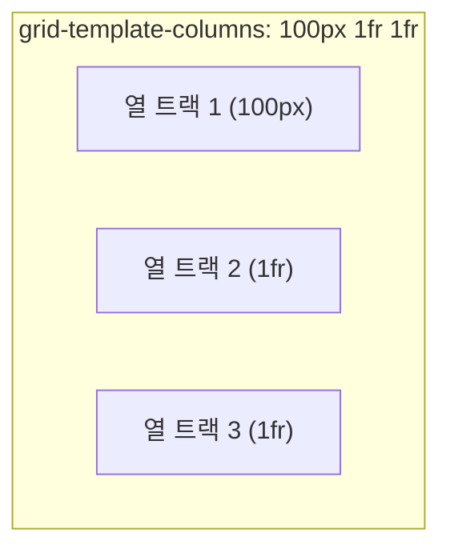

<Callout type="info">
  **이번 문서의 목표:** 이 문서를 다 읽으면 `display: grid`로 격자를 만들고, `grid-template-columns`·`grid-template-rows`·`fr` 단위·`gap`을 조합해 행과 열이 있는 2차원 레이아웃의 뼈대를 직접 짤 수 있게 됩니다.
</Callout>

## 왜 필요한가

20~22편에서 다룬 Flexbox는 **한 방향**(1차원)으로 늘어선 요소를 정렬하는 데 강력합니다. 하지만 실무에는 "가로도 세로도 동시에" 맞아떨어져야 하는 레이아웃이 자주 나옵니다. 예를 들어 카드 12장을 4열 3행 격자로 배치하면서, 모든 열의 너비와 모든 행의 높이를 동시에 맞추고 싶다고 해봅시다. Flexbox로도 흉내는 낼 수 있지만, 각 카드의 `flex-basis`를 퍼센트로 계산하고 줄바꿈 지점을 신경 써야 해서 번거롭고, 열끼리 너비를 정확히 맞추기가 까다롭습니다.

이 문제를 정면으로 풀기 위해 등장한 것이 **Grid**(그리드, 격자)입니다. Grid는 이름 그대로 처음부터 행과 열이 있는 격자를 전제로 설계된 **2차원**(가로·세로 두 방향) **레이아웃 시스템**입니다.

> **쉽게 말하면:** Flexbox가 "한 줄 서기"를 위한 도구라면, Grid는 "모눈종이"를 먼저 그어 놓고 그 칸에 요소를 배치하는 도구입니다.

## grid 컨테이너 만들기

부모 요소에 `display: grid`(또는 `display: inline-grid`)를 걸면, 그 요소는 **grid 컨테이너**(grid container)가 되고 직계 자식들은 자동으로 **grid 아이템**(grid item)이 됩니다. Flexbox와 마찬가지로 자식에게 별도 지정을 하지 않아도 즉시 이 관계가 성립합니다.

```css
.grid {
  display: grid; /* 이 한 줄만으로는 아직 아무 시각적 변화가 없다 — 트랙을 정의해야 격자가 보인다 */
}
```

`display: grid`만 걸면 사실 눈에 보이는 변화는 거의 없습니다. 자식들이 여전히 세로로 한 줄씩 쌓이는데, 이는 열(column)을 하나도 정의하지 않았기 때문입니다. Grid의 진짜 힘은 다음에 배울 **트랙**(track) 정의에서 나옵니다.

| 지원 상태 | 비고 |
|-----------|------|
| 널리 사용 가능 | CSS Grid는 현재 모든 주요 브라우저에서 지원되며, 과거 일부 브라우저의 구형 접두사 문법(예: `-ms-grid`)은 현재는 사실상 의미가 없다 |

## 트랙이라는 핵심 개념 — 행과 열

**트랙**(track)은 Grid 격자를 이루는 행(row) 하나 또는 열(column) 하나를 가리키는 말입니다. 격자무늬 종이를 떠올리면, 세로로 그어진 선 사이의 한 칸 한 칸이 열 트랙이고, 가로로 그어진 선 사이의 한 칸 한 칸이 행 트랙입니다.



`grid-template-columns`(그리드 템플릿 컬럼즈, 격자 열 틀)는 열 트랙의 개수와 각 트랙의 크기를 한 번에 정의합니다.

```css
.grid {
  display: grid;
  grid-template-columns: 200px 200px 200px; /* 200px짜리 열 3개 */
}
```

같은 방식으로 `grid-template-rows`(그리드 템플릿 로우즈, 격자 행 틀)는 행 트랙을 정의합니다. 행을 지정하지 않으면 콘텐츠 높이에 맞춰 행이 자동으로 만들어집니다(이 "암시적 트랙"은 24편에서 자세히 다룹니다).

## fr 단위 — 남는 공간을 비율로 나누는 새 단위

매번 픽셀로 트랙 너비를 고정하면 화면 너비가 바뀔 때 유연하게 대응하지 못합니다. 이 문제를 풀기 위해 Grid는 **fr**(프랙션, fraction의 줄임 — "부분·비율"이라는 뜻)이라는 Grid 전용 단위를 도입했습니다. `fr`은 컨테이너 안에서 **고정 크기 트랙을 제외하고 남는 공간**을 지정한 비율로 나눕니다.

```css
.grid {
  display: grid;
  grid-template-columns: 1fr 2fr 1fr; /* 남는 공간을 1 : 2 : 1 비율로 나눈 3개 열 */
}
```

`fr`은 13편에서 배운 `%`(퍼센트)와 비슷해 보이지만 계산 기준이 다릅니다. `%`는 컨테이너 전체 크기를 기준으로 하지만, `fr`은 **고정 크기 트랙을 이미 뺀 나머지 공간**을 기준으로 나눕니다. 그래서 아래처럼 고정 트랙과 `fr` 트랙을 섞어 쓰는 것이 Grid의 대표적인 관용구입니다.

```css
.layout {
  display: grid;
  grid-template-columns: 240px 1fr; /* 사이드바 240px 고정, 본문은 남는 공간 전부 */
}
```

이 한 줄이 21편에서 Flexbox로 `flex: 0 0 240px`과 `flex-grow: 1`을 조합해 만들던 "사이드바 고정 + 본문 가변" 레이아웃과 똑같은 결과를 냅니다. Flexbox는 두 속성을 조합해야 했지만 Grid는 컨테이너의 트랙 정의 한 줄로 끝난다는 점이 다릅니다.

## repeat() 함수 — 반복되는 트랙을 줄여 쓰기

같은 크기의 트랙이 여러 번 반복될 때는 `repeat()`(리핏, 반복) 함수로 줄여 쓸 수 있습니다.

```css
.grid {
  grid-template-columns: repeat(4, 1fr); /* 1fr 1fr 1fr 1fr 과 완전히 같다 */
}
```

`repeat()`은 특히 반응형 카드 그리드에서 `auto-fill`·`auto-fit` 키워드와 함께 쓰이는 경우가 많지만(예: `repeat(auto-fit, minmax(200px, 1fr))`), 이 조합은 이 과목의 종합 실습 편에서 실전 예제로 다룹니다. 여기서는 우선 "반복 개수와 크기를 지정하는 함수"라는 기본만 잡아 둡니다.

## gap — 트랙 사이 간격

**gap**(갭, 틈)은 트랙과 트랙 사이의 간격을 지정합니다. `column-gap`(열 사이 간격)과 `row-gap`(행 사이 간격)을 따로 줄 수도 있고, `gap: 세로값 가로값` 형태로 한 번에 줄 수도 있습니다.

```css
.grid {
  display: grid;
  grid-template-columns: repeat(3, 1fr);
  gap: 16px; /* 행과 열 사이 간격 모두 16px */
}
```

`gap`은 트랙 사이에만 적용되고, 격자 바깥쪽 테두리에는 적용되지 않습니다. 바깥 여백이 필요하면 컨테이너 자체의 `padding`을 따로 줘야 합니다. 참고로 `gap`은 원래 Grid를 위해 먼저 도입되었지만, 이후 표준이 flex 컨테이너에도 확장해 20~22편에서 본 것처럼 Flexbox에서도 그대로 쓸 수 있습니다.

<Callout type="warning">
  **자주 틀리는 점:** Grid의 `gap`을 마진으로 대체하려다 마진 상쇄(12편 참조)나 바깥쪽에 불필요한 여백이 생기는 문제를 겪는 경우가 많습니다. 트랙 사이 간격은 `gap`으로, 컨테이너 바깥 여백은 `padding`으로 역할을 나누는 것이 안전합니다.
</Callout>

<CodePlayground
  template="static"
  activeFile="/styles.css"
  label="grid-template-columns 값을 바꿔가며 fr 단위와 고정 픽셀이 어떻게 섞여 계산되는지 확인하세요"
  files={{
    '/index.html': `<div class="grid">
  <div class="cell">1</div>
  <div class="cell">2</div>
  <div class="cell">3</div>
  <div class="cell">4</div>
  <div class="cell">5</div>
  <div class="cell">6</div>
</div>`,
    '/styles.css': `.grid {
  display: grid;
  border: 3px solid #6366f1;

  /* 아래 값을 하나씩 바꿔가며 트랙 너비가 어떻게 달라지는지 관찰하세요 */
  grid-template-columns: 120px 1fr 1fr; /* repeat(3, 1fr) 또는 1fr 2fr 1fr 도 시도 */
  gap: 12px;
}
.cell {
  background: #c7d2fe;
  padding: 20px;
  text-align: center;
  font-family: sans-serif;
  font-size: 24px;
}`,
  }}
/>

첫 번째 열만 `120px`로 고정하고 나머지 두 열을 `1fr`로 두면, 두 `1fr` 열은 (전체 너비 − 120px − gap 두 칸)을 정확히 절반씩 나눠 갖습니다. 값을 `repeat(3, 1fr)`로 바꾸면 세 열이 완전히 동일한 너비가 되는 것도 함께 확인해 보세요.

## 접근성 관점

Grid로 만든 격자 배치는 시각적 순서일 뿐, 기본적으로는 DOM 순서를 그대로 유지합니다. Flexbox의 `order`처럼, Grid에도 배치 속성으로 시각적 위치를 DOM 순서와 다르게 만들 수 있는 기능이 있는데(24편에서 다룰 라인 배치), 이 경우에도 스크린 리더 낭독 순서와 키보드 `Tab` 이동 순서는 DOM 순서를 따릅니다. 격자 레이아웃을 짤 때는 마크업 순서 자체를 시각적으로 읽히길 원하는 순서와 최대한 일치시켜 두는 것이 접근성 관점에서 가장 안전합니다.

## 자주 틀리는 점

- **`display: grid`만 걸고 트랙을 정의하지 않아 "아무 변화도 없다"고 착각하는 것.** `display: grid`는 격자 시스템을 켜는 스위치일 뿐이고, 실제 열·행 구조는 `grid-template-columns`/`grid-template-rows`로 직접 정의해야 합니다.
- **`fr`을 `%`와 같은 계산 방식으로 착각하는 것.** `%`는 컨테이너 전체 크기를 기준으로 계산되지만, `fr`은 고정 크기 트랙을 제외하고 남는 공간만을 기준으로 나뉩니다.
- **`gap`을 각 아이템의 `margin`으로 대체하려다 바깥쪽에 불필요한 여백이 생기거나 마진 상쇄를 겪는 것.** 트랙 사이 간격은 컨테이너의 `gap` 속성으로 한 번에 처리하는 것이 안전합니다.

## 핵심 정리

- Grid는 행과 열을 동시에 다루는 2차원 레이아웃 시스템으로, `display: grid`를 걸면 grid 컨테이너와 grid 아이템 관계가 만들어진다.
- `grid-template-columns`/`grid-template-rows`로 트랙(행·열 한 칸 한 칸)의 개수와 크기를 정의한다.
- `fr` 단위는 고정 크기 트랙을 제외한 남는 공간을 비율로 나누는 Grid 전용 단위이며, `%`와 계산 기준이 다르다.
- `repeat()`으로 반복되는 트랙을 줄여 쓰고, `gap`으로 트랙 사이 간격을(바깥 여백이 아님) 지정한다.

## 마무리 복습

<Quiz
  questionNumber={1}
  question="display: grid만 걸고 grid-template-columns를 지정하지 않았을 때 나타나는 현상으로 옳은 것은?"
  options={['자동으로 4열 격자가 만들어진다', '열이 정의되지 않아 자식들이 여전히 세로로 한 줄씩 쌓이는 것처럼 보인다', '빌드 에러가 발생한다', '모든 자식이 가로로 균등하게 배치된다']}
  correctAnswer={2}
  explanation="display: grid는 격자 시스템을 켜는 스위치일 뿐이며, 실제 열 구조는 grid-template-columns로 별도 정의해야 한다. 정의하지 않으면 열이 하나뿐인 것처럼 보여 자식들이 세로로 쌓인다."
  optionExplanations={['자동으로 4열이 생기는 초기값은 없다', '정답 — 트랙을 정의하지 않으면 시각적 변화가 거의 없다', '문법 오류가 아니므로 빌드는 정상 진행된다', '균등 배치를 하려면 열 트랙을 직접 정의해야 한다']}
/>

<Quiz
  questionNumber={2}
  question="fr 단위와 퍼센트(%) 단위의 계산 기준 차이로 옳은 것은?"
  options={['둘 다 컨테이너 전체 크기를 기준으로 계산되어 완전히 동일하다', 'fr은 고정 크기 트랙을 제외하고 남는 공간만을 기준으로 나뉘지만, %는 컨테이너 전체 크기를 기준으로 한다', 'fr은 Flexbox 전용이고 Grid에서는 사용할 수 없다', '%는 Grid 전용 단위이고 fr은 일반 CSS 전체에서 쓰인다']}
  correctAnswer={2}
  explanation="fr은 고정 크기 트랙을 뺀 나머지 공간만을 기준으로 지정한 비율만큼 나누는 반면, %는 컨테이너 전체 크기를 기준으로 계산된다는 점이 근본적인 차이다."
  optionExplanations={['계산 기준 자체가 서로 다르므로 동일하지 않다', '정답 — 기준이 되는 공간의 범위가 서로 다르다', 'fr은 Grid 전용 단위다', '%는 Grid 전용이 아니라 CSS 전반에서 쓰이는 단위이고, fr이 Grid 전용이다']}
/>

<Quiz
  questionNumber={3}
  question="grid-template-columns: 240px 1fr; 로 지정했을 때의 결과로 옳은 것은?"
  options={['두 열 모두 240px로 고정된다', '첫 번째 열은 240px로 고정되고, 두 번째 열은 나머지 공간을 전부 차지한다', '두 열 모두 남는 공간을 절반씩 나눠 가진다', '이 문법은 유효하지 않아 무시된다']}
  correctAnswer={2}
  explanation="첫 번째 트랙은 240px로 고정 크기가 지정되고, 두 번째 트랙은 fr 단위이므로 고정 크기를 뺀 나머지 공간 전체를 차지한다."
  optionExplanations={['두 번째 열은 240px 고정이 아니라 fr 단위로 지정되어 있다', '정답 — 고정 트랙과 fr 트랙을 섞어 쓰는 대표적인 관용구다', '고정 크기 트랙이 먼저 자리를 차지하므로 절반씩 나뉘지 않는다', '고정 값과 fr 값을 섞어 쓰는 것은 유효한 문법이다']}
/>

<Quiz
  questionNumber={4}
  question="repeat(4, 1fr)이 풀어 쓴 값으로 옳은 것은?"
  options={['1fr 4fr', '1fr 1fr 1fr 1fr', '4fr', 'repeat 함수는 Grid에서 사용할 수 없다']}
  correctAnswer={2}
  explanation="repeat(4, 1fr)은 1fr 트랙을 4번 반복하라는 뜻이므로 1fr 1fr 1fr 1fr 과 완전히 같다."
  optionExplanations={['4와 1fr을 곱하는 방식이 아니다', '정답 — 지정한 크기를 지정한 횟수만큼 반복한다', '개별 트랙 4개가 아니라 하나의 4fr 트랙이 되는 것이 아니다', 'repeat 함수는 Grid의 트랙 정의에서 널리 쓰이는 유효한 문법이다']}
/>

<Quiz
  questionNumber={5}
  question="gap 속성에 대한 설명으로 옳은 것은?"
  options={['격자 바깥쪽 테두리 여백까지 포함해 지정한다', '트랙과 트랙 사이의 간격만 지정하며, 바깥쪽 여백은 별도로 padding을 줘야 한다', 'Grid에서만 사용할 수 있고 Flexbox에서는 사용할 수 없다', '가로 간격만 지정할 수 있고 세로 간격은 지정할 수 없다']}
  correctAnswer={2}
  explanation="gap은 트랙 사이 내부 간격만 담당하며 컨테이너 바깥쪽 여백에는 영향을 주지 않으므로, 바깥 여백이 필요하면 컨테이너의 padding을 따로 지정해야 한다."
  optionExplanations={['바깥쪽 여백은 gap의 적용 범위가 아니다', '정답 — 내부 간격과 바깥 여백의 역할을 나눠야 한다', 'gap은 원래 Grid에서 시작했지만 이후 Flexbox에도 확장되어 쓰인다', 'row-gap과 column-gap을 각각 지정하거나 gap 한 속성으로 둘 다 지정할 수 있다']}
/>

<Quiz
  questionNumber={6}
  question="Flexbox와 Grid의 근본적인 차이에 대한 설명으로 옳은 것은?"
  options={['Flexbox는 2차원, Grid는 1차원 레이아웃 시스템이다', 'Flexbox는 한 방향(1차원)으로 늘어선 요소 정렬에, Grid는 행과 열을 동시에 다루는 2차원 배치에 특화되어 있다', '두 시스템은 서로 완전히 대체 가능하며 차이가 없다', 'Grid는 display 속성 없이도 자동으로 활성화된다']}
  correctAnswer={2}
  explanation="Flexbox는 한 줄로 늘어선 요소를 정렬하는 1차원 시스템이고, Grid는 처음부터 행과 열이 있는 격자를 전제로 설계된 2차원 시스템이라는 것이 근본적인 차이다."
  optionExplanations={['방향이 반대로 서술되어 있다', '정답 — 1차원과 2차원이라는 설계 목적 차이가 핵심이다', '두 시스템은 목적과 계산 방식이 다르며 상황에 따라 선택해야 한다', 'Grid도 display: grid를 명시적으로 지정해야 활성화된다']}
/>

<Quiz
  questionNumber={7}
  question="grid-template-rows를 지정하지 않았을 때 행이 어떻게 처리되는가?"
  options={['행이 아예 생성되지 않아 아이템이 화면에 보이지 않는다', '콘텐츠 높이에 맞춰 행이 자동으로 만들어진다', '모든 행이 강제로 100px로 고정된다', 'grid-template-columns 값과 동일하게 자동 적용된다']}
  correctAnswer={2}
  explanation="grid-template-rows를 지정하지 않으면 콘텐츠 높이에 맞춰 암시적 트랙이 자동으로 생성된다. 이 암시적 트랙의 세부 제어는 24편에서 다룬다."
  optionExplanations={['행이 생성되지 않는 것이 아니라 자동으로 생성된다', '정답 — 콘텐츠 크기 기준으로 암시적 트랙이 만들어진다', '임의의 고정값으로 자동 지정되지 않는다', '열과 행은 서로 독립적으로 지정하는 속성이다']}
/>

## 참고 자료

- [MDN — Basic concepts of grid layout](https://developer.mozilla.org/en-US/docs/Web/CSS/CSS_grid_layout/Basic_concepts_of_grid_layout)
