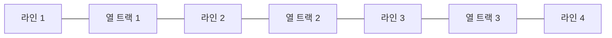

<Callout type="info">
  **이번 문서의 목표:** 이 문서를 다 읽으면 grid 아이템을 라인 번호로 정확히 원하는 칸에 배치하거나 `grid-template-areas`로 이름을 붙여 배치할 수 있고, 트랙 개수보다 아이템이 많을 때 브라우저가 만들어 내는 암시적 트랙의 동작 방식을 설명할 수 있게 됩니다.
</Callout>

## 왜 필요한가

23편에서 `grid-template-columns`/`grid-template-rows`로 격자의 틀(트랙)을 짜는 법을 배웠습니다. 하지만 트랙을 정의한 것만으로는 "어떤 아이템이 어느 칸에 들어가는가"까지는 정해지지 않습니다. 기본적으로 grid 아이템들은 정의된 칸에 **순서대로 하나씩** 채워지는데, 실무에서는 특정 아이템만 두 칸을 차지하게 하거나, 순서와 무관하게 특정 위치에 고정하고 싶은 경우가 자주 생깁니다. 예를 들어 랜딩 페이지의 히어로(hero, 첫 화면 큰 배너) 영역은 격자의 맨 위 전체 너비를 차지하고, 그 아래 사이드바와 본문은 각각 정해진 칸에 들어가야 합니다.

> **쉽게 말하면:** 23편이 "모눈종이에 칸을 그리는 법"이었다면, 이번 편은 "그 칸 중 어디에 무엇을 놓을지 지정하는 법"입니다.

## 라인 번호라는 개념

Grid는 트랙 자체가 아니라, 트랙과 트랙 사이의 경계선인 **라인**(line, 격자선)에 번호를 매겨 배치 기준으로 삼습니다. 열이 3개면 열 라인은 왼쪽부터 1, 2, 3, 4번(트랙 개수 + 1)이 매겨지고, 행도 마찬가지입니다.



아이템을 배치할 때는 "몇 번째 트랙"이 아니라 "몇 번 라인에서 시작해 몇 번 라인까지"로 표현합니다.

```css
.item {
  grid-column: 1 / 3; /* 1번 라인에서 시작해 3번 라인까지 = 첫 두 열을 차지 */
}
```

`grid-column`(그리드 컬럼, 격자 열 배치)은 `grid-column-start`와 `grid-column-end`를 한 번에 지정하는 축약형이고, `grid-row`(그리드 로우, 격자 행 배치)는 같은 방식으로 행을 지정합니다. 이 라인 번호 방식이 처음에는 "왜 트랙 번호가 아니라 라인 번호냐"고 헷갈리기 쉬운데, **하나의 아이템이 여러 트랙에 걸쳐 있을 수 있기 때문에 트랙 번호만으로는 시작과 끝을 동시에 표현할 수 없다**는 것이 이유입니다. 라인 번호는 "시작 경계"와 "끝 경계"를 명확히 짚어 줍니다.

## span 키워드 — 몇 칸을 차지할지로 표현하기

끝 라인 번호를 직접 계산하는 대신, **span**(스팬, 걸치다)이라는 키워드로 "몇 개의 트랙을 차지할지"를 표현할 수 있습니다.

```css
.item {
  grid-column: 1 / span 2; /* 1번 라인에서 시작해 2개 트랙을 차지 = grid-column: 1 / 3 과 동일 */
}
```

`span` 방식은 열 개수가 바뀌어도 "몇 칸 차지하는지"라는 의도가 코드에 그대로 드러나서, 실무에서는 끝 라인 번호를 직접 계산하는 것보다 `span`을 쓰는 경우가 더 많습니다.

## grid-template-areas — 이름으로 배치하기

라인 번호는 정확하지만 숫자만 보고는 전체 레이아웃 모양이 한눈에 그려지지 않는다는 단점이 있습니다. 이 단점을 해결한 것이 **grid-template-areas**(그리드 템플릿 에어리어즈, 격자 영역 틀)입니다. 문자 그대로 CSS 코드 안에 레이아웃의 모양을 글자 그림으로 그릴 수 있습니다.

```css
.layout {
  display: grid;
  grid-template-columns: 240px 1fr;
  grid-template-rows: auto 1fr auto;
  grid-template-areas:
    "sidebar header"
    "sidebar main"
    "sidebar footer";
}
.sidebar { grid-area: sidebar; }
.header  { grid-area: header; }
.main    { grid-area: main; }
.footer  { grid-area: footer; }
```

`grid-template-areas`의 각 문자열 한 줄이 격자의 한 행을 나타내고, 같은 이름이 반복되는 칸은 그 이름을 가진 아이템이 여러 칸에 걸쳐 차지한다는 뜻입니다. 위 예시에서 `sidebar`라는 이름이 세 행 모두에 나타나므로, `.sidebar` 요소는 왼쪽 열 세 칸을 세로로 전부 차지합니다. 각 grid 아이템은 `grid-area` 속성에 자신이 채울 이름을 적기만 하면 됩니다.

이 방식의 가장 큰 장점은 **CSS 코드 자체가 레이아웃의 시각적 지도 역할**을 한다는 점입니다. 라인 번호로 짠 코드는 브라우저가 실제로 그려 봐야 모양을 알 수 있지만, `grid-template-areas`는 CSS 파일만 읽어도 전체 구조가 그림처럼 보입니다.

<Callout type="warning">
  **자주 틀리는 점:** `grid-template-areas`의 문자열에서 칸을 비워 두고 싶을 때는 마침표(`.`)를 씁니다. 빈 문자열이나 임의의 이름을 넣으면 원하지 않는 이름의 영역이 생기거나 격자 모양이 깨집니다.
</Callout>

## 암시적 트랙과 grid-auto-flow

`grid-template-columns`/`grid-template-rows`로 정의한 트랙을 **명시적 트랙**(explicit track)이라고 부릅니다. 그런데 아이템 개수가 정의된 칸보다 많으면, 브라우저는 자동으로 트랙을 추가로 만들어 나머지 아이템을 배치합니다. 이렇게 자동으로 생기는 트랙을 **암시적 트랙**(implicit track)이라고 부릅니다.

```css
.grid {
  display: grid;
  grid-template-columns: repeat(3, 1fr); /* 명시적으로 3개 열만 정의 */
  grid-auto-rows: 100px; /* 암시적으로 생기는 행의 높이를 100px로 지정 */
}
```

`grid-auto-rows`/`grid-auto-columns`는 이렇게 새로 생기는 암시적 트랙의 크기를 지정합니다. 지정하지 않으면 암시적 트랙은 콘텐츠 크기에 맞춰 자동으로 결정됩니다.

**grid-auto-flow**(그리드 오토 플로우, 격자 자동 흐름)는 명시적 트랙이 다 찼을 때 다음 아이템을 어느 방향으로 흘려보낼지 정합니다. 초기값은 `row`(행 우선 — 가로로 채우다가 다 차면 다음 행으로)이며, `column`(열 우선)으로 바꾸면 세로로 먼저 채워 나갑니다.

<CodePlayground
  template="static"
  activeFile="/styles.css"
  label="grid-template-areas의 문자열 배열을 바꿔가며 header·sidebar·main·footer의 배치가 어떻게 달라지는지 확인하세요"
  files={{
    '/index.html': `<div class="layout">
  <header class="header">header</header>
  <aside class="sidebar">sidebar</aside>
  <main class="main">main</main>
  <footer class="footer">footer</footer>
</div>`,
    '/styles.css': `.layout {
  display: grid;
  grid-template-columns: 140px 1fr;
  grid-template-rows: auto 1fr auto;
  gap: 8px;
  height: 260px;

  /* "main sidebar" 처럼 순서를 바꾸거나, sidebar 위치를 옮겨 보세요 */
  grid-template-areas:
    "sidebar header"
    "sidebar main"
    "sidebar footer";
}
.header  { grid-area: header; background: #a5b4fc; }
.sidebar { grid-area: sidebar; background: #6366f1; color: white; }
.main    { grid-area: main; background: #c7d2fe; }
.footer  { grid-area: footer; background: #a5b4fc; }
.header, .sidebar, .main, .footer {
  padding: 12px;
  font-family: sans-serif;
}`,
  }}
/>

`grid-template-areas`의 첫 줄을 `"header header"`로 바꾸고 두 번째·세 번째 줄의 `sidebar`를 각각의 위치에 맞게 조정해 보면, 사이드바가 왼쪽 전체를 차지하는 구조에서 위쪽 전체를 차지하는 구조로 손쉽게 바뀌는 것을 확인할 수 있습니다. 문자열 그림만 바꾸면 되므로 라인 번호를 다시 계산할 필요가 없습니다.

## 접근성 관점

Grid 배치 속성(`grid-column`, `grid-row`, `grid-area`)은 시각적 위치만 결정할 뿐, DOM 순서를 바꾸지 않습니다. 즉 마크업에 `header`, `sidebar`, `main`, `footer` 순서로 써 두었어도 `grid-template-areas`로 사이드바를 시각적으로 맨 위에 배치할 수 있습니다. 이때도 21편의 `order`와 마찬가지로 스크린 리더 낭독 순서와 키보드 `Tab` 이동 순서는 DOM에 쓰인 순서를 따르므로, 시각적 순서와 논리적 순서가 크게 어긋나지 않도록 마크업 순서 자체를 신경 쓰는 것이 중요합니다. 특히 랜딩 페이지처럼 시각적으로는 사이드바가 위에 있어도 논리적으로는 본문이 먼저 읽혀야 하는 구조라면, 마크업 순서를 본문 우선으로 두고 Grid 배치로 시각적 위치만 조정하는 것이 바람직합니다.

## 자주 틀리는 점

- **라인 번호를 트랙 번호와 혼동하는 것.** 열이 3개면 라인은 1번부터 4번까지 있으며, `grid-column: 1 / 3`은 "1번 트랙부터 3번 트랙까지"가 아니라 "1번 라인부터 3번 라인까지(즉 첫 두 트랙)"를 뜻합니다.
- **`grid-template-areas`에서 빈 칸을 표시할 때 마침표(`.`) 대신 다른 문자나 빈 문자열을 쓰는 것.** 반드시 마침표를 써야 빈 칸으로 인식됩니다.
- **아이템 개수가 트랙 개수를 넘었을 때 "레이아웃이 깨졌다"고 오해하는 것.** 실제로는 브라우저가 암시적 트랙을 자동 생성해 나머지 아이템을 배치한 것이며, `grid-auto-rows`/`grid-auto-columns`로 그 트랙의 크기를 원하는 값으로 조정할 수 있습니다.

## 핵심 정리

- Grid 배치는 트랙이 아니라 트랙 사이의 경계선인 라인 번호를 기준으로 하며, 열이 n개면 라인은 n+1개다.
- `span` 키워드는 끝 라인 번호 대신 "몇 칸을 차지할지"를 직접 표현해 코드의 의도를 더 명확히 드러낸다.
- `grid-template-areas`는 문자열 그림으로 레이아웃 구조를 CSS 코드 안에 직접 표현하는 방식이며, 빈 칸은 마침표로 표시한다.
- 정의한 트랙(명시적 트랙)보다 아이템이 많으면 브라우저가 암시적 트랙을 자동 생성하며, `grid-auto-flow`로 채워지는 방향을, `grid-auto-rows`/`grid-auto-columns`로 그 크기를 제어한다.

## 마무리 복습

<Quiz
  questionNumber={1}
  question="열이 3개인 Grid 컨테이너에서 열 라인 번호의 범위로 옳은 것은?"
  options={['1번부터 3번까지', '0번부터 3번까지', '1번부터 4번까지', '트랙마다 라인 번호가 두 개씩 있어 총 6개']}
  correctAnswer={3}
  explanation="라인은 트랙 사이의 경계선이므로 트랙이 n개면 라인은 n+1개다. 열이 3개면 왼쪽부터 1, 2, 3, 4번까지 총 4개의 라인이 생긴다."
  optionExplanations={['트랙 개수와 라인 개수를 같다고 착각한 경우다', '라인 번호는 0이 아니라 1부터 시작한다', '정답 — 트랙 개수보다 라인 개수가 하나 더 많다', '각 라인은 하나의 번호만 가진다']}
/>

<Quiz
  questionNumber={2}
  question="grid-column: 1 / span 2; 에 대한 설명으로 옳은 것은?"
  options={['1번 트랙 하나만 차지한다', '1번 라인에서 시작해 2개의 트랙을 차지한다', 'grid-column: 1 / 2 와 완전히 같다', '2번째 열부터 시작한다']}
  correctAnswer={2}
  explanation="span 2는 시작 라인으로부터 2개의 트랙을 차지하겠다는 뜻이므로, grid-column: 1 / span 2는 grid-column: 1 / 3과 동일하다."
  optionExplanations={['span 2는 트랙 하나가 아니라 두 개를 차지한다는 뜻이다', '정답 — 1번 라인에서 시작해 두 트랙을 차지한다', 'grid-column: 1 / 2는 트랙 하나만 차지하는 표현이라 다르다', '시작 라인은 1번으로 명시되어 있다']}
/>

<Quiz
  questionNumber={3}
  question="grid-template-areas에서 특정 칸을 비워 두고 싶을 때 사용하는 표기로 옳은 것은?"
  options={['빈 문자열로 둔다', '마침표(.)를 넣는다', 'none이라는 이름을 넣는다', '해당 칸을 아예 생략하고 한 칸 적게 쓴다']}
  correctAnswer={2}
  explanation="grid-template-areas에서 빈 칸을 표현하는 정해진 표기는 마침표(.)다. 다른 방식은 원치 않는 영역이 생기거나 격자 구조가 깨질 수 있다."
  optionExplanations={['빈 문자열은 정해진 문법이 아니다', '정답 — 마침표가 빈 칸을 나타내는 표준 표기다', 'none이라는 이름의 영역이 실제로 생겨버린다', '칸 수를 맞추지 않으면 격자 구조 자체가 깨진다']}
/>

<Quiz
  questionNumber={4}
  question="명시적 트랙과 암시적 트랙의 차이로 옳은 것은?"
  options={['명시적 트랙은 grid-template-columns 등으로 직접 정의한 것이고, 암시적 트랙은 아이템이 넘칠 때 브라우저가 자동 생성한 것이다', '암시적 트랙은 개발자가 이름을 붙여야만 생긴다', '명시적 트랙은 항상 fr 단위만 사용할 수 있다', '암시적 트랙이 생기면 빌드 경고가 발생한다']}
  correctAnswer={1}
  explanation="grid-template-columns/rows로 직접 정의한 트랙이 명시적 트랙이고, 정의된 트랙 수보다 아이템이 많을 때 브라우저가 자동으로 추가하는 트랙이 암시적 트랙이다."
  optionExplanations={['정답 — 정의 여부와 자동 생성 여부가 핵심 차이다', '암시적 트랙은 자동으로 생기며 이름 지정이 필요 없다', '명시적 트랙은 픽셀·퍼센트 등 다양한 단위를 쓸 수 있다', '경고 없이 정상적으로 자동 생성되는 정상 동작이다']}
/>

<Quiz
  questionNumber={5}
  question="grid-auto-flow의 초기값과 그 의미로 옳은 것은?"
  options={['column이며, 세로로 먼저 채운다', 'row이며, 가로로 채우다가 다 차면 다음 행으로 넘어간다', 'dense이며, 빈 칸을 최대한 채운다', 'none이며, 자동 배치를 하지 않는다']}
  correctAnswer={2}
  explanation="grid-auto-flow의 초기값은 row이며, 아이템을 가로 방향으로 먼저 채우다가 정의된 열이 다 차면 다음 행으로 넘어가 계속 채운다."
  optionExplanations={['초기값은 column이 아니라 row다', '정답 — 초기값 row는 행 우선으로 채워 나간다', 'dense는 별도로 지정하는 값이며 초기값이 아니다', '자동 배치 자체가 없다는 값은 존재하지 않는다']}
/>

<Quiz
  questionNumber={6}
  question="grid-template-areas 방식이 라인 번호 방식보다 나은 점으로 가장 알맞은 것은?"
  options={['브라우저 성능이 더 빠르다', 'CSS 코드 자체가 문자열 그림으로 레이아웃 구조를 직관적으로 보여준다', '라인 번호 방식은 더 이상 지원되지 않는다', 'grid-template-areas는 fr 단위 없이도 반응형이 자동으로 적용된다']}
  correctAnswer={2}
  explanation="grid-template-areas는 문자열 배열로 레이아웃 모양을 코드 안에 직접 그릴 수 있어, 숫자만 보고는 파악하기 어려운 라인 번호 방식보다 구조를 직관적으로 파악할 수 있다."
  optionExplanations={['성능 차이가 검증된 근거는 없다', '정답 — 코드 자체가 레이아웃의 시각적 지도 역할을 한다', '라인 번호 방식도 여전히 널리 쓰이는 유효한 방식이다', '반응형 자동 적용과는 무관한 기능이다']}
/>

<Quiz
  questionNumber={7}
  question="Grid 배치 속성(grid-area 등)으로 시각적 순서를 DOM 순서와 다르게 만들었을 때 접근성 관점에서 유의할 점으로 옳은 것은?"
  options={['스크린 리더가 자동으로 시각적 순서를 따라 낭독한다', '스크린 리더 낭독과 키보드 Tab 이동 순서는 여전히 DOM 순서를 따르므로 마크업 순서를 신경 써야 한다', 'Grid 배치를 쓰면 접근성 트리 자체가 생성되지 않는다', 'grid-area를 쓰면 자동으로 aria 속성이 부여된다']}
  correctAnswer={2}
  explanation="Flexbox의 order와 마찬가지로 Grid 배치도 시각적 위치만 바꿀 뿐 DOM 순서에는 영향을 주지 않으므로, 스크린 리더 낭독과 키보드 이동 순서는 DOM 순서를 따른다."
  optionExplanations={['스크린 리더는 시각적 순서가 아니라 DOM 순서를 따른다', '정답 — DOM 순서와 시각적 순서의 불일치를 항상 고려해야 한다', '접근성 트리는 정상적으로 생성된다', 'aria 속성은 자동으로 부여되지 않으며 별도로 작성해야 한다']}
/>

## 참고 자료

- [MDN — Basic concepts of grid layout](https://developer.mozilla.org/en-US/docs/Web/CSS/CSS_grid_layout/Basic_concepts_of_grid_layout)
