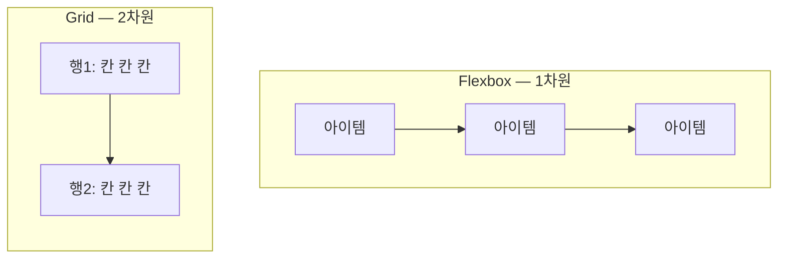

<Callout type="info">
  **이번 문서의 목표:** 이 문서를 다 읽으면 눈앞의 레이아웃을 보고 "이건 Flexbox, 이건 Grid"를 근거를 들어 즉시 판단하고, 실무에서 가장 흔한 "Grid로 큰 틀 + Flexbox로 내부 정렬" 조합을 직접 짤 수 있게 됩니다.
</Callout>

## 왜 필요한가

20~22편에서 Flexbox를, 23~24편에서 Grid를 각각 다뤘습니다. 두 도구를 따로 배우고 나면 실무에서 가장 자주 받는 질문에 부딪힙니다. "이 카드 그리드, Flex로 짜요 Grid로 짜요?" 둘 다 `display` 속성 하나로 자식들을 정렬해 주고, 둘 다 `gap`으로 간격을 준다는 점이 비슷해 보여서 더 헷갈립니다.

하지만 두 모델은 애초에 **다른 질문에 답하려고 설계**됐습니다. 이 차이를 명확히 잡아두면 "둘 다 되는데 아무거나 쓰면 되지 않냐"는 함정에서 벗어나, 상황에 맞는 도구를 곧바로 고를 수 있습니다.

> **쉽게 말하면:** Flexbox는 "한 줄(또는 한 방향)을 어떻게 채울까"에 답하는 도구고, Grid는 "가로세로 격자 전체를 어떻게 채울까"에 답하는 도구입니다.

## 1차원 vs 2차원 — 근본적인 차이

**Flexbox**는 **1차원**(one-dimensional, 한 방향) 레이아웃 모델입니다. 아이템들이 **한 줄**로 늘어서는 것이 기본 동작이며, `flex-wrap: wrap`으로 여러 줄이 생기더라도 각 줄은 서로 독립적으로 채워집니다. 즉 두 번째 줄의 아이템 너비가 첫 번째 줄의 아이템 너비와 맞춰지지 않을 수 있습니다.

**Grid**는 **2차원**(two-dimensional, 두 방향) 레이아웃 모델입니다. 23편에서 다룬 `grid-template-columns`·`grid-template-rows`로 가로 트랙과 세로 트랙을 **동시에** 정의하고, 아이템이 그 격자 칸 안에 배치됩니다. 행과 열이 서로 맞물려 있으므로, 한 열의 너비를 조정하면 모든 행에서 동일하게 반영됩니다.



이 차이를 실제 레이아웃으로 확인해 보면 더 분명합니다. 세로 크기가 다른 카드 세 장을 나란히 놓았을 때, Flexbox는 각 카드의 높이가 제각각이어도 신경 쓰지 않지만, Grid는 같은 행에 속한 칸들의 높이를 자동으로 맞춥니다.

<CodePlayground
  template="static"
  activeFile="/styles.css"
  label="같은 마크업, Flexbox와 Grid의 정렬 결과 차이를 비교하세요"
  files={{
    '/index.html': `<h3>Flexbox</h3>
<div class="flex-box">
  <div class="card">짧은 카드</div>
  <div class="card">줄바꿈이 있는<br/>조금 긴 카드</div>
  <div class="card">세 줄에 걸쳐<br/>내용이 훨씬<br/>더 긴 카드</div>
</div>

<h3>Grid</h3>
<div class="grid-box">
  <div class="card">짧은 카드</div>
  <div class="card">줄바꿈이 있는<br/>조금 긴 카드</div>
  <div class="card">세 줄에 걸쳐<br/>내용이 훨씬<br/>더 긴 카드</div>
</div>`,
    '/styles.css': `.flex-box {
  display: flex;
  gap: 12px;
  margin-bottom: 24px;
}
.grid-box {
  display: grid;
  grid-template-columns: repeat(3, 1fr); /* 3개 열, 균등 분할 */
  gap: 12px;
}
.card {
  background: #c7d2fe;
  padding: 12px;
  font-family: sans-serif;
  border: 2px solid #6366f1;

  /* align-items를 stretch로 바꿔가며 flex-box와 grid-box의
     세로 높이 정렬 차이를 비교해 보세요 */
}`,
  }}
/>

`.flex-box`의 카드 세 장은 각자 자기 내용만큼만 높이를 차지하지만, `.grid-box`의 카드 세 장은 셋 중 가장 높은 카드에 맞춰 나머지 두 칸의 높이가 자동으로 늘어납니다. 이것이 "행과 열이 맞물려 있다"는 말의 실제 의미입니다.

## 콘텐츠 중심 vs 레이아웃 중심

두 모델의 차이를 실전 판단 기준으로 바꾸면 다음과 같은 질문이 됩니다.

- **콘텐츠 중심**(content-out): "아이템이 몇 개 올지, 각각 얼마나 커질지 미리 모른다. 콘텐츠 크기에 맞춰 배치가 알아서 흘러가면 좋겠다." → Flexbox
- **레이아웃 중심**(layout-out): "화면을 몇 개의 칸으로 미리 나눠 놓고, 각 콘텐츠를 그 칸에 끼워 넣고 싶다." → Grid

| 기준 | Flexbox | Grid |
|------|---------|------|
| 차원 | 1차원(한 방향) | 2차원(행과 열 동시) |
| 설계 의도 | 콘텐츠 크기에 맞춘 정렬 | 미리 정의한 트랙에 배치 |
| 아이템 크기 결정 | 콘텐츠 크기 기준으로 유연하게 늘고 줄어듦 | 트랙 크기(`fr`, 고정값 등) 기준으로 결정 |
| 정렬 대상 | 아이템 하나하나 | 트랙(행·열) 단위 |
| 대표 용도 | 네브바, 버튼 그룹, 카드 내부 정렬 | 페이지 전체 틀, 카드 그리드, 대시보드 |

<Callout type="warning">
  **자주 틀리는 점:** "Grid가 더 최신이니까 Grid가 Flexbox의 상위 호환이다"라고 단정하는 것입니다. 둘은 우열 관계가 아니라 **목적이 다른 도구**입니다. 세로 정렬 하나만 필요한 버튼 그룹에 Grid를 쓰면 트랙을 정의하는 코드가 오히려 늘어나고, 반대로 복잡한 2차원 격자를 Flexbox로 흉내 내려 하면 `flex-wrap`의 줄 간 정렬이 어긋나는 상황과 계속 씨름하게 됩니다.
</Callout>

## 함께 쓰는 흔한 조합 — Grid로 큰 틀, Flexbox로 내부 정렬

실무에서는 "둘 중 하나만" 쓰는 경우보다, **바깥은 Grid로 큰 틀을 짜고 안쪽은 Flexbox로 세부 정렬**하는 조합이 훨씬 흔합니다. 카드 그리드를 예로 들면 이렇습니다.

```css
.card-grid {
  display: grid;
  grid-template-columns: repeat(auto-fit, minmax(220px, 1fr)); /* 24편에서 다룬 암시적 트랙 개념의 응용 */
  gap: 20px;
}

.card {
  display: flex;        /* 카드 하나의 내부는 Flexbox */
  flex-direction: column;
  justify-content: space-between; /* 제목은 위, 버튼은 아래로 밀어냄 */
}
```

바깥 `.card-grid`는 "화면을 몇 개의 칸으로 나눌지"를 결정하는 2차원 문제이므로 Grid가, 안쪽 `.card`는 "제목과 버튼을 세로로 어떻게 배치할지"를 결정하는 1차원 문제이므로 Flexbox가 맡습니다. 하나의 문제를 억지로 하나의 도구로 풀려 하지 않고, 문제의 성격이 바뀌는 지점마다 도구를 바꾼다는 감각이 핵심입니다.

## 판단 순서 정리

레이아웃을 마주쳤을 때 아래 순서로 스스로 물어보면 됩니다.

1. **행과 열을 동시에 맞춰야 하는가?** (예: 카드들의 세로줄과 가로줄이 격자처럼 정렬돼야 한다) → 그렇다면 Grid.
2. **한 방향으로만 늘어서면 되는가?** (예: 메뉴 항목들이 가로로 한 줄, 또는 폼 필드들이 세로로 한 줄) → 그렇다면 Flexbox.
3. **바깥은 격자, 안쪽은 한 방향 정렬인가?** → 바깥은 Grid, 안쪽은 Flexbox로 중첩.

## 접근성 관점

Grid와 Flexbox 둘 다 시각적 배치만 담당할 뿐 기본적으로 DOM(Document Object Model, 문서 객체 모델) 순서를 유지하므로, 스크린 리더 낭독 순서와 키보드 `Tab` 이동 순서는 그대로 보존됩니다. 다만 Grid의 `grid-template-areas`(24편)나 명시적 라인 배치, Flexbox의 `order`(21편)로 시각적 순서를 DOM 순서와 다르게 만들 수 있다는 점은 두 모델 모두 동일하게 주의해야 합니다. 시각적으로만 순서를 바꾸고 DOM 순서를 그대로 둔 채 방치하면, 화면을 보는 사용자와 스크린 리더로 듣는 사용자가 서로 다른 순서를 경험하게 됩니다.

## 자주 틀리는 점

- **"카드가 여러 개니까 무조건 Grid"라고 단정하는 것.** 카드 개수가 가변적이고 한 줄로만 늘어서면 되는 상황이라면 `flex-wrap: wrap`을 쓴 Flexbox로도 충분하며 오히려 더 간단합니다. 행과 열의 정렬이 실제로 필요한지가 기준입니다.
- **Grid 안에서 Flexbox를 쓰면 안 된다고 오해하는 것.** 두 모델은 중첩해서 함께 쓸 수 있으며, 오히려 그것이 실무의 표준 패턴입니다.
- **Grid가 Flexbox보다 성능이 느리다거나 빠르다고 단정하는 것.** 두 모델의 선택 기준은 성능이 아니라 "1차원이냐 2차원이냐"라는 설계 목적의 차이입니다.

## 핵심 정리

- Flexbox는 1차원(한 방향) 정렬 모델이고, Grid는 행과 열을 동시에 다루는 2차원 배치 모델이다.
- Flexbox는 콘텐츠 크기에 맞춰 유연하게 늘어서는 상황에, Grid는 미리 정의한 격자에 콘텐츠를 끼워 넣는 상황에 알맞다.
- 실무에서는 바깥은 Grid로 큰 틀을 짜고 안쪽은 Flexbox로 세부 정렬하는 중첩 조합이 흔하다.
- 두 모델 모두 시각적 순서 변경(`order`, `grid-template-areas` 등)이 DOM 순서 기반의 접근성 탐색 순서와 어긋날 수 있다는 점을 함께 고려해야 한다.

## 마무리 복습

<Quiz
  questionNumber={1}
  question="Flexbox와 Grid의 근본적인 차이로 가장 정확한 것은?"
  options={['Flexbox는 색을 다루고 Grid는 크기를 다룬다', 'Flexbox는 1차원(한 방향) 정렬, Grid는 행과 열을 동시에 다루는 2차원 배치 모델이다', 'Grid는 최신 브라우저에서만 동작하고 Flexbox는 모든 브라우저에서 동작한다', 'Flexbox는 표(table) 태그 전용이고 Grid는 div 전용이다']}
  correctAnswer={2}
  explanation="Flexbox는 한 방향으로 늘어선 아이템을 정렬하는 1차원 모델이고, Grid는 가로 트랙과 세로 트랙을 동시에 정의해 배치하는 2차원 모델이다."
  optionExplanations={['색상 처리와는 무관한 구분이다', '정답 — 차원의 개수가 두 모델의 근본적 차이다', '둘 다 현재 모든 주요 브라우저에서 널리 사용 가능하다', '둘 다 어떤 요소에든 display 값으로 적용할 수 있다']}
/>

<Quiz
  questionNumber={2}
  question="세로 크기가 서로 다른 카드 세 장을 한 줄에 나란히 놓았을 때, Grid가 Flexbox와 다르게 동작하는 부분은?"
  options={['Grid는 카드에 배경색을 자동으로 넣어준다', 'Grid는 같은 행에 속한 칸들의 높이를 자동으로 맞춘다', 'Flexbox는 카드 개수를 최대 3개로 제한한다', 'Grid는 카드 사이 간격을 줄 수 없다']}
  correctAnswer={2}
  explanation="Grid는 행과 열이 맞물려 있으므로, 같은 행에 속한 칸들은 그중 가장 큰 콘텐츠에 맞춰 높이가 자동으로 통일된다. Flexbox는 줄이 서로 독립적이라 이런 통일이 일어나지 않는다."
  optionExplanations={['배경색은 별도로 지정해야 하며 자동 적용되지 않는다', '정답 — 행 단위로 높이가 맞물리는 것이 Grid의 2차원 특성이다', '카드 개수 제한과는 무관한 속성이다', 'Grid도 gap 속성으로 간격을 줄 수 있다']}
/>

<Quiz
  questionNumber={3}
  question="다음 중 Flexbox가 Grid보다 더 알맞은 상황은?"
  options={['대시보드 전체를 여러 구역으로 나누어 배치할 때', '카드 하나 내부에서 제목은 위, 버튼은 아래로 한 방향으로 밀어낼 때', '가로세로 격자 형태의 갤러리를 만들 때', '페이지 전체 레이아웃을 헤더·사이드바·본문·푸터로 나눌 때']}
  correctAnswer={2}
  explanation="한 방향(세로)으로 콘텐츠를 밀어내는 것은 1차원 문제이므로 Flexbox가 알맞다. 나머지는 행과 열을 동시에 정의해야 하는 2차원 배치 문제로 Grid가 더 알맞다."
  optionExplanations={['여러 구역으로 나누는 것은 2차원 배치이므로 Grid가 알맞다', '정답 — 한 방향 정렬은 Flexbox의 전형적인 용도다', '격자 형태는 행과 열이 맞물리는 2차원 문제다', '헤더·사이드바·본문·푸터 구성도 2차원 배치 문제다']}
/>

<Quiz
  questionNumber={4}
  question="Grid로 바깥 틀을 짜고 안쪽 카드는 Flexbox로 정렬하는 중첩 조합에 대한 설명으로 옳은 것은?"
  options={['CSS 명세상 금지된 조합이라 브라우저가 무시한다', '실무에서 흔히 쓰이는 조합이며, 문제의 성격이 2차원에서 1차원으로 바뀌는 지점에서 도구를 바꾸는 방식이다', 'Grid 컨테이너 안에서는 display: flex를 선언할 수 없다', '두 레이아웃 모델을 함께 쓰면 반드시 레이아웃이 깨진다']}
  correctAnswer={2}
  explanation="Grid와 Flexbox는 서로 다른 요소 계층에 독립적으로 적용할 수 있으며, 바깥은 격자 배치(Grid) 안쪽은 한 방향 정렬(Flexbox)로 나누는 조합이 실무 표준 패턴이다."
  optionExplanations={['그런 금지 규정은 존재하지 않는다', '정답 — 문제 성격에 따라 도구를 바꿔 중첩하는 것이 표준 패턴이다', 'Grid 아이템 내부에 별도로 display: flex를 선언하는 것은 가능하다', '올바르게 사용하면 레이아웃이 깨지지 않는다']}
/>

<Quiz
  questionNumber={5}
  question="레이아웃을 판단할 때 던지는 질문으로 옳지 않은 것은?"
  options={['행과 열을 동시에 맞춰야 하는가', '한 방향으로만 늘어서면 되는가', '색상이 몇 가지인가', '바깥은 격자, 안쪽은 한 방향 정렬인가']}
  correctAnswer={3}
  explanation="Flexbox와 Grid를 고르는 기준은 차원(1차원 vs 2차원)과 배치 구조이지, 색상 개수와는 무관하다."
  optionExplanations={['Grid를 선택하는 핵심 질문이다', 'Flexbox를 선택하는 핵심 질문이다', '정답 — 색상은 레이아웃 모델 선택과 무관한 기준이다', '중첩 조합을 판단하는 핵심 질문이다']}
/>

<Quiz
  questionNumber={6}
  question="Grid의 grid-template-areas나 Flexbox의 order로 시각적 순서를 DOM 순서와 다르게 바꿨을 때 발생할 수 있는 문제는?"
  options={['CSS 빌드 자체가 실패한다', '스크린 리더 낭독 순서나 키보드 Tab 이동 순서가 시각적 순서와 어긋날 수 있다', '두 속성을 함께 쓰면 색상이 사라진다', 'gap 속성이 자동으로 0으로 초기화된다']}
  correctAnswer={2}
  explanation="스크린 리더 낭독과 키보드 이동은 기본적으로 DOM 순서를 따르므로, 시각적 순서만 바꾸고 DOM 순서를 그대로 두면 시각 사용자와 스크린 리더 사용자가 다른 순서를 경험하게 된다."
  optionExplanations={['이는 문법 오류가 아니라 정상적으로 지원되는 기능이다', '정답 — DOM 순서 기반 탐색과 시각적 순서가 어긋나는 것이 실제 위험이다', '색상과는 무관한 문제다', 'gap 값은 순서 변경과 독립적으로 유지된다']}
/>

## 참고 자료

- [MDN — Basic concepts of grid layout](https://developer.mozilla.org/en-US/docs/Web/CSS/CSS_grid_layout/Basic_concepts_of_grid_layout)
- [MDN — Basic concepts of flexbox](https://developer.mozilla.org/en-US/docs/Web/CSS/CSS_flexible_box_layout/Basic_concepts_of_flexbox)
