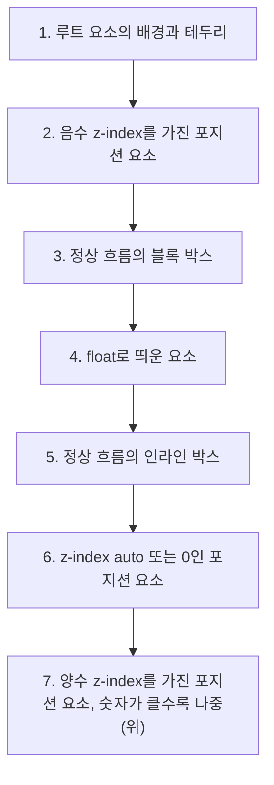

<Callout type="info">
  **이번 문서의 목표:** 이 문서를 다 읽으면 `overflow` 값 네 가지의 차이를 스크롤 컨테이너 관점에서 설명하고, `z-index`가 의도대로 동작하지 않는 상황을 만났을 때 스택 컨텍스트(stacking context) 형성 조건을 추적해 원인을 스스로 진단할 수 있게 됩니다.
</Callout>

## 왜 필요한가

박스 모델(11편)에서 요소의 크기는 `width`·`height`·`padding`·`border`로 정해진다고 배웠습니다. 그런데 그 상자 안에 들어갈 콘텐츠(content, 내용물)의 실제 크기는 상자와 무관하게 결정됩니다. 글자 수가 많은 문장, 줄바꿈 없는 긴 URL, 상자보다 큰 이미지가 들어오면 콘텐츠가 상자 밖으로 **넘칩니다.** 이 "넘침"을 어떻게 처리할지 브라우저에게 지시하는 속성이 `overflow`(오버플로, 넘침)입니다.

한편 실무에서는 요소를 겹쳐 쌓아야 하는 순간이 항상 생깁니다. 모달 창은 페이지의 다른 모든 요소 위에 떠야 하고, 드롭다운 메뉴는 바로 아래 카드 위에 겹쳐야 합니다. `z-index`(제트 인덱스)는 이 쌓임 순서를 정하는 속성입니다. 그런데 초보자가 거의 예외 없이 겪는 사고가 있습니다. `z-index: 9999`처럼 큰 숫자를 줬는데도 다른 요소 뒤에 숨어버리는 현상입니다. 이 편의 핵심은 이 사고가 버그가 아니라 **스택 컨텍스트**(stacking context, 쌓임 맥락)라는 정확한 규칙의 결과라는 것을 보여주는 것입니다.

> **쉽게 말하면:** `overflow`는 "상자보다 콘텐츠가 크면 어떻게 할까"를 정하고, `z-index`는 "여러 상자가 겹치면 어느 것을 위에 그릴까"를 정합니다. 다만 `z-index`의 비교는 **같은 층(layer, 레이어)끼리만** 유효합니다.

## overflow — 넘친 콘텐츠 다루기

### 네 가지 값 비교

| 값 | 넘친 부분 | 스크롤바 | 스크롤 가능 여부 |
|----|-----------|----------|------------------|
| `visible` (초기값) | 상자 밖으로 그대로 보임 | 없음 | 불가능(잘리지 않고 흘러나감) |
| `hidden` | 상자 경계에서 잘려 안 보임 | 없음 | 마우스로는 불가능(자바스크립트로는 스크롤 위치 조정 가능) |
| `scroll` | 잘리고, 스크롤로 볼 수 있음 | 항상 표시(넘치지 않아도) | 가능 |
| `auto` | 잘리고, 스크롤로 볼 수 있음 | 필요할 때만 표시 | 가능 |

실무에서는 `auto`를 압도적으로 많이 씁니다. 콘텐츠가 상자보다 작을 때 불필요한 스크롤바가 항상 떠 있는 것은 어색하기 때문입니다. `scroll`은 "콘텐츠 양과 무관하게 항상 스크롤 영역이라는 것을 시각적으로 알려주고 싶을 때"처럼 의도적으로 고정된 스크롤바가 필요한 드문 경우에 씁니다.

`overflow-x`와 `overflow-y`로 가로·세로를 따로 지정할 수 있고, `overflow`는 두 값을 한 번에 지정하는 축약형입니다. 값을 하나만 쓰면(`overflow: hidden`) 가로·세로 모두에 적용됩니다.

```css
.카드-목록 {
  max-height: 300px;
  overflow-y: auto;   /* 세로만 스크롤, 가로는 기본값(visible) 유지 */
}
```

### 스크롤 컨테이너와 접근성

`overflow`가 `scroll`이나 `auto`로 실제 스크롤이 가능해진 요소를 **스크롤 컨테이너**(scroll container)라고 부릅니다. 마우스나 트랙패드 사용자는 커서를 올리고 휠을 굴리면 그만이지만, 키보드만 쓰는 사용자는 그 영역에 **포커스**(focus, 초점)를 둘 수 없으면 스크롤할 방법이 없습니다. 스크롤 컨테이너가 버튼이나 링크 같은 포커스 가능한 자식을 하나도 포함하지 않는다면 `tabindex="0"`을 직접 붙여 `Tab` 키로 진입 가능하게 만들어야 합니다. 스크린 리더 사용자에게는 `role="region"`과 `aria-label`을 함께 주어 "여기부터 별도의 스크롤 영역"이라는 것을 알려주는 것이 좋습니다.

<Callout type="warning">
  **자주 틀리는 점:** `overflow: hidden`은 "숨김"이라는 이름 때문에 `display: none`이나 `visibility: hidden`과 헷갈리기 쉽습니다. `overflow: hidden`은 콘텐츠 자체를 없애는 것이 아니라 **상자 경계 밖으로 나간 부분만** 자릅니다. 상자 안에 있는 내용은 그대로 보입니다. 세 속성의 차이는 16편에서 이미 정리했습니다.
</Callout>

### overflow의 숨은 효과 — BFC 생성

17편에서 `overflow: hidden`이 **블록 서식 맥락**(BFC, Block Formatting Context)을 새로 만드는 대표적인 방법이라고 배웠습니다. 그래서 실무에서 `overflow: hidden`을 넘침 처리 목적이 아니라 "float를 감싸 컨테이너 높이를 살리는" 용도로 쓰는 경우도 흔합니다. 다만 그 부작용으로 자식 요소가 부모 경계를 살짝 벗어나는 툴팁이나 그림자(box-shadow)까지 함께 잘려나갈 수 있다는 점을 기억해야 합니다.

## 스택 컨텍스트 — 쌓임에도 맥락이 있다

### 정의와 페인팅 순서

브라우저가 화면을 그릴 때, 같은 자리에 여러 요소가 겹치면 어떤 순서로 위에 덮어 그릴지 정해야 합니다. 이 순서를 정하는 규칙 전체를 **스택 컨텍스트**(stacking context)라고 부릅니다. 아무 `z-index`도 주지 않은 평범한 페이지에서도, 브라우저는 다음과 같은 고정된 순서로 그립니다.



여기서 이미 중요한 사실 하나가 드러납니다. **float로 띄운 요소는 정상 흐름 블록보다 위에, 인라인 요소보다는 아래에 그려집니다.** 그래서 `position` 없이 float만으로 겹침을 제어하려 하면 항상 어중간한 결과가 나옵니다. `z-index`가 필요한 이유입니다.

### z-index가 동작하려면

`z-index`는 `position` 값이 `static`이 아닌 요소(`relative`·`absolute`·`fixed`·`sticky`)에만 적용됩니다. `position: static`인 요소에 `z-index`를 줘도 완전히 무시됩니다.

```css
.배지 {
  position: relative;  /* 이게 없으면 z-index는 아무 효과가 없다 */
  z-index: 5;
}
```

`position`과 `z-index`를 함께 주는 것 외에도, `opacity`가 1 미만인 요소나 `transform`이 적용된 요소는 `position` 없이도 **자기 자신이 새로운 스택 컨텍스트를 만듭니다.** 이런 속성들은 다음 절의 "격리"와 직결되므로 먼저 스택 컨텍스트의 핵심 성질을 봐야 합니다.

### 스택 컨텍스트는 부모 단위로 격리된다

여기가 이 편에서 가장 많이 오해하는 지점입니다. 스택 컨텍스트를 만드는 요소(예: `position: relative` + `z-index` 지정)는 **자기 자신과 모든 자손을 하나의 그룹**으로 묶습니다. 이 그룹 안에서 자손들이 아무리 큰 `z-index`를 가져도, 그 비교는 **그룹 내부에서만** 유효합니다. 그룹 전체가 그룹 바깥의 다른 요소와 겹칠 때는, 그룹을 만든 부모의 `z-index` 하나로 대표되어 비교됩니다.

> **쉽게 말하면:** 스택 컨텍스트는 회사 조직도입니다. 부장 A(z-index 1) 밑에 부하 직원이 아무리 높은 직급(z-index 9999)을 자칭해도, 그건 A팀 안에서만 통합니다. 다른 팀 팀장 B(z-index 2)와 순위를 겨룰 때는 A팀 대표로 부장 A(1)가 나가고, B(2)에게 집니다.

값을 바꿔가며 이 함정을 직접 확인해 보세요. `.박스A .안쪽`의 `z-index`를 얼마나 키워도 `.박스B`를 이길 수 없다는 것이 핵심입니다.

<CodePlayground
  template="static"
  activeFile="/styles.css"
  label="스택 컨텍스트 격리 확인 — 안쪽 z-index를 999999로 바꿔도 결과는 그대로다"
  files={{
    '/index.html': `<!DOCTYPE html>
<html lang="ko">
<head>
  <meta charset="UTF-8">
  <link rel="stylesheet" href="styles.css">
</head>
<body>
  <div class="박스A">
    <p>박스 A (z-index: 1)</p>
    <div class="안쪽">A의 자식 (z-index: 9999)</div>
  </div>
  <div class="박스B">박스 B (z-index: 2)</div>
</body>
</html>`,
    '/styles.css': `body {
  font-family: system-ui, sans-serif;
  position: relative;
  height: 220px;
}

.박스A {
  position: absolute;
  top: 20px;
  left: 20px;
  width: 260px;
  height: 160px;
  background: #d0ebff;
  border: 2px solid #339af0;
  padding: 8px;
  z-index: 1;   /* 이 값이 박스A 전체를 대표하는 순위다 */
}

.안쪽 {
  position: absolute;
  top: 60px;
  left: 30px;
  width: 220px;
  padding: 8px;
  background: #ffe066;
  border: 2px solid #f59f00;
  z-index: 9999;  /* 아무리 키워도 박스A 밖으로는 못 나간다 */
}

.박스B {
  position: absolute;
  top: 90px;
  left: 140px;
  width: 220px;
  height: 100px;
  background: #ffc9c9;
  border: 2px solid #e03131;
  padding: 8px;
  z-index: 2;   /* 박스A(1)보다만 크면 박스A 전체를 덮는다 */
}`,
  }}
/>

`.안쪽`의 `z-index: 9999`는 `.박스A`라는 스택 컨텍스트 내부에서만 의미가 있습니다. `.박스A`가 바깥세상(`.박스B`)과 겨룰 때 내세우는 숫자는 오직 `.박스A` 자신의 `z-index: 1`뿐입니다. `.박스B`는 `2`이므로 `.박스A`와 그 자식 전체를 덮습니다. 이 함정을 풀려면 `.안쪽`을 `.박스A` 바깥으로 DOM 구조 자체를 옮기거나, `.박스A`의 `z-index`를 `.박스B`보다 크게 올려야 합니다.

### 무엇이 새 스택 컨텍스트를 만드는가

| 조건 | 널리 사용 가능 여부 | 비고 |
|------|---------------------|------|
| `position`이 `static`이 아니고 `z-index`가 `auto`가 아님 | 널리 사용 가능 | 가장 흔히 마주치는 경우 |
| `opacity`가 1보다 작음 | 널리 사용 가능 | 반투명 처리만으로도 격리가 생긴다 |
| `transform`·`filter`가 `none`이 아님 | 널리 사용 가능 | 애니메이션 중인 요소가 뜻하지 않게 새 맥락을 만드는 대표 원인 |
| `flex`·`grid` 아이템에 `z-index` 지정 (부모가 `static`이어도) | 널리 사용 가능 | Flexbox·Grid 아이템은 `position: static`이어도 `z-index`가 먹힌다 |

27~28편에서 다룰 `transition`·`animation` 중인 요소가 종종 `transform`을 함께 쓰기 때문에, 애니메이션이 시작되는 순간 갑자기 스택 컨텍스트가 새로 생겨 다른 요소와의 쌓임 순서가 바뀌는 경우가 실무에서 자주 일어납니다. "애니메이션을 걸었더니 z-index가 이상해졌다"는 버그의 상당수가 이 원인입니다.

<Callout type="warning">
  **자주 틀리는 점:** "`z-index`가 크면 무조건 위로 온다"는 절대 사실이 아닙니다. 두 요소가 **서로 다른 스택 컨텍스트에 속해 있다면** 숫자 비교 자체가 무의미합니다. 비교는 반드시 "가장 가까운 공통 스택 컨텍스트" 안에서, 그 컨텍스트를 만든 조상들의 순위로 먼저 갈립니다.
</Callout>

## 핵심 정리

- `overflow`는 상자보다 큰 콘텐츠를 처리하는 방식을 정한다. `visible`(그대로 흘러나감)·`hidden`(잘림)·`scroll`(항상 스크롤바)·`auto`(필요할 때만 스크롤바) 네 값의 차이를 구분해야 한다.
- 스크롤 컨테이너는 포커스 가능한 자식이 없다면 `tabindex="0"`을 직접 줘야 키보드 사용자가 접근할 수 있다.
- 스택 컨텍스트는 페인팅 순서를 정하는 규칙이며, `position`(static 제외)과 `z-index` 지정, `opacity` 1 미만, `transform`·`filter` 사용 등으로 새로 생긴다.
- 스택 컨텍스트는 부모 단위로 격리된다. 자식의 `z-index`가 아무리 커도 그 비교는 부모가 만든 맥락 내부에서만 유효하며, 바깥과 겨룰 때는 부모의 순위 하나로 대표된다.
- `z-index`가 의도대로 동작하지 않을 때는 "숫자를 더 키우기"가 아니라 "어느 조상이 스택 컨텍스트를 만들었고, 그 조상의 순위가 상대방보다 낮지 않은가"를 먼저 확인해야 한다.

## 마무리 복습

<Quiz
  questionNumber={1}
  question="overflow: auto와 overflow: scroll의 차이로 옳은 것은?"
  options={['auto는 넘치지 않아도 스크롤바가 항상 보이고, scroll은 필요할 때만 보인다', 'scroll은 넘치지 않아도 스크롤바가 항상 보이고, auto는 필요할 때만 보인다', '두 값은 완전히 동일하게 동작한다', 'auto는 가로만, scroll은 세로만 스크롤을 허용한다']}
  correctAnswer={2}
  explanation="scroll은 콘텐츠가 넘치지 않아도 스크롤바를 항상 표시하고, auto는 실제로 넘칠 때만 스크롤바를 표시한다. 두 값 모두 축 구분과는 무관하며 overflow-x, overflow-y로 축을 따로 지정한다."
  optionExplanations={['설명이 auto와 scroll의 역할이 뒤바뀌었다', '정답 — scroll은 항상 표시, auto는 필요할 때만 표시한다', '스크롤바 표시 방식이 다르므로 동일하지 않다', '가로/세로 구분은 overflow-x/overflow-y가 맡는다']}
/>

<Quiz
  questionNumber={2}
  question="overflow: hidden에 대한 설명으로 옳지 않은 것은?"
  options={['상자 경계 밖으로 나간 콘텐츠만 잘라낸다', 'display: none처럼 요소 전체를 렌더 트리에서 제거한다', '새로운 블록 서식 맥락(BFC)을 만드는 방법 중 하나다', '마우스 휠로는 스크롤할 수 없다']}
  correctAnswer={2}
  explanation="overflow: hidden은 상자 경계를 넘는 부분만 잘라낼 뿐 요소 자체를 제거하지 않는다. display: none은 요소를 렌더 트리에서 아예 빼는 전혀 다른 속성이다."
  optionExplanations={['넘친 부분만 잘라낸다는 설명은 정확하다', '정답(틀린 설명) — display: none과 달리 요소 자체는 남아 있다', 'overflow: hidden은 BFC를 만드는 대표적인 방법 중 하나다', '스크롤바가 없으므로 마우스 휠로 넘친 부분을 볼 수 없다']}
/>

<Quiz
  questionNumber={3}
  question="다음 중 z-index가 실제로 적용되는 경우는?"
  options={['position: static인 요소에 z-index: 10을 준 경우', 'position을 지정하지 않고 z-index만 준 div', 'position: relative와 z-index: 10을 함께 준 경우', 'display: inline 요소에 z-index만 준 경우']}
  correctAnswer={3}
  explanation="z-index는 position 값이 static이 아닌 요소에만 적용된다. relative, absolute, fixed, sticky 중 하나와 함께 지정해야 효과가 나타난다."
  optionExplanations={['position이 static이면 z-index는 완전히 무시된다', 'position을 아예 지정하지 않으면 초기값인 static이 적용되어 무시된다', '정답 — position이 static이 아니므로 z-index가 적용된다', 'position을 지정하지 않았다면 static 취급되어 무시된다']}
/>

<Quiz
  questionNumber={4}
  question="부모 요소 P(z-index: 1)의 자식 요소 C에 z-index: 9999를 줬을 때, P와 형제 관계인 Q(z-index: 2)와의 쌓임 순서로 옳은 것은?"
  options={['C가 9999이므로 Q보다 항상 위에 그려진다', 'P가 스택 컨텍스트를 만들었다면 C는 P 내부에서만 유효하고, P 대 Q 비교는 1 대 2로 P가 진다', 'C와 Q는 같은 스택 컨텍스트에 속하므로 숫자만 비교하면 된다', 'z-index 값이 다르면 항상 즉시 렌더링 오류가 발생한다']}
  correctAnswer={2}
  explanation="P가 스택 컨텍스트를 형성했다면 자식 C의 z-index는 P 내부에서만 의미를 가진다. P가 바깥의 Q와 겨룰 때는 P 자신의 z-index인 1로 대표되어 Q의 2에 진다."
  optionExplanations={['C의 순위는 P 내부에서만 유효하므로 이 결론은 틀렸다', '정답 — 스택 컨텍스트 격리로 인해 P의 순위(1)로 대표된다', 'C와 Q는 서로 다른 스택 컨텍스트에 속해 직접 비교가 불가능하다', 'z-index 값 차이는 렌더링 오류를 일으키지 않고 쌓임 순서만 바꾼다']}
/>

<Quiz
  questionNumber={5}
  question="다음 중 새로운 스택 컨텍스트를 만드는 조건이 아닌 것은?"
  options={['position: relative에 z-index를 지정한 요소', 'opacity가 1보다 작은 요소', 'transform이 none이 아닌 요소', 'position: static이고 z-index를 지정하지 않은 일반 블록 요소']}
  correctAnswer={4}
  explanation="position이 static이고 z-index도 없는 일반 블록 요소는 새로운 스택 컨텍스트를 만들지 않는다. 나머지 세 조건은 모두 새 스택 컨텍스트를 생성하는 대표적인 경우다."
  optionExplanations={['position이 static이 아니고 z-index가 지정되었으므로 새 스택 컨텍스트를 만든다', '반투명 처리만으로도 새 스택 컨텍스트가 생긴다', 'transform 적용은 새 스택 컨텍스트를 만드는 대표적인 조건이다', '정답 — 아무 조건도 충족하지 못해 새 스택 컨텍스트를 만들지 않는다']}
/>

<Quiz
  questionNumber={6}
  question="애니메이션 중인 요소에서 z-index가 뜻하지 않게 이상해지는 흔한 원인으로 가장 알맞은 것은?"
  options={['animation 속성 자체가 z-index를 자동으로 초기화하기 때문', 'transform이 적용되며 새로운 스택 컨텍스트가 생겨 다른 요소와의 비교 기준이 바뀌기 때문', 'CSS 애니메이션은 z-index를 지원하지 않기 때문', '브라우저마다 animation의 페인팅 순서가 표준화되어 있지 않기 때문']}
  correctAnswer={2}
  explanation="transition이나 animation과 함께 자주 쓰이는 transform 속성이 새 스택 컨텍스트를 생성하면서, 그 요소와 자손 전체의 쌓임 비교 기준이 갑자기 달라진다. 이것이 애니메이션 시작과 함께 z-index가 이상해 보이는 대표적인 원인이다."
  optionExplanations={['animation 속성 자체가 z-index를 초기화하는 규칙은 없다', '정답 — transform이 새 스택 컨텍스트를 만드는 것이 근본 원인이다', 'z-index는 애니메이션 중에도 정상적으로 지원된다', '페인팅 순서 자체는 표준(스택 컨텍스트 규칙)으로 정해져 있다']}
/>

<Quiz
  questionNumber={7}
  question="스크롤 컨테이너의 접근성에 대한 설명으로 옳은 것은?"
  options={['모든 스크롤 컨테이너는 자동으로 키보드 포커스를 받는다', '포커스 가능한 자식이 없는 스크롤 컨테이너는 tabindex를 직접 지정해야 키보드로 접근할 수 있다', '스크린 리더는 overflow: auto 요소를 항상 자동으로 건너뛴다', '마우스 휠 스크롤만 지원하면 접근성 요구사항을 모두 만족한다']}
  correctAnswer={2}
  explanation="버튼이나 링크 같은 포커스 가능한 자식이 없는 스크롤 컨테이너는 기본적으로 Tab 키로 진입할 수 없다. tabindex 값을 0으로 직접 부여해야 키보드 사용자가 스크롤 영역에 접근할 수 있다."
  optionExplanations={['포커스 가능한 자식이 없다면 자동으로 포커스를 받지 않는다', '정답 — tabindex를 직접 지정해야 키보드로 접근 가능하다', '스크린 리더가 자동으로 건너뛴다는 규칙은 없다', '마우스 전용 스크롤만으로는 키보드 사용자를 배제하게 된다']}
/>

## 참고 자료

- [MDN — Stacking context](https://developer.mozilla.org/en-US/docs/Web/CSS/Guides/Positioned_layout/Stacking_context)
- [MDN — Using z-index](https://developer.mozilla.org/en-US/docs/Web/CSS/Guides/Positioned_layout/Using_z-index)
- [MDN — Introduction to formatting contexts](https://developer.mozilla.org/en-US/docs/Web/CSS/Guides/Display/Formatting_contexts)
