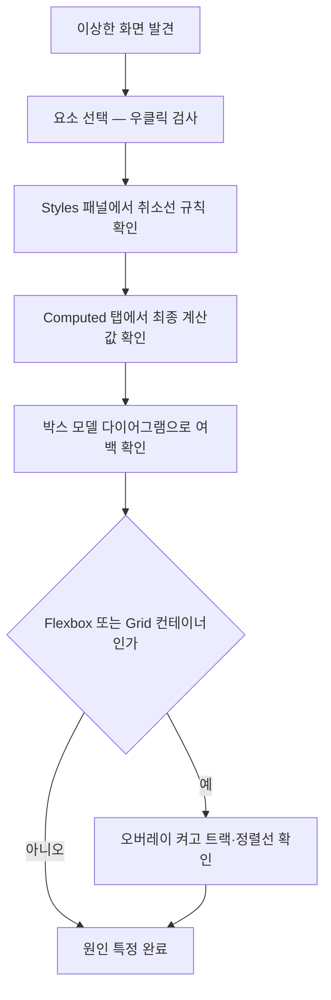

<Callout type="info">
  **이번 문서의 목표:** 이 문서를 다 읽고 실제로 브라우저 DevTools를 열어 따라 하면, "이 값이 왜 이렇게 나왔는가"라는 질문을 Styles·Computed·박스 모델·Flexbox/Grid 오버레이 네 가지 도구로 스스로 끝까지 추적할 수 있게 됩니다.
</Callout>

## 왜 지금 이 편인가

03편에서 DevTools(개발자 도구)를 처음 열어봤습니다. 그때는 Styles 패널이 "적용된 규칙을 보여주는 곳"이라는 인상만 잡았습니다. 그 사이 09편에서 명시도, 12편에서 마진 상쇄, 22·25편에서 Flexbox·Grid, 29편에서 스택 컨텍스트를 배웠습니다. 이제는 그 지식을 실제로 눈앞의 화면에 대입해 "왜 이 값이 나왔는가"를 도구로 확인할 차례입니다.

> **쉽게 말하면:** 지금까지는 규칙을 배웠고, 이 편은 그 규칙을 손에 쥐고 실전 사건 현장(눈앞의 버그난 페이지)을 조사하는 법입니다.

## 디버깅 절차 한눈에 보기

CSS 버그를 만났을 때 따라갈 순서는 항상 같습니다.

## Styles 패널 — 무엇이 이겼고 무엇이 졌는가

### 취소선 규칙 읽기

Styles 패널에는 선택한 요소에 적용을 **시도한** 모든 규칙이 나열됩니다. 이 중 다른 규칙에 밀려 최종적으로 적용되지 않은 선언에는 취소선이 그어집니다. 09편에서 배운 명시도 계산이 실제로 어떤 규칙끼리 경쟁했는지, 눈으로 바로 확인하는 곳이 여기입니다.

| 화면에 보이는 표시 | 의미 |
|--------------------|------|
| 취소선 없는 선언 | 최종적으로 적용된 값 |
| 취소선 그어진 선언 | 다른 규칙에 명시도 또는 소스 순서로 밀려 무시됨 |
| 체크박스가 꺼진 선언 | 사람이 DevTools에서 직접 끈 것(원본 파일과 무관) |
| 규칙 옆의 파일명:줄번호 | 이 규칙이 어느 CSS 파일 몇 번째 줄에서 왔는지 |

취소선이 그어진 규칙을 찾았다면, 이긴 규칙과 진 규칙의 선택자를 비교해 09편의 명시도 계산(인라인 > ID > 클래스류 > 타입류)을 그대로 적용해 보면 왜 밀렸는지 설명할 수 있습니다. 명시도가 같다면 08편에서 배운 소스 순서(나중에 온 규칙이 이긴다)가 결정합니다.

### 상속된 속성 구간

Styles 패널 아래쪽으로 스크롤하면 "Inherited from ..."(...로부터 상속됨)라고 표시된 구간이 나옵니다. 이 구간은 10편에서 배운 **상속되는 속성**(주로 `color`, `font` 계열)이 조상 요소로부터 넘어온 것을 보여줍니다. `border`처럼 상속되지 않는 속성은 조상에 값이 있어도 이 구간에 나타나지 않습니다.

<Callout type="warning">
  **자주 틀리는 점:** "규칙이 안 먹혀요"라는 문제는 대부분 다음 네 가지 중 하나입니다. 순서대로 Styles 패널에서 확인하세요. (1) 선택자 오타로 아예 매칭되지 않음 — 이 경우 그 규칙 자체가 목록에 나타나지 않습니다. (2) 명시도에서 밀림 — 취소선으로 확인됩니다. (3) 소스 순서에서 밀림 — 명시도가 같은 규칙 중 나중 것이 이겼는지 확인합니다. (4) 상속되지 않는 속성을 부모에만 지정함 — Inherited 구간에 아예 나타나지 않는지 확인합니다.
</Callout>

## Computed 탭 — 최종 값만 걸러 보기

Styles 패널이 "경쟁 과정"을 보여준다면, **Computed**(컴퓨티드, 계산됨) 탭은 그 경쟁이 끝난 뒤 **이 요소에 실제로 적용된 값만** 속성 이름 알파벳 순으로 보여줍니다. 10편에서 다룬 지정값→계산값→사용값→실제값 파이프라인의 마지막 결과가 여기에 나타납니다.

Computed 탭의 각 값 옆 화살표를 펼치면, 그 값이 **어느 선택자에서 왔는지**로 다시 연결됩니다. 즉 "지금 `padding`이 왜 `16px`이지?"라는 질문을 Computed에서 발견하고, 화살표를 눌러 Styles의 해당 규칙으로 곧장 이동할 수 있습니다.

| 구분 | Styles 패널 | Computed 탭 |
|------|-------------|--------------|
| 보여주는 것 | 적용을 시도한 규칙 전부(이긴 것·진 것 모두) | 최종적으로 적용된 값만 |
| 정렬 기준 | 명시도·소스 순서(경쟁 순서) | 속성 이름 알파벳 순 |
| 용도 | "왜 이 규칙이 밀렸는가" 추적 | "지금 최종 값이 무엇인가" 빠르게 확인 |
| 검색·필터 | 규칙 단위 탐색 | 속성 이름으로 필터링 가능 |

## 박스 모델 다이어그램 읽기

Computed 탭이나 Styles 패널 상단에는 11편에서 배운 박스 모델을 네모 네 겹으로 그린 다이어그램이 있습니다. 바깥부터 margin(마진) → border(보더) → padding(패딩) → 가장 안쪽 content(콘텐츠) 순서로, 각 겹의 네 변에 실제 픽셀 값이 표시됩니다.

이 다이어그램으로 확인할 수 있는 것은 다음과 같습니다.

- content 영역의 실제 너비·높이 — `box-sizing`이 `border-box`인지 `content-box`인지에 따라 CSS에 적은 `width`와 이 숫자가 같을 수도, 다를 수도 있습니다(11편).
- 어느 변의 margin이 예상과 다른가 — 12편에서 배운 마진 상쇄가 실제로 일어났다면, 두 요소 사이의 margin이 각각 지정한 값의 합이 아니라 더 큰 쪽 하나로 표시됩니다.
- padding과 border의 실제 두께 — 눈대중이 아니라 정확한 픽셀 숫자로 확인합니다.

> **쉽게 말하면:** 박스 모델 다이어그램은 여러분이 만든 상자를 CT 촬영해서 단면도로 보여주는 것과 같습니다. 겉보기 크기가 아니라 각 층의 실제 두께를 숫자로 알려줍니다.

## Flexbox·Grid 오버레이 — 보이지 않는 트랙을 시각화하기

20~25편에서 배운 Flexbox·Grid는 눈에 보이는 선이 없다는 것이 특징입니다. 컨테이너의 메인 축·크로스 축이 어느 방향인지, Grid의 트랙 경계가 어디인지 코드만 봐서는 짐작만 할 뿐입니다. DevTools는 이를 실제 선으로 그려주는 **오버레이**(overlay, 덧그림) 기능을 제공합니다.

<Steps>

### 1단계 — 컨테이너 배지 찾기

Elements 패널의 DOM 트리에서 `display: flex` 또는 `display: grid`가 걸린 요소 옆에 작은 배지(`flex` 또는 `grid` 글자가 쓰인 사각형 아이콘)가 나타납니다.

### 2단계 — 오버레이 켜기

그 배지를 클릭하면 화면에 실제로 겹쳐 그려지는 안내선이 나타납니다. Flexbox는 메인 축 방향의 화살표와 각 아이템의 경계를, Grid는 트랙 번호가 매겨진 격자선과 `grid-template-areas`로 이름 붙인 영역을 함께 보여줍니다.

### 3단계 — Styles 패널의 전용 편집기 사용하기

Flex 컨테이너를 선택하면 Styles 패널 안에 `justify-content`·`align-items` 같은 값을 아이콘 버튼으로 바로 바꿔볼 수 있는 전용 편집기가 나타납니다. `flex-direction`을 바꿀 때마다 오버레이의 화살표 방향도 함께 바뀌는 것을 확인하면, 21편에서 글로만 읽은 "메인 축이 바뀐다"는 문장이 눈에 보이는 사실이 됩니다.

</Steps>

아래 페이지를 실제 브라우저에 붙여넣거나 이 실습기 화면에서 마우스 오른쪽 버튼으로 카드 영역을 눌러 "검사"를 선택한 뒤, `.카드목록`에 뜨는 `flex` 배지를 눌러 오버레이를 직접 켜 보세요. `justify-content` 값을 Styles 패널의 아이콘으로 바꿔가며 오버레이 선이 함께 움직이는지 확인하는 것이 이번 실습의 핵심입니다.

<CodePlayground
  template="static"
  activeFile="/styles.css"
  label="Flexbox 오버레이 실습용 페이지 — 우클릭 검사로 flex 배지를 찾아보세요"
  files={{
    '/index.html': `<!DOCTYPE html>
<html lang="ko">
<head>
  <meta charset="UTF-8">
  <link rel="stylesheet" href="styles.css">
</head>
<body>
  

    
A

    
B

    
C

  

</body>
</html>`,
    '/styles.css': `.카드목록 {
  display: flex;
  justify-content: space-between;
  gap: 12px;
  padding: 16px;
  background: #f1f3f5;
}

.카드 {
  width: 80px;
  height: 80px;
  background: #4dabf7;
  color: white;
  display: flex;
  align-items: center;
  justify-content: center;
  border-radius: 8px;
  font-weight: bold;
}`,
  }}
/>

## 종합 사례 — 여백이 예상과 다른 버그 추적하기

다음은 실무에서 자주 나오는 상황을 하나의 절차로 묶은 예시입니다. "카드 두 개 사이 간격이 24px를 줬는데 화면에는 16px로 보인다"는 제보를 받았다고 가정합니다.

1. **Styles 패널**에서 두 카드 중 아래쪽 카드를 선택해 `margin-top` 선언을 확인합니다. 취소선 없이 `24px`가 적용되어 있다면, 값 자체는 이긴 것입니다.
2. **Computed 탭**에서 같은 요소의 `margin-top`을 확인합니다. 여전히 `24px`라면 이 요소 자체의 문제는 아닙니다.
3. **박스 모델 다이어그램**으로 실제로 그려진 간격을 봅니다. 위 카드의 `margin-bottom`이 `16px`이고, 두 마진이 인접 형제 사이에서 12편의 **마진 상쇄** 규칙에 따라 더 큰 값(`24px`) 하나로 합쳐졌다면, 계산은 정상입니다. 오해했던 것은 "16px + 24px = 40px가 되어야 한다"는 가정이었지, 코드가 아니었습니다.

이 흐름이 이 편 전체의 요점입니다. DevTools는 답을 대신 내려주지 않습니다. 대신 **어느 단계에서 내 예상과 실제가 갈렸는지**를 숫자로 보여주고, 그 갈림을 앞서 배운 개념(명시도·상속·마진 상쇄·축)으로 설명하는 것은 여러분의 몫입니다.

## 핵심 정리

- Styles 패널은 적용을 시도한 모든 규칙을 보여주며, 취소선은 명시도나 소스 순서에서 밀린 규칙을 뜻한다.
- Computed 탭은 최종 계산값만 알파벳 순으로 보여주며, 각 값을 펼치면 원본 규칙(Styles)으로 되돌아갈 수 있다.
- 박스 모델 다이어그램은 margin·border·padding·content 네 겹의 실제 픽셀 값을 보여주는, 상자의 단면도다.
- Flexbox·Grid 오버레이는 눈에 보이지 않는 축·트랙을 실제 선으로 그려 보여주며, Styles 패널의 아이콘 편집기와 함께 쓰면 값 변화를 실시간으로 확인할 수 있다.
- "규칙이 안 먹힌다"는 문제는 선택자 오타·명시도 패배·소스 순서 패배·비상속 속성 오용 네 가지로 좁혀서 순서대로 확인한다.

## 마무리 복습

<Quiz
  questionNumber={1}
  question="Styles 패널에서 어떤 선언에 취소선이 그어져 있다는 것의 의미로 옳은 것은?"
  options={['그 속성이 아예 존재하지 않는 CSS 속성이다', '다른 규칙에 명시도 또는 소스 순서로 밀려 최종적으로 적용되지 않았다', 'DevTools가 그 값에 문법 오류가 있다고 판단했다', '그 규칙이 인라인 스타일로 작성되었다']}
  correctAnswer={2}
  explanation="취소선은 해당 선언이 캐스케이드 경쟁(명시도 또는 소스 순서)에서 다른 규칙에 밀려 최종적으로 적용되지 않았음을 나타낸다."
  optionExplanations={['존재하지 않는 속성이면 아예 오류로 표시되지 형식만 다르게 취소선으로 나타나지 않는다', '정답 — 캐스케이드 경쟁에서 밀린 선언에 취소선이 그어진다', '문법 오류 표시는 취소선과는 다른 방식(경고 아이콘 등)으로 나타난다', '인라인 스타일 여부와 취소선은 무관하다']}
/>

<Quiz
  questionNumber={2}
  question="Computed 탭과 Styles 패널의 차이로 가장 알맞은 것은?"
  options={['Computed는 적용 시도된 모든 규칙을, Styles는 최종 값만 보여준다', 'Styles는 적용 시도된 모든 규칙을, Computed는 최종 계산값만 알파벳 순으로 보여준다', '두 탭은 완전히 동일한 정보를 다른 이름으로 보여줄 뿐이다', 'Computed 탭은 자바스크립트로 변경된 값만 보여준다']}
  correctAnswer={2}
  explanation="Styles 패널은 이기고 진 규칙을 포함한 경쟁 과정 전체를 보여주고, Computed 탭은 그 경쟁이 끝난 최종 값만 속성 이름 순으로 정리해 보여준다."
  optionExplanations={['설명이 두 패널의 역할과 반대로 되어 있다', '정답 — Styles는 경쟁 과정, Computed는 최종 결과다', '정렬 기준과 포함 범위가 서로 다르므로 동일하지 않다', 'Computed는 출처와 무관하게 최종 적용값 전체를 보여준다']}
/>

<Quiz
  questionNumber={3}
  question="박스 모델 다이어그램에서 확인할 수 없는 것은?"
  options={['margin·border·padding의 실제 픽셀 두께', 'content 영역의 실제 너비와 높이', '두 형제 요소 사이에서 마진 상쇄가 일어났는지 여부', '이 요소를 선택한 자바스크립트 이벤트 리스너 개수']}
  correctAnswer={4}
  explanation="박스 모델 다이어그램은 CSS 박스의 각 겹의 크기만 보여준다. 이벤트 리스너 정보는 Elements 패널의 Event Listeners 탭 등 별도 영역에서 확인해야 한다."
  optionExplanations={['다이어그램의 핵심 정보로 실제 두께를 보여준다', 'content 영역의 실제 크기를 확인할 수 있다', '인접한 두 마진이 합쳐진 값으로 표시되어 상쇄 여부를 유추할 수 있다', '정답 — 이벤트 리스너 정보는 박스 모델 다이어그램의 범위 밖이다']}
/>

<Quiz
  questionNumber={4}
  question="Flexbox 오버레이 기능에 대한 설명으로 옳은 것은?"
  options={['display: block 요소에도 항상 배지가 나타난다', 'display: flex가 걸린 요소 옆에 배지가 나타나며 클릭하면 축과 아이템 경계를 화면에 그려준다', '오버레이는 실제 CSS 값을 자동으로 최적화해 코드에 반영한다', 'Grid 오버레이와 Flexbox 오버레이는 완전히 동일한 정보를 보여준다']}
  correctAnswer={2}
  explanation="display: flex가 걸린 요소 옆에 flex 배지가 나타나고, 이를 클릭하면 메인 축 방향과 아이템 경계를 실제 안내선으로 화면에 그려준다."
  optionExplanations={['배지는 flex나 grid 컨테이너에만 나타난다', '정답 — 배지 클릭으로 축과 경계를 시각화한다', '오버레이는 시각화 도구일 뿐 코드를 자동으로 수정하지 않는다', 'Grid는 트랙 격자와 영역 이름을, Flexbox는 축과 아이템 경계를 보여주어 표시 내용이 다르다']}
/>

<Quiz
  questionNumber={5}
  question="두 카드 사이 간격을 24px로 지정했는데 화면에는 16px로 보이는 상황을 진단할 때, 다음 중 가장 먼저 의심해야 할 12편의 개념은?"
  options={['명시도 계산', '마진 상쇄', '스택 컨텍스트', 'BFC 형성 조건']}
  correctAnswer={2}
  explanation="인접한 두 요소의 margin이 각각 24px, 16px일 때 마진 상쇄가 일어나면 더 큰 값인 24px 하나로 합쳐진다. 반대로 16px만 보였다면 두 마진 값 자체나 상쇄 조건을 먼저 의심해야 한다."
  optionExplanations={['값 자체가 취소선 없이 적용되어 있다면 명시도 문제는 아니다', '정답 — 인접 형제 간 마진 상쇄가 이 상황의 대표 원인이다', '스택 컨텍스트는 쌓임 순서 문제이며 간격 크기와는 무관하다', 'BFC 형성 여부는 마진 상쇄를 막는 조건이지 이 진단의 첫 단계는 아니다']}
/>

<Quiz
  questionNumber={6}
  question="CSS 규칙이 요소에 전혀 안 먹힌다는 문제를 진단할 때 확인 순서로 가장 알맞은 것은?"
  options={['무조건 !important부터 붙여 해결한다', '선택자 오타 여부 → 명시도 패배 여부 → 소스 순서 패배 여부 → 비상속 속성 오용 여부 순으로 Styles 패널을 확인한다', '브라우저를 재설치한다', 'CSS 파일 전체를 삭제하고 처음부터 다시 작성한다']}
  correctAnswer={2}
  explanation="이 편에서 제시한 네 가지 흔한 원인을 순서대로 Styles 패널에서 확인하는 것이 체계적인 진단 절차다. !important를 무작정 붙이는 것은 근본 원인을 가리는 임시방편일 뿐이다."
  optionExplanations={['원인을 찾지 않고 강제로 덮어씌우는 방식은 근본 해결이 아니다', '정답 — 네 가지 흔한 원인을 순서대로 좁혀가는 것이 체계적인 진단이다', '브라우저 문제가 아니라 CSS 규칙 자체의 문제일 가능성이 훨씬 크다', '전체 재작성은 비효율적이며 원인 파악을 건너뛰게 된다']}
/>

## 참고 자료

- [Chrome DevTools — View and change CSS](https://developer.chrome.com/docs/devtools/css)
- [MDN — Specificity](https://developer.mozilla.org/en-US/docs/Web/CSS/Guides/Cascade/Specificity)
- [MDN — CSS box model](https://developer.mozilla.org/en-US/docs/Web/CSS/Guides/Box_model)
