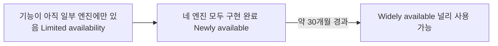

<Callout type="info">
  **이번 문서의 목표:** 이 문서를 다 읽으면 어떤 CSS 기능을 실무에 써도 되는지 감이 아니라 MDN·webstatus.dev의 실제 데이터로 판단할 수 있고, `@supports`로 "지원하면 이걸, 안 하면 저걸" 쓰는 점진적 향상 코드를 직접 작성할 수 있게 됩니다.
</Callout>

## 왜 "지원 여부 확인하는 법"부터 배우는가

01편에서 이 과목의 기능들이 "널리 사용 가능 / 최신 브라우저 기준 / 제한적·실험적" 세 단계로 나뉜다고 했습니다. 그런데 이 표기를 누가 정하는 걸까요? 그리고 2026년 9월에 맞는 표기가 2027년에도 그대로일까요?

정답은 "아무도 영구히 정해주지 않는다"입니다. 브라우저 지원 상태는 계속 바뀌는 살아있는 데이터입니다. 그래서 이 과목을 읽는 것만으로는 부족합니다. **여러분 스스로 언제든 최신 지원 상태를 확인할 수 있는 방법**을 익혀야, 이 문서에 적힌 상태가 낡았을 때도 스스로 갱신할 수 있습니다.

> **쉽게 말하면:** 이 편은 "물고기를 잡아주는 것"이 아니라 "낚시하는 법을 알려주는 것"입니다. 이후 본론 편들이 알려주는 지원 상태는 스냅샷일 뿐이고, 여러분이 실무에서 마주칠 진짜 최신 상태는 여러분이 직접 확인해야 합니다.

## Baseline이라는 공통 기준

### 문제 상황 — "지원한다"는 말이 제각각이었다

Baseline이 등장하기 전에는 "이 기능 지원되나요?"라는 질문에 개발자마다 다른 답을 했습니다. 어떤 사람은 "크롬(Chrome)에서 됩니다"라고 답하고, 어떤 사람은 "최신 버전에서만 됩니다"라고 답하고, 어떤 사람은 "곧 될 거예요"라고 답했습니다. 기준이 없으니 팀마다, 프로젝트마다 판단이 갈렸습니다.

이 혼란을 정리하기 위해 WebDX(웹 개발자 경험을 다루는 커뮤니티 그룹)와 주요 브라우저 벤더가 함께 만든 것이 **Baseline**(베이스라인, 기준선)입니다. Baseline은 "이 기능이 크롬(Chrome)·엣지(Edge)·파이어폭스(Firefox)·사파리(Safari) 네 개 주요 브라우저 엔진 모두에서 안정적으로 동작하는가"를 공식적으로 판정한 상태값입니다.

> **쉽게 말하면:** Baseline은 "네 브라우저 모두 준비됐다"는 도장입니다. 도장이 찍히기 전까지는 누군가 한 명이라도 아직 준비가 안 됐다는 뜻입니다.

### Baseline의 두 단계

Baseline은 하나의 상태가 아니라 시간 순서로 두 단계를 거칩니다.

| 단계 | 영문 표기 | 의미 |
|---|---|---|
| 새로 도입됨 | Newly available | 네 개 주요 엔진 모두에 기능이 구현된 **직후** 시점. 방금 문이 열렸다 |
| 널리 사용 가능 | Widely available | 새로 도입된 지 **2년 6개월**(30개월)이 지난 시점. 그 사이 출시된 구형 브라우저 사용자도 대부분 자연스럽게 최신 버전으로 넘어갔을 것으로 본다 |

이 2년 6개월이라는 기간은 임의로 정한 것이 아니라, 주요 브라우저의 평균적인 자동 업데이트 주기와 기업 환경의 브라우저 교체 주기를 감안해 WebDX 커뮤니티가 합의한 기준입니다. "새로 도입됨"과 "널리 사용 가능" 사이에는 이 유예 기간만큼의 간격이 항상 존재합니다.



01편에서 본 이 과목의 세 단계 표기와 Baseline 두 단계는 다음처럼 대응합니다.

| 이 과목의 표기 | Baseline 상태 |
|---|---|
| 널리 사용 가능 | Widely available |
| 최신 브라우저 기준 | Newly available (네 엔진 모두 구현됐지만 30개월이 안 지남) |
| 제한적·실험적 | Limited availability (아직 일부 엔진만 구현, 또는 실험 플래그 단계) |

<Callout type="warning">
  **자주 틀리는 점:** "Newly available이면 이미 다 됐으니 안심하고 써도 된다"는 판단입니다. Newly available은 "네 엔진 모두에 구현이 끝났다"는 뜻이지, "사용자 브라우저가 전부 그 버전 이상이다"라는 뜻이 아닙니다. 기업 내부망처럼 브라우저 업데이트가 느린 환경, 오래된 기기를 쓰는 사용자층이 있다면 Newly available 기능도 폴백이 필요할 수 있습니다.
</Callout>

## 지원 상태를 직접 확인하는 법

말로만 설명하면 "그래서 지금 이 기능이 어느 단계인지 어떻게 아는가"라는 질문이 남습니다. 확인 절차는 항상 같습니다.

<Steps>

1. **MDN에서 해당 기능 문서를 연다.** 예를 들어 `@layer`라면 `developer.mozilla.org/.../CSS/@layer` 페이지를 엽니다.
2. **문서 상단이나 하단의 Baseline 배지를 확인한다.** "Widely available", "Newly available since [날짜]", 또는 아예 배지가 없고 "Limited availability" 문구만 있는지 본다.
3. **페이지 하단의 Browser compatibility(브라우저 호환성) 표를 펼친다.** 크롬·엣지·파이어폭스·사파리 각각 몇 버전부터 지원하는지, 그리고 그 버전의 출시일을 확인한다.
4. **더 실시간에 가까운 데이터가 필요하면 webstatus.dev에서 기능 이름으로 검색한다.** Baseline 상태와 실제 시장 점유율 기반 통계를 함께 보여준다.
5. **검색 엔진 요약이나 블로그 글은 사실 확인의 최종 근거로 삼지 않는다.** 반드시 1의 MDN 원문 표나 4의 webstatus.dev로 재확인한다.

</Steps>

<Callout type="warning">
  **왜 5번이 특히 중요한가:** 이 과목을 준비하며 실제로 겪은 일입니다. 스크롤 연동 애니메이션(`animation-timeline`)을 조사할 때 일부 블로그 글은 "이미 모든 브라우저에서 Baseline widely available"이라고 요약하고 있었습니다. 그런데 MDN의 브라우저 호환성 표를 직접 대조하자 실제로는 "Limited availability — not Baseline"이었고, 크로미움(Chromium) 계열 중심으로만 지원되고 있었습니다. **요약된 문장이 아니라 원본 표를 봐야만 잡아낼 수 있는 오차**였습니다. 이 과목의 모든 지원 상태 표기는 이 방식으로 직접 검증한 결과입니다.
</Callout>

## `@supports` — 코드로 직접 물어보기

MDN·webstatus.dev로 확인하는 것은 "집필 시점"의 상태를 아는 방법입니다. 그런데 실제로 사이트를 방문하는 **각 사용자의 브라우저**가 그 기능을 지원하는지는 코드 안에서 다시 확인해야 합니다. 이때 쓰는 것이 **기능 쿼리**(feature query)인 `@supports`입니다.

### 문법

```css
@supports (속성: 값) {
  /* 이 브라우저가 그 속성-값 조합을 이해하면 여기가 적용된다 */
}

@supports not (속성: 값) {
  /* 이해하지 못하면 여기가 적용된다 */
}

@supports (속성1: 값1) and (속성2: 값2) {
  /* 두 조건 모두 지원해야 적용된다 */
}

@supports (속성1: 값1) or (속성2: 값2) {
  /* 둘 중 하나만 지원해도 적용된다 */
}
```

`@supports`는 미디어 쿼리(`@media`)와 생김새가 닮았지만 확인하는 대상이 다릅니다. `@media`는 "화면 크기·해상도 같은 환경"을 묻고, `@supports`는 "이 브라우저가 이 CSS 문법을 이해하는가"를 묻습니다.

> **쉽게 말하면:** `@supports`는 코드 안에 심어두는 질문지입니다. "너 이 문법 알아?"라고 브라우저에게 직접 물어보고, 대답에 따라 다른 스타일을 적용합니다.

### 점진적 향상이라는 태도

`@supports`를 쓰는 목적은 "지원 안 하면 막기"가 아니라 **점진적 향상**(progressive enhancement)입니다. 순서가 중요합니다.

1. 먼저 **모든 브라우저가 이해하는 기본 스타일**을 일반 선언으로 적는다.
2. 그 아래에 `@supports` 블록을 두고, 지원하는 브라우저에게만 더 나은 스타일을 **덧씌운다**.

```css
/* 1단계: 모든 브라우저가 이해하는 기본값 */
.gallery {
  display: block;
}

.gallery > .item {
  margin-bottom: 1rem;
}

/* 2단계: gap 속성을 이해하는 브라우저에게만 그리드 레이아웃을 덧씌운다 */
@supports (gap: 1rem) {
  .gallery {
    display: grid;
    grid-template-columns: repeat(auto-fill, minmax(200px, 1fr));
    gap: 1rem;
  }

  .gallery > .item {
    margin-bottom: 0;
  }
}
```

이렇게 쓰면 오래된 브라우저는 세로로 쌓인 목록을, 최신 브라우저는 그리드 레이아웃을 봅니다. **아무도 빈 화면을 보지 않습니다.** 이것이 "지원 안 하면 사이트가 망가진다"는 걱정 없이 최신 기능을 실무에 들일 수 있는 이유입니다.

<Callout type="warning">
  **자주 틀리는 점:** `@supports` 블록 **안에서만** 새 기능을 쓰고, 블록 **밖의 기본 스타일**을 준비하지 않는 것입니다. `@supports`는 "추가 스타일을 조건부로 얹는 도구"이지 "기본 스타일까지 대신 만들어주는 도구"가 아닙니다. 기본값 없이 `@supports` 블록만 있으면, 지원하지 않는 브라우저에서는 아무 스타일도 적용되지 않은 날것의 HTML이 보입니다.
</Callout>

### 셀렉터 자체를 확인하는 `selector()`

속성-값뿐 아니라 **선택자 문법**을 지원하는지도 확인할 수 있습니다. `:has()`처럼 비교적 최근에 표준화된 선택자를 안전하게 쓸 때 유용합니다.

```css
@supports selector(:has(*)) {
  .form:has(:invalid) {
    border-color: red;
  }
}
```

`:has()`를 실전에서 어떻게 쓰는지는 5편에서 본격적으로 다룹니다. 여기서는 "속성-값 문법뿐 아니라 선택자 문법도 `@supports selector()`로 확인할 수 있다"는 사실만 기억해두면 됩니다.

## 값을 바꿔가며 확인하기

아래 플레이그라운드는 `@supports`의 조건을 참(true)과 거짓(false)으로 각각 만들어, 어느 블록이 실제로 적용되는지 눈으로 비교합니다. 조건을 실제로 지원되지 않는 가짜 속성-값으로 바꿔보면서, "지원하지 않을 때 무엇이 보이는지"를 직접 확인해 보세요.

<CodePlayground
  template="static"
  activeFile="/styles.css"
  label="@supports 조건을 바꿔 점진적 향상 경로 확인하기"
  files={{
    '/index.html': `<!DOCTYPE html>
<html>
<head>
  <link rel="stylesheet" href="styles.css" />
</head>
<body>
  <div class="gallery">
    <div class="item">카드 1</div>
    <div class="item">카드 2</div>
    <div class="item">카드 3</div>
  </div>
</body>
</html>`,
    '/styles.css': `/* 1단계: 모든 브라우저용 기본 스타일 */
.gallery {
  display: block;
  border: 2px dashed gray;
  padding: 8px;
}

.gallery > .item {
  background: lightgray;
  margin-bottom: 8px;
  padding: 12px;
}

/* 2단계: 실제로 존재하는 속성 gap을 지원하면 그리드로 향상된다.
   조건을 (gap: 1rem)에서 (gap: 999invalidUnit) 같은 가짜 값으로
   바꿔보면 이 블록 전체가 적용되지 않아 1단계만 남는 것을 확인할 수 있다. */
@supports (gap: 1rem) {
  .gallery {
    display: grid;
    grid-template-columns: repeat(3, 1fr);
    gap: 12px;
    border-color: seagreen;
  }

  .gallery > .item {
    background: honeydew;
    margin-bottom: 0;
  }
}

/* not 조건: gap을 지원하지 않을 때만 이 안내 스타일이 보이게 하는 예시.
   지금은 gap을 지원하므로 이 블록은 적용되지 않는다. */
@supports not (gap: 1rem) {
  .gallery::before {
    content: "구형 레이아웃으로 표시 중";
    display: block;
    color: firebrick;
    margin-bottom: 8px;
  }
}
`,
  }}
/>

`(gap: 1rem)`을 존재하지 않는 값(예: `(gap: 999invalidUnit)`)으로 바꾸면 그리드 레이아웃이 사라지고 회색 테두리의 세로 목록으로 돌아갑니다. 동시에 `@supports not` 블록의 안내 문구가 나타납니다. 실제 서비스에서는 이 두 블록이 동시에 준비되어 있기 때문에, 사용자가 어떤 브라우저로 접속하든 최소한의 화면은 항상 보장됩니다.

## 이 과목에서의 상태 표기 규칙

이제부터 본론 편들은 새 기능이 나올 때마다 다음 형식을 반복합니다.

- **상태 문구**: "널리 사용 가능", "최신 브라우저 기준", "제한적·실험적" 중 하나
- **근거**: Baseline 진입 시점이나 특정 브라우저의 지원 시작 버전(예: "2026-01 Baseline newly available", "Safari 26 실험 지원")
- **필요한 경우 `@supports` 예시**: 제한적이거나 최신 브라우저 기준인 기능은 반드시 대체 경로를 함께 보여준다

이 표기는 집필 시점(2026년 9월)에 MDN·webstatus.dev를 직접 대조해 확정한 것입니다. 여러분이 이 문서를 읽는 시점에 상태가 달라졌을 수 있습니다. 그럴 때는 이 편에서 배운 절차 그대로, MDN 문서와 webstatus.dev를 다시 확인하면 됩니다.

## 핵심 정리

- Baseline은 크롬·엣지·파이어폭스·사파리 네 엔진 모두의 지원 여부를 판정하는 공통 기준이다. Newly available(방금 네 엔진 모두 구현)과 Widely available(그로부터 약 30개월 경과) 두 단계로 나뉜다.
- 지원 상태는 MDN 문서의 Baseline 배지와 Browser compatibility 표, 또는 webstatus.dev로 직접 확인한다. 블로그·검색 요약은 최종 근거로 삼지 않는다.
- `@supports (속성: 값)`은 브라우저가 특정 CSS 문법을 이해하는지 코드 안에서 직접 묻는 기능 쿼리다. `selector()`로 선택자 문법도 확인할 수 있다.
- 점진적 향상은 기본 스타일을 먼저 적고 `@supports` 블록으로 더 나은 스타일을 덧씌우는 순서를 지킨다. 조건 밖에 기본값이 없으면 지원하지 않는 브라우저는 아무 스타일도 못 본다.
- 이후 본론 편은 매 기능마다 상태 문구·근거·필요시 `@supports` 예시를 함께 제시한다.

## 마무리 복습

<Quiz
  questionNumber={1}
  question="Baseline의 Newly available과 Widely available의 관계를 가장 정확히 설명한 것은?"
  options={['서로 다른 기능 집합을 가리키는 독립적인 두 상태다', 'Newly available 시점으로부터 약 30개월이 지나면 Widely available로 전환된다', 'Widely available이 먼저이고 시간이 지나면 Newly available이 된다', '브라우저 개발사가 투표로 정하는 상태다']}
  correctAnswer={2}
  explanation="네 주요 엔진 모두에 구현이 끝난 시점이 Newly available이고, 그로부터 약 30개월(2년 6개월)이 지나 구형 브라우저 사용자가 충분히 줄었다고 보는 시점이 Widely available이다."
  optionExplanations={['같은 기능이 시간 순서로 거치는 두 단계다', '정답 — 시간 경과에 따른 순서 관계다', '순서가 반대로 설명되어 있다', 'Baseline은 투표가 아니라 실제 구현 여부와 경과 시간으로 판정된다']}
/>

<Quiz
  questionNumber={2}
  question="어떤 기능의 최신 지원 상태를 확인하는 방법으로 가장 신뢰할 수 있는 것은?"
  options={['검색 엔진 상위에 뜨는 블로그 글의 요약을 그대로 믿는다', 'SNS에서 개발자들이 이야기하는 인상을 종합한다', 'MDN 문서의 Baseline 배지와 Browser compatibility 표, 또는 webstatus.dev를 직접 확인한다', '한 번 확인한 상태는 영구히 바뀌지 않으므로 다시 확인할 필요가 없다']}
  correctAnswer={3}
  explanation="이 과목은 블로그 요약이 실제로 틀렸던 사례(스크롤 연동 애니메이션)를 근거로, MDN·webstatus.dev 원문 데이터를 직접 대조하는 것을 유일한 사실 확인 방법으로 삼는다."
  optionExplanations={['블로그 요약은 실제로 오검증된 사례가 있었다', '인상 종합은 근거가 되지 않는다', '정답 — 원문 데이터를 직접 확인하는 것이 유일하게 신뢰할 수 있는 방법이다', '지원 상태는 계속 바뀌므로 주기적으로 재확인해야 한다']}
/>

<Quiz
  questionNumber={3}
  question="@supports (gap: 1rem) { ... } 블록이 하는 일로 옳은 것은?"
  options={['화면 폭이 특정 크기 이상일 때만 스타일을 적용한다', '브라우저가 gap 속성-값 조합을 이해할 때만 안의 스타일을 적용한다', '사용자의 다크모드 설정을 감지해 스타일을 적용한다', '항상 무조건 안의 스타일을 적용한다']}
  correctAnswer={2}
  explanation="@supports는 화면 크기나 사용자 설정이 아니라 브라우저가 특정 CSS 문법을 이해하는지를 확인하는 기능 쿼리다."
  optionExplanations={['화면 폭 조건은 @media의 역할이다', '정답 — 문법 지원 여부를 확인하는 기능 쿼리다', '사용자 선호 감지는 prefers-* 미디어 기능의 역할이며 26편에서 다룬다', '조건이 거짓이면 적용되지 않으므로 무조건 적용된다는 설명은 틀렸다']}
/>

<Quiz
  questionNumber={4}
  question="점진적 향상(progressive enhancement) 방식으로 @supports를 쓸 때 지켜야 할 순서는?"
  options={['@supports 블록 안에만 스타일을 적고 블록 밖은 비워둔다', '최신 기능을 먼저 적고 그 아래에 구형 브라우저용 대체 스타일을 덧씌운다', '모든 브라우저가 이해하는 기본 스타일을 먼저 적고, @supports 블록으로 더 나은 스타일을 덧씌운다', '순서는 상관없으며 CSS 파일 어디에 두어도 동일하게 동작한다']}
  correctAnswer={3}
  explanation="점진적 향상은 기본 스타일을 먼저 보장한 뒤, 지원하는 브라우저에게만 향상된 스타일을 추가로 얹는 순서를 따른다."
  optionExplanations={['기본 스타일이 없으면 미지원 브라우저는 아무 스타일도 못 본다', '순서가 반대로 설명되어 있다', '정답 — 기본값을 먼저 보장하고 향상을 덧씌우는 순서다', 'CSS는 소스 순서에 영향을 받으므로 순서가 중요하다']}
/>

<Quiz
  questionNumber={5}
  question="선택자 문법의 지원 여부를 @supports로 확인할 때 쓰는 문법은?"
  options={['@supports property(선택자)', '@supports selector(선택자)', '@media selector(선택자)', '@supports has(선택자)']}
  correctAnswer={2}
  explanation="속성-값이 아니라 선택자 문법 자체의 지원 여부는 @supports selector() 문법으로 확인한다."
  optionExplanations={['property()라는 문법은 존재하지 않는다', '정답 — selector()가 선택자 문법 지원 확인에 쓰이는 문법이다', '선택자 문법 확인은 @media가 아니라 @supports의 역할이다', 'has()만 단독으로 쓰는 문법은 없으며 selector() 안에 :has()를 넣어야 한다']}
/>

<Quiz
  questionNumber={6}
  question="스크롤 연동 애니메이션(animation-timeline)의 사례가 이 편에서 강조하는 교훈은 무엇인가?"
  options={['모든 CSS 애니메이션은 이제 스크롤 연동으로 대체해야 한다', '블로그 요약만으로 지원 상태를 판단하면 실제와 다를 수 있으므로 원문 데이터를 직접 확인해야 한다', 'Baseline 데이터는 신뢰할 수 없으므로 참고하지 않는 것이 좋다', '실험적 기능은 절대 문서에서 다루지 않는 것이 원칙이다']}
  correctAnswer={2}
  explanation="이 과목 집필 과정에서 일부 블로그가 스크롤 연동 애니메이션을 'Baseline widely available'로 잘못 요약한 사례가 실제로 발견되어, 원문 확인의 필요성을 보여주는 근거로 쓰였다."
  optionExplanations={['애니메이션 기법 선택 문제이지 대체를 강제하는 결론이 아니다', '정답 — 원문 데이터 직접 확인의 중요성을 보여주는 사례다', 'Baseline 자체는 신뢰할 수 있는 기준이며, 문제는 이를 잘못 요약한 2차 자료였다', '이 과목은 제한적 기능도 상태를 명시하고 폴백과 함께 다룬다']}
/>

## 참고 자료

- [web.dev — Baseline](https://web.dev/baseline)
- [webstatus.dev](https://webstatus.dev/)
- [MDN — `@supports`](https://developer.mozilla.org/en-US/docs/Web/CSS/@supports)
