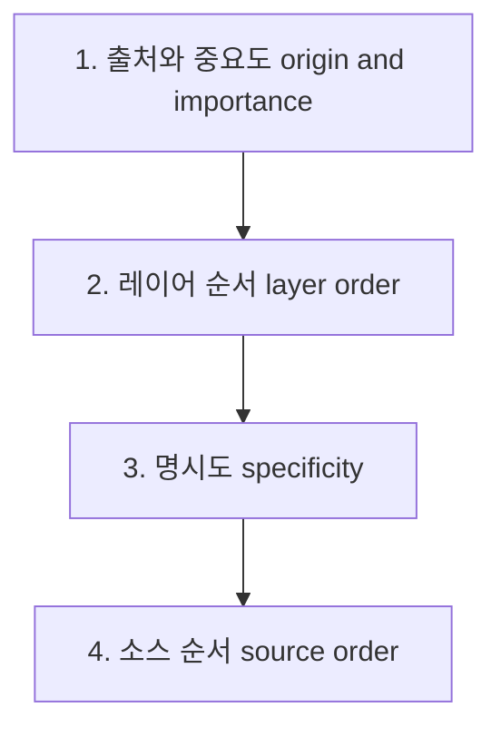
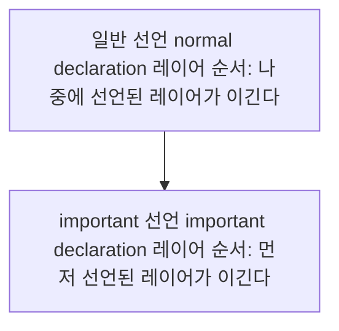

<Callout type="info">
  **이번 문서의 목표:** 이 문서를 다 읽으면 `@layer`로 스타일을 층층이 나눌 수 있고, 왜 명시도가 아무리 낮은 레이어 안 규칙이라도 나중에 선언된 레이어이기만 하면 이기는지를 근거를 들어 설명할 수 있게 됩니다.
</Callout>

## 왜 캐스케이드 레이어가 필요해졌는가

CSS Fundamentals 08편에서 캐스케이드(cascade, 계단식 적용)가 여러 규칙의 충돌을 어떤 순서로 해결하는지, 09편에서 명시도(specificity)를 어떻게 계산하는지 배웠습니다. 이 두 개념만으로도 대부분의 충돌은 해결됩니다. 그런데 실무 규모가 커지면 다음과 같은 상황이 반복됩니다.

- 부트스트랩(Bootstrap) 같은 서드파티 CSS 프레임워크를 가져다 쓰는데, 그 프레임워크의 선택자가 우연히 명시도가 높아서 내가 나중에 쓴 컴포넌트 스타일을 이깁니다.
- 그걸 이기려고 내 선택자에 클래스를 하나 더 붙이거나 `!important`를 답니다.
- 다음 컴포넌트에서 또 같은 문제가 생기고, 또 `!important`를 답니다.
- 몇 달 뒤 CSS 파일 전체가 `!important`로 뒤덮여, 이제는 아무도 어떤 규칙이 왜 이기는지 예측하지 못합니다.

문제의 근원은 **"명시도만으로는 '이 스타일 뭉치가 저 스타일 뭉치보다 항상 낮은 우선순위여야 한다'는 의도를 표현할 방법이 없다**는 것입니다. 선택자 하나하나의 구체성으로 우선순위가 결정되다 보니, "리셋 스타일은 항상 지고, 컴포넌트 스타일은 항상 이기고, 유틸리티 클래스는 항상 최종 승자여야 한다"는 **덩어리 단위의 의도**를 선택자만으로는 강제할 수 없었습니다.

이 문제를 풀기 위해 CSS 워킹 그룹(CSS Working Group)이 표준화한 것이 **캐스케이드 레이어**(cascade layer)입니다.

> **쉽게 말하면:** 캐스케이드 레이어는 "이 스타일 뭉치는 항상 저 스타일 뭉치보다 먼저 진다"는 순서표를 코드 맨 위에 미리 선언해두는 것입니다. 선택자 하나하나의 힘겨루기 이전에, 어느 팀이 몇 번 타순인지부터 정해놓는 셈입니다.

## `@layer` 기본 문법

**레이어**(layer, 층)는 이름을 가진 스타일 그룹입니다. `@layer` 규칙(at-rule)으로 만듭니다.

```css
@layer reset, base, components, utilities;
```

이 한 줄이 이 스타일시트 전체에서 가장 중요한 선언입니다. **레이어의 이름과 순서를 미리 예고**합니다. 이후 실제 스타일은 다음처럼 각 레이어 이름으로 감싸 넣습니다.

```css
@layer reset {
  * {
    margin: 0;
    padding: 0;
    box-sizing: border-box;
  }
}

@layer components {
  .btn {
    padding: 8px 16px;
    border-radius: 4px;
    background: royalblue;
    color: white;
  }
}

@layer utilities {
  .bg-red {
    background: crimson;
  }
}
```

여기서 `reset`, `components`, `utilities`는 임의로 지은 이름입니다. CSS 명세가 강제하는 이름이 아니라, 여러분 팀이 정하는 어휘입니다. 다만 맨 처음 한 줄(`@layer reset, base, components, utilities;`)로 **순서를 먼저 선언**해두면, 실제 각 레이어의 내용이 파일 어디에 흩어져 있든, 심지어 나중에 로드되는 파일에 있든 이 선언 순서를 따릅니다.

## 핵심 원칙 — 레이어가 명시도보다 먼저 결정한다

이 편에서 가장 정확히 짚어야 할 지점입니다. 캐스케이드 안에서 우선순위를 결정하는 순서는 다음과 같이 바뀌었습니다.



기존에 CSS Fundamentals 08~09편에서 배운 "출처 → 명시도 → 소스 순서"라는 3단계 사이에, **레이어 순서라는 새로운 단계가 명시도보다 먼저 끼어든 것**입니다. 그 결과 다음과 같은 일이 벌어집니다.

```css
@layer base, override;

@layer base {
  #main-title {
    color: navy; /* 명시도 (1, 0, 0) — ID 선택자 */
  }
}

@layer override {
  .title {
    color: crimson; /* 명시도 (0, 1, 0) — 클래스 선택자 */
  }
}
```

```html
<h1 id="main-title" class="title">제목</h1>
```

CSS Fundamentals 09편에서 배운 규칙대로라면 ID 선택자 `(1, 0, 0)`이 클래스 선택자 `(0, 1, 0)`을 항상 이겨야 합니다. 그런데 실제로 이 `<h1>`은 **crimson**(진홍색)으로 렌더링됩니다. `override` 레이어가 `base` 레이어보다 나중에 선언되었기 때문입니다.

<Callout type="warning">
  **자주 틀리는 점:** "ID 선택자는 명시도가 가장 강하니까 무조건 이긴다"는 09편의 규칙을 그대로 레이어에도 적용하는 것입니다. **레이어가 다르면 명시도 비교 자체가 일어나지 않습니다.** 브라우저는 두 규칙이 서로 다른 레이어에 속한 것을 먼저 확인하고, 레이어 순서만으로 승부를 확정 짓습니다. 명시도는 "같은 레이어 안에서" 또는 "레이어가 전혀 없는 규칙끼리" 충돌할 때만 등판합니다.
</Callout>

## unlayered 스타일 — 레이어 밖의 스타일은 항상 이긴다

레이어로 감싸지 않은 일반 스타일을 **unlayered**(레이어 없는) 스타일이라고 부릅니다. 이 unlayered 스타일은 특별한 위치를 차지합니다.

```css
@layer base, override;

@layer base {
  .btn { background: royalblue; }
}

@layer override {
  .btn { background: crimson; }
}

/* 레이어 없이 그냥 선언 — unlayered */
.btn { background: seagreen; }
```

세 규칙이 모두 같은 `.btn`을 대상으로 하지만, 최종 색은 **seagreen**(바다초록색)입니다. unlayered 스타일이 어떤 레이어보다도 나중에 적용되는 것으로 취급되기 때문입니다.

| 스타일 종류 | 우선순위 |
|---|---|
| 이름 있는 레이어(named layer) 안의 스타일 | 레이어 선언 순서를 따름. 먼저 선언된 레이어가 낮은 우선순위 |
| unlayered 스타일(레이어로 감싸지 않은 일반 규칙) | 모든 이름 있는 레이어보다 **항상 나중**, 즉 항상 더 높은 우선순위 |

> **쉽게 말하면:** 레이어는 "미리 정해둔 하위 리그"입니다. 아무리 하위 리그에서 우승해도 리그 밖(unlayered)에 있는 팀을 이길 수는 없습니다. 리그 밖은 항상 최상위입니다.

이 규칙은 실무에서 중요한 의미를 가집니다. 서드파티 CSS 프레임워크 전체를 레이어 하나로 감싸 가져오면, **내가 나중에 레이어 없이 쓰는 커스텀 스타일이 프레임워크의 어떤 명시도 높은 선택자도 항상 이깁니다.** `!important` 없이도, 선택자를 더 구체적으로 쓰지 않아도 됩니다.

```css
/* 서드파티 프레임워크를 레이어로 감싸 가져온다 */
@import url("some-framework.css") layer(framework);

/* 내 커스텀 스타일은 레이어 없이 쓴다 — 항상 framework 레이어를 이긴다 */
.my-button {
  background: teal;
}
```

## `!important`가 끼어들면 순서가 뒤집힌다

여기서 반드시 짚어야 할 예외가 있습니다. `!important`가 붙으면 레이어 우선순위 자체가 **거꾸로** 뒤집힙니다.



```css
@layer base, override;

@layer base {
  .btn { background: royalblue !important; }
}

@layer override {
  .btn { background: crimson; }
}
```

일반 선언이었다면 나중 레이어인 `override`가 이겨야 하지만, `base` 레이어의 선언에 `!important`가 붙어 있으므로 오히려 **먼저 선언된 `base` 레이어가 이깁니다.** 그리고 unlayered 스타일에 `!important`가 붙으면, 이번엔 반대로 **모든 이름 있는 레이어의 `!important` 선언보다도 낮은 우선순위**가 됩니다.

<Callout type="warning">
  **자주 틀리는 점:** "`!important`는 항상 최강이다"라고 뭉뚱그리는 것입니다. 레이어가 없던 시절에는 맞는 말이었지만, 레이어가 도입된 뒤로는 "`!important`끼리는 레이어 순서가 뒤집혀 적용된다"는 사실까지 함께 알아야 합니다. `!important`를 남발하면 레이어 설계 의도까지 반대로 뒤집혀버릴 수 있으니, 레이어를 도입한 프로젝트에서는 `!important` 사용을 더욱 신중히 해야 합니다.
</Callout>

## 익명 레이어와 중첩 레이어

레이어 이름을 생략하고 쓸 수도 있습니다.

```css
@layer {
  .badge {
    border-radius: 999px;
  }
}
```

이런 **익명 레이어**(anonymous layer)는 매번 새로운 레이어로 취급되어 이름으로 다시 참조할 수 없습니다. 주로 특정 파일 안에서 "이 부분만 낮은 우선순위로 묶고 싶다"는 국소적인 용도로 씁니다.

레이어 안에 레이어를 중첩할 수도 있습니다.

```css
@layer components {
  @layer buttons, cards;

  @layer buttons {
    .btn { padding: 8px 16px; }
  }
}
```

이때 `buttons`는 독립된 최상위 레이어가 아니라 `components.buttons`라는 하위 레이어로 취급됩니다. 대규모 디자인 시스템에서 레이어를 세분화할 때 쓰는 패턴이지만, 이 과목에서는 최상위 레이어 사용법을 확실히 익히는 데 집중합니다.

## 값을 바꿔가며 확인하기

아래 플레이그라운드에서 `@layer` 첫 줄의 선언 순서를 바꿔보세요. 코드 안의 명시도(ID vs 클래스)는 그대로 두고 **레이어 순서만 바꿔도 승자가 뒤집히는 것**을 직접 확인할 수 있습니다.

<CodePlayground
  template="static"
  activeFile="/styles.css"
  label="레이어 선언 순서를 바꿔 우선순위 뒤집기"
  files={{
    '/index.html': `<!DOCTYPE html>
<html>
<head>
  <link rel="stylesheet" href="styles.css" />
</head>
<body>
  <h1 id="main-title" class="title">레이어 우선순위 실험</h1>
  <p>제목 색을 보고 어느 레이어가 이겼는지 확인하세요.</p>
</body>
</html>`,
    '/styles.css': `/* 이 첫 줄의 순서를 base, override 에서 override, base 로 바꿔보세요.
   명시도는 그대로인데(ID vs 클래스) 색이 뒤집히는 것을 확인합니다. */
@layer base, override;

@layer base {
  /* 명시도 (1, 0, 0) — ID 선택자, 훨씬 구체적이다 */
  #main-title {
    color: navy;
  }
}

@layer override {
  /* 명시도 (0, 1, 0) — 클래스 선택자, 훨씬 덜 구체적이다 */
  .title {
    color: crimson;
  }
}

body {
  font-family: sans-serif;
  padding: 24px;
}
`,
  }}
/>

`@layer base, override;`일 때는 명시도가 훨씬 낮은 `.title`(crimson)이 이깁니다. 이 순서를 `@layer override, base;`로 바꾸면 이번엔 명시도가 훨씬 높은 `#main-title`(navy)이 오히려 집니다. **명시도의 절대값은 전혀 바뀌지 않았는데, 레이어 선언 순서 한 줄만 바꿨더니 승자가 뒤집힌 것**입니다. 이것이 "레이어가 명시도보다 먼저 결정한다"는 원칙의 실체입니다.

## `:where()`와 레이어를 함께 쓰는 이유 (예고)

레이어 안에서도 명시도는 여전히 계산됩니다. 그래서 레이어 안의 선택자를 너무 구체적으로 쓰면, 같은 레이어 안에서 나중에 덮어쓰려는 사람이 애를 먹습니다. 이 문제를 해결하려고 실무에서는 레이어 안 선택자에 명시도를 0으로 만드는 `:where()`를 자주 함께 씁니다. `:where()`와 `:is()`의 차이, 그리고 명시도 0이 실무에서 왜 유용한지는 바로 다음 4편에서 다룹니다.

## 지원 상태

캐스케이드 레이어(`@layer`)는 **널리 사용 가능**(Baseline: Widely available, 2022년 3월부터 네 주요 엔진 모두 지원)한 기능입니다. 2편에서 배운 기준으로 보면 이미 Newly available 단계를 지나 Widely available에 진입한 지 오래된 안정적인 기능이라, 이 과목의 다른 최신 기능들과 달리 `@supports` 폴백을 따로 준비할 실무적 필요는 거의 없습니다.

다만 아주 오래된 브라우저(예: 2022년 이전 버전)까지 지원해야 하는 특수한 프로젝트라면, `@supports (color: red)`처럼 아무 기능이나 확인하는 조건은 `@layer` 자체의 지원 여부를 알려주지 않는다는 점을 알아둘 필요가 있습니다. `@layer`처럼 선택자가 아닌 최상위 규칙(at-rule)의 지원 여부는 `@supports` 기능 쿼리로 직접 확인할 수 없고, 오직 2편에서 배운 MDN 브라우저 호환성 표로만 판단합니다. 이런 경우 실무에서는 "레이어 없이도 동작하는 unlayered 스타일을 항상 최후 안전망으로 파일 하단에 남겨두는" 방식으로 우회합니다.

## 핵심 정리

- 캐스케이드 레이어(`@layer`)는 이름 붙인 스타일 뭉치이며, `@layer reset, base, components;`처럼 순서를 먼저 선언한다.
- 우선순위 결정 순서는 "출처와 중요도 → **레이어 순서** → 명시도 → 소스 순서"다. 레이어가 다르면 명시도 비교는 아예 일어나지 않는다.
- 레이어로 감싸지 않은 unlayered 스타일은 모든 이름 있는 레이어보다 항상 나중, 즉 항상 더 높은 우선순위를 가진다.
- `!important`가 붙으면 레이어 우선순위가 뒤집힌다. 먼저 선언된 레이어의 `!important`가 나중 레이어의 `!important`를 이긴다.
- `@layer`는 널리 사용 가능한 안정적인 기능으로, 별도의 `@supports` 폴백이 실무에서 거의 필요하지 않다.

## 마무리 복습

<Quiz
  questionNumber={1}
  question="서로 다른 캐스케이드 레이어에 속한 두 규칙이 같은 요소의 같은 속성을 두고 충돌할 때, 가장 먼저 확인되는 것은?"
  options={['각 규칙의 명시도 (a, b, c)', '레이어 선언 순서', '스타일시트 안에서의 소스 순서', '선택자의 글자 수']}
  correctAnswer={2}
  explanation="레이어가 다르면 명시도 비교보다 먼저 레이어 선언 순서가 승부를 가른다. 명시도는 같은 레이어 안이나 레이어가 없는 규칙끼리 충돌할 때만 등판한다."
  optionExplanations={['명시도는 레이어가 같을 때만 비교 대상이 된다', '정답 — 서로 다른 레이어라면 레이어 순서가 먼저 결정한다', '소스 순서는 명시도까지 같을 때 마지막으로 보는 기준이다', '선택자 글자 수는 명시도 계산과 무관하다']}
/>

<Quiz
  questionNumber={2}
  question="@layer base, override; 로 순서를 선언한 뒤, base 레이어에 ID 선택자(#a)로, override 레이어에 클래스 선택자(.a)로 같은 속성을 지정했다. 최종 적용되는 규칙은?"
  options={['ID 선택자가 명시도가 높으므로 base 레이어의 규칙이 이긴다', '클래스 선택자가 나중 레이어이므로 override 레이어의 규칙이 이긴다', '명시도가 다르므로 반드시 base가 이겨야 한다', '두 규칙이 동률이라 소스 순서로 결정된다']}
  correctAnswer={2}
  explanation="레이어가 다르면 명시도는 비교 대상에서 제외되고 레이어 순서만으로 결정된다. override가 나중에 선언된 레이어이므로 명시도가 낮아도 이긴다."
  optionExplanations={['레이어가 다르면 명시도 자체가 비교되지 않는다', '정답 — 나중 레이어가 명시도와 무관하게 이긴다', 'CSS Fundamentals의 명시도 규칙은 같은 레이어 안에서만 적용된다', '레이어가 다르므로 소스 순서 단계까지 가지 않는다']}
/>

<Quiz
  questionNumber={3}
  question="unlayered 스타일(레이어로 감싸지 않은 일반 규칙)의 우선순위에 대한 설명으로 옳은 것은?"
  options={['가장 먼저 선언된 레이어와 동일하게 취급된다', '모든 이름 있는 레이어보다 항상 낮은 우선순위를 가진다', '모든 이름 있는 레이어보다 항상 높은 우선순위를 가진다', '레이어 선언 순서 안에 끼워 넣어야만 비교 대상이 된다']}
  correctAnswer={3}
  explanation="레이어로 감싸지 않은 스타일은 모든 이름 있는 레이어보다 나중에 적용되는 것으로 취급되어 항상 가장 높은 우선순위를 가진다."
  optionExplanations={['오히려 정반대로 가장 나중에 적용되는 것으로 취급된다', '실제로는 항상 더 높은 우선순위를 가진다', '정답 — unlayered 스타일은 항상 모든 레이어를 이긴다', 'unlayered 스타일은 레이어 선언과 무관하게 항상 최상위로 취급된다']}
/>

<Quiz
  questionNumber={4}
  question="base 레이어의 규칙에 !important가 붙고, 나중에 선언된 override 레이어의 같은 속성 규칙에는 !important가 없을 때, 최종 승자는?"
  options={['override 레이어 — 나중에 선언된 레이어이므로', 'base 레이어 — !important가 붙은 선언이 우선하며, important 선언끼리는 먼저 선언된 레이어가 이긴다', '두 선언이 병합되어 둘 다 적용된다', '판단할 수 없으며 브라우저마다 다르게 동작한다']}
  correctAnswer={2}
  explanation="important 선언이 존재하면 일반 선언보다 항상 우선하며, important 선언끼리 비교할 때는 레이어 우선순위가 뒤집혀 먼저 선언된 레이어가 이긴다."
  optionExplanations={['일반 선언은 important 선언을 이기지 못한다', '정답 — important가 붙은 base 레이어가 이긴다', 'CSS는 같은 속성에 대해 하나의 값만 최종 적용한다', '레이어와 important의 상호작용은 명세로 정의된 결정론적 규칙이다']}
/>

<Quiz
  questionNumber={5}
  question="레이어 이름을 생략한 @layer { ... } (익명 레이어)에 대한 설명으로 옳은 것은?"
  options={['이름 있는 레이어와 동일하게 이름으로 나중에 다시 참조할 수 있다', '매번 새로운 레이어로 취급되어 이름으로 다시 참조할 수 없다', 'unlayered 스타일과 완전히 동일하게 취급된다', 'CSS 명세에 존재하지 않는 잘못된 문법이다']}
  correctAnswer={2}
  explanation="익명 레이어는 유효한 문법이지만 이름이 없어 이후 코드에서 이름으로 다시 참조할 수 없고, 매번 새로 선언될 때마다 별개의 레이어로 취급된다."
  optionExplanations={['이름이 없으므로 이름으로 참조하는 것이 애초에 불가능하다', '정답 — 매번 새 레이어로 취급되며 재참조가 불가능하다', '익명 레이어도 여전히 레이어이므로 unlayered 스타일보다 우선순위가 낮다', '@layer { ... }는 유효한 CSS 문법이다']}
/>

<Quiz
  questionNumber={6}
  question="캐스케이드 레이어의 2026년 9월 기준 지원 상태로 옳은 것은?"
  options={['제한적·실험적 — 크로미움 계열만 지원한다', '최신 브라우저 기준 — 최근에야 Baseline에 진입했다', '널리 사용 가능 — 2022년 3월부터 네 주요 엔진 모두 지원한다', '지원 상태를 아직 판단할 수 없다']}
  correctAnswer={3}
  explanation="캐스케이드 레이어는 2022년 3월부터 Baseline widely available로, 이 과목에서 다루는 기능 중 지원이 가장 안정적인 축에 속한다."
  optionExplanations={['크로미움 전용이 아니라 네 엔진 모두 오래전부터 지원한다', '이미 Widely available 단계를 지난 지 오래다', '정답 — 2022년 3월부터 널리 사용 가능하다', 'MDN 브라우저 호환성 표로 명확히 판단할 수 있다']}
/>

## 참고 자료

- [MDN — `@layer`](https://developer.mozilla.org/en-US/docs/Web/CSS/@layer)
- [MDN — CSS cascading and inheritance](https://developer.mozilla.org/en-US/docs/Web/CSS/Guides/Cascade)
- [web.dev — Baseline](https://web.dev/baseline)
