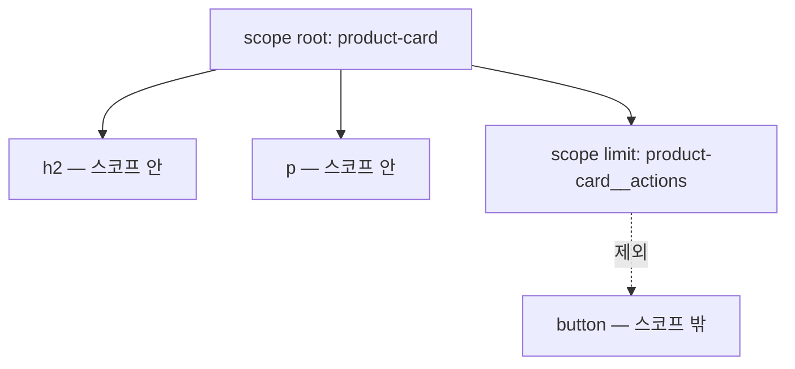

<Callout type="info">
  **이번 문서의 목표:** 이 문서를 다 읽으면 `@scope`로 스타일이 적용되는 범위를 정확히 제한하고, "도넛 스코프"(donut scope) 문제가 왜 생기는지 설명하며, `@scope`와 Shadow DOM 캡슐화 중 어느 쪽이 지금 상황에 맞는지 근거를 들어 고를 수 있게 됩니다.
</Callout>

## 왜 "격리"가 다시 문제가 되는가

`css_fundamentals`에서 배운 캐스케이드(cascade, 종속)는 기본적으로 전역입니다. 어디선가 `.card { color: red; }`라고 쓰면, 이름이 `card`인 요소는 문서 어디에 있든 그 규칙을 만납니다. 프로젝트가 커질수록 이 전역성은 골칫거리가 됩니다. 다른 팀이 만든 컴포넌트의 클래스 이름과 내 클래스 이름이 우연히 겹치면, 의도치 않은 스타일이 새어 들어옵니다.

이 문제를 풀던 오래된 방법은 이름을 길게 짓는 것이었습니다. `.card`가 아니라 `.MyApp-ProductPage-Card`처럼 말이죠. 효과는 있지만 이름이 길어질수록 코드는 읽기 힘들어집니다. **03편**에서 배운 캐스케이드 레이어(`@layer`)는 "이 스타일 뭉치가 다른 뭉치보다 먼저 지느냐 나중에 지느냐"라는 **우선순위** 문제를 풉니다. 반면 지금 다룰 `@scope`는 전혀 다른 질문에 답합니다. "**이 선택자가 어디서부터 어디까지만 적용되는가**"라는 **사정거리**(범위) 문제입니다.

> **쉽게 말하면:** `@layer`가 "누가 먼저 이기는가"를 정한다면, `@scope`는 "이 규칙이 어느 울타리 안에서만 통하는가"를 정합니다.

`@scope`(에잇 스코프)는 2026년 9월 시점 MDN 브라우저 호환성 데이터 기준으로 **최신 브라우저 기준**입니다. Firefox가 2025년 12월(버전 146)에 가장 늦게 합류하면서 2026년 초 Baseline에 새로 진입(Baseline 2026 Newly available)했습니다. 즉 "이제 막 주요 브라우저 세 곳(크로미움 계열, Firefox, Safari)에 전부 갖춰진" 참신한 기능이라는 뉘앙스로 읽어야 합니다. 오래된 브라우저를 지원해야 한다면 `@supports`로 감싸는 습관을 들이는 것이 안전합니다.

## 1. 스코프 루트와 한계 — `@scope`의 기본 문법

### 스코프 루트: 울타리의 시작점

**스코프**(scope, 범위)라는 단어는 원래 "조준경"이라는 뜻에서 왔습니다. 총의 조준경이 보는 범위를 좁혀 특정 표적만 겨냥하게 하듯, `@scope`는 캐스케이드가 적용되는 범위를 특정 부분 트리(subtree)로 좁힙니다.

가장 단순한 형태는 이렇습니다.

```css
@scope (.product-card) {
  h2 {
    color: navy;
  }
  p {
    color: gray;
  }
}
```

`(.product-card)`가 **스코프 루트**(scope root, 범위의 뿌리)입니다. 이 안에 있는 `h2`, `p` 선택자는 클래스가 `product-card`인 요소 **자기 자신과 그 자손**에만 적용됩니다. 문서 전체에 흩어진 다른 `h2`는 건드리지 않습니다.

여기서 중요한 차이가 하나 있습니다. 기존 방식이라면 `.product-card h2`라는 자손 결합자(descendant combinator, `css_fundamentals` 참조)를 썼을 것입니다. 이것도 비슷한 결과를 내지만, 두 가지가 다릅니다.

- **명시도**: `.product-card h2`는 클래스 하나 + 태그 하나만큼 명시도가 올라갑니다. `@scope` 안의 `h2`는 스코프 자체가 명시도를 더하지 않고, 선택자 `h2` 그대로의 명시도(태그 하나)만 갖습니다.
- **범위의 명확성**: `.product-card h2`는 코드만 봐서는 "이 규칙이 전역 규칙 중 하나"처럼 보입니다. `@scope (.product-card) { }`는 "이 블록 전체가 이 컴포넌트 전용"이라는 사실이 구조적으로 드러납니다.

### 스코프 한계: 울타리가 끊기는 지점

`@scope`의 진짜 힘은 **스코프 한계**(scope limit, 범위의 한계)에 있습니다. 루트만 있으면 자손 전체가 대상이지만, 한계를 지정하면 그 지점 **아래**는 스코프 밖으로 빠집니다.

```css
@scope (.product-card) to (.product-card__actions) {
  p {
    color: gray;
  }
}
```

이 규칙은 "`product-card` 안에서 시작하되, `product-card__actions`를 만나면 거기서 멈춰라"는 뜻입니다. `to (...)`로 지정한 요소 자체와 그 자손은 스코프에서 제외됩니다.



왜 이런 기능이 필요할까요. 카드 컴포넌트 안에 버튼 그룹처럼 **다른 컴포넌트**가 중첩되는 경우가 흔합니다. 카드의 `p { color: gray; }` 같은 스타일이 그 안에 박힌 버튼 그룹의 `p`(설명 문구)까지 회색으로 물들이면 곤란합니다. 스코프 한계를 그어 주면, 중첩된 하위 컴포넌트의 영역에는 상위 컴포넌트의 캐스케이드가 새어 들어가지 않습니다.

## 2. 도넛 스코프 — 있는데 없는 것처럼 다루기

**도넛 스코프**(donut scope, 도넛 범위)는 `@scope`가 가진 독특한 능력을 부르는 이름입니다. 도넛은 가운데가 뚫려 있죠. `@scope`도 루트와 한계 **사이**의 고리 모양 영역만 골라 적용할 수 있습니다.

```css
@scope (.rich-text) to (figure) {
  a {
    color: var(--link-color);
  }
}
```

`rich-text`(사용자가 입력한 본문 영역) 안의 링크는 파란색으로 통일하고 싶지만, 그 안에 `figure`(이미지·캡션 묶음)가 끼어 있고 그 안에도 링크가 있을 수 있다고 해봅시다. 위 규칙은 "`rich-text`에서 시작해서 `figure`를 만나면 멈춘다"는 뜻이므로, `figure` **바깥**의 링크에는 파란색이 적용되지만 `figure` **안**의 링크는 스코프 밖이라 이 규칙의 영향을 받지 않습니다. 마치 도넛의 가운데 구멍처럼, 링크가 있는데도 스타일이 적용되지 않는 영역이 생기는 것입니다.

<Callout type="warning">
  **자주 틀리는 점:** `to (...)`에 적은 선택자와 정확히 일치하는 요소를 만나야 한계가 작동합니다. `figure` 태그가 아니라 `.embed`라는 클래스로 감싼 영역이라면 `to (.embed)`라고 써야지, `to (figure)`로는 걸리지 않습니다. 한계 선택자는 실제 마크업 구조를 보고 정확히 맞춰야 합니다.
</Callout>

## 3. `:scope`와 근접도 기반 우선순위

`@scope` 블록 안에서 스코프 루트 자기 자신을 가리키고 싶다면 `:scope`(콜론 스코프) 의사 클래스를 씁니다.

```css
@scope (.product-card) {
  :scope {
    border: 1px solid #ddd;
  }
  h2 {
    color: navy;
  }
}
```

또 하나 알아둘 특징은 **근접도**(proximity, 가까운 정도)입니다. 같은 요소를 두 개의 `@scope` 블록이 동시에 겨냥한다면, 명시도가 같을 때 **스코프 루트에 더 가까운 쪽**이 이깁니다. 이는 03편에서 배운 "레이어가 명시도보다 먼저 승부를 가른다"는 원칙과는 또 다른, `@scope`만의 세 번째 승부 기준입니다. 우선순위를 결정하는 순서를 정리하면 다음과 같습니다.

| 결정 단계 | 기준 | 비고 |
|-----------|------|------|
| 1단계 | `!important` 여부 | 04편·03편에서 다룬 순서와 동일 |
| 2단계 | 캐스케이드 레이어 순서 | `@layer` 선언 순서, 나중 레이어가 승리 |
| 3단계 | 스코프 근접도 | `@scope` 루트에 더 가까운 규칙이 승리 |
| 4단계 | 명시도 | 04편의 `:is()`/`:where()` 계산 규칙 |
| 5단계 | 소스 순서 | 코드에 나중에 등장한 규칙 |

`:where()`(04편 참조)와 `@scope`를 함께 쓰면 명시도를 0으로 낮추면서 범위만 제한하는 조합도 가능합니다. 예를 들어 `@scope (.card) { :where(a) { color: blue; } }`는 명시도를 전혀 올리지 않으면서 `.card` 안의 링크만 파랗게 만듭니다.

## 4. 값을 바꿔가며 확인하기

아래 실습기에서 스코프 한계를 켜고 끄면서, 중첩된 카드 안쪽 문단 색이 어떻게 달라지는지 직접 확인해 보세요.

<CodePlayground
  template="static"
  activeFile="/styles.css"
  label="스코프 루트와 한계로 중첩 컴포넌트 격리하기"
  files={{
    '/index.html': `<link rel="stylesheet" href="styles.css">
<div class="product-card">
  <h2>무선 이어폰</h2>
  <p>바깥쪽 카드 설명 문구입니다.</p>
  <div class="product-card__actions">
    <p>액션 영역 안의 문구 — 스코프 한계 밖입니다.</p>
    <button>장바구니 담기</button>
  </div>
</div>`,
    '/styles.css': `/* 스코프 루트만 있을 때: 자손 전체(액션 영역 포함)에 회색 적용 */
@scope (.product-card) {
  h2 {
    color: navy;
  }
  p {
    color: gray;
  }
}

/* 아래 주석을 해제하면 액션 영역의 문구는 회색에서 빠진다(도넛 스코프) */
/*
@scope (.product-card) to (.product-card__actions) {
  p {
    color: crimson;
  }
}
*/

.product-card {
  border: 1px solid #ddd;
  border-radius: 8px;
  padding: 16px;
  font-family: sans-serif;
}
.product-card__actions {
  margin-top: 12px;
  padding-top: 12px;
  border-top: 1px dashed #ccc;
}`,
  }}
/>

두 번째 `@scope` 규칙의 주석을 풀면, 액션 영역 안의 문구는 `to (.product-card__actions)`라는 한계 밖이므로 새로 추가한 `crimson`(진홍색) 규칙의 영향을 받지 않고 원래 색을 유지합니다. 반대로 첫 번째 스코프 규칙은 한계가 없으므로 액션 영역까지 뚫고 들어갑니다. 이 대비를 눈으로 보면 "한계를 긋는다"는 말의 의미가 분명해집니다.

## 5. `@scope`는 Shadow DOM이 아니다

여기서 자주 생기는 오해를 짚고 넘어갑니다. **Shadow DOM**(섀도 돔, 그림자 문서 객체 모델)은 `javascript/web_component` 과목에서 다루는 완전히 다른 기술입니다. 둘 다 "스타일이 새어 나가지 않게 한다"는 목표는 비슷해 보이지만, 격리의 강도와 방식이 근본적으로 다릅니다.

| 구분 | `@scope` | Shadow DOM 캡슐화 |
|------|----------|---------------------|
| DOM 구조 | 일반 DOM 그대로, 별도 트리 없음 | 별도의 그림자 트리(shadow tree)를 만듦 |
| 스타일 격리 방향 | 바깥 → 안으로 새어 들어가는 것만 막음(단방향) | 양방향 — 바깥 스타일도 안 들어오고, 안 스타일도 안 나감 |
| 전역 스타일 상속 | 상속되는 속성(글꼴, 색 등)은 그대로 전달됨 | 기본적으로 차단, 커스텀 속성으로만 의도적으로 통과 가능 |
| 문서 트리 | 그대로 하나 | 라이트 DOM과 섀도 DOM으로 분리 |
| 필요 조건 | CSS만 있으면 됨 | JavaScript로 `attachShadow` 호출 필요 |
| 적합한 상황 | 기존 프로젝트에 부분적으로 컴포넌트 경계를 긋고 싶을 때 | 완전히 독립된 위젯(예: 서드파티에 배포하는 컴포넌트)을 만들 때 |

`@scope`는 "이 CSS 규칙이 어디까지 뻗어나가는가"만 통제합니다. 여전히 같은 문서, 같은 DOM 트리 안에 있으므로, 스코프 바깥에서 더 강한 규칙(`!important`가 붙었거나 더 높은 레이어에 있는 규칙)이 들어오면 그 규칙이 여전히 이길 수 있습니다. 반면 Shadow DOM은 애초에 바깥의 선택자가 안쪽 요소에 도달하지 못하도록 트리 자체를 분리합니다. "**CSS 규칙의 사정거리를 조절하는 것**"과 "**DOM 트리 자체를 분리해 완전히 캡슐화하는 것**"은 격리 강도가 다른 별개의 도구입니다.

스크린 리더 등 보조 기술 관점에서도 차이가 있습니다. `@scope`는 일반 DOM 트리를 그대로 유지하므로 접근성 트리(accessibility tree)에 특별한 영향이 없습니다. 반면 Shadow DOM은 그림자 트리 경계를 넘나드는 `id` 참조(예: `aria-labelledby`)가 기본적으로 작동하지 않아 별도의 처리가 필요합니다. 컴포넌트를 스타일만 격리하고 싶다면 `@scope`가 접근성 부담이 더 적은 선택지입니다.

<Callout type="warning">
  **자주 틀리는 점:** "`@scope`를 쓰면 이제 Shadow DOM 없이도 완전히 독립된 컴포넌트를 만들 수 있다"는 생각은 절반만 맞습니다. 스타일이 안으로 새어 들어가는 것은 상당 부분 막을 수 있지만, 스코프 안의 스타일이 문서 전체의 캐스케이드 우선순위 경쟁에서 완전히 빠지는 것은 아닙니다. 여전히 `!important`와 레이어 순서에 영향을 받습니다.
</Callout>

## `@supports`로 지원 여부 확인하기

`@scope`는 최신 브라우저 기준 기능이므로, 오래된 브라우저까지 지원해야 하는 프로젝트라면 폴백을 함께 준비합니다. **02편**에서 다룬 `@supports` 기능 쿼리(feature query)를 그대로 적용합니다.

```css
/* 폴백: 자손 결합자로 비슷한 범위를 흉내 낸다 */
.product-card p {
  color: gray;
}

/* @scope를 지원하는 브라우저에서는 더 정밀한 규칙으로 대체 */
@supports (selector(:scope)) {
  @scope (.product-card) to (.product-card__actions) {
    p {
      color: gray;
    }
  }
}
```

`@supports (selector(:scope))`는 "이 브라우저가 `:scope` 선택자를 이해하는가"를 검사합니다. `@scope` 자체를 직접 검사하는 구문은 아직 폭넓게 쓰이지 않으므로, 관련된 의사 클래스 지원 여부로 대신 확인하는 것이 실무에서 흔한 절차입니다. 지원하지 않는 브라우저는 위쪽의 자손 결합자 규칙만 적용받아 완전히 깨지지 않고, 지원하는 브라우저는 아래쪽의 정밀한 스코프 규칙으로 덮어씁니다.

## 핵심 정리

- `@scope`는 캐스케이드의 우선순위(`@layer`, 명시도)가 아니라 **선택자가 적용되는 범위**를 제한하는 도구다.
- 스코프 루트(`@scope (...)`)는 시작점, 스코프 한계(`to (...)`)는 끝점이며, 둘 사이의 도넛 모양 영역만 규칙이 적용된다.
- 근접도(스코프 루트에 더 가까운 쪽 우선)는 `!important` → 레이어 → 근접도 → 명시도 → 소스 순서라는 우선순위 사슬의 3단계에 새로 끼어든 기준이다.
- `@scope`는 일반 DOM 위에서 동작하는 단방향 격리이고, Shadow DOM은 별도 트리를 만드는 양방향 캡슐화다. 완전히 독립된 배포용 위젯이 아니라면 `@scope`가 더 가볍다.
- 2026-09 기준 `@scope`는 최신 브라우저 기준(Baseline 2026 Newly available)이므로, 폭넓은 지원이 필요하면 자손 결합자 폴백과 `@supports`를 함께 준비한다.

## 마무리 복습

<Quiz
  questionNumber={1}
  question="@scope가 03편의 캐스케이드 레이어(@layer)와 근본적으로 다른 점은 무엇인가?"
  options={['레이어는 우선순위를, @scope는 선택자가 적용되는 범위를 조절한다', '레이어는 최신 브라우저 기준이고 @scope는 널리 사용 가능하다', '@scope는 명시도를 완전히 무시하고 항상 이긴다', '레이어는 CSS 파일 단위로만 동작하고 @scope는 선택자 단위로 동작하지 않는다']}
  correctAnswer={1}
  explanation="캐스케이드 레이어는 어느 스타일 뭉치가 먼저 이기는지를 정하는 우선순위 도구이고, @scope는 선택자가 어디까지 적용되는지를 제한하는 범위 도구다. 둘은 서로 다른 문제를 푼다."
  optionExplanations={['정답 — 우선순위 문제와 범위 문제는 서로 다른 축이다', '지원 상태가 반대로 서술되어 있다. @scope 쪽이 최신 브라우저 기준이다', '근접도가 앞서지만 여전히 레이어와 important의 영향을 받는다', '레이어는 파일이 아니라 선언된 스타일 뭉치 단위로 동작한다']}
/>

<Quiz
  questionNumber={2}
  question="scope root: .card / scope limit: .card-footer 로 설정된 @scope 블록이 있을 때, .card-footer 내부에 있는 요소는 어떻게 되는가?"
  options={['스코프 규칙이 그대로 적용된다', '스코프 규칙에서 제외된다', '명시도가 두 배로 계산된다', '브라우저가 오류를 내고 스타일 전체를 무시한다']}
  correctAnswer={2}
  explanation="scope limit로 지정한 요소와 그 자손은 도넛 스코프 구조상 범위에서 제외된다. 스코프 루트와 한계 사이의 영역에만 규칙이 적용된다."
  optionExplanations={['한계 지점 안쪽은 오히려 범위에서 빠진다', '정답 — 한계 요소와 그 자손은 스코프 밖이다', '명시도 계산 방식은 그대로이며 두 배가 되는 규칙은 없다', '문법 오류가 아니라 의도된 동작이며 나머지 스타일은 정상 적용된다']}
/>

<Quiz
  questionNumber={3}
  question="같은 명시도를 가진 두 @scope 규칙이 같은 요소를 겨냥할 때, 어느 쪽이 우선하는가?"
  options={['소스 코드에서 더 먼저 등장한 규칙', '스코프 루트에 더 가까운 규칙', '선택자 글자 수가 더 짧은 규칙', '항상 :scope를 사용한 규칙']}
  correctAnswer={2}
  explanation="이 경우를 결정하는 기준이 근접도다. 명시도가 같다면 스코프 루트로부터 더 가까운 쪽이 이긴다. 이는 04편의 명시도 규칙, 03편의 레이어 규칙과는 별개인 @scope만의 세 번째 기준이다."
  optionExplanations={['근접도가 소스 순서보다 먼저 검토된다', '정답 — 근접도가 이 경우의 승부 기준이다', 'CSS 우선순위는 글자 수와 무관하다', ':scope 사용 여부 자체는 우선순위 계산에 관여하지 않는다']}
/>

<Quiz
  questionNumber={4}
  question="@scope와 Shadow DOM 캡슐화를 비교한 설명으로 옳지 않은 것은?"
  options={['@scope는 일반 DOM 트리 위에서 동작하고 별도 트리를 만들지 않는다', 'Shadow DOM은 바깥 스타일이 안으로, 안쪽 스타일이 밖으로 새는 것을 모두 막는 양방향 격리다', '@scope로 지정한 영역은 !important나 더 높은 레이어의 영향을 받지 않는다', 'Shadow DOM을 쓰려면 JavaScript로 attachShadow를 호출해야 한다']}
  correctAnswer={3}
  explanation="@scope는 CSS 규칙의 사정거리만 제한할 뿐, 캐스케이드 우선순위 경쟁 자체에서 빠지지는 않는다. important나 상위 레이어의 규칙은 여전히 스코프 안에 영향을 줄 수 있다."
  optionExplanations={['맞는 설명 — @scope는 DOM 구조를 바꾸지 않는다', '맞는 설명 — Shadow DOM의 격리 방향은 양방향이다', '정답(틀린 설명) — @scope는 여전히 important와 레이어 순서의 영향을 받는다', '맞는 설명 — Shadow DOM은 스크립트로 명시적으로 생성해야 한다']}
/>

<Quiz
  questionNumber={5}
  question="2026년 9월 기준 @scope의 지원 상태를 가장 정확히 설명한 것은?"
  options={['널리 사용 가능(Widely available) — 오랫동안 안정적으로 지원되었다', '최신 브라우저 기준 — 2026년 초 Baseline에 새로 진입했고 Firefox가 마지막으로 합류했다', '제한적·실험적 — 크로미움 계열만 지원하고 문법도 확정되지 않았다', '아직 어떤 브라우저도 지원하지 않는 제안 단계 기능이다']}
  correctAnswer={2}
  explanation="01편의 사실 확인 표 기준으로 @scope는 Firefox 146(2025년 12월)이 마지막으로 합류하며 2026년 초 Baseline Newly available에 진입했다. 세 브라우저 모두 갖췄지만 아직 오래된 지 얼마 되지 않았다."
  optionExplanations={['오래 지원된 것이 아니라 최근에야 세 브라우저 모두 갖춰졌다', '정답 — 2026년 초 새로 Baseline에 진입한 최신 브라우저 기준 기능이다', '문법은 확정되어 있고 주요 브라우저 세 곳 모두 지원한다', '이미 주요 브라우저 세 곳 모두에 구현되어 있다']}
/>

<Quiz
  questionNumber={6}
  question="다음 중 스코프 안에서 스코프 루트 자기 자신을 가리키는 의사 클래스는?"
  options={[':root', ':scope', ':is()', ':where()']}
  correctAnswer={2}
  explanation=":scope는 현재 @scope 블록의 루트 요소 자체를 가리키는 의사 클래스다. :root는 문서 최상위(html 요소)를 가리키는 전혀 다른 선택자다."
  optionExplanations={['문서 전체의 최상위 요소를 가리키며 스코프와 무관하다', '정답 — 스코프 루트 자신을 가리킨다', '04편에서 다룬 그룹 선택자이며 스코프 지정 용도가 아니다', '명시도를 0으로 만드는 그룹 선택자이며 스코프 지정 용도가 아니다']}
/>

<Quiz
  questionNumber={7}
  question="@scope를 지원하지 않는 오래된 브라우저를 위한 폴백 설계로 가장 적절한 것은?"
  options={['@scope 규칙만 작성하고 지원하지 않는 브라우저는 무시한다', '자손 결합자로 비슷한 범위의 기본 스타일을 먼저 두고, @supports로 감싼 @scope 규칙을 나중에 덮어쓴다', 'JavaScript로 브라우저를 감지해 다른 CSS 파일을 강제로 불러온다', '모든 스타일에 !important를 붙여 우선순위 문제를 회피한다']}
  correctAnswer={2}
  explanation="02편에서 배운 점진적 향상 패턴 그대로, 폴백이 되는 기본 규칙을 먼저 두고 @supports로 감싼 정밀한 규칙을 나중에 배치해 지원 브라우저에서만 덮어쓰게 한다."
  optionExplanations={['오래된 브라우저에서는 해당 컴포넌트 스타일이 전혀 적용되지 않게 된다', '정답 — 점진적 향상의 표준 절차다', 'CSS만으로 해결 가능한 문제에 불필요하게 스크립트 분기를 추가하는 것이다', 'important 남용은 이후 유지보수에서 우선순위를 예측하기 어렵게 만든다']}
/>

## 참고 자료

- [MDN - @scope](https://developer.mozilla.org/en-US/docs/Web/CSS/@scope)
- [MDN - @supports](https://developer.mozilla.org/en-US/docs/Web/CSS/@supports)
- [web.dev - Baseline](https://web.dev/baseline)
