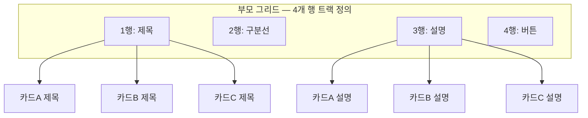

<Callout type="info">
  **이번 문서의 목표:** 이 문서를 다 읽으면 `subgrid`가 왜 필요한지, 부모의 트랙(track, 격자 선)을 자식이 그대로 물려받는다는 것이 무슨 뜻인지 설명하고, 높이가 제각각인 카드들 안에서 제목·본문·버튼의 줄을 정확히 맞추는 레이아웃을 만들 수 있게 됩니다.
</Callout>

## 왜 필요한가 — 그리드 안의 그리드가 서로 다른 줄을 그린다

`css_fundamentals`에서 배운 CSS 그리드(Grid)는 부모 요소에 `display: grid`를 걸고 `grid-template-columns`/`grid-template-rows`로 격자를 나눕니다. 그런데 그 격자 칸(grid item, 그리드 항목) 안에 또 다른 그리드를 중첩하면 문제가 생깁니다. 자식 그리드는 **자기만의 새 격자**를 처음부터 다시 계산합니다. 부모가 3개 칸으로 나눈 줄과 자식이 나눈 줄은 서로 아무 관계가 없습니다.

카드형 UI를 예로 들어보겠습니다. 카드 3개를 가로로 나란히 배치했는데, 각 카드 안에는 제목·설명·버튼이 세로로 쌓여 있습니다. 그런데 카드마다 제목 줄 수가 다르면(어떤 카드는 한 줄, 어떤 카드는 두 줄) 설명과 버튼이 카드마다 다른 높이에서 시작하게 됩니다. Flexbox로도, 일반 그리드로도 이 문제는 깔끔하게 풀리지 않습니다. 각 카드가 자기 안에서만 정렬을 계산하기 때문입니다.

> **쉽게 말하면:** 서브그리드(subgrid, 하위 격자)가 없으면 카드마다 자기만의 자를 들고 줄을 긋습니다. 서브그리드는 부모의 자를 그대로 빌려 씁니다.

**서브그리드**는 이름 그대로 부모 그리드 아래(sub-, 아래)에 놓인 격자입니다. 자식이 `grid-template-columns` 또는 `grid-template-rows`에 새 값을 정의하는 대신 `subgrid`라는 키워드 하나만 쓰면, 부모가 이미 그어 놓은 트랙 선을 그대로 물려받습니다. 2026-09 기준 서브그리드는 **널리 사용 가능**(2023-08 Baseline newly available → 2026-03 widely available)한 상태이므로 본론에서 안심하고 다룰 수 있는 안정적인 기능입니다.

## 1. 부모 트랙을 물려받는다는 것의 의미

### 기본 문법

```css
.card-grid {
  display: grid;
  grid-template-columns: repeat(3, 1fr);
  grid-template-rows: auto auto 1fr auto;
  gap: 16px;
}

.card {
  display: grid;
  grid-row: span 4;
  grid-template-rows: subgrid;
}
```

여기서 `.card-grid`(부모)는 세로로 4개의 행(row, 가로줄)을 갖는 격자를 정의했습니다. 각각 제목·구분선·설명·버튼 자리입니다. `.card`(자식)는 `grid-row: span 4`로 부모의 4개 행을 전부 차지하겠다고 선언한 뒤, `grid-template-rows: subgrid`로 "내 안의 행 트랙은 새로 정의하지 않고, 부모가 이미 그은 4개의 선을 그대로 쓰겠다"고 선언합니다.

이제 카드 안의 자식 요소(제목, 설명, 버튼)를 `grid-row: 1`, `grid-row: 3`처럼 배치하면, 이 숫자는 카드 자신의 좌표가 아니라 **부모 그리드의 전역 좌표**를 가리킵니다. 카드 A의 제목이 두 줄이라 부모의 1번 행이 늘어나면, 같은 1번 행을 공유하는 카드 B·C의 제목 영역도 똑같이 늘어납니다. 모든 카드가 같은 자를 보고 있기 때문입니다.



### 서브그리드가 없을 때와 있을 때

| 상황 | 일반 중첩 그리드 | 서브그리드 |
|------|------------------|------------|
| 자식의 트랙 정의 | 자식이 새로 정의(부모와 무관) | `subgrid` 키워드로 부모 트랙을 그대로 상속 |
| 카드 간 줄 맞춤 | 각 카드가 독립적으로 계산, 줄이 어긋남 | 모든 카드가 같은 전역 트랙을 공유, 자동으로 정렬 |
| gap 값 | 자식에서 따로 지정 필요 | 부모의 gap을 함께 물려받을 수 있음(별도 지정도 가능) |
| 필요한 선언 | `grid-template-rows`에 구체적인 크기 값 나열 | `grid-template-rows: subgrid` 한 줄 |

가로 방향(열, column)도 똑같은 원리로 동작합니다. `grid-template-columns: subgrid`를 쓰면 부모가 나눈 열 트랙을 그대로 물려받아, 세로로 긴 목록에서 왼쪽 칼럼(레이블)과 오른쪽 칼럼(값)의 폭을 여러 행에 걸쳐 정확히 맞출 수 있습니다.

## 2. 값을 바꿔가며 관찰하기

아래 실습기는 제목 줄 수가 다른 카드 3개를 나란히 배치합니다. `subgrid` 줄을 주석 처리하면 각 카드가 독립적으로 높이를 계산하기 시작해, 설명과 버튼의 시작 위치가 카드마다 어긋나는 것을 확인할 수 있습니다.

<CodePlayground
  template="static"
  activeFile="/styles.css"
  label="subgrid 켜고 끄기 — 카드 정렬이 어떻게 달라지는가"
  files={{
    '/index.html': `<link rel="stylesheet" href="styles.css">
<div class="card-grid">
  <article class="card">
    <h3>기본 요금제</h3>
    <p>가벼운 개인 프로젝트에 알맞은 최소 구성.</p>
    <button>선택하기</button>
  </article>
  <article class="card">
    <h3>프로 요금제 — 팀을 위한 확장 구성</h3>
    <p>여러 명이 협업하는 팀에 필요한 기능을 담았습니다.</p>
    <button>선택하기</button>
  </article>
  <article class="card">
    <h3>엔터프라이즈</h3>
    <p>대규모 조직의 보안·감사 요구사항까지 지원합니다.</p>
    <button>문의하기</button>
  </article>
</div>`,
    '/styles.css': `.card-grid {
  display: grid;
  grid-template-columns: repeat(3, 1fr);
  grid-template-rows: auto 1fr auto;
  gap: 16px;
  font-family: sans-serif;
}

.card {
  display: grid;
  grid-row: span 3;
  /* 이 줄을 주석 처리하면 각 카드가 독립적으로 높이를 계산한다 */
  grid-template-rows: subgrid;
  border: 1px solid #ddd;
  border-radius: 8px;
  padding: 16px;
}

.card h3 {
  grid-row: 1;
  margin: 0 0 8px;
}
.card p {
  grid-row: 2;
  color: #555;
}
.card button {
  grid-row: 3;
  align-self: start;
  margin-top: 12px;
}`,
  }}
/>

`subgrid`가 켜져 있으면 두 번째 카드의 긴 제목 때문에 늘어난 1번 행의 높이가 세 카드 모두에 똑같이 반영되어, 설명 문단과 버튼이 나란히 시작합니다. 주석 처리하면 각 카드가 제목 길이에 맞춰 스스로 줄어들어, 첫 번째·세 번째 카드의 버튼이 두 번째 카드보다 훨씬 위쪽에서 시작합니다.

## 3. 서브그리드와 컨테이너 쿼리·`@scope`의 관계

**07~08편**에서 배운 컨테이너 쿼리(container query)는 "부모의 폭이 얼마인가"에 반응해 자식의 스타일을 바꿉니다. 서브그리드는 정렬의 **기준선 자체**를 공유하는 것이라 컨테이너 쿼리와 함께 쓰면 강력합니다. 예를 들어 부모 컨테이너가 좁아지면 카드를 1열로 쌓고 `grid-template-rows: subgrid` 대신 `auto`로 되돌려, 좁은 화면에서는 각 카드가 독립적으로 자기 콘텐츠에 맞춰 높이를 잡게 할 수 있습니다.

**09편**에서 다룬 `@scope`와도 자연스럽게 어울립니다. `@scope`로 카드 컴포넌트의 스타일을 격리하면서, `subgrid`로는 레이아웃 트랙만 부모와 공유하는 조합이 가능합니다. "스타일은 격리하되 정렬 기준선은 공유한다"는 이 설계는 **30편 종합 실습**에서 컨테이너 반응형 카드를 만들 때 그대로 다시 등장합니다.

<Callout type="warning">
  **자주 틀리는 점:** `subgrid`는 부모가 **그리드**(`display: grid`)일 때만 의미가 있습니다. 부모가 Flexbox라면 자식에 `grid-template-rows: subgrid`를 써도 물려받을 격자 트랙 자체가 없어 아무 효과가 없습니다. 또한 자식이 부모의 트랙 개수보다 더 많은 칸을 차지하도록 `grid-row: span` 값을 부모의 실제 행 개수와 다르게 지정하면, 물려받는 트랙 수가 어긋나 의도한 정렬이 깨집니다.
</Callout>

## 핵심 정리

- 일반적인 중첩 그리드는 자식이 자기만의 새 트랙을 계산하므로, 형제 카드끼리 줄이 어긋난다.
- `grid-template-rows: subgrid`(또는 `columns`)는 자식이 새 트랙을 정의하지 않고 부모의 트랙 선을 그대로 물려받게 한다.
- 서브그리드를 적용한 자식 안의 `grid-row`/`grid-column` 값은 부모 그리드의 전역 좌표를 가리킨다.
- `subgrid`는 부모가 실제 그리드일 때만 동작하며, `grid-row: span` 값이 부모의 트랙 수와 맞아야 한다.
- 컨테이너 쿼리로 트랙 상속 여부를 반응형으로 켜고 끄거나, `@scope`로 스타일을 격리하면서 정렬 기준선만 공유하는 조합이 실전에서 흔하다.
- 2026-09 기준 서브그리드는 널리 사용 가능한 안정적인 기능이다.

## 마무리 복습

<Quiz
  questionNumber={1}
  question="일반적인 중첩 그리드(subgrid를 쓰지 않은 경우)에서 자식 그리드의 트랙은 어떻게 계산되는가?"
  options={['부모의 트랙 선을 자동으로 물려받는다', '자식이 자기 콘텐츠에 맞춰 완전히 새로운 트랙을 계산한다', '부모와 자식의 트랙이 평균값으로 합쳐진다', '자식은 트랙을 가질 수 없고 항상 auto로 고정된다']}
  correctAnswer={2}
  explanation="subgrid를 쓰지 않으면 자식 그리드는 부모와 무관하게 자기만의 새 격자를 계산한다. 그래서 형제 카드끼리 높이가 다르면 내부 요소의 줄이 어긋난다."
  optionExplanations={['이것이 바로 subgrid가 하는 일이며, 기본 동작은 아니다', '정답 — 자식은 독립적으로 새 트랙을 계산한다', '트랙 값을 평균 내는 동작은 CSS 그리드에 존재하지 않는다', '자식도 얼마든지 명시적인 트랙 값을 가질 수 있다']}
/>

<Quiz
  questionNumber={2}
  question="grid-template-rows: subgrid를 자식에 적용했을 때 일어나는 일로 가장 알맞은 것은?"
  options={['자식이 부모의 행 트랙 선을 그대로 물려받는다', '자식의 열 방향 정렬만 부모와 같아진다', '부모의 gap 값이 무시된다', '자식 내부 요소의 명시도가 초기화된다']}
  correctAnswer={1}
  explanation="grid-template-rows: subgrid는 행(row) 방향 트랙을 부모로부터 물려받겠다는 선언이다. 열 방향을 물려받으려면 grid-template-columns: subgrid를 별도로 써야 한다."
  optionExplanations={['정답 — 행 트랙을 부모로부터 상속받는다', 'rows 값이므로 행 방향이며, 열 방향은 별개의 선언이 필요하다', 'gap은 상속 대상이며 기본적으로 함께 물려받을 수 있다', '명시도 계산과 subgrid는 서로 무관한 개념이다']}
/>

<Quiz
  questionNumber={3}
  question="카드 3개를 나란히 두고 제목 줄 수가 카드마다 다를 때, subgrid를 적용하면 어떤 결과가 나오는가?"
  options={['제목이 긴 카드만 높이가 늘어나고 나머지는 그대로다', '가장 짧은 카드에 맞춰 모든 제목 영역이 줄어든다', '가장 긴 제목에 맞춰 늘어난 행의 높이가 모든 카드에 똑같이 반영된다', '카드마다 무작위로 높이가 배정된다']}
  correctAnswer={3}
  explanation="subgrid를 쓰면 모든 카드가 부모의 같은 행 트랙을 공유하므로, 그 행의 높이는 가장 긴 콘텐츠에 맞춰 정해지고 그 값이 형제 카드 전체에 동일하게 적용된다."
  optionExplanations={['공유하는 트랙이므로 다른 카드도 함께 영향을 받는다', '트랙 높이는 콘텐츠를 잘라내지 않도록 가장 큰 값에 맞춰진다', '정답 — 공유된 트랙의 높이가 형제 전체에 동일하게 반영된다', 'CSS 그리드의 트랙 계산에는 무작위 요소가 없다']}
/>

<Quiz
  questionNumber={4}
  question="subgrid가 아무 효과를 내지 않는 상황은 다음 중 무엇인가?"
  options={['부모가 display: grid로 선언된 경우', '부모가 display: flex로 선언된 경우', '자식이 grid-row로 여러 행을 차지하도록 지정한 경우', '부모와 자식이 같은 gap 값을 쓰는 경우']}
  correctAnswer={2}
  explanation="subgrid는 물려받을 그리드 트랙이 있어야 의미가 있다. 부모가 Flexbox라면 애초에 트랙 개념 자체가 없으므로 subgrid를 지정해도 아무 효과가 없다."
  optionExplanations={['그리드 부모여야 물려받을 트랙이 존재한다', '정답 — Flexbox에는 격자 트랙이 없어 물려받을 대상이 없다', 'span으로 여러 행을 차지하는 것은 subgrid 사용의 전제 조건 중 하나다', 'gap 값 일치 여부는 subgrid 동작에 필수 조건이 아니다']}
/>

<Quiz
  questionNumber={5}
  question="2026년 9월 기준 서브그리드(subgrid)의 지원 상태로 옳은 것은?"
  options={['제한적·실험적이며 문법이 확정되지 않았다', '최신 브라우저 기준이며 오래된 브라우저 폴백이 필수다', '널리 사용 가능하며 2026-03에 widely available에 도달했다', '표준화가 중단되어 더 이상 사용이 권장되지 않는다']}
  correctAnswer={3}
  explanation="01편 사실 확인 표 기준 서브그리드는 2023-08 Baseline newly available을 거쳐 2026-03 widely available에 도달한 안정적인 기능이다."
  optionExplanations={['masonry에 해당하는 설명이며 서브그리드는 이미 안정화되었다', '이미 널리 사용 가능 단계에 도달해 있다', '정답 — 널리 사용 가능한 안정적인 레이아웃 기능이다', '오히려 실무에서 적극 권장되는 안정적인 기능이다']}
/>

<Quiz
  questionNumber={6}
  question="서브그리드를 컨테이너 쿼리(07~08편)와 함께 쓰는 대표적인 실전 패턴은 무엇인가?"
  options={['컨테이너 폭에 따라 subgrid와 auto를 전환해, 좁을 때는 카드가 독립적으로 높이를 잡게 한다', '컨테이너 쿼리 없이는 subgrid를 아예 쓸 수 없다', '컨테이너 쿼리가 subgrid의 트랙 개수를 자동으로 계산해준다', 'subgrid를 쓰면 컨테이너 쿼리가 비활성화된다']}
  correctAnswer={1}
  explanation="넓은 화면에서는 subgrid로 카드 간 정렬을 맞추고, 컨테이너가 좁아져 카드를 1열로 쌓을 때는 auto로 되돌려 각 카드가 독립적으로 높이를 계산하게 하는 조합이 흔히 쓰인다."
  optionExplanations={['정답 — 반응형으로 트랙 상속 여부를 전환하는 조합이다', '두 기능은 독립적으로 동작할 수 있으며 서로를 전제하지 않는다', '트랙 개수 계산은 여전히 grid-template과 span 값으로 직접 지정한다', '두 기능은 서로 배타적이지 않고 함께 쓸 수 있다']}
/>

<Quiz
  questionNumber={7}
  question="09편의 @scope와 10편의 subgrid를 함께 쓸 때의 역할 구분으로 가장 알맞은 것은?"
  options={['@scope는 정렬 기준선을 공유하고, subgrid는 스타일을 격리한다', '@scope는 스타일 적용 범위를 격리하고, subgrid는 레이아웃 정렬 기준선을 공유한다', '두 기능은 동시에 쓸 수 없어 하나만 선택해야 한다', '@scope와 subgrid는 완전히 동일한 문제를 다른 문법으로 푼다']}
  correctAnswer={2}
  explanation="@scope는 캐스케이드가 적용되는 범위를 제한하는 도구이고, subgrid는 레이아웃 트랙(정렬 기준선)을 부모와 공유하는 도구다. 두 문제는 서로 다르며 함께 조합해 쓸 수 있다."
  optionExplanations={['두 기능의 역할이 서로 바뀌어 서술되어 있다', '정답 — 스타일 격리와 레이아웃 공유는 서로 다른 축이며 함께 쓸 수 있다', '둘은 서로 다른 CSS 기능으로 동시에 적용 가능하다', '하나는 캐스케이드 범위, 하나는 그리드 트랙을 다루는 별개의 문제다']}
/>

## 참고 자료

- [MDN - CSS Grid Layout: Subgrid](https://developer.mozilla.org/en-US/docs/Web/CSS/CSS_grid_layout/Subgrid)
- [web.dev - Baseline](https://web.dev/baseline)
