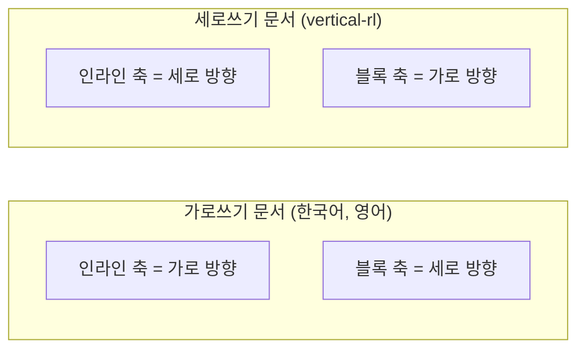

<Callout type="info">
  **이번 문서의 목표:** 이 문서를 다 읽으면 인라인(inline)·블록(block) 두 축의 개념을 설명하고, `margin-left`/`margin-right` 같은 물리 속성을 `margin-inline-start`/`margin-inline-end` 같은 논리 속성으로 바꿔 써야 하는 이유와 매핑 관계를 정확히 짚을 수 있게 됩니다.
</Callout>

## 왜 필요한가 — "왼쪽"이 항상 왼쪽은 아니다

`css_fundamentals`의 박스 모델에서 배운 `margin-left`, `padding-right`, `border-top` 같은 속성은 전부 **물리적 방향**(physical direction)을 기준으로 합니다. 화면에 실제로 그려지는 위·아래·왼쪽·오른쪽을 그대로 가리킵니다. 한국어나 영어처럼 왼쪽에서 오른쪽으로, 위에서 아래로 읽는 글쓰기 방향(writing mode, 라이팅 모드)에서는 이 방식이 직관적이고 아무 문제가 없습니다.

문제는 모든 언어가 이렇게 읽지 않는다는 데서 시작됩니다. 아랍어나 히브리어는 오른쪽에서 왼쪽으로 읽습니다. 전통 일본어나 한자 문화권의 세로쓰기 문서는 위에서 아래로, 열은 오른쪽에서 왼쪽으로 진행합니다. 만약 사이트를 아랍어 버전으로 만든다면, "제목 왼쪽에 여백을 준다"고 물리 속성으로 박아둔 `margin-left`는 실제로는 문장이 **끝나는 쪽**이 아니라 **시작하는 쪽**의 반대편에 여백을 주게 됩니다. 방향이 뒤집힌 언어에서는 왼쪽과 오른쪽의 의미 자체가 반대로 뒤집히기 때문입니다.

> **쉽게 말하면:** "왼쪽에 여백을 줘"는 방향에 따라 답이 달라지는 부탁입니다. "글이 시작하는 쪽에 여백을 줘"는 어떤 언어에서도 같은 뜻입니다.

**논리 속성**(logical properties, 로지컬 프로퍼티)은 바로 이 문제를 풉니다. "왼쪽"이나 "위" 같은 화면상의 절대 방향 대신, "글이 시작하는 쪽"·"글이 진행하는 방향" 같은 **상대적인 논리적 위치**로 스타일을 씁니다. 그러면 문서의 언어나 쓰기 방향이 바뀌어도, 브라우저가 알아서 실제 화면 방향으로 다시 계산해 줍니다. 2026-09 기준 논리 속성은 **널리 사용 가능**한 안정적인 기능이라, 새 프로젝트라면 기본값으로 채택해도 좋을 만큼 지원이 무르익었습니다.

## 1. 인라인 축과 블록 축 — 두 개의 새 좌표

논리 속성을 이해하는 핵심은 물리적인 "가로·세로" 대신 **인라인**(inline)과 **블록**(block)이라는 두 개의 논리적 축으로 다시 생각하는 것입니다.

- **인라인 축**(inline axis): 글자가 한 줄 안에서 흘러가는 방향입니다. 가로쓰기 언어(한국어, 영어)에서는 가로 방향과 같습니다.
- **블록 축**(block axis): 줄과 줄, 블록 요소와 블록 요소가 쌓이는 방향입니다. 가로쓰기 언어에서는 세로 방향과 같습니다.

가로쓰기 문서에서는 "인라인 = 가로", "블록 = 세로"라 물리 속성과 헷갈릴 일이 적지만, 세로쓰기 문서(`writing-mode: vertical-rl` 등)에서는 이 관계가 통째로 90도 회전합니다. 그때는 "인라인 = 세로", "블록 = 가로"가 됩니다. 논리 속성은 처음부터 이 회전을 신경 쓰지 않도록 설계된 이름 체계입니다.



각 축에는 **시작**(start)과 **끝**(end)이 있습니다. 가로쓰기·왼쪽에서 오른쪽으로 읽는 문서에서는 인라인 축의 시작이 왼쪽, 끝이 오른쪽입니다. 오른쪽에서 왼쪽으로 읽는 아랍어 문서라면 인라인 축의 시작이 오른쪽으로 뒤집힙니다. "시작"과 "끝"이라는 이름 자체는 바뀌지 않지만, 그것이 가리키는 실제 화면 위치는 문서의 쓰기 방향에 따라 달라집니다.

## 2. 물리 속성 ↔ 논리 속성 매핑

가장 자주 쓰는 속성들을 짝지어 보면 규칙이 보입니다. 물리 속성의 `left`/`right`는 `inline-start`/`inline-end`로, `top`/`bottom`은 `block-start`/`block-end`로 바뀝니다.

| 물리 속성(기존) | 논리 속성(대체) | 축 |
|-----------------|------------------|-----|
| `margin-left` | `margin-inline-start` | 인라인 |
| `margin-right` | `margin-inline-end` | 인라인 |
| `margin-top` | `margin-block-start` | 블록 |
| `margin-bottom` | `margin-block-end` | 블록 |
| `padding-left`/`padding-right` | `padding-inline-start`/`padding-inline-end` | 인라인 |
| `padding-top`/`padding-bottom` | `padding-block-start`/`padding-block-end` | 블록 |
| `border-left`/`border-right` | `border-inline-start`/`border-inline-end` | 인라인 |
| `width` | `inline-size` | 인라인 |
| `height` | `block-size` | 블록 |
| `left`/`right`(포지셔닝) | `inset-inline-start`/`inset-inline-end` | 인라인 |
| `top`/`bottom`(포지셔닝) | `inset-block-start`/`inset-block-end` | 블록 |
| `text-align: left`/`right` | `text-align: start`/`end` | 인라인 |

양쪽을 한 번에 지정하는 축약형도 있습니다. `margin-inline`은 `margin-inline-start`와 `margin-inline-end`를 한 번에 지정하고(가로쓰기라면 좌우 여백), `margin-block`은 위아래 여백을 한 번에 지정합니다. `padding-inline`, `border-inline` 등도 같은 규칙을 따릅니다.

```css
/* 물리 속성 방식 */
.card {
  margin-left: 16px;
  margin-right: 16px;
  padding-top: 12px;
  padding-bottom: 12px;
  width: 320px;
}

/* 논리 속성 방식 — 방향이 바뀌어도 그대로 동작한다 */
.card {
  margin-inline: 16px;
  padding-block: 12px;
  inline-size: 320px;
}
```

## 3. `writing-mode`와 다국어 대응

`writing-mode`(라이팅 모드) 속성으로 문서나 특정 요소의 쓰기 방향을 바꿀 수 있습니다. 대표 값은 다음과 같습니다.

| 값 | 의미 |
|-----|------|
| `horizontal-tb` | 가로쓰기, 위에서 아래로 블록이 쌓임(기본값) |
| `vertical-rl` | 세로쓰기, 열이 오른쪽에서 왼쪽으로 진행(전통 동아시아 세로쓰기) |
| `vertical-lr` | 세로쓰기, 열이 왼쪽에서 오른쪽으로 진행 |

`dir` 속성(HTML의 `dir="rtl"` 등)이나 `writing-mode`가 바뀌면, 논리 속성으로 작성한 스타일은 자동으로 새 방향에 맞게 재계산됩니다. 물리 속성으로 작성했다면 언어별로 별도의 CSS를 덮어써야 했을 부분이, 논리 속성에서는 **속성을 다시 쓰지 않아도** 저절로 해결됩니다.

<CodePlayground
  template="static"
  activeFile="/styles.css"
  label="writing-mode를 바꿔가며 논리 속성의 동작 확인하기"
  files={{
    '/index.html': `<link rel="stylesheet" href="styles.css">
<div class="box">
  <p>margin-inline-start로 여백을 준 문단입니다.</p>
</div>`,
    '/styles.css': `.box {
  border: 2px solid #999;
  width: 260px;
  height: 160px;
  /* 아래 값을 vertical-rl로 바꿔보면 여백 방향이 함께 회전한다 */
  writing-mode: horizontal-tb;
}

.box p {
  background: #eef;
  /* 물리 속성이었다면 vertical-rl에서 의도와 다른 자리에 여백이 생겼을 것이다 */
  margin-inline-start: 24px;
  margin-block-start: 12px;
}`,
  }}
/>

`writing-mode`를 `vertical-rl`로 바꾸면 상자 전체의 글자 흐름이 세로로 90도 회전하는데, `margin-inline-start`로 준 여백도 "글이 시작하는 쪽"이라는 의미를 그대로 유지한 채 함께 회전합니다. 만약 `margin-left`로 썼다면 세로쓰기로 바뀐 뒤에도 여전히 화면의 물리적 왼쪽에 여백이 고정되어, 의도와 다른 자리에 여백이 남게 됩니다.

## 4. `float`·`text-align`의 논리적 표현

`float: left`/`float: right`도 논리적으로는 `float: inline-start`/`float: inline-end`로 대응됩니다(단, `float`의 논리 키워드는 브라우저 지원이 물리 값보다 다소 늦게 갖춰졌으므로 프로젝트의 최소 지원 브라우저를 확인하는 것이 안전합니다). `text-align`은 이미 오래전부터 `start`/`end` 키워드를 논리적으로 지원해 왔으며, 다국어 사이트라면 `left`/`right` 대신 `start`/`end`를 기본으로 쓰는 것이 안전합니다.

| 상황 | 물리 속성만 쓸 때 | 논리 속성을 쓸 때 |
|------|---------------------|---------------------|
| 한국어·영어 전용 사이트 | 문제없이 동작 | 문제없이 동작(오히려 미래 대비) |
| 아랍어·히브리어 버전 추가 | `[dir="rtl"]` 선택자로 좌우를 뒤집는 별도 CSS 필요 | 추가 CSS 없이 자동으로 방향 전환 |
| 전통 세로쓰기 콘텐츠 | 레이아웃을 별도로 재설계해야 함 | `writing-mode`만 바꾸면 대부분 자동 대응 |
| 유지보수 비용 | 언어별 오버라이드 코드가 쌓임 | 단일 스타일 시트로 여러 방향 대응 |

<Callout type="warning">
  **자주 틀리는 점:** 논리 속성을 쓴다고 해서 `width`와 `inline-size`가 **항상** 같은 값을 낸다고 오해하기 쉽습니다. 가로쓰기 문서에서는 `inline-size`가 곧 가로 폭이 맞지만, 세로쓰기 문서에서는 `inline-size`가 세로 길이를 뜻하게 됩니다. "논리 속성은 항상 가로를 가리킨다"가 아니라 "논리 속성은 항상 글의 진행 방향을 가리킨다"는 것이 정확한 이해입니다.
</Callout>

<Callout type="warning">
  **자주 틀리는 점 2:** 애니메이션이나 트랜지션에 물리 속성과 논리 속성을 섞어 쓰면 예상치 못한 충돌이 생길 수 있습니다. 예를 들어 `margin-left`와 `margin-inline-start`를 같은 요소에 동시에 지정하면, 가로쓰기 문서에서는 물리적으로 같은 자리를 가리키므로 나중에 선언된 쪽(또는 명시도가 더 높은 쪽)이 최종적으로 이깁니다. 한 프로젝트 안에서는 물리 속성과 논리 속성 중 하나로 통일하는 것이 유지보수에 안전합니다.
</Callout>

## 접근성과 국제화 관점

**국제화**(internationalization, 자주 i18n으로 줄여 씁니다 — internationalization의 첫 글자 i와 끝 글자 n 사이에 18글자가 있다는 뜻)를 고려하는 프로젝트라면 논리 속성은 선택이 아니라 기본값에 가깝습니다. 스크린 리더 사용자에게는 논리 속성 자체가 직접적인 차이를 만들지는 않지만, 다국어·다방향 문서에서 레이아웃이 깨지지 않는다는 것은 곧 콘텐츠가 의도한 순서와 구조로 정확히 전달된다는 뜻이므로 간접적으로 접근성에 기여합니다. 여러 언어를 지원할 계획이 전혀 없는 프로젝트라 해도, 애초에 매핑 규칙 하나만 익히면 되는 논리 속성을 기본으로 채택해 두면 나중에 다국어 지원을 추가할 때 되돌아가 물리 속성을 전부 바꾸는 비용을 아낄 수 있습니다.

## 핵심 정리

- 물리 속성(`left`/`right`/`top`/`bottom`)은 화면상의 절대 방향을 가리키고, 논리 속성은 글이 흐르는 인라인 축·블록 축을 기준으로 한 상대적 위치를 가리킨다.
- 인라인 축은 한 줄 안에서 글자가 흐르는 방향, 블록 축은 줄과 블록이 쌓이는 방향이며, 가로쓰기에서는 각각 가로·세로와 일치하지만 세로쓰기에서는 뒤바뀐다.
- `margin-left` → `margin-inline-start`, `width` → `inline-size`처럼 대응 관계를 외워두면 대부분의 속성을 바로 바꿔 쓸 수 있다.
- `writing-mode`나 `dir` 속성이 바뀌어도 논리 속성으로 작성한 스타일은 자동으로 재계산되어, 언어별 오버라이드 CSS를 따로 쓸 필요가 없다.
- 2026-09 기준 논리 속성은 널리 사용 가능한 안정적인 기능이며, 다국어 지원 계획이 당장 없어도 기본값으로 채택해 두는 편이 유지보수에 유리하다.

## 마무리 복습

<Quiz
  questionNumber={1}
  question="논리 속성(logical properties)이 풀려는 근본적인 문제는 무엇인가?"
  options={['CSS 파일의 용량이 너무 커지는 문제', '왼쪽·오른쪽 같은 물리적 방향이 언어의 쓰기 방향에 따라 실제 의미가 달라지는 문제', '브라우저마다 픽셀 계산 방식이 다른 문제', '미디어 쿼리의 중단점을 정하기 어려운 문제']}
  correctAnswer={2}
  explanation="오른쪽에서 왼쪽으로 읽는 언어나 세로쓰기 문서에서는 물리적인 왼쪽/오른쪽/위/아래가 글의 시작·끝과 일치하지 않는다. 논리 속성은 이 문제를 글의 흐름 기준으로 다시 표현해 해결한다."
  optionExplanations={['논리 속성 도입이 파일 용량 문제를 직접 해결하지는 않는다', '정답 — 방향에 따라 의미가 달라지는 물리적 표현의 한계를 해결한다', '픽셀 계산 방식과 논리 속성은 서로 다른 주제다', '중단점 설계는 이 편의 논리 속성과 직접 관련이 없다']}
/>

<Quiz
  questionNumber={2}
  question="가로쓰기 문서에서 인라인 축과 블록 축이 각각 가리키는 방향은?"
  options={['인라인은 세로, 블록은 가로', '인라인은 가로, 블록은 세로', '인라인과 블록 모두 가로 방향을 가리킨다', '인라인과 블록은 문서 종류와 무관하게 항상 대각선을 가리킨다']}
  correctAnswer={2}
  explanation="가로쓰기 언어에서 인라인 축은 한 줄 안에서 글자가 흐르는 가로 방향, 블록 축은 줄과 블록이 쌓이는 세로 방향이다. 세로쓰기 문서에서는 이 관계가 뒤바뀐다."
  optionExplanations={['가로쓰기 문서에서는 반대로 서술되어 있다', '정답 — 가로쓰기에서 인라인은 가로, 블록은 세로다', '두 축은 서로 다른 방향을 가리킨다', '두 축은 항상 서로 수직인 두 방향 중 하나를 가리키며 대각선은 아니다']}
/>

<Quiz
  questionNumber={3}
  question="물리 속성 width에 대응하는 논리 속성은 무엇인가?"
  options={['block-size', 'inline-size', 'inset-inline', 'margin-inline']}
  correctAnswer={2}
  explanation="width는 인라인 축의 크기를 나타내므로 논리 속성으로는 inline-size에 대응한다. height가 block-size에 대응한다."
  optionExplanations={['block-size는 height에 대응하는 속성이다', '정답 — width는 인라인 축 크기이므로 inline-size에 대응한다', 'inset-inline은 위치(포지셔닝) 관련 속성으로 크기와는 다른 개념이다', 'margin-inline은 여백 속성으로 크기(size) 속성이 아니다']}
/>

<Quiz
  questionNumber={4}
  question="writing-mode를 horizontal-tb에서 vertical-rl로 바꿨을 때 margin-inline-start로 준 여백은 어떻게 되는가?"
  options={['여백이 사라진다', '여백 값이 자동으로 두 배가 된다', '여백이 새로운 인라인 시작 방향(회전된 방향)에 맞춰 함께 이동한다', '브라우저가 오류를 내고 스타일 전체를 무시한다']}
  correctAnswer={3}
  explanation="논리 속성은 물리적 방향이 아니라 인라인·블록 축을 기준으로 하므로, writing-mode가 바뀌어 축의 실제 방향이 회전하면 여백도 그 방향을 따라 함께 이동한다."
  optionExplanations={['여백 값 자체는 그대로 유지되며 사라지지 않는다', '값이 임의로 두 배가 되는 동작은 없다', '정답 — 논리적 위치를 유지한 채 실제 방향만 재계산된다', 'writing-mode 변경은 정상적인 CSS 동작이며 오류를 내지 않는다']}
/>

<Quiz
  questionNumber={5}
  question="margin-inline을 한 번만 선언했을 때의 효과로 알맞은 것은?"
  options={['margin-block-start와 margin-block-end를 동시에 지정한다', 'margin-inline-start와 margin-inline-end를 동시에 지정한다', 'margin-top만 지정한다', '모든 방향의 margin을 한 번에 지정한다']}
  correctAnswer={2}
  explanation="margin-inline은 인라인 축의 시작과 끝, 즉 margin-inline-start와 margin-inline-end를 한 번에 지정하는 축약형이다. 블록 축을 함께 지정하려면 margin-block을 별도로 써야 한다."
  optionExplanations={['그것은 margin-block의 역할이다', '정답 — 인라인 축 양쪽을 한 번에 지정하는 축약형이다', 'margin-top은 물리 속성이며 margin-inline과 직접 대응하지 않는다', '네 방향 모두를 한 번에 지정하려면 margin 하나만 쓰면 되며 margin-inline은 인라인 축만 담당한다']}
/>

<Quiz
  questionNumber={6}
  question="여러 언어(예: 한국어와 아랍어)를 모두 지원해야 하는 사이트에서, 물리 속성만 사용했을 때 생기는 유지보수 부담은?"
  options={['물리 속성은 애초에 다국어 사이트에서 지원되지 않는다', '언어별로 [dir=rtl] 같은 선택자로 좌우를 뒤집는 별도 CSS를 추가로 관리해야 한다', 'CSS 파일 크기가 자동으로 두 배가 된다', '물리 속성을 쓰면 접근성 트리가 생성되지 않는다']}
  correctAnswer={2}
  explanation="물리 속성은 방향에 따라 자동으로 재계산되지 않으므로, 오른쪽에서 왼쪽으로 읽는 언어 버전에서는 별도의 오버라이드 CSS를 작성해 좌우를 뒤집어야 한다. 논리 속성을 쓰면 이 작업이 필요 없다."
  optionExplanations={['물리 속성 자체는 어떤 문서에서도 정상적으로 동작한다', '정답 — 방향별 오버라이드 CSS를 따로 관리해야 하는 부담이 생긴다', 'CSS 파일 크기 증가는 자동으로 정해지는 것이 아니라 실제로 추가하는 규칙의 양에 달려 있다', '접근성 트리 생성 여부는 물리 속성 사용과 무관하다']}
/>

<Quiz
  questionNumber={7}
  question="한 요소에 margin-left와 margin-inline-start를 동시에 선언했을 때(가로쓰기 문서 기준) 벌어지는 일은?"
  options={['브라우저가 두 값을 자동으로 더한다', '두 속성이 물리적으로 같은 자리를 가리키므로, 나중에 선언되거나 명시도가 더 높은 쪽이 최종 적용된다', '항상 margin-inline-start가 무시된다', '항상 margin-left가 무시된다']}
  correctAnswer={2}
  explanation="가로쓰기 문서에서 margin-left와 margin-inline-start는 같은 물리적 위치를 가리키므로 서로 충돌할 수 있다. 최종 적용되는 값은 일반적인 캐스케이드 규칙(소스 순서·명시도)에 따라 정해진다."
  optionExplanations={['CSS는 같은 자리를 가리키는 서로 다른 속성의 값을 자동으로 더하지 않는다', '정답 — 일반적인 캐스케이드 규칙에 따라 승부가 갈린다', '항상 무시되는 쪽이 고정되어 있지는 않다', '항상 무시되는 쪽이 고정되어 있지는 않다']}
/>

## 참고 자료

- [MDN - CSS logical properties and values](https://developer.mozilla.org/en-US/docs/Web/CSS/CSS_logical_properties_and_values)
- [web.dev - Baseline](https://web.dev/baseline)
