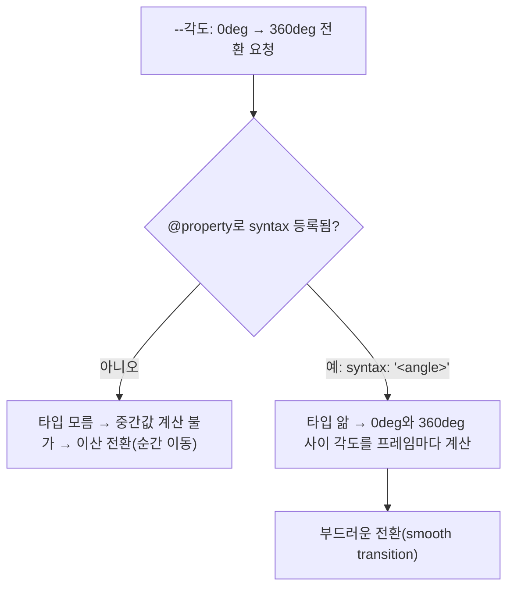

<Callout type="info">
  **이번 문서의 목표:** 이 문서를 다 읽으면 일반 커스텀 속성이 왜 부드럽게 전환(transition)되지 않는지 설명하고, `@property`의 `syntax`·`inherits`·`initial-value` 디스크립터로 타입을 지정해 애니메이션 가능한 커스텀 속성을 직접 만들 수 있게 됩니다.
</Callout>

<Callout type="warning">
  **지원 상태:** `@property`는 2026년 9월 기준 **최신 브라우저 기준**(2024-07 Baseline newly available) 기능입니다. 최신 Chrome·Edge·Firefox·Safari에서는 안정적으로 동작하지만, 오래된 브라우저에서는 무시됩니다. 이 편의 예제처럼 `@property`가 없어도 레이아웃이 깨지지 않고 "애니메이션만 부드럽지 않게 되돌아가는" 형태로 설계하는 것이 안전한 점진적 향상(progressive enhancement)입니다.
</Callout>

## 왜 필요한가 — 커스텀 속성은 왜 부드럽게 전환되지 않는가

13편에서 커스텀 속성(custom property)이 `var()`로 값을 문자열처럼 치환하는 방식으로 동작한다고 배웠습니다. 그런데 이 커스텀 속성 값을 `transition`으로 부드럽게 바꾸려고 하면 이상한 일이 벌어집니다.

```css
.배경 {
  --각도: 0deg;
  background: conic-gradient(from var(--각도), red, orange, yellow, red);
  transition: --각도 1s;
}

.배경:hover {
  --각도: 360deg;
}
```

의도는 마우스를 올리면 그라디언트가 1초 동안 부드럽게 회전하는 것입니다. 하지만 대부분의 브라우저에서 이 코드는 회전 없이 **각도가 0도에서 360도로 뚝 하고 순간 이동**해 버립니다. 원인은 브라우저가 `--각도`라는 커스텀 속성을 그냥 텍스트 토큰(token)의 나열로만 취급하기 때문입니다. `0deg`와 `360deg`가 각도값이라는 것을 브라우저가 모르니, "그 사이의 중간값"을 계산할 방법이 없습니다. 그래서 값이 바뀌는 순간 즉시 새 값으로 전환하는 **이산 전환**(discrete transition)만 일어납니다.

> **쉽게 말하면:** 브라우저 입장에서 일반 커스텀 속성은 "글자로 적힌 메모지"입니다. `0deg`라는 메모지와 `360deg`라는 메모지 사이에 "180deg라는 중간 메모지"가 있다는 걸 브라우저는 알 도리가 없습니다. 숫자인지, 색인지, 길이인지 **타입**(type)을 알려주지 않았기 때문입니다.

## 정의 — `@property`가 하는 일

**`@property`**는 커스텀 속성 하나하나에 **타입 정보**를 등록하는 CSS 규칙입니다. 이 등록 덕분에 브라우저는 그 커스텀 속성이 담을 값의 종류(각도, 색, 숫자, 길이 등)를 미리 알게 되고, 두 값 사이를 보간(interpolation, 중간값을 계산해 채우는 것)할 수 있게 됩니다.

```css
@property --각도 {
  syntax: '<angle>';
  inherits: false;
  initial-value: 0deg;
}
```

세 디스크립터(descriptor, `@property` 규칙 안에서 쓰는 세부 설정 항목)를 하나씩 뜯어봅니다.

### `syntax` — 이 속성은 어떤 종류의 값인가

`syntax`는 이 커스텀 속성이 받을 수 있는 값의 타입을 문자열로 지정합니다. 꺾쇠(`<`, `>`)로 감싼 이름은 CSS가 이미 알고 있는 값 종류를 가리킵니다.

| `syntax` 값 | 허용하는 값의 예 | 용도 |
|-------------|-------------------|------|
| `'<color>'` | `red`, `#3b82f6`, `oklch(60% 0.1 200)` | 배경색·글자색 애니메이션 |
| `'<length>'` | `10px`, `2rem`, `50%` (문맥에 따라) | 너비·간격 애니메이션 |
| `'<angle>'` | `0deg`, `1turn`, `90grad` | 회전·그라디언트 각도 애니메이션 |
| `'<number>'` | `0`, `1.5`, `100` | 불투명도 배수, 스케일 값 등 |
| `'<percentage>'` | `0%`, `75%` | 진행률 표시 등 |
| `'*'` | 무엇이든 (타입 검사 없음) | 일반 커스텀 속성과 동일하게 자유로운 값 — 애니메이션 불가 |

`syntax`를 지정하면 그 순간부터 이 커스텀 속성은 **타입이 맞지 않는 값을 거부**합니다. `--각도`에 `syntax: '<angle>';`을 지정한 뒤 `--각도: 파랑;`처럼 각도가 아닌 값을 넣으면, 그 선언은 무효 처리되어 `initial-value`로 대체됩니다. 13편에서 배운 "값이 있지만 속성에 맞지 않으면 무효 처리된다"는 원리가 여기서도 그대로 적용되되, 이번에는 무효 처리의 기준이 브라우저가 짐작하는 것이 아니라 **직접 등록한 타입 규칙**입니다.

### `inherits` — 자손에게 값을 물려줄 것인가

`inherits`는 참(`true`) 또는 거짓(`false`)만 받습니다. `true`면 13편에서 본 것처럼 조상에서 자손으로 값이 상속됩니다. `false`면 상속을 끊고, 각 요소는 명시적으로 값을 다시 선언하지 않는 한 항상 `initial-value`에서 시작합니다.

일반 커스텀 속성(`--이름: 값;`만으로 선언한 것)은 항상 `inherits: true;`인 것과 같은 동작을 합니다. `@property`를 쓰면 이 기본값을 명시적으로 `false`로 바꿀 수 있다는 것이 새로운 점입니다.

### `initial-value` — 아무도 값을 정하지 않았을 때의 기본값

`initial-value`는 그 커스텀 속성이 어디에도 선언되지 않았을 때, 또는 유효하지 않은 값이 대입되어 무효 처리되었을 때 쓰이는 값입니다. `syntax`가 `'*'`가 아닌 이상 `initial-value`는 **필수**입니다. 타입을 지정해 놓고 기본값을 안 주면, 브라우저가 "이 속성이 처음에 어떤 값이어야 하는지" 판단할 근거가 없기 때문입니다.

<Callout type="warning">
  **자주 틀리는 점:** `syntax: '<color>';`처럼 구체적인 타입을 지정하면서 `initial-value`를 빠뜨리면 `@property` 규칙 전체가 **무효 처리**됩니다. 등록 자체가 실패하므로 그 커스텀 속성은 다시 타입 없는 일반 커스텀 속성처럼 동작합니다. `syntax: '*';`일 때만 `initial-value`를 생략할 수 있습니다.
</Callout>

## 이 타입 정보가 애니메이션을 가능하게 만드는 원리

브라우저의 애니메이션 엔진은 시작값과 끝값 사이를 여러 프레임에 걸쳐 채우는 **보간**을 수행합니다. 숫자라면 산술 평균으로, 색이라면 각 채널을 섞어서, 각도라면 그 사이 각도로 중간값을 계산합니다. 하지만 이 계산은 "이 값이 숫자다" "이 값이 색이다"라는 **타입을 알아야만 가능**합니다.

`@property`로 `syntax: '<angle>';`을 등록하면, 브라우저는 `--각도`가 항상 각도값이라는 것을 알게 되고, `0deg`에서 `360deg`로 가는 동안 `90deg`, `180deg`, `270deg` 같은 중간 프레임을 실제로 계산해 냅니다. 등록 전에는 이 계산 자체가 불가능해 이산 전환만 가능했던 것이, 등록 후에는 일반 CSS 속성과 똑같이 부드러운 전환의 대상이 됩니다.



## 값을 바꿔가며 확인하기 — 등록 전후 비교

<CodePlayground
  template="static"
  activeFile="/styles.css"
  label="@property 등록 여부에 따라 각도 전환이 달라지는 것을 확인하기"
  files={{
    '/index.html': `<!DOCTYPE html>
<html lang="ko">
<head>
  <meta charset="UTF-8" />
  <link rel="stylesheet" href="styles.css" />
</head>
<body>
  <p>두 원 위에 마우스를 올려 회전 그라디언트를 비교하세요.</p>
  <div class="원 등록안함">타입 등록 없음</div>
  <div class="원 등록함">syntax: '&lt;angle&gt;' 등록</div>
</body>
</html>`,
    '/styles.css': `/* 타입을 등록하지 않은 일반 커스텀 속성 */
.원.등록안함 {
  --각도: 0deg;
  transition: --각도 1.2s ease;
}
.원.등록안함:hover {
  --각도: 360deg;
}

/* @property로 타입을 등록한 커스텀 속성 */
@property --각도2 {
  syntax: '<angle>';
  inherits: false;
  initial-value: 0deg;
}
.원.등록함 {
  --각도2: 0deg;
  transition: --각도2 1.2s ease;
}
.원.등록함:hover {
  --각도2: 360deg;
}

.원 {
  width: 180px;
  height: 180px;
  border-radius: 50%;
  display: flex;
  align-items: center;
  justify-content: center;
  color: white;
  text-align: center;
  margin: 16px;
  font-family: sans-serif;
}
.원.등록안함 {
  background: conic-gradient(from var(--각도), #f97316, #3b82f6, #f97316);
}
.원.등록함 {
  background: conic-gradient(from var(--각도2), #f97316, #3b82f6, #f97316);
}`,
  }}
/>

두 원 모두 같은 각도(0도에서 360도)로 전환을 시도하지만, 타입을 등록하지 않은 첫 번째 원은 마우스를 올리는 순간 그라디언트가 툭 끊기듯 순간 이동하고, `@property`로 `syntax: '<angle>'`을 등록한 두 번째 원은 실제로 빙글 돌아가는 것을 볼 수 있습니다. `syntax` 값을 `'*'`로 바꿔 다시 실행하면 두 번째 원도 첫 번째 원과 같은 이산 전환으로 되돌아가는 것까지 확인해 보세요.

## 비교표 — 일반 커스텀 속성 vs `@property`로 등록한 커스텀 속성

| 구분 | 일반 커스텀 속성(`--x: 값;`) | `@property`로 등록한 커스텀 속성 |
|------|-------------------------------|-----------------------------------|
| 값의 타입 | 없음 — 토큰 나열로만 취급 | `syntax`로 지정한 타입을 강제 |
| 상속 여부 | 항상 상속(true) | `inherits`로 명시적 선택 가능 |
| 잘못된 값 대입 시 | 별도 검증 없음(사용하는 속성에서만 무효 처리) | 타입에 안 맞으면 등록 단계에서 즉시 `initial-value`로 대체 |
| `transition`/`animation` | 이산 전환만 가능(순간 전환) | 타입에 맞는 부드러운 보간 가능 |
| 값이 없을 때 초기값 | 없음(선언 안 하면 `var()`가 빈 값 취급) | `initial-value`가 항상 보장 |
| 오래된 브라우저 | 항상 동작 | `@property`를 모르면 무시하고 일반 커스텀 속성처럼 동작(값 자체는 계속 쓸 수 있음) |

## `@supports`로 점진적 향상 설계하기

`@property`가 없는 브라우저에서도 레이아웃이 깨지지 않도록, 애니메이션이 "덤"이 되게 설계하는 것이 안전합니다.

```css
.원 {
  --각도: 0deg;
  background: conic-gradient(from var(--각도), #f97316, #3b82f6, #f97316);
}

@supports (background: paint(x)) or (color: color(display-p3 0 0 0)) {
  /* 최신 브라우저 전용 향상: @property는 별도 @supports 대상이 아니라
     실제로는 등록해 두면 지원 브라우저에서만 조용히 효과가 켜진다 */
}

@property --각도 {
  syntax: '<angle>';
  inherits: false;
  initial-value: 0deg;
}

.원:hover {
  --각도: 360deg;
  transition: --각도 1.2s ease;
}
```

`@property`는 `@supports`로 감쌀 필요조차 없다는 점이 특징입니다. 이 규칙을 이해하지 못하는 브라우저는 통째로 무시하고 지나가므로, 결과는 자동으로 "지원 브라우저에서는 부드러운 회전, 미지원 브라우저에서는 순간 전환"이라는 점진적 향상이 됩니다. 다만 회전 각도가 핵심 기능(예: 진행률 표시)이라면, 순간 전환이라도 최종 상태는 항상 올바르게 나온다는 점을 반드시 확인해야 합니다 — `@property`는 **애니메이션의 매끄러움**만 좌우하지, 최종값 자체를 좌우하지 않습니다.

## 자주 틀리는 점 — `@property`와 `var()` 폴백을 혼동하지 않기

`@property`의 `initial-value`와 13편에서 배운 `var(--x, 폴백)`의 폴백은 비슷해 보이지만 다른 계층에서 작동합니다.

| | `var()`의 폴백 값 | `@property`의 `initial-value` |
|---|---|---|
| 적용 위치 | `var()`를 호출한 그 자리마다 개별적으로 지정 | 커스텀 속성 자체에 등록되어 어디서 참조하든 동일 |
| 발동 조건 | 그 커스텀 속성이 선언 안 됨/빈 값일 때 | 등록된 타입에 맞지 않는 값이 대입될 때, 또는 아무 값도 없을 때 |
| 타입 검증 | 하지 않음 | `syntax`로 강제 |

## 핵심 정리

- 일반 커스텀 속성은 타입 정보가 없는 토큰 나열이라 브라우저가 중간값을 계산하지 못해, `transition`을 걸어도 이산 전환(순간 전환)만 일어난다.
- `@property`는 `syntax`(타입)·`inherits`(상속 여부)·`initial-value`(기본값) 세 디스크립터로 커스텀 속성에 타입을 등록하는 규칙이다.
- `syntax`가 `'<angle>'`, `'<color>'`, `'<number>'` 같은 구체적 타입이면 `initial-value`가 필수이며, 없으면 등록 자체가 무효 처리된다.
- 타입이 등록되면 브라우저가 실제로 중간 프레임을 계산할 수 있어, 그동안 불가능했던 그라디언트 각도·커스텀 색 등의 부드러운 애니메이션이 가능해진다.
- `@property`는 2026-09 기준 최신 브라우저 기준 기능이며, 등록 자체를 이해하지 못하는 브라우저는 조용히 무시하므로 별도 `@supports` 없이도 안전한 점진적 향상이 된다.

## 마무리 복습

<Quiz
  questionNumber={1}
  question="일반 커스텀 속성에 transition을 걸어도 값이 순간적으로 바뀌고 부드럽게 전환되지 않는 근본적인 이유는?"
  options={['브라우저가 커스텀 속성의 transition 자체를 지원하지 않기 때문에', '커스텀 속성이 타입 정보 없이 토큰 나열로만 취급되어 중간값을 계산할 방법이 없기 때문에', 'CSS 명세에서 커스텀 속성의 애니메이션을 금지하고 있기 때문에', '커스텀 속성은 항상 문자열이라 숫자 계산이 불가능하기 때문에']}
  correctAnswer={2}
  explanation="브라우저는 값의 타입을 알아야 두 값 사이의 중간값을 계산해 보간할 수 있다. 일반 커스텀 속성은 타입이 없어 이 계산이 불가능해 이산 전환만 일어난다."
  optionExplanations={['transition 문법 자체는 커스텀 속성에도 적용 가능하다', '정답 — 타입 정보 부재가 보간 불가의 근본 원인이다', '명세가 애니메이션을 금지하는 것이 아니라 계산 근거가 없는 것이 문제다', '값 자체는 숫자·각도 등일 수 있으나 그 사실을 브라우저가 모르는 것이 문제다']}
/>

<Quiz
  questionNumber={2}
  question="@property --각도 { syntax: '&lt;angle&gt;'; inherits: false; initial-value: 0deg; }에서 initial-value가 하는 역할은?"
  options={['이 속성이 상속될지 여부를 결정한다', '값이 선언되지 않았거나 타입에 맞지 않을 때 쓰이는 기본값을 지정한다', '애니메이션 지속 시간을 지정한다', '이 속성을 사용할 수 있는 선택자를 제한한다']}
  correctAnswer={2}
  explanation="initial-value는 이 커스텀 속성에 유효한 값이 없을 때 쓰이는 기본값이다. 상속 여부는 inherits가, 지속 시간은 transition이 따로 담당한다."
  optionExplanations={['상속 여부는 inherits 디스크립터가 담당한다', '정답 — 값이 없거나 무효할 때의 기본값을 지정한다', 'initial-value는 시간과 무관한 값 디스크립터다', '선택자 제한 기능은 @property에 없다']}
/>

<Quiz
  questionNumber={3}
  question="syntax: '&lt;color&gt;';로 등록한 커스텀 속성에 initial-value를 지정하지 않으면 어떻게 되는가?"
  options={['기본값이 자동으로 흰색으로 설정된다', '해당 @property 규칙 전체가 무효 처리되어 등록되지 않는다', 'syntax가 자동으로 만능 타입으로 대체된다', '브라우저가 사용자에게 값을 입력하라는 경고를 띄운다']}
  correctAnswer={2}
  explanation="syntax가 '*'가 아닌 구체적인 타입일 때는 initial-value가 필수다. 이를 빠뜨리면 등록 규칙 자체가 무효가 되어, 그 커스텀 속성은 타입 없는 일반 속성처럼 동작한다."
  optionExplanations={['자동으로 흰색이 채워지는 규칙은 없다', '정답 — 필수 디스크립터 누락으로 등록 자체가 무효화된다', 'syntax 값이 강제로 바뀌는 동작은 없다', '브라우저가 경고를 띄우는 동작은 정의되어 있지 않다']}
/>

<Quiz
  questionNumber={4}
  question="@property의 inherits: false;가 하는 일로 옳은 것은?"
  options={['이 속성을 var()로 참조할 수 없게 만든다', '조상에서 값을 재정의해도 자손에게 상속시키지 않고 각 요소가 initial-value에서 시작하게 한다', '이 속성의 애니메이션을 비활성화한다', '이 속성을 :root에서만 선언 가능하게 제한한다']}
  correctAnswer={2}
  explanation="inherits: false는 상속 경로를 끊어, 명시적으로 재선언하지 않은 요소는 항상 initial-value를 기본값으로 사용하게 만든다."
  optionExplanations={['var() 참조 가능 여부와는 무관하다', '정답 — 상속을 차단하고 initial-value를 기본으로 삼는다', '애니메이션 가능 여부는 syntax가 결정하지 inherits가 아니다', '선언 위치를 제한하는 기능은 없다']}
/>

<Quiz
  questionNumber={5}
  question="타입이 등록된 커스텀 속성에 그 타입에 맞지 않는 값을 대입하면 어떤 일이 일어나는가?"
  options={['브라우저 콘솔에 항상 오류가 출력되고 페이지 렌더링이 중단된다', '해당 선언이 무효 처리되어 initial-value로 되돌아간다', '값이 문자열로 강제 변환되어 그대로 적용된다', '이전 프레임의 값이 영구히 고정된다']}
  correctAnswer={2}
  explanation="등록된 syntax에 맞지 않는 값은 유효하지 않은 CSS 선언과 같이 취급되어 무효 처리되고, 그 결과 initial-value가 대신 쓰인다."
  optionExplanations={['CSS 값 오류가 페이지 렌더링을 중단시키지는 않는다', '정답 — 무효 처리 후 initial-value로 대체된다', '강제 문자열 변환 같은 동작은 없다', '값이 영구 고정되는 동작이 아니라 초기값으로 되돌아간다']}
/>

<Quiz
  questionNumber={6}
  question="@property를 지원하지 않는 오래된 브라우저에서 이 규칙이 포함된 스타일시트를 로드하면 어떤 일이 일어나는가?"
  options={['페이지 전체가 렌더링되지 않는다', '@property 규칙만 조용히 무시되고, 해당 커스텀 속성은 타입 없는 일반 커스텀 속성처럼 계속 동작한다', '오류 메시지가 사용자 화면에 표시된다', '가장 가까운 폴백 스타일시트로 자동 전환된다']}
  correctAnswer={2}
  explanation="이해하지 못하는 CSS 규칙을 브라우저는 조용히 무시하는 것이 CSS의 기본 원칙이다. @property도 마찬가지로 미지원 환경에서는 무시되고, 커스텀 속성 자체는 값 전달 용도로 계속 쓸 수 있다."
  optionExplanations={['CSS 파싱 오류가 페이지 전체 렌더링을 막지는 않는다', '정답 — 조용한 무시가 CSS의 기본 오류 처리 방식이다', '사용자에게 노출되는 오류 메시지는 없다', '자동 폴백 스타일시트 전환 같은 메커니즘은 존재하지 않는다']}
/>

<Quiz
  questionNumber={7}
  question="var(--x, 폴백)의 폴백 값과 @property의 initial-value의 차이로 옳은 것은?"
  options={['둘은 완전히 동일한 개념이라 서로 대체 가능하다', '폴백은 var()를 호출한 그 자리마다 개별 지정되지만, initial-value는 커스텀 속성 자체에 등록되어 어디서든 동일하게 적용된다', 'initial-value는 타입 검증 없이 항상 그대로 대입된다', '폴백 값은 애니메이션 중간값 계산에 쓰이지만 initial-value는 쓰이지 않는다']}
  correctAnswer={2}
  explanation="var()의 폴백은 호출 지점마다 다르게 줄 수 있는 지역적인 값이고, @property의 initial-value는 그 속성 자체에 등록되어 어디서 참조하든 같은 기본값을 준다."
  optionExplanations={['적용 범위와 발동 조건이 다르므로 완전히 같은 개념이 아니다', '정답 — 지역적 폴백과 전역 등록값이라는 계층 차이가 핵심이다', 'initial-value는 syntax로 지정한 타입 규칙을 그대로 따른다', '보간 계산은 syntax로 등록된 타입 정보를 기반으로 하며 initial-value는 시작·복귀 지점 역할을 한다']}
/>

## 참고 자료

- [MDN - @property](https://developer.mozilla.org/en-US/docs/Web/CSS/@property)
- [MDN - CSS Properties and Values API](https://developer.mozilla.org/en-US/docs/Web/API/CSS_Properties_and_Values_API)
- [MDN - Using CSS custom properties](https://developer.mozilla.org/en-US/docs/Web/CSS/CSS_cascading_variables/Using_CSS_custom_properties)
