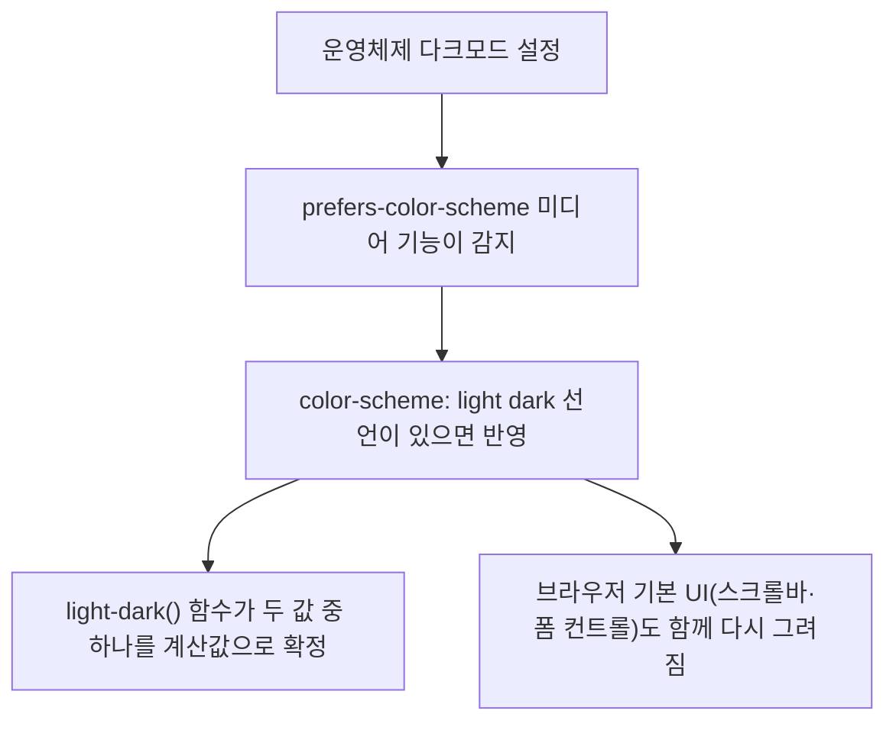

<Callout type="info">
  **이번 문서의 목표:** 이 문서를 다 읽으면 `color-scheme` 속성으로 브라우저 기본 UI를 시스템 설정에 맞추고, `light-dark()` 함수로 색 토큰마다 미디어 쿼리를 두 번 쓰지 않고도 라이트·다크 모드를 동시에 지원하는 CSS를 설계할 수 있게 됩니다.
</Callout>

## 1. 왜 스크롤바까지 신경 써야 하는가 — `color-scheme`

### 문제 상황

15편·16편에서 `oklch()`와 `color-mix()`로 원하는 색을 정밀하게 계산하는 방법을 배웠습니다. 그런데 사용자가 시스템을 다크 모드로 설정하고 내 사이트를 열었을 때, 배경은 검게 바꿨는데 스크롤바는 여전히 밝은 회색, 텍스트 입력창(`<input>`)의 테두리는 여전히 흰 배경 기준으로 그려진 걸 본 적이 있을 것입니다. 배경·글자색은 내가 CSS로 칠했지만, 스크롤바·체크박스·`<select>` 드롭다운 같은 **브라우저가 직접 그리는 기본 UI**는 내 CSS가 손대지 않은 영역이기 때문입니다.

> **쉽게 말하면:** 브라우저는 폼 컨트롤과 스크롤바를 자기 나름의 기본 도장으로 찍어 그립니다. 그 도장 자체를 "지금 화면이 밝은지 어두운지" 알려주지 않으면, 브라우저는 무조건 밝은 도장만 씁니다.

### 정의와 문법

**색 스킴**(color-scheme, 색 배색)은 이 문서가 라이트·다크 중 무엇을 지원하는지 브라우저에게 알려주는 속성입니다. 값은 다음과 같습니다.

```css
:root {
  color-scheme: light dark;
}
```

| 값 | 의미 |
|------|------|
| `normal` | 특별히 알리지 않음(기본값) — 브라우저는 라이트로 가정 |
| `light` | 이 문서는 라이트 배색만 지원 |
| `dark` | 이 문서는 다크 배색만 지원 |
| `light dark` | 둘 다 지원하며, 실제 선택은 `prefers-color-scheme`(사용자의 시스템 선호)을 따름 |

HTML의 `<meta name="color-scheme" content="light dark">`로도 같은 효과를 줄 수 있지만, CSS 쪽 선언이 우선순위를 계산하기 쉬워 보통 CSS에서 선언합니다.

### 브라우저가 실제로 하는 일

`color-scheme: light dark`를 선언하면 브라우저는 사용자 에이전트 스타일시트(user-agent stylesheet, 브라우저가 기본으로 깔아두는 스타일)를 현재 시스템 선호에 맞춰 **다시 그립니다.** 구체적으로는 다음이 자동으로 바뀝니다.

- 스크롤바 색
- `<input>`, `<select>`, `<textarea>` 같은 폼 컨트롤의 기본 배경·테두리·글자색
- 지정하지 않은 `<canvas>`의 초기 배경(투명이 아닌 캔버스는 흰 배경이 기본이었으나 다크 스킴에서는 검게 바뀜)

<Callout type="warning">
  **자주 틀리는 점:** `color-scheme: light dark`만 선언하면 사이트 전체가 자동으로 다크 모드가 된다고 착각하기 쉽습니다. 하지만 이 속성은 **브라우저가 직접 그리는 기본 UI**에만 영향을 줍니다. 내가 CSS로 칠한 `background`, `color` 같은 값은 여전히 내가 직접 다크 모드용 값을 지정해야 합니다. 그 지정을 쉽게 만드는 것이 다음에 볼 `light-dark()`입니다.
</Callout>

## 2. `light-dark()` — 한 줄로 두 배색을 다 쓰기

### 이전 방식의 문제

`color-scheme`이 나오기 전, 색 토큰을 다크 모드까지 지원하려면 보통 이렇게 두 번 썼습니다.

```css
:root {
  --배경색: white;
  --글자색: black;
}

@media (prefers-color-scheme: dark) {
  :root {
    --배경색: black;
    --글자색: white;
  }
}
```

토큰이 5개면 미디어 쿼리 블록 안에서 5개를 또 재정의해야 합니다. 토큰이 늘어날수록 "라이트에서 정의한 토큰 목록"과 "다크에서 재정의한 토큰 목록"이 서로 어긋나기 쉽고, 어느 토큰을 깜빡 재정의하지 않으면 다크 모드에서만 흰 배경에 흰 글자 같은 사고가 납니다.

### 정의

**light-dark() 함수**는 두 개의 색 값을 인자로 받아, 현재 활성화된 색 스킴에 따라 그중 하나를 골라 씁니다.

```css
color: light-dark(black, white);
```

- 첫 번째 인자: 라이트 스킴일 때 쓸 색
- 두 번째 인자: 다크 스킴일 때 쓸 색

> **쉽게 말하면:** `light-dark(밝을때색, 어두울때색)`은 스위치 하나로 전등을 켜고 끄듯, 지금 어떤 배색이 켜져 있는지에 따라 값 하나를 골라주는 함수입니다.

**중요한 전제 조건**: `light-dark()`는 `color-scheme`이 `light dark`(또는 그에 준하는 값)로 선언되어 있을 때만 의미가 있습니다. `color-scheme`을 아예 선언하지 않았거나 `light`로만 선언했다면, `light-dark()`는 항상 첫 번째 인자(라이트 값)만 반환합니다. 즉 두 함수는 짝을 이뤄야 합니다.

```css
:root {
  color-scheme: light dark; /* 반드시 함께 선언 */

  --배경색: light-dark(white, black);
  --글자색: light-dark(black, white);
  --테두리색: light-dark(oklch(85% 0.01 250), oklch(35% 0.01 250));
}

body {
  background: var(--배경색);
  color: var(--글자색);
}
```

이제 토큰마다 미디어 쿼리를 반복하지 않고, 선언 한 줄 안에 두 값이 나란히 들어갑니다. 실제 어느 값이 쓰일지는 `prefers-color-scheme`(사용자 시스템 선호를 읽는 미디어 기능)의 값을 브라우저가 참고해 결정합니다.

### 결과 해석 — 셋의 관계도



`prefers-color-scheme`은 "사용자가 무엇을 원하는가"를 알아내는 감지기이고, `color-scheme`은 "이 문서가 그 감지 결과를 실제로 반영할 준비가 됐다"는 선언이며, `light-dark()`는 그 결과를 색 값 하나로 바꿔주는 계산기입니다. 셋 중 하나만 빠져도 동작하지 않습니다.

### 지원 상태와 폴백

`light-dark()`는 **최신 브라우저 기준**입니다(2024-05 Baseline newly available). 오래된 브라우저를 지원해야 한다면 함수 자체가 무효 값(invalid value)으로 처리되어 해당 선언이 무시되므로, 그 앞에 폴백 선언을 먼저 적어둡니다.

```css
:root {
  --배경색: white; /* 폴백 — light-dark() 미지원 브라우저용 */
  color-scheme: light dark;
}

@supports (color: light-dark(white, black)) {
  :root {
    --배경색: light-dark(white, black);
  }
}
```

CSS는 이해하지 못하는 선언을 무시하고 다음 선언으로 넘어가는 성질이 있으므로, 같은 속성을 두 번 선언해 뒤엣것이 지원 브라우저에서 이기게 하는 방법도 가능합니다. 다만 `@supports`로 명시하면 의도가 코드에 그대로 드러나 유지보수가 쉽습니다.

### `light-dark()` vs 미디어 쿼리 재정의 — 언제 무엇을 쓰나

| 기준 | `@media (prefers-color-scheme: dark)`로 재정의 | `light-dark()` |
|------|------------------------------------------------|----------------|
| 선언 위치 | 토큰 정의 블록과 재정의 블록이 서로 떨어짐 | 값 선언 한 줄 안에 라이트·다크가 붙어 있음 |
| 토큰이 많을 때 | 두 블록의 목록이 어긋나기 쉬움 | 토큰마다 값이 나란히 있어 누락을 알아채기 쉬움 |
| 애니메이션 가능한 속성 조합 | 무관 | `@property`(14편)로 타입을 준 커스텀 속성과 함께 쓰면 색 토큰 자체를 전환 대상으로 삼기 쉬움 |
| 사용자 강제 재정의(테마 토글 버튼) | 클래스·`data-*` 속성으로 별도 선택자 필요 | 그대로는 시스템 선호만 따름 — 강제 토글은 `color-scheme` 값 자체를 JS로 바꿔야 함 |
| 지원 범위 | 훨씬 오래전부터 안정 | 최신 브라우저 기준 |

실무에서는 두 방식을 배타적으로 쓰지 않습니다. `light-dark()`로 대부분의 토큰을 간결하게 정의하고, 그림자나 그라디언트처럼 단순 색 치환을 넘어 구조 자체가 달라져야 하는 규칙만 미디어 쿼리로 남겨두는 조합이 흔합니다.

### 직접 확인하기 — 색 스킴을 강제로 바꿔보기

실제 시스템 설정을 바꾸지 않고도, 자바스크립트로 `color-scheme`을 토글해 `light-dark()`가 반응하는 것을 눈으로 확인할 수 있습니다.

<CodePlayground
  template="static"
  activeFile="/styles.css"
  label="color-scheme을 토글해 light-dark() 값이 바뀌는 것 확인하기"
  files={{
    '/index.html': `<div class="카드">
  <h2>light-dark() 데모</h2>
  <p>버튼을 눌러 color-scheme을 강제로 바꿔보세요.</p>
  <input type="text" placeholder="폼 컨트롤 기본 UI도 함께 바뀝니다" />
  <button id="토글버튼">라이트 ↔ 다크 전환</button>
</div>
<script>
  const 루트 = document.documentElement;
  const 버튼 = document.getElementById('토글버튼');
  let 다크임 = false;
  버튼.addEventListener('click', () => {
    다크임 = !다크임;
    루트.style.colorScheme = 다크임 ? 'dark' : 'light';
    버튼.textContent = 다크임 ? '다크 → 라이트로' : '라이트 → 다크로';
  });
</script>`,
    '/styles.css': `:root {
  color-scheme: light dark;
  --배경색: light-dark(white, #1a1a1a);
  --글자색: light-dark(#111, #f0f0f0);
  --테두리색: light-dark(#ccc, #444);
}

body {
  margin: 0;
  padding: 2rem;
  background: var(--배경색);
  color: var(--글자색);
  font-family: system-ui, sans-serif;
  transition: background 0.2s, color 0.2s;
}

.카드 {
  border: 1px solid var(--테두리색);
  border-radius: 8px;
  padding: 1.5rem;
}

input {
  display: block;
  margin: 1rem 0;
  padding: 0.5rem;
  width: 100%;
  box-sizing: border-box;
}

button {
  padding: 0.5rem 1rem;
  cursor: pointer;
}`,
  }}
/>

버튼을 누를 때마다 `<html>` 요소의 인라인 스타일에 `color-scheme`이 `dark` 또는 `light`로 강제 설정됩니다. 이때 `--배경색`·`--글자색`뿐 아니라 `<input>`의 기본 테두리·배경까지 함께 바뀌는 것을 확인할 수 있습니다. 이것이 바로 실제 서비스에서 "시스템 설정과 무관하게 사용자가 직접 테마를 고르는 토글 버튼"을 구현하는 원리입니다 — 버튼 클릭 시 자바스크립트로 최상위 요소의 `color-scheme` 인라인 스타일(또는 이를 참조하는 커스텀 속성)을 바꾸는 것입니다.

## 3. 접근성 — 시스템 선호를 존중하는 첫걸음

색 스킴을 강제로 하나만 지원하면, 밝은 화면에 눈이 부신 사용자나 어두운 화면에서 글자를 읽기 힘든 저시력 사용자 모두에게 불편을 줍니다. `color-scheme: light dark`와 `light-dark()`를 짝지어 쓰는 것은 단순한 미적 선택이 아니라 **사용자가 운영체제 단에서 이미 표현한 선호를 존중하는 접근성 기본값**입니다. 사용자 선호를 감지하는 나머지 미디어 기능(`prefers-contrast`, `prefers-reduced-motion` 등)은 26편에서 한데 모아 다룹니다.

## 핵심 정리

- `color-scheme`은 브라우저가 직접 그리는 기본 UI(스크롤바, 폼 컨트롤)를 현재 배색에 맞게 다시 그리도록 알리는 선언이며, 내가 CSS로 칠한 색까지 자동으로 바꿔주지는 않는다.
- `light-dark(라이트값, 다크값)`은 `color-scheme: light dark`가 선언돼 있을 때만 의미가 있고, 미디어 쿼리 재정의를 한 줄로 압축한다.
- 지원 상태는 최신 브라우저 기준(2024-05 Baseline newly available)이라 오래된 브라우저용 폴백 값을 `@supports`로 먼저 준비해야 한다.
- `prefers-color-scheme`(감지) → `color-scheme`(선언) → `light-dark()`(계산)는 항상 세트로 움직인다.
- 테마 토글 버튼은 자바스크립트로 `color-scheme` 값 자체를 강제해 구현한다.

## 마무리 복습

<Quiz
  questionNumber={1}
  question="color-scheme: light dark 선언이 실제로 바꾸는 것은?"
  options={['모든 사용자 CSS 색상 값을 자동으로 반전시킨다', '브라우저가 직접 그리는 스크롤바·폼 컨트롤 같은 기본 UI의 배색을 시스템 선호에 맞춘다', 'HTML 문서의 모든 이미지를 다크 모드용으로 교체한다', 'JavaScript 없이는 아무 효과가 없다']}
  correctAnswer={2}
  explanation="color-scheme은 사용자 에이전트 스타일시트가 그리는 기본 UI 요소의 배색만 시스템 선호에 맞춰 다시 그리게 한다. 내가 지정한 색상 값은 별도로 다크 모드 값을 줘야 한다."
  optionExplanations={['이 속성은 사용자 지정 CSS 색을 건드리지 않는다', '정답 — 스크롤바와 폼 컨트롤 기본 배색이 이 선언의 영향을 받는다', '이미지 교체는 이 속성과 무관하다', 'CSS 선언만으로도 브라우저 기본 UI에는 즉시 효과가 있다']}
/>

<Quiz
  questionNumber={2}
  question="color-scheme을 선언하지 않은 문서에서 background: light-dark(white, black)을 쓰면 어떻게 되는가?"
  options={['시스템이 다크 모드면 검정이 적용된다', 'color-scheme의 기본값(normal)이 라이트로 취급되어 항상 흰색이 적용된다', '브라우저가 오류를 내며 배경을 투명 처리한다', 'prefers-color-scheme 값과 무관하게 두 색이 번갈아 적용된다']}
  correctAnswer={2}
  explanation="light-dark()가 실제로 두 값 중 하나를 고르려면 color-scheme이 light dark로 선언되어 지원 배색을 알려야 한다. 선언이 없으면 기본값 normal이 라이트로 취급되어 첫 번째 인자만 쓰인다."
  optionExplanations={['color-scheme 선언 없이는 다크 값이 선택되지 않는다', '정답 — 선언이 없으면 항상 첫 번째 인자(라이트 값)만 계산된다', '무효 값 처리가 아니라 정상적으로 라이트 값이 계산된다', '번갈아 적용되는 동작은 존재하지 않는다']}
/>

<Quiz
  questionNumber={3}
  question="light-dark() 함수의 첫 번째 인자와 두 번째 인자가 각각 의미하는 것은?"
  options={['첫 번째는 데스크톱용, 두 번째는 모바일용 값이다', '첫 번째는 라이트 스킴일 때 값, 두 번째는 다크 스킴일 때 값이다', '첫 번째는 기본값, 두 번째는 호버 상태 값이다', '순서는 무관하며 브라우저가 임의로 선택한다']}
  correctAnswer={2}
  explanation="light-dark(라이트값, 다크값) 순서로 인자를 받으며, 현재 활성화된 색 스킴에 따라 그중 하나가 계산값으로 확정된다."
  optionExplanations={['화면 크기와는 무관한 함수다', '정답 — 순서대로 라이트, 다크 값을 나타낸다', '호버 상태와는 관련이 없다', '인자 순서는 의미를 가지며 임의로 선택되지 않는다']}
/>

<Quiz
  questionNumber={4}
  question="light-dark()를 지원하지 않는 오래된 브라우저를 위한 폴백 설계로 가장 알맞은 것은?"
  options={['light-dark() 선언 뒤에 폴백 값을 다시 선언한다', '같은 속성에 폴백 값을 먼저 선언하거나 @supports로 지원 여부를 분기한다', '아무 조치도 필요 없다 — 모든 브라우저가 자동으로 대체 처리한다', 'light-dark() 대신 !important를 붙이면 자동으로 해결된다']}
  correctAnswer={2}
  explanation="light-dark()가 무효 값으로 처리되는 브라우저를 위해, 같은 속성에 안전한 단일 색을 먼저 선언하거나 @supports (color: light-dark(...))로 지원 여부를 분기해 폴백을 준비한다."
  optionExplanations={['뒤에 선언하면 지원 브라우저에서도 폴백 값이 덮어써 의도가 어긋난다', '정답 — 선언 순서 또는 @supports 분기로 폴백을 보장한다', '미지원 브라우저에서는 선언 자체가 무시되므로 대비가 필요하다', '!important는 지원 여부 문제와 무관하다']}
/>

<Quiz
  questionNumber={5}
  question="사용자가 사이트 안에서 직접 클릭해 라이트·다크를 전환하는 토글 버튼을 만들려면 어떤 방식이 필요한가?"
  options={['prefers-color-scheme 미디어 쿼리만으로 충분하다', '자바스크립트로 color-scheme 값 자체를 강제 지정해 시스템 선호와 별개로 배색을 확정한다', 'light-dark() 함수의 인자 순서를 실시간으로 바꾼다', '해당 기능은 CSS만으로는 물론 자바스크립트로도 구현할 수 없다']}
  correctAnswer={2}
  explanation="prefers-color-scheme은 시스템 선호를 읽기만 할 뿐 사용자가 사이트 내에서 바꿀 수 없다. 사이트 자체 토글을 만들려면 자바스크립트로 color-scheme 값을 강제해야 light-dark()의 계산 결과도 함께 바뀐다."
  optionExplanations={['미디어 쿼리만으로는 시스템 선호를 감지할 뿐 사이트 내 토글을 만들 수 없다', '정답 — color-scheme 강제 지정이 사이트 자체 토글의 핵심 원리다', '인자 순서는 CSS 선언 시점에 고정되며 실시간으로 바꾸는 대상이 아니다', '자바스크립트로 구현 가능하다']}
/>

<Quiz
  questionNumber={6}
  question="light-dark()와 @media (prefers-color-scheme: dark) 재정의 방식을 비교한 설명으로 옳은 것은?"
  options={['light-dark()는 토큰 값을 한 줄 선언 안에 나란히 둬 누락을 알아채기 쉽다', '미디어 쿼리 재정의 방식이 더 최신 기능이라 지원 범위가 더 넓다', '두 방식은 절대 함께 쓸 수 없다', 'light-dark()는 색 값이 아닌 레이아웃 속성에만 쓸 수 있다']}
  correctAnswer={1}
  explanation="light-dark()는 토큰 선언 한 줄 안에 라이트·다크 값이 함께 있어 어느 토큰을 재정의에서 빠뜨렸는지 알아채기 쉽다. 반면 미디어 쿼리 재정의는 두 블록이 떨어져 있어 목록이 어긋나기 쉽다."
  optionExplanations={['정답 — 값이 나란히 있어 누락을 알아채기 쉽다는 것이 핵심 장점이다', '미디어 쿼리 재정의가 더 오래전부터 안정적으로 지원돼 온 방식이다', '대부분의 토큰은 light-dark(), 구조가 달라지는 규칙은 미디어 쿼리로 함께 쓰는 조합이 흔하다', '색 값에 쓰는 함수이며 레이아웃 속성 전용이 아니다']}
/>

<Quiz
  questionNumber={7}
  question="color-scheme·prefers-color-scheme·light-dark() 세 개념의 관계를 올바르게 설명한 것은?"
  options={['prefers-color-scheme이 시스템 선호를 감지하고, color-scheme이 문서의 지원 여부를 선언하며, light-dark()가 실제 색 값을 계산한다', '세 기능은 서로 독립적이며 하나만 있어도 다크 모드가 완성된다', 'light-dark()가 먼저 실행된 뒤 color-scheme이 그 결과를 검증한다', 'prefers-color-scheme은 CSS가 아니라 자바스크립트 전용 API다']}
  correctAnswer={1}
  explanation="prefers-color-scheme(감지) → color-scheme(선언) → light-dark()(계산) 순서로 이어지는 세트다. 셋 중 하나만 빠져도 원하는 배색 전환이 완성되지 않는다."
  optionExplanations={['정답 — 감지, 선언, 계산의 역할 분담이 정확하다', '세 기능은 서로 의존하는 관계이며 하나만으로는 동작이 완성되지 않는다', 'light-dark()는 color-scheme 선언 결과를 참조해 계산되는 쪽이다', 'prefers-color-scheme은 CSS 미디어 기능이며 자바스크립트 window.matchMedia로도 읽을 수 있는 표준 기능이다']}
/>

## 참고 자료

- [MDN — light-dark()](https://developer.mozilla.org/en-US/docs/Web/CSS/color_value/light-dark)
- [MDN — color-scheme](https://developer.mozilla.org/en-US/docs/Web/CSS/color-scheme)
- [MDN — prefers-color-scheme](https://developer.mozilla.org/en-US/docs/Web/CSS/@media/prefers-color-scheme)
