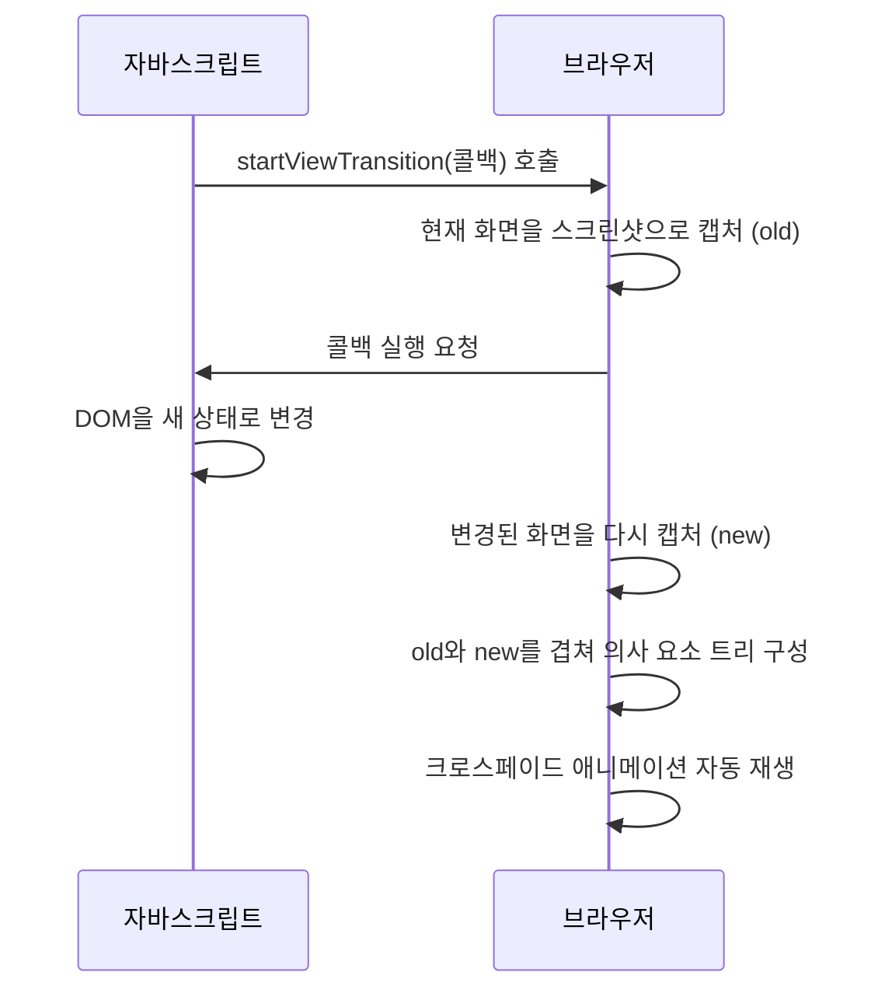
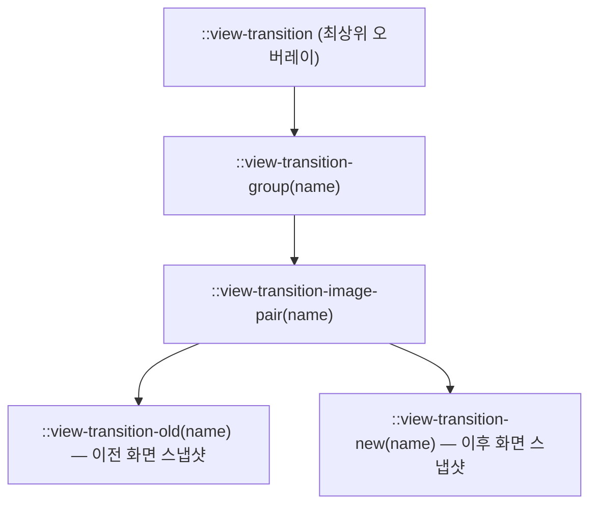

<Callout type="info">
  **이번 문서의 목표:** 이 문서를 다 읽으면 `document.startViewTransition()`이 화면을 어떻게 두 장의 스냅샷으로 찍어 자동으로 이어 붙이는지 설명하고, `view-transition-name`으로 특정 요소만 골라 자연스럽게 움직이는 전환을 만들 수 있습니다.
</Callout>

## 왜 필요한가 — 상태가 바뀌는 순간의 단절감

같은 문서(document) 안에서 목록 화면이 상세 화면으로 바뀌거나, 다크모드 토글을 눌러 색이 바뀌는 순간을 생각해 보세요. 지금까지 이 변화를 부드럽게 보이려면 개발자가 직접 다음을 손으로 짜야 했습니다.

- 사라질 요소에는 `opacity: 0`으로 서서히 지우는 `transition`을 걸고
- 나타날 요소에는 반대로 `opacity: 1`로 서서히 드러내는 `transition`을 걸고
- 두 요소의 위치·크기가 다르면 `transform`으로 시작 위치를 맞춘 뒤 애니메이션을 계산하고
- 이 모든 타이밍이 어긋나지 않도록 `requestAnimationFrame`으로 순서를 맞추는 코드까지

요소 하나만 바뀌어도 이 정도인데, 페이지 전체 레이아웃이 바뀌는 상황(목록 → 상세)에서는 사실상 별도의 애니메이션 라이브러리가 필요했습니다. **뷰 전환**(View Transitions, 화면 전환)은 이 반복 작업을 브라우저가 대신 해주는 표준 API입니다.

> **쉽게 말하면:** 뷰 전환은 브라우저에게 "바뀌기 전 화면 사진 한 장, 바뀐 뒤 화면 사진 한 장을 찍어서, 그 사이를 알아서 자연스럽게 크로스페이드(cross-fade, 겹쳐 넘기기)해줘"라고 부탁하는 것입니다.

## 정의 — `document.startViewTransition()`

**뷰 전환 API**(View Transitions API)의 핵심은 `document.startViewTransition(callback)` 메서드입니다. 이 문서에서 다루는 것은 **같은 문서**(same-document) 안에서, 즉 페이지를 이동하지 않고 자바스크립트로 DOM(Document Object Model, 문서 객체 모델 — HTML을 트리 구조로 표현한 것)을 바꾸는 경우입니다. 페이지 이동이 걸리는 **cross-document**(문서 간) 전환은 지원 상태가 크게 다르므로 다음 22편에서 따로 다룹니다.

```js
const transition = document.startViewTransition(() => {
  // 이 콜백 안에서 DOM을 원하는 대로 바꾼다
  갤러리.classList.toggle("확대됨");
});
```

콜백은 **동기적으로** DOM을 바꾸는 함수여야 합니다(비동기 작업이 필요하면 `Promise`를 반환해도 되지만, 화면이 실제로 바뀌는 시점 자체는 이 콜백이 끝난 직후입니다). `startViewTransition`을 호출하면 브라우저는 다음 순서로 움직입니다.



핵심은 브라우저가 **두 장의 사진**(old capture, new capture)을 실제로 찍는다는 점입니다. DOM을 조금씩 옮겨가며 중간 프레임을 계산하는 것이 아니라, "바뀌기 전 통째로 한 장, 바뀐 후 통째로 한 장"을 찍고 그 둘을 겹쳐 애니메이션으로 잇습니다.

## 브라우저가 실제로 만드는 것 — `::view-transition-*` 의사 요소 트리

전환이 시작되면 브라우저는 눈에 보이지 않던 **의사 요소**(pseudo-element, 실제 HTML 태그가 아니라 브라우저가 스타일링을 위해 만들어내는 가상의 요소) 트리를 문서 최상단에 임시로 만듭니다.



| 의사 요소 | 역할 |
|---|---|
| `::view-transition` | 전체 전환을 담는 최상위 컨테이너, 다른 모든 콘텐츠 위에 겹쳐진다 |
| `::view-transition-group(name)` | 이름별 전환 묶음. 위치·크기 변화(transform, width, height)의 애니메이션을 이 레벨에서 처리한다 |
| `::view-transition-image-pair(name)` | old·new 두 이미지를 겹쳐 담는 컨테이너 |
| `::view-transition-old(name)` | 바뀌기 전 스냅샷. 기본적으로 `opacity`가 1에서 0으로 사라진다 |
| `::view-transition-new(name)` | 바뀐 뒤 스냅샷. 기본적으로 `opacity`가 0에서 1로 나타난다 |

이 구조를 알면 "왜 기본 전환이 크로스페이드인가"가 자연스럽게 풀립니다. 별도 이름을 지정하지 않으면 문서 전체가 `root`라는 이름 하나로 묶여, old 스냅샷은 페이드아웃하고 new 스냅샷은 페이드인하는 것 — 이 둘이 겹쳐 보이는 것이 바로 크로스페이드입니다.

## `view-transition-name` — 특정 요소를 따로 지정하기

문서 전체를 한 덩어리로 크로스페이드하는 대신, 특정 요소만 **자기 자리를 유지한 채 부드럽게 움직이는** 전환을 만들려면 CSS 속성 `view-transition-name`으로 그 요소에 고유한 이름을 붙입니다.

```css
.카드-대표이미지 {
  view-transition-name: 상세이미지;
}
```

이 이름이 붙은 요소는 전환 전후 화면 양쪽에서 각각 자신만의 `::view-transition-group(상세이미지)`을 받습니다. 브라우저는 **같은 이름을 가진 old·new 요소의 위치와 크기 차이를 계산해**, 자동으로 `transform`과 크기 보간(interpolation, 중간값 계산) 애니메이션을 만들어 줍니다. 목록의 작은 썸네일이 상세 화면의 큰 이미지로 "매끄럽게 커지며 이동하는" 흔한 연출이 바로 이 메커니즘입니다.

<Callout type="warning">
  **자주 틀리는 점:** `view-transition-name`은 전환이 일어나는 **한 순간에 화면에 단 하나만** 존재해야 합니다. 같은 이름을 가진 요소가 두 개 이상 동시에 렌더링되면(예: 목록에 있는 카드 10개에 전부 같은 이름을 실수로 붙이면) 전환 자체가 실패하며 콘솔에 오류가 남습니다. 이름은 반드시 요소마다 고유해야 하므로, 목록처럼 반복되는 요소에는 `view-transition-name: 카드-${id}`처럼 데이터 기반으로 동적 이름을 부여합니다.
</Callout>

## 실습 — 갤러리 확대 전환 만들기

아래 실습기에서 썸네일을 클릭하면 큰 이미지로 확대되는 전환이 일어납니다. `view-transition-name`을 주석 처리하거나 이름을 다르게 바꿔가며 차이를 직접 확인해 보세요.

<CodePlayground
  template="vanilla"
  activeFile="/styles.css"
  showConsole
  label="view-transition-name으로 이미지가 자기 자리를 기억하며 확대되는 전환"
  files={{
    '/index.html': `<div class="갤러리">
  <div class="썸네일" id="사진1" style="background:#f2a154;"></div>
  <button id="토글버튼">확대/축소 전환</button>
</div>`,
    '/styles.css': `.갤러리 {
  display: flex;
  flex-direction: column;
  gap: 12px;
  align-items: flex-start;
  font-family: system-ui, sans-serif;
}

.썸네일 {
  width: 80px;
  height: 80px;
  border-radius: 8px;
  /* 이 줄을 지워보면 크로스페이드만 남고 자리 이동 애니메이션이 사라진다 */
  view-transition-name: 사진뷰;
}

.썸네일.확대됨 {
  width: 280px;
  height: 200px;
  border-radius: 16px;
}

button {
  padding: 8px 14px;
  cursor: pointer;
}`,
    '/index.js': `const 사진 = document.getElementById("사진1");
const 버튼 = document.getElementById("토글버튼");

버튼.addEventListener("click", () => {
  // 뷰 전환 API를 지원하지 않는 브라우저를 위한 폴백
  if (!document.startViewTransition) {
    console.log("이 브라우저는 View Transitions API를 지원하지 않음 — 즉시 전환");
    사진.classList.toggle("확대됨");
    return;
  }

  document.startViewTransition(() => {
    사진.classList.toggle("확대됨");
  });
});`,
  }}
/>

`view-transition-name` 한 줄만 지우고 다시 눌러보면, 이미지가 자리를 이동하며 커지는 대신 그 자리에서 크기만 즉시 바뀌는 것을 볼 수 있습니다. 이름을 부여하는 것 자체가 "이 요소는 개별적으로 추적해서 애니메이션해 달라"는 브라우저에 대한 지시입니다.

## 지원 상태와 `@supports` 폴백

`document.startViewTransition`(same-document 뷰 전환)은 2025년 10월 Baseline **최신 브라우저 기준**(newly available)에 들어갔습니다 — Firefox가 버전 144로 가장 마지막에 합류하면서 주요 3개 브라우저 엔진이 모두 갖춰졌습니다. 아직 오래된 브라우저(구형 Safari, 구형 Firefox)에는 없으므로, 실무에서는 반드시 존재 여부를 확인하고 폴백을 준비해야 합니다.

자바스크립트 쪽 폴백은 위 실습기처럼 `if (!document.startViewTransition)`으로 분기하는 것이 정석입니다. CSS 쪽에서 전환 관련 스타일(느린 지속 시간 등)만 조건부로 주고 싶다면 `@supports` 기능 쿼리를 씁니다.

```css
@supports (view-transition-name: none) {
  .썸네일 {
    view-transition-name: 사진뷰;
  }
}
```

지원하지 않는 브라우저는 이 블록 전체를 무시하므로 `view-transition-name` 선언이 아예 적용되지 않고, 클래스 토글만으로 즉시 상태가 바뀝니다. 즉 뷰 전환은 "있으면 부드럽고, 없으면 즉시 바뀔 뿐" — 기능이 없다고 화면이 깨지지 않는 전형적인 **점진적 향상**(progressive enhancement) 대상입니다.

## `prefers-reduced-motion` 존중하기

뷰 전환은 시각 효과이므로, 움직임에 불편을 느끼는 사용자를 위한 접근성 설정을 반드시 확인해야 합니다. 운영체제 설정에서 "동작 줄이기"를 켠 사용자는 `prefers-reduced-motion: reduce` 미디어 특성으로 감지할 수 있습니다.

```css
@media (prefers-reduced-motion: reduce) {
  ::view-transition-group(*),
  ::view-transition-old(*),
  ::view-transition-new(*) {
    animation-duration: 0.01ms !important;
  }
}
```

`::view-transition-group(*)`처럼 이름 자리에 `*`(전체 선택 와일드카드)를 쓰면 이름이 붙은 모든 그룹에 한 번에 적용됩니다. `prefers-reduced-motion`을 비롯한 사용자 선호 미디어 특성은 26편에서 더 깊게 다룹니다.

## 비교표 — 기존 CSS 전환 vs 뷰 전환 API

| 구분 | 기존 `transition`/`animation` | 뷰 전환 API |
|---|---|---|
| 대상 | 속성값이 바뀌는 **같은 요소** | 스냅샷 두 장(레이아웃이 완전히 달라져도 됨) |
| DOM 구조 변경 대응 | 어렵다 — 요소가 사라지고 다른 요소가 나타나면 이어줄 수 없다 | 자연스럽다 — old/new가 다른 요소여도 이름만 같으면 이어준다 |
| 코드량 | 상태마다 직접 트랜지션 값 계산 | `startViewTransition`으로 감싸기만 하면 자동 계산 |
| 위치·크기 보간 | 수동으로 시작·끝 좌표 계산 필요(FLIP 기법 등) | `view-transition-name`만 붙이면 브라우저가 자동 계산 |
| 지원 범위 | 널리 사용 가능 | 최신 브라우저 기준(2025-10 newly available) |

## 자주 틀리는 점

- **콜백을 비워두고 나중에 DOM을 바꾸는 실수**: `startViewTransition(() => {})`처럼 빈 콜백을 넘기고 다른 곳에서 DOM을 바꾸면 브라우저가 "변화 없음"으로 판단해 전환이 일어나지 않습니다. DOM 변경은 반드시 콜백 안에서 일어나야 합니다.
- **`view-transition-name`을 `position: static` 이외의 특수한 상황(예: 여러 개의 `transform` 조상)에서 기대와 다르게 계산되는 경우**: 스냅샷은 화면에 실제로 그려지는 좌표 기준이므로, 조상 요소의 변환이 얽히면 예상과 다른 크기로 보일 수 있습니다. 문제가 생기면 실제로 화면에 렌더링된 결과를 기준으로 다시 확인해야 합니다.
- **전환이 "느려서" 답답하다고 임의로 없애기보다, 기본 지속 시간(약 0.25초)을 `::view-transition-group`에 `animation-duration`을 재정의해 조절하는 편이 낫습니다.**

## 핵심 정리

- `document.startViewTransition(콜백)`은 콜백 실행 전후로 화면을 두 장 스냅샷 찍어 자동으로 크로스페이드 애니메이션을 만든다.
- 브라우저는 `::view-transition-group`/`::view-transition-image-pair`/`::view-transition-old`/`::view-transition-new` 의사 요소 트리를 임시로 만들어 전환을 표현한다.
- `view-transition-name`으로 특정 요소에 고유 이름을 붙이면, 위치·크기 변화까지 브라우저가 자동으로 보간해준다. 이름은 한 순간에 하나만 존재해야 한다.
- same-document 뷰 전환은 2025-10 Baseline 최신 브라우저 기준이다. `document.startViewTransition` 존재 여부 분기와 `@supports`로 반드시 폴백을 마련한다.
- `prefers-reduced-motion`을 확인해 동작 최소화를 원하는 사용자에게는 전환 시간을 0에 가깝게 줄인다.

## 마무리 복습

<Quiz
  questionNumber={1}
  question="document.startViewTransition의 동작 순서로 올바른 것은?"
  options={['콜백 실행 → old 스냅샷 캡처 → new 스냅샷 캡처', 'old 스냅샷 캡처 → 콜백 실행 → new 스냅샷 캡처', 'new 스냅샷 캡처 → old 스냅샷 캡처 → 콜백 실행', '콜백 실행과 스냅샷 캡처가 동시에 일어난다']}
  correctAnswer={2}
  explanation="브라우저는 콜백 실행 전 현재 화면을 old로 찍고, 콜백이 DOM을 바꾸면 그 결과를 new로 다시 찍어 두 장을 겹쳐 애니메이션을 만든다."
  optionExplanations={['콜백이 DOM을 바꾸기 전에 old 스냅샷이 먼저 필요하다', '정답 — old 캡처, DOM 변경, new 캡처 순서다', '순서가 완전히 뒤바뀌었다', '스냅샷은 각각 별도 시점에 찍히는 순차 작업이다']}
/>

<Quiz
  questionNumber={2}
  question="view-transition-name을 부여한 요소에 대한 설명으로 옳은 것은?"
  options={['같은 이름을 가진 요소가 동시에 여러 개 있어도 무방하다', '이름이 같은 old·new 요소의 위치·크기 차이를 브라우저가 자동으로 보간한다', '이 속성은 자바스크립트로만 설정할 수 있다', 'view-transition-name을 지정하면 크로스페이드 효과가 사라진다']}
  correctAnswer={2}
  explanation="같은 이름의 old·new 스냅샷은 각자 위치와 크기가 다를 수 있고, 브라우저가 그 차이를 자동으로 transform과 크기 보간 애니메이션으로 만들어준다."
  optionExplanations={['같은 이름이 동시에 두 개 이상 있으면 전환이 실패한다', '정답 — 위치·크기 자동 보간이 이 속성의 핵심 기능이다', 'CSS 속성이므로 스타일시트에서도 지정 가능하다', '이름을 지정해도 기본적으로 old는 페이드아웃, new는 페이드인한다']}
/>

<Quiz
  questionNumber={3}
  question="::view-transition-old(name)과 ::view-transition-new(name)에 대한 설명으로 옳은 것은?"
  options={['old는 바뀐 뒤 화면, new는 바뀌기 전 화면의 스냅샷이다', 'old는 바뀌기 전 화면, new는 바뀐 뒤 화면의 스냅샷이며 기본적으로 각각 페이드아웃, 페이드인한다', '두 의사 요소는 실제 HTML 태그로 문서에 영구히 추가된다', 'name을 지정하지 않으면 이 의사 요소들이 전혀 생성되지 않는다']}
  correctAnswer={2}
  explanation="old는 전환 시작 시점의 스냅샷, new는 전환 후 상태의 스냅샷이며, 기본 애니메이션은 old가 사라지고 new가 나타나는 크로스페이드다."
  optionExplanations={['old와 new의 뜻이 반대로 설명되어 있다', '정답 — 이름 그대로 이전·이후 스냅샷이며 기본은 크로스페이드다', '의사 요소이며 전환이 끝나면 사라지는 임시 요소다', 'name을 생략하면 root라는 기본 이름으로 묶여 여전히 생성된다']}
/>

<Quiz
  questionNumber={4}
  question="same-document 뷰 전환 API의 2026-09 기준 지원 상태와 그에 맞는 대응으로 알맞은 것은?"
  options={['모든 브라우저에서 오래전부터 널리 사용 가능하므로 분기 없이 바로 써도 된다', '최신 브라우저 기준(2025-10 Baseline newly available)이므로 document.startViewTransition 존재 여부를 확인하고 폴백을 준비한다', '아직 어떤 브라우저도 지원하지 않는 실험 단계이므로 실무에 쓸 수 없다', 'Chromium 계열에서만 동작하며 다른 엔진은 앞으로도 지원 계획이 없다']}
  correctAnswer={2}
  explanation="same-document 뷰 전환은 Firefox 144 합류로 2025년 10월 Baseline 최신 브라우저 기준에 들어갔다. 아직 모든 구형 브라우저를 포괄하지 못하므로 존재 여부 분기와 폴백이 필요하다."
  optionExplanations={['오래전부터 널리 사용 가능한 것은 아니며 비교적 최근에 갖춰졌다', '정답 — Baseline newly available 상태에 맞는 방어적 도입 방식이다', '이미 3대 엔진 모두 지원하는 상태다', 'Firefox도 144 버전에서 합류했으므로 Chromium 전용이 아니다']}
/>

<Quiz
  questionNumber={5}
  question="다음 중 사용자가 prefers-reduced-motion: reduce를 설정했을 때 취할 조치로 가장 알맞은 것은?"
  options={['뷰 전환 자체를 아예 호출하지 못하도록 startViewTransition을 삭제한다', '::view-transition-group 등 관련 의사 요소의 animation-duration을 매우 짧게 줄인다', '전환 이름을 view-transition-name에서 전부 제거한다', '이 설정은 뷰 전환과 무관하므로 무시해도 된다']}
  correctAnswer={2}
  explanation="애니메이션 자체를 완전히 제거할 필요 없이, 지속 시간을 거의 0에 가깝게 줄이면 상태 변화는 유지하면서 움직임만 최소화할 수 있다."
  optionExplanations={['호출 자체를 막으면 상태 전환 로직까지 영향을 받을 수 있어 과하다', '정답 — 지속 시간을 줄이는 것이 표준적인 대응이다', '이름을 제거하면 개별 요소 추적 자체가 사라져 다른 문제가 생긴다', '동작 최소화 선호는 애니메이션을 다루는 모든 API에 적용해야 한다']}
/>

<Quiz
  questionNumber={6}
  question="startViewTransition(콜백)의 콜백 함수에 대한 설명으로 옳은 것은?"
  options={['콜백은 반드시 비어 있어야 하고 DOM 변경은 다른 곳에서 해야 한다', '콜백 안에서 DOM을 실제로 변경해야 하며, 그래야 브라우저가 변화를 감지해 전환을 만든다', '콜백은 스타일시트 문자열만 반환할 수 있다', '콜백이 실행되는 시점은 old 스냅샷을 찍기 전이다']}
  correctAnswer={2}
  explanation="브라우저는 콜백이 실제로 DOM을 바꾸는 것을 전제로 old와 new 두 스냅샷의 차이를 계산한다. 콜백이 비어 있으면 변화가 없어 전환도 일어나지 않는다."
  optionExplanations={['콜백을 비워두면 전환이 일어나지 않는다', '정답 — DOM 변경이 콜백 안에서 일어나야 한다', '콜백은 DOM 조작 함수이지 문자열 반환용이 아니다', 'old 스냅샷은 콜백 실행 이전, 즉 콜백보다 먼저 찍힌다']}
/>

<Quiz
  questionNumber={7}
  question="뷰 전환 API를 지원하지 않는 브라우저에 대한 안전한 대응으로 가장 알맞은 것은?"
  options={['document.startViewTransition이 없으면 즉시 DOM만 변경하고 애니메이션 없이 넘어간다', '지원하지 않는 브라우저는 별도 애니메이션 라이브러리를 강제로 로드해야 한다', '지원 여부와 무관하게 항상 startViewTransition을 호출해야 하며 실패하면 에러를 무시한다', '지원하지 않는 브라우저에서는 해당 UI 자체를 숨긴다']}
  correctAnswer={1}
  explanation="존재 여부를 확인해 없으면 클래스 토글 등 DOM 변경만 즉시 수행하는 것이 점진적 향상의 핵심이다. 기능이 없다고 화면이 깨지거나 UI가 사라지면 안 된다."
  optionExplanations={['정답 — 즉시 상태만 바뀌고 애니메이션만 생략되는 것이 올바른 폴백이다', '별도 라이브러리는 과한 대응이며 이 과목 범위를 벗어난다', '존재하지 않는 메서드를 호출하면 런타임 오류가 발생한다', 'UI 자체는 전환 애니메이션과 무관하게 항상 제공되어야 한다']}
/>

## 참고 자료

- [MDN - View Transitions API](https://developer.mozilla.org/en-US/docs/Web/API/View_Transitions_API)
