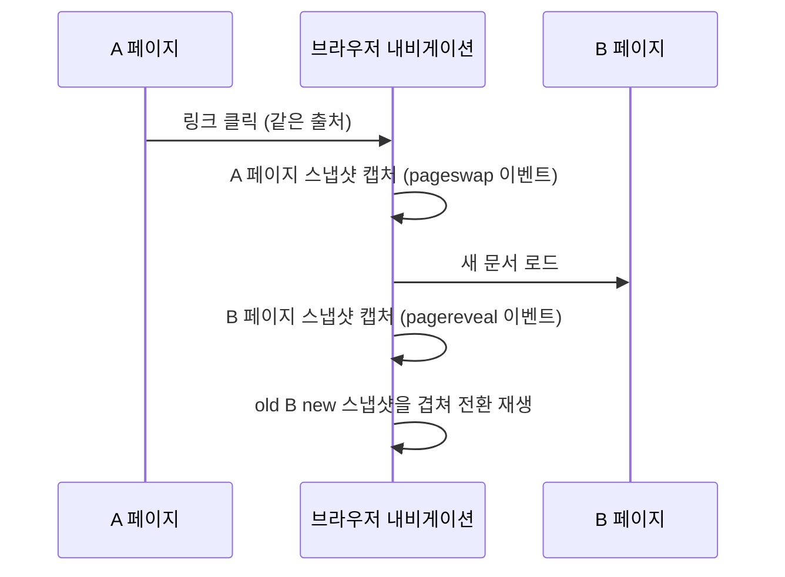

<Callout type="info">
  **이번 문서의 목표:** 이 문서를 다 읽으면 `@view-transition` 규칙으로 여러 페이지(document) 사이 이동에도 전환을 걸 수 있고, 이 기능이 아직 크로미움(Chromium) 계열에 치우친 지원 현실을 알고 안전하게 도입하는 폴백을 설계할 수 있습니다.
</Callout>

## 왜 필요한가 — SPA가 아니어도 부드러운 전환을

21편에서 다룬 `document.startViewTransition()`은 한 문서(document) 안에서 자바스크립트로 DOM을 바꿀 때만 씁니다. 즉 **SPA**(Single Page Application, 단일 페이지 애플리케이션 — 페이지 이동 없이 자바스크립트가 화면을 통째로 바꿔치는 방식)에서만 쓸 수 있는 방법입니다.

그런데 전통적인 **MPA**(Multi Page Application, 다중 페이지 애플리케이션 — 링크를 클릭하면 서버가 완전히 새로운 HTML 문서를 내려주는 방식)는 어떨까요. 지금까지는 링크를 클릭하면 화면이 하얗게 깜빡이며 완전히 새 페이지로 전환됐습니다. 이 순간에도 부드러운 전환을 걸고 싶다는 요구에서 나온 것이 **cross-document 뷰 전환**(문서 간 뷰 전환)입니다.

> **쉽게 말하면:** 21편이 "한 방 안에서 가구를 재배치할 때 부드럽게 보여주는 것"이라면, 이 편은 "옆방으로 걸어 들어갈 때도 문턱이 안 보이게 이어 붙이는 것"입니다.

## `@view-transition` 규칙 — 문서 간 전환 켜기

cross-document 뷰 전환은 자바스크립트 호출이 아니라 **CSS 앳룰**(at-rule, `@`으로 시작하는 CSS 규칙)로 켭니다. 전환을 걸고 싶은 두 페이지 **양쪽 모두**의 스타일시트에 다음을 넣습니다.

```css
@view-transition {
  navigation: auto;
}
```

이 규칙이 있는 페이지로 **같은 출처**(same-origin, 같은 오리진) 안에서 이동하면, 브라우저가 이동 전 페이지의 스냅샷과 이동 후 페이지의 스냅샷을 찍어 21편과 동일한 `::view-transition-*` 의사 요소 트리로 크로스페이드를 만듭니다. `view-transition-name`도 그대로 작동합니다 — 목록 페이지의 썸네일과 상세 페이지의 대표 이미지에 **같은 이름**을 붙이면, 페이지가 완전히 바뀌었는데도 이미지 하나가 자리를 옮기며 커지는 것처럼 보입니다.



## 지원 현실 — "제한적"이라는 말의 정확한 의미

이 기능은 2026년 9월 시점 MDN 브라우저 호환성 데이터 기준으로 **Limited availability(제한적 가용성) — Baseline 아님**으로 분류됩니다. 실무에서 반드시 알아야 할 구체적 내용은 다음과 같습니다.

| 브라우저 | 동작 |
|---|---|
| Chrome·Edge 등 크로미움 계열 | `@view-transition` 규칙을 인식해 실제로 애니메이션 전환을 재생한다 |
| Firefox | 규칙을 인식하지 못한다. 무시하고 평소처럼 즉시 페이지를 바꾼다 |
| Safari | 규칙을 인식하지 못한다. 무시하고 평소처럼 즉시 페이지를 바꾼다 |

<Callout type="warning">
  **여기서 "제한적"은 same-document 뷰 전환의 "최신 브라우저 기준"과는 다른 등급입니다.** same-document는 3대 엔진이 모두 갖췄지만, cross-document는 아직 크로미움 계열 전용이며 Firefox·Safari가 언제 합류할지 공식적으로 확정되지 않았습니다. "MPA 페이지 전환 애니메이션은 아직 크로미움 전용 기능"이라는 문장으로 정확히 표현해야 합니다.
</Callout>

## 이 기능이 왜 안전하게 도입 가능한가 — 자체 폴백 내장

다행히 이 기능은 설계 자체가 **점진적 향상**을 전제로 만들어졌습니다. `@view-transition` 규칙을 이해하지 못하는 브라우저는 이 CSS 블록 전체를 조용히 무시합니다. 그 결과는 "애니메이션이 없는, 지금까지와 똑같은 즉시 페이지 전환"(스냅 전환, snap transition)일 뿐, 오류가 나거나 페이지 이동 자체가 막히지 않습니다.

즉 `@supports`로 별도 분기를 짜지 않아도 **최악의 경우가 지금까지의 기본 동작과 같습니다.** 그럼에도 다음 세 가지는 신경 써야 합니다.

1. **`@view-transition` 규칙은 이동하는 두 페이지 모두**에 있어야 전환이 걸립니다. 한쪽에만 있으면 전환이 일어나지 않습니다(오류는 없습니다).
2. 같은 출처 안에서의 이동만 대상입니다. 다른 도메인으로 나가는 링크는 이 기능과 무관합니다.
3. 크로미움에서만 화면이 부드럽게 이어지고, Firefox·Safari 사용자는 지금까지와 동일한 경험을 한다는 사실을 기획·디자인 단계에서 미리 공유해야 합니다 — "모든 사용자가 같은 애니메이션을 본다"고 가정하고 설계하면 안 됩니다.

## `pageswap`·`pagereveal` 이벤트로 개별 제어하기

기본 전환만으로 부족하면, 이동 직전과 직후에 발생하는 이벤트로 세부 동작을 조정할 수 있습니다.

```js
window.addEventListener("pageswap", (event) => {
  // 떠나는 페이지: 이동 대상 URL에 따라 전환을 건너뛸 수도 있다
  if (event.viewTransition && location.pathname.startsWith("/admin")) {
    event.viewTransition.skipTransition();
  }
});

window.addEventListener("pagereveal", (event) => {
  // 도착한 페이지: 전환이 걸려 있었는지 확인해 후처리
  if (event.viewTransition) {
    console.log("cross-document 뷰 전환으로 진입했음");
  }
});
```

`event.viewTransition`은 크로미움처럼 실제로 뷰 전환을 지원하는 브라우저에서만 값이 존재합니다. 이 필드가 없는 브라우저에서는 두 이벤트 자체는 발생하되(내비게이션 타이밍 이벤트이므로) 전환 제어 객체는 얻을 수 없다는 점에 주의합니다.

## `:active-view-transition` — 전환이 진행 중일 때만 스타일 주기

전환이 재생되는 동안에만 특정 요소를 숨기거나 다르게 보이고 싶을 때, 문서 루트(`html` 요소)에 매칭되는 의사 클래스(pseudo-class) `:active-view-transition`을 씁니다.

```css
html:active-view-transition .끌어놓기-안내 {
  visibility: hidden;
}
```

이 의사 클래스는 same-document·cross-document 뷰 전환 모두에서, 전환이 시작되어 끝날 때까지의 구간 동안만 참(true)이 됩니다. 전환 중에만 보이면 어색한 UI 요소(드래그 핸들, 툴팁 등)를 잠깐 숨기는 용도로 유용합니다.

## 실습 — MPA 전환을 흉내 낸 폴백 설계 확인

실제 페이지 이동은 이 실습기 환경에서 재현하기 어려우므로, `@view-transition` 규칙이 있고 없고에 따라 어떤 CSS가 적용되는지 `@supports`로 눈으로 확인해봅니다.

<CodePlayground
  template="static"
  activeFile="/styles.css"
  label="cross-document 뷰 전환 지원 여부에 따른 안내 문구 전환"
  files={{
    '/index.html': `<link rel="stylesheet" href="styles.css">
<div class="안내상자">
  <p class="기본안내">이 브라우저는 아직 문서 간 뷰 전환을 지원하지 않습니다 (Firefox, Safari 등) — 페이지는 즉시 바뀝니다.</p>
  <p class="지원안내">이 브라우저는 문서 간 뷰 전환을 지원합니다 (크로미움 계열) — 페이지 이동 시 부드럽게 전환됩니다.</p>
</div>`,
    '/styles.css': `.기본안내 { color: #b45309; font-family: system-ui, sans-serif; }
.지원안내 { display: none; color: #15803d; font-family: system-ui, sans-serif; }

/* view-transition-name을 지원한다는 것은 뷰 전환 관련 CSS 자체를
   이해한다는 뜻이므로, 이 값을 기능 감지 조건으로 쓸 수 있다 */
@supports (view-transition-name: none) {
  .기본안내 { display: none; }
  .지원안내 { display: block; }
}`,
  }}
/>

지금 이 문서를 크로미움 브라우저로 열었다면 초록색 문구가, 그렇지 않다면 주황색 문구가 보일 것입니다. 이렇게 `@supports`로 "이 기능이 있는 브라우저에서만 보여줄 안내"를 분기하는 것이 지원이 갈리는 기능을 다룰 때의 공통 절차입니다.

## 비교표 — same-document vs cross-document 뷰 전환

| 구분 | same-document (21편) | cross-document (이번 편) |
|---|---|---|
| 켜는 방법 | 자바스크립트 `document.startViewTransition()` 호출 | CSS `@view-transition { navigation: auto; }` 규칙 |
| 적용 범위 | 자바스크립트로 DOM을 바꾸는 SPA 방식 | 링크 클릭 등으로 문서 자체가 바뀌는 MPA 방식 |
| 필요 조건 | 스크립트 실행 지점 하나 | 이동 전·후 **두 문서 모두**에 규칙 필요, 같은 출처 |
| 2026-09 지원 상태 | 최신 브라우저 기준(2025-10 newly available) | 제한적(크로미움 계열 중심, Baseline 아님) |
| 미지원 시 동작 | `startViewTransition`이 없으므로 직접 분기 필요 | 규칙을 무시하고 기존과 동일하게 즉시 전환(자동 폴백) |

## 자주 틀리는 점

- **한쪽 페이지에만 `@view-transition`을 넣고 왜 안 되는지 헤매는 경우**: 이동 전·후 두 문서 모두 규칙이 있어야 합니다.
- **"제한적 지원"을 "곧 없어질 기능"으로 오해**: 표준 자체는 W3C Working Draft로 살아있고 크로미움이 이미 실무 배포 중입니다. "아직 모든 브라우저가 갖추지 못했을 뿐"이지 폐기된 기능이 아닙니다.
- **`view-transition-name`을 다른 도메인 간 이동에도 걸리길 기대하는 경우**: cross-document 뷰 전환은 같은 출처 내 이동만 대상입니다. 오리진(origin) 개념은 `javascript/web_apis` 과목에서 자세히 다룹니다.

## 핵심 정리

- cross-document 뷰 전환은 자바스크립트가 아니라 CSS `@view-transition { navigation: auto; }` 규칙으로 켜며, 이동하는 두 페이지 모두에 있어야 한다.
- 2026-09 기준 이 기능은 제한적(Limited availability, Baseline 아님)이며, 크로미움 계열만 실제로 애니메이션을 재생하고 Firefox·Safari는 규칙을 무시해 기존처럼 즉시 전환된다.
- 미지원 브라우저에서도 규칙이 조용히 무시될 뿐 오류가 없으므로, 이 기능 자체가 이미 안전한 점진적 향상 구조를 갖고 있다.
- `pageswap`/`pagereveal` 이벤트로 특정 상황에서 전환을 건너뛰거나(`skipTransition()`) 후처리를 걸 수 있다.
- `:active-view-transition`은 전환이 진행되는 동안에만 참이 되는 의사 클래스로, 전환 중 특정 요소를 숨기는 데 쓴다.

## 마무리 복습

<Quiz
  questionNumber={1}
  question="cross-document 뷰 전환을 켜는 방법으로 옳은 것은?"
  options={['자바스크립트에서 document.startViewTransition을 호출한다', 'CSS에 @view-transition { navigation: auto; } 규칙을 추가한다', 'HTML 태그에 data-view-transition 속성을 추가한다', 'HTTP 응답 헤더에 View-Transition 값을 설정한다']}
  correctAnswer={2}
  explanation="cross-document 뷰 전환은 자바스크립트 호출이 아니라 CSS 앳룰인 @view-transition 규칙으로 켠다. same-document 방식과 켜는 방법 자체가 다르다."
  optionExplanations={['이 메서드는 same-document 뷰 전환에서 쓰는 방법이다', '정답 — CSS 규칙으로 문서 간 전환을 활성화한다', '이런 속성으로 뷰 전환을 켜는 방법은 존재하지 않는다', '뷰 전환은 CSS 규칙으로 제어하며 HTTP 헤더와는 무관하다']}
/>

<Quiz
  questionNumber={2}
  question="2026-09 기준 cross-document 뷰 전환의 지원 상태로 옳은 것은?"
  options={['모든 주요 브라우저에서 Baseline 널리 사용 가능이다', '크로미움 계열만 실제로 애니메이션을 재생하는 제한적 지원 상태다', '아직 어떤 브라우저도 지원하지 않는다', 'Firefox와 Safari가 먼저 지원하고 크로미움이 뒤따르는 중이다']}
  correctAnswer={2}
  explanation="MDN 확인 결과 Limited availability(Baseline 아님)이며, 크로미움 계열만 실제 전환 애니메이션을 재생하고 Firefox와 Safari는 규칙을 무시한다."
  optionExplanations={['아직 모든 브라우저가 갖춘 상태가 아니다', '정답 — 크로미움 중심의 제한적 지원 상태다', '크로미움 계열은 이미 실무에서 지원 중이다', '지원 순서가 반대로 설명되어 있다']}
/>

<Quiz
  questionNumber={3}
  question="A 페이지에만 @view-transition 규칙이 있고 이동 대상인 B 페이지에는 없을 때 벌어지는 일은?"
  options={['콘솔에 오류가 출력되며 페이지 이동이 취소된다', '전환 애니메이션 없이 기존처럼 즉시 페이지가 바뀐다', 'A 페이지의 스타일이 B 페이지에도 강제로 적용된다', 'B 페이지가 자동으로 @view-transition 규칙을 상속받는다']}
  correctAnswer={2}
  explanation="cross-document 뷰 전환은 이동 전·후 두 문서 모두에 규칙이 있어야 성립한다. 한쪽에만 있으면 오류 없이 그냥 전환 효과만 빠진 채 평소처럼 이동한다."
  optionExplanations={['규칙 부재는 오류가 아니라 조용한 무시로 처리된다', '정답 — 한쪽만 있으면 전환 없이 정상 이동한다', '스타일시트는 각 문서마다 독립적으로 적용된다', '문서 간에 CSS 규칙이 자동으로 상속되는 메커니즘은 없다']}
/>

<Quiz
  questionNumber={4}
  question=":active-view-transition 의사 클래스에 대한 설명으로 옳은 것은?"
  options={['뷰 전환이 진행 중인 동안에만 참이 되는 의사 클래스다', '특정 요소에 view-transition-name이 붙어 있을 때 항상 참이다', 'cross-document 전환에서만 사용할 수 있고 same-document에는 쓸 수 없다', '사용자가 마우스를 올린 요소에만 적용된다']}
  correctAnswer={1}
  explanation="이 의사 클래스는 html 요소에 매칭되며, 뷰 전환이 시작되어 끝날 때까지의 구간에서만 참이 되어 전환 중 특정 요소를 숨기는 등의 용도로 쓴다."
  optionExplanations={['정답 — 전환이 진행되는 동안만 참이 된다', 'view-transition-name 존재 여부와는 무관한 별개의 상태다', 'same-document 뷰 전환에서도 동일하게 사용할 수 있다', 'hover 상태와는 관련이 없다']}
/>

<Quiz
  questionNumber={5}
  question="pageswap 이벤트 핸들러 안에서 event.viewTransition.skipTransition()을 호출하는 목적으로 가장 알맞은 것은?"
  options={['페이지 이동 자체를 취소하기 위해', '특정 조건에서 전환 애니메이션만 건너뛰고 즉시 이동하도록 하기 위해', 'view-transition-name을 강제로 재설정하기 위해', '이전 페이지의 스냅샷을 다시 캡처하기 위해']}
  correctAnswer={2}
  explanation="skipTransition은 전환 애니메이션만 건너뛸 뿐 이동 자체는 그대로 진행되므로, 특정 경로로 이동할 때는 애니메이션 없이 즉시 전환하고 싶을 때 쓴다."
  optionExplanations={['이동 자체를 막는 것이 아니라 애니메이션만 생략하는 것이다', '정답 — 애니메이션을 건너뛰고 즉시 전환하는 용도다', '이름 재설정과는 관련 없는 메서드다', '스냅샷 재캡처 기능이 아니다']}
/>

<Quiz
  questionNumber={6}
  question="cross-document 뷰 전환에서 미지원 브라우저에 대한 대응 전략으로 가장 알맞은 것은?"
  options={['별도의 @supports 폴백을 반드시 작성해야 하며, 없으면 페이지 이동 자체가 깨진다', '기능 자체가 규칙을 조용히 무시하도록 설계되어 있어 최악의 경우도 기존과 동일한 즉시 전환이다', '미지원 브라우저에서는 링크 클릭을 자바스크립트로 막아야 한다', '미지원 브라우저 사용자에게는 별도 안내 페이지로 강제 이동시켜야 한다']}
  correctAnswer={2}
  explanation="@view-transition 규칙을 이해하지 못하는 브라우저는 그 규칙을 조용히 무시하므로 애니메이션만 없을 뿐 페이지 이동 자체는 정상 동작한다. 이미 안전한 점진적 향상 구조다."
  optionExplanations={['별도 폴백이 필수는 아니며 규칙 자체가 이미 안전하게 무시된다', '정답 — 최악의 경우도 기존과 같은 즉시 전환일 뿐이다', '이런 차단은 불필요하고 사용성을 해친다', '이런 강제 이동은 불필요한 과잉 대응이다']}
/>

## 참고 자료

- [MDN - View Transitions API](https://developer.mozilla.org/en-US/docs/Web/API/View_Transitions_API)
