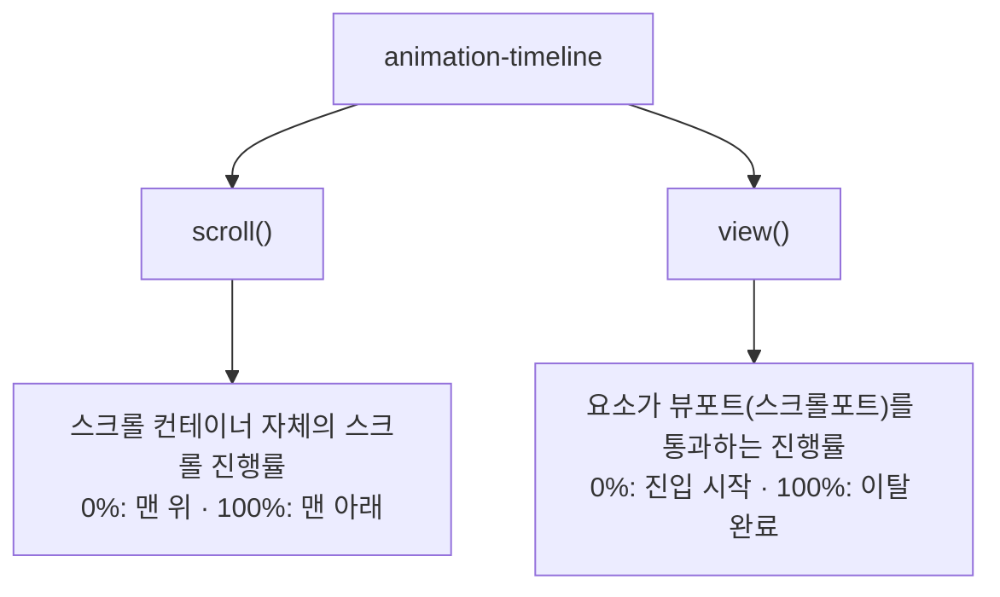

<Callout type="info">
  **이번 문서의 목표:** 이 문서를 다 읽으면 `animation-timeline`의 `scroll()`과 `view()`가 시간 대신 스크롤 위치를 애니메이션의 진행 기준으로 삼는 원리를 설명하고, `animation-range`로 구간을 지정하며, 이 기능의 제한적 지원 현실에 맞는 `@supports` 폴백을 만들 수 있습니다.
</Callout>

## 왜 필요한가 — "스크롤에 맞춰 움직이는" 것을 만드는 옛 방법의 문제

스크롤바를 내릴 때 진행 바(progress bar)가 채워지거나, 이미지가 위로 올라오며 페이드인되는 효과를 지금까지는 이렇게 만들었습니다.

```js
window.addEventListener("scroll", () => {
  const 진행률 = window.scrollY / (document.body.scrollHeight - window.innerHeight);
  진행바.style.transform = `scaleX(${진행률})`;
});
```

이 방식에는 근본적인 문제가 있습니다. `scroll` 이벤트는 **메인 스레드**(main thread, 자바스크립트가 실행되는 하나뿐인 실행 자리 — 자세한 개념은 `javascript/web_apis` 과목 참조)에서 처리됩니다. 스크롤이 일어날 때마다 자바스크립트가 깨어나 스타일을 계산해야 하므로, 메인 스레드가 다른 일로 바쁘면 애니메이션이 뚝뚝 끊깁니다(프레임 드롭). 스크롤은 초당 수십 번씩 발생할 수 있는 고빈도 이벤트라, `requestAnimationFrame`으로 감싸는 등 최적화를 직접 신경 써야 했습니다.

**스크롤 연동 애니메이션**(scroll-driven animations)은 이 계산 자체를 CSS 엔진에 넘겨, 브라우저가 컴포지터(compositor, 화면을 합성하는 별도 처리 단계) 수준에서 애니메이션을 진행시킬 수 있게 하는 기능입니다.

> **쉽게 말하면:** 지금까지 애니메이션의 "시계"는 항상 시간(초)이었습니다. 스크롤 연동 애니메이션은 그 시계를 "스크롤로 얼마나 내려왔는가"로 바꿔치는 것입니다.

## 정의 — `animation-timeline`이 시계를 바꾼다

일반적인 CSS 애니메이션은 `animation-timeline: auto`가 기본값이며, 이는 "문서의 시간이 흐르는 만큼 진행하라"는 뜻입니다. 여기에 다른 값을 주면 진행 기준 자체가 바뀝니다.

```css
.진행바 {
  animation: 채우기 linear;
  animation-timeline: scroll(root);
}

@keyframes 채우기 {
  from { transform: scaleX(0); }
  to { transform: scaleX(1); }
}
```

`animation-duration`을 아예 쓰지 않아도 됩니다 — 시간이 아니라 스크롤 위치가 진행률을 결정하기 때문입니다. 이 예시에서 `채우기` 애니메이션은 문서 전체(root)가 0퍼센트 스크롤됐을 때 `scaleX(0)`, 100퍼센트 스크롤됐을 때 `scaleX(1)`이 되도록 브라우저가 알아서 중간값을 계산합니다.

## 두 가지 타임라인 — `scroll()`과 `view()`

스크롤 연동 애니메이션에는 근본적으로 다른 두 가지 진행 기준이 있습니다.



| 구분 | `scroll()` | `view()` |
|---|---|---|
| 진행 기준 | 스크롤 컨테이너가 얼마나 스크롤됐는가 | **요소 자신**이 뷰포트(화면에 보이는 영역)를 지나가는 정도 |
| 대표 용도 | 페이지 최상단 진행 바, 사이드 목차 하이라이트 | 화면에 들어오는 카드가 서서히 나타나는 연출 |
| 값이 0퍼센트인 시점 | 스크롤 컨테이너가 맨 위(또는 지정한 축의 시작)일 때 | 요소가 뷰포트에 막 보이기 시작할 때 |
| 값이 100퍼센트인 시점 | 스크롤 컨테이너가 맨 아래일 때 | 요소가 뷰포트를 완전히 지나갈 때 |

`scroll(<scroller> <axis>)` 형태로 인자를 줄 수 있습니다. `<scroller>`는 `nearest`(가장 가까운 스크롤 가능 조상, 기본값), `root`(문서 전체), `self`(요소 자기 자신이 스크롤 컨테이너일 때) 중 하나이고, `<axis>`는 `block`/`inline`(논리적 축, 12편 참조) 또는 `x`/`y`(물리적 축)입니다. `view()`는 `view(<axis> <inset>)` 형태로, `<inset>`은 뷰포트 경계를 안쪽으로 당겨 "일찍 시작하거나 일찍 끝나게" 조절합니다.

## `animation-range` — 구간을 정밀하게 지정하기

기본값은 컨테이너나 뷰포트의 처음부터 끝까지를 0~100퍼센트로 씁니다. 하지만 애니메이션이 "화면에 반쯤 들어왔을 때 시작해서, 완전히 지나가기 전에 끝나기"를 원한다면 `animation-range`로 구간을 좁힙니다.

```css
.카드 {
  animation: 올라오기 linear;
  animation-timeline: view();
  animation-range: entry 0% cover 40%;
}
```

`view()` 타임라인에는 다음과 같은 이름 붙은 구간이 있습니다.

| 구간 이름 | 의미 |
|---|---|
| `cover` | 요소가 뷰포트에 조금이라도 걸치는 전체 구간(0%: 진입 시작, 100%: 이탈 완료) |
| `contain` | 요소 전체가 뷰포트 안에 완전히 들어와 있는 구간 |
| `entry` | 요소가 뷰포트로 들어오는 중인 구간 |
| `exit` | 요소가 뷰포트에서 나가는 중인 구간 |
| `entry-crossing` | 요소가 뷰포트 시작 경계를 지나는 구간 |
| `exit-crossing` | 요소가 뷰포트 끝 경계를 지나는 구간 |

`entry 0% cover 40%`는 "요소가 뷰포트에 들어오기 시작하는 순간부터, 전체 통과 구간의 40퍼센트 지점까지"라는 뜻입니다. 이 구간 지정 덕분에 "카드가 화면에 나타나자마자 바로 애니메이션을 끝내는" 것처럼, 시간이 아니라 **위치**로 애니메이션 타이밍을 설계할 수 있습니다.

## 실습 — 스크롤에 맞춰 진행 바와 카드 등장 애니메이션 만들기

아래 실습기는 페이지 스크롤에 맞춰 상단 진행 바가 채워지고, 카드들이 화면에 들어오며 나타나도록 만든 예시입니다. `activeFile`을 열어 `animation-range` 값을 바꿔보며 등장 타이밍이 어떻게 달라지는지 확인해 보세요(지원 브라우저에서만 애니메이션이 보입니다).

<CodePlayground
  template="static"
  activeFile="/styles.css"
  label="scroll()로 진행 바, view()로 카드 등장 애니메이션"
  files={{
    '/index.html': `<link rel="stylesheet" href="styles.css">
<div class="진행바"></div>
<div class="본문">
  <p>아래로 스크롤하면 카드가 순서대로 나타납니다 (지원 브라우저에서만 애니메이션).</p>
  <div class="카드">카드 1</div>
  <div class="카드">카드 2</div>
  <div class="카드">카드 3</div>
</div>`,
    '/styles.css': `.진행바 {
  position: fixed;
  top: 0; left: 0;
  height: 6px;
  width: 100%;
  background: #3b82f6;
  transform-origin: left;
  transform: scaleX(0);

  animation: 채우기 linear;
  animation-timeline: scroll(root);
}

@keyframes 채우기 {
  from { transform: scaleX(0); }
  to { transform: scaleX(1); }
}

.본문 { font-family: system-ui, sans-serif; padding: 40px 20px; }

.카드 {
  margin: 60vh 0;
  padding: 24px;
  background: #eef2ff;
  border-radius: 12px;
  opacity: 0;
  transform: translateY(40px);

  animation: 올라오기 linear;
  animation-timeline: view();
  animation-range: entry 0% cover 40%;
}

@keyframes 올라오기 {
  from { opacity: 0; transform: translateY(40px); }
  to   { opacity: 1; transform: translateY(0); }
}

/* animation-timeline을 이해하지 못하는 브라우저는 애니메이션 진행 기준이
   없어 시작 프레임(opacity: 0)에 멈추므로, 기능 감지로 최소한 콘텐츠는 보이게 한다 */
@supports not (animation-timeline: view()) {
  .카드 { opacity: 1; transform: none; animation: none; }
}`,
  }}
/>

`animation-range`의 `cover 40%`를 `cover 100%`로 바꾸면 카드가 화면을 완전히 지나갈 때까지 계속 움직이도록 늘어납니다. 숫자를 바꿔가며 "구간"이라는 개념이 실제로 무엇을 뜻하는지 눈으로 확인해 보세요.

## 지원 현실과 `@supports` 폴백

`animation-timeline`의 `scroll()`/`view()`는 2026년 9월 시점 MDN 확인 결과 **Limited availability(제한적 가용성) — Baseline 아님**입니다.

<Callout type="warning">
  **주의:** 조사 과정에서 "스크롤 연동 애니메이션이 이미 모든 브라우저에서 Baseline"이라는 취지의 블로그 글을 발견했지만, MDN 브라우저 호환성 표를 직접 대조한 결과 **틀린 정보**였습니다. 실제로는 크로미움 계열이 먼저 구현했고, Safari와 Firefox는 지원 시점이 더 최근이거나 세부 기능(`view()`의 `inset`, 이름 붙은 타임라인 등)이 부분적입니다. 이 과목을 포함해 어떤 문서를 보든 지원 상태는 최종적으로 MDN이나 webstatus.dev의 표를 직접 확인하는 습관을 들이세요.
</Callout>

가장 중요한 실무 원칙은 **위 실습기에 이미 적용한 것**입니다. `opacity: 0`으로 시작하는 진입 애니메이션에 `animation-timeline`을 걸면, 이 속성을 모르는 브라우저는 애니메이션의 "0퍼센트 프레임"에서 멈춰버려 요소가 **영원히 보이지 않는 상태**로 남습니다. 이것이 스크롤 연동 애니메이션에서 가장 위험한 실패 패턴입니다.

```css
@supports not (animation-timeline: view()) {
  .카드 {
    opacity: 1;
    transform: none;
    animation: none;
  }
}
```

`@supports not (...)`은 괄호 안 조건을 **지원하지 않을 때만** 참이 되는 부정 기능 쿼리입니다. 이 블록으로 "이 기능이 없으면 최종 상태를 그냥 기본값으로 보여준다"는 안전망을 반드시 함께 작성해야 합니다. 더 정교한 폴백이 필요하면(예: Firefox·Safari 사용자에게도 등장 애니메이션 자체는 주고 싶다면) `IntersectionObserver`(교차 관찰자, 요소가 뷰포트에 들어오고 나가는 것을 감지하는 Web API — `javascript/web_apis` 과목 참조)로 클래스를 토글하는 자바스크립트 대체 구현을 별도로 준비합니다.

## 명명된 타임라인 — 다른 요소의 스크롤을 기준 삼기

스크롤되는 컨테이너와 애니메이션이 걸리는 요소가 다를 때는 이름 붙은 타임라인을 씁니다.

```css
.스크롤컨테이너 {
  scroll-timeline-name: --갤러리진행;
  scroll-timeline-axis: x;
}

.진행표시점 {
  animation: 점켜지기 linear;
  animation-timeline: --갤러리진행;
}
```

`scroll-timeline-name`으로 스크롤 컨테이너에 커스텀 속성 형태의 이름(`--`로 시작)을 붙이고, 애니메이션을 걸 다른 요소의 `animation-timeline`에서 그 이름을 참조합니다. 가로 스크롤 갤러리 옆에 있는 진행 표시점을 갤러리의 스크롤에 맞춰 움직이는 등의 구성에 씁니다.

## 비교표 — 시간 기반 애니메이션 vs 스크롤 연동 애니메이션

| 구분 | 시간 기반(`animation-timeline: auto`) | 스크롤 연동(`scroll()`/`view()`) |
|---|---|---|
| 진행 기준 | 경과 시간(`animation-duration`) | 스크롤 위치 또는 요소의 뷰포트 통과 정도 |
| 재생·일시정지 | 자동 재생, 사용자가 멈출 수 없음 | 스크롤을 멈추면 애니메이션도 멈춘다(사용자가 직접 스크러빙) |
| 메인 스레드 부하 | `requestAnimationFrame` 등으로 직접 최적화해야 하는 경우 있음 | 브라우저 컴포지터가 처리, 메인 스레드 관여 최소화 |
| 2026-09 지원 상태 | 널리 사용 가능 | 제한적(Limited availability, 크로미움 중심) |
| 실무 도입 시 | 바로 사용 가능 | `@supports not`으로 폴백 필수, 특히 진입 애니메이션의 시작 상태 노출 방지 |

## 자주 틀리는 점

- **`animation-duration`을 함께 지정하면 되는 줄 아는 경우**: `animation-timeline`이 스크롤 기반이면 시간 길이는 무의미합니다. 진행률은 오직 스크롤 위치가 결정합니다.
- **`scroll()`과 `view()`를 같은 것으로 혼동**: `scroll()`은 "컨테이너가 얼마나 스크롤됐는가", `view()`는 "이 요소 자신이 화면을 지나가는 정도"로 기준이 요소 자신인지 컨테이너인지가 다릅니다.
- **폴백 없이 `opacity: 0` 시작 애니메이션을 걸어 미지원 브라우저에서 콘텐츠가 영영 사라지는 사고**: 반드시 `@supports not`으로 최종 상태를 기본값으로 되돌리는 규칙을 함께 씁니다.

## 핵심 정리

- `animation-timeline`은 애니메이션의 진행 기준(시계)을 시간에서 스크롤 위치로 바꾼다. `scroll()`은 컨테이너의 스크롤 진행률, `view()`는 요소 자신이 뷰포트를 통과하는 진행률이다.
- `animation-range`로 `entry`/`exit`/`cover`/`contain` 등의 구간을 지정해 애니메이션이 시작·끝나는 지점을 정밀하게 제어한다.
- 이 기능은 2026-09 기준 Limited availability(제한적, Baseline 아님)다. "이미 전 브라우저 Baseline"이라는 일부 자료는 오검증된 틀린 정보이므로 MDN·webstatus.dev로 직접 재확인해야 한다.
- 미지원 브라우저에서 진입 애니메이션의 시작 프레임(`opacity: 0` 등)에 요소가 갇히지 않도록 `@supports not (animation-timeline: view())`으로 최종 상태를 되돌리는 폴백을 반드시 함께 작성한다.
- `scroll-timeline-name`/`view-timeline-name`으로 이름 붙은 타임라인을 만들면, 스크롤되는 요소와 애니메이션이 걸리는 요소가 서로 달라도 연결할 수 있다.

## 마무리 복습

<Quiz
  questionNumber={1}
  question="scroll()과 view() 타임라인의 차이로 옳은 것은?"
  options={['scroll()은 요소 자신의 뷰포트 통과 정도, view()는 컨테이너의 스크롤 진행률이다', 'scroll()은 스크롤 컨테이너의 진행률, view()는 요소 자신이 뷰포트를 지나가는 정도다', '두 함수는 완전히 동일하며 이름만 다르다', 'scroll()은 세로 스크롤에만, view()는 가로 스크롤에만 쓸 수 있다']}
  correctAnswer={2}
  explanation="scroll()은 스크롤 컨테이너 전체가 얼마나 스크롤됐는지를 기준 삼고, view()는 애니메이션이 걸린 요소 자신이 뷰포트를 통과하는 정도를 기준 삼는다."
  optionExplanations={['두 함수의 설명이 서로 바뀌어 있다', '정답 — 기준이 컨테이너인지 요소 자신인지로 구분된다', '진행 기준이 근본적으로 다른 별개의 함수다', '축은 axis 인자로 별도 지정하며 함수 종류와는 무관하다']}
/>

<Quiz
  questionNumber={2}
  question="animation-range: entry 0% cover 40%의 의미로 알맞은 것은?"
  options={['요소가 뷰포트를 완전히 벗어난 뒤부터 애니메이션이 시작된다', '요소가 뷰포트로 들어오기 시작하는 시점부터 전체 통과 구간의 40퍼센트 지점까지가 애니메이션 구간이다', '스크롤 컨테이너가 0퍼센트에서 40퍼센트 스크롤되는 동안만 재생된다', '애니메이션 지속 시간이 정확히 40밀리초로 고정된다']}
  correctAnswer={2}
  explanation="entry 0%는 요소가 뷰포트에 들어오기 시작하는 순간, cover 40%는 전체 cover 구간(진입 시작부터 이탈 완료까지)의 40퍼센트 지점을 뜻하며 그 사이가 애니메이션 재생 구간이다."
  optionExplanations={['entry는 벗어난 뒤가 아니라 들어오기 시작하는 지점을 가리킨다', '정답 — 진입 시작부터 cover 구간 40퍼센트까지다', 'cover는 스크롤 컨테이너가 아니라 요소의 뷰포트 통과 구간 이름이다', '스크롤 연동 애니메이션에는 밀리초 단위 지속 시간 개념이 없다']}
/>

<Quiz
  questionNumber={3}
  question="2026-09 기준 animation-timeline의 scroll()/view() 지원 상태에 대한 올바른 설명은?"
  options={['모든 주요 브라우저에서 Baseline 널리 사용 가능이다', 'Limited availability(제한적)이며 크로미움 계열 중심이다', '어떤 브라우저도 아직 지원을 시작하지 않았다', 'Safari가 최초로 구현하고 크로미움이 뒤따르는 중이다']}
  correctAnswer={2}
  explanation="MDN 브라우저 호환성 데이터를 직접 확인한 결과 Limited availability(Baseline 아님)이며, 크로미움 계열이 먼저 구현하고 Safari·Firefox는 지원이 더 최근이거나 부분적이다."
  optionExplanations={['아직 모든 브라우저가 갖춘 상태가 아니다', '정답 — 제한적 지원이며 크로미움 중심이다', '크로미움 계열은 이미 지원 중이다', '구현 순서가 반대로 설명되어 있다']}
/>

<Quiz
  questionNumber={4}
  question="opacity: 0에서 시작하는 진입 애니메이션에 animation-timeline: view()를 걸었을 때, 이 속성을 모르는 브라우저에서 벌어질 수 있는 문제는?"
  options={['애니메이션이 처음부터 즉시 완료 상태로 표시된다', '요소가 opacity 0 상태, 즉 보이지 않는 상태로 계속 남는다', '브라우저가 자동으로 시간 기반 애니메이션으로 대체 실행한다', '페이지 전체 렌더링이 중단된다']}
  correctAnswer={2}
  explanation="animation-timeline을 이해하지 못하면 진행 기준이 없어 keyframe의 시작 상태(0%, 즉 opacity 0)에서 애니메이션이 멈춘 것처럼 보이며, 요소가 영원히 보이지 않게 된다."
  optionExplanations={['자동 완료가 아니라 시작 프레임에 멈추는 것이 문제다', '정답 — 시작 상태에 갇혀 콘텐츠가 사라져 보인다', '자동 대체 실행 기능은 없다', '렌더링 자체가 중단되지는 않는다']}
/>

<Quiz
  questionNumber={5}
  question="@supports not (animation-timeline: view()) 블록의 올바른 용도는?"
  options={['이 속성을 지원하는 브라우저에서만 애니메이션을 켜기 위해', '이 속성을 지원하지 않는 브라우저에서 요소를 최종 상태(보이는 상태)로 되돌리기 위해', '뷰 전환 API 지원 여부를 확인하기 위해', '스크롤 이벤트 리스너를 등록하기 위해']}
  correctAnswer={2}
  explanation="not이 붙었으므로 이 조건은 해당 기능을 지원하지 않을 때 참이 되며, 그 안에서 opacity와 transform을 기본값으로 되돌려 콘텐츠가 사라지지 않게 하는 폴백을 작성한다."
  optionExplanations={['not이 붙었으므로 지원하지 않을 때가 참이 되는 조건이다', '정답 — 미지원 브라우저를 위한 최종 상태 폴백이다', 'view() 기능 쿼리이며 뷰 전환 API와는 다른 속성이다', '@supports는 CSS 기능 쿼리이며 자바스크립트 이벤트 등록과는 무관하다']}
/>

<Quiz
  questionNumber={6}
  question="scroll-timeline-name과 animation-timeline을 함께 쓰는 상황으로 가장 알맞은 것은?"
  options={['애니메이션이 걸리는 요소와 스크롤되는 컨테이너가 서로 다른 요소일 때', '단일 요소 안에서 시간 기반 애니메이션만 쓸 때', 'view() 함수를 전혀 쓰지 않기로 결정했을 때만', '뷰 전환 API의 view-transition-name을 대체하기 위해']}
  correctAnswer={1}
  explanation="scroll-timeline-name은 스크롤 컨테이너에 이름을 붙이고, 다른 요소의 animation-timeline에서 그 이름을 참조해 서로 다른 요소를 연결하는 명명된 타임라인 기능이다."
  optionExplanations={['정답 — 스크롤 컨테이너와 애니메이션 대상 요소가 분리된 구성에 쓴다', '시간 기반 애니메이션에는 스크롤 타임라인 이름이 필요 없다', 'view() 사용 여부와는 무관하게 필요에 따라 함께 쓸 수 있다', '뷰 전환 API의 view-transition-name과는 전혀 다른 별개의 기능이다']}
/>

## 참고 자료

- [MDN - CSS scroll-driven animations](https://developer.mozilla.org/en-US/docs/Web/CSS/CSS_scroll-driven_animations)
