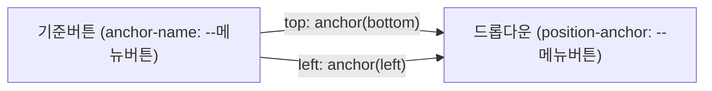

<Callout type="info">
  **이번 문서의 목표:** 이 문서를 다 읽으면 `anchor-name`과 `position-anchor`, `anchor()` 함수로 툴팁을 특정 요소에 CSS만으로 붙이고, `position-try`로 화면 경계를 벗어날 때 자동으로 위치를 뒤집는 앵커 포지셔닝(anchor positioning)을 구현할 수 있습니다.
</Callout>

## 왜 필요한가 — 팝오버 위치 계산을 자바스크립트가 떠맡던 문제

버튼을 누르면 그 바로 아래에 뜨는 툴팁, 드롭다운 메뉴, 자동완성 목록을 생각해 보세요. 지금까지 이런 UI를 CSS만으로 만들기는 어려웠습니다. 툴팁은 보통 `position: absolute`나 `position: fixed`로 배치하는데, 이 값들은 **좌표를 스스로 알지 못합니다.** "버튼 바로 아래에 붙어라"는 상대적 관계를 CSS 좌표 시스템(`top`, `left` 등)만으로 표현할 방법이 없었기 때문에, 실무에서는 자바스크립트로 버튼의 위치를 `getBoundingClientRect()`로 읽어 툴팁의 `top`/`left`를 매 순간 계산해 넣는 라이브러리(Popper.js 등)에 의존해 왔습니다.

게다가 화면 끝에 붙은 버튼이라면 툴팁이 화면 밖으로 넘쳐버리는데, 이를 감지해 반대쪽으로 뒤집는 로직까지 직접 짜야 했습니다. **앵커 포지셔닝**(anchor positioning, 닻 위치 지정)은 이 관계와 충돌 회피를 CSS 자체의 기능으로 끌어들인 표준입니다.

> **쉽게 말하면:** 앵커 포지셔닝은 요소에 "저 요소를 닻(anchor)으로 삼아 거기 붙어 있어라"라고 CSS로 직접 말해주는 것입니다. 배가 닻줄에 묶여 있듯, 팝업이 버튼에 묶여 함께 위치를 잡습니다.

## 정의 — `anchor-name`과 `position-anchor`

앵커 포지셔닝은 두 요소를 CSS 이름으로 짝짓는 것에서 시작합니다.

```css
.기준버튼 {
  anchor-name: --메뉴버튼;
}

.드롭다운 {
  position: absolute;
  position-anchor: --메뉴버튼;
  top: anchor(bottom);
  left: anchor(left);
}
```

- **`anchor-name`**: 이 요소를 "닻"으로 등록하고 커스텀 속성 이름(`--`로 시작, `@property`에서 본 것과 같은 문법)을 붙입니다.
- **`position-anchor`**: 위치를 잡을 요소(팝업)에서, 어떤 닻을 기준으로 삼을지 지정합니다. 이 속성이 있으려면 그 요소는 `position: absolute` 또는 `position: fixed`여야 합니다.
- **`anchor()`**: `top`/`left`/`right`/`bottom` 같은 위치 속성값 자리에 쓰는 함수로, "그 닻의 어느 변(edge)을 기준으로 삼을지"를 인자로 받습니다.

## `anchor()`가 실제로 계산하는 것



`top: anchor(bottom)`은 "내(드롭다운) `top` 좌표를 닻(기준버튼)의 **아래쪽 변** 좌표와 같게 하라"는 뜻입니다. 버튼이 스크롤이나 리사이즈로 움직이면, 자바스크립트 코드 한 줄 없이 드롭다운도 함께 움직입니다 — 브라우저의 레이아웃 엔진이 매 프레임 이 관계를 다시 계산해주기 때문입니다.

`anchor()`의 인자로는 `top`/`right`/`bottom`/`left` 외에도 `center`, 퍼센트 값(`anchor(50%)`처럼 변의 중간 지점을 지정), `start`/`end`(논리적 방향, 12편의 논리 속성 참조) 등을 쓸 수 있습니다.

## `position-try` — 화면 밖으로 넘칠 때 자동으로 뒤집기

앵커 포지셔닝의 진짜 강점은 **충돌 회피**(collision avoidance)입니다. 버튼이 화면 맨 아래에 있어 드롭다운이 아래로 펼쳐지면 화면 밖으로 넘칠 상황일 때, `position-try` 속성으로 "안 되면 이 대안을 시도하라"는 규칙을 미리 등록해둘 수 있습니다.

```css
.드롭다운 {
  position: absolute;
  position-anchor: --메뉴버튼;
  top: anchor(bottom);
  left: anchor(left);

  position-try-fallbacks: flip-block;
}
```

`flip-block`은 미리 정의된 값으로, 원래 위치가 넘치면 세로 방향(`block` 축)을 뒤집어 **버튼 위쪽**에 붙는 대안을 자동으로 시도합니다. `flip-inline`(가로 뒤집기), `flip-start`(양쪽 동시 뒤집기) 같은 값도 있고, `@position-try` 앳룰로 완전히 커스텀한 대안 위치를 여러 개 등록할 수도 있습니다.

```css
@position-try --위쪽대안 {
  top: auto;
  bottom: anchor(top);
}

.드롭다운 {
  position-try-fallbacks: --위쪽대안, flip-block;
}
```

브라우저는 목록에 나열된 순서대로 시도하다가, 화면 안에 완전히 들어맞는 첫 번째 대안을 채택합니다. 이 과정 전체가 자바스크립트 없이 CSS 레이아웃 엔진 안에서 일어납니다.

## 실습 — 버튼 위치에 따라 자동으로 뒤집히는 툴팁

아래 실습기에서 버튼을 화면 아래로 스크롤해 보면(실습기 안에서 스크롤), 툴팁이 화면 경계에 걸릴 때 자동으로 반대쪽으로 뒤집히는 것을 확인할 수 있습니다(지원 브라우저에서만 앵커 배치가 적용됩니다).

<CodePlayground
  template="static"
  activeFile="/styles.css"
  label="anchor-name·anchor()·position-try로 만드는 자동 충돌 회피 툴팁"
  files={{
    '/index.html': `<link rel="stylesheet" href="styles.css">
<div class="스크롤영역">
  <p>아래로 스크롤해서 버튼을 화면 하단 가까이 두고 확인하세요.</p>
  <button class="기준버튼" popovertarget="툴팁">도움말</button>
  <div class="공간채우기"></div>
</div>
<div class="툴팁" id="툴팁" popover>
  버튼 바로 옆에 붙어야 하는 안내 문구입니다. 화면 아래쪽에서는 자동으로 위로 뒤집힙니다.
</div>`,
    '/styles.css': `.스크롤영역 {
  height: 320px;
  overflow-y: auto;
  font-family: system-ui, sans-serif;
  border: 1px solid #ddd;
  padding: 16px;
}

.공간채우기 { height: 600px; }

.기준버튼 {
  anchor-name: --도움말버튼;
  padding: 8px 14px;
  cursor: pointer;
}

.툴팁 {
  position: absolute;
  position-anchor: --도움말버튼;
  top: anchor(bottom);
  left: anchor(left);
  margin-top: 6px;

  position-try-fallbacks: flip-block;

  max-width: 220px;
  padding: 10px 12px;
  background: #1f2937;
  color: white;
  border-radius: 8px;
  border: none;
}

/* anchor() 계산식을 이해하지 못하는 브라우저를 위한 최소한의 폴백 —
   앵커에 붙지는 않지만 최소한 버튼 근처에 보이게라도 한다 */
@supports not (top: anchor(bottom)) {
  .툴팁 {
    position: fixed;
    top: 50%;
    left: 50%;
    transform: translate(-50%, -50%);
  }
}`,
  }}
/>

이 예시는 HTML `popover` 속성(팝오버, 별도 스택 컨텍스트에서 최상단에 뜨는 네이티브 오버레이 — 자세한 동작은 `html/modern_html` 과목 참조)과 함께 썼습니다. 앵커 포지셔닝은 popover뿐 아니라 일반 `position: absolute`/`fixed` 요소에도 동일하게 적용됩니다.

## 지원 상태 — "핵심은 갖췄지만 세부는 개별 확인"

앵커 포지셔닝의 핵심 기능인 `anchor-name`/`position-anchor`/`anchor()`는 2026년 1월 Baseline **최신 브라우저 기준**(newly available)에 들어갔습니다. Chrome 125 이상, Firefox 132 이상, Safari 18.2 이상에서 동작합니다.

<Callout type="warning">
  **다만 모든 세부 기능이 같은 시점에 갖춰진 것은 아닙니다.** `position-try`의 `flip-block` 같은 자동 뒤집기(flip) 동작은 Safari의 경우 18.4 버전 이상이 필요합니다. "핵심 배치 기능은 최신 브라우저 기준으로 갖춰졌지만, `position-try`의 세부 동작은 브라우저별로 개별 확인해야 한다"는 것이 2026-09 시점 정확한 표현입니다. 하나의 기능 이름 아래 여러 하위 기능이 각자 다른 시점에 Baseline에 들어가는 경우가 흔하므로, "앵커 포지셔닝은 지원된다"처럼 뭉뚱그리지 말고 실제로 쓰는 하위 기능(`anchor()` 기본 배치인지, `position-try` 자동 뒤집기까지인지)을 기준으로 확인해야 합니다.
</Callout>

`@supports`로 핵심 기능의 존재 여부만 먼저 확인하고, 그 안에서 `position-try`를 적용하는 것이 안전합니다.

```css
@supports (anchor-name: --x) {
  .드롭다운 {
    position-anchor: --메뉴버튼;
    top: anchor(bottom);
  }

  @supports (position-try-fallbacks: flip-block) {
    .드롭다운 { position-try-fallbacks: flip-block; }
  }
}
```

미지원 브라우저(오래된 Safari, 구형 브라우저)에서는 이 블록 전체가 무시되므로, 기존처럼 고정된 `top`/`left` 값이나 자바스크립트 기반 위치 계산 라이브러리로 대체해야 합니다.

## 비교표 — 자바스크립트 위치 계산 라이브러리 vs 앵커 포지셔닝

| 구분 | 자바스크립트 라이브러리(Popper.js 등) | 앵커 포지셔닝(CSS 네이티브) |
|---|---|---|
| 위치 계산 시점 | 스크롤·리사이즈마다 자바스크립트 재계산 | 브라우저 레이아웃 엔진이 자동 갱신 |
| 번들 크기 | 라이브러리 코드 추가 | 0 — CSS 문법일 뿐 |
| 충돌 회피 | 라이브러리가 제공하는 로직에 의존 | `position-try`로 CSS 자체에서 처리 |
| 메인 스레드 부하 | 스크롤 이벤트마다 자바스크립트 실행 | 없음(CSS 엔진 처리) |
| 2026-09 지원 상태 | 모든 브라우저(자바스크립트로 직접 구현하므로 지원 이슈 없음) | 핵심 기능 최신 브라우저 기준(2026-01 newly available), 세부 기능은 브라우저별 확인 필요 |

## 자주 틀리는 점

- **`anchor-name`을 준 요소 자체의 `position` 값이 중요하다고 착각**: 실제로 `position` 값이 필요한 쪽은 앵커가 아니라 **위치를 잡는 요소**(팝업) 쪽입니다. 팝업은 `position: absolute`나 `fixed`여야 `anchor()`를 쓸 수 있습니다.
- **`position-anchor` 없이 `anchor()`만 쓰면 되는 줄 아는 경우**: `anchor()`가 참조할 닻을 지정하려면 `position-anchor`로 연결하거나, `anchor()` 함수 안에 닻 이름을 직접 넣는 문법(`anchor(--메뉴버튼 bottom)`)을 써야 합니다. 연결이 없으면 계산이 무효화됩니다.
- **`position-try`가 자동으로 "예쁘게" 배치해준다고 과신**: 대안을 직접 등록하지 않으면 브라우저가 임의로 최선을 다하지 않습니다. 원하는 대안 순서를 `position-try-fallbacks`에 명시적으로 나열해야 합니다.

## 핵심 정리

- `anchor-name`으로 요소를 닻으로 등록하고, `position-anchor`로 다른 요소(반드시 `position: absolute`/`fixed`)를 그 닻에 연결한다.
- `anchor()` 함수는 `top`/`left` 같은 위치 속성값 자리에서 닻의 특정 변(bottom, left 등)을 참조해 좌표를 계산한다. 스크롤·리사이즈에도 자바스크립트 없이 자동 갱신된다.
- `position-try-fallbacks`(및 `@position-try` 커스텀 대안)로 화면 밖 넘침 시 자동으로 반대쪽에 배치하는 충돌 회피를 CSS만으로 구현한다.
- 핵심 기능(`anchor-name`/`anchor()`)은 2026-01 Baseline 최신 브라우저 기준이지만, `position-try`의 자동 뒤집기 같은 세부 동작은 Safari 18.4 이상처럼 더 늦게 갖춰진 부분이 있어 개별 확인이 필요하다.
- 미지원 브라우저를 위해 `@supports (anchor-name: --x)`로 핵심 기능 지원 여부를 먼저 확인하고, 그 위에 `position-try` 지원 여부를 중첩해 확인하는 것이 안전하다.

## 마무리 복습

<Quiz
  questionNumber={1}
  question="anchor-name과 position-anchor의 관계로 옳은 것은?"
  options={['anchor-name은 팝업 요소에, position-anchor는 버튼 요소에 지정한다', 'anchor-name은 닻이 되는 요소에, position-anchor는 그 닻을 참조할 요소에 지정한다', '두 속성은 같은 값을 가져야 하며 아무 요소에나 지정해도 무방하다', 'position-anchor만 있으면 anchor-name 없이도 앵커 관계가 성립한다']}
  correctAnswer={2}
  explanation="anchor-name은 기준이 되는 요소(예: 버튼)에 이름을 붙이고, position-anchor는 위치를 잡을 요소(예: 팝업)에서 그 이름을 참조해 연결한다."
  optionExplanations={['두 속성의 대상이 반대로 설명되어 있다', '정답 — 닻 등록과 닻 참조로 역할이 나뉜다', '같은 이름 문자열을 공유해야 연결되지만 아무 요소나 되는 것은 아니다', 'anchor-name으로 등록된 닻이 있어야 position-anchor가 참조할 수 있다']}
/>

<Quiz
  questionNumber={2}
  question="top: anchor(bottom)이 의미하는 것으로 알맞은 것은?"
  options={['이 요소의 bottom 좌표를 닻의 top 좌표와 같게 한다', '이 요소의 top 좌표를 닻의 bottom(아래쪽 변) 좌표와 같게 한다', '이 요소를 화면의 맨 아래에 고정한다', '닻 요소의 높이를 이 요소의 높이와 같게 만든다']}
  correctAnswer={2}
  explanation="anchor(bottom)은 닻의 아래쪽 변 좌표를 가리키며, top 속성에 대입하면 이 요소의 top이 닻의 bottom과 같아져 닻 바로 아래에 위치하게 된다."
  optionExplanations={['좌표를 대입받는 속성과 참조하는 변이 반대로 설명되어 있다', '정답 — 닻의 아래쪽 변이 이 요소의 top 위치가 된다', '화면 고정이 아니라 닻을 기준으로 한 상대 배치다', '높이를 맞추는 기능이 아니라 좌표 하나를 지정하는 함수다']}
/>

<Quiz
  questionNumber={3}
  question="position-try-fallbacks: flip-block의 동작으로 옳은 것은?"
  options={['요소를 항상 화면 정중앙에 고정한다', '원래 배치가 화면 밖으로 넘치면 세로 방향을 뒤집은 대안 위치를 시도한다', '앵커 이름을 자동으로 재설정한다', '애니메이션 없이 즉시 사라지게 한다']}
  correctAnswer={2}
  explanation="flip-block은 원래 위치가 뷰포트 경계를 넘칠 때 세로(block) 축을 뒤집어 반대쪽에 배치하는 대안을 시도하는 미리 정의된 값이다."
  optionExplanations={['정중앙 고정 기능이 아니라 충돌 회피를 위한 위치 대안이다', '정답 — 세로 방향 뒤집기 대안을 자동 시도한다', 'anchor-name 재설정과는 무관하다', '표시 여부가 아니라 위치 조정에 관한 값이다']}
/>

<Quiz
  questionNumber={4}
  question="2026-09 기준 앵커 포지셔닝의 지원 상태를 가장 정확하게 설명한 것은?"
  options={['모든 세부 기능이 동일한 시점에 완전히 Baseline이 되었다', '핵심 기능(anchor-name, anchor())은 최신 브라우저 기준이지만 position-try의 일부 동작은 Safari에서 더 늦은 버전(18.4 이상)이 필요하다', '어떤 브라우저도 아직 지원하지 않는다', 'Chrome에서만 동작하며 다른 브라우저는 계획이 없다']}
  correctAnswer={2}
  explanation="핵심 anchor() 기능은 2026-01 Baseline newly available(Chrome 125+/Firefox 132+/Safari 18.2+)이지만, position-try의 flip 동작 등은 Safari 18.4 이상이 필요해 세부 기능별 지원 편차가 있다."
  optionExplanations={['세부 기능마다 지원 시점이 다르므로 뭉뚱그릴 수 없다', '정답 — 핵심과 세부 기능의 지원 시점이 다르다', 'Chrome 125, Firefox 132, Safari 18.2 이상에서 핵심 기능이 이미 동작한다', '3개 엔진 모두 핵심 기능을 갖췄다']}
/>

<Quiz
  questionNumber={5}
  question="다음 중 anchor()로 위치를 계산하려는 요소가 반드시 갖춰야 하는 조건은?"
  options={['display: flex여야 한다', 'position: absolute 또는 position: fixed여야 한다', 'anchor-name을 스스로에게도 지정해야 한다', 'width와 height를 고정 픽셀 값으로 지정해야 한다']}
  correctAnswer={2}
  explanation="anchor()로 좌표를 계산받는 요소는 position: absolute 또는 fixed여야 position-anchor를 통한 닻 연결과 anchor() 계산이 유효하게 적용된다."
  optionExplanations={['flex 컨테이너 여부와는 무관한 기능이다', '정답 — absolute 또는 fixed 포지셔닝이 전제 조건이다', 'anchor-name은 닻이 되는 다른 요소에 지정하는 것이지 자기 자신에게 지정하는 것이 아니다', '고정 크기가 필수 조건은 아니다']}
/>

<Quiz
  questionNumber={6}
  question="앵커 포지셔닝과 기존 자바스크립트 위치 계산 라이브러리를 비교한 설명으로 옳은 것은?"
  options={['앵커 포지셔닝은 스크롤·리사이즈 때마다 자바스크립트 재계산이 필요하다', '앵커 포지셔닝은 브라우저 레이아웃 엔진이 위치를 자동 갱신해 별도 자바스크립트 재계산이 필요 없다', '두 방식 모두 번들 크기에 미치는 영향이 동일하다', '자바스크립트 라이브러리는 브라우저 지원 문제로 쓸 수 없는 경우가 많다']}
  correctAnswer={2}
  explanation="앵커 포지셔닝은 CSS 레이아웃 계산의 일부이므로 브라우저가 스크롤·리사이즈마다 자동으로 다시 계산해주며, 자바스크립트로 매번 좌표를 다시 읽어올 필요가 없다."
  optionExplanations={['자바스크립트 재계산이 필요한 쪽은 기존 라이브러리 방식이다', '정답 — CSS 엔진이 자동으로 위치를 갱신한다', '라이브러리는 코드 추가로 번들 크기가 늘지만 CSS 방식은 늘지 않는다', '자바스크립트로 직접 구현하는 라이브러리는 브라우저 지원과 무관하게 동작한다']}
/>

## 참고 자료

- [MDN - anchor-name](https://developer.mozilla.org/en-US/docs/Web/CSS/anchor-name)
- [W3C - CSS Anchor Positioning Module Level 1](https://www.w3.org/TR/css-anchor-position-1/)
