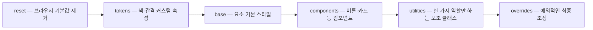
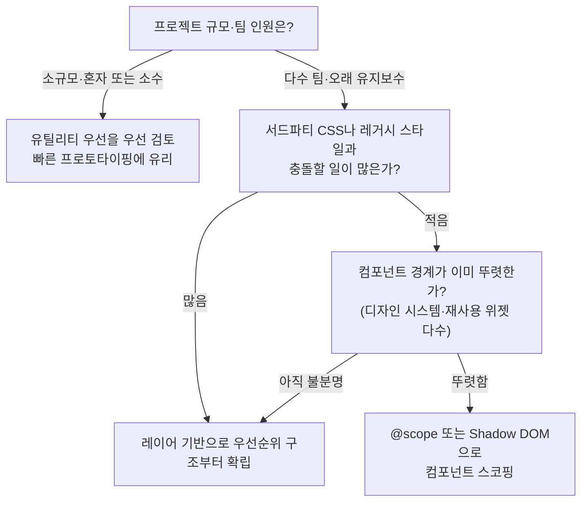

<Callout type="info">
  **이번 문서의 목표:** 이 문서를 다 읽으면 레이어 기반, 유틸리티 우선, 컴포넌트 스코핑이라는 세 가지 CSS 아키텍처(architecture, 구조 설계 방식)의 장단점을 설명하고, 프로젝트 규모와 팀 상황에 맞는 조합을 근거를 들어 고를 수 있게 됩니다.
</Callout>

## 왜 아키텍처를 따로 고민해야 하는가

CSS 파일 하나가 100줄일 때는 아무 문제가 없습니다. 문제는 파일이 수십 개로 쪼개지고, 여러 사람이 동시에 같은 스타일 시트를 건드리기 시작할 때 생깁니다.

- 새 컴포넌트를 만들 때 "이 스타일을 어느 파일, 어느 순서에 넣어야 하지?"라는 질문에 답이 없다.
- 어떤 스타일이 다른 스타일을 덮어써서 명시도(specificity)를 점점 더 높은 선택자로 눌러 이기려는 **명시도 전쟁**(specificity war)이 반복된다.
- 컴포넌트를 지웠는데도 그 컴포넌트가 쓰던 CSS 규칙이 다른 곳에 몰래 영향을 주고 있어서, 아무도 지우지 못하는 **죽은 CSS**(dead CSS)가 쌓인다.

**아키텍처**(architecture)라는 말은 건축에서 온 단어로, 개별 벽돌(하나하나의 CSS 규칙)이 아니라 "벽돌을 어떤 순서와 구조로 쌓을 것인가"라는 설계 원칙을 가리킵니다. 이 편은 지금까지 배운 캐스케이드 레이어(03편)·컨테이너 쿼리(07·08편)·`@scope`(09편)를 각각의 문법으로만 알고 끝내지 않고, "언제 무엇을 골라야 하는가"라는 실무 판단으로 모으는 자리입니다.

> **쉽게 말하면:** 아키텍처를 정하지 않은 CSS는 규칙 없이 쌓아 올린 짐더미입니다. 아키텍처는 그 짐더미에 "이 칸에는 이런 것만 넣는다"는 선반을 놓는 일입니다.

## 세 가지 접근

### 1. 레이어 기반(layer-based) 아키텍처

03편에서 다룬 `@layer`(캐스케이드 레이어)로 스타일을 역할별 층(layer)에 미리 나눠 담습니다. 대표적인 층 구성은 다음과 같습니다.

```css
@layer reset, tokens, base, components, utilities, overrides;
```



레이어 순서 자체가 우선순위를 결정하므로(03편에서 다룬 대로, 레이어 순서가 명시도보다 먼저 승부를 가른다), `components` 층의 선택자가 아무리 명시도를 낮게 짜도 `utilities` 층보다 뒤에 선언된 레이어라면 항상 밀립니다. 그래서 "어떤 선택자를 더 길게 써야 이길까"라는 명시도 전쟁 자체가 애초에 벌어지지 않습니다.

- **장점**: 우선순위가 예측 가능하다. 여러 파일에서 스타일을 가져와도(예: 서드파티 CSS를 `unlayered`가 아니라 특정 레이어에 넣기) 충돌 지점이 명확하다.
- **단점**: 레이어 설계 자체를 프로젝트 초반에 팀이 합의해야 한다. 레이어가 너무 세분화되면 "이 스타일을 어느 층에 넣어야 하나" 판단이 다시 어려워진다.

### 2. 유틸리티 우선(utility-first) 아키텍처

**유틸리티**(utility, 도구)라는 이름처럼, `padding`이나 `display` 같은 CSS 속성 하나하나에 대응하는 아주 작은 클래스를 미리 만들어 두고, HTML의 `class` 속성에 그 클래스들을 여러 개 나열해 스타일을 조합하는 방식입니다. Tailwind CSS 같은 프레임워크가 이 접근을 대표합니다(이 사이트는 특정 프레임워크의 클래스 이름을 전부 외우는 레퍼런스가 아니라, 이 접근 자체가 무엇을 트레이드오프하는지만 다룹니다).

```html
<div class="flex items-center gap-4 rounded-lg bg-white p-6 shadow">
  <!-- CSS 파일을 따로 뒤지지 않고 HTML만 봐도 스타일이 짐작된다 -->
</div>
```

- **장점**: 새 CSS 파일이나 새 클래스 이름을 거의 만들지 않아도 되므로, "이 스타일이 다른 곳에서도 쓰이고 있어서 못 지운다"는 죽은 CSS 문제가 크게 줄어든다. 클래스 하나하나가 한 가지 역할만 하므로 명시도가 대체로 균일하다.
- **단점**: HTML이 클래스 목록으로 길어져 마크업의 의미가 눈에 잘 들어오지 않을 수 있다. 팀 전체가 유틸리티 클래스 이름 체계를 외워야 하는 학습 곡선이 있다.

### 3. 컴포넌트 스코핑(component scoping) 아키텍처

09편에서 다룬 `@scope`나 자바스크립트 컴포넌트 프레임워크의 Shadow DOM(그림자 DOM, `javascript/web_component` 과목 참조)으로 "이 스타일은 이 컴포넌트 안에서만 적용된다"는 경계를 코드로 강제하는 방식입니다.

```css
@scope (.card) to (.card-actions) {
  p { color: gray; }
}
```

- **장점**: 컴포넌트 하나를 지우면 그 스타일도 함께 사라진다는 것이 구조적으로 보장된다. 이름이 우연히 겹쳐서 다른 컴포넌트에 영향을 주는 사고가 원천적으로 막힌다.
- **단점**: 스코프 경계를 설계하는 것 자체가 컴포넌트 구조를 먼저 잘 나눠야 하는 일이라, 프로젝트 초기 설계 부담이 있다. `@scope`는 2026년 9월 기준 **최신 브라우저 기준**(Baseline: 2026년 초 신규 진입) 기능이라 아주 오래된 브라우저까지 지원해야 하는 프로젝트라면 Shadow DOM 기반 컴포넌트 프레임워크를 대신 검토해야 한다.

## 세 접근 비교

| 기준 | 레이어 기반 | 유틸리티 우선 | 컴포넌트 스코핑 |
|---|---|---|---|
| 우선순위 예측 가능성 | 높음(레이어 순서로 고정) | 높음(균일한 명시도) | 스코프 안에서는 높음 |
| 죽은 CSS 위험 | 중간 | 낮음 | 낮음(컴포넌트 삭제 시 함께 제거) |
| HTML 가독성 | 유지됨(클래스가 의미 중심) | 클래스가 길어져 낮아질 수 있음 | 유지됨 |
| 팀 합의·초기 설계 부담 | 레이어 구성 합의 필요 | 클래스 체계 학습 필요 | 컴포넌트 경계 설계 필요 |
| 지원 상태 | `@layer`는 널리 사용 가능 | CSS 표준과 무관(프레임워크 문제) | `@scope`는 최신 브라우저 기준 |

세 접근은 서로 배타적이지 않습니다. 실무에서는 **레이어로 큰 우선순위 구조를 잡고, 그 안의 `utilities` 층에 유틸리티 클래스를 넣고, 특정 컴포넌트에는 `@scope`를 적용**하는 조합이 흔합니다. "하나만 골라야 한다"는 질문이 아니라 "어느 층위의 문제를 무엇으로 풀 것인가"라는 질문입니다.

## 선택 기준 — 언제 무엇을 쓰는가



- **소규모 프로젝트, 혼자 또는 소수가 빠르게 만드는 경우**: 유틸리티 우선이 CSS 파일을 거의 늘리지 않고도 빠르게 결과물을 낸다.
- **여러 팀이 오래 유지보수하고, 서드파티 CSS나 레거시 스타일과 자주 부딫히는 경우**: 레이어 기반으로 우선순위 구조를 먼저 못박아 두면 "어떤 스타일이 왜 이겼는지"를 나중에도 추적할 수 있다.
- **디자인 시스템처럼 컴포넌트 경계가 이미 뚜렷하고, 컴포넌트 삭제·교체가 잦은 경우**: 컴포넌트 스코핑으로 "지우면 정말로 사라진다"는 보장을 얻는 것이 유지보수 비용을 크게 줄인다.

<Callout type="warning">
  **자주 틀리는 점:** "유틸리티 우선은 구식이고 `@scope`가 최신이니 무조건 더 낫다"처럼 최신 기능을 우열로 줄 세우는 것은 잘못된 판단입니다. 세 접근은 서로 다른 문제(우선순위 관리, 죽은 CSS 방지, 컴포넌트 격리)를 푸는 도구이며, 어떤 문제가 지금 프로젝트에서 더 아픈지에 따라 답이 달라집니다.
</Callout>

## 실습 — 레이어 순서로 유틸리티를 항상 이기게 하기

<CodePlayground
  template="static"
  activeFile="/styles.css"
  label="레이어 선언 순서를 바꿔 우선순위가 뒤집히는 것을 확인하세요"
  files={{
    '/index.html': `<button class="btn text-blue">저장하기</button>`,
    '/styles.css': `@layer components, utilities;

@layer components {
  .btn {
    background: seagreen;
    color: white;
    padding: 8px 16px;
    border: none;
    border-radius: 6px;
  }
}

@layer utilities {
  .text-blue {
    color: royalblue;
  }
}

/* 레이어 선언 순서(위 @layer components, utilities;)를
   @layer utilities, components; 로 바꿔서 글자색이
   어떻게 뒤바뀌는지 확인해 보세요 */`,
  }}
/>

`components` 층의 `.btn`이 `color: white`를 주고, `utilities` 층의 `.text-blue`가 `color: royalblue`를 줍니다. 지금 선언 순서(`components, utilities`)에서는 뒤에 선언된 `utilities` 층이 이겨 글자가 파란색으로 보입니다. 첫 줄의 레이어 선언 순서를 `@layer utilities, components;`로 바꾸면, 명시도는 그대로인데도 이제 `components` 층이 이겨 글자가 흰색으로 바뀝니다. 이것이 "레이어 순서가 명시도보다 먼저 승부를 가른다"는 03편의 원칙이 아키텍처 설계에 그대로 이어지는 지점입니다.

## 핵심 정리

- 아키텍처는 개별 CSS 규칙이 아니라 "규칙을 어떤 순서·구조로 쌓을 것인가"를 정하는 설계 원칙이며, 팀 규모가 커질수록 그 필요성이 커진다.
- 레이어 기반은 우선순위를 예측 가능하게 만들지만 레이어 구성을 팀이 합의해야 한다.
- 유틸리티 우선은 죽은 CSS를 줄이고 빠르게 만들 수 있지만 HTML 가독성과 학습 곡선의 트레이드오프가 있다.
- 컴포넌트 스코핑(`@scope`)은 컴포넌트 단위로 스타일 삭제·격리를 보장하지만 경계 설계 부담이 있고 지원 상태가 최신 브라우저 기준이다.
- 세 접근은 배타적이지 않다. 레이어로 큰 구조를 잡고, 그 안에서 유틸리티와 컴포넌트 스코핑을 함께 쓰는 조합이 실무에서 흔하다.

## 마무리 복습

<Quiz
  questionNumber={1}
  question="CSS에서 아키텍처를 별도로 고민해야 하는 근본적인 이유는?"
  options={['CSS 파일 하나의 줄 수를 줄이기 위해서', '여러 사람이 오래 함께 수정할 때 명시도 전쟁과 죽은 CSS 같은 문제가 규모에 비례해 커지기 때문에', 'CSS 파서가 파일 개수 제한을 두기 때문에', '브라우저가 레이어 없이는 CSS를 해석하지 못하기 때문에']}
  correctAnswer={2}
  explanation="아키텍처 고민은 파일 크기가 아니라, 여러 사람이 함께 오래 유지보수할 때 명시도 전쟁이나 죽은 CSS 같은 문제가 커지는 것을 막기 위해 필요하다."
  optionExplanations={['파일 줄 수 자체는 아키텍처의 직접적인 목적이 아니다', '정답 — 팀 규모와 유지보수 기간이 늘어날수록 이런 문제가 커진다', '브라우저에는 그런 파일 개수 제한이 없다', '레이어 없이도 CSS는 정상적으로 해석된다']}
/>

<Quiz
  questionNumber={2}
  question="레이어 기반 아키텍처가 명시도 전쟁을 막는 방식은?"
  options={['모든 선택자의 명시도를 자동으로 0으로 만든다', '레이어 선언 순서가 명시도보다 먼저 우선순위를 결정하므로 명시도를 더 높이는 경쟁이 무의미해진다', 'CSS 파일 개수를 강제로 하나로 합친다', '유틸리티 클래스 사용을 금지한다']}
  correctAnswer={2}
  explanation="캐스케이드 레이어는 명시도 계산보다 먼저 우선순위를 결정하므로, 나중 레이어의 낮은 명시도 선택자가 이전 레이어의 높은 명시도 선택자를 이길 수 있어 명시도를 계속 높이는 경쟁이 무의미해진다."
  optionExplanations={['명시도 자체를 0으로 만들지는 않는다', '정답 — 레이어 순서가 명시도보다 먼저 결정한다는 것이 핵심이다', '파일 개수와는 관계없는 우선순위 메커니즘이다', '유틸리티 클래스와 레이어는 함께 쓸 수 있다']}
/>

<Quiz
  questionNumber={3}
  question="유틸리티 우선 아키텍처의 단점으로 가장 알맞은 것은?"
  options={['죽은 CSS가 다른 접근보다 크게 늘어난다', 'HTML 클래스 목록이 길어져 마크업의 의미가 눈에 잘 들어오지 않고 클래스 체계를 학습해야 한다', '레이어 문법을 전혀 쓸 수 없게 된다', '브라우저 지원이 극히 제한적이다']}
  correctAnswer={2}
  explanation="유틸리티 우선은 오히려 죽은 CSS를 줄이는 데 유리하지만, 클래스가 많이 나열되어 HTML 가독성이 떨어지고 클래스 이름 체계를 팀이 학습해야 하는 부담이 있다."
  optionExplanations={['오히려 죽은 CSS 문제를 줄이는 접근이다', '정답 — 가독성과 학습 곡선이 실제 트레이드오프다', '레이어와 유틸리티는 함께 쓸 수 있는 별개의 개념이다', 'CSS 클래스 문법 자체는 표준 CSS이므로 지원 문제가 아니다']}
/>

<Quiz
  questionNumber={4}
  question="컴포넌트 스코핑(@scope) 아키텍처의 핵심 장점은?"
  options={['모든 브라우저에서 예외 없이 완벽하게 지원된다', '컴포넌트를 지우면 그 스타일도 함께 사라진다는 것이 구조적으로 보장된다', 'HTML 클래스 이름을 전혀 쓰지 않아도 된다', '명시도 계산 자체가 완전히 사라진다']}
  correctAnswer={2}
  explanation="@scope로 스코프 경계를 지정하면 그 컴포넌트를 지울 때 관련 스타일도 함께 제거된다는 것이 구조적으로 보장되어, 이름이 우연히 겹쳐 다른 컴포넌트에 영향을 주는 사고가 원천적으로 막힌다."
  optionExplanations={['@scope는 2026년 9월 기준 최신 브라우저 기준 기능으로 완벽한 지원은 아니다', '정답 — 컴포넌트 단위 삭제·격리 보장이 핵심 장점이다', '클래스 이름은 여전히 스코프 선택자와 함께 사용된다', '스코프 안에서도 명시도 계산은 여전히 존재한다']}
/>

<Quiz
  questionNumber={5}
  question="세 가지 CSS 아키텍처 접근에 대한 올바른 태도는?"
  options={['가장 최신 기술인 @scope만 항상 정답이다', '셋은 서로 다른 문제를 풀며 프로젝트 상황에 따라 조합해 쓸 수 있다', '유틸리티 우선은 항상 피해야 할 구식 방법이다', '레이어 기반은 소규모 프로젝트에만 적합하다']}
  correctAnswer={2}
  explanation="세 접근은 우선순위 관리, 죽은 CSS 방지, 컴포넌트 격리라는 서로 다른 문제를 풀며 배타적이지 않다. 프로젝트 규모와 팀 상황에 맞춰 레이어 기반에 유틸리티와 컴포넌트 스코핑을 함께 조합하는 것이 실무에서 흔하다."
  optionExplanations={['최신 기술이라고 항상 정답인 것은 아니다', '정답 — 문제 성격에 따라 조합해 선택하는 것이 핵심이다', '유틸리티 우선도 상황에 따라 유효한 선택이다', '레이어 기반은 대규모 프로젝트에서 특히 유용하다']}
/>

<Quiz
  questionNumber={6}
  question="레이어 순서를 @layer components, utilities;에서 @layer utilities, components;로 바꾸면 생기는 변화는?"
  options={['두 층의 명시도가 자동으로 계산되어 바뀐다', '나중에 선언된 레이어가 우선순위에서 이기므로, 어느 층이 나중인지에 따라 최종 적용되는 스타일이 뒤바뀐다', 'CSS 파일이 다시 컴파일되어야만 적용된다', '두 레이어가 합쳐져 하나의 층이 된다']}
  correctAnswer={2}
  explanation="캐스케이드 레이어는 선언 순서상 나중 레이어가 우선순위에서 이긴다. 순서를 바꾸면 명시도 값 자체는 그대로여도 최종적으로 적용되는 스타일이 뒤바뀐다."
  optionExplanations={['명시도 값 자체는 선택자 구조로 결정되며 순서와 무관하다', '정답 — 레이어 선언 순서가 최종 승자를 결정한다', '별도 컴파일 과정 없이 브라우저가 CSS를 해석하는 시점에 바로 적용된다', '두 레이어는 각자 독립적으로 유지되며 합쳐지지 않는다']}
/>

## 참고 자료

- [MDN - @layer](https://developer.mozilla.org/en-US/docs/Web/CSS/@layer)
- [MDN - @scope](https://developer.mozilla.org/en-US/docs/Web/CSS/@scope)
- [MDN - @supports](https://developer.mozilla.org/en-US/docs/Web/CSS/@supports)
