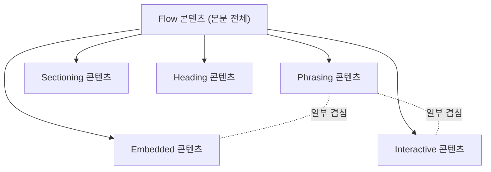

<Callout type="info">
  **이번 문서의 목표:** 이 문서를 다 읽으면 어떤 HTML 요소를 보고도 "이 요소는 무슨 카테고리에 속하고, 안에 무엇을 담을 수 있는가"를 스스로 판단하고, `<p>` 안에 `<div>`를 넣으면 왜 브라우저가 마음대로 태그를 닫아버리는지 근거를 들어 설명할 수 있게 됩니다.
</Callout>

## 왜 "무엇이든 넣을 수 있다"가 아닌가

지금까지 02편에서 태그와 속성의 문법을, 03편에서 MDN·WHATWG 스펙을 읽는 법을 배웠습니다. 이제 실제로 태그를 조합해 문서를 쓸 차례인데, 그 전에 반드시 짚어야 할 규칙이 하나 있습니다. **HTML 요소는 아무 요소나 자식으로 담을 수 있는 게 아닙니다.**

다음 코드를 브라우저에 그대로 넣으면 어떤 일이 벌어질까요.

```html
<p>이 문단 안에 <div>블록을 넣어보면</div> 어떻게 될까?</p>
```

"태그를 여닫았으니 문법적으로는 맞지 않을까"라고 생각하기 쉽지만, 실제로 브라우저는 `<div>`가 열리는 순간 `<p>`를 강제로 먼저 닫아버립니다. 결과는 `<p>이 문단 안에 </p><div>블록을 넣어보면</div><p> 어떻게 될까?</p>`처럼 문단이 셋으로 쪼개진 것과 같은 모양이 됩니다. 겉보기엔 화면이 비슷하게 뜨니 문제를 못 느끼고 넘어가기 쉽지만, 문서 구조(DOM 트리)는 작성자의 의도와 완전히 달라졌습니다.

이런 일이 생기는 이유를 "외워서" 아는 것과 "왜 그런 규칙이 있는지" 아는 것은 다릅니다. 이 편은 후자를 위한 편입니다. HTML은 요소마다 **콘텐츠 모델**(content model, 콘텐츠 모형)이라는 규칙을 갖고 있고, 그 규칙을 몇 가지 재사용 가능한 분류인 **콘텐츠 카테고리**(content categories, 콘텐츠 범주)로 표현합니다. 이 두 개념을 한 번 제대로 잡아두면, 06편부터 11편까지 나오는 모든 요소가 "왜 이렇게 쓰이는가"로 저절로 설명됩니다.

## 1. 콘텐츠 모델이란 무엇인가

> **쉽게 말하면:** 콘텐츠 모델은 "이 요소 안에는 이런 종류의 것들만 들어올 수 있다"는 요소별 입장 규칙입니다.

**콘텐츠**(content, 내용물)라는 단어와 **모델**(model, 모형)이라는 단어를 합치면 뜻이 그대로 드러납니다. 콘텐츠 모델은 "이 요소가 담을 수 있는 내용물의 모형(규칙)"입니다. WHATWG(Web Hypertext Application Technology Working Group, 웹 하이퍼텍스트 응용 기술 워킹 그룹 — 01편에서 다룬 HTML의 1차 표준 기구)는 모든 요소의 스펙 페이지마다 "Content model" 항목을 두어 이 규칙을 명시합니다.

예를 들어 `<ul>`(unordered list, 순서 없는 리스트)의 콘텐츠 모델은 "0개 이상의 `<li>` 요소, 그리고 스크립트 지원 요소만"입니다. 즉 `<ul>` 바로 안에 `<p>`나 ``를 직접 넣으면 규칙 위반입니다. 반대로 `<li>`의 콘텐츠 모델은 훨씬 관대해서 "flow 콘텐츠"라면 거의 다 받아줍니다. 이 "flow"라는 말이 바로 다음에 나올 콘텐츠 카테고리입니다.

콘텐츠 모델을 요소마다 하나씩 따로 외우면 250개가 넘는 HTML 요소 각각의 규칙을 암기해야 합니다. 그래서 WHATWG는 요소들을 **공통된 성질**로 묶어 카테고리를 만들고, 콘텐츠 모델을 "이 카테고리에 속하는 것만 허용" 식으로 표현합니다. 카테고리를 알면 새로운 요소를 만나도 그 요소가 어느 카테고리에 속하는지만 확인하면 규칙을 추론할 수 있습니다.

## 2. 7개 콘텐츠 카테고리

MDN과 WHATWG가 정의하는 콘텐츠 카테고리는 7종입니다. 하나씩 봅니다.

### Flow 콘텐츠 — 문서 본문의 기본 흐름

**Flow**(플로우, 흐름)는 이름 그대로 문서의 본문에 순서대로 흘러가며 배치되는 콘텐츠입니다. `<body>` 안에 놓이는 대부분의 요소 — `<p>`, `<div>`, `<h1>`, `<ul>`, `<table>`, `<a>`, `` 등 — 가 flow 콘텐츠에 속합니다. "이 요소 안에 flow 콘텐츠를 넣을 수 있다"는 사실상 "본문에 쓸 수 있는 거의 모든 것을 넣을 수 있다"는 뜻입니다.

### Phrasing 콘텐츠 — 문단 안의 텍스트 단위

**Phrasing**(프레이징, 어구 표현)은 문단 안에서 텍스트와 나란히 흐르는, 더 작은 단위의 콘텐츠입니다. 텍스트 자체, `<span>`, `<a>`, `<em>`, `<strong>`, ``, `<br>` 같은 요소가 여기 속합니다. **모든 phrasing 콘텐츠는 flow 콘텐츠이기도 합니다.** 두 카테고리가 겹치는 것이지, 서로 배타적인 분류가 아닙니다.

핵심은 이겁니다. **phrasing 콘텐츠에는 블록 성격의 요소가 없습니다.** `<div>`, `<p>`, `<ul>`, `<h1>` 같은 요소는 phrasing이 아닙니다. 그래서 phrasing만 허용하는 자리에 이런 요소를 넣으면 규칙 위반입니다.

### Sectioning 콘텐츠 — 아웃라인을 만드는 구획

**Sectioning**(섹셔닝, 구획 나누기)은 문서를 의미 있는 구역으로 나누는 요소입니다. `<article>`, `<aside>`, `<nav>`, `<section>`이 여기 속합니다. 이 요소들은 "새로운 구획이 시작된다"는 신호 역할을 하는데, 과거에는 이 신호가 자동으로 "문서 아웃라인"이라는 트리 구조를 만들어준다고 설명되었습니다. 이 설명이 실제로는 어떻게 됐는지는 17·18편에서 정면으로 다룹니다. 지금은 "sectioning 콘텐츠 = 구획을 나누는 4형제 요소"라는 분류만 기억하면 됩니다.

### Heading 콘텐츠 — 구획의 제목

**Heading**(헤딩, 제목)은 `<h1>`부터 `<h6>`까지, 그리고 `<hgroup>`입니다. sectioning 콘텐츠와 짝을 이뤄 "이 구획의 제목이 무엇인가"를 표시합니다.

### Embedded 콘텐츠 — 외부 자원을 끌어오는 것

**Embedded**(임베디드, 삽입된)는 문서 밖의 자원을 가져와 표시하는 요소입니다. ``, `<video>`, `<audio>`, `<iframe>`, `<canvas>`, `<embed>`, `<object>`가 해당합니다. 이 과목에서는 08편에서 ``의 전통적 사용법만 다루고, `<video>`/`<audio>`나 반응형 이미지처럼 최근에 자리 잡은 쓰임은 `html/modern_html` 과목의 몫입니다.

### Interactive 콘텐츠 — 사용자가 직접 조작하는 것

**Interactive**(인터랙티브, 상호작용하는)는 사용자가 클릭·입력 등으로 직접 조작할 수 있는 요소입니다. `<a>`(href 속성이 있을 때), `<button>`, `<input>`, `<select>`, `<textarea>`, `<label>`이 해당합니다. 뒤에서 배울 규칙 중 하나가 "interactive 콘텐츠는 다른 interactive 콘텐츠를 자식으로 가질 수 없다"입니다. `<a>` 안에 `<button>`을 넣지 못하는 이유가 바로 이것입니다 — 사용자가 클릭했을 때 어느 쪽 동작이 실행돼야 하는지 애매해지기 때문입니다.

### Metadata 콘텐츠 — 문서 자체에 대한 정보

**Metadata**(메타데이터, 데이터에 대한 데이터)는 문서의 내용이 아니라 문서 자체를 설명하거나 다른 자원과의 관계·동작을 설정하는 요소입니다. `<head>` 안에 오는 `<title>`, `<meta>`, `<link>`, `<style>`, `<script>`, `<base>`가 여기 속합니다. 04편에서 다룬 `<head>` 안의 필수 메타데이터가 바로 이 카테고리의 실전 사례였습니다.

### 한눈에 보는 7종 카테고리

| 카테고리 | 핵심 성격 | 대표 요소 |
|----------|-----------|-----------|
| Flow | 본문에 순서대로 흐르는 것 | `p`, `div`, `ul`, `table`, `img` |
| Phrasing | 문단 안 텍스트 단위 (flow의 부분집합) | `span`, `a`, `em`, `strong`, `img` |
| Sectioning | 문서를 구획으로 나눔 | `article`, `aside`, `nav`, `section` |
| Heading | 구획의 제목 | `h1`–`h6`, `hgroup` |
| Embedded | 외부 자원 삽입 | `img`, `video`, `iframe`, `canvas` |
| Interactive | 사용자가 직접 조작 | `a`(href 있을 때), `button`, `input`, `select` |
| Metadata | 문서 자체에 대한 정보 | `title`, `meta`, `link`, `style`, `script` |

이 표에서 `img`가 flow·phrasing·embedded 세 곳에 동시에 등장하는 것을 눈치챘다면 정확히 본 것입니다. **한 요소가 여러 카테고리에 동시에 속하는 것은 정상입니다.** 카테고리는 서로 배타적인 상자가 아니라, "이 요소가 어떤 성질을 갖고 있는가"를 나타내는 태그(라벨) 여러 개를 붙이는 방식에 가깝습니다.



이 mermaid 다이어그램에서 화살표는 "이 카테고리가 flow의 부분집합이다"라는 포함 관계를, 점선은 "일부 요소는 두 카테고리에 동시에 속한다"는 겹침을 나타냅니다. metadata 콘텐츠만 이 트리 밖에 있는데, `<head>` 안에서만 쓰이고 본문 flow에는 섞이지 않기 때문입니다.

## 3. 스펙에서 콘텐츠 모델을 실제로 읽는 법

03편에서 배운 "MDN 레퍼런스 페이지 읽는 법"을 여기서 실전으로 써봅니다. MDN의 `<p>` 페이지를 열면 다음과 같은 정보가 있습니다.

| 항목 | `<p>`의 값 | 뜻 |
|------|-----------|-----|
| Permitted content | Phrasing content | `<p>` 안에는 phrasing 콘텐츠만 들어올 수 있다 |
| Permitted parent | Flow 콘텐츠를 받는 요소 | `<p>`는 flow 콘텐츠가 허용되는 곳이면 어디든 놓일 수 있다 |
| DOM interface | `HTMLParagraphElement` | 자바스크립트에서 이 요소를 다루는 인터페이스 이름(참고만, 상세는 `/javascript/web_apis` 과목) |

여기서 "Permitted content: Phrasing content"가 핵심입니다. 앞서 정리한 표를 다시 보면, `<div>`는 phrasing 콘텐츠가 아니라 flow 콘텐츠입니다(정확히는 flow에만 속하고 phrasing에는 속하지 않습니다). 그래서 `<p>` 안에 `<div>`를 넣으면 "Permitted content" 규칙을 정면으로 어기는 것입니다.

같은 방식으로 몇 가지를 더 확인해 보겠습니다.

| 요소 | Permitted content(허용되는 자식) | 그래서 못 넣는 것 |
|------|-----------------------------------|--------------------|
| `<ul>` | `<li>` 0개 이상 | `<p>`, `<div>`, 일반 텍스트 |
| `<a>`(href 있음) | Transparent(부모 자리에 맞춰 flow 또는 phrasing) 단, interactive 콘텐츠 제외 | `<button>`, 다른 `<a>` |
| `<table>` | `<caption>`, `<colgroup>`, `<thead>`, `<tbody>`, `<tr>`, `<tfoot>` (정해진 순서로) | `<div>`, 임의의 텍스트 |
| `<span>` | Phrasing 콘텐츠 | `<div>`, `<ul>` |

"Transparent"(트랜스패런트, 투명한)라는 표현이 낯설 수 있는데, 이는 "이 요소 자신은 특정 카테고리를 강제하지 않고, 자신이 놓인 부모 자리의 규칙을 그대로 물려받는다"는 뜻입니다. `<a>`가 flow 콘텐츠가 허용되는 자리(예: `<div>` 안)에 있으면 `<a>` 안에도 flow 콘텐츠를 넣을 수 있고, phrasing만 허용되는 자리(예: `<p>` 안)에 있으면 `<a>` 안에도 phrasing만 넣을 수 있습니다.

## 4. 위반하면 실제로 무슨 일이 일어나는가

콘텐츠 모델 위반은 대부분 "빌드가 죽는" 종류의 오류가 아닙니다. 브라우저는 22편에서 다룰 **에러 복구 알고리즘**(error recovery algorithm)에 따라 나름의 규칙으로 트리를 다시 짜서 화면을 어떻게든 띄웁니다. 문제는 그 결과가 작성자의 의도와 다르다는 점입니다.

아래 실습기에서 `<p>` 안에 `<div>`를 넣었을 때 브라우저가 실제로 만드는 DOM 구조를 콘솔로 확인해 보세요. `activeFile`을 `/index.html`로 두고 마크업을 이리저리 바꿔 가며 `document.body.innerHTML`이 어떻게 재구성되는지 관찰하는 것이 이 편에서 가장 중요한 실습입니다.

<CodePlayground
  template="vanilla"
  activeFile="/index.html"
  showConsole
  label="p 안에 div를 넣으면 브라우저가 트리를 어떻게 재구성하는가"
  files={{
    '/index.html': `<div id="app">
  <p>이 문단 안에 <div>블록 요소를 넣어보면</div> 어떻게 될까?</p>
</div>`,
    '/index.js': `// 브라우저가 파싱을 마친 뒤 실제로 만든 트리를 확인한다.
// 작성한 HTML과 다르게 <p>가 두 개로 쪼개져 있을 것이다.
const app = document.getElementById("app");
console.log("실제로 파싱된 구조:");
console.log(app.innerHTML);

console.log("자식 요소 개수와 태그명:");
[...app.children].forEach((el, i) => {
  console.log(i + ": " + el.tagName + " -> " + el.textContent.trim());
});`,
  }}
/>

콘솔을 확인하면 `<p>`가 `<div>`를 만나는 순간 자동으로 닫히고, `<div>`가 형제로 빠져나온 뒤, `<div>` 뒤의 남은 텍스트가 **새로운 `<p>`**로 다시 열리는 것을 볼 수 있습니다. 처음엔 하나였던 문단이 브라우저 안에서는 셋(문단·구획·문단)으로 쪼개진 것입니다. CSS로 문단에 여백이나 배경색을 줬다면, 이 셋은 서로 다른 요소이므로 스타일이 예상과 다르게 적용됩니다.

<Callout type="warning">
  **자주 틀리는 점:** "화면에 문제없이 보이니 마크업도 맞다"고 착각하는 경우가 많습니다. 브라우저의 에러 복구는 **최대한 그럴듯하게 보이도록** 트리를 재구성할 뿐, 작성자가 원래 의도한 구조를 복원해주지 않습니다. 겉모습이 멀쩡해도 스크린 리더가 읽는 접근성 트리나 CSS 선택자의 동작은 어긋날 수 있습니다.
</Callout>

## 5. 왜 이런 규칙을 두었는가

"그냥 아무거나 넣게 해주면 편하지 않을까"라는 의문이 들 수 있습니다. 하지만 콘텐츠 모델은 세 가지 목적을 위해 존재합니다.

첫째, **의미의 일관성**입니다. `<p>`는 "하나의 문단"이라는 의미를 갖는 요소입니다. 그 안에 `<table>`이나 `<ul>` 같은 구조적 블록이 들어가면 "이것은 문단인가, 표인가"라는 의미가 애매해집니다.

둘째, **접근성 트리의 예측 가능성**입니다. 스크린 리더는 콘텐츠 모델을 전제로 문서를 읽어줍니다. `<p>` 안에 리스트가 섞여 있으면 스크린 리더 사용자가 듣는 순서와 구조가 뒤틀립니다.

셋째, **파서 구현의 단순화**입니다. 브라우저가 "이 태그가 열리면 이전 요소를 자동으로 닫아야 하는가"를 판단하려면 콘텐츠 모델 규칙이 명확해야 합니다. `<p>` 다음에 블록 요소가 오면 자동으로 닫는 규칙이 있기 때문에, 실수로 `</p>`를 빼먹은 오래된 HTML 문서도 브라우저마다 다르게 깨지지 않고 일관되게 처리됩니다.

## 핵심 정리

- 콘텐츠 모델은 요소마다 정해진 "이 요소 안에 무엇을 담을 수 있는가"의 규칙이고, WHATWG는 이를 7개 콘텐츠 카테고리(flow, phrasing, sectioning, heading, embedded, interactive, metadata)로 표현한다.
- 카테고리는 서로 배타적이지 않다. `img`처럼 flow·phrasing·embedded에 동시에 속하는 요소가 많다.
- `<p>`의 Permitted content는 phrasing 콘텐츠뿐이라 `<div>`(flow에만 속함)를 담으면 규칙 위반이고, 브라우저는 `<p>`를 강제로 닫아 트리를 재구성한다.
- 화면이 정상으로 보여도 DOM 구조가 의도와 다를 수 있으므로, MDN의 "Permitted content" 항목을 확인하는 습관이 실무에서 실수를 막는다.
- 콘텐츠 모델은 의미의 일관성, 접근성 트리의 예측 가능성, 파서 구현의 단순화라는 세 가지 이유로 존재한다.

## 마무리 복습

<Quiz
  questionNumber={1}
  question="콘텐츠 카테고리에 대한 설명으로 옳은 것은?"
  options={['한 요소는 카테고리 하나에만 속할 수 있다', 'phrasing 콘텐츠는 flow 콘텐츠의 부분집합이다', 'metadata 콘텐츠는 flow 콘텐츠에 포함된다', 'sectioning 콘텐츠와 heading 콘텐츠는 같은 것이다']}
  correctAnswer={2}
  explanation="phrasing 콘텐츠는 flow 콘텐츠의 부분집합이며, 두 카테고리는 겹칠 수 있다. 한 요소가 여러 카테고리에 동시에 속하는 것은 정상이다."
  optionExplanations={['img처럼 여러 카테고리에 동시에 속하는 요소가 많다', '정답 — 모든 phrasing 콘텐츠는 flow 콘텐츠이기도 하다', 'metadata는 head 안에서만 쓰이며 본문 flow와 분리된 별도 범주다', 'sectioning은 구획을 나누는 요소, heading은 그 구획의 제목이라 서로 다른 범주다']}
/>

<Quiz
  questionNumber={2}
  question="p 요소 안에 div 요소를 넣었을 때 브라우저가 실제로 하는 동작은?"
  options={['그대로 중첩된 트리를 만든다', 'div를 무시하고 렌더링하지 않는다', 'p를 자동으로 닫고 div를 형제로 분리한 뒤 남은 텍스트로 새 p를 연다', '문서 전체 렌더링을 중단한다']}
  correctAnswer={3}
  explanation="p의 콘텐츠 모델은 phrasing 콘텐츠만 허용하므로 flow 콘텐츠인 div가 나타나면 p를 강제로 닫는다. 이후 남은 텍스트는 새로운 p로 다시 열린다."
  optionExplanations={['콘텐츠 모델 위반이라 그대로 중첩되지 않고 트리가 재구성된다', 'div가 사라지는 것이 아니라 형제 요소로 빠져나온다', '정답 — 에러 복구 알고리즘이 p를 자동으로 닫고 트리를 재구성한다', 'HTML은 오류가 있어도 페이지를 계속 렌더링하도록 설계되어 있다']}
/>

<Quiz
  questionNumber={3}
  question="ul 요소의 콘텐츠 모델(Permitted content)로 옳은 것은?"
  options={['flow 콘텐츠 전부', 'phrasing 콘텐츠 전부', 'li 요소 0개 이상', '어떤 자식도 허용하지 않는다']}
  correctAnswer={3}
  explanation="ul의 Permitted content는 li 요소(0개 이상)와 스크립트 지원 요소로 한정된다. p나 div 같은 다른 flow 콘텐츠를 직접 자식으로 넣을 수 없다."
  optionExplanations={['ul은 li만 자식으로 받는 훨씬 좁은 규칙을 가진다', 'phrasing 콘텐츠 규칙과도 다르다', '정답 — li 0개 이상이라는 좁은 콘텐츠 모델을 가진다', 'li라는 특정 자식은 허용된다']}
/>

<Quiz
  questionNumber={4}
  question="a 요소(href 속성 있음)의 콘텐츠 모델이 'Transparent'라는 것의 의미로 가장 알맞은 것은?"
  options={['a는 화면에 보이지 않는 요소라는 뜻이다', 'a 자신이 놓인 부모 자리의 콘텐츠 모델 규칙을 그대로 물려받는다는 뜻이다', 'a는 항상 phrasing 콘텐츠만 허용한다는 뜻이다', 'a 안에는 어떤 요소도 넣을 수 없다는 뜻이다']}
  correctAnswer={2}
  explanation="Transparent는 요소 자신이 특정 카테고리를 강제하지 않고, 놓인 위치(부모)의 콘텐츠 모델을 그대로 따른다는 의미다. flow가 허용되는 자리라면 a 안에도 flow를 넣을 수 있다."
  optionExplanations={['화면 표시 여부와는 무관한 개념이다', '정답 — 부모 자리의 규칙을 그대로 물려받는다는 뜻이다', '위치에 따라 flow 콘텐츠도 허용될 수 있어 항상 phrasing만은 아니다', '단, interactive 콘텐츠는 제외하고 대부분의 자식을 허용한다']}
/>

<Quiz
  questionNumber={5}
  question="콘텐츠 모델이라는 규칙이 존재하는 이유로 가장 거리가 먼 것은?"
  options={['요소의 의미(문단인지 표인지 등)를 일관되게 유지하기 위해', '스크린 리더 같은 보조 기술이 예측 가능하게 문서를 읽도록 하기 위해', '브라우저 파서가 태그 자동 닫기 같은 규칙을 일관되게 구현하도록 하기 위해', 'CSS 파일의 다운로드 속도를 높이기 위해']}
  correctAnswer={4}
  explanation="콘텐츠 모델은 의미 일관성, 접근성 트리 예측 가능성, 파서 구현 단순화를 위한 것이다. CSS 다운로드 속도와는 관련이 없다."
  optionExplanations={['p 안에 table이 들어가면 의미가 애매해지는 문제를 막는다', '보조 기술이 구조를 신뢰하고 읽으려면 규칙이 필요하다', '태그 자동 닫기 규칙이 브라우저마다 다르게 동작하지 않게 한다', '정답 — 콘텐츠 모델은 네트워크 성능과 무관한 구조 규칙이다']}
/>

<Quiz
  questionNumber={6}
  question="다음 중 metadata 콘텐츠에 속하는 요소는?"
  options={['section', 'link', 'button', 'h2']}
  correctAnswer={2}
  explanation="link는 head 안에서 문서와 외부 자원의 관계를 설정하는 metadata 콘텐츠다. section은 sectioning, button은 interactive, h2는 heading 콘텐츠에 속한다."
  optionExplanations={['section은 sectioning 콘텐츠로 문서를 구획으로 나눈다', '정답 — link는 문서 자체를 설명·연결하는 metadata 콘텐츠다', 'button은 사용자가 직접 조작하는 interactive 콘텐츠다', 'h2는 구획의 제목을 나타내는 heading 콘텐츠다']}
/>

## 참고 자료

- [MDN - Content categories](https://developer.mozilla.org/en-US/docs/Web/HTML/Guides/Content_categories)
- [WHATWG - HTML Living Standard (전체)](https://html.spec.whatwg.org/multipage/)
