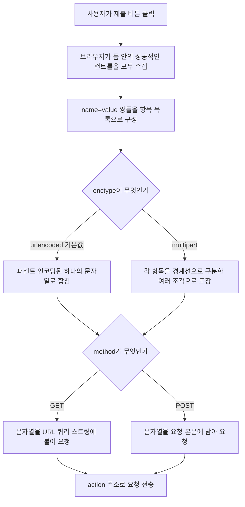

<Callout type="info">
  **이번 문서의 목표:** 이 문서를 다 읽으면 `method`가 `GET`인지 `POST`인지에 따라 데이터가 어디에 실리는지, `enctype` 값에 따라 그 데이터가 어떤 형식의 문자열로 바뀌는지 예측하고, 브라우저 개발자 도구로 실제 전송 내용을 확인할 수 있습니다.
</Callout>

## 지금까지 만든 봉투는 어디로, 어떻게 가는가

13~15편에서 `<form>` 안에 `<label>`·`<input>`·`<select>`·`<textarea>`·`<button>`을 정확히 배치하는 법을 배웠습니다. 이제 마지막 조각입니다. "제출" 버튼을 누르는 순간, 봉투 안의 `name`=`value` 쪽지들이 **정확히 어떤 문자열**로 바뀌어, **어디로**, **어떤 방식**으로 전송되는지를 이 편에서 끝까지 관찰합니다.

이 동작을 결정하는 것은 `<form>`의 세 속성 `method`, `action`, `enctype`입니다.

> **쉽게 말하면:** `action`은 봉투를 보낼 주소, `method`는 봉투를 우편함에 넣을지 직접 들고 갈지 정하는 방법, `enctype`은 봉투 안 내용물을 어떤 방식으로 포장할지 정하는 규칙입니다.

## 1. `action`과 기본 제출 동작

`action` 속성은 폼이 제출될 목적지 URL을 지정합니다. 생략하면 13편에서 언급했듯이 **현재 문서의 URL**이 목적지가 됩니다.

```html
<form action="/search">
  <input type="search" name="q" />
  <button type="submit">검색</button>
</form>
```

버튼을 누르면 브라우저는 새 페이지를 요청하는 것과 똑같은 방식으로 `/search` 주소에 요청을 보내고, 그 응답으로 온 문서를 화면 전체에 새로 그립니다. 이것이 폼의 **기본 제출 동작**(default submission behavior)입니다 — 자바스크립트를 단 한 줄도 쓰지 않아도 성립하는, HTML만의 힘입니다. 이 기본 동작을 자바스크립트로 가로채 페이지 전체를 새로고침하지 않고 처리하는 방법(`preventDefault`, `fetch`를 이용한 비동기 전송)은 `javascript/web_apis` 과목의 몫입니다.

## 2. `method` — GET인가 POST인가

### 데이터가 실리는 위치가 다르다

`method` 속성은 `GET`과 `POST` 두 값 중 하나를 가지며, 데이터를 요청의 **어느 부분**에 담을지를 결정합니다.

| 구분 | `GET` | `POST` |
|------|-------|--------|
| 데이터 위치 | URL 뒤에 붙는 쿼리 스트링(query string, 물음표 뒤 문자열) | HTTP 요청의 본문(body) |
| URL에 데이터가 보이는가 | 보인다 — 주소창에 그대로 노출 | 보이지 않는다 — 주소창은 `action` 값 그대로 |
| 북마크·공유 가능 여부 | 가능 — URL 자체가 검색 결과를 재현한다 | 불가능 — 본문은 URL에 없다 |
| 브라우저 캐시 | 캐시될 수 있다 | 기본적으로 캐시되지 않는다 |
| 다시 제출(새로고침) 시 위험 | 상대적으로 안전(같은 조회를 반복할 뿐) | 위험할 수 있다(같은 결제·등록이 중복될 수 있어 브라우저가 재확인 창을 띄우기도 한다) |
| 적합한 용도 | 검색, 필터링처럼 서버 상태를 바꾸지 않는 조회 | 로그인, 회원가입, 파일 업로드처럼 서버 상태를 바꾸는 제출 |

```html
<!-- GET: 제출 후 주소창이 /search?q=리액트 로 바뀐다 -->
<form action="/search" method="get">
  <input type="text" name="q" value="리액트" />
</form>

<!-- POST: 주소창은 /login 그대로이고, q=... 값은 화면에 보이지 않는다 -->
<form action="/login" method="post">
  <input type="text" name="username" />
  <input type="password" name="password" />
</form>
```

`method`를 생략하면 13편에서 언급한 대로 기본값은 `GET`입니다. 로그인 폼처럼 비밀번호를 다루는 폼에 실수로 `method`를 안 적으면, 비밀번호가 **주소창에 그대로 노출**되고 브라우저 방문 기록에까지 남는 심각한 문제가 생깁니다.

### 제출 과정을 흐름으로 보기



## 3. `enctype` — 내용물을 어떻게 포장하는가

`enctype`(인코딩 타입, 인코딩 방식)은 `method`가 `POST`일 때만 의미가 있는 속성으로, 요청 본문에 담기는 데이터의 형식을 정합니다.

| `enctype` 값 | 형식 | 언제 쓰는가 |
|---------------|------|--------------|
| `application/x-www-form-urlencoded` (기본값) | `name=value` 쌍을 `&`로 이어 붙인 하나의 문자열 | 텍스트 위주 데이터. 지정하지 않으면 항상 이 값 |
| `multipart/form-data` | 각 항목을 경계 문자열(boundary)로 나눈 여러 조각으로 포장 | `<input type="file">`로 실제 파일을 전송할 때 **반드시 필요** |
| `text/plain` | 인코딩을 거의 하지 않고 대략적인 텍스트 형태로 전송 | 사실상 쓰이지 않는다. 디버깅 목적 외에는 실무에서 선택하지 않는다 |

<Callout type="warning">
  **자주 틀리는 점:** `<input type="file">`이 있는 폼에 `enctype`을 `multipart/form-data`로 바꾸지 않으면, 파일 선택 자체는 화면에서 되지만 서버는 파일의 **이름만** 텍스트로 받을 뿐 실제 파일 내용을 받지 못합니다. 파일 업로드 폼을 만들 때 가장 흔히 빠지는 함정입니다.
</Callout>

```html
<form action="/upload" method="post" enctype="multipart/form-data">
  <label for="첨부파일">첨부 파일</label>
  <input type="file" id="첨부파일" name="attachment" />
  <button type="submit">업로드</button>
</form>
```

### `application/x-www-form-urlencoded` 실제로 조립해 보기

이름이 "김민준", 메모가 "안녕 세상"인 두 값을 `GET`으로 제출한다고 해봅시다. 브라우저는 다음 단계를 거쳐 하나의 문자열을 만듭니다. 중간 단계를 생략하지 않고 그대로 따라가 보겠습니다.

**1단계 — `name`=`value` 쌍을 만든다.**

```text
name = 김민준
memo = 안녕 세상
```

**2단계 — 값 안의 특수문자를 퍼센트 인코딩(percent-encoding)한다.** 공백은 `+`로, 한글이나 그 외 특수문자는 UTF-8 바이트를 `%XX` 형태의 16진수로 바꾼다.

```text
name=%EA%B9%80%EB%AF%BC%EC%A4%80
memo=%EC%95%88%EB%85%95+%EC%84%B8%EC%83%81
```

**3단계 — 각 쌍을 `&`로 잇는다.**

```text
name=%EA%B9%80%EB%AF%BC%EC%A4%80&memo=%EC%95%88%EB%85%95+%EC%84%B8%EC%83%81
```

이 최종 문자열이 `GET`이면 URL 뒤에 물음표를 붙여 그대로 이어지고(`/search?name=...&memo=...`), `POST`이면 요청 본문에 그대로 담깁니다. 사람이 보기엔 알아볼 수 없는 문자 나열이지만, 서버는 이 규칙을 거꾸로 적용해(퍼센트 디코딩) 원래 문자열 "김민준", "안녕 세상"을 정확히 복원합니다.

### 직접 관찰하기

브라우저 개발자 도구의 네트워크(Network) 탭을 열어 두면 실제 요청에 담긴 문자열을 그대로 볼 수 있습니다. 아래 실습기는 개발자 도구 없이도 같은 정보를 화면에서 바로 확인할 수 있게, 폼이 실제로 만드는 인코딩 결과를 자바스크립트로 미리 계산해 보여줍니다. 페이지 이동 없이 결과만 관찰하는 용도이며, 실제 서버로 보내는 것은 여전히 브라우저의 기본 제출 동작이 담당합니다.

<CodePlayground
  template="vanilla"
  activeFile="/index.js"
  showConsole
  label="urlencoded 인코딩 결과를 직접 확인하기 — 값을 바꿔서 다시 확인해 보세요"
  files={{
    '/index.html': `<form id="샘플폼">
  <p><label>이름 <input type="text" name="name" value="김민준" /></label></p>
  <p><label>메모 <input type="text" name="memo" value="안녕 세상" /></label></p>
  <button type="button" id="확인버튼">인코딩 결과 미리 보기</button>
</form>
<pre id="결과영역">여기에 인코딩 결과가 표시됩니다</pre>`,
    '/index.js': `const 폼 = document.getElementById("샘플폼");
const 확인버튼 = document.getElementById("확인버튼");
const 결과영역 = document.getElementById("결과영역");

확인버튼.addEventListener("click", () => {
  const 폼데이터 = new FormData(폼);
  // URLSearchParams는 application/x-www-form-urlencoded 형식으로
  // 자동 변환해 주는 브라우저 내장 도구다
  const 쿼리문자열 = new URLSearchParams(폼데이터).toString();
  결과영역.textContent =
    "GET이라면: /search?" + 쿼리문자열 + "\\n" +
    "POST 본문이라면: " + 쿼리문자열;
  console.log(쿼리문자열);
});`,
  }}
/>

값을 "김민준"에서 다른 이름으로 바꾸거나 특수문자(`&`, `=`)를 넣어 보세요. `&`나 `=`처럼 인코딩 문자열 안에서 이미 특별한 의미(구분자)로 쓰이는 문자도 퍼센트 인코딩되어, 실제 데이터 값과 구분자가 절대 섞이지 않는다는 것을 확인할 수 있습니다.

## 접근성과 연결되는 지점

`GET`으로 제출되는 검색·필터 폼은 결과 페이지의 URL 자체가 그 검색 조건을 표현하므로, 스크린 리더 사용자나 키보드만 쓰는 사용자도 같은 URL을 다시 방문해 동일한 결과를 재현할 수 있습니다. 반대로 `POST` 폼(로그인, 결제)은 뒤로 가기 후 다시 진행할 때 브라우저가 "양식을 다시 제출하시겠습니까" 같은 확인 창을 띄우는 경우가 있는데, 이 확인 창의 문구와 동작은 브라우저마다 다르므로 결과를 단정하지 않고 사용자에게 별도의 안내 문구를 제공하는 것이 안전합니다.

## 자주 틀리는 점

- 로그인 폼에 `method="get"`을 그대로 두어 비밀번호가 URL과 방문 기록에 노출된다.
- 파일 업로드 폼에서 `enctype="multipart/form-data"`를 빼먹어 파일 이름만 전송되고 내용은 전송되지 않는다.
- `GET`과 `POST`를 "보안 차이"로만 이해한다 — 실제로는 둘 다 암호화되지 않은 평문이며, 통신 자체의 보안은 HTTPS가 담당한다. `GET`/`POST`의 차이는 데이터가 실리는 위치와 용도(조회 vs 상태 변경)에 있다.
- 체크박스가 미체크 상태일 때(14편 참조) 인코딩된 문자열에서 그 이름 자체가 통째로 빠진다는 것을 잊고, 서버 쪽에서 항상 그 키가 온다고 가정한다.

## 핵심 정리

- `action`을 생략하면 현재 URL로, `method`를 생략하면 `GET`으로 제출되는 것이 폼의 기본 동작이다.
- `GET`은 데이터를 URL 쿼리 스트링에, `POST`는 요청 본문에 담는다. 조회는 `GET`, 상태를 바꾸는 제출은 `POST`가 원칙이다.
- `enctype`은 `POST` 본문의 형식을 정한다. 기본값 `application/x-www-form-urlencoded`는 텍스트를, `multipart/form-data`는 파일 전송에 필수다.
- 퍼센트 인코딩은 값 안의 특수문자를 `%XX` 형태로 바꿔, 데이터 값과 `&`·`=` 같은 구분자가 섞이지 않게 한다.

## 마무리 복습

<Quiz
  questionNumber={1}
  question="method 속성을 생략했을 때 폼의 기본 제출 방식은?"
  options={['POST', 'GET', 'PUT', '브라우저마다 임의로 결정된다']}
  correctAnswer={2}
  explanation="method를 생략하면 명세에 정의된 기본값인 GET으로 제출된다. 브라우저 구현마다 다르게 동작하지 않는다."
  optionExplanations={['POST는 명시적으로 지정해야 하는 값이다', '정답 — 생략 시 기본값은 GET이다', 'PUT은 폼의 method 속성에 쓰이는 값이 아니다', '명세에 정의된 고정 기본값이며 브라우저마다 다르지 않다']}
/>

<Quiz
  questionNumber={2}
  question="검색 필터처럼 서버 상태를 바꾸지 않는 조회 폼에 더 적합한 method는?"
  options={['GET — URL로 결과를 재현하고 북마크할 수 있다', 'POST — 본문에 숨겨져 안전하다', 'PATCH — 부분 수정이라 더 가볍다', 'method는 조회와 상태 변경에 차이를 주지 않는다']}
  correctAnswer={1}
  explanation="GET은 데이터가 URL에 실려 북마크·공유·캐시가 가능하므로 검색·필터처럼 서버 상태를 바꾸지 않는 조회에 적합하다. POST는 상태를 바꾸는 제출에 쓰인다."
  optionExplanations={['정답 — URL 재현 가능성이 조회 폼에 적합한 이유다', 'POST가 GET보다 안전하다는 것은 흔한 오해이며 둘 다 평문이다', 'PATCH는 폼의 method 속성에 쓰이는 값이 아니다', '용도에 따라 GET과 POST를 구분해 쓰는 것이 원칙이다']}
/>

<Quiz
  questionNumber={3}
  question="파일을 실제로 서버에 전송하려면 form에 반드시 지정해야 하는 것은?"
  options={['method를 GET으로 지정', 'enctype을 multipart/form-data로 지정', 'action을 생략', 'input의 type을 text로 지정']}
  correctAnswer={2}
  explanation="파일 업로드는 enctype을 multipart/form-data로 지정해야 실제 파일 내용이 전송된다. 지정하지 않으면 파일 이름만 텍스트로 전송된다."
  optionExplanations={['파일 업로드는 일반적으로 POST와 함께 쓰인다', '정답 — multipart/form-data가 파일 전송에 필수다', 'action은 목적지 주소이며 파일 전송 여부와 무관하다', 'file 타입이어야 파일 선택 창이 열린다']}
/>

<Quiz
  questionNumber={4}
  question="enctype의 기본값(생략 시 적용되는 값)은?"
  options={['multipart/form-data', 'text/plain', 'application/x-www-form-urlencoded', 'application/json']}
  correctAnswer={3}
  explanation="enctype을 생략하면 기본값인 application/x-www-form-urlencoded가 적용된다. 이는 name=value 쌍을 & 로 이은 문자열 형식이다."
  optionExplanations={['multipart/form-data는 파일 전송 시 명시적으로 지정해야 한다', 'text/plain은 실무에서 거의 쓰이지 않는 값이다', '정답 — 생략 시 기본값이 이 형식이다', 'application/json은 form의 enctype 값으로 쓰이지 않는다']}
/>

<Quiz
  questionNumber={5}
  question="GET과 POST에 대한 설명으로 옳지 않은 것은?"
  options={['GET은 데이터를 URL 쿼리 스트링에 담는다', 'POST는 데이터를 요청 본문에 담는다', 'POST를 쓰면 데이터가 자동으로 암호화되어 안전하다', 'GET으로 제출된 URL은 북마크로 저장할 수 있다']}
  correctAnswer={3}
  explanation="POST는 데이터가 URL에 노출되지 않을 뿐, 암호화되지 않은 평문으로 전송된다. 통신 자체의 암호화는 HTTPS가 담당하는 별개의 문제다."
  optionExplanations={['GET의 실제 동작 방식이다', 'POST의 실제 동작 방식이다', '정답(틀린 설명) — POST 자체가 데이터를 암호화하지는 않는다', 'GET 제출 결과 URL은 실제로 북마크와 공유가 가능하다']}
/>

<Quiz
  questionNumber={6}
  question="이름이 김철수이고 값에 공백이 포함된 데이터를 urlencoded 방식으로 인코딩할 때, 공백은 어떻게 바뀌는가?"
  options={['공백이 그대로 유지된다', '밑줄(_) 문자로 바뀐다', '더하기(+) 기호나 %20으로 바뀐다', '공백이 있으면 인코딩 자체가 실패한다']}
  correctAnswer={3}
  explanation="application/x-www-form-urlencoded 방식에서 공백은 더하기 기호나 %20 형태의 퍼센트 인코딩으로 치환되어 안전하게 전송된다."
  optionExplanations={['공백을 그대로 두면 URL 구조를 해칠 수 있어 치환이 필요하다', '밑줄로 치환하는 규칙은 존재하지 않는다', '정답 — 더하기 기호나 퍼센트 인코딩으로 치환된다', '공백이 있어도 인코딩 과정에서 정상적으로 치환되어 전송된다']}
/>

<Quiz
  questionNumber={7}
  question="퍼센트 인코딩(percent-encoding)이 필요한 근본적인 이유는?"
  options={['데이터를 압축해 전송 속도를 높이기 위해', '값 안의 특수문자가 &나 = 같은 구분자와 섞이는 것을 막기 위해', '서버가 한글을 이해하지 못하기 때문에', '브라우저가 임의로 정한 장식적인 절차이기 때문']}
  correctAnswer={2}
  explanation="퍼센트 인코딩은 값 안에 & 나 = 같은 문자가 그대로 있으면 구분자와 값이 뒤섞이는 문제를 막기 위해, 그런 문자들을 %XX 형태로 안전하게 바꾸는 절차다."
  optionExplanations={['압축이 아니라 안전한 전송을 위한 치환이다', '정답 — 구분자와 값의 충돌을 막는 것이 핵심 목적이다', '서버가 한글을 이해 못 하는 것이 아니라 전송 형식의 문제다', '구분자 충돌을 막는 실질적인 목적이 있는 절차다']}
/>

<Quiz
  questionNumber={8}
  question="체크박스가 미체크 상태일 때 urlencoded 인코딩 결과에 대한 설명으로 옳은 것은?"
  options={['해당 name=false 라는 쌍이 포함된다', '해당 name 자체가 결과 문자열에서 빠진다', '빈 문자열 값으로 name= 형태가 포함된다', '인코딩 과정에서 오류가 발생한다']}
  correctAnswer={2}
  explanation="14편에서 배운 대로 미체크 체크박스는 애초에 성공적인 컨트롤로 수집되지 않으므로, 인코딩된 최종 문자열에도 그 name 자체가 나타나지 않는다."
  optionExplanations={['false라는 값으로 오는 경우는 없다', '정답 — 이름표 자체가 결과 문자열에서 빠진다', '빈 값으로도 포함되지 않고 아예 나타나지 않는다', '이 상황은 오류가 아니라 정상적인 동작이다']}
/>

## 참고 자료

- [MDN - Your first form](https://developer.mozilla.org/en-US/docs/Learn_web_development/Extensions/Forms/Your_first_form)
- [MDN - Sending form data](https://developer.mozilla.org/en-US/docs/Learn_web_development/Extensions/Forms/Sending_and_retrieving_form_data)
- [WHATWG - Constructing the form data set](https://html.spec.whatwg.org/multipage/form-control-infrastructure.html#constructing-form-data-set)
