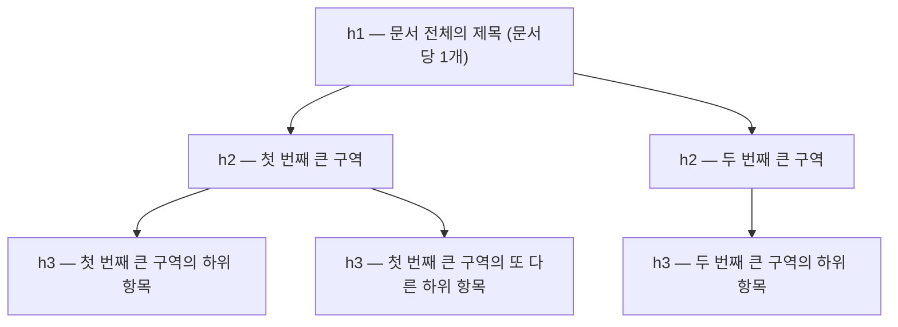

<Callout type="info">
  **이번 문서의 목표:** 이 문서를 다 읽으면 "섹션마다 `h1`을 새로 시작해도 된다"는 옛 설명이 왜 틀렸는지 근거와 함께 설명하고, 지금 실무에서 지켜야 할 제목 랭크 구조 규칙을 스스로 적용할 수 있게 됩니다.
</Callout>

## 한때 이렇게 가르쳤다

HTML5가 `section`·`article` 같은 시맨틱 요소를 도입하던 시절, 오래된 교재와 튜토리얼에는 이런 설명이 흔했습니다.

> "`section`이나 `article` 안에서는 `h1`을 다시 써도 된다. 브라우저가 각 섹션의 중첩 깊이를 계산해서 실제로는 `h2`, `h3`처럼 보이는 **문서 아웃라인**(document outline, 문서 개요)을 자동으로 만들어 준다."

이 설명은 한때 HTML5 초안(스펙 초안 단계)에 실제로 적혀 있었습니다. 그래서 "섹션 하나당 `h1` 하나씩" 같은 조언이 여러 책과 강의에 퍼졌습니다. 문제는 **이 알고리즘을 실제로 구현한 브라우저가 단 하나도 없었다는 것**입니다. 개발자 도구를 열어 확인해도, 스크린 리더로 들어봐도, "섹션별로 h1을 다시 시작했더니 h2로 자동 강등되었다"는 동작은 어디에도 없었습니다.

> **쉽게 말하면:** 문서 아웃라인 알고리즘은 설계도만 있고 한 번도 지어진 적 없는 건물입니다. 설계도가 책에 실렸다고 해서 그 건물이 실제로 서 있는 것은 아닙니다.

## 2022년, 스펙에서 완전히 제거되다

2022년 7월, WHATWG는 HTML Living Standard에서 **문서 아웃라인 알고리즘**(outline algorithm) 관련 조항을 통째로 삭제했습니다. "구현되지 않은 기능을 스펙에 남겨두면 오히려 잘못된 기대를 심는다"는 판단이었습니다. 지금 WHATWG 스펙과 MDN의 heading 요소 문서에는 오히려 반대 방향의 경고문이 실려 있습니다. **"문서 아웃라인 알고리즘에 기대지 마라. 어떤 브라우저나 스크린 리더도 이를 구현하지 않았다."**

이 사실이 왜 중요한지는 실습으로 확인하는 것이 가장 빠릅니다. 아래 실습기의 마크업은 "섹션마다 `h1`을 새로 쓴" 옛 방식입니다. 코드 자체를 눈으로 읽으면서, 스크린 리더가 이 페이지에서 실제로 만나게 될 제목 목록을 상상해 보세요.

<CodePlayground
  template="static"
  activeFile="/index.html"
  label="섹션마다 h1을 새로 쓴 옛날 방식 — 실제로는 어떻게 읽히는가"
  files={{
    '/index.html': `<!doctype html>
<html lang="ko">
<head>
  <meta charset="utf-8" />
  <title>옛날 방식 예시</title>
  <link rel="stylesheet" href="styles.css" />
</head>
<body>
  <h1>제노의 블로그</h1>

  <section>
    <h1>콘텐츠 모델 이해하기</h1>
    <p>이 h1은 "섹션 안이니까 h2급으로 자동 강등될 것"이라 기대하고 쓴 것입니다.</p>

    <section>
      <h1>flow와 phrasing의 차이</h1>
      <p>중첩 section 안에서 또 h1을 썼습니다. 기대로는 h3급이어야 합니다.</p>
    </section>
  </section>

  <p>실제 결과: 접근성 트리와 제목 목록에는 h1이 세 번 나란히 찍힙니다. 어떤 브라우저도 중첩 깊이를 계산해 랭크를 낮춰주지 않습니다.</p>
</body>
</html>`,
    '/styles.css': `body { font-family: system-ui, sans-serif; max-width: 640px; margin: 0 auto; padding: 16px; }
section { border-left: 3px solid #ddd; padding-left: 16px; margin: 16px 0; }`,
  }}
/>

브라우저 개발자 도구의 접근성 트리(Accessibility 탭)를 열어 이 페이지를 확인하면, `h1`이 강등되기는커녕 **동일한 랭크의 `h1`이 세 개 나란히** 나타납니다. 스크린 리더 사용자가 제목 목록으로 페이지를 탐색할 때, "블로그 이름"과 "본문 소제목"과 "더 세부 소제목"을 전부 똑같이 최상위 제목으로 듣게 됩니다. 정보의 위계(hierarchy, 계층 구조)가 완전히 사라진 것입니다.

## 지금 실무에서 지키는 실제 규칙

문서 아웃라인 알고리즘이 사라진 자리를 대신하는 것은 복잡한 자동 계산이 아니라, 오히려 더 단순한 원칙입니다.

1. **문서 하나에 `h1`은 원칙적으로 하나만** 둡니다. 그 페이지의 가장 중요한 제목(글 제목, 페이지 제목)입니다.
2. **제목 레벨은 건너뛰지 않습니다.** `h1` 다음에 바로 `h4`로 뛰지 않고, `h2` → `h3` 순서로 내려갑니다. 반대로 다시 올라갈 때는(새로운 큰 구역이 시작될 때는) `h2`로 돌아가는 것이 자연스럽습니다.
3. **제목 레벨은 시각적 크기가 아니라 콘텐츠의 논리적 위계**를 반영합니다. `h3`가 `h2`보다 커 보이게 CSS로 스타일링해도 됩니다. HTML의 제목 레벨과 화면에 보이는 글자 크기는 별개의 문제입니다(글자 크기는 CSS의 몫 — `css/css_fundamentals` 참조).



이 규칙에 따라 방금 실습기의 마크업을 고치면 다음과 같습니다.

```html
<h1>제노의 블로그</h1>

<section>
  <h2>콘텐츠 모델 이해하기</h2>
  <p>...</p>

  <section>
    <h3>flow와 phrasing의 차이</h3>
    <p>...</p>
  </section>
</section>
```

바뀐 것은 딱 하나, **랭크를 개발자가 직접 정확히 매긴 것**뿐입니다. `section`을 몇 겹 중첩했느냐와 무관하게, 제목 레벨은 항상 손으로 정확히 지정해야 합니다.

## article이 여러 개일 때

같은 페이지에 `article`이 여러 개 있는 목록형 페이지(블로그 목록, 뉴스 목록)에서는 예외적인 패턴이 하나 있습니다. 각 `article`의 대표 제목은 보통 페이지 전체의 `h1`과 같은 레벨인 `h2`로 맞춥니다. 각 글이 "그 페이지 안에서 나란히 놓인 독립적인 단위"이기 때문입니다.

| 상황 | 제목 레벨 규칙 |
|------|----------------|
| 페이지 전체 제목 | `h1` 하나 |
| 페이지 안의 큰 구역(section) | `h2` |
| 목록 페이지의 각 article 대표 제목 | 보통 `h2` (서로 나란한 단위이므로) |
| article 안에서 더 세부 구역 | `h3`, `h4`… 순서대로 |

## 왜 이 사실이 중요한가 — 시맨틱 요소와 제목의 역할 분리

17편에서 `section`·`article` 같은 요소가 랜드마크와 문서 구조를 만든다고 배웠습니다. 이번 편의 결론은 그 구조와 **제목 랭크는 서로 독립적인 두 가지 정보**라는 것입니다. `section`을 쓴다고 제목 레벨이 저절로 정해지지 않고, 개발자가 두 가지를 각각 올바르게 관리해야 합니다.

<Callout type="warning">
  **자주 틀리는 점:** "옛날 튜토리얼에서 섹션마다 h1을 써도 된다고 배웠는데, 그럼 지금은 왜 틀렸나?"라는 질문을 종종 받습니다. 답은 "그 알고리즘은 스펙 초안에만 있었고 어떤 브라우저도 구현하지 않았으며, 2022년에 스펙에서 완전히 삭제되었다"입니다. 지금 기준으로 이 방식을 쓰면 스크린 리더 사용자에게는 같은 레벨의 제목이 반복해서 나열되는 것으로만 들립니다.
</Callout>

## 핵심 정리

- "섹션마다 h1을 새로 시작하면 자동으로 아웃라인이 생긴다"는 설명은 어떤 브라우저·스크린 리더도 구현한 적 없는 알고리즘에 근거했고, 2022년 7월 WHATWG 스펙에서 완전히 삭제되었다.
- 지금 실무 규칙은 단순하다. 문서당 `h1` 하나, 레벨을 건너뛰지 않는 순차적 랭크(`h1` → `h2` → `h3`).
- 제목 레벨은 콘텐츠의 논리적 위계를 나타낼 뿐, 화면에 보이는 글자 크기와는 별개다(글자 크기는 CSS가 결정).
- `section`·`article` 같은 시맨틱 요소가 만드는 구조와 제목 랭크는 서로 독립적인 정보이며, 둘 다 개발자가 직접 정확히 관리해야 한다.
- 목록형 페이지에서 여러 `article`이 나란히 있을 때는 각 대표 제목을 보통 같은 레벨(`h2`)로 맞춘다.

## 마무리 복습

<Quiz
  questionNumber={1}
  question="문서 아웃라인 알고리즘에 대한 설명으로 옳은 것은?"
  options={['현재도 모든 주요 브라우저가 구현하고 있다', '2022년 7월 WHATWG 스펙에서 완전히 제거되었으며 어떤 브라우저도 구현한 적이 없다', 'CSS의 그리드 레이아웃 계산 방식이다', 'h1을 여러 번 쓰지 못하게 막는 검증 규칙이다']}
  correctAnswer={2}
  explanation="문서 아웃라인 알고리즘은 어떤 브라우저나 스크린 리더도 구현한 적이 없으며, 2022년 7월 WHATWG 스펙에서 완전히 삭제되었다."
  optionExplanations={['구현된 적이 없어 삭제된 알고리즘이다', '정답 — 스펙 초안에만 있었고 구현되지 않아 삭제되었다', '문서 구조에 관한 개념이지 CSS 레이아웃과 무관하다', 'h1을 여러 번 쓰는 것 자체를 막지는 않는다, 다만 랭크 위계에 맞게 써야 한다']}
/>

<Quiz
  questionNumber={2}
  question="섹션마다 h1을 새로 시작해도 된다고 배웠던 옛 설명이 실제로는 어떻게 동작하는가?"
  options={['브라우저가 중첩 깊이를 계산해 h2, h3로 자동 강등한다', '스크린 리더가 알아서 순서를 재배치한다', '동일한 랭크의 h1이 여러 개 나란히 존재하는 것으로 접근성 트리에 나타난다', 'CSS가 자동으로 글자 크기를 줄여준다']}
  correctAnswer={3}
  explanation="자동 강등 알고리즘은 구현된 적이 없으므로, 섹션마다 h1을 쓰면 동일한 랭크의 h1이 여러 개 나열되는 것으로 실제 접근성 트리에 나타난다."
  optionExplanations={['이 자동 강등은 구현된 적이 없다', '스크린 리더는 마크업된 그대로만 전달한다', '정답 — 실제로는 동일 랭크가 반복된다', 'CSS와 제목 랭크는 별개의 문제다']}
/>

<Quiz
  questionNumber={3}
  question="지금 실무에서 권장하는 제목 레벨 규칙으로 옳은 것은?"
  options={['h1은 문서당 여러 개 써도 무방하다', '레벨을 건너뛰지 않고 순차적으로 내려간다(h1 다음 h2, 그 다음 h3)', 'section 중첩 깊이만큼 항상 레벨을 하나씩 낮춘다', '제목 레벨은 화면에 보이는 글자 크기와 항상 일치해야 한다']}
  correctAnswer={2}
  explanation="레벨을 건너뛰지 않고 h1 다음에는 h2, 그 다음에는 h3 순서로 내려가는 것이 현재 권장되는 규칙이다."
  optionExplanations={['원칙적으로 h1은 문서당 하나가 권장된다', '정답 — 순차적 랭크가 핵심 규칙이다', 'section 중첩과 제목 레벨은 자동으로 연동되지 않으며 개발자가 직접 지정해야 한다', '제목 레벨은 논리적 위계이고 글자 크기는 CSS의 몫이라 서로 별개다']}
/>

<Quiz
  questionNumber={4}
  question="블로그 글 목록 페이지에서 각 article의 대표 제목 레벨을 정하는 관행으로 가장 알맞은 것은?"
  options={['각 article마다 새로 h1을 쓴다', '각 article의 대표 제목을 보통 h2로 맞춘다, 서로 나란한 단위이기 때문이다', 'article이 몇 번째인지에 따라 h2, h3, h4로 점점 낮춘다', '제목 요소를 아예 쓰지 않고 div와 CSS로만 크게 보이게 한다']}
  correctAnswer={2}
  explanation="목록 페이지의 여러 article은 서로 나란한 독립 단위이므로 대표 제목을 보통 h2로 맞춘다."
  optionExplanations={['문서당 h1은 원칙적으로 하나만 두는 것이 권장된다', '정답 — 나란한 단위이므로 같은 레벨을 쓴다', '순서에 따라 레벨을 낮출 근거가 없다', '제목 요소를 생략하면 스크린 리더 사용자가 탐색할 제목 목록 자체가 사라진다']}
/>

<Quiz
  questionNumber={5}
  question="제목 레벨과 시맨틱 sectioning 요소(section, article 등)의 관계에 대한 설명으로 옳은 것은?"
  options={['section을 쓰면 제목 레벨이 자동으로 계산된다', '둘은 서로 독립적인 정보이며 개발자가 각각 정확히 관리해야 한다', 'article 안에서는 제목 요소를 쓸 수 없다', '제목 레벨은 sectioning 요소 없이는 의미가 없다']}
  correctAnswer={2}
  explanation="sectioning 요소가 만드는 구조와 제목 랭크는 서로 독립적인 정보로, 둘 다 개발자가 직접 올바르게 관리해야 한다."
  optionExplanations={['자동 계산 알고리즘은 존재하지 않는다', '정답 — 서로 독립적이라 둘 다 신경 써야 한다', 'article은 자기만의 제목을 가질 수 있는 섹셔닝 콘텐츠다', '제목 레벨은 sectioning 요소 유무와 무관하게 그 자체로 의미를 가진다']}
/>

<Quiz
  questionNumber={6}
  question="문서 아웃라인 알고리즘이 스펙에서 제거된 이유로 WHATWG가 밝힌 근거에 가장 가까운 것은?"
  options={['성능 문제로 처리 속도가 느려서', '구현되지 않은 기능을 스펙에 남겨두면 잘못된 기대를 심기 때문에', 'CSS 명세와 충돌해서', '보안 취약점이 발견되어서']}
  correctAnswer={2}
  explanation="어떤 브라우저도 구현하지 않은 기능을 스펙에 계속 남겨두는 것이 개발자에게 잘못된 기대를 심는다는 판단으로 삭제되었다."
  optionExplanations={['성능이 아니라 미구현 상태가 근거였다', '정답 — 미구현 기능이 잘못된 기대를 심는다는 판단이었다', 'CSS와의 충돌이 근거로 언급되지 않았다', '보안 문제가 삭제 근거로 언급되지 않았다']}
/>

## 참고 자료

- [MDN - h1–h6: The HTML Section Heading elements](https://developer.mozilla.org/en-US/docs/Web/HTML/Reference/Elements/Heading_Elements)
- [WHATWG - 4.3 Sections](https://html.spec.whatwg.org/multipage/sections.html)
