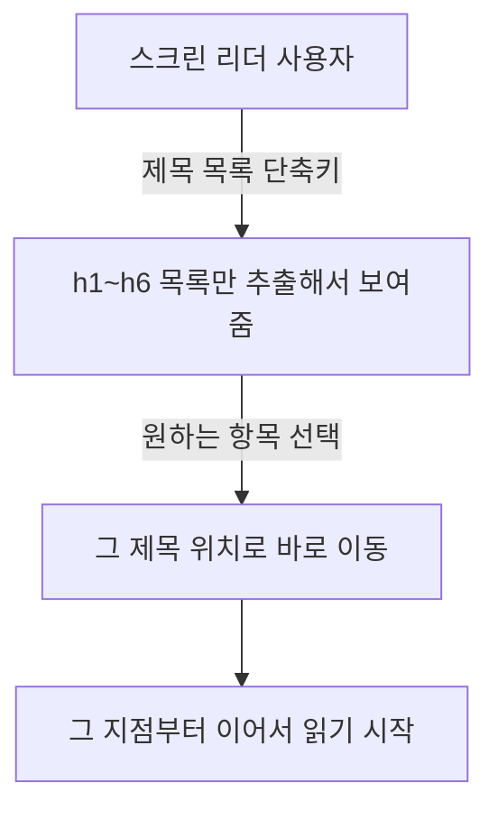

<Callout type="info">
  **이번 문서의 목표:** 이 문서를 다 읽으면 이미지의 대체 텍스트를 장식용/정보성으로 스스로 판단하고, 제목 구조와 랜드마크가 스크린 리더 사용자에게 어떤 탐색 경험을 만드는지 설명하며, "시맨틱 요소만 쓰면 접근성이 끝난다"는 착각을 근거를 들어 반박할 수 있게 됩니다.
</Callout>

## 접근성이라는 말의 뜻

**접근성**(accessibility, 흔히 a11y로 줄여 쓰는데 accessibility의 첫 글자 a와 끝 글자 y 사이에 11개 글자가 있다는 뜻의 숫자 축약입니다)은 "장애가 있는 사람을 포함해 누구나 웹 콘텐츠를 이용할 수 있게 만드는 것"을 뜻합니다. 시각 장애가 있어 화면을 못 보는 사람은 **스크린 리더**(screen reader, 화면 읽기 프로그램)로 페이지를 "듣고", 손 떨림이나 마비로 마우스를 정교하게 움직이기 어려운 사람은 키보드만으로 페이지를 조작합니다. 08편·17편·18편에서 각각 이미지·시맨틱 요소·제목 구조를 배웠는데, 이번 편은 그 셋을 접근성이라는 하나의 렌즈로 모아 정리합니다.

> **쉽게 말하면:** 접근성은 건물의 경사로와 같습니다. 계단만 있는 건물은 휠체어를 탄 사람을 완전히 막습니다. 경사로 하나를 놓는 것이 모든 사람의 출입을 막지 않으면서, 오히려 유모차나 캐리어를 끄는 사람에게도 편리해지는 것처럼, 웹 접근성도 특정 소수만을 위한 것이 아니라 결국 모두에게 더 튼튼한 페이지를 만듭니다.

## 대체 텍스트 — 이미지마다 다시 묻는 질문 (08편 연장)

08편에서 ``의 `alt` 속성 문법을 배웠습니다. 이번 편에서는 **판단 기준**을 정리합니다. 이미지를 만날 때마다 딱 하나만 물으면 됩니다. **"이 이미지가 사라져도 정보가 없어지지 않는가?"**

| 이미지 종류 | alt 값 | 이유 |
|-------------|--------|------|
| 순수 장식용 배경 무늬, 구분선 이미지 | `alt=""` (빈 문자열) | 정보가 없으므로 스크린 리더가 아예 건너뛰게 한다 |
| 상품 사진, 그래프, 설명이 필요한 사진 | 내용을 요약한 텍스트 | 이미지가 전달하는 정보를 텍스트로도 동일하게 전달해야 한다 |
| 링크나 버튼 역할을 하는 아이콘 이미지 | 그 버튼이 하는 동작 설명(예: `alt="검색"`) | 시각적으로는 아이콘이지만 기능은 텍스트로 알려야 한다 |
| 이미 근처 텍스트가 같은 정보를 담고 있는 이미지 | `alt=""` | 같은 정보를 두 번 읽어주면 오히려 방해가 된다 |

<Callout type="warning">
  **자주 틀리는 점:** `alt` 속성 자체를 아예 생략하는 것과 `alt=""`로 비워두는 것은 다릅니다. 속성을 생략하면 스크린 리더는 대체 텍스트가 없다는 사실을 알리려고 파일 이름(`IMG_2024.jpg` 같은)을 그대로 읽어버리기도 합니다. 장식용 이미지라면 `alt=""`를 **명시적으로** 써서 "이 이미지는 의도적으로 정보가 없다"고 알려야 합니다.
</Callout>

## 제목 구조가 만드는 탐색 경로 (18편 연장)

18편에서 제목 레벨을 건너뛰지 않고 순차적으로 매겨야 하는 이유를 다뤘습니다. 이번 편에서 이어지는 이야기는 **그 제목들이 실제로 어떻게 쓰이는가**입니다. 스크린 리더는 대부분 "제목 목록으로 이동" 같은 단축키를 제공합니다. 사용자가 이 단축키를 누르면, 페이지 전체 글을 처음부터 다 듣지 않고도 `h1`부터 `h6`까지 순서대로 나열된 목록만 훑어보고 원하는 구역으로 바로 이동할 수 있습니다.

이 탐색 경험은 목차(table of contents)를 눈으로 훑어보는 것과 똑같습니다. 다만 이 목차가 **눈에 보이는 요소가 아니라 마크업 자체에서 추출**됩니다. 제목 레벨을 대충 매기면(예: 전부 `div`와 CSS 크기 조절로만 "제목처럼 보이게" 만들면), 이 목차 자체가 텅 비어버립니다. 스크린 리더 사용자는 페이지를 처음부터 끝까지 순서대로 듣는 것 외에 다른 선택지가 없어집니다.

## 랜드마크 역할 — 17편의 표를 접근성 관점에서 다시 보기

17편에서 시맨틱 sectioning 요소가 암묵적으로 랜드마크 역할을 갖는다고 배웠습니다. **랜드마크**(landmark, 이정표)라는 이름 그대로, 스크린 리더 사용자는 "랜드마크 목록으로 이동" 단축키로 페이지의 큰 구역(헤더, 내비게이션, 본문, 사이드바, 푸터)만 추려서 바로 건너뛸 수 있습니다.

| 시맨틱 요소 | 암묵적 role | ARIA로 직접 쓴다면 |
|-------------|-------------|---------------------|
| `header` (body 직계일 때) | banner | `role="banner"` |
| `nav` | navigation | `role="navigation"` |
| `main` | main | `role="main"` |
| `aside` | complementary | `role="complementary"` |
| `footer` (body 직계일 때) | contentinfo | `role="contentinfo"` |

**ARIA**(Accessible Rich Internet Applications, 접근 가능한 리치 인터넷 애플리케이션)는 시맨틱 HTML만으로 표현할 수 없는 상황(예: 자바스크립트로 직접 만든 커스텀 위젯)에 접근성 정보를 덧붙이는 속성 모음입니다. 표의 오른쪽 칸처럼 `role` 속성을 직접 쓸 수도 있지만, 시맨틱 요소를 쓰면 이 속성이 **자동으로** 붙으므로 대부분의 경우 `role`을 직접 쓸 필요가 없습니다. "네이티브 HTML 요소가 이미 처리해 주는 것을 ARIA로 다시 흉내 내지 마라"는 접근성 업계의 오래된 원칙이 여기서 나옵니다.

### 이름 붙이기 — 랜드마크가 여러 개일 때

`nav`가 헤더와 푸터에 각각 있으면 둘 다 "navigation"이라는 같은 랜드마크로 들립니다. `aria-label`로 구분 이름을 붙이면 스크린 리더가 "내비게이션, 주 메뉴"와 "내비게이션, 사이트맵"처럼 구분해서 읽어줍니다.

<CodePlayground
  template="static"
  activeFile="/index.html"
  label="랜드마크에 이름 붙이기 — aria-label로 구분하기"
  files={{
    '/index.html': `<!doctype html>
<html lang="ko">
<head>
  <meta charset="utf-8" />
  <title>랜드마크 이름 붙이기</title>
  <link rel="stylesheet" href="styles.css" />
</head>
<body>
  <header>
    <h1>제노의 블로그</h1>
    <nav aria-label="주 메뉴">
      <a href="/">홈</a>
      <a href="/archive">아카이브</a>
    </nav>
  </header>

  <main>
    <h2>가장 최근 글</h2>
    
대체 텍스트, 제목 구조, 랜드마크가 어떻게 이어지는지 정리했습니다.

  </main>

  <footer>
    <nav aria-label="사이트맵">
      <a href="/privacy">개인정보처리방침</a>
      <a href="/contact">문의</a>
    </nav>
    
&copy; 2026 제노의 블로그

  </footer>
</body>
</html>`,
    '/styles.css': `body { font-family: system-ui, sans-serif; max-width: 640px; margin: 0 auto; padding: 16px; }
header, footer { background: #f2f2f2; padding: 12px; }`,
  }}
/>

브라우저 개발자 도구의 접근성 트리를 열어 두 `nav` 요소를 확인해 보세요. `aria-label` 값이 각 랜드마크의 "접근 가능한 이름"(accessible name)으로 그대로 노출됩니다. 이 라벨이 없으면 두 랜드마크는 이름 없이 "navigation"으로만 구분되지 않게 나열됩니다.

## 폼 레이블 연결도 접근성의 일부 (13편과의 연결)

13편에서 배운 `<label>`의 `for`와 입력 요소 `id` 연결은 사실 이번 편의 주제이기도 합니다. 레이블이 정확히 연결되지 않은 입력창은 스크린 리더 사용자에게 "이름 없는 입력창"으로만 들립니다. 시각적으로는 레이블 글자가 입력창 옆에 붙어 있어도, 코드상 연결이 없으면 그 시각적 배치는 스크린 리더에게 아무 의미가 없습니다. 이 사례는 21편 검증 실습에서 실제 오류 메시지로 다시 다룹니다.

## 시맨틱 요소 = 접근성 해결이 아닌 이유

지금까지 본 세 가지(대체 텍스트, 제목 구조, 랜드마크)를 한데 모으면 이 편의 핵심 결론이 나옵니다. **시맨틱 요소는 접근성의 재료일 뿐, 그 자체로 완성품이 아닙니다.**

- `nav`를 세 개 썼는데 이름을 하나도 안 붙이면, 랜드마크는 있지만 구분이 안 됩니다.
- 제목 요소는 다 갖췄는데 레벨을 아무렇게나 매기면(18편의 실수), 탐색 경로가 뒤죽박죽이 됩니다.
- `img`를 다 썼는데 `alt`를 습관적으로 비워두면(장식용이 아닌데도), 정보성 이미지의 내용이 통째로 사라집니다.
- `label`과 `input`을 다 썼는데 `for`/`id`를 안 맞추면, 시각적 레이아웃과 실제 접근성 트리가 따로 놉니다.

<Callout type="warning">
  **자주 틀리는 점:** "시맨틱 태그를 썼으니 접근성 검사를 통과할 것이다"라는 가정은 절반만 맞습니다. 시맨틱 요소는 스크린 리더가 구조를 읽을 수 있는 **최소 조건**을 만들어 줄 뿐입니다. 이름 붙이기, 순차적 제목 레벨, 정확한 대체 텍스트, 레이블 연결까지 갖춰야 실제로 쓸 만한 접근성이 됩니다. 이 네 가지를 확인하는 도구가 21편의 Nu HTML Checker입니다.
</Callout>

## 핵심 정리

- 대체 텍스트를 정할 때는 "이 이미지가 사라지면 정보가 없어지는가"를 묻는다. 장식용은 `alt=""`를 명시적으로 쓰고, 정보성은 내용을 요약해서 채운다.
- 제목 구조는 스크린 리더의 "제목 목록으로 이동" 탐색 경로를 그대로 만든다. 레벨을 대충 매기면 이 경로가 망가진다.
- 시맨틱 요소가 자동으로 부여하는 랜드마크 역할(banner, navigation, main, complementary, contentinfo)은 페이지의 큰 구역을 건너뛰며 탐색하게 해준다.
- 랜드마크가 여러 개(특히 `nav`)일 때는 `aria-label`로 구분 이름을 붙여야 실제로 유용해진다.
- 시맨틱 요소·제목 구조·대체 텍스트·레이블 연결은 각각 접근성의 재료일 뿐이며, 넷 다 갖춰야 실제 접근성이 완성된다.

## 마무리 복습

<Quiz
  questionNumber={1}
  question="순수 장식용 이미지의 alt 속성 처리로 가장 알맞은 것은?"
  options={['alt 속성 자체를 생략한다', 'alt=""로 명시적으로 빈 문자열을 채운다', '이미지 파일 이름을 그대로 alt 값으로 쓴다', '항상 이미지에 대한 상세 설명을 채운다']}
  correctAnswer={2}
  explanation="장식용 이미지는 alt=를 명시적으로 빈 문자열로 채워야 스크린 리더가 의도적으로 정보 없음을 인지하고 건너뛴다. 속성을 생략하면 파일 이름을 읽어버릴 수 있다."
  optionExplanations={['생략하면 파일 이름을 그대로 읽어버릴 위험이 있다', '정답 — 의도적으로 빈 문자열을 명시해야 한다', '파일 이름은 정보를 담고 있지 않아 부적절하다', '장식용 이미지에는 정보가 없으므로 설명을 채울 필요가 없다']}
/>

<Quiz
  questionNumber={2}
  question="스크린 리더의 제목 목록 탐색 기능에 대한 설명으로 옳은 것은?"
  options={['페이지의 h1~h6 요소를 추출해 목차처럼 보여주고 바로 이동하게 해준다', 'CSS로 크게 표시된 텍스트만 모아 보여준다', 'div 요소의 class 이름을 기준으로 목록을 만든다', '이미지의 alt 텍스트만 모아 보여준다']}
  correctAnswer={1}
  explanation="스크린 리더는 제목 요소(h1~h6)를 추출해 목차처럼 제공하며, 사용자는 원하는 항목으로 바로 이동할 수 있다."
  optionExplanations={['정답 — 제목 요소를 추출해 탐색 경로를 만든다', 'CSS 크기는 제목 레벨과 무관한 시각 속성이다', 'class 이름은 접근성 트리와 직접 연결되지 않는다', 'alt 텍스트는 별도의 이미지 목록 기능과 관련된다']}
/>

<Quiz
  questionNumber={3}
  question="nav 요소가 여러 개일 때 접근성을 개선하는 방법으로 가장 알맞은 것은?"
  options={['하나만 남기고 나머지는 div로 바꾼다', '각 nav에 aria-label로 구분 이름을 붙인다', 'nav를 전부 main 안에 넣는다', 'nav 순서를 알파벳순으로 재배열한다']}
  correctAnswer={2}
  explanation="여러 nav가 있을 때는 aria-label로 구분 이름을 붙여야 스크린 리더 사용자가 각 내비게이션을 구분할 수 있다."
  optionExplanations={['필요한 내비게이션을 없애는 것은 해결책이 아니다', '정답 — 이름을 붙여 구분한다', 'main 안에 넣는 것과 이름 구분은 별개 문제다', '순서 재배열은 이름 구분 문제를 해결하지 못한다']}
/>

<Quiz
  questionNumber={4}
  question="ARIA에 대한 설명으로 옳은 것은?"
  options={['모든 HTML 요소에 역할을 새로 지정해야 하는 필수 속성 모음이다', '시맨틱 HTML만으로 표현할 수 없는 상황에 접근성 정보를 덧붙이는 속성 모음이다', 'CSS 선택자의 일종이다', '자바스크립트 없이는 전혀 동작하지 않는다']}
  correctAnswer={2}
  explanation="ARIA는 네이티브 HTML로 표현이 안 되는 커스텀 위젯 등에 접근성 정보를 보충하는 속성 모음이며, 네이티브 요소가 이미 제공하는 역할은 중복해서 지정할 필요가 없다."
  optionExplanations={['시맨틱 요소가 이미 역할을 자동으로 제공하는 경우가 많아 모든 요소에 필수는 아니다', '정답 — 표현이 안 되는 상황을 보충하는 속성 모음이다', 'CSS와는 무관한 HTML 속성 체계다', 'HTML 속성만으로도 정적으로 동작한다']}
/>

<Quiz
  questionNumber={5}
  question="시맨틱 요소와 접근성의 관계에 대한 설명으로 옳지 않은 것은?"
  options={['시맨틱 요소는 랜드마크라는 최소 조건을 만들어 준다', '시맨틱 요소만 쓰면 접근성 검사를 모두 통과한다', '제목 레벨, 대체 텍스트, 레이블 연결까지 갖춰야 실제 접근성이 완성된다', 'nav가 여러 개일 때 이름을 안 붙이면 구분이 안 된다']}
  correctAnswer={2}
  explanation="시맨틱 요소는 접근성의 출발점일 뿐이며, 이름 붙이기·제목 구조·대체 텍스트·레이블 연결까지 갖춰야 실제 접근성이 완성된다."
  optionExplanations={['맞는 설명이다', '정답(틀린 설명) — 시맨틱 요소만으로는 완성되지 않는다', '맞는 설명이다', '맞는 설명이다']}
/>

<Quiz
  questionNumber={6}
  question="label의 for와 input의 id 연결이 접근성에 미치는 영향으로 옳은 것은?"
  options={['연결이 없어도 시각적으로 옆에 붙어 있으면 스크린 리더가 자동으로 인식한다', '연결이 없으면 스크린 리더 사용자에게는 이름 없는 입력창으로 들린다', 'CSS로 레이블 위치를 조정하면 연결 문제가 자동으로 해결된다', 'id 속성은 레이블 연결과 무관하다']}
  correctAnswer={2}
  explanation="시각적 배치와 코드상 연결은 별개이며, for와 id가 연결되지 않으면 스크린 리더는 그 입력창의 이름을 알 수 없다."
  optionExplanations={['시각적 인접함은 스크린 리더에게 아무 의미가 없다', '정답 — 연결이 없으면 이름 없는 입력창으로 들린다', 'CSS는 시각적 배치만 담당하고 접근성 트리 연결과는 무관하다', 'id는 for가 가리키는 대상이므로 레이블 연결의 핵심 요소다']}
/>

## 참고 자료

- [MDN - HTML: A good basis for accessibility](https://developer.mozilla.org/en-US/docs/Learn_web_development/Core/Accessibility/HTML)
- [MDN - Table accessibility](https://developer.mozilla.org/en-US/docs/Learn_web_development/Core/Structuring_content/Table_accessibility)
- [MDN - Global attributes](https://developer.mozilla.org/en-US/docs/Web/HTML/Reference/Global_attributes)
