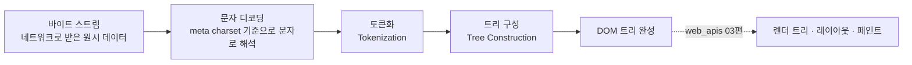
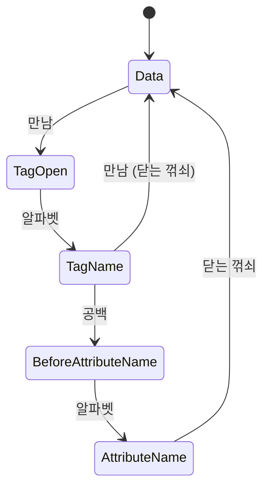
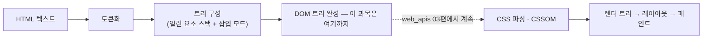

<Callout type="info">
  **이번 문서의 목표:** 이 문서를 다 읽으면 브라우저가 HTML 텍스트를 어떻게 두 단계(토큰화·트리 구성)를 거쳐 DOM 트리로 바꾸는지 설명하고, `<p>1<p>2` 같은 문법이 왜 오류 없이 두 개의 문단으로 렌더링되는지 파싱 규칙으로 근거를 대며 예측할 수 있게 됩니다.
</Callout>

## 왜 파싱 원리를 알아야 하는가

02편에서 태그·속성의 문법을 배웠고, 05편에서 콘텐츠 모델을, 21편에서 그 모델을 어기면 검증기가 어떻게 알려주는지 배웠습니다. 그런데 한 가지 질문이 계속 남아 있었습니다. **검증기가 오류라고 하는 코드도 브라우저는 왜 화면에 뭔가를 띄우는가?**

이 답을 알아야 하는 실무적인 이유가 있습니다. 브라우저 개발자 도구(DevTools)의 요소(Elements) 패널을 열어 보면, 내가 작성한 소스 코드와 실제 **DOM**(Document Object Model, 문서 객체 모델 — 문서를 프로그램이 다룰 수 있는 나무 구조의 객체로 표현한 것) 트리가 다른 경우가 자주 있습니다. 태그가 저절로 닫혀 있거나, 내가 쓰지도 않은 `<tbody>`가 생겨 있거나 합니다. 이걸 "브라우저 버그"로 오해하면 잘못된 곳에서 원인을 찾게 됩니다. 실제로는 **파싱**(parsing, 구문 분석 — 정해진 문법 규칙에 따라 텍스트를 의미 있는 구조로 바꾸는 과정)이라는, 스펙에 낱낱이 정의된 규칙이 작동한 결과입니다.

> **쉽게 말하면:** 파싱은 번역가입니다. 내가 쓴 HTML 텍스트(원문)를 브라우저가 실제로 다룰 수 있는 트리 구조(번역문)로 바꿔주는 역할입니다. 원문에 오탈자가 있어도 유능한 번역가는 문맥으로 알아서 뜻을 짐작해 옮깁니다 — HTML 파서가 하는 일이 정확히 이것입니다.

이 편은 이 과목의 마지막 본론 편으로, HTML 텍스트가 **DOM 트리가 만들어지기까지**만 다룹니다. DOM이 만들어진 이후 CSS와 합쳐져 렌더 트리가 되고 레이아웃·페인트를 거쳐 화면에 그려지는 과정은 `javascript/web_apis` 03편이 다룹니다.

## 파싱의 큰 그림 — 바이트에서 트리까지

브라우저가 서버로부터 HTML 문서를 내려받는 순간부터 DOM이 완성되기까지, 크게 세 단계를 거칩니다.



문자 디코딩 단계에서 04편·19편에서 배운 `<meta charset>`이 실제로 쓰입니다. 브라우저는 이 선언을 보고 바이트 나열을 **UTF-8**(유니코드를 8비트 단위로 인코딩하는 방식) 같은 문자 집합 규칙에 따라 실제 글자로 되돌립니다. 이 단계가 잘못되면 19편에서 다룬 "글자가 깨지는" 현상이 생깁니다.

이 편에서 집중할 것은 그다음의 두 단계, **토큰화**와 **트리 구성**입니다.

## 1단계: 토큰화 — 글자 더미를 의미 단위로 쪼개기

### 정의와 동기

**토큰화**(tokenization)는 문자 스트림을 **토큰**(token, 의미를 가진 최소 단위 조각)이라는 낱개로 잘라내는 작업입니다. HTML 파서에게 토큰은 크게 이런 종류입니다.

- **시작 태그 토큰**: `<p>` → `StartTag(p)`
- **끝 태그 토큰**: `</p>` → `EndTag(p)`
- **문자 토큰**: 태그 사이의 일반 텍스트 한 글자 한 글자
- **주석 토큰**: `<!-- ... -->`
- **DOCTYPE 토큰**: `<!doctype html>`

예를 들어 `<p>Hi</p>`라는 다섯 글자짜리 텍스트는 다음과 같은 토큰 나열로 바뀝니다.

```text
StartTag(p) → Character(H) → Character(i) → EndTag(p)
```

> **쉽게 말하면:** 토큰화는 문장을 단어 단위로 끊어 읽는 것과 같습니다. "나는사과를먹었다"를 사람이 "나는 / 사과를 / 먹었다"로 끊어 이해하듯, 파서는 이어 붙은 글자 더미에서 "여기까지가 태그, 여기부터가 글자"를 판단해 잘라냅니다.

### 상태 기계로 동작한다

WHATWG 스펙은 토큰화 규칙을 **상태 기계**(state machine, 지금 어떤 모드인지에 따라 같은 입력도 다르게 처리하는 방식)로 정의합니다. 예를 들어 `<`를 만나면 "Data 상태"에서 "Tag open 상태"로 전환되고, 그 상태에서 알파벳을 만나면 "Tag name 상태"로 넘어갑니다. 상태 수십 개가 있지만, 핵심 아이디어는 하나입니다. **지금 파서가 "글자를 읽는 중"인지 "태그를 읽는 중"인지에 따라 같은 `<`, `>`, `/` 문자를 완전히 다르게 해석한다**는 것입니다.



이 상태 기계 덕분에 19편에서 배운 "왜 `<`를 그냥 쓰면 안 되는가"의 답도 더 정확해집니다. 파서가 Data 상태에서 `<`를 만나는 순간 무조건 Tag open 상태로 넘어가려고 시도하기 때문에, 그 뒤에 오는 글자에 따라 태그로 해석되거나 파스 에러가 나며 복구됩니다. `&lt;`라는 문자 참조를 쓰면 애초에 `<`라는 실제 글자가 아니라 문자 참조 토큰으로 처리되어 이 혼란 자체가 생기지 않습니다.

## 2단계: 트리 구성 — 토큰을 나무로 쌓기

### 열린 요소 스택이라는 핵심 도구

토큰화가 끝나면, **트리 구성**(tree construction) 단계가 그 토큰들을 실제 DOM 노드로 바꾸고 부모-자식 관계를 엮습니다. 이 단계의 핵심 도구가 **열린 요소 스택**(stack of open elements)입니다. 이름 그대로, 지금 "열려 있는"(아직 닫는 태그를 못 만난) 요소들이 쌓여 있는 자료구조입니다.

동작 규칙은 단순합니다.

- 시작 태그 토큰을 만나면 → 새 요소를 만들어 스택 맨 위에 쌓고, DOM 트리에서 지금 스택 맨 위 요소의 자식으로 붙인다.
- 끝 태그 토큰을 만나면 → 스택 맨 위에서 같은 이름의 요소를 찾아 꺼낸다(닫는다).

`<div><p>글</p></div>`가 어떻게 스택을 오르내리는지 따라가 봅니다.

| 처리한 토큰 | 스택 상태(아래→위) | 방금 일어난 일 |
|-------------|---------------------|------------------|
| `StartTag(div)` | `div` | div 노드 생성, body의 자식으로 연결 |
| `StartTag(p)` | `div`, `p` | p 노드 생성, div의 자식으로 연결 |
| `Character(글)` | `div`, `p` | 텍스트 노드 생성, p의 자식으로 연결 |
| `EndTag(p)` | `div` | 스택에서 p를 꺼냄(닫음) |
| `EndTag(div)` | (비어 있음) | 스택에서 div를 꺼냄(닫음) |

### 삽입 모드라는 또 다른 축

트리 구성 단계는 **삽입 모드**(insertion mode)라는 또 다른 상태도 함께 갖습니다. "initial"(초기) → "before html" → "before head" → "in head" → "after head" → "in body" 순서로 넘어가며, 지금 어느 모드인지에 따라 같은 토큰도 다르게 처리됩니다. 예를 들어 "in head" 모드에서 `<p>` 시작 태그를 만나면, 파서는 "이건 head 안에 있을 요소가 아니다"라고 판단해 **암묵적으로 head를 닫고 body를 열고서** `<p>`를 처리합니다. 04편에서 "`<head>`와 `<body>`를 생략해도 브라우저가 알아서 만들어 준다"고 짧게 언급했던 그 동작의 실제 메커니즘이 바로 이 삽입 모드 전환입니다.

## 왜 "틀려도 뜨는가" — 에러 복구 알고리즘

### 역사적 배경

**XML**(Extensible Markup Language, 확장 가능한 마크업 언어) 같은 엄격한 마크업 언어는 문법이 하나라도 틀리면 파싱을 즉시 멈추고 오류만 보여줍니다("well-formed"하지 않으면 아예 처리하지 않는다는 원칙). 반면 HTML은 정반대의 길을 갔습니다. 이유는 역사에 있습니다. 웹이 커지는 동안 수많은 페이지가 크고 작은 문법 오류를 가진 채로 이미 존재했습니다. 새 브라우저가 "문법이 틀렸으니 안 보여준다"는 태도를 택했다면, 그 브라우저는 기존 웹의 대부분을 못 여는 브라우저가 되어 아무도 쓰지 않았을 것입니다.

그래서 WHATWG는 파싱 규칙을 표준화하면서, **오류 상황에서 정확히 어떻게 복구할지**까지 스펙에 명시했습니다. "브라우저 마음대로 알아서 처리"가 아니라 **"오류가 나면 이렇게 복구하라"는 규칙 자체가 표준의 일부**입니다. 그 결과, 크롬·파이어폭스·사파리가 같은 깨진 HTML을 넣어도 (구현이 스펙을 정확히 따랐다면) 같은 모양의 DOM 트리를 만들어 냅니다.

| 구분 | XML 방식 | HTML 방식 |
|------|----------|-----------|
| 문법 오류 발생 시 | 파싱 중단, 오류만 표시 | 정해진 복구 규칙에 따라 계속 진행 |
| 목표 | 엄격한 일관성 | 하위 호환성 — 오래되고 깨진 문서도 열림 |
| 브라우저마다 결과가 다를 가능성 | 애초에 오류로 멈추므로 비교 대상이 안 됨 | 복구 규칙까지 표준화되어 있어 (구현이 정확하면) 동일 |

<Callout type="warning">
  **자주 틀리는 점:** "브라우저가 알아서 고쳐 주니 문법을 안 지켜도 된다"는 결론은 틀렸습니다. 복구 규칙이 있다는 것과 그 결과가 항상 내가 의도한 모양이라는 것은 다른 이야기입니다. 21편에서 본 대로, 복구된 DOM이 시각적으로는 멀쩡해 보여도 접근성 트리나 콘텐츠 모델 관점에서는 여전히 문제가 남을 수 있습니다. 에러 복구는 "웹이 완전히 멈추지 않게 하는 안전망"이지 "검증을 건너뛰어도 되는 면죄부"가 아닙니다.
</Callout>

## 태그 자동 닫기 — `<p>` 예시로 직접 확인하기

05편에서 `<p>`는 다른 `<p>`를 담을 수 없다고 배웠습니다. 그런데 `<p>1<p>2`처럼 닫는 태그 없이 두 번째 `<p>`가 바로 나오면 어떻게 될까요? 트리 구성 규칙에 "in body" 모드에서 `<p>` 시작 태그를 만났을 때, **만약 열린 요소 스택에 아직 닫히지 않은 `p`가 있다면 그 `p`를 먼저 강제로 닫고 나서 새 `p`를 연다**는 규칙이 정확히 명시되어 있습니다. 즉 파서가 "설마 이렇게 썼겠어"라고 추측하는 것이 아니라, **스펙에 적힌 결정론적 규칙**이 작동한 결과입니다.

아래 실습기에서 소스 코드와 실제 DOM에 만들어진 `<p>` 개수를 직접 비교해 보세요. 소스에는 닫는 태그가 하나도 없지만, DOM에는 문단이 몇 개로 나뉘는지 콘솔에서 확인할 수 있습니다.

<CodePlayground
  template="vanilla"
  activeFile="/index.js"
  showConsole
  label="닫는 태그 없는 p가 실제로 몇 개의 문단이 되는지 확인"
  files={{
    '/index.html': `<div id="app">
  <p>첫 번째 문단
  <p>두 번째 문단
  <p>세 번째 문단
</div>`,
    '/index.js': `const 문단들 = document.querySelectorAll("#app > p");
console.log("실제로 만들어진 p 개수:", 문단들.length);

문단들.forEach((p, i) => {
  console.log((i + 1) + "번째 p의 텍스트:", p.textContent.trim());
  console.log((i + 1) + "번째 p의 부모:", p.parentElement.tagName);
});

// 각 p가 서로의 자식이 아니라 형제 관계인지 확인
console.log("첫 번째 p가 두 번째 p를 포함하는가?",
  문단들[0].contains(문단들[1]));`,
  }}
/>

닫는 태그를 하나도 쓰지 않았는데도 `p`가 세 개의 독립된 형제 노드로 만들어지고, 첫 번째 `p`가 두 번째 `p`를 포함하지 않는다는 사실이 콘솔에 찍힙니다. 이것이 "닫는 태그를 안 써도 되는 것"이 아니라 "파서가 콘텐츠 모델 규칙을 이용해 대신 닫아 준 것"이라는 근거입니다. `<li>`도 같은 원리로, 새 `<li>` 시작 태그를 만나면 이전 `<li>`를 자동으로 닫습니다.

## 암묵적 요소 삽입 — 안 쓴 태그가 생겨나는 경우

트리 구성 단계는 태그를 자동으로 **닫아주는** 것을 넘어, 아예 **없는 태그를 새로 만들어 끼워 넣기도** 합니다.

### `<html>`·`<head>`·`<body>`가 저절로 생기는 이유

04편에서 문서 뼈대를 배울 때 `<html>`·`<head>`·`<body>`를 명시적으로 쓰라고 했지만, 스펙상 이 태그들은 사실 생략해도 파서가 알아서 만들어 줍니다. "initial" 삽입 모드에서 `<html>` 시작 태그가 아닌 다른 토큰(예: 그냥 텍스트나 `<p>`)을 만나면, 파서는 그 토큰을 버리지 않고 **먼저 `<html>` 요소를 스스로 만든 다음** "before head" 모드로 넘어가 처리를 이어갑니다. `<head>`와 `<body>`도 마찬가지입니다.

### `<table>` 안의 암묵적 `<tbody>`

10편에서 표를 만들 때 `<tbody>`를 직접 쓰지 않고 `<table>` 바로 아래에 `<tr>`을 두는 경우가 흔합니다.

```html
<table>
  <tr><td>1</td></tr>
</table>
```

개발자 도구로 이 코드가 만든 DOM을 보면 `<tbody>`가 자동으로 끼워져 있습니다.

```html
<table>
  <tbody>
    <tr><td>1</td></tr>
  </tbody>
</table>
```

트리 구성 규칙이 "in table" 모드에서 `<tr>` 시작 태그를 만나면 "먼저 `tbody`를 암묵적으로 만들어 열고 나서 `tr`을 그 안에 넣으라"고 정해두었기 때문입니다. CSS에서 `table > tr`처럼 `<table>`의 **바로 아래 자식**만 고르는 자식 결합자(child combinator)를 쓰면 걸리지 않고, `table tbody tr`이나 `table tr`(자손 선택자)을 써야 걸리는 이유가 바로 이 암묵적 삽입 때문입니다(선택자 문법 자체는 `css/css_fundamentals` 과목 참조).

아래 실습기에서 실제로 `<tbody>`가 만들어지는지 DOM으로 직접 확인해 보세요.

<CodePlayground
  template="vanilla"
  activeFile="/index.js"
  showConsole
  label="tbody를 안 썼는데도 생기는지 확인"
  files={{
    '/index.html': `<table id="표">
  <tr><td>사과</td><td>100원</td></tr>
  <tr><td>바나나</td><td>200원</td></tr>
</table>`,
    '/index.js': `const 표 = document.getElementById("표");

console.log("table의 첫 번째 자식 태그:", 표.firstElementChild.tagName);
console.log("table 바로 아래 tr을 자식 선택자로 찾으면:",
  document.querySelectorAll("#표 > tr").length, "개");
console.log("tbody를 통해 tr을 찾으면:",
  document.querySelectorAll("#표 > tbody > tr").length, "개");`,
  }}
/>

소스 코드에는 없던 `tbody`가 `table`의 첫 번째 자식으로 잡히고, `#표 > tr` 자식 선택자로는 `tr`을 하나도 못 찾지만 `#표 > tbody > tr`로는 두 개를 찾아낸다는 결과가 나옵니다. 이것이 파서가 암묵적으로 요소를 삽입한 직접적인 증거입니다.

## DOM이 만들어지기까지 — 이 과목이 여기서 멈추는 이유

지금까지 본 토큰화·트리 구성 두 단계를 거치면 브라우저 메모리 안에는 완전한 **DOM 트리**가 만들어집니다. 이 트리는 이제 자바스크립트가 `document.querySelector` 같은 방법으로 읽고 조작할 수 있는 대상이 됩니다(DOM을 조작하는 API 자체는 `javascript/web_apis` 과목의 몫입니다).



DOM 트리가 완성된 이후, CSS가 파싱되어 **CSSOM**(CSS Object Model)이 만들어지고 두 트리가 합쳐져 실제 화면 배치와 그리기로 이어지는 과정은 이 과목의 범위 밖입니다. `javascript/web_apis` 01편이 짚었던 "엔진 vs Web API vs 브라우저 내부 구현"이라는 경계선 중, 이 22편은 정확히 "**HTML 텍스트가 DOM이 되기까지**"라는 앞부분만 다뤘습니다. 나머지 파이프라인은 `/javascript/web_apis/03_...` 편에서 이어집니다.

## 핵심 정리

- 파싱은 바이트 스트림 → 문자 디코딩 → 토큰화 → 트리 구성이라는 순서로 진행되며, 이 과목은 그 결과물인 DOM 트리가 완성되는 지점까지를 다룬다.
- 토큰화는 상태 기계로 정의되어 있어, 같은 `<`나 `>` 문자도 지금 파서가 어떤 상태인지에 따라 다르게 해석된다.
- 트리 구성은 열린 요소 스택과 삽입 모드라는 두 축으로 동작하며, 이 둘의 조합이 태그 자동 닫기와 암묵적 요소 삽입을 모두 설명한다.
- HTML이 "틀려도 뜨는" 이유는 브라우저의 임의 판단이 아니라, **오류 복구 절차 자체가 스펙에 표준화되어 있기 때문**이다. 이는 웹의 하위 호환성을 지키기 위한 설계이지, 검증을 건너뛰어도 된다는 뜻은 아니다.
- `<p>`의 자동 닫기, `<table>`의 암묵적 `<tbody>`, 생략된 `<html>`/`<head>`/`<body>`의 자동 생성은 모두 트리 구성 단계의 구체적인 규칙이 만든 결과이며, 개발자 도구로 직접 확인할 수 있다.

## 마무리 복습

<Quiz
  questionNumber={1}
  question="HTML 파싱에서 토큰화 단계가 하는 일로 가장 정확한 것은?"
  options={['DOM 트리의 부모-자식 관계를 결정한다', 'CSS 선택자와 HTML 요소를 매칭한다', '자바스크립트 코드를 실행 가능한 형태로 컴파일한다', '문자 스트림을 시작 태그·끝 태그·문자 등 의미 있는 최소 단위 조각으로 잘라낸다']}
  correctAnswer={4}
  explanation="토큰화는 문자 스트림을 토큰이라는 낱개 단위로 자르는 단계다. 부모-자식 관계를 결정하는 것은 그다음의 트리 구성 단계가 하는 일이다."
  optionExplanations={['이는 트리 구성 단계의 역할이다', 'CSS 매칭은 렌더 트리 구성 단계(web_apis 영역)의 일이다', '자바스크립트 컴파일은 HTML 파싱과 별개의 과정이다', '정답 — 토큰화의 정의 그대로다']}
/>

<Quiz
  questionNumber={2}
  question="트리 구성 단계에서 열린 요소 스택이 하는 역할은?"
  options={['CSS 우선순위를 계산해 어떤 스타일이 적용될지 결정한다', '아직 닫는 태그를 만나지 않은, 지금 열려 있는 요소들을 순서대로 쌓아 부모-자식 관계를 판단하는 기준으로 쓴다', '네트워크 요청 순서를 관리한다', '자바스크립트 이벤트 핸들러를 등록한다']}
  correctAnswer={2}
  explanation="열린 요소 스택은 아직 닫히지 않은 요소들을 쌓아 두고, 새 토큰이 올 때 스택 맨 위 요소의 자식으로 연결하거나 스택에서 같은 이름을 찾아 닫는 식으로 트리의 부모-자식 관계를 결정하는 핵심 자료구조다."
  optionExplanations={['CSS 우선순위 계산은 CSSOM 관련 개념으로 이 과목 범위 밖이다', '정답 — 트리 구성의 핵심 메커니즘이다', '네트워크 요청 관리와는 무관하다', '이벤트 핸들러 등록은 자바스크립트 실행 이후의 일이다']}
/>

<Quiz
  questionNumber={3}
  question="HTML 파서가 XML과 달리 문법 오류가 있어도 계속 파싱을 진행하는 이유로 가장 알맞은 것은?"
  options={['HTML 파서 구현이 XML보다 기술적으로 미숙하기 때문이다', 'HTML은 애초에 문법 규칙이 없기 때문이다', '기존에 존재하던 수많은 깨진 문서와의 하위 호환성을 지키기 위해 오류 복구 절차 자체를 스펙에 표준화했기 때문이다', '오류가 있어도 파싱을 멈추면 자바스크립트 실행 속도가 느려지기 때문이다']}
  correctAnswer={3}
  explanation="웹에는 이미 문법이 깨진 문서가 방대하게 존재했다. 새 브라우저가 오류에서 파싱을 멈추면 그 문서들을 못 여는 브라우저가 된다. 그래서 WHATWG는 오류 상황에서 정확히 어떻게 복구할지까지 스펙에 명시했다."
  optionExplanations={['기술적 미숙함이 아니라 의도된 설계다', 'HTML도 엄연히 문법 규칙(콘텐츠 모델 등)을 갖고 있다', '정답 — 하위 호환성이 핵심 동기다', '실행 속도와는 관련 없는 설계 동기다']}
/>

<Quiz
  questionNumber={4}
  question="p 요소가 다른 p 시작 태그를 만났을 때 자동으로 닫히는 이유를 파싱 관점에서 가장 정확히 설명한 것은?"
  options={['브라우저가 사용자의 의도를 추측해 즉흥적으로 처리한다', '트리 구성 규칙이 in body 모드에서 새 p 시작 태그를 만나면 열린 요소 스택에 남은 이전 p를 먼저 닫으라고 명시하고 있기 때문이다', 'p 요소는 애초에 닫는 태그가 있으면 안 되기 때문이다', 'CSS가 p 요소의 중첩을 금지하는 규칙을 갖고 있기 때문이다']}
  correctAnswer={2}
  explanation="이는 즉흥적 추측이 아니라 WHATWG 스펙의 트리 구성 규칙에 결정론적으로 명시된 동작이다. in body 모드에서 새 p 시작 태그를 만나면 이전에 열린 p를 먼저 닫도록 정해져 있다."
  optionExplanations={['스펙에 정해진 결정론적 규칙이지 즉흥적 추측이 아니다', '정답 — 트리 구성 규칙에 명시된 동작이다', 'p는 닫는 태그를 쓸 수 있는 요소이며 생략도 허용될 뿐이다', 'CSS는 HTML 파싱 단계와 무관하다']}
/>

<Quiz
  questionNumber={5}
  question="table 바로 아래에 tbody 없이 tr을 직접 썼을 때 실제 DOM에서 일어나는 일은?"
  options={['tr이 무시되고 화면에 표시되지 않는다', '브라우저가 오류를 표시하고 표 전체 렌더링을 중단한다', 'tr이 table의 형제 요소로 밀려난다', '파서가 in table 모드 규칙에 따라 tbody 요소를 암묵적으로 만들어 tr을 그 안에 넣는다']}
  correctAnswer={4}
  explanation="트리 구성 규칙은 in table 모드에서 tr 시작 태그를 만나면 tbody를 먼저 암묵적으로 열도록 정해두었다. 그 결과 소스에 없던 tbody가 실제 DOM에는 존재하게 된다."
  optionExplanations={['tr은 무시되지 않고 정상적으로 렌더링된다', '표 렌더링이 중단되지 않고 정상적으로 완성된다', 'tr은 table 내부에 남으며 형제로 밀려나지 않는다', '정답 — 암묵적 tbody 삽입이 실제로 일어난다']}
/>

<Quiz
  questionNumber={6}
  question="이 과목의 22편이 다루는 파싱 범위와 javascript/web_apis 과목이 이어받는 범위를 올바르게 구분한 것은?"
  options={['22편은 CSSOM까지, web_apis는 레이아웃부터 다룬다', '22편과 web_apis 모두 같은 렌더링 파이프라인 전체를 중복해서 다룬다', '22편은 HTML 텍스트가 DOM 트리로 완성되기까지만 다루고, DOM 이후 CSSOM·렌더 트리·레이아웃·페인트는 web_apis가 다룬다', '22편은 자바스크립트 실행까지 포함하고 web_apis는 DOM 생성만 다룬다']}
  correctAnswer={3}
  explanation="이 과목은 HTML 텍스트가 토큰화와 트리 구성을 거쳐 DOM 트리가 되는 지점까지만 다룬다. CSS 파싱으로 만들어지는 CSSOM과 그 이후의 렌더 트리 구성, 레이아웃, 페인트는 javascript/web_apis 03편의 몫이다."
  optionExplanations={['CSSOM 시작 지점부터가 아니라 DOM 완성 시점이 경계다', '중복 없이 앞뒤로 역할이 나뉘도록 설계되었다', '정답 — DOM 완성을 기점으로 역할이 나뉜다', '자바스크립트 실행은 이 과목의 파싱 범위에 포함되지 않는다']}
/>

## 참고 자료

- [WHATWG — 13.2 Parsing HTML documents](https://html.spec.whatwg.org/multipage/parsing.html)
- [HTML Living Standard (전체)](https://html.spec.whatwg.org/multipage/)
- [MDN — Content categories](https://developer.mozilla.org/en-US/docs/Web/HTML/Guides/Content_categories)
