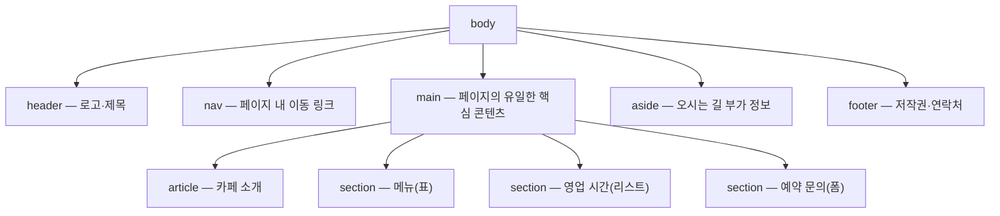

<Callout type="info">
  **이번 문서의 목표:** 이 문서를 다 읽고 실습기를 직접 만지고 나면, `header`·`nav`·`main`·`section`·`article`·`aside`·`footer`로 뼈대를 잡고, 그 안에 표와 리스트로 콘텐츠를 배치하고, `label`·`fieldset`까지 갖춘 문의 폼을 붙인 완성된 한 페이지 HTML을 스스로 조립할 수 있게 됩니다.
</Callout>

## 왜 여기서 한 번 다 모아 보는가

01편부터 22편까지 배운 것은 대부분 요소 하나, 규칙 하나였습니다. `header`는 이런 뜻, `label`의 `for`는 이렇게 연결, `caption`은 표 제목. 그런데 실제로 웹 페이지 하나를 만들 때는 이 조각들이 동시에, 서로 맞물려서 필요합니다. 시맨틱 sectioning 요소(semantic sectioning element, 의미를 가진 구획 요소)를 어디에 쓸지 정하는 것과, 그 안에 넣을 표의 `thead`/`tbody`를 나누는 것과, 폼의 `label`을 입력과 연결하는 것을 동시에 판단해야 합니다.

> **쉽게 말하면:** 지금까지는 레고 블록 하나하나의 이름과 쓰임을 배웠습니다. 이번 편은 그 블록들로 실제 건물 하나를 완성해 보는 자리입니다.

이 편은 새로운 개념을 설명하지 않습니다. 대신 `<Steps>`로 만드는 순서를 짚고, 완성된 코드를 `<CodePlayground>`로 직접 실행해 보게 합니다. 막히는 부분이 있다면 괄호 안에 적힌 편으로 돌아가 확인하세요.

## 무엇을 만들 것인가

작은 카페의 소개 페이지를 만듭니다. 사이트 상단 내비게이션, 카페 소개 글, 메뉴 표, 영업 시간 리스트, 예약 문의 폼, 하단 footer까지 — 이 과목에서 배운 요소가 거의 다 등장하는 구성입니다.



이 구성에서 `nav`는 `header` 안에 있어도 되고 형제로 둬도 됩니다. 이 실습에서는 `header` 다음 형제로 둬서 "상단 영역"과 "이동 메뉴"의 역할을 눈으로 구분하기 쉽게 했습니다. `main`은 문서마다 **하나만** 존재해야 하고, `main` 안에 실제로 이 페이지에서만 의미 있는 콘텐츠만 담습니다(17편). 사이드바성 부가 정보인 "오시는 길"은 `main` 바깥의 `aside`로 뺐습니다 — `aside`는 본문과 느슨하게만 관련된 부가 콘텐츠에 씁니다.

<Steps>

### 1. 문서 뼈대와 head 채우기

04편에서 배운 대로 `<!doctype html>`부터 시작합니다. `charset`은 `head`의 가장 앞에 두고(19편에서 다룬 인코딩이 깨지기 전에 먼저 선언되어야 합니다), `viewport`와 `title`을 잇습니다.

```html
<!doctype html>
<html lang="ko">
  <head>
    <meta charset="UTF-8" />
    <meta name="viewport" content="width=device-width, initial-scale=1.0" />
    <title>소보로 카페 — 예약 문의</title>
  </head>
  <body>
    <!-- 다음 단계에서 채운다 -->
  </body>
</html>
```

`lang="ko"` 속성은 12편에서 배운 전역 속성입니다. 스크린 리더가 이 값을 보고 한국어 발음 규칙으로 읽습니다. 빠뜨리면 영어 발음 엔진이 한글을 억지로 읽으려 시도해 접근성이 크게 떨어집니다.

### 2. 시맨틱 뼈대 세우기 — header·nav·main·aside·footer

`div`로 감싸고 싶은 유혹이 들 때마다 "이 구획이 페이지 전체에서 어떤 역할인가"를 자문합니다(17편). 역할이 표에 있는 이름과 일치하면 그 시맨틱 요소를 쓰고, 그렇지 않으면(순전히 스타일링을 위한 감쌈) `div`를 씁니다.

```html
<header>
  <h1>소보로 카페</h1>
  <p>사람보다 빵 냄새가 먼저 반기는 곳</p>
</header>

<nav aria-label="페이지 내 이동">
  <ul>
    <li><a href="#menu">메뉴</a></li>
    <li><a href="#hours">영업 시간</a></li>
    <li><a href="#reserve">예약 문의</a></li>
  </ul>
</nav>

<main>
  <!-- article·section 세 개는 다음 단계에서 -->
</main>

<aside>
  <h2>오시는 길</h2>
  <p>서울시 마포구 어딘가길 12, 2호선 합정역 3번 출구 도보 5분.</p>
</aside>

<footer>
  <p>&copy; 2026 소보로 카페. 문의: hello@soboro.example</p>
</footer>
```

`nav`에 `aria-label`(에이리아 레이블, 랜드마크에 이름을 붙이는 속성)을 붙인 이유는 20편에서 다룬 랜드마크 역할 때문입니다. 한 페이지에 `nav`가 여러 개일 수 있으므로("상단 메뉴", "페이지 내 이동", "사이트맵" 등), 스크린 리더 사용자가 랜드마크 목록을 훑을 때 이름 없이는 어느 `nav`인지 구분할 수 없습니다. `href="#menu"` 같은 프래그먼트 링크는 07편에서 배운 같은 페이지 안 이동입니다.

### 3. article로 카페 소개 감싸기

"카페 소개"는 이 문서를 통째로 다른 곳에 옮겨 붙여도(예: RSS 피드, 다른 사이트의 발췌) 그 자체로 뜻이 통하는 독립적인 콘텐츠입니다. 이런 조건이 `article`을 고르는 기준입니다(17편).

```html
<article>
  <h2>소보로 카페 이야기</h2>
  <p>
    2019년, 작은 골목 안에서 시작했습니다. 매일 아침 직접 굽는
    <em>소보로빵</em>과 핸드드립 커피가 저희의 전부입니다.
  </p>
</article>
```

### 4. section과 table로 메뉴 배치하기

"메뉴"는 카페 소개와는 별개의 주제 단위이므로 `section`(05·17편)으로 나눕니다. 표 형태의 데이터(메뉴명·설명·가격)이므로 10편에서 배운 `table`/`caption`/`thead`/`tbody`/`th scope`를 그대로 씁니다.

```html
<section id="menu">
  <h2>메뉴</h2>
  <table>
    <caption>소보로 카페 대표 메뉴와 가격</caption>
    <thead>
      <tr>
        <th scope="col">메뉴</th>
        <th scope="col">설명</th>
        <th scope="col">가격</th>
      </tr>
    </thead>
    <tbody>
      <tr>
        <th scope="row">소보로빵</th>
        <td>겉은 바삭, 속은 촉촉한 시그니처 메뉴</td>
        <td>3,500원</td>
      </tr>
      <tr>
        <th scope="row">핸드드립 커피</th>
        <td>매일 다른 원두 한 가지를 내림</td>
        <td>5,000원</td>
      </tr>
    </tbody>
  </table>
</section>
```

`scope="col"`은 그 셀이 세로 방향(같은 열)의 제목임을, `scope="row"`는 가로 방향(같은 행)의 제목임을 스크린 리더에 알려줍니다. `caption`은 표 바로 안, 첫 자식으로 와야 한다는 콘텐츠 모델 규칙(05편)을 지켰습니다.

### 5. section과 dl로 영업 시간 배치하기

영업 시간은 "요일(용어) — 시간(설명)" 짝의 나열이므로 09편에서 배운 정의 리스트 `dl`/`dt`/`dd`가 `ul`보다 의미에 더 맞습니다.

```html
<section id="hours">
  <h2>영업 시간</h2>
  <dl>
    <dt>평일</dt>
    <dd>08:00–20:00</dd>
    <dt>주말</dt>
    <dd>10:00–18:00</dd>
    <dt>매주 월요일</dt>
    <dd>휴무</dd>
  </dl>
</section>
```

숫자 범위의 물결표(`~`)는 산문·표 셀 안에서 취소선으로 오인될 수 있어 이 실습에서는 en dash(–)로 통일했습니다. 실제로 여러분이 코드 에디터에 입력할 때는 일반적인 물결표를 써도 되지만, 이 MDX 문서 자체를 쓸 때는 그 규칙을 지킵니다.

### 6. section과 form으로 예약 문의 폼 만들기

이제 이 실습의 핵심, 13~16편에서 배운 폼입니다. `fieldset`/`legend`로 관련 입력을 묶고, 모든 입력에 `label`을 명시적으로 연결하고, `name`을 빠짐없이 채우고, `method`/`action`을 지정합니다.

```html
<section id="reserve">
  <h2>예약 문의</h2>
  <form method="post" action="/api/reserve" enctype="application/x-www-form-urlencoded">
    <fieldset>
      <legend>예약자 정보</legend>

      <p>
        <label for="이름">이름</label>
        <input type="text" id="이름" name="customerName" required />
      </p>

      <p>
        <label for="연락처">연락처</label>
        <input type="tel" id="연락처" name="phone" required />
      </p>
    </fieldset>

    <fieldset>
      <legend>예약 내용</legend>

      <p>
        <label for="인원">인원 수</label>
        <select id="인원" name="partySize">
          <option value="1">1명</option>
          <option value="2" selected>2명</option>
          <option value="3">3명</option>
          <option value="4">4명 이상</option>
        </select>
      </p>

      <p>
        <span>좌석 종류</span>
      </p>
      <p>
        <input type="radio" id="좌석-창가" name="seatType" value="window" checked />
        <label for="좌석-창가">창가석</label>
      </p>
      <p>
        <input type="radio" id="좌석-일반" name="seatType" value="normal" />
        <label for="좌석-일반">일반석</label>
      </p>

      <p>
        <input type="checkbox" id="반려동물" name="petFriendly" value="yes" />
        <label for="반려동물">반려동물 동반 좌석 필요</label>
      </p>

      <p>
        <label for="요청사항">추가 요청사항</label>
        <textarea id="요청사항" name="note" rows="3"></textarea>
      </p>
    </fieldset>

    <p>
      <button type="submit">예약 문의 보내기</button>
      <button type="reset">입력 초기화</button>
    </p>
  </form>
</section>
```

여기서 반드시 짚어야 할 세 가지가 있습니다.

1. **`for`와 `id`는 문자 그대로 일치**해야 합니다(13편). `for="이름"`과 `id="이름"`처럼 값이 하나라도 다르면 클릭·스크린 리더 연결이 조용히 끊깁니다. 빌드 에러가 나지 않아서 더 위험한 실수입니다.
2. **라디오 버튼은 `name`을 공유하고 `value`로 구분**합니다(14편). `seatType`이라는 같은 이름 아래 `window`/`normal` 두 값 중 하나만 선택되게 브라우저가 강제합니다.
3. **`<button type="submit">`을 명시**했습니다(15편). `<form>` 안 `<button>`의 기본 `type`은 `submit`이지만, 명시하지 않으면 나중에 코드를 읽는 사람(또는 자기 자신)이 헷갈릴 여지가 있습니다. `type="reset"`은 입력을 전부 초기값으로 되돌립니다 — 사용자가 실수로 누르면 힘들게 채운 내용이 날아가므로 실무에서는 신중하게 배치합니다.

### 7. method·enctype으로 제출 데이터 예측하기

이 폼은 `method="post"`와 `enctype="application/x-www-form-urlencoded"`(기본값이라 생략해도 같은 동작)를 씁니다. 16편에서 배운 대로 제출하면 이런 문자열이 만들어집니다(값은 위 폼을 그대로 제출했다고 가정).

```
customerName=%EC%98%88%EC%8B%9C&phone=010-1234-5678&partySize=2&seatType=window&note=
```

`name`이 없는 컨트롤(`button` 두 개)은 값이 전송되지 않고, 체크되지 않은 체크박스(`petFriendly`)도 아예 전송 목록에서 빠집니다. 한글이 `%EC%98%88%EC%8B%9C`처럼 퍼센트 인코딩(percent-encoding)되는 이유는 `x-www-form-urlencoded`가 ASCII 밖의 문자를 이렇게 바꿔 전송하기 때문입니다.

</Steps>

## 완성 코드를 직접 실행해 보기

아래 실습기는 지금까지 조립한 조각을 모두 합친 완성 페이지입니다. `styles.css`는 구조를 눈으로 구분하기 쉽도록 최소한의 테두리만 넣었습니다(색과 레이아웃 자체는 이 과목의 범위가 아니라 `css/css_fundamentals` 과목의 몫입니다). 자유롭게 `index.html`을 고쳐 보고, 예를 들어 `fieldset`을 하나 지워 보거나 `label`의 `for` 값을 일부러 다르게 바꿔 보며 무엇이 달라지는지 확인하세요.

<CodePlayground
  template="static"
  activeFile="/index.html"
  label="시맨틱 페이지 + 예약 폼 완성본"
  files={{
    '/index.html': `<!doctype html>
<html lang="ko">
  <head>
    <meta charset="UTF-8" />
    <meta name="viewport" content="width=device-width, initial-scale=1.0" />
    <title>소보로 카페 — 예약 문의</title>
    <link rel="stylesheet" href="styles.css" />
  </head>
  <body>
    <header>
      <h1>소보로 카페</h1>
      <p>사람보다 빵 냄새가 먼저 반기는 곳</p>
    </header>

    <nav aria-label="페이지 내 이동">
      <ul>
        <li><a href="#menu">메뉴</a></li>
        <li><a href="#hours">영업 시간</a></li>
        <li><a href="#reserve">예약 문의</a></li>
      </ul>
    </nav>

    <main>
      <article>
        <h2>소보로 카페 이야기</h2>
        <p>
          2019년, 작은 골목 안에서 시작했습니다. 매일 아침 직접 굽는
          <em>소보로빵</em>과 핸드드립 커피가 저희의 전부입니다.
        </p>
      </article>

      <section id="menu">
        <h2>메뉴</h2>
        <table>
          <caption>소보로 카페 대표 메뉴와 가격</caption>
          <thead>
            <tr>
              <th scope="col">메뉴</th>
              <th scope="col">설명</th>
              <th scope="col">가격</th>
            </tr>
          </thead>
          <tbody>
            <tr>
              <th scope="row">소보로빵</th>
              <td>겉은 바삭, 속은 촉촉한 시그니처 메뉴</td>
              <td>3,500원</td>
            </tr>
            <tr>
              <th scope="row">핸드드립 커피</th>
              <td>매일 다른 원두 한 가지를 내림</td>
              <td>5,000원</td>
            </tr>
          </tbody>
        </table>
      </section>

      <section id="hours">
        <h2>영업 시간</h2>
        <dl>
          <dt>평일</dt>
          <dd>08:00–20:00</dd>
          <dt>주말</dt>
          <dd>10:00–18:00</dd>
          <dt>매주 월요일</dt>
          <dd>휴무</dd>
        </dl>
      </section>

      <section id="reserve">
        <h2>예약 문의</h2>
        <form method="post" action="/api/reserve" enctype="application/x-www-form-urlencoded">
          <fieldset>
            <legend>예약자 정보</legend>

            <p>
              <label for="이름">이름</label>
              <input type="text" id="이름" name="customerName" required />
            </p>

            <p>
              <label for="연락처">연락처</label>
              <input type="tel" id="연락처" name="phone" required />
            </p>
          </fieldset>

          <fieldset>
            <legend>예약 내용</legend>

            <p>
              <label for="인원">인원 수</label>
              <select id="인원" name="partySize">
                <option value="1">1명</option>
                <option value="2" selected>2명</option>
                <option value="3">3명</option>
                <option value="4">4명 이상</option>
              </select>
            </p>

            <p><span>좌석 종류</span></p>
            <p>
              <input type="radio" id="좌석-창가" name="seatType" value="window" checked />
              <label for="좌석-창가">창가석</label>
            </p>
            <p>
              <input type="radio" id="좌석-일반" name="seatType" value="normal" />
              <label for="좌석-일반">일반석</label>
            </p>

            <p>
              <input type="checkbox" id="반려동물" name="petFriendly" value="yes" />
              <label for="반려동물">반려동물 동반 좌석 필요</label>
            </p>

            <p>
              <label for="요청사항">추가 요청사항</label>
              <textarea id="요청사항" name="note" rows="3"></textarea>
            </p>
          </fieldset>

          <p>
            <button type="submit">예약 문의 보내기</button>
            <button type="reset">입력 초기화</button>
          </p>
        </form>
      </section>
    </main>

    <aside>
      <h2>오시는 길</h2>
      <p>서울시 마포구 어딘가길 12, 2호선 합정역 3번 출구 도보 5분.</p>
    </aside>

    <footer>
      <p>&copy; 2026 소보로 카페. 문의: hello@soboro.example</p>
    </footer>
  </body>
</html>`,
    '/styles.css': `body {
  font-family: system-ui, sans-serif;
  max-width: 640px;
  margin: 0 auto;
  padding: 1rem;
}
header, nav, main, aside, footer {
  border: 1px dashed #999;
  padding: 0.75rem;
  margin-bottom: 0.75rem;
}
section, article {
  border-left: 3px solid #999;
  padding-left: 0.75rem;
  margin-bottom: 1rem;
}
fieldset {
  margin-bottom: 0.75rem;
}
table {
  border-collapse: collapse;
  width: 100%;
}
th, td {
  border: 1px solid #ccc;
  padding: 0.25rem 0.5rem;
  text-align: left;
}`,
  }}
/>

이 실습기의 `styles.css`가 각 시맨틱 요소에 점선 테두리를 그려준 덕분에, 브라우저 창을 넓혀 보거나 좁혀 보면서 `header`·`nav`·`main`·`aside`·`footer`가 실제로 어디부터 어디까지인지 눈으로 확인할 수 있습니다. 개발자 도구(F12)의 요소(Elements) 패널을 열어 접근성(Accessibility) 탭을 보면, `nav`가 "navigation" 역할로, `main`이 "main" 역할로 자동 노출되는 것도 확인해 보세요(20편에서 배운 랜드마크 역할입니다).

## 자주 틀리는 점

- `main`을 페이지에 두 개 이상 넣거나, `header`/`footer`를 `article` 안에도 중첩해서 넣을 수 있다는 것을 잊는 경우가 있습니다. `header`/`footer`는 문서 전체뿐 아니라 `article`이나 `section` 안에도 각각 하나씩 둘 수 있습니다(예: 각 게시글 `article`마다 작성자 정보를 담은 자체 `header`). 다만 `main`은 문서 전체에 **오직 하나**여야 합니다.
- 폼 안의 `<p>`로 입력을 감싼 것은 순전히 줄바꿈을 위한 관용적 배치이지 필수 규칙이 아닙니다. 실무에서는 CSS로 배치를 조정하지만, 이 과목은 CSS를 다루지 않으므로 최소한의 구조만 갖췄습니다.
- `select`의 `option`에 `value`를 빠뜨리면, 제출 시 `option` 태그 안의 텍스트 내용이 그대로 값으로 전송됩니다(14·16편). 값과 표시 텍스트가 다를 이유가 있다면(예: 표시는 "2명"이지만 서버는 숫자 `2`만 필요) `value`를 반드시 명시해야 합니다.

## 핵심 정리

- 시맨틱 sectioning 요소는 "이 구획의 역할이 무엇인가"를 먼저 정하고 고른다. 역할이 분명하지 않으면 `div`가 정답이다.
- 표 형태 데이터는 `table`+`caption`+`thead`/`tbody`+`th scope`로, 짝을 이루는 항목은 `dl`/`dt`/`dd`로 감싼다.
- 폼은 `label`의 `for`와 입력의 `id`를 문자 그대로 일치시키고, 모든 입력에 `name`을 채워야 제출 데이터가 서버에서 의미를 가진다.
- 라디오 버튼은 `name`을 공유해 하나만 선택되게 강제하고, `value`로 각 선택지를 구분한다.
- 완성된 페이지 하나를 눈으로, 그리고 개발자 도구의 접근성 트리로 확인하는 습관이 "규칙을 안다"와 "규칙대로 만들 수 있다" 사이의 간극을 좁힌다.

## 마무리 복습

<Quiz
  questionNumber={1}
  question="한 페이지 안에서 사용 규칙이 다른 것은?"
  options={['header — 문서 전체와 article 안 모두에 각각 둘 수 있다', 'footer — 문서 전체와 section 안 모두에 각각 둘 수 있다', 'main — 문서 전체에 오직 하나만 존재해야 한다', 'nav — 한 문서에 여러 개 두고 각각 다른 목적으로 쓸 수 있다']}
  correctAnswer={3}
  explanation="main은 문서 전체에서 유일해야 하는 요소다. header와 footer는 문서 전체뿐 아니라 article이나 section 같은 하위 구획 안에도 각자의 것으로 둘 수 있고, nav는 여러 개를 두고 aria-label로 구분하는 것이 일반적이다."
  optionExplanations={['section·article 안에도 자체 header를 둘 수 있어 옳은 설명이다', 'section·article 안에도 자체 footer를 둘 수 있어 옳은 설명이다', '정답 — main은 문서당 하나만 두어야 하는 유일한 시맨틱 요소다', '여러 nav를 aria-label로 구분해 두는 것은 흔한 패턴이다']}
/>

<Quiz
  questionNumber={2}
  question="예약 폼에서 label for와 input id가 문자 그대로 다르게 입력되었을 때 벌어지는 일로 가장 알맞은 것은?"
  options={['빌드 시점에 에러가 발생해 배포가 막힌다', '브라우저가 자동으로 가장 비슷한 id를 찾아 연결해 준다', '빌드는 통과하지만 label 클릭·스크린 리더 연결이 조용히 끊긴다', 'form 제출 자체가 차단된다']}
  correctAnswer={3}
  explanation="for와 id 불일치는 문법 오류가 아니라 값이 안 맞는 것뿐이라 빌드나 제출은 정상 진행된다. 다만 label을 클릭해도 입력에 포커스가 가지 않고 스크린 리더도 연결을 인식하지 못하는, 눈에 잘 띄지 않는 접근성 결함이 생긴다."
  optionExplanations={['속성값 불일치는 문법 오류가 아니므로 빌드는 그대로 통과한다', '브라우저는 그런 추측을 하지 않으며 정확히 일치하는 값만 연결한다', '정답 — 조용히 접근성 연결만 끊기는 것이 이 실수가 위험한 이유다', 'form 제출 여부와 label-input 연결은 별개의 메커니즘이다']}
/>

<Quiz
  questionNumber={3}
  question="라디오 버튼 두 개가 하나만 선택되도록 브라우저가 강제하는 조건은?"
  options={['id 값이 서로 같아야 한다', 'name 값이 서로 같아야 한다', 'value 값이 서로 같아야 한다', 'type 값이 서로 달라야 한다']}
  correctAnswer={2}
  explanation="같은 name을 공유한 radio 그룹 안에서만 브라우저가 배타적 선택을 강제한다. id는 오히려 서로 달라야 label 연결이 가능하고, value는 각 선택지를 구분하는 값이라 서로 달라야 한다."
  optionExplanations={['id가 같으면 오히려 label-input 연결이 중복되어 문제가 된다', '정답 — 같은 name을 공유해야 브라우저가 하나의 그룹으로 인식한다', 'value가 같으면 선택지를 구분할 수 없게 된다', 'type은 둘 다 radio로 같아야 그룹으로 동작한다']}
/>

<Quiz
  questionNumber={4}
  question="카페 소개 문단을 article로 감싼 근거로 가장 알맞은 것은?"
  options={['글자 수가 다른 구획보다 많아서', '다른 곳에 그대로 옮겨도 그 자체로 뜻이 통하는 독립적인 콘텐츠라서', 'h2 제목이 붙어 있어서', 'CSS로 스타일을 다르게 주기 위해서']}
  correctAnswer={2}
  explanation="article은 문서 전체에서 잘라내 다른 맥락(피드, 다른 사이트)에 옮겨도 그 자체로 완결된 뜻을 가지는 콘텐츠에 쓴다. 글자 수나 제목 유무, CSS 스타일링 필요성은 이 선택 기준과 무관하다."
  optionExplanations={['분량은 sectioning 요소 선택 기준이 아니다', '정답 — 독립적으로 재배포 가능한 콘텐츠인지가 article의 기준이다', 'h2는 article이 아닌 다른 sectioning 요소에도 똑같이 붙는다', 'CSS 스타일링은 class로도 충분히 구분할 수 있어 근거가 되지 않는다']}
/>

<Quiz
  questionNumber={5}
  question="이 실습의 예약 폼에서 petFriendly 체크박스를 체크하지 않고 제출했을 때 전송 데이터는?"
  options={['petFriendly=false로 전송된다', 'petFriendly=(빈 값)으로 전송된다', 'petFriendly 항목 자체가 전송 목록에서 빠진다', 'petFriendly=null로 전송된다']}
  correctAnswer={3}
  explanation="체크되지 않은 checkbox는 name/value 쌍 자체가 제출 데이터에서 완전히 빠진다. false·빈 값·null 같은 값으로 전송되는 것이 아니라 아예 존재하지 않게 된다."
  optionExplanations={['체크박스는 false라는 문자열을 보내지 않는다', '빈 값으로라도 전송되지 않고 항목 자체가 빠진다', '정답 — 체크되지 않은 checkbox는 제출 데이터에서 통째로 제외된다', 'null은 HTML 폼 인코딩에 존재하지 않는 개념이다']}
/>

<Quiz
  questionNumber={6}
  question="select의 option에 value 속성을 생략했을 때 제출되는 값은?"
  options={['항상 빈 문자열이 전송된다', '해당 option의 순서 번호(인덱스)가 전송된다', '해당 option 태그 안의 텍스트 내용이 그대로 전송된다', 'select 자체가 제출 데이터에서 빠진다']}
  correctAnswer={3}
  explanation="value 속성이 없으면 브라우저는 option 여는 태그와 닫는 태그 사이의 텍스트 내용을 값으로 대신 사용한다. 표시 텍스트와 서버가 받을 값을 다르게 하고 싶다면 value를 명시해야 한다."
  optionExplanations={['빈 문자열이 아니라 표시 텍스트가 대신 쓰인다', '인덱스 번호를 자동으로 매기는 동작은 없다', '정답 — 텍스트 내용이 값으로 대체된다', 'select는 value 생략과 무관하게 정상적으로 제출된다']}
/>

<Quiz
  questionNumber={7}
  question="표 안에서 caption을 두는 위치로 옳은 것은?"
  options={['table 태그 바로 앞, table 바깥', 'table 태그 안, 첫 자식으로', 'tbody 안, 첫 번째 tr 앞', 'thead 안, th들과 나란히']}
  correctAnswer={2}
  explanation="caption은 table의 콘텐츠 모델상 table 요소 안에 있어야 하며, 있다면 반드시 첫 자식이어야 한다는 규칙을 따른다. table 바깥이나 tbody·thead 안에 두면 콘텐츠 모델 위반으로 검증기에서 오류가 난다."
  optionExplanations={['caption은 table 바깥이 아니라 안에 있어야 한다', '정답 — table의 첫 자식이라는 위치 규칙을 지켜야 한다', 'tbody 안은 caption이 올 수 있는 위치가 아니다', 'thead 안도 caption의 콘텐츠 모델상 허용 위치가 아니다']}
/>

<Quiz
  questionNumber={8}
  question="nav가 한 문서에 여러 개 있을 때 aria-label을 각각 다르게 붙이는 이유로 가장 알맞은 것은?"
  options={['CSS 선택자로 구분하기 위해서', '스크린 리더의 랜드마크 목록에서 서로 다른 nav를 구분할 수 있게 하기 위해서', 'nav 요소가 여러 개면 빌드가 깨지는 것을 막기 위해서', '검색 엔진 순위를 올리기 위해서']}
  correctAnswer={2}
  explanation="nav는 여러 개를 둘 수 있는 요소이지만, 이름이 없으면 스크린 리더 사용자가 랜드마크 목록만 보고는 어느 nav가 어떤 용도인지 구분할 수 없다. aria-label은 그 구분을 위한 이름표 역할을 한다."
  optionExplanations={['CSS 구분은 class나 id로 충분하며 aria-label의 목적이 아니다', '정답 — 랜드마크 탐색 시 이름으로 구분하기 위한 접근성 장치다', 'nav가 여러 개 있다고 빌드가 깨지지는 않는다', 'aria-label은 검색 엔진 순위와 직접적인 관련이 없다']}
/>

## 참고 자료

- [MDN — Your first form](https://developer.mozilla.org/en-US/docs/Learn_web_development/Extensions/Forms/Your_first_form)
- [MDN — How to structure a web form](https://developer.mozilla.org/en-US/docs/Learn_web_development/Extensions/Forms/How_to_structure_a_web_form)
- [MDN — Table accessibility (advanced features)](https://developer.mozilla.org/en-US/docs/Learn_web_development/Core/Structuring_content/Table_accessibility)
- [WHATWG — HTML Living Standard](https://html.spec.whatwg.org/multipage/)
