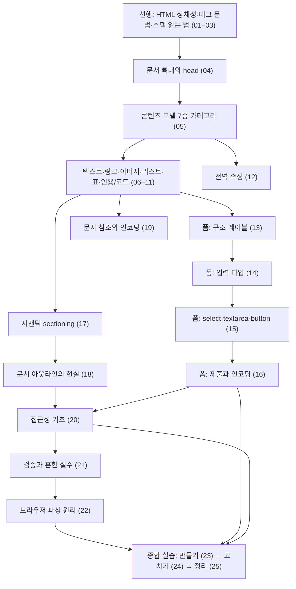

<Callout type="info">
  **이번 문서의 목표:** 이 문서를 다 읽고 체크리스트를 직접 확인하면, HTML 기본기 과목에서 배운 것 전체를 하나의 지도로 정리하고, `01_학습방향.md`가 정한 5가지 완료 기준을 스스로 판정해 `html/modern_html`로 넘어갈 준비가 되었는지 확인할 수 있게 됩니다.
</Callout>

## 이 편의 역할 — 새 지식이 아니라 자가 진단

이 편은 새 태그나 새 규칙을 소개하지 않습니다. 대신 두 가지만 합니다. 첫째, 24편 동안 쌓아 온 지식을 하나의 지도로 요약합니다. 둘째, 과목을 시작하기 전에 정해 둔 5가지 완료 기준을 여러분이 실제로 충족했는지 직접 판정합니다.

> **쉽게 말하면:** 여행의 마지막 날, 짐을 다시 싸기 전에 여권·지갑·충전기를 하나씩 꺼내 확인하는 시간입니다. 새로 사는 물건은 없습니다. 가진 것을 점검할 뿐입니다.

## 전체 지도 한 장

이 과목 22개 본론·선행 편이 어떻게 서로를 딛고 쌓였는지 한 번에 봅니다.

이 지도가 보여주는 이야기는 하나입니다. **구조(콘텐츠 모델) → 콘텐츠(텍스트·폼·표) → 의미(시맨틱·접근성) → 검증(스스로 확인하는 법) → 원리(왜 그렇게 동작하는가)** 순서로 한 겹씩 쌓아 왔습니다. 어느 한 겹이라도 비어 있으면 위층이 흔들립니다. 예를 들어 콘텐츠 모델(05편)을 건너뛰고 폼(13~16편)을 배우면, `label` 안에 `div`를 넣는 실수를 왜 하면 안 되는지 이해하지 못한 채 규칙만 외우게 됩니다.

## 완료 기준 5가지 자가 점검

`01_학습방향.md`가 과목을 시작하기 전에 정해 둔 기준입니다. 각 항목 아래 "확인 방법"으로 실제 능력을 스스로 테스트해 보세요. 표로만 훑지 말고, 확인 방법에 적힌 행동을 직접 해 보는 것이 이 점검의 핵심입니다.

### 기준 1 — 시맨틱 요소만으로 페이지 구조화하기

> 시맨틱 요소(`header`·`nav`·`main`·`section`·`article`·`aside`·`footer`)만으로 구조화된 페이지를 처음부터 작성할 수 있다.

**확인 방법**: 지금 백지 상태에서 좋아하는 주제(취미, 좋아하는 음식, 관심 있는 뉴스 하나)로 새 페이지를 만들어 보세요. 이번에는 23편의 완성 코드를 보지 않고 처음부터 씁니다. `div`를 쓰고 싶어지는 순간마다 "이 구획의 역할이 이름 있는 시맨틱 요소와 일치하는가"를 자문하세요(17편에서 배운 판단 기준입니다).

- 성공 기준: `main`이 정확히 하나이고, 나머지 시맨틱 요소가 각자의 역할에 맞게 쓰였다.
- 막히면: 17편(시맨틱 sectioning 요소)과 05편(콘텐츠 모델)으로 돌아가세요.

### 기준 2 — 레이블·이름·값이 정확히 연결된 폼 만들고 제출 데이터 예측하기

> `label`의 `for`와 입력의 `id`, `name`/`value`가 정확히 연결된 폼을 만들고, 제출 시 어떤 데이터가 어떤 형태로 전송되는지 예측할 수 있다.

**확인 방법**: 종이 한 장을 꺼내(또는 메모장을 열어), 여러분이 방금 상상한 폼(예: 회원가입, 설문)의 각 입력에 대해 `name`과 예상 `value`를 먼저 적어 보세요. 그다음 코드를 쓰고, `method="get"`으로 제출했을 때 URL 뒤에 어떤 쿼리 문자열이 붙을지 손으로 먼저 예측한 뒤 실제로 확인합니다.

- 성공 기준: 체크되지 않은 체크박스는 데이터에서 빠진다는 것, 라디오 그룹은 `name`을 공유한다는 것을 예측 단계에서 이미 알고 있었다.
- 막히면: 13편(구조·레이블), 16편(제출과 인코딩)으로 돌아가세요.

### 기준 3 — 표를 접근성 있게 구성하기

> 표를 `caption`·`thead`/`tbody`/`tfoot`·`th scope`로 구성해 스크린 리더가 구조를 읽을 수 있게 만들 수 있다.

**확인 방법**: 아무 표 형태 데이터(가계부, 시간표, 성적표)를 골라 `table`을 짜 보세요. 다 쓴 뒤 각 `th`마다 `scope`가 `col`인지 `row`인지 스스로 설명할 수 있는지 확인합니다. "이 셀은 같은 열의 제목인가, 같은 행의 제목인가"라는 질문에 즉시 답할 수 있어야 합니다.

- 성공 기준: `caption`이 표의 첫 자식으로 있고, 데이터 행이 5개를 넘으면 `thead`/`tbody`를 나눴다.
- 막히면: 10편(표: 구조와 접근성 기초)으로 돌아가세요.

### 기준 4 — 대체 텍스트 판단과 특수 문자 이스케이프

> 이미지마다 장식용/정보성을 판단해 적절한 `alt`를 채우고, 특수 문자를 이스케이프해야 하는 상황(`<`, `&` 등)을 스스로 알아챌 수 있다.

**확인 방법**: 아무 웹 페이지나 열어 이미지 세 개를 골라 보세요. 각각을 "이 이미지가 사라지면 정보가 사라지는가, 아니면 옆 텍스트만으로 충분한가"라는 기준으로 장식용/정보성으로 분류해 보세요. 그다음 "회사명 A&B"나 "5 미만"처럼 `&`·`<` 기호가 실제로 필요한 문장을 하나 지어 문자 참조로 직접 바꿔 보세요.

- 성공 기준: 정보성이라면 그 정보를 대신할 문장을 `alt`에 적었고, `&`는 `&amp;`, `<`는 `&lt;`로 바꿔야 한다는 것을 즉시 떠올렸다.
- 막히면: 08편(이미지의 전통적 기본기), 19편(문자 참조와 인코딩 기초)으로 돌아가세요.

### 기준 5 — 검증기로 스스로 오류를 찾고 고치기

> Nu HTML Checker로 자신이 쓴 HTML을 검증하고, 결과 메시지를 보고 중첩 위반·필수 속성 누락 같은 흔한 오류를 스스로 고칠 수 있다.

**확인 방법**: 기준 1~4에서 직접 만든 코드를 [Nu HTML Checker](https://validator.w3.org/nu/)에 붙여 넣어 실제로 검증해 보세요. 처음 시도에서 Error나 Warning이 하나도 없다면 오히려 의심하고, 24편의 오류 다섯 유형 중 하나를 일부러 넣었다가 메시지를 확인하고 되돌리는 연습을 한 번 더 해 보세요.

- 성공 기준: 메시지에 적힌 줄 번호를 보고 코드의 어느 부분을 가리키는지 30초 안에 찾아낼 수 있다.
- 막히면: 21편(유효성 검사와 흔한 실수), 24편(종합 실습 2)으로 돌아가세요.

## 체크리스트 요약표

| # | 완료 기준 | 관련 편 |
|---|-----------|---------|
| 1 | 시맨틱 요소만으로 페이지를 처음부터 구조화할 수 있다 | 05, 17, 23 |
| 2 | 레이블·이름·값이 연결된 폼을 만들고 제출 데이터를 예측할 수 있다 | 13–16, 23 |
| 3 | 표를 caption·thead/tbody/tfoot·th scope로 접근성 있게 구성할 수 있다 | 10, 23 |
| 4 | alt를 장식용/정보성 기준으로 판단하고 특수 문자를 이스케이프할 수 있다 | 08, 19 |
| 5 | 검증기 메시지를 읽고 흔한 오류를 스스로 고칠 수 있다 | 21, 24 |

다섯 항목 모두 "성공 기준"에 스스로 그렇다고 답할 수 있다면, 이 과목을 마친 것으로 봐도 좋습니다. 한두 개가 걸린다면 부끄러워할 일이 아닙니다 — 해당 편으로 돌아가 "확인 방법"을 다시 해 보는 것 자체가 정상적인 학습 과정입니다.

## html/modern_html으로 넘어가기 전에

이 과목은 의도적으로 범위를 좁혔습니다. 01편 학습 방향에서 정한 대로, "예전부터 있었고 이걸 몰라도 다음 단계를 못 읽는" 항목만 다뤘습니다. 다음 과목 `html/modern_html`(모던 HTML)이 이어받는 것은 다음과 같습니다.

| 이 과목(html_fundamentals)에서 배운 것 | modern_html에서 배우게 될 것 |
|----------------------------------------|-------------------------------|
| ``의 `src`/`alt`/`width`/`height` (08편) | `srcset`/`<picture>`로 화면 크기·해상도에 맞는 이미지 고르기 |
| 전통적 `<input>` 타입: `text`/`password`/`checkbox`/`radio` (14편) | `color`·`date`·`range` 등 새 입력 타입, `inputmode`, Constraint Validation API |
| `<form>` 기본 제출 동작 (16편) | JS로 제출을 가로채는 방법은 `javascript/web_apis` 몫 |
| 시맨틱 sectioning 요소 (17편) | `<dialog>`·`popover`·`
`/`
` 같은 새 상호작용 요소 |
| — (다루지 않음) | `<template>`·`<slot>`·Shadow DOM은 `javascript/web_component` 과목 |

이 표에서 보듯, 지금까지 배운 것은 "없어지지 않는 지식"입니다. modern_html의 새 기능들도 결국 이 과목에서 잡은 콘텐츠 모델·시맨틱 판단 기준·접근성 원칙 위에 얹힙니다. 예를 들어 `<dialog>`가 왜 `role="dialog"`를 굳이 다시 선언할 필요가 없는지 이해하려면, 이 과목 20편에서 배운 "시맨틱 요소가 자동으로 랜드마크·역할을 부여한다"는 원칙이 먼저 있어야 합니다.

## 핵심 정리

- 이 과목은 구조 → 콘텐츠 → 의미 → 검증 → 원리 순서로 지식을 쌓았다. 어느 한 겹이 비면 위층 이해가 흔들린다.
- 완료 기준 5가지는 지식이 아니라 **행동**으로 점검한다 — 직접 페이지를 짜고, 표를 만들고, 검증기를 돌려 보는 것이 유일한 확인 방법이다.
- 검증 통과와 접근성 완성은 다른 기준이라는 것을 24편에서 이미 확인했다. 이 점검에서도 같은 원칙이 적용된다.
- `html/modern_html`은 이 과목을 대체하지 않고 그 위에 새 기능(반응형 이미지, 새 입력 타입, `<dialog>`/popover 등)을 얹는다.
- 다섯 기준을 전부 통과하지 못했다면 해당 편으로 돌아가는 것이 다음 과목으로 넘어가는 것보다 항상 낫다.

## 마무리 복습

<Quiz
  questionNumber={1}
  question="이 과목이 지식을 쌓아 온 순서로 가장 알맞은 것은?"
  options={['원리 → 검증 → 의미 → 콘텐츠 → 구조', '구조 → 콘텐츠 → 의미 → 검증 → 원리', '콘텐츠 → 구조 → 검증 → 의미 → 원리', '의미 → 원리 → 구조 → 콘텐츠 → 검증']}
  correctAnswer={2}
  explanation="콘텐츠 모델(구조)을 먼저 잡고, 그 위에 텍스트·폼·표 같은 콘텐츠를 배우고, 시맨틱·접근성으로 의미를 더한 뒤, 검증으로 스스로 확인하는 법을 배우고, 마지막으로 파싱 원리로 왜 그렇게 동작하는지 이해하는 순서였다."
  optionExplanations={['원리를 가장 먼저 배우면 아직 배우지 않은 요소를 예로 들어야 해 설명이 추상적으로 흐른다', '정답 — 구조를 먼저 잡아야 그 위의 콘텐츠·의미 설명이 근거를 갖는다', '구조 없이 콘텐츠부터 배우면 규칙의 이유를 모른 채 암기하게 된다', '의미(시맨틱)를 원리보다 먼저 배우는 것은 순서가 맞지만 구조와 콘텐츠가 그 앞에 와야 한다']}
/>

<Quiz
  questionNumber={2}
  question="완료 기준을 점검하는 올바른 방법으로 가장 알맞은 것은?"
  options={['각 기준의 설명 문장을 다시 읽고 이해되면 통과로 본다', '해당 기준에 적힌 확인 방법대로 직접 코드를 짜고 검증기를 돌려 본다', '23편의 완성 코드를 그대로 복사해 붙여넣고 통과로 본다', '05~22편의 목차 제목을 순서대로 암송할 수 있으면 통과로 본다']}
  correctAnswer={2}
  explanation="완료 기준은 지식이 아니라 행동으로 점검하도록 설계되었다. 설명을 읽고 이해했다는 느낌이나 목차 암송, 기존 코드 복사는 실제로 스스로 만들고 검증하는 능력을 보장하지 않는다."
  optionExplanations={['이해했다는 느낌은 직접 만들어 보는 것과 다르다', '정답 — 확인 방법에 적힌 행동을 직접 하는 것이 유일한 점검법이다', '기존 완성 코드 복사는 스스로 만드는 능력을 검증하지 못한다', '목차 암송은 지식의 위치를 아는 것이지 능력을 증명하지 않는다']}
/>

<Quiz
  questionNumber={3}
  question="이 과목(html_fundamentals)과 html/modern_html의 관계로 옳은 것은?"
  options={['modern_html이 이 과목의 내용을 전부 대체한다', '이 과목에서 배운 원칙 위에 modern_html의 새 기능이 얹힌다', '두 과목은 서로 완전히 독립적이라 순서를 바꿔 읽어도 상관없다', 'modern_html은 이 과목보다 먼저 읽어야 한다']}
  correctAnswer={2}
  explanation="이 과목에서 잡은 콘텐츠 모델·시맨틱 판단 기준·접근성 원칙은 modern_html의 새 요소(dialog, popover 등)를 이해하는 데도 그대로 쓰인다. modern_html은 대체가 아니라 그 위에 새 기능을 얹는 후속 과목이다."
  optionExplanations={['modern_html은 대체가 아니라 확장이며 기존 내용을 무효화하지 않는다', '정답 — 기존 원칙이 새 기능 이해의 토대가 된다', '01_학습방향.md가 명시적으로 이 과목을 modern_html보다 먼저 읽도록 설계했다', '선행 지식 없이 modern_html을 먼저 읽으면 기초 원칙 없이 새 기능만 암기하게 된다']}
/>

<Quiz
  questionNumber={4}
  question="html/modern_html이 다루는 주제로 옳은 것은?"
  options={['table의 caption과 th scope', 'label의 for와 input의 id 연결', 'srcset과 picture를 이용한 반응형 이미지', '문단(p)과 개행(br/wbr)의 기본 사용법']}
  correctAnswer={3}
  explanation="반응형 이미지(srcset, picture)는 01_학습방향.md에서 명시적으로 modern_html의 몫으로 분류되었다. 표 접근성, 폼 레이블 연결, 텍스트 시맨틱스 기본은 이 과목(html_fundamentals)에서 이미 다룬 전통적 기본기다."
  optionExplanations={['이 과목 10편에서 이미 다룬 표의 전통적 기본기다', '이 과목 13편에서 이미 다룬 폼의 전통적 기본기다', '정답 — 반응형 이미지는 이 과목의 범위 제외 항목으로 명시되었다', '이 과목 06편에서 이미 다룬 텍스트 시맨틱스 기본이다']}
/>

<Quiz
  questionNumber={5}
  question="검증기(Nu HTML Checker) 통과와 접근성 완성의 관계에 대한 설명으로 옳은 것은?"
  options={['검증기 통과는 접근성 완성과 동일하다', '검증기 통과는 문법·콘텐츠 모델 준수만 보장하며 접근성 품질은 별도로 확인해야 한다', '검증기는 색 대비까지 자동으로 검사해 준다', '검증기를 통과하지 못하면 스크린 리더가 페이지를 아예 읽지 못한다']}
  correctAnswer={2}
  explanation="24편에서 확인했듯 검증기는 문법과 콘텐츠 모델을 검사하는 도구이지 접근성 품질 전반을 판정하지 않는다. 클릭용 div 같은 시맨틱 오용은 검증기를 통과하고도 접근성 문제를 남길 수 있다."
  optionExplanations={['검증 통과와 접근성 완성은 서로 다른 기준이라는 것이 이 과목 전체의 결론이다', '정답 — 두 검사의 범위가 다르다는 것이 핵심이다', '색 대비 검사는 이 검증기의 범위 밖이다', '검증 오류가 있어도 스크린 리더는 브라우저의 오류 복구 결과를 그대로 읽을 수 있다']}
/>

<Quiz
  questionNumber={6}
  question="체크되지 않은 checkbox와 name이 없는 button이 제출 데이터에서 공통으로 어떻게 처리되는가?"
  options={['둘 다 빈 문자열 값으로 전송된다', '둘 다 제출 데이터 목록에서 통째로 빠진다', '둘 다 false 값으로 전송된다', '체크박스만 빠지고 button은 항상 전송된다']}
  correctAnswer={2}
  explanation="name이 없는 컨트롤과 체크되지 않은 checkbox는 공통적으로 제출 데이터에서 완전히 제외된다. 이는 이 과목 16·23편에서 반복해서 관찰한 규칙이다."
  optionExplanations={['빈 문자열이 아니라 항목 자체가 빠진다', '정답 — 두 경우 모두 제출 데이터 목록에서 제외된다', 'false라는 값으로 전송되는 것이 아니라 아예 존재하지 않게 된다', 'button도 name이 없으면 다른 컨트롤과 마찬가지로 전송에서 빠진다']}
/>

<Quiz
  questionNumber={7}
  question="이 과목의 마지막 세 편(23~25)을 두 번째와 세 번째로 나눈 이유로 가장 알맞은 것은?"
  options={['분량을 균등하게 맞추기 위해', '직접 작성하는 능력과 오류를 찾아 고치는 능력이 서로 다른 훈련이기 때문에', '검증기 사용법을 반복 설명하기 위해', '23편의 내용이 너무 길어 나눌 수밖에 없었기 때문에']}
  correctAnswer={2}
  explanation="02_목차.md의 설계 근거에 따르면 23편(만들기)과 24편(고치기)은 서로 다른 능력을 훈련시키기 위해 의도적으로 분리되었다. 25편은 완료 기준을 자가 점검하는 별도의 역할을 맡는다."
  optionExplanations={['분량 균등화는 편 구성의 근거로 제시되지 않았다', '정답 — 작성 능력과 디버깅 능력은 서로 다른 훈련이라는 것이 설계 근거다', '검증기 사용법 자체는 21편에서 이미 다뤘고 24편은 응용 실습이다', '분량 문제가 아니라 훈련 목적의 차이가 분리 이유다']}
/>

<Quiz
  questionNumber={8}
  question="완료 기준 3(표 접근성)을 스스로 점검할 때 확인해야 할 질문으로 가장 알맞은 것은?"
  options={['표에 배경색을 넣었는가', '이 셀은 같은 열의 제목인가, 같은 행의 제목인가를 즉시 답할 수 있는가', '표의 행 개수가 몇 개인가', '표를 레이아웃 도구로 활용했는가']}
  correctAnswer={2}
  explanation="th scope가 col인지 row인지를 즉시 설명할 수 있는지가 표 접근성 이해도를 보여주는 핵심 질문이다. 배경색이나 행 개수는 접근성과 무관하고, 표를 레이아웃 도구로 쓰는 것은 이 과목에서 폐기된 관행으로 명시했다."
  optionExplanations={['배경색은 CSS의 영역이며 표 접근성 판정과 무관하다', '정답 — scope의 col/row 구분을 설명할 수 있는지가 핵심 확인 사항이다', '행 개수는 thead/tbody 분리 여부와 관련은 있지만 핵심 점검 질문은 아니다', '표를 레이아웃 도구로 쓰는 것은 이 과목이 폐기된 관행으로 가르친 내용이다']}
/>

## 참고 자료

- [MDN — HTML: A good basis for accessibility](https://developer.mozilla.org/en-US/docs/Learn_web_development/Core/Accessibility/HTML)
- [W3C — Nu HTML Checker](https://validator.w3.org/nu/)
- [MDN — Content categories](https://developer.mozilla.org/en-US/docs/Web/HTML/Guides/Content_categories)
- [WHATWG — HTML Living Standard](https://html.spec.whatwg.org/multipage/)
