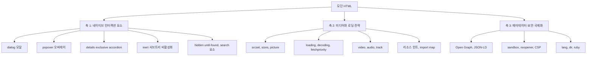

<Callout type="info">
  **이번 문서의 목표:** 이 문서를 다 읽으면 최근 HTML에 새 요소·속성이 몰려 들어온 이유를 근거를 들어 설명하고, "Baseline"이라는 개념이 왜 생겼는지 알며, 앞으로 이어질 26편의 본론이 어느 3개의 축 위에 놓여 있는지 지도를 머릿속에 그릴 수 있게 됩니다.
</Callout>

## 이 과목이 시작되는 지점

이 과목(모던 HTML, Modern HTML)은 `html/html_fundamentals` 과목을 이미 읽었거나 그 수준의 지식이 있다고 전제합니다. 문서 구조, `div`·`span` 같은 콘텐츠 카테고리, `input`·`select` 같은 전통적 폼 입력, `header`·`nav`·`main` 같은 시맨틱 sectioning(구획화), 접근성 기초, 브라우저가 HTML을 파싱(parsing, 구문 분석)하는 원리 — 이런 기본기는 여기서 다시 설명하지 않습니다. 이 과목은 그 위에서 **최근 몇 년 사이 HTML 표준에 새로 추가되었거나 관행이 바뀐 부분만** 깊게 팝니다.

"최근 몇 년 사이"라는 표현이 계속 등장할 텐데, 이 문서가 작성된 시점은 **2026년 9월**입니다. 웹 표준은 계속 움직이므로, 여러분이 이 문서를 읽는 시점에는 여기 적힌 지원 상태 일부가 이미 더 나아져 있을 수 있습니다. 이 감각을 스스로 점검하는 방법은 바로 다음 편(02편)에서 통째로 다룹니다.

## 몇 년 전까지만 해도 JS 라이브러리가 떠맡던 일들

HTML만으로 웹사이트를 만들던 초창기에는 "모달 창을 띄운다"거나 "툴팁을 보여준다" 같은 기본적인 상호작용조차 표준 HTML 요소만으로는 불가능했습니다. 그래서 개발자들은 자바스크립트(JavaScript) 라이브러리를 가져다 썼습니다.

- **모달**(modal, 화면 전체를 가리며 뜨는 대화상자)을 만들려면 `div`를 화면 전체에 깔고(overlay), 그 안에 또 `div`를 두어 내용물을 넣고, `position: fixed`와 `z-index`로 맨 위에 띄운 뒤, 자바스크립트로 포커스(focus, 키보드 입력이 향하는 지점)를 그 안에 가두고, `Esc` 키를 누르면 닫히게 하고, 배경을 스크롤하지 못하게 막는 코드를 전부 손으로 짜야 했습니다.
- **툴팁이나 드롭다운 메뉴**를 만들려면 버튼 바깥을 클릭했을 때 닫히는 "라이트 디스미스"(light dismiss, 가볍게 닫힘) 동작, 화면 밖으로 넘치지 않게 위치를 계산하는 로직을 직접 짜야 했습니다.
- **아코디언**(accordion, 클릭하면 펼쳐지고 접히는 목록)은 하나를 펼치면 나머지가 저절로 접히는 "하나만 열리는" 동작을 자바스크립트 이벤트 리스너로 일일이 관리해야 했습니다.

이런 부담 때문에 부트스트랩(Bootstrap)의 모달 컴포넌트, jQuery UI의 다이얼로그, 수많은 "React 모달 라이브러리" 같은 것들이 생겨났습니다. 문제는 이 라이브러리들이 **포커스 관리·키보드 접근성·스크린 리더(screen reader, 화면 읽어주는 프로그램) 대응**을 라이브러리마다 다르게, 그리고 종종 불완전하게 구현했다는 점입니다. 같은 "모달"이라도 라이브러리 A는 `Esc`로 닫히고 B는 안 닫히고, A는 포커스가 안에 갇히고 B는 새어 나가는 식이었습니다.

> **쉽게 말하면:** 브라우저 표준에 없던 기능을 개발자마다 각자 다른 방식으로 재발명하고 있었습니다. 재발명된 결과물의 품질은 들쭉날쭉했고, 특히 접근성은 항상 뒷전으로 밀렸습니다.

## 표준으로 들어오게 된 과정 — 상호운용성이라는 목표

브라우저 벤더(vendor, 제조사)들 — 구글(크롬), 모질라(파이어폭스), 애플(사파리), 마이크로소프트(엣지) — 은 이런 반복되는 요구를 보고 "이건 표준 HTML 요소로 만들어서 브라우저가 직접 포커스 관리·키보드 처리·접근성을 책임지자"는 방향으로 협의를 시작했습니다. 이 협의는 주로 **WHATWG**(Web Hypertext Application Technology Working Group, 웹 하이퍼텍스트 응용 기술 워킹 그룹)라는 단체가 관리하는 HTML 명세(specification, 규격 문서) 위에서 이루어집니다.

이렇게 표준화된 대표적인 결과물이 `dialog` 요소, `popover` 속성, `inert` 속성입니다. 셋 다 "포커스를 어디에 머물게 하고 어디는 못 가게 막을까"라는 같은 문제를 서로 다른 층위에서 풀며, 이 과목의 03~08편에서 깊게 다룹니다.

새 기능이 표준 명세에 실렸다고 곧바로 쓸 수 있는 것은 아닙니다. 명세에 실린 뒤 각 브라우저 엔진(크롬의 Blink, 파이어폭스의 Gecko, 사파리의 WebKit)이 실제로 구현하고, 그 구현이 크롬·파이어폭스·사파리 **전부**에 퍼져야 비로소 "안심하고 프로덕션(production, 실제 서비스)에 쓸 수 있다"고 말할 수 있습니다. 이 "여러 브라우저에 고르게 퍼진 상태"를 가리키는 이름이 다음 절의 주제입니다.

## Baseline이라는 개념이 등장한 이유

### 왜 필요했는가

표준 명세에 새 기능이 실렸다는 소식과, 그 기능을 실제로 안전하게 쓸 수 있다는 사실 사이에는 시차가 있습니다. 예전에는 이 시차를 확인하려면 [Can I Use](https://caniuse.com) 같은 사이트에서 브라우저별 버전 표를 하나하나 대조해야 했습니다. 표는 정확했지만 "그래서 지금 써도 되는가?"라는 질문에 한눈에 답해주지는 않았습니다.

> **쉽게 말하면:** Baseline(베이스라인, 기준선)은 "주요 브라우저들이 이 기능을 충분히 오래, 충분히 널리 지원하고 있는가"를 한 문장짜리 배지(badge)로 요약해 주는 지표입니다.

### 정의

**Baseline**은 WebDX(Web Developer Experience) 커뮤니티 그룹이 MDN(Mozilla Developer Network)·web.dev와 함께 관리하는 지표로, 어떤 웹 플랫폼 기능이 크롬·엣지·파이어폭스·사파리(그리고 각 모바일 버전)에서 지원되는 상태를 아래 세 단계 중 하나로 표기합니다.

| 상태 | 의미 | 이 과목에서의 표기 |
|------|------|------|
| Widely available (널리 사용 가능) | 주요 브라우저에 지원이 들어온 지 30개월(약 2년 6개월)이 지나 구형 사용자 환경까지 충분히 퍼졌다고 볼 수 있는 상태 | "널리 사용 가능" |
| Newly available (새로 사용 가능) | 주요 브라우저 최신 버전에는 모두 들어왔지만 아직 30개월이 지나지 않아 구형 브라우저 사용자가 남아있을 수 있는 상태 | "최신 브라우저 기준" |
| 아직 Baseline 미도달 | 일부 브라우저에만 있거나 실험적 플래그 뒤에 있는 상태 | "제한적·실험적" |

이 세 단계 표기는 앞으로 이어지는 모든 본론 편에서 기능이 등장할 때마다 반복해서 붙습니다. 예를 들어 `dialog` 요소는 "널리 사용 가능"(2022년 3월부터)이고, Customizable `<select>`(커스터마이즈 가능한 셀렉트)는 2026년 9월 기준 "제한적·실험적"입니다.

<Callout type="warning">
  **자주 틀리는 점:** "MDN 문서에 실려 있다" = "당장 프로덕션에 써도 된다"가 아닙니다. MDN은 실험 단계 기능도 문서화합니다. 반드시 문서 하단의 **브라우저 호환성 표**와 Baseline 배지를 함께 확인해야 합니다. 이 표를 읽는 구체적인 절차는 02편에서 다룹니다.
</Callout>

### 왜 이 감각이 이 과목 전체에 필요한가

이 과목이 다루는 기능들은 대부분 최근 2~4년 사이에 Baseline에 들어왔거나, 아직 들어오지 못했습니다. 즉 이 과목 자체가 통째로 "지원 상태가 빠르게 바뀌는 영역"을 다룹니다. 그래서 각 본론 편은 기능을 설명할 때마다 "이 문서가 쓰인 2026년 9월 기준으로는 이렇다"는 시점을 명시하고, 여러분이 실무에 적용하기 전에 MDN에서 그 시점의 최신 호환성 표를 직접 다시 확인하는 습관을 갖도록 안내합니다.

## 이 과목의 3대 축 지도

앞으로 26편에 걸쳐 다룰 본론은 다음 세 축 위에 놓여 있습니다.

- **축 1 — 네이티브 인터랙션 요소(03~11편)**: `dialog`·popover·`details name`·`inert`·`hidden="until-found"`는 모두 "포커스와 화면 가시성을 어떻게 통제할 것인가"라는 같은 문제를 모달(화면 전체를 막는 층위)·경량 오버레이(가볍게 뜨고 닫히는 층위)·임의 서브트리 비활성화(특정 영역만 죽이는 층위)라는 서로 다른 층위에서 풉니다. 이 세 층위의 차이를 정확히 구분하는 것이 이 축의 핵심입니다.
- **축 2 — 미디어와 로딩 전략(16~21편)**: 브라우저가 화면 크기·네트워크 상황에 맞는 이미지를 스스로 고르게 하는 반응형 이미지, 이미지·스크립트가 언제 얼마나 급하게 받아져야 하는지 알려주는 우선순위 힌트, 자막 있는 영상, 번들러(bundler) 없이 모듈을 조직하는 import map을 다룹니다.
- **축 3 — 메타데이터·보안·국제화(22~25편)**: 문서 자체를 설명하는 데이터(소셜 공유 미리보기, 검색 엔진용 구조화 데이터), 문서를 안전하게 만드는 속성(`sandbox`, `noopener`, CSP), 여러 언어·문자 방향을 다루는 속성(`lang`, `dir`, `ruby`)을 다룹니다.

폼(12~15편)은 축 1과 축 3 사이 어디쯤에 있는 독립된 흐름으로, 전통적 입력 타입 위에 얹힌 최신 UX(User Experience, 사용자 경험) 기능을 다룹니다. 27~29편은 이 세 축을 실제로 조합해 보는 종합 실습입니다.

## HTML Fundamentals와의 경계

같은 요소·주제라도 "무엇을 다루는가"의 경계가 다릅니다.

| 주제 | html_fundamentals가 다루는 것 | modern_html(이 과목)이 다루는 것 |
|------|------|------|
| 폼 | `input`·`select`·`textarea`의 기본 문법, 전통적 검증(`required`) | 최신 입력 타입의 UX, Constraint Validation API, `inputmode`, `autocomplete` 토큰 |
| 이미지 | `img` 요소의 기본 속성(`src`, `alt`) | `srcset`/`sizes`/`picture`로 반응형 이미지 만들기, 로딩 우선순위 제어 |
| 시맨틱 요소 | `header`/`nav`/`main`/`section`/`article` 등 sectioning 구조 | `search` 요소, `details name` 아코디언처럼 최근 추가되거나 확장된 요소 |
| 상호작용 | 요소 자체가 없음(자바스크립트 라이브러리로 구현하던 영역) | `dialog`, popover, `inert`처럼 브라우저가 직접 제공하는 상호작용 |
| 접근성 | 시맨틱 요소·ARIA(Accessible Rich Internet Applications, 접근성 있는 인터넷 애플리케이션)의 기초 개념 | 각 최신 기능이 접근성에 미치는 구체적 영향(포커스 트랩, 스크린 리더 announcement 등) |

`template`/`slot`/Declarative Shadow DOM(선언적 섀도 DOM)처럼 `javascript/web_component` 과목이 통째로 다루는 주제는, 이 과목에서는 11편에서 "이런 것도 있다" 수준의 개요만 그리고 세부 API는 그쪽 과목으로 넘깁니다.

## 핵심 정리

- 모달·툴팁·아코디언 같은 상호작용은 예전엔 JS 라이브러리가 각자 다르게 흉내 냈고, 특히 접근성 품질이 들쭉날쭉했다.
- 브라우저 벤더들이 WHATWG HTML 명세 위에서 협의해 이런 상호작용을 표준 요소·속성으로 승격시키는 흐름이 최근 몇 년간 이어지고 있다.
- Baseline은 "널리 사용 가능", "새로 사용 가능(최신 브라우저 기준)", "미도달(제한적·실험적)" 세 단계로 기능의 실제 사용 가능 시점을 요약한 지표다.
- 이 과목은 네이티브 인터랙션 요소, 미디어와 로딩 전략, 메타데이터·보안·국제화라는 3대 축과 그 사이의 폼 개선 흐름으로 구성된다.
- 이 과목은 html_fundamentals가 다룬 기본기를 전제하고, 최근 추가되거나 관행이 바뀐 부분만 깊게 다룬다.

## 마무리 복습

<Quiz
  questionNumber={1}
  question="예전에 모달을 자바스크립트 라이브러리로 직접 구현할 때 개발자가 손으로 짜야 했던 것으로 옳지 않은 것은?"
  options={['포커스를 모달 안에 가두는 로직', 'Esc 키로 닫는 이벤트 처리', '배경 스크롤을 막는 처리', 'HTML 파서가 태그를 트리로 만드는 처리']}
  correctAnswer={4}
  explanation="HTML 파서가 태그를 DOM 트리로 만드는 것은 브라우저 엔진이 항상 하는 내부 동작이며, 모달 구현과 무관하게 이미 존재하는 처리입니다. 포커스 가두기, Esc 처리, 배경 스크롤 방지는 모두 예전에 라이브러리가 직접 구현해야 했던 부분입니다."
  optionExplanations={['실제로 모달 라이브러리가 직접 구현해야 했던 부분입니다', '실제로 모달 라이브러리가 직접 구현해야 했던 부분입니다', '실제로 모달 라이브러리가 직접 구현해야 했던 부분입니다', '이것이 정답입니다 — 파싱은 모달 구현과 무관한 브라우저 기본 동작입니다']}
/>

<Quiz
  questionNumber={2}
  question="dialog 요소, popover 속성, inert 속성의 공통점으로 가장 적절한 것은?"
  options={['모두 같은 층위에서 똑같은 방식으로 모달을 구현한다', '포커스와 화면 가시성 통제라는 같은 문제를 서로 다른 층위에서 해결한다', '모두 자바스크립트 없이는 동작하지 않는다', '모두 폼 요소의 일종이다']}
  correctAnswer={2}
  explanation="세 기능은 포커스와 가시성을 통제한다는 같은 문제의식을 공유하지만, 모달(dialog)·경량 오버레이(popover)·임의 서브트리 비활성화(inert)라는 서로 다른 층위에서 문제를 풉니다."
  optionExplanations={['층위가 서로 다릅니다 — 모달, 경량 오버레이, 서브트리 비활성화로 구분됩니다', '이것이 정답입니다', 'dialog와 popover의 기본 열고 닫기는 자바스크립트 없이도 속성만으로 동작합니다', '폼 요소가 아니라 상호작용·가시성 제어 기능입니다']}
/>

<Quiz
  questionNumber={3}
  question="Baseline의 세 단계 중 '최신 브라우저 기준'으로 표기하는 상태에 해당하는 것은?"
  options={['30개월이 지나 구형 환경까지 퍼진 상태', '주요 브라우저 최신 버전에는 들어왔지만 아직 30개월이 지나지 않은 상태', '일부 브라우저에만 실험적으로 존재하는 상태', '표준 명세에 아직 제안조차 되지 않은 상태']}
  correctAnswer={2}
  explanation="이 상태는 Baseline의 'Newly available(새로 사용 가능)'에 해당하며, 이 과목에서는 '최신 브라우저 기준'으로 표기합니다."
  optionExplanations={['이는 Widely available, 즉 널리 사용 가능 상태입니다', '이것이 정답입니다', '이는 Baseline 미도달(제한적·실험적) 상태입니다', 'Baseline은 표준 명세 제안 단계가 아니라 실제 브라우저 구현 상태를 다룹니다']}
/>

<Quiz
  questionNumber={4}
  question="'MDN 문서에 어떤 기능이 실려 있다'는 사실만으로 판단할 수 없는 것은?"
  options={['그 기능의 문법', '그 기능의 이름', '그 기능을 지금 프로덕션에 써도 되는지 여부', '그 기능이 속한 카테고리']}
  correctAnswer={3}
  explanation="MDN은 실험 단계 기능도 문서화하므로, 프로덕션 사용 가능 여부는 문서 하단의 브라우저 호환성 표와 Baseline 배지를 따로 확인해야 판단할 수 있습니다."
  optionExplanations={['문법은 문서에 그대로 실려 있습니다', '이름도 문서에 그대로 실려 있습니다', '이것이 정답입니다 — 별도로 호환성 표를 확인해야 합니다', '카테고리 분류도 문서 상단에 보통 표시됩니다']}
/>

<Quiz
  questionNumber={5}
  question="이 과목의 축 2(미디어와 로딩 전략)에 속하는 주제로 옳은 것은?"
  options={['dialog로 만드는 모달', 'Constraint Validation API', 'srcset과 sizes를 이용한 반응형 이미지', 'CSP meta 태그']}
  correctAnswer={3}
  explanation="srcset과 sizes는 반응형 이미지, 즉 축 2(미디어와 로딩 전략)에 속합니다. dialog는 축 1, Constraint Validation은 폼 개선 흐름, CSP는 축 3(보안)에 속합니다."
  optionExplanations={['축 1(네이티브 인터랙션 요소)에 속합니다', '폼 개선 흐름에 속하며 축 1과 축 3 사이의 독립된 흐름입니다', '이것이 정답입니다', '축 3(보안)에 속합니다']}
/>

<Quiz
  questionNumber={6}
  question="template, slot, Declarative Shadow DOM에 대해 이 과목이 취하는 태도로 옳은 것은?"
  options={['API 전체를 처음부터 끝까지 깊게 다룬다', '전혀 언급하지 않고 건너뛴다', '개요 편 하나에서 존재와 위치만 소개하고 세부는 다른 과목으로 안내한다', 'HTML Fundamentals에서 이미 다뤘다고 가정하고 생략한다']}
  correctAnswer={3}
  explanation="이 세 가지의 API 전체는 javascript/web_component 과목이 다루므로, 이 과목의 11편은 개요만 그리고 세부는 그쪽 과목을 안내합니다."
  optionExplanations={['API 전체는 javascript/web_component 과목의 몫입니다', '11편에서 개요로 다룹니다', '이것이 정답입니다', 'html_fundamentals가 아니라 javascript/web_component가 다루는 주제입니다']}
/>

## 참고 자료

- [MDN — Baseline과 브라우저 호환성](https://developer.mozilla.org/en-US/docs/Glossary/Baseline/Compatibility)
- [web.dev — Popover API lands in Baseline](https://web.dev/blog/popover-api)
- [MDN — `<dialog>`](https://developer.mozilla.org/en-US/docs/Web/HTML/Reference/Elements/dialog)
