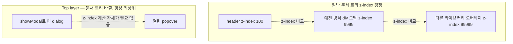

<Callout type="info">
  **이번 문서의 목표:** 이 문서를 다 읽으면 `dialog` 요소를 `show()`와 `showModal()`로 각각 열었을 때 무엇이 다른지 근거를 들어 설명하고, `::backdrop`과 top layer(톱 레이어) 개념으로 모달이 어떻게 화면 맨 위에 뜨는지, 그리고 `Esc` 키가 왜 저절로 모달을 닫는지 설명할 수 있게 됩니다.
</Callout>

## 왜 `<dialog>`가 필요했는가

01편에서 본 것처럼, `dialog` 요소가 표준화되기 전에는 모달을 `div` 몇 겹과 CSS `position: fixed`, `z-index`, 그리고 손으로 짠 자바스크립트로 흉내 냈습니다. 이 방식의 문제는 세 가지였습니다.

1. **z-index 전쟁**: 페이지 안에 이미 `z-index: 9999`짜리 요소가 있으면 모달이 그 뒤에 가려질 수 있었습니다. "얼마나 큰 숫자를 써야 확실히 맨 위에 뜨는가"는 프로젝트마다 다른 답을 가진 골치 아픈 질문이었습니다.
2. **포커스 관리**: 모달이 열렸는데 키보드로 `Tab`을 누르면 포커스가 모달 뒤에 깔린 배경 콘텐츠로 새어 나가는 버그가 흔했습니다. 스크린 리더 사용자는 모달이 열린 줄도 모르고 배경을 계속 읽어나가는 경우도 있었습니다.
3. **키보드 동작의 비표준화**: `Esc`로 닫히는지, 배경 클릭으로 닫히는지가 라이브러리마다 달랐습니다.

`dialog` 요소는 이 세 가지를 브라우저가 **직접 책임지도록** 만들었습니다.

## `<dialog>` 요소의 정체

**`dialog`**는 이름 그대로 "대화상자"를 나타내는 HTML 요소입니다. 기본적으로는 화면에 보이지 않습니다.

```html
<dialog id="내-모달">
  <p>이것은 대화상자 내용입니다.</p>
  <button id="닫기버튼">닫기</button>
</dialog>
```

이 마크업만으로는 아무 일도 일어나지 않습니다. `dialog` 요소는 `open`이라는 불리언(boolean, 참/거짓) 속성이 붙어 있지 않으면 자동으로 `display: none`(화면에 렌더링하지 않음) 상태가 되기 때문입니다. 이 요소를 화면에 띄우는 방법은 두 가지이고, 이 둘의 차이가 이 편의 핵심입니다.

## `show()`와 `showModal()` — 같은 요소, 다른 두 세계

`dialog` 요소를 자바스크립트로 조작하려면 먼저 요소를 참조해야 합니다.

```js
const 모달 = document.querySelector("#내-모달");
```

이 `모달` 객체에는 두 개의 메서드가 있습니다.

| | `show()` | `showModal()` |
|---|---|---|
| 이름의 의미 | 그냥 "보여준다" | "모달로서" 보여준다 |
| 배경 상호작용 | 배경 콘텐츠를 계속 클릭·포커스할 수 있다 | 배경 콘텐츠가 `inert`(비활성) 상태가 되어 클릭·포커스가 안 먹는다 |
| `::backdrop` | 생기지 않는다 | 생긴다(배경을 어둡게 까는 레이어) |
| 렌더링 위치 | 문서 흐름 안에서 `position: fixed`처럼 동작하되 top layer는 아니다 | top layer(톱 레이어)라는 별도 층에 렌더링된다 |
| `Esc` 키로 닫힘 | 닫히지 않는다 | 자동으로 닫힌다(`cancel` 이벤트 발생 후 닫힘) |
| 접근성 트리에서의 역할 | 암묵적 역할 없음(일반 콘텐츠와 동일하게 취급) | 암묵적으로 `role="dialog"`이자 `aria-modal="true"`로 취급되어 스크린 리더가 "이 밖은 지금 접근 불가"임을 인지 |

`show()`로 연 `dialog`는 "화면 위에 떠 있는 카드" 정도의 의미입니다. 배경과 여전히 상호작용할 수 있으므로, 예를 들어 "이 페이지의 다른 곳을 계속 보면서 참고할 메모창" 같은 논모달(non-modal, 비모달) 용도에 어울립니다.

`showModal()`로 연 `dialog`가 진짜 우리가 흔히 말하는 "모달"입니다. 배경이 완전히 잠기고, 이 창이 닫히기 전까지는 페이지의 다른 어떤 것도 조작할 수 없습니다.

> **쉽게 말하면:** `show()`는 "화면 위에 얹어만 놓기"이고, `showModal()`은 "이 창을 닫기 전까지 나머지 세상은 얼려두기"입니다.

<Callout type="warning">
  **자주 틀리는 점:** HTML 마크업에 `<dialog open>`처럼 `open` 속성을 직접 써서 "열어두는" 것은 `show()`를 호출한 것과 같은 상태입니다. **절대 모달이 되지 않습니다.** `showModal()`을 자바스크립트로 호출해야만 모달 동작(배경 잠금, `::backdrop`, `Esc` 자동 닫힘)이 생깁니다.
</Callout>

## Top layer — 화면 맨 위 전용 특별한 층

### 왜 필요했는가

`z-index`는 같은 쌓임 맥락(stacking context, 요소들이 서로 겹치는 순서를 계산하는 단위) 안에서만 순서를 정합니다. 문제는 CSS의 `transform`, `filter`, `opacity` 같은 속성이 각자 새로운 쌓임 맥락을 만들어 버린다는 점입니다. 부모 요소 중 하나라도 이런 속성을 쓰고 있으면, 자식에 아무리 큰 `z-index`를 줘도 그 부모의 쌓임 맥락 밖으로 못 나갑니다. 그래서 예전 모달 라이브러리들은 모달 `div`를 아예 `body` 바로 아래로 DOM 위치 자체를 옮기는(portal, 포털) 편법을 자주 썼습니다.

### 정의

**top layer**(톱 레이어)는 이런 쌓임 맥락 계산과는 완전히 별개로 존재하는, 브라우저가 관리하는 **문서 트리 바깥의 특별한 층**입니다. `showModal()`로 연 `dialog`는 이 top layer로 이동해 렌더링되므로, 페이지 안에 어떤 `z-index`나 `transform`이 있어도 항상 모든 것 위에 뜹니다.



top layer 안에서도 여러 개가 열리면 순서가 있습니다. **나중에 연 것이 항상 먼저 연 것 위에 옵니다.** 이 규칙은 05·06편에서 popover와 `dialog`를 함께 쓸 때 다시 중요해집니다.

> **쉽게 말하면:** top layer는 건물 옥상 헬기장 같은 곳입니다. 건물 안 몇 층에 있든 상관없이, 헬기장에 올라간 것은 항상 건물 전체보다 높습니다.

## `::backdrop` — 배경을 덮는 가상 요소

`showModal()`로 `dialog`가 열리면 브라우저가 자동으로 **`::backdrop`**이라는 의사 요소(pseudo-element, 실제 DOM에는 없지만 CSS로 스타일링할 수 있는 가상의 요소)를 그 `dialog`의 바로 아래에 만들어 화면 전체를 덮습니다. 이름 그대로 "배경"(backdrop)입니다.

```css
dialog::backdrop {
  background-color: rgb(0 0 0 / 50%);
  backdrop-filter: blur(2px);
}
```

`::backdrop`은 `show()`로 열었을 때는 생기지 않습니다. 이 의사 요소 하나만으로 예전에 별도 `div`를 만들어 오버레이를 구현하던 코드가 통째로 사라집니다.

## `Esc` 키와 `cancel` 이벤트

`showModal()`로 연 `dialog`는 `Esc` 키를 누르면 브라우저가 자동으로 닫아줍니다. 이때 정확한 순서는 다음과 같습니다.

1. `cancel` 이벤트가 먼저 발생합니다. 이 이벤트에서 `event.preventDefault()`를 호출하면 닫히는 것을 막을 수 있습니다(예: "저장하지 않은 내용이 있습니다" 확인창을 먼저 띄우고 싶을 때).
2. 막지 않았다면 `dialog`가 닫히고 `close` 이벤트가 발생합니다(`close` 이벤트는 04편에서 폼과 함께 자세히 다룹니다).

```js
모달.addEventListener("cancel", (event) => {
  const 확인 = window.confirm("저장하지 않은 내용이 있습니다. 닫을까요?");
  if (!확인) {
    event.preventDefault(); // Esc를 눌러도 닫히지 않는다
  }
});
```

## 접근성 관점 — 스크린 리더에게 무엇이 전달되는가

`showModal()`로 `dialog`를 열면 브라우저는 자동으로 다음을 처리합니다.

- 접근성 트리(accessibility tree, 스크린 리더가 실제로 읽는 정보 구조)에서 이 `dialog`에 암묵적으로 `role="dialog"`와 `aria-modal="true"`를 부여합니다. 스크린 리더 사용자는 "지금 대화상자 안에 들어와 있고, 이 밖은 접근할 수 없다"는 사실을 안내받습니다.
- 배경 콘텐츠는 자동으로 `inert` 취급되어(08편에서 `inert` 자체를 자세히 다룹니다) 스크린 리더의 "다음 항목 읽기" 탐색에서도 건너뛰어집니다.

다만 브라우저가 자동으로 처리하지 않는 것도 있습니다. **모달을 열 때 포커스를 어디에 둘지, 닫을 때 어디로 되돌릴지**는 04편에서 다루는 `autofocus`와 포커스 복귀 로직이 필요합니다. 이번 편의 실습에서는 열고 닫는 기본 동작까지만 확인합니다.

## 직접 열고 닫아보기

아래 실습기에서 같은 `dialog` 요소를 `show()`와 `showModal()` 두 방식으로 각각 열어 차이를 눈으로 확인하세요. `showModal()`로 연 뒤에는 배경의 "배경 버튼"을 클릭해도 반응이 없는지, `Esc`를 누르면 닫히는지 확인해 보세요.

<CodePlayground
  template="vanilla"
  activeFile="/index.js"
  showConsole
  label="show()와 showModal()의 차이 직접 확인하기"
  files={{
    '/index.html': `<div id="app">
  <button id="배경버튼" onclick="console.log('배경 버튼이 눌렸다')">배경 버튼 (모달 중엔 안 눌려야 정상)</button>
  <br /><br />
  <button id="show-열기">show()로 열기 (논모달)</button>
  <button id="showmodal-열기">showModal()로 열기 (모달)</button>

  <dialog id="내-모달">
    <p>안녕하세요, 저는 dialog입니다.</p>
    <p>이 창이 어떻게 열렸는지 콘솔을 확인하세요.</p>
    <button id="닫기버튼">닫기</button>
  </dialog>
</div>`,
    '/styles.css': `dialog {
  border: 2px solid #4b5563;
  border-radius: 8px;
  padding: 24px;
}

dialog::backdrop {
  background-color: rgb(0 0 0 / 50%);
}

#app {
  font-family: system-ui, sans-serif;
  padding: 16px;
}`,
    '/index.js': `const 모달 = document.querySelector("#내-모달");
const 닫기버튼 = document.querySelector("#닫기버튼");

document.querySelector("#show-열기").addEventListener("click", () => {
  모달.show();
  console.log("show() 호출 — ::backdrop 없음, 배경 버튼 클릭 가능, Esc로 안 닫힘");
});

document.querySelector("#showmodal-열기").addEventListener("click", () => {
  모달.showModal();
  console.log("showModal() 호출 — ::backdrop 생김, 배경 inert 처리, Esc로 닫힘");
});

닫기버튼.addEventListener("click", () => {
  모달.close();
});

모달.addEventListener("cancel", () => {
  console.log("cancel 이벤트 발생 — Esc가 눌렸다 (showModal일 때만)");
});

모달.addEventListener("close", () => {
  console.log("close 이벤트 발생 — 모달이 닫혔다");
});`,
  }}
/>

콘솔 로그로 두 방식의 차이를 직접 대조해 보면, `show()`로 연 상태에서는 "배경 버튼" 클릭 로그가 그대로 찍히지만, `showModal()`로 연 상태에서는 배경 버튼을 클릭해도 아무 로그가 찍히지 않는 것을 확인할 수 있습니다. 이것이 `inert` 처리가 실제로 클릭을 막고 있다는 증거입니다.

## 지원 상태

`dialog` 요소는 2026년 9월 기준 **널리 사용 가능**(Widely available, 2022년 3월부터)합니다. 폴백 없이 기본기로 사용해도 되는 단계입니다.

## 핵심 정리

- `show()`는 논모달로 띄우고(배경 상호작용 가능, `::backdrop` 없음, `Esc`로 안 닫힘), `showModal()`은 진짜 모달로 띄운다(배경 `inert`, `::backdrop` 생성, `Esc`로 닫힘).
- HTML에 `open` 속성만 붙여서는 절대 모달이 되지 않는다. 모달 동작은 반드시 `showModal()` 호출이 필요하다.
- top layer는 문서 트리의 쌓임 맥락 계산과 무관한 별도의 최상위 층으로, `z-index` 전쟁을 원천적으로 없앤다.
- `Esc` 키는 `cancel` 이벤트를 먼저 발생시키고, `preventDefault()`로 닫힘을 막을 수 있다.
- `showModal()`은 암묵적으로 `role="dialog"`와 `aria-modal="true"`를 부여하고 배경을 스크린 리더 탐색에서도 제외한다.

## 마무리 복습

<Quiz
  questionNumber={1}
  question="dialog 요소에 open 속성만 붙여서 HTML에 정적으로 작성했을 때의 동작으로 옳은 것은?"
  options={['모달로 열리며 배경이 잠긴다', '배경 상호작용이 가능한 논모달 상태로 보인다', '아무것도 화면에 나타나지 않는다', 'Esc를 누르면 자동으로 닫힌다']}
  correctAnswer={2}
  explanation="open 속성만으로는 show()를 호출한 것과 같은 논모달 상태가 되며, 배경과 계속 상호작용할 수 있고 backdrop도 생기지 않습니다."
  optionExplanations={['모달이 되려면 showModal()을 반드시 호출해야 합니다', '이것이 정답입니다', 'open 속성이 있으면 화면에 보입니다', 'Esc 자동 닫힘은 showModal()로 열었을 때만 동작합니다']}
/>

<Quiz
  questionNumber={2}
  question="showModal()로 연 dialog와 show()로 연 dialog의 차이로 옳지 않은 것은?"
  options={['showModal()은 backdrop 의사 요소를 만든다', 'showModal()은 배경을 inert 상태로 만든다', 'showModal()은 top layer에 렌더링된다', '두 방식 모두 close() 메서드로 닫을 수 없다']}
  correctAnswer={4}
  explanation="close() 메서드는 show()나 showModal() 어느 방식으로 열었든 동일하게 사용할 수 있어 이 설명은 옳지 않습니다."
  optionExplanations={['showModal()의 실제 동작입니다', 'showModal()의 실제 동작입니다', 'showModal()의 실제 동작입니다', '이것이 정답입니다 — 두 방식 모두 close()로 닫을 수 있습니다']}
/>

<Quiz
  questionNumber={3}
  question="top layer 개념이 해결하는 문제로 가장 적절한 것은?"
  options={['네트워크 요청 속도 문제', 'transform이나 filter로 인해 새 쌓임 맥락이 생겨 z-index가 먹히지 않는 문제', '자바스크립트 실행 순서 문제', 'HTML 파싱 오류 문제']}
  correctAnswer={2}
  explanation="top layer는 문서 트리의 쌓임 맥락 계산과 완전히 분리된 별도의 층이라, 부모 요소의 transform·filter로 인해 z-index가 갇히는 문제 없이 항상 최상위에 렌더링됩니다."
  optionExplanations={['네트워크와는 무관한 렌더링·쌓임 순서 개념입니다', '이것이 정답입니다', '실행 순서가 아니라 시각적 쌓임 순서의 문제입니다', '파싱과는 무관합니다']}
/>

<Quiz
  questionNumber={4}
  question="showModal()로 연 dialog에서 Esc 키를 눌렀을 때 순서로 옳은 것은?"
  options={['close 이벤트만 발생하고 즉시 닫힌다', 'cancel 이벤트가 먼저 발생하고, 막지 않으면 닫히며 close 이벤트가 이어진다', 'cancel 이벤트가 발생해도 항상 무조건 닫힌다', '아무 이벤트도 발생하지 않고 조용히 닫힌다']}
  correctAnswer={2}
  explanation="cancel 이벤트가 먼저 발생하며 preventDefault()로 닫힘을 막을 수 있고, 막지 않으면 실제로 닫히면서 close 이벤트가 발생합니다."
  optionExplanations={['cancel 이벤트가 close보다 먼저 발생합니다', '이것이 정답입니다', 'preventDefault()를 호출하면 닫히는 것을 막을 수 있습니다', '두 이벤트 모두 실제로 발생합니다']}
/>

<Quiz
  questionNumber={5}
  question="showModal()로 연 dialog가 스크린 리더 사용자에게 암묵적으로 전달하는 정보로 옳은 것은?"
  options={['role은 button이다', 'role은 dialog이고 aria-modal은 true다', '접근성 트리에 아무 영향도 주지 않는다', '배경 콘텐츠도 계속 읽을 수 있다고 안내한다']}
  correctAnswer={2}
  explanation="showModal()은 암묵적으로 role=dialog와 aria-modal=true를 부여해 스크린 리더 사용자에게 지금이 모달 상태임을 알립니다."
  optionExplanations={['role은 button이 아니라 dialog입니다', '이것이 정답입니다', '접근성 트리에 실제로 영향을 줍니다', '배경은 inert 처리되어 접근이 막힙니다']}
/>

<Quiz
  questionNumber={6}
  question="예전에 div로 모달을 구현할 때 겪던 z-index 전쟁 문제의 근본 원인으로 가장 적절한 것은?"
  options={['CSS 파일 용량이 너무 커서', 'transform, filter, opacity 등이 새로운 쌓임 맥락을 만들어 자식의 z-index가 그 맥락 밖으로 못 나가기 때문에', '브라우저가 z-index 속성 자체를 지원하지 않아서', 'HTML 문서에 dialog 요소가 없어서 발생한 문법 오류 때문에']}
  correctAnswer={2}
  explanation="z-index는 같은 쌓임 맥락 안에서만 비교되며, 부모가 transform 등으로 새 쌓임 맥락을 만들면 자식의 z-index가 그 밖으로 나갈 수 없어 문제가 생겼습니다."
  optionExplanations={['CSS 파일 용량과는 무관합니다', '이것이 정답입니다', 'z-index 자체는 오래전부터 지원되는 속성입니다', 'dialog가 없다고 문법 오류가 나지는 않습니다 — 다만 표준 모달 동작이 없었을 뿐입니다']}
/>

## 참고 자료

- [MDN — `<dialog>`](https://developer.mozilla.org/en-US/docs/Web/HTML/Reference/Elements/dialog)
