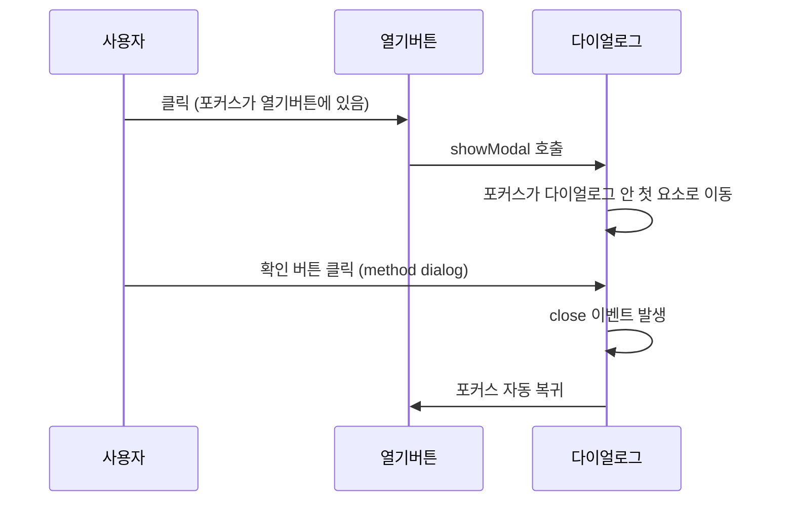

<Callout type="info">
  **이번 문서의 목표:** 이 문서를 다 읽으면 `method="dialog"`로 폼 제출과 다이얼로그 닫힘을 자바스크립트 없이 연결하고, `dialog`가 열릴 때 포커스가 어디로 이동하며 왜 그 안에 갇히는지, 닫힐 때 포커스가 어디로 돌아가야 하는지를 설명하고 직접 구현할 수 있게 됩니다.
</Callout>

## 이 편이 다루는 문제

03편에서 `dialog`를 여는 두 방법과 top layer, `::backdrop`, `Esc` 닫힘을 배웠습니다. 그런데 실제 모달은 대부분 "확인" 버튼이나 폼 제출과 함께 닫힙니다. "이 폼 안의 버튼을 눌렀을 때 다이얼로그가 닫히면서, 어떤 버튼을 눌렀는지 스크립트로 알 수 있는가?"와 "모달이 열리고 닫힐 때 키보드 포커스는 정확히 어디로 가는가?" — 이 두 질문이 이번 편의 주제입니다.

## `method="dialog"` — 폼과 다이얼로그를 잇는 다리

### 왜 필요했는가

일반적인 `form`은 `submit`(제출)되면 서버로 요청을 보내거나 페이지를 새로고침합니다. 그런데 다이얼로그 안의 "확인"·"취소" 버튼은 대개 서버로 아무것도 보낼 필요 없이 **그냥 다이얼로그를 닫고, 어떤 버튼이 눌렸는지만 알려주면** 충분합니다. 이걸 위해 매번 `event.preventDefault()`로 기본 제출을 막고 `dialog.close()`를 직접 호출하는 코드를 짜는 것은 번거롭습니다.

### 정의와 동작

`dialog` 안의 `form` 요소에 `method="dialog"`를 지정하면, 그 폼이 제출될 때 브라우저가 자동으로 다음을 처리합니다.

1. 서버로 요청을 보내지 않고 페이지 새로고침도 하지 않습니다.
2. 그 폼을 감싸고 있는 `dialog`를 자동으로 닫습니다.
3. 제출을 유발한 버튼(주로 `button` 요소, `type="submit"`)의 `value` 속성값을 `dialog.returnValue`(리턴값)에 저장합니다.

```html
<dialog id="확인창">
  <form method="dialog">
    <p>정말 삭제하시겠습니까?</p>
    <button value="cancel">취소</button>
    <button value="confirm">삭제</button>
  </form>
</dialog>
```

```js
확인창.addEventListener("close", () => {
  console.log("눌린 버튼의 값:", 확인창.returnValue); // "cancel" 또는 "confirm"
});
```

> **쉽게 말하면:** `method="dialog"`는 "이 폼을 제출한다"는 행동을 "이 창을 닫고, 어떤 버튼이 눌렸는지만 알려준다"는 행동으로 바꿔치기하는 스위치입니다.

<Callout type="warning">
  **자주 틀리는 점:** `returnValue`는 폼 안의 **텍스트 입력값**이 아니라 **제출을 유발한 버튼의 value 속성값**입니다. 입력 필드의 값을 읽으려면 평소처럼 `FormData`나 각 입력 요소의 `.value`를 따로 읽어야 합니다. `returnValue`는 "어떤 선택지로 닫혔는가"만 알려줍니다.
</Callout>

`returnValue`는 `dialog.close("직접 넣은 값")`처럼 `close()` 메서드의 인자로도 설정할 수 있습니다. `method="dialog"`를 안 쓰고 자바스크립트로 직접 닫을 때 이 방식을 씁니다.

## 열릴 때 자동 포커스 이동

`showModal()`로 `dialog`가 열리면, 브라우저는 포커스를 다음 우선순위로 자동 이동시킵니다.

1. `dialog` 안에 `autofocus` 속성이 붙은 요소가 있으면 그곳으로.
2. 없으면 `dialog` 안에서 포커스를 받을 수 있는 첫 번째 요소(첫 번째 버튼, 입력 필드 등)로.
3. 포커스를 받을 요소가 하나도 없으면 `dialog` 자체로(`tabindex` 없이도 다이얼로그 요소 스스로가 포커스를 받을 수 있습니다).

```html
<dialog id="검색창">
  <form method="dialog">
    <label>검색어 <input type="text" autofocus /></label>
    <button value="close">닫기</button>
  </form>
</dialog>
```

이 예시에서는 다이얼로그가 열리자마자 검색어 입력창에 커서가 바로 놓입니다. 사용자가 클릭 한 번 없이 바로 타이핑을 시작할 수 있습니다.

## 포커스 트랩 — 왜 배경으로 새어 나가지 않는가

03편에서 `showModal()`이 배경을 `inert` 상태로 만든다고 배웠습니다. `inert`는 08편에서 자세히 다루지만, 여기서 알아야 할 결과는 하나입니다. **`Tab` 키로 포커스를 이동시켜도, `inert` 처리된 배경 요소들은 애초에 포커스를 받을 수 있는 후보 목록에서 제외됩니다.** 그래서 `dialog` 안에서 `Tab`을 계속 눌러도 포커스가 `dialog` 안의 요소들 사이를 순환할 뿐 절대 배경으로 빠져나가지 않습니다. 이것이 바로 **포커스 트랩**(focus trap, 포커스 가두기)입니다.

예전 모달 라이브러리들은 이 트랩을 만들기 위해 `Tab`·`Shift+Tab` 키 입력을 가로채 "지금 포커스가 다이얼로그의 마지막 요소인데 Tab을 또 눌렀으면 첫 요소로 강제로 돌려보낸다"는 로직을 직접 짜야 했습니다. `dialog`는 이 로직이 필요 없습니다. 배경 자체가 포커스 후보에서 아예 사라지기 때문입니다.

## 닫힐 때 포커스 복귀

`dialog`가 닫히면 브라우저는 **포커스를 다이얼로그를 열기 전 포커스가 있던 요소로 자동으로 되돌립니다.** 보통은 다이얼로그를 열게 만든 버튼입니다.



이 자동 복귀 덕분에, 키보드만으로 페이지를 조작하는 사용자나 스크린 리더 사용자가 "모달을 열었던 그 지점"을 다시 찾아 헤맬 필요가 없습니다. 시각적으로는 아무것도 안 보이지만, 포커스가 어디 있는지는 키보드·스크린 리더 사용자에게 페이지 안에서 유일한 "지금 내 위치" 신호이기 때문에 이 복귀 동작은 접근성에서 매우 중요합니다.

<Callout type="warning">
  **자주 틀리는 점:** 다이얼로그를 여는 버튼을 자바스크립트로 동적으로 여러 개 만들었다가 지워버리는 경우, 원래 포커스가 있던 요소가 DOM에서 사라져 브라우저가 복귀시킬 곳을 잃을 수 있습니다. 이런 경우 `close` 이벤트에서 직접 원하는 요소에 `.focus()`를 호출해 명시적으로 복귀시켜야 합니다.
</Callout>

## `close` 이벤트로 후속 처리 묶기

`close` 이벤트는 `close()` 메서드 호출, `Esc` 키, `method="dialog"` 폼 제출 등 **다이얼로그가 닫히는 모든 경로**에서 공통으로 발생합니다. 그래서 "닫힌 뒤 무엇을 할지"를 한 곳에 모아둘 수 있는 지점입니다.

```js
확인창.addEventListener("close", () => {
  if (확인창.returnValue === "confirm") {
    실제로삭제한다();
  }
  // 어떤 경로로 닫혔든 여기서 후속 처리를 한 곳에서 관리한다
});
```

## 직접 확인해보기 — 폼 연동과 포커스 이동

아래 실습기에서 콘솔을 보며 세 가지를 확인하세요. (1) `autofocus`가 붙은 입력창에 커서가 바로 가는지, (2) `Tab`을 여러 번 눌러도 포커스가 다이얼로그 밖으로 안 나가는지, (3) 취소·확인 중 어떤 버튼을 눌렀는지에 따라 `returnValue`가 다르게 찍히는지.

<CodePlayground
  template="vanilla"
  activeFile="/index.js"
  showConsole
  label="method=dialog와 포커스 흐름 확인"
  files={{
    '/index.html': `<div id="app">
  <button id="열기버튼">회원 탈퇴</button>

  <dialog id="확인창">
    <form method="dialog">
      <p>정말 탈퇴하시겠습니까?</p>
      <label>사유(선택) <input type="text" id="사유입력" autofocus /></label>
      <div>
        <button value="cancel">취소</button>
        <button value="confirm">탈퇴</button>
      </div>
    </form>
  </dialog>
</div>`,
    '/styles.css': `dialog {
  border: 2px solid #4b5563;
  border-radius: 8px;
  padding: 20px;
  min-width: 280px;
}

dialog::backdrop {
  background-color: rgb(0 0 0 / 45%);
}

#app {
  font-family: system-ui, sans-serif;
  padding: 16px;
}`,
    '/index.js': `const 열기버튼 = document.querySelector("#열기버튼");
const 확인창 = document.querySelector("#확인창");

열기버튼.addEventListener("click", () => {
  console.log("열기 전 포커스:", document.activeElement.textContent || document.activeElement.tagName);
  확인창.showModal();
  // 열리자마자 어디에 포커스가 있는지 살짝 뒤에 확인
  setTimeout(() => {
    console.log("열린 직후 포커스가 있는 요소:", document.activeElement.id || document.activeElement.tagName);
  }, 0);
});

확인창.addEventListener("close", () => {
  console.log("returnValue:", 확인창.returnValue);
  console.log("닫힌 뒤 포커스 복귀 위치:", document.activeElement.id || document.activeElement.tagName);
  if (확인창.returnValue === "confirm") {
    console.log("→ 실제 서비스라면 여기서 탈퇴 처리를 진행합니다");
  } else {
    console.log("→ 취소되어 아무 처리도 하지 않습니다");
  }
});`,
  }}
/>

콘솔 로그를 순서대로 읽으면 "열기 전 포커스는 열기버튼 → 열린 직후 포커스는 사유입력(autofocus) → 닫힌 뒤 포커스는 다시 열기버튼"으로 이어지는 흐름이 보입니다. 이 흐름 전체가 브라우저가 자동으로 처리한 것이고, 우리가 짠 코드는 `console.log`뿐입니다.

## 핵심 정리

- `method="dialog"`인 폼은 제출 시 서버로 보내지 않고 다이얼로그를 자동으로 닫으며, 누른 버튼의 `value`를 `dialog.returnValue`에 저장한다.
- `showModal()`이 열리면 `autofocus` 요소, 없으면 첫 포커스 가능 요소, 그마저 없으면 다이얼로그 자체로 포커스가 자동 이동한다.
- 배경이 `inert` 처리되어 포커스 후보에서 제외되므로, `Tab`을 눌러도 포커스가 다이얼로그 밖으로 새어 나가지 않는 포커스 트랩이 자동으로 만들어진다.
- 다이얼로그가 닫히면 포커스가 열기 전 위치로 자동 복귀하며, 그 요소가 사라졌다면 직접 `.focus()`로 복귀시켜야 한다.
- `close` 이벤트는 닫히는 모든 경로(버튼, `Esc`, 폼 제출)에서 공통으로 발생해 후속 처리를 한 곳에 모을 수 있다.

## 마무리 복습

<Quiz
  questionNumber={1}
  question="method가 dialog인 form이 제출됐을 때 브라우저가 하는 동작으로 옳지 않은 것은?"
  options={['다이얼로그를 자동으로 닫는다', '서버로 요청을 보내고 페이지를 새로고침한다', '제출을 유발한 버튼의 value를 returnValue에 저장한다', '페이지를 새로고침하지 않는다']}
  correctAnswer={2}
  explanation="method가 dialog인 폼은 서버 요청이나 페이지 새로고침 없이 다이얼로그만 닫고 returnValue를 설정합니다."
  optionExplanations={['실제 동작입니다', '이것이 정답입니다 — 서버 요청과 새로고침은 일어나지 않습니다', '실제 동작입니다', '실제 동작입니다']}
/>

<Quiz
  questionNumber={2}
  question="dialog.returnValue에 저장되는 값의 정체로 옳은 것은?"
  options={['폼 안 모든 입력 필드의 값을 합친 문자열', '제출을 유발한 버튼의 value 속성값', '다이얼로그가 열린 시각을 나타내는 타임스탬프', '항상 true 또는 false']}
  correctAnswer={2}
  explanation="returnValue는 폼 전체 데이터가 아니라 제출을 일으킨 버튼의 value 속성값 하나만 담습니다."
  optionExplanations={['입력 필드 값은 FormData 등으로 별도로 읽어야 합니다', '이것이 정답입니다', '시각 정보와는 무관합니다', '문자열 값이며 true나 false로 고정되지 않습니다']}
/>

<Quiz
  questionNumber={3}
  question="showModal()로 열린 dialog에서 포커스가 자동으로 이동하는 우선순위로 옳은 것은?"
  options={['항상 다이얼로그 자체로만 이동한다', 'autofocus 요소가 있으면 그곳, 없으면 첫 포커스 가능 요소, 둘 다 없으면 다이얼로그 자체', '항상 마지막 버튼으로 이동한다', '포커스는 이동하지 않고 그대로 열기 버튼에 남는다']}
  correctAnswer={2}
  explanation="autofocus 요소가 최우선이고, 없으면 첫 포커스 가능 요소, 그마저 없으면 다이얼로그 자신이 포커스를 받습니다."
  optionExplanations={['우선순위에 autofocus와 첫 요소가 먼저 고려됩니다', '이것이 정답입니다', '마지막 버튼이 아니라 첫 포커스 가능 요소가 우선입니다', '포커스는 다이얼로그 내부로 이동합니다']}
/>

<Quiz
  questionNumber={4}
  question="dialog가 열렸을 때 Tab 키로 포커스가 배경으로 새어 나가지 않는 이유로 가장 적절한 것은?"
  options={['브라우저가 Tab 키 입력 자체를 막기 때문에', '배경이 inert 처리되어 포커스 가능 후보 목록에서 제외되기 때문에', 'CSS z-index가 포커스 이동도 제어하기 때문에', '배경 요소들이 DOM에서 실제로 삭제되기 때문에']}
  correctAnswer={2}
  explanation="showModal()이 배경을 inert 상태로 만들어, Tab 이동의 포커스 후보 자체에서 배경 요소가 빠지기 때문에 트랩이 자동으로 만들어집니다."
  optionExplanations={['Tab 키 입력 자체는 막히지 않고 다이얼로그 내부에서는 정상 동작합니다', '이것이 정답입니다', 'z-index는 시각적 쌓임 순서만 제어하며 포커스 이동과는 무관합니다', '배경 요소는 DOM에 그대로 남아 있고 inert 속성만 적용됩니다']}
/>

<Quiz
  questionNumber={5}
  question="다이얼로그가 닫힌 뒤 포커스가 원래 위치로 복귀하지 않을 수 있는 상황으로 가장 적절한 것은?"
  options={['close 이벤트가 발생하지 않았을 때만', '원래 포커스가 있던 요소가 그사이 DOM에서 삭제되었을 때', 'method가 dialog인 폼을 썼을 때', 'autofocus 속성을 사용했을 때']}
  correctAnswer={2}
  explanation="브라우저는 원래 포커스가 있던 요소로 복귀시키려 하지만, 그 요소가 DOM에서 사라졌다면 복귀시킬 대상이 없어 명시적으로 focus()를 호출해줘야 합니다."
  optionExplanations={['close 이벤트는 정상적으로 발생합니다', '이것이 정답입니다', 'method가 dialog인 폼도 정상적으로 포커스를 복귀시킵니다', 'autofocus는 여는 시점의 포커스에만 영향을 줍니다']}
/>

<Quiz
  questionNumber={6}
  question="close 이벤트가 공통으로 발생하는 상황이 아닌 것은?"
  options={['close() 메서드를 직접 호출했을 때', 'Esc 키로 다이얼로그가 닫혔을 때', 'method가 dialog인 폼이 제출됐을 때', 'showModal() 메서드를 처음 호출해 다이얼로그를 열었을 때']}
  correctAnswer={4}
  explanation="close 이벤트는 닫힐 때 발생하는 이벤트이므로, 여는 동작인 showModal() 호출 시점에는 발생하지 않습니다."
  optionExplanations={['close 이벤트가 발생하는 경로입니다', 'close 이벤트가 발생하는 경로입니다', 'close 이벤트가 발생하는 경로입니다', '이것이 정답입니다 — 여는 동작이므로 close가 아니라 다른 시점입니다']}
/>

## 참고 자료

- [MDN — `<dialog>`](https://developer.mozilla.org/en-US/docs/Web/HTML/Reference/Elements/dialog)
