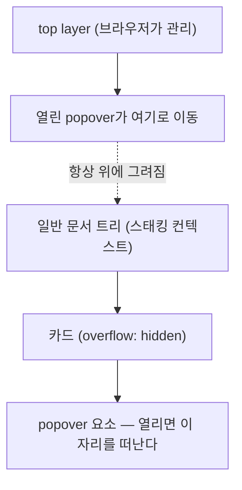

<Callout type="info">
  **이번 문서의 목표:** 이 문서를 다 읽으면 `popover` 속성과 `popovertarget`만으로 열고 닫히는 오버레이(overlay, 화면 위에 겹쳐 뜨는 층)를 만들고, `auto` 모드가 자동으로 처리해 주는 라이트 디스미스(light dismiss) 동작을 근거를 갖고 설명할 수 있게 됩니다.
</Callout>

## 왜 필요한가

메뉴 버튼을 누르면 뜨는 드롭다운, 입력 칸 옆에 붙는 도움말 툴팁, "더 보기" 버튼이 여는 작은 목록 — 이런 가벼운 오버레이는 웹에서 흔합니다. 그런데 예전에는 이걸 순수 HTML로 만들 방법이 마땅치 않았습니다. `display: none`을 JS로 토글하는 `<div>`를 만들면 다음 문제가 줄줄이 따라옵니다.

- 오버레이가 부모 요소의 `overflow: hidden`이나 `z-index` 스택 안에 갇혀 잘려 보인다.
- 오버레이 바깥을 클릭했을 때 닫히게 하려면 `document`에 클릭 리스너를 직접 달고, 오버레이 내부 클릭과 구분하는 로직을 손으로 짜야 한다.
- ESC 키로 닫는 것도, 포커스를 다시 원래 버튼으로 되돌리는 것도 전부 개발자 몫이다.

이 반복 작업을 대신 처리해 주는 라이브러리(툴팁 라이브러리, 드롭다운 라이브러리)가 한동안 프런트엔드 생태계의 필수품이었습니다. **Popover API**(파피오버 에이피아이, "튀어나오는 것"이라는 뜻의 popover에 응용 프로그래밍 인터페이스를 붙인 이름)는 이 흔한 패턴을 브라우저 표준 기능으로 끌어올린 결과물입니다.

> **쉽게 말하면:** popover는 "이 요소를 화면의 다른 모든 것 위에, 자동으로 여닫히는 층에 띄워 달라"고 브라우저에 부탁하는 속성입니다.

**지원 상태(2026-09 기준): 널리 사용 가능합니다.** Popover API는 2025년 4월 Baseline(베이스라인, 주요 브라우저 전반의 최소 공통 지원선)에 도달했습니다. Baseline 배지를 직접 확인하는 절차는 02편에서 다뤘으니, 낯설다면 그 편을 먼저 보는 것이 좋습니다.

## 1. `popover` 속성 — 아무 요소나 오버레이로 승격시키기

### 정의

`popover`는 전역 속성(global attribute, 모든 HTML 요소에 붙일 수 있는 속성)입니다. `<div>`든 `<section>`이든 이 속성을 붙이면 그 요소는 기본적으로 숨겨진 상태(`display: none`과 비슷하지만 완전히 같지는 않은 특수한 숨김)로 시작합니다.

```html
<button popovertarget="안내-말풍선">도움말</button>
<div popover id="안내-말풍선">
  이 입력란에는 이메일 형식으로 입력하세요.
</div>
```

- `popovertarget`: 버튼에 붙이는 속성으로, 제어할 popover 요소의 `id`를 가리킵니다.
- `popover`: 오버레이가 될 요소에 붙입니다. 값을 생략하면 기본값 `auto`가 적용됩니다.

버튼을 누르면 `안내-말풍선`이 나타나고, 다시 누르거나 바깥을 클릭하면 사라집니다. 자바스크립트 코드를 단 한 줄도 쓰지 않았습니다.

### 브라우저가 실제로 하는 일

`popover` 속성이 붙은 요소가 열리면, 브라우저는 그 요소를 **top layer**(톱 레이어, 최상위 층)라는 특수한 렌더링 층으로 옮깁니다. top layer는 문서의 일반적인 스태킹 컨텍스트(stacking context, 쌓임 맥락 — 요소들이 겹치는 순서를 결정하는 독립된 층) 구조 바깥에 있는, 브라우저가 관리하는 별도의 층입니다. 그래서 부모의 `overflow: hidden`이나 `z-index` 설정에 전혀 영향받지 않고 항상 다른 모든 콘텐츠 위에 그려집니다.



열리기 전 popover 요소는 `display: none` 상태와 유사하게 접근성 트리(accessibility tree, 스크린 리더가 읽는 요소 목록)에서도 제외됩니다. 즉 화면에서 안 보일 뿐 아니라 스크린 리더 사용자에게도 존재하지 않는 것처럼 취급됩니다. 열리면 다시 트리에 등장합니다.

## 2. `popovertarget`과 `popovertargetaction`

### 두 속성의 역할 분담

`popovertarget`은 "어떤 popover를 제어할지" 가리키고, `popovertargetaction`은 "어떤 동작을 할지" 정합니다.

| 값 | 동작 |
|------|------|
| `toggle` (기본값) | 닫혀 있으면 열고, 열려 있으면 닫는다 |
| `show` | 이미 열려 있어도 그대로 열린 채 유지(닫지 않는다) |
| `hide` | 이미 닫혀 있어도 그대로 닫힌 채 유지(열지 않는다) |

`popovertargetaction`을 생략하면 `toggle`이 적용됩니다. "열기 전용 버튼"과 "닫기 전용 버튼"을 따로 두고 싶을 때만 명시적으로 `show`/`hide`를 씁니다.

```html
<button popovertarget="메뉴" popovertargetaction="show">메뉴 열기</button>
<div popover id="메뉴">
  <button popovertarget="메뉴" popovertargetaction="hide">닫기</button>
  <a href="/profile">프로필</a>
  <a href="/settings">설정</a>
</div>
```

### 자주 틀리는 점

`popovertarget`을 `<button>`이 아닌 `<a>`나 `<div>`에 붙이면 동작하지 않습니다. 이 속성은 `<button>` 요소(또는 `type="button"`인 `<input>`) 전용입니다. 클릭 가능한 `<div>`를 흉내 내려던 습관이 있다면, popover 트리거는 반드시 진짜 `<button>`이어야 한다는 점을 기억해야 합니다. 이는 오히려 접근성에 도움이 됩니다. `<button>`은 키보드로 포커스가 가고 엔터·스페이스로 활성화되는 동작을 브라우저가 기본 제공하기 때문입니다.

## 3. `auto` 모드와 라이트 디스미스

### 왜 필요한가

메뉴나 툴팁의 공통 요구사항은 "바깥을 클릭하면 닫힌다"입니다. 직접 구현하면 `document`에 클릭 리스너를 달고, 클릭된 지점이 오버레이 내부인지 `contains()`로 검사하고, ESC 키 리스너도 별도로 달아야 합니다. `popover="auto"`(생략 시 기본값)는 이 전체 로직을 브라우저가 대신 처리합니다.

> **쉽게 말하면:** `auto` 모드는 "내가 안 눌러도 알아서 닫히는" 모드입니다. 손을 떼면 저절로 접히는 우산과 비슷합니다.

### 정의 — 라이트 디스미스가 반응하는 세 가지

**라이트 디스미스**(light dismiss, 가볍게 닫기)란 사용자가 명시적으로 "닫기" 버튼을 누르지 않아도 다음 상황에서 popover가 자동으로 닫히는 동작입니다.

1. popover 바깥 영역을 클릭했을 때
2. `Esc` 키를 눌렀을 때
3. 다른 popover가 새로 열렸을 때(먼저 열려 있던 것이 자동으로 닫힘)

이 동작은 `popover="auto"`일 때만 적용됩니다. `popover="manual"`로 지정하면 라이트 디스미스가 꺼지고, 오직 `popovertarget` 버튼을 다시 눌러야만 닫힙니다. 알림 배너처럼 "사용자가 명시적으로 닫아야 하는" 오버레이에 `manual`을 씁니다.

| 값 | 라이트 디스미스 | 용도 예시 |
|------|------|------|
| `auto` (기본값) | 켜짐 | 드롭다운 메뉴, 툴팁, 자동완성 목록 |
| `manual` | 꺼짐 | 지속적으로 떠 있어야 하는 알림 배너, 사이드 패널 |

### 접근성 — 키보드와 스크린 리더 관점

라이트 디스미스가 자동으로 처리해 주는 것은 클릭·ESC 반응만이 아닙니다. popover가 열리면 브라우저는 그 요소를 접근성 트리에 다시 노출시키고, 닫히면 트리에서 제거합니다. 스크린 리더 사용자에게는 이것이 "메뉴가 화면에 나타났다/사라졌다"는 신호로 전달됩니다. 다만 popover 자체가 포커스를 강제로 옮기지는 않습니다(이 부분이 `<dialog>`의 `showModal()`과 가장 크게 다른 지점이며, 06편에서 정면으로 비교합니다). 그래서 메뉴 안에 이동 가능한 항목이 있다면, 열었을 때 첫 항목으로 포커스를 옮기는 처리는 필요에 따라 직접 추가해야 할 수 있습니다.

## 4. 실습 — 라이트 디스미스 직접 확인하기

아래 실습기에서 메뉴 버튼을 눌러 열고, 메뉴 바깥을 클릭하거나 `Esc`를 눌러 닫히는지, 그리고 `manual` 모드로 바꾸면 무엇이 달라지는지 `styles.css`의 주석을 참고해 popover 속성 값을 바꿔가며 확인하세요.

<CodePlayground
  template="static"
  activeFile="/index.html"
  label="popover auto vs manual — 속성값을 바꿔가며 라이트 디스미스 차이를 확인"
  files={{
    '/index.html': `<div class="래퍼">
  <button popovertarget="메뉴" class="트리거">메뉴 열기</button>

  <!-- popover 값을 "manual"로 바꿔서 라이트 디스미스가 꺼지는지 비교해 보세요 -->
  <div popover="auto" id="메뉴" class="메뉴">
    <p>이 영역 바깥을 클릭하거나 Esc를 눌러보세요.</p>
    <button popovertarget="메뉴" popovertargetaction="hide">닫기</button>
  </div>

  <p class="안내">메뉴가 열린 상태에서 이 문단을 클릭하면 자동으로 닫혀야 합니다(auto일 때만).</p>
</div>`,
    '/styles.css': `body {
  font-family: system-ui, sans-serif;
  padding: 2rem;
}
.래퍼 {
  position: relative;
}
.트리거 {
  padding: 0.6rem 1.2rem;
  font-size: 1rem;
  cursor: pointer;
}
.메뉴 {
  border: 2px solid #4b5563;
  border-radius: 8px;
  padding: 1rem;
  width: 260px;
  /* top layer 위에서도 위치는 일반 CSS로 잡는다 */
  position: absolute;
  top: 3rem;
  left: 0;
  margin: 0;
}
.메뉴::backdrop {
  /* auto 모드는 backdrop이 생기지 않는다 — dialog와의 차이는 06편 참조 */
  background: transparent;
}
.안내 {
  margin-top: 6rem;
  color: #6b7280;
}`,
  }}
/>

`popover="manual"`로 바꾸면 바깥을 클릭해도 안 닫히고, 오직 "닫기" 버튼만 반응한다는 것을 확인할 수 있습니다. 이 실험이 바로 `auto`가 "브라우저가 대신 처리하는 이벤트 리스너 묶음"이라는 사실을 눈으로 보여줍니다.

## 핵심 정리

- `popover` 전역 속성은 아무 요소나 top layer로 띄우는 오버레이로 만든다. top layer는 일반 스태킹 컨텍스트 바깥이라 `overflow`·`z-index`에 영향받지 않는다.
- `popovertarget`은 반드시 `<button>`에 붙인다. `popovertargetaction`은 `toggle`(기본)·`show`·`hide` 세 값을 가진다.
- `popover="auto"`(기본값)는 바깥 클릭·ESC·다른 popover 열림에 자동으로 반응하는 라이트 디스미스를 제공한다. `manual`은 이를 끄고 명시적 버튼으로만 닫히게 한다.
- 라이트 디스미스는 편의 기능이지, 포커스 트랩이나 포커스 이동 같은 모달 동작까지 대신해 주지는 않는다.
- 2026-09 기준 Popover API는 Baseline에 도달해 널리 사용 가능하다.

## 마무리 복습

<Quiz
  questionNumber={1}
  question="popover 속성이 붙은 요소가 열릴 때 브라우저 내부에서 일어나는 일로 옳은 것은?"
  options={['해당 요소가 top layer로 이동해 스태킹 컨텍스트와 무관하게 최상위에 그려진다', '해당 요소가 새로운 iframe으로 감싸져 렌더링된다', '문서 전체의 z-index 값이 자동으로 재계산된다', '해당 요소가 별도의 브라우저 탭으로 분리된다']}
  correctAnswer={1}
  explanation="popover가 열리면 브라우저는 해당 요소를 top layer라는 별도의 렌더링 층으로 옮긴다. 이 층은 문서의 일반 스태킹 컨텍스트 바깥에 있어 부모의 overflow나 z-index 설정에 영향받지 않는다."
  optionExplanations={['정답 — top layer는 브라우저가 관리하는 문서 트리 바깥의 렌더링 층이다', 'iframe과는 무관한 메커니즘이다', 'z-index 값 자체를 바꾸는 것이 아니라 별도 층으로 이동하는 것이다', '같은 문서, 같은 탭 안에서 일어나는 일이다']}
/>

<Quiz
  questionNumber={2}
  question="popovertarget 속성을 사용할 수 있는 요소는?"
  options={['a 요소', 'div 요소에 role을 추가한 경우', 'button 요소(또는 type=\"button\"인 input)', 'span 요소']}
  correctAnswer={3}
  explanation="popovertarget은 button 요소(또는 type이 button인 input) 전용 속성이다. a나 div, span에 붙이면 동작하지 않는다."
  optionExplanations={['a 요소는 popovertarget을 지원하지 않는다', 'role을 추가해도 popovertarget 자체의 동작 대상이 되지는 않는다', '정답 — button 계열 요소에만 적용된다', 'span 요소는 대상이 아니다']}
/>

<Quiz
  questionNumber={3}
  question="popovertargetaction을 생략했을 때 기본으로 적용되는 값과 그 동작은?"
  options={['show — 항상 열기만 한다', 'hide — 항상 닫기만 한다', 'toggle — 닫혀 있으면 열고 열려 있으면 닫는다', '값을 생략하면 버튼이 동작하지 않는다']}
  correctAnswer={3}
  explanation="popovertargetaction의 기본값은 toggle이다. 현재 popover 상태를 반전시켜 닫혀 있으면 열고, 열려 있으면 닫는다."
  optionExplanations={['show는 명시적으로 지정해야 하는 값이다', 'hide도 명시적으로 지정해야 하는 값이다', '정답 — toggle이 기본값이며 상태를 반전시킨다', '생략해도 toggle로 정상 동작한다']}
/>

<Quiz
  questionNumber={4}
  question="popover가 auto 모드인 요소에서 라이트 디스미스가 자동으로 반응하지 않는 상황은?"
  options={['popover 바깥 영역을 클릭했을 때', 'Esc 키를 눌렀을 때', '다른 auto popover가 새로 열렸을 때', 'popover 내부의 텍스트를 마우스로 드래그해 선택할 때']}
  correctAnswer={4}
  explanation="라이트 디스미스는 바깥 클릭, Esc 키, 다른 popover가 열리는 상황에 반응해 자동으로 닫힌다. popover 내부에서 이루어지는 텍스트 선택 같은 조작은 닫힘을 유발하지 않는다."
  optionExplanations={['라이트 디스미스가 반응하는 대표적인 상황이다', '라이트 디스미스가 반응하는 대표적인 상황이다', '먼저 열려 있던 auto popover는 새 popover가 열리면 자동으로 닫힌다', '정답 — popover 내부 조작은 닫힘 트리거가 아니다']}
/>

<Quiz
  questionNumber={5}
  question="popover가 manual 모드일 때 쓰기에 가장 알맞은 상황은?"
  options={['클릭하면 뜨는 드롭다운 메뉴', '입력란 옆의 자동완성 후보 목록', '사용자가 명시적으로 닫기 전까지 유지되어야 하는 알림 배너', '버튼 hover 시 나타나는 짧은 툴팁']}
  correctAnswer={3}
  explanation="manual은 라이트 디스미스를 꺼서 바깥 클릭이나 Esc로 닫히지 않게 한다. 사용자가 명시적으로 닫아야 하는 지속적인 알림 배너에 적합하다. 나머지는 바깥 클릭 시 자동으로 닫히는 auto가 자연스럽다."
  optionExplanations={['바깥 클릭으로 닫히는 auto가 자연스럽다', 'auto의 라이트 디스미스가 자연스러운 경우다', '정답 — 명시적 닫기가 필요한 경우 manual을 쓴다', 'auto의 라이트 디스미스가 자연스러운 경우다']}
/>

<Quiz
  questionNumber={6}
  question="popover 요소가 닫혀 있을 때 접근성 트리 상태로 옳은 것은?"
  options={['화면에는 안 보이지만 스크린 리더는 여전히 읽을 수 있다', 'display: none과 유사하게 접근성 트리에서 제외된다', '항상 트리에 남아 있고 aria-hidden만 true로 바뀐다', '트리 포함 여부는 popover 값(auto/manual)에 따라 달라진다']}
  correctAnswer={2}
  explanation="닫힌 popover는 display: none과 유사하게 접근성 트리에서 제외되어 스크린 리더가 인지하지 못한다. 열리면 다시 트리에 등장한다."
  optionExplanations={['닫힌 popover는 스크린 리더도 인지하지 못한다', '정답 — 닫힌 상태는 접근성 트리에서 제외된다', 'aria-hidden 토글이 아니라 트리 자체에서 빠진다', 'auto/manual 여부와 무관하게 닫힌 popover는 트리에서 제외된다']}
/>

## 참고 자료

- [MDN — Popover API](https://developer.mozilla.org/en-US/docs/Web/API/Popover_API)
- [MDN — popover 전역 속성](https://developer.mozilla.org/en-US/docs/Web/HTML/Reference/Global_attributes/popover)
- [web.dev — Popover API lands in Baseline](https://web.dev/blog/popover-api)
