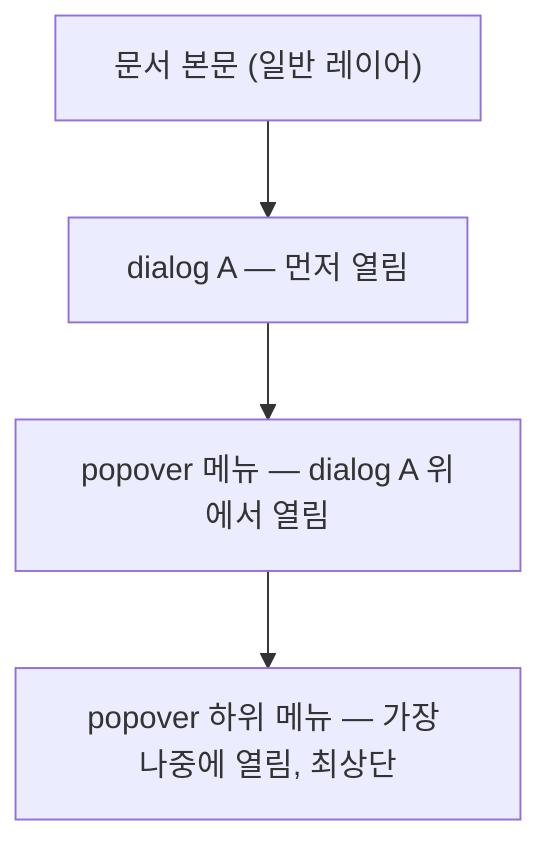

<Callout type="info">
  **이번 문서의 목표:** 이 문서를 다 읽으면 popover와 `<dialog>`가 왜 둘 다 top layer를 쓰면서도 서로 다른 결과를 만드는지 설명하고, 지금 만들려는 오버레이가 popover여야 하는지 `<dialog>`여야 하는지 스스로 판단할 수 있게 됩니다.
</Callout>

## 왜 헷갈리는가

03·04편에서 다룬 `<dialog>`와 05편에서 다룬 popover는 둘 다 다음 특징을 공유합니다.

- 열리면 top layer(톱 레이어, 03편에서 다룬 브라우저 최상위 렌더링 층)로 이동한다.
- 열리기 전에는 화면에서 완전히 사라진다.
- HTML 속성만으로 여닫을 수 있다.

공통점이 많다 보니 "그냥 둘 다 오버레이 아닌가, 아무거나 쓰면 되는 거 아닌가"라는 착각이 생기기 쉽습니다. 하지만 이 둘은 "**포커스를 얼마나 강하게 통제하는가**"라는 기준에서 완전히 다른 층위에 있습니다. 이 차이를 모르고 고르면, 모달이어야 할 오버레이가 라이트 디스미스로 힘없이 닫히거나, 가벼운 메뉴가 배경 전체를 막아버리는 과도한 오버레이가 됩니다.

> **쉽게 말하면:** `<dialog>`의 `showModal()`은 "지금부터 이것만 상대하세요"라고 강제하는 경비원이고, popover는 "필요하면 나타났다가 알아서 비켜주는" 안내판입니다.

## 1. `:popover-open`과 popover 버전 `::backdrop`

### 정의

`<dialog>`가 `[open]` 속성과 `::backdrop` 의사 요소(pseudo-element, 실제 DOM에는 없지만 CSS로 스타일을 줄 수 있는 가상의 요소)로 열림 상태를 표현했던 것을 기억한다면, popover도 대응하는 짝이 있습니다.

| 대상 | 열림 상태 선택자 | 배경 오버레이 |
|------|------|------|
| `<dialog>` | `dialog[open]` | `dialog::backdrop` |
| popover | `:popover-open` | `::backdrop` (popover용) |

```css
[popover]:popover-open {
  border: 2px solid #2563eb;
  border-radius: 12px;
}

/* auto 모드 popover에도 backdrop이 생긴다 — 단, 기본은 투명 */
[popover]::backdrop {
  background: rgb(0 0 0 / 0.15);
}
```

### 결정적인 차이 — backdrop이 클릭을 막는가

여기서 `<dialog>`와 popover의 진짜 차이가 드러납니다. `<dialog>`의 `showModal()`이 만드는 `::backdrop`은 **배경 전체에 대한 클릭·포커스를 실질적으로 차단**합니다(정확히는 배경 콘텐츠가 `inert`, 08편에서 다룰 속성 취급을 받습니다). 반면 popover의 `::backdrop`은 `auto` 모드에서도 시각적인 어둡게 처리만 있을 뿐, 배경 콘텐츠와의 상호작용을 막는 강제력이 `<dialog>`만큼 강하지 않습니다. popover가 열려 있어도 스크립트로 배경 요소에 접근하는 것 자체는 가능합니다. popover가 막는 것은 "포커스가 배경으로 자연스럽게 이동하는 것"보다는 "바깥을 클릭하면 popover 스스로 닫히는 것"에 가깝습니다. 즉 popover는 배경을 얼어붙게(freeze) 만드는 요소가 아니라, 자기 자신의 생명주기를 관리하는 요소입니다.

<Callout type="warning">
  **자주 틀리는 점:** "popover도 backdrop이 있으니 dialog처럼 배경을 완전히 막아준다"고 단정하면 안 됩니다. 진짜 모달이 필요하면(사용자가 반드시 이 화면을 처리해야 서비스가 진행되는 경우) `<dialog>`의 `showModal()`을 써야 합니다.
</Callout>

## 2. top layer에서 겹칠 때의 동작

### 왜 필요한가

오버레이가 하나만 뜨는 경우는 드뭅니다. 메뉴 안에 하위 메뉴가 있거나, 모달 안에서 툴팁이 뜨는 경우가 실무에서 흔합니다. 여러 개의 top layer 요소가 동시에 열리면 브라우저는 어떤 순서로 쌓을까요.

### top layer는 스택(stack)이다

top layer는 "가장 최근에 열린 것이 맨 위"라는 스택(stack, 마지막에 넣은 것이 먼저 나오는 자료 구조) 규칙을 따릅니다. `<dialog>` 두 개를 연달아 `showModal()`로 열면 나중에 연 것이 항상 앞의 것 위에 그려집니다. popover도 마찬가지입니다.



여기서 실무적으로 중요한 규칙이 하나 나옵니다. **popover가 dialog 위에서 열리면, popover는 그 dialog의 자식으로 취급되어 함께 관리됩니다.** 즉 `<dialog>` 안에 있는 버튼이 연 popover는 그 dialog가 닫힐 때 자동으로 함께 닫힙니다. 반대로 dialog 바깥에서 연 popover는 dialog와 무관하게 독립적으로 열리고 닫힙니다.

### 여러 auto popover가 동시에 열릴 때

05편에서 다룬 라이트 디스미스 규칙 중 "다른 popover가 열리면 먼저 열려 있던 것이 닫힌다"는 원칙에는 예외가 있습니다. 열려는 popover가 이미 열려 있는 popover의 **DOM 트리상 자손**(예: 하위 메뉴)이라면 부모 popover는 닫히지 않고 유지됩니다. 이 덕분에 "메뉴 → 하위 메뉴"처럼 중첩된 auto popover 구조를 만들 수 있습니다. DOM 구조와 무관한 별개의 popover라면 새 것이 열리는 순간 이전 것이 닫힙니다.

## 3. 선택 기준 — 지금 이 오버레이는 무엇인가

### 판단 질문 세 가지

오버레이를 만들기 전에 스스로 이 순서로 물어보면 답이 나옵니다.

1. **사용자가 이 화면을 반드시 처리해야 다음으로 넘어가는가?** (예: 결제 확인, 삭제 확인) → 그렇다면 `<dialog>`의 `showModal()`.
2. **배경과 자유롭게 상호작용하면서 참고만 하면 되는가?** (예: 툴팁, 자동완성, 알림 드롭다운) → popover, 보통 `auto` 모드.
3. **사용자가 명시적으로 닫기 전까지 화면 어딘가에 계속 떠 있어야 하는가?** (예: "저장되었습니다" 배너, 사이드 패널) → popover의 `manual` 모드, 혹은 논모달 `<dialog>`(`show()`).

### 비교표로 정리

| 기준 | `<dialog>` showModal() | `<dialog>` show() | popover auto | popover manual |
|------|------|------|------|------|
| 배경 상호작용 차단 | 예(사실상 inert) | 아니오 | 아니오 | 아니오 |
| 바깥 클릭으로 닫힘 | 아니오 | 아니오 | 예(라이트 디스미스) | 아니오 |
| ESC로 닫힘 | 예 | 아니오 | 예 | 아니오 |
| 열릴 때 포커스 자동 이동 | 예 | 아니오 | 아니오 | 아니오 |
| 대표 용도 | 확인 모달, 필수 입력 폼 | 논모달 패널 | 메뉴, 툴팁, 자동완성 | 지속 알림 배너 |

이 표에서 `<dialog>`의 `show()`(논모달)와 popover가 겉보기엔 비슷해 보일 수 있지만, `show()`로 연 dialog는 라이트 디스미스가 전혀 없다는 점이 다릅니다. 논모달 dialog는 "떠 있지만 사용자가 직접 닫아야 하는" 패널에 가깝고, popover auto는 "바깥을 클릭하면 알아서 사라지는" 것에 특화되어 있습니다.

## 4. 접근성 관점 정리

스크린 리더 사용자에게 `<dialog>`의 `showModal()`은 "지금 이 대화상자 밖의 모든 콘텐츠는 잠시 존재하지 않는 것"으로 전달됩니다. 배경이 `inert` 취급을 받아 Tab 키로도, 스크린 리더의 가상 커서로도 벗어날 수 없기 때문입니다. 반면 popover는 열려도 배경 콘텐츠가 여전히 접근 가능한 상태로 남습니다. 그래서 popover로 메뉴를 만들 때는 메뉴 항목들에 방향키 이동을 붙이는 등 **키보드로 메뉴 내부를 탐색하는 경험**을 신경 써야 하지만, 배경으로 포커스가 새는 것 자체를 막는 책임은 `<dialog>`보다 가볍습니다. "이 오버레이가 사용자의 전체 주의를 독점해야 하는가"라는 질문이 접근성 설계의 출발점이며, 이것이 그대로 `<dialog>` vs popover 선택 기준과 겹칩니다.

## 5. 실습 — 겹침 순서와 backdrop 차이 눈으로 보기

<CodePlayground
  template="static"
  activeFile="/styles.css"
  label="dialog와 popover의 backdrop 동작 차이 비교"
  files={{
    '/index.html': `<div class="래퍼">
  <button popovertarget="안내">popover 열기 (배경 클릭 가능)</button>
  <button id="모달버튼">dialog 열기 (배경 차단)</button>

  <div popover id="안내">
    <p>이 popover가 열려도 아래 배경 버튼을 누를 수 있습니다.</p>
  </div>

  <dialog id="모달">
    <p>이 dialog가 열리면 배경은 완전히 비활성화됩니다.</p>
    <form method="dialog">
      <button>닫기</button>
    </form>
  </dialog>

  <p class="배경콘텐츠">배경 콘텐츠 — 어느 쪽이 열렸을 때 이 문단과 상호작용할 수 있는지 확인하세요.</p>
</div>`,
    '/styles.css': `body { font-family: system-ui, sans-serif; padding: 2rem; }
button { padding: 0.6rem 1rem; margin-right: 0.5rem; cursor: pointer; }
[popover] {
  border: 2px solid #2563eb;
  border-radius: 8px;
  padding: 1rem;
}
dialog {
  border: 2px solid #dc2626;
  border-radius: 8px;
  padding: 1.5rem;
}
dialog::backdrop {
  background: rgb(0 0 0 / 0.5);
}
[popover]::backdrop {
  background: rgb(37 99 235 / 0.1);
}
.배경콘텐츠 {
  margin-top: 2rem;
  padding: 1rem;
  background: #f3f4f6;
}`,
    '/index.js': `document.getElementById("모달버튼").addEventListener("click", () => {
  document.getElementById("모달").showModal();
});`,
  }}
/>

dialog가 열려 있는 동안 배경의 "popover 열기" 버튼을 눌러도 반응이 없다면(포커스가 아예 가지 않는다면) `inert` 효과가 작동 중이라는 뜻입니다. 이 동작의 정확한 원리는 다음 08편에서 다룹니다.

## 핵심 정리

- popover와 `<dialog>`는 둘 다 top layer를 쓰지만, popover의 `::backdrop`은 배경 상호작용을 막지 않고 `<dialog>`의 `showModal()`은 배경을 사실상 `inert`로 만든다.
- top layer는 스택 구조라 나중에 연 것이 항상 위에 그려진다. dialog 안에서 연 popover는 그 dialog와 함께 닫힌다.
- 중첩된(자손 관계인) auto popover는 서로를 닫지 않지만, 무관한 별개의 popover는 새 것이 열리면 이전 것을 닫는다.
- "사용자가 반드시 처리해야 하는가"라는 질문 하나로 `<dialog>` showModal / show / popover auto / popover manual 네 가지 중 무엇을 쓸지 정할 수 있다.
- 배경 전체 주의 독점 여부가 접근성 설계와 선택 기준을 동시에 가른다.

## 마무리 복습

<Quiz
  questionNumber={1}
  question="dialog의 showModal()이 만드는 ::backdrop과 popover auto의 ::backdrop의 결정적 차이는?"
  options={['popover의 backdrop은 항상 투명해서 스타일을 줄 수 없다', 'dialog의 backdrop은 배경 콘텐츠와의 상호작용을 사실상 차단하지만 popover는 그렇지 않다', 'popover에는 backdrop 의사 요소 자체가 존재하지 않는다', '두 backdrop 모두 CSS로 스타일링이 불가능하다']}
  correctAnswer={2}
  explanation="dialog의 showModal()로 만들어진 backdrop은 배경 콘텐츠를 사실상 inert 상태로 만들어 상호작용을 막는다. popover의 backdrop은 시각적 어둡게 처리는 있어도 배경과의 상호작용을 강제로 막지는 않는다."
  optionExplanations={['popover의 backdrop도 CSS로 배경색 등을 자유롭게 스타일링할 수 있다', '정답 — 상호작용 차단 여부가 핵심 차이다', 'popover에도 ::backdrop 의사 요소가 존재한다', '두 backdrop 모두 CSS 스타일링이 가능하다']}
/>

<Quiz
  questionNumber={2}
  question="dialog 안에서 버튼을 눌러 연 popover에 대한 설명으로 옳은 것은?"
  options={['popover는 dialog와 완전히 독립적으로 동작해 dialog가 닫혀도 남아 있는다', 'popover가 열리는 즉시 dialog가 자동으로 닫힌다', 'dialog가 닫히면 그 안에서 연 popover도 함께 닫힌다', 'dialog 안에서는 popover 속성이 무시되어 열리지 않는다']}
  correctAnswer={3}
  explanation="dialog 안에서 연 popover는 그 dialog의 관리 범위에 속하게 되어, dialog가 닫힐 때 popover도 함께 닫힌다."
  optionExplanations={['dialog와 무관하게 독립적으로 남아 있지 않는다', 'popover가 열린다고 dialog가 자동으로 닫히지는 않는다', '정답 — dialog가 닫히면 그 안에서 연 popover도 함께 닫힌다', 'dialog 안에서도 popover 속성은 정상 동작한다']}
/>

<Quiz
  questionNumber={3}
  question="이미 열려 있는 auto popover의 DOM 트리상 자손인 새 popover를 여는 경우 일어나는 일은?"
  options={['부모 popover가 즉시 닫힌다', '부모 popover는 유지되고 자손 popover가 그 위에 함께 열린다', '두 popover 모두 닫힌다', '자손 popover는 열리지 않고 무시된다']}
  correctAnswer={2}
  explanation="열려는 popover가 이미 열린 popover의 DOM 트리상 자손이면, 라이트 디스미스의 '다른 popover가 열리면 닫는다' 규칙에서 예외가 적용되어 부모가 유지된 채 자손이 함께 열린다. 이 덕분에 중첩 메뉴 구조를 만들 수 있다."
  optionExplanations={['자손 관계라면 부모는 닫히지 않는다', '정답 — 자손 popover는 부모를 유지한 채 함께 열린다', '둘 다 닫히지 않는다', '자손 popover도 정상적으로 열린다']}
/>

<Quiz
  questionNumber={4}
  question="사용자가 결제 확인을 반드시 처리해야만 다음 단계로 넘어갈 수 있는 화면을 만들 때 가장 알맞은 선택은?"
  options={['popover auto', 'popover manual', 'dialog의 showModal()', 'dialog의 show()']}
  correctAnswer={3}
  explanation="사용자가 반드시 처리해야 다음으로 넘어가는 화면에는 배경을 inert로 만들고 포커스를 트랩하는 dialog의 showModal()이 적합하다."
  optionExplanations={['배경 상호작용을 막지 못해 필수 처리 화면에 부적합하다', '역시 배경 상호작용을 막지 못한다', '정답 — 배경을 사실상 비활성화하는 showModal()이 적합하다', 'show()는 라이트 디스미스도, 배경 차단도 없는 논모달이다']}
/>

<Quiz
  questionNumber={5}
  question="저장되었습니다처럼 사용자가 명시적으로 닫기 전까지 유지되어야 하는 배너에 적합한 조합은?"
  options={['popover auto', 'popover manual 또는 논모달 dialog(show())', 'dialog의 showModal()', 'inert 속성만 단독으로 사용']}
  correctAnswer={2}
  explanation="라이트 디스미스가 꺼져 바깥 클릭으로 닫히지 않는 popover manual, 혹은 배경 차단 없이 계속 떠 있는 논모달 dialog(show())가 이런 지속 알림 배너에 알맞다."
  optionExplanations={['auto는 바깥을 클릭하면 곧바로 닫혀 버려 지속 배너에 부적합하다', '정답 — 명시적으로 닫아야 하는 지속 UI에 알맞은 조합이다', 'showModal()은 배경 전체를 막는 강제 모달이라 과하다', 'inert만으로는 오버레이 자체를 만들 수 없다']}
/>

<Quiz
  questionNumber={6}
  question="top layer에 여러 요소가 열려 있을 때 쌓이는 순서 규칙은?"
  options={['알파벳순으로 id가 앞서는 것이 위로 온다', '가장 최근에 열린 것이 스택 구조로 맨 위에 쌓인다', 'CSS z-index 값이 가장 큰 것이 무조건 위에 온다', '문서 트리에서 더 아래쪽에 위치한 요소가 항상 위에 온다']}
  correctAnswer={2}
  explanation="top layer는 스택 구조를 따르며 가장 최근에 열린 요소가 맨 위에 쌓인다. z-index나 id, DOM 위치 순서와는 무관하다."
  optionExplanations={['id 알파벳 순서와는 무관하다', '정답 — 스택 구조이므로 가장 최근에 연 것이 맨 위다', 'top layer 요소는 z-index 값에 의존하지 않는다', 'DOM 트리 순서와 top layer 스킹 순서는 별개다']}
/>

## 참고 자료

- [MDN — Popover API](https://developer.mozilla.org/en-US/docs/Web/API/Popover_API)
- [MDN — popover 전역 속성](https://developer.mozilla.org/en-US/docs/Web/HTML/Reference/Global_attributes/popover)
- [web.dev — Popover API lands in Baseline](https://web.dev/blog/popover-api)
- [MDN — dialog 요소](https://developer.mozilla.org/en-US/docs/Web/HTML/Reference/Elements/dialog)
