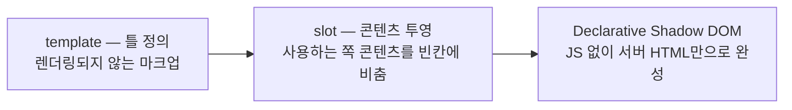

<Callout type="info">
  **이번 문서의 목표:** 이 문서를 다 읽으면 `<template>`·slot·Declarative Shadow DOM이 각각 어떤 문제를 푸는 도구인지 한 문장으로 설명하고, 이 세 개념의 API를 실제로 깊게 배워야 할 때 어느 과목의 어느 편으로 가야 하는지 알 수 있게 됩니다.
</Callout>

## 왜 이 편은 개요만 다루는가

이번 편에서 다루는 `<template>`, slot(슬롯), Declarative Shadow DOM(선언적 섀도우 DOM, 이하 DSD)은 사실 셋이 한 덩어리로 묶이는 개념입니다. 재사용 가능한 커스텀 컴포넌트를 만들 때 "찍어낼 틀을 정의하고(`<template>`), 그 틀 안에 외부 콘텐츠를 끼워 넣고(slot), 이 구조를 서버에서 미리 그려서 내려보내는(DSD)" 흐름으로 이어지기 때문입니다.

이 세 축을 API 수준까지 전부 파고드는 것은 `javascript/web_component` 과목의 역할입니다. 그 과목은 Custom Elements(커스텀 엘리먼트, 새 HTML 태그를 직접 정의하는 기능)부터 시작해 Shadow DOM(섀도우 돔, 스타일과 마크업을 캡슐화하는 경계)을 먼저 세우고, 그 위에 `<template>`과 slot을 올린 뒤 DSD까지 이어지는 순서로 훨씬 깊게 다룹니다. 이 과목(모던 HTML)에서 그 전체를 다시 설명하면 두 과목이 똑같은 내용을 중복해서 가르치게 됩니다. 그래서 여기서는 **"이런 것도 HTML 표준에 있다"는 지도만** 그리고, 실제로 컴포넌트를 만들 때 필요한 세부 API는 참조 링크로 넘깁니다.

## template — 렌더링되지 않는 마크업 창고

> **쉽게 말하면:** `<template>`은 "지금 당장 화면에 그리지 말고, 나중에 자바스크립트로 복제해서 쓸 마크업만 보관해 둬"라는 뜻의 상자입니다.

일반적인 HTML 요소는 파서가 만나는 즉시 화면에 그릴 준비를 합니다. `<template>` 안의 내용은 다릅니다. 이 태그 안에 ``나 `<script>`가 들어 있어도, 브라우저는 이미지를 내려받지 않고 스크립트도 실행하지 않습니다. `<template>`의 자식 노드들은 문서의 일반적인 DOM 트리에 속하지 않고, `content`라는 별도의 프로퍼티(속성)를 통해서만 접근할 수 있는 조각 문서(DocumentFragment)에 담겨 있기 때문입니다.

```html
<template id="카드틀">
  <li class="card">
    <h3 class="이름"></h3>
    <p class="설명"></p>
  </li>
</template>
```

이 틀은 자바스크립트가 `content.cloneNode(true)`로 복제해서 실제 DOM에 붙일 때 비로소 화면에 나타납니다. 같은 구조를 반복해서 찍어내야 하는 목록, 카드, 모달의 뼈대를 만들 때 유용합니다. 복제(clone)와 조각 문서(DocumentFragment) 같은 API 세부, 그리고 렌더링 비용을 줄이는 실전 패턴은 `/javascript/web_component/11_template-and-clone`에서 다룹니다.

## slot — 콘텐츠를 투영하는 통로

> **쉽게 말하면:** slot은 "내 컴포넌트의 이 자리에는, 나를 사용하는 쪽이 채워 넣은 콘텐츠를 그대로 보여줘"라는 빈칸입니다.

컴포넌트를 만들 때 내부 구조는 컴포넌트 제작자가 정하지만, 그 안에 들어갈 실제 콘텐츠(버튼의 글자, 카드의 본문)는 컴포넌트를 사용하는 쪽이 정하고 싶을 때가 많습니다. slot은 Shadow DOM(섀도우 돔) 내부에 뚫어 놓은 구멍으로, 사용하는 쪽이 넘겨준 원래 콘텐츠(light DOM, 라이트 돔)를 그 구멍 자리에 그대로 비춰(project) 보여줍니다. 이 개념을 **콘텐츠 투영**(content projection)이라고 부릅니다.

```html
<!-- my-card 컴포넌트 내부의 shadow DOM 구조(개념 예시) -->
<div class="card">
  <slot name="제목"></slot>
  <slot></slot>
</div>
```

```html
<!-- my-card를 사용하는 쪽 -->
<my-card>
  <h3 slot="제목">공지사항</h3>
  <p>여기 본문이 이름 없는 slot 자리에 투영됩니다.</p>
</my-card>
```

이름이 있는 slot(`slot="제목"`)과 이름이 없는 기본 slot이 각각 어떤 자리에 무엇을 받는지, 콘텐츠가 비어 있을 때 보여줄 대체 콘텐츠(fallback), 슬롯에 배정된 콘텐츠가 바뀌었을 때 감지하는 `slotchange` 이벤트는 `/javascript/web_component/12_slots-and-projection`에서 다룹니다.

## Declarative Shadow DOM — 서버 렌더링에서 Shadow DOM 열기

> **쉽게 말하면:** DSD는 "자바스크립트가 실행되기 전에도, 서버가 미리 보내준 HTML만으로 Shadow DOM 구조를 완성해 달라"는 요청입니다.

Shadow DOM은 원래 자바스크립트로 `attachShadow()`를 호출해야만 만들어졌습니다. 그런데 서버에서 미리 렌더링(server-side rendering, 이하 SSR)해 HTML을 완성된 상태로 내려보내는 사이트라면 문제가 생깁니다. 자바스크립트가 아직 실행되지 않은 시점에는 Shadow DOM이 존재하지 않으므로, 사용자는 컴포넌트 내부가 비어 있거나 스타일이 적용되지 않은 화면을 잠깐 보게 됩니다. DSD는 `<template>` 태그에 `shadowrootmode` 같은 확장 속성을 붙여, 자바스크립트 실행 없이도 HTML 파서 단계에서 곧바로 Shadow DOM을 만들 수 있게 합니다.

```html
<my-card>
  <template shadowrootmode="open">
    <div class="card"><slot></slot></div>
  </template>
  <p>사용자에게 보여줄 실제 콘텐츠</p>
</my-card>
```

이 마크업을 만난 브라우저는 자바스크립트 실행을 기다리지 않고, HTML을 파싱하는 시점에 바로 `<my-card>` 안에 open 모드의 Shadow DOM을 만듭니다. 그래서 SSR 페이지에서도 자바스크립트가 로드되기 전부터 완성된 모습이 보이고, 이후 자바스크립트가 로드되면 이미 존재하는 이 구조에 이어붙는(hydration, 하이드레이션) 방식으로 동작합니다. `open`/`closed` 모드의 차이, 예전에 쓰였던 `shadowroot` 속성과의 구분, `clonable`·`serializable`·`slotassignment` 같은 확장 속성의 지원 확인은 `/javascript/web_component/13_declarative-shadow-dom`과 `/javascript/web_component/14_dsd-in-ssr`에서 다룹니다.

## 세 개념이 어떻게 이어지는가



`<template>`은 반복해서 찍어낼 구조를 정의하는 재료이고, slot은 그 구조 안에 외부 콘텐츠를 끼워 넣는 통로이며, DSD는 이 둘로 이루어진 결과물을 자바스크립트 실행 전에도 완성된 형태로 내려보내는 방법입니다. 셋 다 Custom Elements와 Shadow DOM이라는 더 큰 그림 위에서 의미를 갖는 조각들이므로, 실제로 컴포넌트를 설계하려면 `javascript/web_component` 과목을 처음부터 따라가는 것이 순서에 맞습니다.

<Callout type="warning">
  **자주 틀리는 점:** `<template>` 안의 내용을 "그냥 숨겨진 HTML"로 오해하기 쉽습니다. `hidden` 속성이나 `display: none`으로 숨긴 요소(자세한 차이는 `/html/modern_html/09_hidden-until-found` 참조)는 여전히 일반 DOM 트리에 속하지만, `<template>` 안의 내용은 애초에 문서의 DOM 트리에 포함되지 않습니다. 그래서 `document.querySelector`로 `<template>` 안의 요소를 직접 찾으면 아무것도 나오지 않고, 반드시 `content` 프로퍼티를 거쳐야 합니다.
</Callout>

## 지원 상태

`<template>`, slot, Declarative Shadow DOM을 구성하는 요소 자체(`<template>`, `<slot>` 태그, `shadowrootmode` 속성)는 2026-09 시점 기준 널리 사용 가능합니다. 다만 이 지도에서 소개한 것은 "요소가 존재한다"는 사실까지이며, 실제 컴포넌트 설계에 필요한 API 조합·주의점·최신 확장 속성의 브라우저별 지원 세부는 이 문서의 범위 밖입니다. `javascript/web_component` 과목에서 직접 확인하세요.

## 핵심 정리

- `<template>`은 렌더링되지 않고 실행되지 않는 마크업 창고다. 내용은 일반 DOM이 아니라 `content` 프로퍼티의 조각 문서에 담긴다.
- slot은 Shadow DOM 안에 뚫어 놓은 구멍으로, 사용하는 쪽이 넘긴 콘텐츠를 그 자리에 투영한다.
- Declarative Shadow DOM은 `<template shadowrootmode="...">`로 자바스크립트 실행 전에 HTML 파싱만으로 Shadow DOM을 완성해, 서버 렌더링 환경에서 빈 화면이 잠깐 보이는 문제를 해결한다.
- 세 개념은 template(틀 정의) → slot(콘텐츠 투영) → DSD(서버에서 완성해 내려보내기) 순서로 이어지는 한 흐름이다.
- API 전체와 실전 패턴은 `javascript/web_component` 과목(11~14편)에서 다룬다. 이 편은 지도 역할만 한다.

## 마무리 복습

<Quiz
  questionNumber={1}
  question="template 요소 안에 들어 있는 img나 script에 대한 설명으로 옳은 것은?"
  options={['일반 요소와 동일하게 즉시 이미지를 내려받고 스크립트를 실행한다', '문서에 포함되는 즉시 실행되지만 화면에는 그려지지 않는다', '자바스크립트로 복제해 실제 DOM에 붙이기 전까지 이미지 요청도, 스크립트 실행도 일어나지 않는다', 'template 태그 자체가 오류를 발생시켜 페이지 렌더링이 멈춘다']}
  correctAnswer={3}
  explanation="template 안의 내용은 일반 DOM 트리에 속하지 않고 content 프로퍼티의 조각 문서에 담기므로, 복제해서 실제 DOM에 붙이기 전까지는 리소스 요청도 스크립트 실행도 일어나지 않는다."
  optionExplanations={['template 밖으로 나가기 전까지는 그런 동작이 일어나지 않는다', '화면에 그려지지 않을 뿐 아니라 실행 자체가 보류된다', '정답 — 복제되어 실제 DOM에 붙는 시점에야 비로소 활성화된다', '알려진 표준 요소이므로 렌더링을 멈추지 않는다']}
/>

<Quiz
  questionNumber={2}
  question="slot이 하는 역할을 가장 정확히 설명한 것은?"
  options={['컴포넌트 내부의 스타일을 외부에서 덮어쓰는 통로다', '컴포넌트를 사용하는 쪽이 넘긴 콘텐츠를 컴포넌트 내부의 지정된 자리에 투영한다', '자바스크립트 실행 순서를 제어하는 예약어다', 'HTML 문서를 여러 개의 독립된 페이지로 분할하는 기능이다']}
  correctAnswer={2}
  explanation="slot은 Shadow DOM 내부에 뚫어 놓은 구멍으로, 사용하는 쪽이 넘긴 light DOM 콘텐츠를 그 자리에 그대로 비춰 보여주는 콘텐츠 투영 통로다."
  optionExplanations={['slot은 콘텐츠 배치를 위한 것이며 스타일 오버라이드 전용 통로가 아니다', '정답 — 콘텐츠 투영이 slot의 핵심 역할이다', '실행 순서 제어와는 무관한 개념이다', '페이지 분할 기능이 아니라 컴포넌트 내부 구조에 관한 개념이다']}
/>

<Quiz
  questionNumber={3}
  question="Declarative Shadow DOM이 해결하는 문제로 가장 알맞은 것은?"
  options={['자바스크립트 없이는 절대 만들 수 없던 Shadow DOM을 아예 만들 수 없게 만드는 문제', '서버 렌더링 페이지에서 자바스크립트 실행 전까지 컴포넌트 내부가 비어 보이는 문제', 'CSS 선택자의 명시도가 충돌하는 문제', '이미지 로딩 우선순위를 지정할 수 없는 문제']}
  correctAnswer={2}
  explanation="DSD는 template 태그에 shadowrootmode 같은 확장 속성을 붙여, 자바스크립트 실행 전 HTML 파싱 단계에서 바로 Shadow DOM을 만들어 서버 렌더링 페이지의 빈 화면 문제를 해결한다."
  optionExplanations={['오히려 자바스크립트 없이도 Shadow DOM을 만들 수 있게 하는 기능이다', '정답 — SSR 환경에서 빈 화면이 보이는 문제를 해결한다', 'CSS 명시도는 이 개념과 관련이 없다', '이미지 우선순위는 fetchpriority가 다루는 별개의 주제다']}
/>

<Quiz
  questionNumber={4}
  question="template·slot·Declarative Shadow DOM의 API 세부를 깊게 배우려면 어느 과목을 참조해야 하는가?"
  options={['html/html_fundamentals', 'css/modern_css', 'javascript/web_component', 'javascript/web_apis']}
  correctAnswer={3}
  explanation="이 세 개념의 API 전체와 Custom Elements, Shadow DOM을 포함한 실전 패턴은 javascript/web_component 과목이 다룬다. 이 편은 개요 지도 역할만 한다."
  optionExplanations={['html_fundamentals는 전통 문법·시맨틱 기초를 다룬다', 'modern_css는 CSS 레이아웃·선택자를 다룬다', '정답 — Web Components 과목이 API 전체를 다룬다', 'web_apis는 브라우저 렌더링 파이프라인과 일반 Web API를 다룬다']}
/>

<Quiz
  questionNumber={5}
  question="template 안의 요소를 document.querySelector로 직접 찾으면 어떻게 되는가?"
  options={['일반 DOM 요소처럼 정상적으로 찾아진다', '아무것도 찾아지지 않는다 — content 프로퍼티를 거쳐야 한다', '항상 오류(예외)를 던진다', '첫 번째 자식 요소만 예외적으로 찾아진다']}
  correctAnswer={2}
  explanation="template 안의 내용은 문서의 일반 DOM 트리에 속하지 않고 content 프로퍼티가 가리키는 별도의 조각 문서에 담겨 있으므로, 문서 전체를 대상으로 하는 querySelector로는 찾을 수 없다."
  optionExplanations={['template 안의 내용은 일반 DOM 트리에 속하지 않는다', '정답 — content 프로퍼티를 거쳐야 접근할 수 있다', '찾지 못할 뿐 오류를 던지지는 않는다', '자식 요소 여부와 관계없이 문서 트리에서 애초에 보이지 않는다']}
/>

<Quiz
  questionNumber={6}
  question="my-card 컴포넌트를 사용하는 쪽에서 h3 slot=제목처럼 slot 속성을 붙이는 이유는?"
  options={['해당 요소에 CSS 클래스를 부여하기 위해서다', '컴포넌트 내부의 이름 있는 slot 자리에 이 콘텐츠를 투영하기 위해서다', 'JS 이벤트 리스너를 자동으로 연결하기 위해서다', '브라우저가 렌더링 순서를 무작위로 정하지 않도록 고정하기 위해서다']}
  correctAnswer={2}
  explanation="slot 속성 값은 컴포넌트 내부에 있는 같은 이름의 slot(예: slot name=제목)과 짝지어져, 사용하는 쪽이 넘긴 콘텐츠가 그 이름 있는 자리에 투영되게 한다."
  optionExplanations={['slot 속성은 스타일 클래스가 아니라 콘텐츠 배정 이름이다', '정답 — 이름이 일치하는 slot 자리에 콘텐츠를 투영하기 위한 속성이다', '이벤트 리스너 연결과는 무관한 속성이다', '렌더링 순서 고정과는 관련이 없다']}
/>

<Quiz
  questionNumber={7}
  question="Declarative Shadow DOM으로 미리 완성된 구조에 이후 자바스크립트가 로드되어 이어붙는 과정을 가리키는 용어는?"
  options={['트리 셰이킹', '하이드레이션(hydration)', '트랜스파일링', '캐시 무효화']}
  correctAnswer={2}
  explanation="DSD로 HTML 파싱 단계에서 이미 만들어진 Shadow DOM 구조에, 이후 로드된 자바스크립트가 이벤트 리스너 등을 연결하며 이어붙는 과정을 하이드레이션이라 부른다."
  optionExplanations={['번들 크기를 줄이는 빌드 기법으로 이 과정과 무관하다', '정답 — 이미 존재하는 구조에 자바스크립트가 이어붙는 과정이 하이드레이션이다', '코드를 다른 언어·버전으로 변환하는 과정으로 무관하다', '캐시를 갱신하는 개념으로 이 과정과 무관하다']}
/>

## 참고 자료

- [MDN - Using templates and slots](https://developer.mozilla.org/en-US/docs/Web/API/Web_components/Using_templates_and_slots)
- [MDN - template 요소](https://developer.mozilla.org/en-US/docs/Web/HTML/Reference/Elements/template)
- [web.dev - Declarative Shadow DOM](https://web.dev/articles/declarative-shadow-dom)
