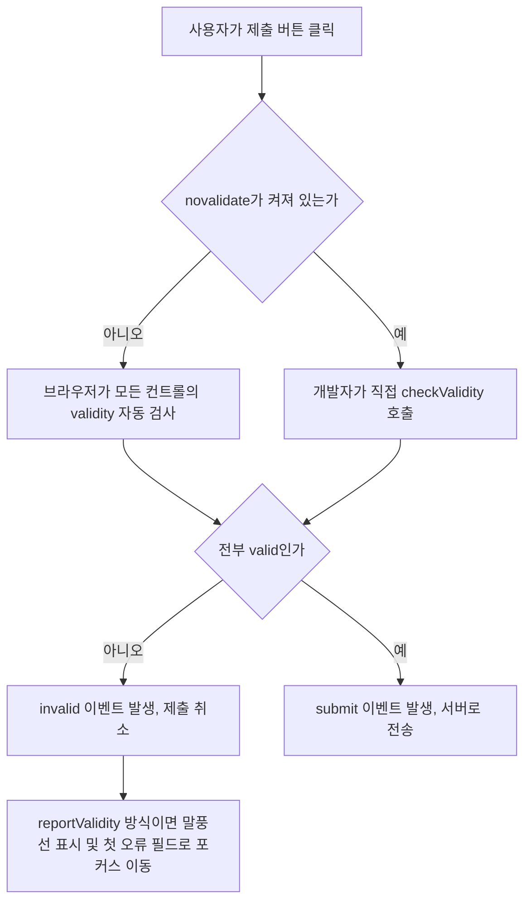

<Callout type="info">
  **이번 문서의 목표:** 이 문서를 다 읽으면 `required`·`pattern` 같은 속성이 브라우저 내부에서 어떤 상태 객체로 관리되는지 설명하고, `setCustomValidity`로 언어에 맞는 검증 메시지를 붙이고, `checkValidity`와 `reportValidity`를 구분해 쓰고, `:invalid`와 `:user-invalid`의 타이밍 차이를 이용해 "입력하기도 전에 빨갛게 변하는" 문제를 없앨 수 있습니다.
</Callout>

## 왜 브라우저 검증을 직접 들여다봐야 하는가

`html/html_fundamentals`에서 이미 `required`·`pattern`·`min`·`max` 같은 속성을 붙이면 브라우저가 알아서 폼 제출을 막아준다는 것을 배웠습니다. 그런데 실무에서는 곧 한계에 부딪힙니다.

- 브라우저 기본 오류 메시지("Please fill out this field.")는 영어로 나오거나, 사이트 언어와 안 맞을 수 있습니다.
- "비밀번호 확인란이 비밀번호란과 일치해야 한다" 같은 **두 필드 사이의 관계**는 `pattern` 하나로 표현할 수 없습니다.
- 값이 하나 잘못됐을 때 화면 전체를 빨갛게 칠하지 않고, 그 필드 옆에만 커스텀 말풍선을 띄우고 싶을 수 있습니다.

이 모든 요구는 "브라우저가 검증 결과를 어떤 상태로 들고 있는지"를 알아야 풀립니다. 그 상태를 읽고 고치는 창구가 **Constraint Validation API**(제약 검증 API)입니다. 단어를 풀면 **제약**(constraint)은 `required`·`pattern` 같은 속성이 거는 규칙이고, **검증**(validation)은 그 규칙을 값에 대입해 참·거짓을 판정하는 과정입니다.

> **쉽게 말하면:** `required`나 `pattern`은 브라우저에게 "이 규칙을 지켜라"라고 써 붙인 안내판입니다. Constraint Validation API는 그 안내판을 어긴 이유를 브라우저에게 직접 물어보고, 필요하면 안내판 문구를 내가 원하는 말로 바꿔 쓰는 도구입니다.

## 1. `ValidityState` — 브라우저가 들고 있는 검증 상태

### 정의와 구조

모든 폼 컨트롤(`input`, `select`, `textarea`, `button` 등)은 `validity`라는 속성을 가지고 있습니다. 이 속성이 가리키는 객체가 **`ValidityState`**입니다. 이름 그대로 "유효성(validity)의 상태(state)"를 담은 객체이며, 각 항목은 불리언(boolean, 참/거짓 값)입니다.

| 플래그 | 참이 되는 조건 | 관련 속성 |
|---|---|---|
| `valueMissing` | `required`인데 값이 비어 있다 | `required` |
| `typeMismatch` | `type="email"`/`type="url"` 형식과 값이 안 맞는다 | `type` |
| `patternMismatch` | `pattern` 정규식과 값이 안 맞는다 | `pattern` |
| `tooLong` | `maxlength`보다 값이 길다(사용자가 붙여넣기로 넘긴 경우) | `maxlength` |
| `tooShort` | `minlength`보다 값이 짧다 | `minlength` |
| `rangeUnderflow` | `min`보다 값이 작다 | `min` |
| `rangeOverflow` | `max`보다 값이 크다 | `max` |
| `stepMismatch` | `step` 간격에 맞지 않는다 | `step` |
| `badInput` | 브라우저가 값 자체를 해석하지 못한다(숫자란에 문자 입력 등) | 전반 |
| `customError` | `setCustomValidity`로 내가 직접 오류를 걸어 두었다 | 아래에서 다룸 |
| `valid` | 위 항목이 전부 거짓이다 | 종합 결과 |

12편에서 다룬 새 입력 타입들 — `date`·`email`·`range` 등 — 은 이 표의 여러 플래그를 동시에 검사 대상으로 만듭니다. 예를 들어 `type="number"`에 `min`·`max`·`step`을 같이 걸면 `rangeUnderflow`·`rangeOverflow`·`stepMismatch` 셋 다 후보가 됩니다.

### 실제로 눈으로 확인하기

아래 실습기에서 입력값을 바꿔가며 콘솔에 찍히는 `validity` 객체의 각 플래그가 어떻게 바뀌는지 확인해 보세요.

<CodePlayground
  template="vanilla"
  activeFile="/index.js"
  showConsole
  label="ValidityState 플래그를 직접 관찰하기"
  files={{
    '/index.html': `<form id="가입폼">
  <label>초대 코드(4자리 숫자, 필수)
    <input id="코드" name="code" type="text" required pattern="[0-9]{4}" minlength="4" maxlength="4">
  </label>
  <button type="submit">확인</button>
</form>`,
    '/index.js': `const 코드입력 = document.getElementById("코드");

코드입력.addEventListener("input", () => {
  const v = 코드입력.validity;
  console.log("--- 입력값:", JSON.stringify(코드입력.value), "---");
  console.log("valueMissing (비어있음):", v.valueMissing);
  console.log("patternMismatch (패턴불일치):", v.patternMismatch);
  console.log("tooShort (너무짧음):", v.tooShort);
  console.log("valid (종합 유효):", v.valid);
});

document.getElementById("가입폼").addEventListener("submit", (e) => {
  e.preventDefault();
  console.log("제출 시도 — 폼 전체 유효?", document.getElementById("가입폼").checkValidity());
});`,
  }}
/>

빈칸에서는 `valueMissing`이 참이고, `"12"`처럼 짧게 입력하면 `tooShort`가 참으로 바뀌며, `"12ab"`처럼 숫자가 아닌 글자가 섞이면 `patternMismatch`가 참이 됩니다. 하나의 값이 여러 플래그를 동시에 참으로 만들 수도 있다는 점이 중요합니다. `valid`는 이 모든 플래그가 전부 거짓일 때만 참이 되는 종합 판정입니다.

<Callout type="warning">
  **자주 틀리는 점:** `input.validity`는 매번 새로 계산되는 **읽기 전용** 스냅샷입니다. `input.validity.valueMissing = false`처럼 직접 대입해서 상태를 조작할 수 없습니다. 상태를 바꾸려면 값 자체를 바꾸거나, 바로 다음에 볼 `setCustomValidity`를 써야 합니다.
</Callout>

## 2. `setCustomValidity` — 내가 정한 오류 메시지 걸기

### 왜 필요한가

브라우저 기본 메시지는 사용자 언어 설정을 따르긴 하지만, "비밀번호 확인란이 비밀번호와 다릅니다" 같은 **필드 간 관계 검증**은 애초에 `required`·`pattern`만으로 표현할 수 없습니다. 이런 경우를 위해 HTML 폼(form)이 제공하는 함수가 `setCustomValidity(message)`입니다.

> **쉽게 말하면:** `setCustomValidity`는 "이 칸에 내가 직접 빨간 딱지를 붙였다 뗐다" 하는 스위치입니다. 문자열을 넣으면 딱지가 붙고(`customError`가 참이 되고 그 문자열이 오류 메시지가 됩니다), 빈 문자열 `""`을 넣으면 딱지가 완전히 사라집니다.

### 동작 규칙

- `element.setCustomValidity("메시지")`를 호출하면 `validity.customError`가 참이 되고, `validity.valid`도 거짓이 됩니다. 이 메시지는 다른 플래그와 무관하게 최우선으로 표시됩니다.
- **빈 문자열로 초기화하지 않으면 그 필드는 영원히 무효로 남습니다.** 조건이 해소된 뒤에도 `setCustomValidity("")`를 부르지 않으면, 값이 완벽해도 폼이 제출되지 않는 버그가 됩니다.
- `input` 이벤트마다 조건을 다시 검사해 붙였다 떼는 것이 정석 패턴입니다.

### 예시 — 비밀번호 확인 필드

<CodePlayground
  template="vanilla"
  activeFile="/index.js"
  showConsole
  label="setCustomValidity로 두 필드 사이 관계 검증하기"
  files={{
    '/index.html': `<form id="가입폼">
  <label>비밀번호
    <input id="비밀번호" type="password" required minlength="8">
  </label>
  <label>비밀번호 확인
    <input id="비밀번호확인" type="password" required>
  </label>
  <button type="submit">가입</button>
</form>`,
    '/index.js': `const 비번 = document.getElementById("비밀번호");
const 비번확인 = document.getElementById("비밀번호확인");

function 일치검사() {
  if (비번확인.value !== 비번.value) {
    // 조건이 안 맞으면 커스텀 오류를 건다
    비번확인.setCustomValidity("비밀번호가 일치하지 않습니다.");
  } else {
    // 조건이 풀리면 반드시 빈 문자열로 되돌린다
    비번확인.setCustomValidity("");
  }
}

비번.addEventListener("input", 일치검사);
비번확인.addEventListener("input", 일치검사);

document.getElementById("가입폼").addEventListener("submit", (e) => {
  e.preventDefault();
  console.log("제출 가능?", 비번확인.validity.valid);
  console.log("현재 메시지:", 비번확인.validationMessage);
});`,
  }}
/>

`validationMessage` 속성은 지금 사용자에게 보여질 오류 문구를 문자열로 돌려줍니다. `customError`가 걸려 있으면 `setCustomValidity`에 넣은 문자열이, 그렇지 않으면 브라우저 기본 문구가 나옵니다.

## 3. `checkValidity()`와 `reportValidity()` — 확인만 할지, 보여줄지

두 메서드는 이름이 비슷해 헷갈리기 쉽지만 역할이 다릅니다.

| 메서드 | 반환값 | 화면에 UI를 띄우는가 | 발생시키는 이벤트 | 주로 쓰는 상황 |
|---|---|---|---|---|
| `checkValidity()` | `boolean` | 아니오 | 무효면 `invalid` 이벤트 | 제출 전에 조용히 상태만 확인하고 싶을 때, 커스텀 UI로 직접 오류를 그릴 때 |
| `reportValidity()` | `boolean` | 예 — 브라우저 기본 말풍선을 띄우고 첫 무효 필드로 포커스 이동 | 무효면 `invalid` 이벤트 | 사용자에게 바로 브라우저 네이티브 오류 UI를 보여주고 싶을 때 |

두 메서드 모두 `form` 요소에서 부르면 폼에 속한 모든 컨트롤을 검사하고, 개별 `input`에서 부르면 그 요소 하나만 검사합니다.

```html
<form id="주문폼">
  <input type="email" required>
  <button type="button" id="검사버튼">양식 확인만</button>
  <button type="button" id="안내버튼">양식 확인 + 안내 표시</button>
</form>
```

```js
const 폼 = document.getElementById("주문폼");

document.getElementById("검사버튼").addEventListener("click", () => {
  // 조용히 결과만 받는다 — 화면에 아무것도 안 뜬다
  console.log("유효한가?", 폼.checkValidity());
});

document.getElementById("안내버튼").addEventListener("click", () => {
  // 브라우저 기본 말풍선을 띄우고 첫 오류 필드에 포커스를 옮긴다
  폼.reportValidity();
});
```

### `submit` 이벤트와의 관계

폼을 제출(submit)하려는 순간, 브라우저는 자동으로 `checkValidity()`에 해당하는 검사를 수행합니다. 하나라도 무효면 제출을 취소하고 `reportValidity()`와 같은 UI를 보여줍니다. `novalidate` 속성(또는 JS의 `form.noValidate = true`)을 붙이면 이 자동 검사 전체를 끕니다 — 검증을 안 하겠다는 뜻이 아니라, **자동 개입을 끄고 내가 전부 직접 제어하겠다**는 선언입니다.

<Callout type="warning">
  **자주 틀리는 점:** `novalidate`를 붙이면 "검증 규칙 자체가 사라진다"고 착각하기 쉽습니다. 실제로는 `required`·`pattern` 규칙과 `validity` 객체는 그대로 살아 있습니다. 다만 브라우저가 제출을 **자동으로 막는 동작**만 꺼질 뿐이라, `submit` 핸들러 안에서 `checkValidity()`를 직접 불러 막아야 합니다.
</Callout>

## 4. `:valid`·`:invalid`·`:user-invalid` — CSS로 상태를 보여주기

### `:valid`와 `:invalid`

폼 컨트롤의 `validity.valid`가 참이면 `:valid` 의사 클래스(pseudo-class, 가상 클래스)가, 거짓이면 `:invalid`가 CSS에서 매치됩니다. 문제는 **타이밍**입니다. `:invalid`는 사용자가 아직 아무것도 입력하지 않은 `required` 빈 칸에도 즉시 매치됩니다. 그대로 스타일을 걸면 페이지를 열자마자 필수 입력란이 전부 빨갛게 보이는, 사용자를 다그치는 화면이 됩니다.

### `:user-invalid`로 타이밍 문제 풀기

이 문제를 풀기 위해 CSS는 **`:user-invalid`**라는 의사 클래스를 추가로 정의했습니다. 이 클래스는 "사용자가 그 필드와 한 번이라도 상호작용을 마친 뒤에도 여전히 무효한 경우"에만 매치됩니다. 즉 처음 페이지를 열었을 때는 매치되지 않고, 사용자가 값을 입력했다가 포커스를 벗어났는데 아직 틀린 상태일 때 비로소 켜집니다.

| 의사 클래스 | 매치 시점 | 페이지 로드 직후 빈 필수 칸 | 실무 권장 용도 |
|---|---|---|---|
| `:invalid` | 값이 유효하지 않으면 즉시 | 매치됨(빨갛게 보임) | 제출 시도 후 스타일에 한정해 사용 |
| `:user-invalid` | 사용자가 상호작용을 마친 뒤에도 무효할 때 | 매치 안 됨 | 실시간 입력 중 피드백에 적합 |

```css
/* ❌ 페이지를 열자마자 빈 필수 칸이 전부 빨갛게 보인다 */
input:invalid {
  border-color: crimson;
}

/* ✅ 사용자가 건드리고 나서도 틀렸을 때만 빨갛게 */
input:user-invalid {
  border-color: crimson;
}

input:user-valid {
  border-color: seagreen;
}
```

`:user-invalid`와 짝을 이루는 `:user-valid`도 있어, "고쳐서 유효해진 순간" 초록색 등으로 안심시키는 피드백을 줄 수 있습니다. 이 두 의사 클래스는 최신 브라우저 기준으로 폭넓게 지원되지만, 지원 이전 버전에서는 단순히 매치되지 않아 스타일이 적용되지 않는 정도로 안전하게 저하(graceful degradation)되므로, 값을 확인할 때는 02편에서 다룬 MDN 호환성 표를 그 시점에 다시 확인하는 습관을 들이는 것이 좋습니다.

### 접근성 관점

시각적으로 빨간 테두리만 칠하면 스크린 리더(screen reader, 화면 읽어주는 프로그램) 사용자는 오류를 알 방법이 없습니다. `reportValidity()`가 띄우는 브라우저 기본 말풍선은 스크린 리더가 자동으로 읽어주지만, 커스텀 오류 UI를 직접 그린다면 오류 메시지가 담긴 요소를 `aria-describedby`로 입력란과 연결하고, 입력란에 `aria-invalid="true"`를 붙여야 스크린 리더가 "잘못된 입력, 설명: 비밀번호가 일치하지 않습니다" 식으로 함께 읽어줍니다. 커스텀 검증 UI를 만들 때 이 연결을 빠뜨리는 것이 실무에서 가장 흔한 실수입니다.

## 5. 종합 흐름

폼 제출부터 검증까지 전체 흐름을 정리하면 다음과 같습니다.



여기서 잊지 말아야 할 것은, **브라우저 단 검증은 사용자 경험을 위한 것이지 보안을 위한 것이 아니라는** 점입니다. 개발자 도구로 `required` 속성을 지우거나 `novalidate`를 강제로 켜는 것은 누구나 할 수 있습니다. 그래서 서버 쪽 검증은 항상 별도로 다시 이루어져야 하며, Constraint Validation API는 어디까지나 "값을 보내기 전에 사용자에게 빠른 피드백을 주는" 첫 번째 방어선입니다.

## 핵심 정리

- `element.validity`는 `valueMissing`·`typeMismatch`·`patternMismatch` 등 세부 플래그를 담은 `ValidityState` 객체이며, `valid`는 이 모든 플래그가 거짓일 때만 참이 되는 종합 결과다.
- `setCustomValidity(message)`로 임의의 규칙(필드 간 관계 등)을 오류로 걸 수 있지만, 조건이 풀리면 반드시 `setCustomValidity("")`로 되돌려야 폼이 영구히 막히지 않는다.
- `checkValidity()`는 UI 없이 결과만 반환하고, `reportValidity()`는 브라우저 기본 말풍선을 띄우고 포커스를 옮긴다. `novalidate`는 자동 검사를 끌 뿐 규칙 자체를 없애지 않는다.
- `:invalid`는 상호작용 전에도 즉시 매치돼 사용자를 다그치는 화면을 만들기 쉽고, `:user-invalid`는 상호작용 이후에만 매치돼 실시간 피드백에 더 적합하다.
- 브라우저 검증은 사용자 경험을 위한 첫 번째 방어선일 뿐이며, 보안을 위한 검증은 반드시 서버에서 다시 이루어져야 한다.

## 마무리 복습

<Quiz
  questionNumber={1}
  question="input 요소의 validity.valid가 참이 되는 조건으로 옳은 것은?"
  options={['required 속성이 없을 때', '값이 하나라도 입력되어 있을 때', 'valueMissing, typeMismatch 등 모든 세부 플래그가 거짓일 때', 'setCustomValidity가 한 번이라도 호출되었을 때']}
  correctAnswer={3}
  explanation="valid는 개별 검증 플래그들이 모두 거짓일 때만 참이 되는 종합 판정 값이다. required 여부나 값 존재만으로는 결정되지 않는다."
  optionExplanations={['required가 없어도 pattern 등 다른 제약을 어기면 invalid일 수 있다', '값이 있어도 형식이 틀리면 typeMismatch 등으로 invalid가 된다', '정답 — 모든 세부 플래그가 거짓이어야 valid가 참이다', 'setCustomValidity를 빈 문자열로 부르면 오히려 customError가 꺼진다']}
/>

<Quiz
  questionNumber={2}
  question="setCustomValidity를 사용할 때 가장 흔히 발생하는 실수는 무엇인가?"
  options={['빈 문자열을 인자로 넣어 오류를 해제하는 것', '조건이 해소된 뒤에도 빈 문자열로 초기화하지 않아 폼이 영원히 막히는 것', '문자열 대신 숫자를 인자로 넘기는 것', 'input 이벤트 안에서 호출하는 것']}
  correctAnswer={2}
  explanation="setCustomValidity로 건 오류는 스스로 사라지지 않는다. 조건이 풀렸을 때 빈 문자열로 다시 호출해 해제하지 않으면 값이 완벽해도 제출이 계속 막힌다."
  optionExplanations={['이것이 정확히 오류를 해제하는 올바른 방법이다', '정답 — 해제 호출을 빠뜨리는 것이 대표적인 버그다', '문자열이 아닌 값도 문자열로 변환되어 처리되지만 이것이 흔한 실수는 아니다', 'input 이벤트에서 매번 재검사하는 것은 정석 패턴이다']}
/>

<Quiz
  questionNumber={3}
  question="checkValidity()와 reportValidity()의 차이로 옳은 것은?"
  options={['checkValidity는 서버에 값을 전송하고, reportValidity는 전송하지 않는다', 'reportValidity는 브라우저 기본 오류 UI를 화면에 표시하지만 checkValidity는 표시하지 않는다', 'checkValidity는 폼 전체를, reportValidity는 개별 요소만 검사할 수 있다', '두 메서드는 반환값의 자료형이 다르다']}
  correctAnswer={2}
  explanation="두 메서드 모두 boolean을 반환하고 invalid 이벤트를 발생시키지만, reportValidity만 브라우저 기본 말풍선을 띄우고 첫 무효 요소로 포커스를 옮긴다."
  optionExplanations={['둘 다 값 전송과는 무관하며 서버로 보내지 않는다', '정답 — UI 표시 여부가 핵심 차이다', '둘 다 form과 개별 컨트롤 모두에서 호출 가능하다', '둘 다 boolean을 반환한다']}
/>

<Quiz
  questionNumber={4}
  question="novalidate 속성을 폼에 붙였을 때 일어나는 일로 옳은 것은?"
  options={['required, pattern 같은 제약 규칙 자체가 사라진다', 'validity 객체가 항상 valid로 고정된다', '제출 시 브라우저의 자동 검증·차단 동작만 꺼지고, 규칙과 validity 계산은 그대로 유지된다', '서버 측 검증이 자동으로 활성화된다']}
  correctAnswer={3}
  explanation="novalidate는 브라우저가 제출을 자동으로 막는 동작만 끈다. required나 pattern 같은 제약과 validity 계산 자체는 그대로 살아 있어 개발자가 직접 checkValidity 등으로 제어할 수 있다."
  optionExplanations={['속성과 규칙은 그대로 남아 있으며 validity에도 반영된다', 'novalidate와 무관하게 실제 값에 따라 valid 여부가 계산된다', '정답 — 자동 차단만 꺼질 뿐 규칙은 살아 있다', 'novalidate는 서버 검증과 무관한 클라이언트 측 속성이다']}
/>

<Quiz
  questionNumber={5}
  question=":invalid와 :user-invalid의 차이로 옳은 것은?"
  options={[':invalid는 사용자 상호작용 이후에만 매치되고 :user-invalid는 즉시 매치된다', ':invalid는 값이 무효하면 즉시 매치되어 페이지 로드 직후 빈 필수 칸도 매치되지만, :user-invalid는 사용자가 상호작용을 마친 뒤에도 무효할 때만 매치된다', '두 의사 클래스는 완전히 동일하게 동작한다', ':user-invalid는 JavaScript로만 켤 수 있는 클래스다']}
  correctAnswer={2}
  explanation=":invalid는 상호작용 여부와 무관하게 즉시 매치되어 빈 필수 칸도 빨갛게 보이게 만들 수 있다. :user-invalid는 사용자가 필드를 다룬 뒤에도 여전히 무효할 때만 매치되어 더 자연스러운 실시간 피드백에 적합하다."
  optionExplanations={['타이밍이 반대로 설명되어 있다', '정답 — 상호작용 시점 기준의 차이다', '타이밍 조건이 서로 다르므로 동일하지 않다', '순수 CSS 의사 클래스이며 JS 개입 없이 브라우저가 자동으로 매치한다']}
/>

<Quiz
  questionNumber={6}
  question="Constraint Validation API에 대한 설명으로 옳지 않은 것은?"
  options={['이 API로 하는 검증은 서버 측 검증을 대체하지 못한다', 'validity 객체의 각 플래그는 값에 따라 매번 다시 계산되는 읽기 전용 상태다', 'validity.valueMissing을 직접 대입해 상태를 강제로 바꿀 수 있다', 'validationMessage는 지금 사용자에게 표시될 오류 문구를 담고 있다']}
  correctAnswer={3}
  explanation="validity 객체의 각 플래그는 읽기 전용이며 직접 대입할 수 없다. 상태를 바꾸려면 값을 바꾸거나 setCustomValidity를 사용해야 한다."
  optionExplanations={['클라이언트 검증은 우회 가능하므로 서버 검증이 항상 별도로 필요하다', '값이 바뀔 때마다 새로 계산되는 스냅샷이다', '정답(틀린 설명) — validity 플래그는 읽기 전용이라 직접 대입할 수 없다', 'customError가 걸려 있으면 그 메시지가, 아니면 브라우저 기본 문구가 담긴다']}
/>

## 참고 자료

- [MDN — Using HTML form validation and the Constraint Validation API](https://developer.mozilla.org/en-US/docs/Web/HTML/Guides/Constraint_validation)
- [MDN — Client-side form validation](https://developer.mozilla.org/en-US/docs/Learn_web_development/Extensions/Forms/Form_validation)
