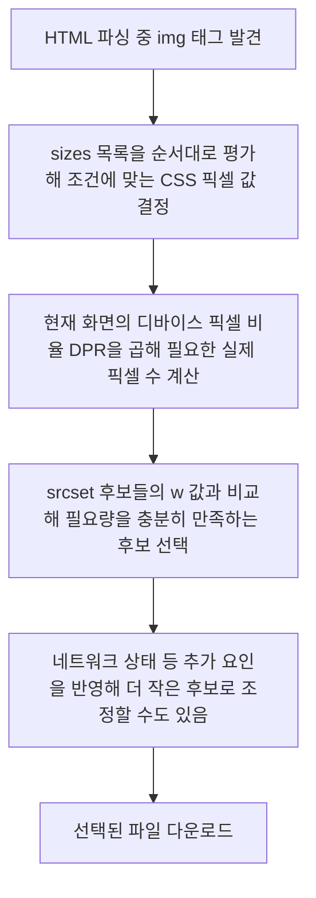

<Callout type="info">
  **이번 문서의 목표:** 이 문서를 다 읽으면 `srcset`의 밀도 서술자(`1x`/`2x`)와 너비 서술자(`w`)를 구분해서 쓰고, `sizes`가 왜 필요한지(브라우저에게 레이아웃 정보를 미리 알려주는 것) 설명하고, 브라우저가 여러 이미지 후보 중 하나를 고르는 기준과 그 한계를 이해할 수 있습니다.
</Callout>

## 왜 이미지 하나로는 부족한가

같은 사진이라도 화면마다 필요한 크기가 다릅니다. 손바닥만 한 스마트폰 화면과, 4K 모니터에 꽉 채운 브라우저 창이 **똑같은 원본 파일**을 받는다고 생각해 봅시다.

- 스마트폰에 4K용 큰 파일을 보내면 화면에는 어차피 작게 그려지는데 데이터만 낭비합니다. 모바일 환경에서는 이 낭비가 곧 로딩 시간과 통신비 부담으로 이어집니다.
- 반대로 4K 모니터의 고밀도 화면(레티나 디스플레이 등)에 작은 파일을 보내면, 브라우저가 억지로 늘려 그리면서 사진이 뿌옇게 흐려집니다.

**같은 콘텐츠, 다른 해상도**라는 이 문제를 CSS 미디어 쿼리(media query)로는 풀 수 없습니다. CSS는 이미지가 화면에 **얼마나 크게 보일지**는 정할 수 있지만, **어떤 파일을 다운로드할지**는 결정하지 못합니다. 이 역할을 하는 것이 `img` 요소의 `srcset`과 `sizes` 속성입니다.

> **쉽게 말하면:** `src` 하나만 쓰는 것은 식당에서 사이즈 선택 없이 무조건 곱빼기 하나만 파는 것과 같습니다. `srcset`은 "이 사진은 작은 것, 중간 것, 큰 것 세 가지 버전이 있습니다"라고 메뉴판에 올려두는 것이고, `sizes`는 "이 테이블(레이아웃)에서는 보통 이 정도 크기로 나갑니다"라고 미리 알려주는 것입니다. 최종적으로 어떤 사이즈를 내올지는 주방(브라우저)이 손님의 배고픔(화면 밀도·뷰포트 크기)을 보고 고릅니다.

## 1. `srcset`의 두 가지 서술자

### 밀도 서술자(`1x`, `2x`, `3x`) — 같은 크기, 다른 선명도

**밀도 서술자**(density descriptor)는 "이 화면에서 이 이미지가 항상 똑같은 CSS 크기로 나타나지만, 화면의 픽셀 밀도(density)에 따라 더 선명한 파일을 받고 싶다"는 상황을 위한 것입니다. 여기서 픽셀 밀도란 **디바이스 픽셀 비율**(Device Pixel Ratio, DPR)을 말합니다 — 한 개의 CSS 픽셀을 실제 화면이 몇 개의 물리적 점으로 찍어내는지를 나타내는 배수입니다. 일반 모니터는 보통 `1x`(DPR 1), 이른바 "레티나"라 불리는 고밀도 화면은 `2x`나 `3x`입니다.

```html

```

이 코드는 "화면에는 항상 가로 120픽셀 크기로 그려지지만, DPR이 2인 화면에서는 `로고-2x.png`(실제로는 240픽셀짜리 파일)를 받아 그 안에 촘촘히 채워 넣어라"는 뜻입니다. 로고나 아이콘처럼 **레이아웃 크기가 화면 폭과 무관하게 항상 고정**인 경우에 잘 맞습니다.

### 너비 서술자(`w`) — 파일의 실제 픽셀 너비를 알려주기

**너비 서술자**(width descriptor)는 밀도가 아니라 **그 이미지 파일 자체가 몇 픽셀 너비로 저장되어 있는지**를 브라우저에게 알려줍니다. 배너나 본문 사진처럼 화면 크기에 따라 실제로 보이는 크기 자체가 달라지는 경우에 씁니다.

```html

```

`400w`는 "이 파일은 실제로 가로 400픽셀짜리다"라는 사실 정보입니다. DPR과 달리 이 숫자는 화면 배수가 아니라 **파일 자체의 실제 크기**입니다. 너비 서술자를 쓸 때는 브라우저가 "그럼 화면에서 이 이미지가 실제로 몇 픽셀만큼 넓게 보일 예정인지"를 알아야 어떤 파일이 적당한지 계산할 수 있는데, 이 정보를 채워주는 것이 바로 다음에 볼 `sizes`입니다.

| 구분 | 밀도 서술자(`1x`/`2x`) | 너비 서술자(`w`) |
|---|---|---|
| 표현하는 것 | 화면 픽셀 밀도 배수 | 파일의 실제 픽셀 너비 |
| 함께 필요한 속성 | 없어도 동작(레이아웃 크기가 고정이라는 전제) | `sizes` — 없으면 부정확하게 동작할 수 있음 |
| 적합한 대상 | 로고, 아이콘처럼 크기가 고정인 이미지 | 배너, 본문 사진처럼 화면 폭에 따라 실제 표시 크기가 달라지는 이미지 |
| 후보 개수 | 보통 2–3개(1x/2x/3x) | 원본 크기에 따라 여러 개(예: 400w, 800w, 1200w, 1600w) |

<Callout type="warning">
  **자주 틀리는 점:** 하나의 `srcset` 안에 밀도 서술자와 너비 서술자를 섞어 쓸 수 없습니다(`"a.jpg 1x, b.jpg 800w"`는 유효하지 않습니다). 이미지의 성격에 따라 둘 중 하나의 방식을 정해서 일관되게 씁니다.
</Callout>

## 2. `sizes` — 레이아웃 정보를 미리 알려주는 약속

### 왜 필요한가

너비 서술자를 쓸 때, 브라우저는 이미지를 실제로 그리기 **훨씬 전에**(HTML을 파싱하는 시점에) 어떤 파일을 받을지 미리 정하고 다운로드를 시작해야 합니다. 그런데 그 시점에는 아직 CSS가 다 계산되지 않아 이미지가 화면에서 몇 픽셀 폭으로 보일지 브라우저가 알 수 없습니다. `sizes`는 이 정보를 브라우저에게 **미리 선언**해주는 약속입니다.

> **쉽게 말하면:** `sizes`는 "이 화면 너비에서는 이미지가 대략 이만큼 넓게 나올 거야"라고 브라우저 귀에 미리 속삭여 주는 힌트입니다. 실제로 얼마나 크게 보일지는 여전히 CSS가 정하지만, 브라우저가 파일을 고를 때 참고할 예측값을 미리 줘야 헛다리를 덜 짚습니다.

### 문법

`sizes`는 쉼표로 구분된 "조건 길이" 목록이며, 맨 앞에서부터 순서대로 **처음 조건이 참이 되는 값**을 사용합니다. 마지막 항목은 조건 없이 기본값으로 둡니다.

```html
sizes="(min-width: 1200px) 1140px, (min-width: 768px) 720px, 100vw"
```

읽는 순서: "뷰포트가 1200픽셀 이상이면 이 이미지는 1140픽셀 너비로 보인다. 아니고 768픽셀 이상이면 720픽셀로 보인다. 둘 다 아니면(좁은 화면이면) 뷰포트 너비의 100퍼센트(`100vw`)로 보인다."

`sizes`를 아예 생략하면 기본값은 `100vw`입니다. 그런데 실제로는 이미지가 본문 폭의 절반만 차지하는 레이아웃인데 `sizes`를 생략하면, 브라우저는 "화면 전체 너비만큼 보인다"고 오해해 필요 이상으로 큰 파일을 받아버립니다. **너비 서술자를 쓰면서 `sizes`를 빠뜨리는 것**이 반응형 이미지에서 가장 흔한 실수입니다.

## 3. 브라우저가 실제로 이미지를 고르는 기준

브라우저는 대략 다음 순서로 계산합니다(정확한 세부 구현은 브라우저마다 조금씩 다를 수 있습니다).



예를 들어 `sizes`가 800px로 평가됐고 DPR이 2인 화면이라면, 브라우저는 최소 1600픽셀 이상을 만족하는 후보를 고르려 합니다. `srcset`에 `800w`와 `1600w`가 있다면 `1600w`를 고르는 식입니다.

<Callout type="warning">
  **자주 틀리는 점:** 이 알고리즘은 **표준이 강제하는 정확한 공식이 아니라 브라우저에게 맡겨진 재량**입니다. 명세는 "적절한 후보를 고르라"고만 규정하고, 사용자의 데이터 절약 모드나 느린 네트워크 상황을 감안해 브라우저가 일부러 더 작은 파일을 고를 수도 있다고 허용합니다. 그래서 "이 뷰포트에서는 반드시 이 파일이 로드된다"고 결과를 단정할 수 없습니다. 또한 대부분의 브라우저는 한 번 고른 이미지를 창 크기를 조정한다고 다시 계산해 새로 받아오지 않습니다 — 최초 계산 시점의 값이 유지되는 경우가 많습니다.
</Callout>

### 실습 — 값을 바꿔가며 sizes의 의미 확인하기

아래 실습기에서 `sizes` 값과 뷰포트 폭을 바꿔가며, `currentSrc`(브라우저가 실제로 고른 파일 주소)가 어떻게 달라지는지 콘솔로 확인해 보세요. 브라우저 미리보기 창의 폭을 좁혔다 넓혔다 하면서 새로고침하면 선택이 달라지는 것도 함께 관찰할 수 있습니다.

<CodePlayground
  template="static"
  activeFile="/index.html"
  showConsole
  label="sizes를 바꾸면 브라우저가 고르는 이미지가 달라진다"
  files={{
    '/index.html': `<link rel="stylesheet" href="styles.css">
<main>
  <p>뷰포트 폭을 바꾼 뒤 새로고침하면서 콘솔의 currentSrc를 확인하세요.</p>
  
</main>
<script src="/index.js"></script>`,
    '/styles.css': `body { font-family: system-ui, sans-serif; margin: 0; padding: 16px; }
img { max-width: 100%; height: auto; display: block; margin-top: 12px; }`,
    '/index.js': `const img = document.getElementById("반응형이미지");

function 출력() {
  console.log("현재 뷰포트 너비:", window.innerWidth, "px");
  console.log("브라우저가 고른 파일:", img.currentSrc);
}

window.addEventListener("load", 출력);
window.addEventListener("resize", 출력);`,
  }}
/>

`img.currentSrc`는 `src`나 `srcset`에 적은 원래 문자열이 아니라, **브라우저가 실제로 선택해 로드한 파일의 최종 주소**를 알려주는 속성입니다. 같은 마크업이라도 화면 폭과 밀도에 따라 이 값이 달라지는 것을 확인하는 것이 반응형 이미지 디버깅의 기본기입니다.

## 4. 접근성과 이 편 이후의 흐름

`srcset`·`sizes`가 무엇을 하든 **`alt` 속성은 여전히 필수**입니다. 스크린 리더는 어떤 파일이 실제로 로드됐는지와 무관하게 `alt`에 적힌 대체 텍스트를 읽으므로, 해상도 후보를 아무리 늘려도 대체 텍스트를 빠뜨리면 접근성은 그대로 깨집니다.

지금까지는 "같은 그림을 해상도만 바꿔 제공"하는 경우를 다뤘습니다. 그런데 화면이 아주 좁아지면 사진의 **구도 자체**(예: 가로로 넓은 파노라마를 세로로 잘라 인물 위주로 다시 잡는 등)를 바꿔야 하는 경우가 있습니다. 이런 "아트 디렉션"(art direction) 문제는 `srcset`만으로는 풀 수 없고, 다음 17편에서 다룰 `<picture>` 요소가 필요합니다.

## 핵심 정리

- 밀도 서술자(`1x`/`2x`/`3x`)는 레이아웃 크기가 고정인 이미지에서 화면 밀도(DPR)에 맞는 선명도를 고르게 하고, 너비 서술자(`w`)는 파일의 실제 픽셀 너비를 알려줘 화면 폭에 따라 표시 크기 자체가 달라지는 이미지에 쓴다. 둘을 한 `srcset`에 섞어 쓸 수 없다.
- `sizes`는 브라우저가 이미지를 실제로 그리기 전에 "이 조건에서는 이만큼 넓게 보인다"를 미리 알려주는 약속이며, 생략하면 기본값 `100vw`로 간주되어 불필요하게 큰 파일을 받을 수 있다.
- 너비 서술자를 쓰면서 `sizes`를 빠뜨리는 것이 가장 흔한 실수다.
- 브라우저의 이미지 선택 알고리즘은 표준이 강제하는 정확한 공식이 아니라 브라우저 재량이며, 네트워크 상황에 따라 더 작은 파일을 고를 수도 있고 창 크기 변경 후에도 재계산하지 않을 수 있다.
- 해상도만 바꾸는 문제는 `srcset`/`sizes`로 풀리지만, 구도 자체가 달라져야 하는 아트 디렉션은 `<picture>`가 필요하다(17편).

## 마무리 복습

<Quiz
  questionNumber={1}
  question="밀도 서술자(1x, 2x)와 너비 서술자(w)의 차이로 옳은 것은?"
  options={['밀도 서술자는 파일의 실제 픽셀 크기를, 너비 서술자는 화면 밀도 배수를 나타낸다', '밀도 서술자는 화면 픽셀 밀도 배수를, 너비 서술자는 파일의 실제 픽셀 너비를 나타낸다', '두 서술자는 완전히 동일한 정보를 다른 표기로 나타낸 것이다', '너비 서술자는 CSS에서만 사용할 수 있다']}
  correctAnswer={2}
  explanation="밀도 서술자는 DPR 배수를 나타내고, 너비 서술자는 이미지 파일 자체의 실제 픽셀 너비를 나타낸다. 서로 다른 정보이며 섞어 쓸 수 없다."
  optionExplanations={['설명이 서로 뒤바뀌어 있다', '정답 — 각각 다른 종류의 정보를 표현한다', '표현하는 정보의 성격 자체가 다르다', 'srcset 속성의 문법이며 CSS 전용이 아니다']}
/>

<Quiz
  questionNumber={2}
  question="너비 서술자(w)를 사용한 srcset에서 sizes를 생략했을 때 벌어지는 일로 옳은 것은?"
  options={['브라우저가 srcset 전체를 무시하고 src만 사용한다', '기본값 100vw로 간주되어, 실제 표시 폭이 더 좁은 레이아웃에서는 불필요하게 큰 파일을 받을 수 있다', '이미지가 아예 렌더링되지 않는다', 'alt 속성이 자동으로 비활성화된다']}
  correctAnswer={2}
  explanation="sizes를 생략하면 기본값은 100vw로 간주되므로, 실제로는 화면의 일부만 차지하는 이미지인데도 전체 너비 기준으로 큰 파일이 선택될 수 있다."
  optionExplanations={['srcset은 여전히 평가되며 무시되지 않는다', '정답 — 기본값 100vw로 인해 과도하게 큰 파일이 선택될 위험이 있다', '렌더링 자체는 정상적으로 이루어진다', 'alt와는 무관한 속성이다']}
/>

<Quiz
  questionNumber={3}
  question="img.currentSrc 속성이 알려주는 것은?"
  options={['개발자가 마크업에 처음 적어 놓은 src 속성값', '브라우저가 실제로 선택해 로드한 최종 파일 주소', 'CSS로 계산된 이미지의 표시 크기', 'srcset에 나열된 후보 개수']}
  correctAnswer={2}
  explanation="currentSrc는 srcset과 sizes 평가를 거쳐 브라우저가 실제로 선택한 파일의 최종 주소를 알려주는 속성이며, 반응형 이미지 디버깅에 쓰인다."
  optionExplanations={['원본 마크업의 값이 아니라 선택 결과를 보여준다', '정답 — 실제 선택 결과를 확인할 수 있는 속성이다', '표시 크기가 아니라 선택된 파일 주소를 알려준다', '개수가 아니라 선택된 하나의 주소를 반환한다']}
/>

<Quiz
  questionNumber={4}
  question="브라우저의 이미지 후보 선택 알고리즘에 대한 설명으로 옳은 것은?"
  options={['모든 브라우저가 동일한 공식으로 뷰포트 폭에 정확히 비례하는 후보를 반드시 선택한다', '창 크기를 조정할 때마다 항상 새로운 파일을 다시 계산해 다운로드한다', '표준은 대략적인 지침만 제공하며, 네트워크 상황 등을 감안해 브라우저가 더 작은 후보를 고를 수도 있다', 'sizes 값과 무관하게 항상 가장 큰 후보를 선택한다']}
  correctAnswer={3}
  explanation="이미지 후보 선택은 표준이 강제하는 정확한 공식이 아니라 브라우저 재량이며, 데이터 절약이나 느린 네트워크 상황을 감안해 더 작은 파일을 고를 수도 있다."
  optionExplanations={['정확한 공식이 강제되지 않으며 브라우저마다 재량이 있다', '대부분의 브라우저는 최초 계산값을 유지하고 재계산하지 않는 경우가 많다', '정답 — 표준은 재량을 허용하고 상황에 따라 판단이 달라질 수 있다', 'sizes와 srcset을 종합해 필요한 만큼의 후보를 고르려 하지 무조건 최대치를 고르지 않는다']}
/>

<Quiz
  questionNumber={5}
  question="다음 중 srcset에 밀도 서술자를 쓰기에 가장 적합한 대상은?"
  options={['화면 폭에 따라 실제 표시 크기가 크게 달라지는 배너 사진', '항상 같은 CSS 크기로 표시되는 회사 로고', '뷰포트가 좁아지면 구도 자체가 바뀌어야 하는 인물 사진', '문단 사이에 배치되는 큰 폭의 본문 삽화']}
  correctAnswer={2}
  explanation="밀도 서술자는 레이아웃 크기가 고정된 이미지에서 화면 밀도에 따라 선명도만 다르게 제공할 때 적합하다. 로고나 아이콘이 대표적인 예다."
  optionExplanations={['표시 크기가 달라지는 경우는 너비 서술자와 sizes 조합이 더 적합하다', '정답 — 크기가 고정된 이미지에 적합한 방식이다', '구도가 바뀌는 문제는 picture 요소가 필요한 아트 디렉션 영역이다', '표시 크기가 레이아웃에 따라 달라지므로 너비 서술자가 더 적합하다']}
/>

<Quiz
  questionNumber={6}
  question="srcset과 sizes를 사용하더라도 여전히 필수로 남는 속성은?"
  options={['loading', 'decoding', 'alt', 'fetchpriority']}
  correctAnswer={3}
  explanation="어떤 해상도 후보가 선택되든 스크린 리더는 항상 alt에 적힌 대체 텍스트를 읽으므로, 반응형 이미지를 구성하더라도 alt는 빠뜨리면 안 된다."
  optionExplanations={['로딩 전략을 위한 선택적 속성이다', '디코딩 방식을 위한 선택적 속성이다', '정답 — 접근성을 위해 항상 필요한 속성이다', '우선순위 힌트를 위한 선택적 속성이다']}
/>

## 참고 자료

- [MDN — Using responsive images in HTML](https://developer.mozilla.org/en-US/docs/Web/HTML/Guides/Responsive_images)
