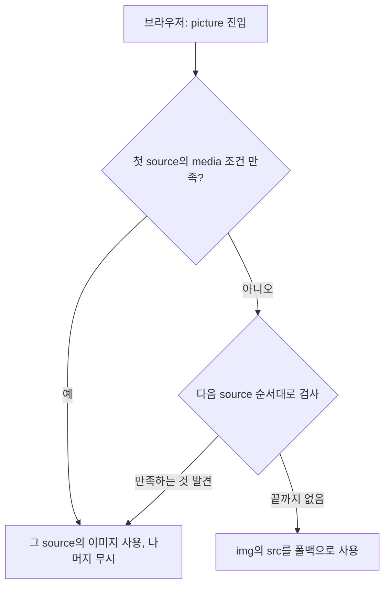

<Callout type="info">
  **이번 문서의 목표:** 이 문서를 다 읽으면 `srcset`만으로 되는 일과 `<picture>`가 필요한 일을 정확히 구분하고, `<source>`의 `media` 조건으로 아트 디렉션(art direction)을, `type` 조건으로 AVIF·WebP 포맷 전환을 구현할 수 있게 됩니다.
</Callout>

## 지난 편 요약 — `srcset`과 `sizes`가 푸는 문제

16편에서 다룬 `srcset`과 `sizes`는 **같은 사진을 화면 밀도(density)나 실제 표시 너비에 맞춰 다른 해상도로 내려주는** 기술이었습니다. `1x`/`2x` 같은 밀도 서술자(density descriptor)든 `480w`/`800w` 같은 너비 서술자(width descriptor)든, 브라우저가 고르는 후보들은 **전부 같은 장면을 찍은 같은 사진**입니다. 단지 픽셀 수만 다릅니다.

그런데 실무에서는 이것만으로 안 풀리는 문제가 하나 더 있습니다. **화면 크기가 바뀌면 사진의 구도 자체를 바꿔야 하는 경우**입니다.

## 1. `srcset`만으로 안 되는 지점 — 해상도 스위칭 vs 아트 디렉션

### 왜 필요한가

와이드스크린 데스크톱에서는 인물과 배경이 함께 보이는 가로로 넓은 사진이 어울립니다. 그런데 그 사진을 그대로 축소해 좁은 모바일 화면에 넣으면, 정작 보여주고 싶은 인물이 화면 한구석에 손톱만큼 작아집니다. 진짜 필요한 것은 축소가 아니라 **다시 자른(crop) 다른 사진** — 모바일에서는 인물을 클로즈업한 세로 사진입니다.

이렇게 **뷰포트(viewport, 화면에 실제로 보이는 영역) 조건에 따라 아예 다른 이미지 파일(다른 구도·다른 화면비)을 내보내는 것**을 **아트 디렉션**(art direction, 미술 연출)이라고 부릅니다. 사진작가나 편집자가 매체에 맞춰 사진을 다시 구성한다는 뜻에서 온 표현입니다.

> **쉽게 말하면:** `srcset`은 같은 그림을 크게 인쇄하느냐 작게 인쇄하느냐의 문제이고, 아트 디렉션은 아예 다른 그림을 걸어야 하는 문제입니다. 인쇄 크기 조절은 확대·축소 복사기로 되지만, 그림을 바꾸는 건 복사기로 안 됩니다.

### 정의 — 두 기술의 역할 분리

| 구분 | 해상도 스위칭 (`srcset`/`sizes`) | 아트 디렉션 (`<picture>`+`media`) |
|------|-----------------------------------|-------------------------------------|
| 후보 이미지의 관계 | 같은 장면, 다른 픽셀 크기 | 서로 다른 구도·크롭·화면비 |
| 브라우저가 고르는 기준 | 화면 밀도·표시 너비(자동) | 개발자가 지정한 `media` 조건(명시적) |
| 목적 | 대역폭 절약, 선명도 확보 | 레이아웃·구도의 시각적 완성도 |
| 담당 요소 | `` | `<picture><source media>...</picture>` |

## 2. `<picture>`와 `<source>`의 `media` 조건

### 구조와 동작 순서

`<picture>` 요소 자체는 화면에 아무것도 그리지 않는 **감싸는 상자**입니다. 실제로 그려지는 것은 언제나 내부의 ``입니다. `<picture>`가 하는 일은 그 ``에 "이번엔 이 파일을 써라"라고 미리 알려주는 것뿐입니다.

```html
<picture>
  <source media="(min-width: 1024px)" srcset="hero-wide.jpg" />
  <source media="(min-width: 600px)" srcset="hero-tablet.jpg" />
  
</picture>
```

브라우저는 위에서 아래로 `<source>`를 훑으며 **가장 먼저 조건을 만족하는 것 하나**를 고르고 나머지는 무시합니다. 어떤 `<source>`의 `media` 조건도 만족하지 않으면 맨 아래 ``가 **폴백**(fallback, 대체 수단)으로 그려집니다.



<Callout type="warning">
  **자주 틀리는 점:** `<source>`의 순서를 "좁은 화면 먼저" 같은 규칙으로 외우면 안 됩니다. 규칙은 **위에서부터 처음 만족하는 것을 쓴다**뿐입니다. 그래서 조건이 겹칠 때는 **더 구체적이거나 더 큰 조건을 위에** 둬야 합니다. 위 예시에서 `min-width: 1024px`를 맨 위에 둔 이유도, 1024px를 만족하는 화면은 600px 조건도 항상 같이 만족하기 때문에 순서를 뒤집으면 큰 화면에서도 태블릿용 사진이 먼저 걸립니다.
</Callout>

### 눈으로 확인하기 — 미리보기 폭을 줄여보기

아래 실습기의 미리보기 영역 폭을 마우스로 좁혀 보세요. 폭이 500픽셀을 넘나드는 순간 완전히 다른 사진(색과 비율이 다른 자리표시자)로 바뀌는 것을 확인할 수 있습니다. 이것이 단순 리사이즈가 아니라 **다른 파일로의 교체**라는 점이 핵심입니다.

<CodePlayground
  template="static"
  activeFile="/index.html"
  label="미리보기 폭을 좁혀서 아트 디렉션이 실제 파일 교체인지 확인하기"
  files={{
    '/index.html': `<main>
  <h1>아트 디렉션 실습</h1>
  <p>미리보기 폭을 500px 안팎으로 좁혀 보세요.</p>
  <picture>
    <source media="(min-width: 500px)" srcset="https://placehold.co/800x300/1d4ed8/ffffff?text=Wide+16:5+Crop" />
    
  </picture>
  <p id="상태"></p>
</main>`,
    '/styles.css': `body { font-family: system-ui, sans-serif; padding: 1rem; }
img { max-width: 100%; height: auto; display: block; border-radius: 8px; }
p#상태 { color: #555; font-size: 0.9rem; }`,
  }}
/>

넓을 때 나오는 파란 가로 이미지와 좁을 때 나오는 붉은 세로 이미지는 실제 서비스라면 **같은 순간을 찍은 완전히 다른 두 장의 사진 파일**입니다. `srcset`의 너비 서술자였다면 같은 사진을 그저 다른 픽셀 수로 내려받았을 뿐이라 화면비까지는 못 바꿉니다.

## 3. `type` 조건 — 포맷 스위칭

### 왜 필요한가

`media`가 "화면 조건에 따라 다른 그림"을 고르는 것이었다면, `type`은 "브라우저가 지원하는 파일 형식에 따라 다른 파일"을 고르는 것입니다. AVIF·WebP는 같은 화질에서 JPEG보다 파일 크기가 훨씬 작지만, 모든 브라우저가 항상 지원하는 것은 아닙니다. 지원하지 않는 브라우저에 AVIF만 주면 이미지가 아예 안 뜹니다.

### 구조

```html
<picture>
  <source type="image/avif" srcset="photo.avif" />
  <source type="image/webp" srcset="photo.webp" />
  
</picture>
```

동작 원리는 `media`와 같습니다. 브라우저는 위에서부터 `type`에 적힌 MIME 타입(MIME type, 파일 형식을 나타내는 표준 문자열)을 **자신이 실제로 디코딩할 수 있는지** 검사하고, 지원하는 첫 `<source>`를 씁니다. AVIF를 모르는 브라우저는 그 줄을 건너뛰고 WebP를 검사하며, 그것도 모르면 마지막 ``의 JPEG로 떨어집니다.

<Callout type="warning">
  **자주 틀리는 점:** `type` 판단은 화면 크기와 무관하게 **디코딩 가능 여부만** 봅니다. "AVIF를 지원하니까 화질이 더 좋아서 고른다"가 아니라 "지원 목록에 있으니 시도해 본다"에 가깝습니다. 또한 `media`와 `type`을 한 `<source>`에 같이 쓸 수도 있습니다(`<source media="(min-width: 800px)" type="image/avif" srcset="...">`) — 이때는 **두 조건을 모두** 만족해야 그 `<source>`가 선택됩니다.
</Callout>

### 접근성 — `alt`는 오직 ``에만

`<source>`에는 `alt` 속성이 없습니다. 스크린 리더가 실제로 읽는 대체 텍스트는 **항상 폴백 ``의 `alt`** 하나뿐입니다. `<source>`를 몇 개를 쓰든 이미지의 의미를 설명하는 문장은 한 곳에만 있으면 됩니다. 이 점은 오히려 관리하기 쉽습니다 — 사진 파일이 바뀌어도 설명 문장을 여러 곳에 중복해서 고칠 필요가 없습니다.

<Callout type="warning">
  **자주 틀리는 점:** `<source>`에 `alt`를 넣는 실수가 흔합니다. HTML 명세상 무시되는 속성이라 오타처럼 조용히 아무 효과가 없습니다. ``의 `alt`가 비어 있으면 스크린 리더는 그 사진에 대해 아무 설명도 듣지 못합니다.
</Callout>

## 4. 언제 `<picture>`까지 필요하고, 언제 `srcset`으로 충분한가

| 상황 | 선택 |
|------|------|
| 같은 사진을 화면 밀도·표시 크기에 맞춰 다른 해상도로만 내려주면 될 때 | `` |
| 좁은 화면에서 인물을 클로즈업하는 등 구도 자체를 바꿔야 할 때 | `<picture>` + `media` |
| 정사각형 배너를 모바일에서는 세로형 배너로 완전히 바꿔야 할 때 | `<picture>` + `media` |
| 같은 사진을 AVIF·WebP·JPEG 중 지원하는 형식으로 자동 전환하고 싶을 때 | `<picture>` + `type` |
| 화면 조건과 포맷 조건을 동시에 걸어야 할 때 | `<picture>` + `media`와 `type` 조합 |

두 기술은 서로 배타적이지 않습니다. 각 `<source>`의 `srcset`에는 밀도·너비 서술자를 함께 써도 됩니다 — 즉 아트 디렉션으로 구도를 나눈 뒤, 그 안에서 다시 해상도 스위칭을 겹쳐 쓸 수 있습니다.

## 5. 지원 상태

`<picture>`와 `<source>`의 `srcset`/`sizes`/`media`/`type` 조합은 오랜 기간 안정적으로 동작해 온 기능으로, MDN 기준 **널리 사용 가능**(Widely available)합니다. 별도의 폴백 처리 없이 프로덕션에 바로 써도 되는 수준입니다. 다만 AVIF·WebP 같은 개별 이미지 포맷 자체의 지원 여부는 브라우저마다 도입 시점이 달랐으므로, 새 포맷을 쓸 때는 `<picture>`의 폴백 구조(마지막에 항상 JPEG/PNG ``)를 생략하지 않는 것이 안전합니다.

## 핵심 정리

- `srcset`/`sizes`는 같은 사진의 해상도만 바꾸고, `<picture>`+`media`는 화면 조건에 따라 **다른 구도의 사진 파일 자체**를 바꾼다 — 이 차이가 해상도 스위칭과 아트 디렉션의 경계다.
- `<picture>`는 스스로 그리지 않는 상자다. 실제로 그려지는 것은 항상 안쪽의 ``이며, `<source>`들은 조건에 따라 그 ``의 소스를 바꿔주는 후보 목록이다.
- 브라우저는 `<source>`를 위에서부터 검사해 **처음 만족하는 것 하나**만 쓴다. 조건이 겹칠 때는 더 구체적인 것을 위에 둬야 한다.
- `type` 조건은 화면과 무관하게 브라우저의 디코딩 지원 여부만 검사한다 — AVIF → WebP → JPEG 순으로 폴백을 쌓는 패턴이 표준적이다.
- `alt`는 오직 폴백 ``에만 쓴다. `<source>`의 `alt`는 무시된다.

## 마무리 복습

<Quiz
  questionNumber={1}
  question="다음 중 아트 디렉션이 필요한 상황으로 가장 알맞은 것은?"
  options={['같은 배너 이미지를 고밀도 화면에서 더 선명하게 보여주고 싶다', '좁은 화면에서는 인물을 클로즈업한 다른 구도의 사진을 보여주고 싶다', '같은 사진을 파일 크기만 줄여서 내려받고 싶다', '이미지 로딩 순서를 지연시키고 싶다']}
  correctAnswer={2}
  explanation="아트 디렉션은 화면 조건에 따라 구도 자체가 다른 별개의 이미지 파일을 보여주는 것이다. 나머지는 같은 사진의 해상도나 로딩 시점을 다루는 문제로 srcset이나 loading 속성의 영역이다."
  optionExplanations={['이는 밀도 서술자를 쓰는 해상도 스위칭 문제다', '정답 — 구도 자체가 바뀌므로 picture와 media 조건이 필요하다', '이는 너비 서술자를 쓰는 해상도 스위칭 문제다', '로딩 지연은 loading 속성의 역할이며 18편에서 다룬다']}
/>

<Quiz
  questionNumber={2}
  question="picture 요소 안에서 실제로 화면에 그려지는 대상은?"
  options={['조건을 만족한 source 요소 자신', 'picture 요소 자체의 배경', '항상 마지막에 있는 img 요소', '모든 source가 순서대로 겹쳐 그려진다']}
  correctAnswer={3}
  explanation="source는 스스로 그려지지 않고 img에 사용할 소스를 알려주는 후보일 뿐이다. 실제로 화면에 그려지는 것은 언제나 img 요소이며, source의 조건에 따라 그 img의 소스가 바뀔 뿐이다."
  optionExplanations={['source는 렌더링되지 않는 후보 지정 요소다', 'picture 자체는 시각적으로 아무것도 그리지 않는 상자다', '정답 — img가 실제로 그려지는 유일한 요소다', 'source는 조건에 따라 하나만 선택되고 나머지는 무시된다']}
/>

<Quiz
  questionNumber={3}
  question="min-width: 600px 조건의 source와 min-width: 1024px 조건의 source를 함께 쓸 때, 올바른 순서는?"
  options={['조건과 무관하게 작성 순서는 중요하지 않다', 'min-width: 600px를 먼저 쓴다', 'min-width: 1024px를 먼저 쓴다', 'img 바로 앞에는 항상 가장 좁은 조건을 쓴다']}
  correctAnswer={3}
  explanation="브라우저는 위에서부터 처음 만족하는 source를 사용한다. 1024px 이상 화면은 600px 조건도 항상 만족하므로, 600px를 먼저 쓰면 큰 화면에서도 그 source가 먼저 걸려 1024px용 이미지가 절대 선택되지 않는다."
  optionExplanations={['작성 순서가 선택 결과를 직접 좌우한다', '이 순서면 큰 화면에서도 600px 조건이 먼저 걸린다', '정답 — 더 구체적이고 큰 조건을 위에 둬야 한다', 'img 앞에는 조건이 없는 폴백만 온다']}
/>

<Quiz
  questionNumber={4}
  question="picture와 source를 이용한 포맷 스위칭에서 type 속성이 판단하는 기준은?"
  options={['현재 화면의 크기와 밀도', '브라우저가 해당 이미지 포맷을 디코딩할 수 있는지 여부', '서버의 응답 속도', '사용자가 설정한 언어']}
  correctAnswer={2}
  explanation="type은 화면 조건과 무관하게 브라우저가 해당 MIME 타입의 이미지를 실제로 디코딩할 수 있는지만 검사한다. 화면 조건을 함께 걸고 싶다면 같은 source에 media를 추가로 지정해야 한다."
  optionExplanations={['화면 크기 조건은 media 속성이 담당한다', '정답 — 디코딩 지원 여부만을 기준으로 판단한다', '응답 속도는 이 선택 로직과 무관하다', '언어 설정은 이 선택 로직과 무관하다']}
/>

<Quiz
  questionNumber={5}
  question="picture 안 여러 source에 alt 속성을 각각 다르게 적어두면 어떻게 되는가?"
  options={['화면 조건에 맞는 source의 alt가 사용된다', 'source의 alt는 명세상 존재하지 않는 속성이라 무시되고, 폴백 img의 alt만 유효하다', '모든 alt 텍스트가 이어 붙여 읽힌다', '가장 마지막에 선언한 source의 alt가 사용된다']}
  correctAnswer={2}
  explanation="alt는 img 요소에만 유효한 속성이다. source에 적어도 명세상 효과가 없으므로, 스크린 리더가 실제로 읽는 대체 텍스트는 언제나 폴백 img 하나의 alt뿐이다."
  optionExplanations={['source는 alt를 아예 지원하지 않는다', '정답 — img의 alt 하나만 유효하게 동작한다', '그런 병합 동작은 존재하지 않는다', 'source의 alt 자체가 무시되므로 순서는 무관하다']}
/>

<Quiz
  questionNumber={6}
  question="srcset과 picture의 관계에 대한 설명으로 옳은 것은?"
  options={['picture를 쓰면 srcset은 더 이상 쓸 수 없다', '한 source의 srcset 안에서 밀도·너비 서술자를 함께 써서 해상도 스위칭을 겹칠 수 있다', 'srcset은 picture 밖의 img에서만 동작한다', 'picture는 srcset의 완전한 대체 상위 기능이라 항상 picture만 쓰면 된다']}
  correctAnswer={2}
  explanation="picture의 각 source가 가진 srcset 안에도 밀도나 너비 서술자를 그대로 쓸 수 있다. 즉 아트 디렉션으로 구도를 나눈 뒤 그 안에서 다시 해상도 스위칭을 적용하는 조합이 가능하다."
  optionExplanations={['source의 srcset 속성 자체가 이 문법을 그대로 지원한다', '정답 — 두 기법은 겹쳐 쓸 수 있는 서로 다른 층위다', 'picture 안 source도 srcset을 그대로 사용한다', '단순 해상도 스위칭만 필요하면 picture 없이 srcset만으로 충분하다']}
/>

## 참고 자료

- [MDN — Using responsive images in HTML](https://developer.mozilla.org/en-US/docs/Web/HTML/Guides/Responsive_images)
- [MDN — `<picture>` 요소](https://developer.mozilla.org/en-US/docs/Web/HTML/Reference/Elements/picture)
