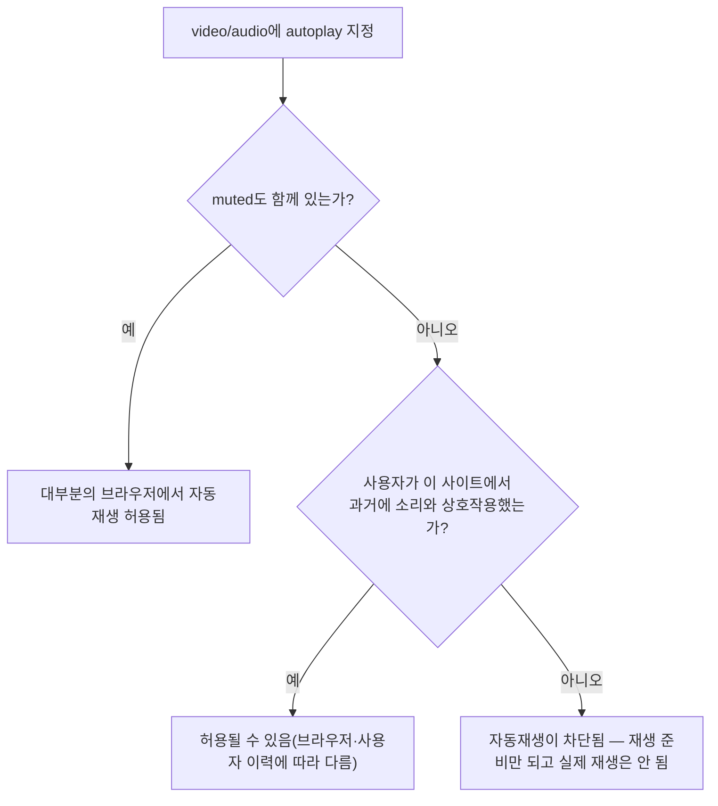

<Callout type="info">
  **이번 문서의 목표:** 이 문서를 다 읽으면 `<video>`·`<audio>`의 재생 관련 속성이 브라우저의 자동재생 정책과 어떻게 맞물리는지 설명하고, `<track>`의 `kind`를 구분해 청각·시각 접근성을 모두 갖춘 미디어 요소를 작성할 수 있게 됩니다.
</Callout>

## 왜 미디어 요소에 접근성을 따로 챙겨야 하는가

이미지는 `alt` 하나로 대체 텍스트를 제공하면 되지만, 영상과 오디오는 **시간에 따라 계속 바뀌는 콘텐츠**입니다. 소리를 못 듣는 사람에게는 자막이, 화면을 못 보는 사람에게는 화면 속 상황을 설명하는 음성 해설이, 소리를 켤 수 없는 환경(사무실, 대중교통)의 사람에게도 자막이 필요합니다. `<video>`와 `<audio>`는 이 각각의 요구를 서로 다른 속성과 자식 요소로 나눠 처리합니다.

## 1. `<video>`와 `<audio>`의 기본 재생 속성

### 정의

```html
<video src="lecture.mp4" controls width="640" height="360">
  브라우저가 video 요소를 지원하지 않습니다.
</video>

<audio src="podcast.mp3" controls></audio>
```

| 속성 | 의미 | 접근성·UX 관점 |
|------|------|------------------|
| `controls` | 재생/일시정지·볼륨·탐색 막대 등 브라우저 기본 UI를 표시 | 키보드로도 조작 가능한 기본 UI를 공짜로 얻는다. 커스텀 UI를 만들려면 이 접근성을 직접 구현해야 하는 부담을 진다 |
| `autoplay` | 페이지 로드 시 자동 재생 시도 | 사용자 동의 없이 소리가 나면 방해가 되므로 브라우저가 강하게 제한한다(아래 참고) |
| `loop` | 끝나면 처음부터 반복 | 반복 재생임을 사용자가 인지할 수 있게 UI로도 알리는 것이 좋다 |
| `muted` | 음소거 상태로 시작 | `autoplay`와 짝을 이루는 핵심 속성(아래 참고) |
| `poster`(video 전용) | 재생 전 보여줄 정지 이미지 | 영상이 로드되기 전에도 내용을 짐작할 수 있게 함 |

`<video>`와 `<audio>` 안에 넣은 텍스트(위 예시의 "브라우저가 video 요소를 지원하지 않습니다")는 **요소 자체를 모르는 아주 오래된 브라우저**를 위한 폴백 콘텐츠입니다. 지원하는 브라우저에서는 무시됩니다.

## 2. 자동재생 정책 — `autoplay`는 왜 `muted` 없이 거의 항상 막히는가

### 왜 필요한가

소리가 갑자기 나오는 웹페이지는 사용자 경험을 크게 해칩니다. 시끄러운 광고, 예상 못 한 배경음악이 대표적인 불만 사례였습니다. 그래서 주요 브라우저는 **자동재생 정책**(autoplay policy)이라는 규칙을 두어, 사용자가 명시적으로 허락하지 않은 소리 있는 자동재생을 차단합니다.

### 규칙



> **쉽게 말하면:** 브라우저는 "손님이 부탁하지도 않았는데 마음대로 소리를 트는 것"을 막습니다. 다만 "소리를 꺼놓고 트는 것"(`muted`)은 방해가 안 되니 대체로 허용합니다.

```html
<!-- 대체로 허용됨: 소리 없이 자동재생 -->
<video src="background-loop.mp4" autoplay muted loop playsinline></video>

<!-- 대부분 차단됨: 소리 있는 자동재생 -->
<video src="ad.mp4" autoplay></video>
```

`playsinline`은 모바일 브라우저에서 영상을 전체 화면으로 강제 전환하지 않고 페이지 안에서 그대로 재생하게 하는 속성으로, 배경 영상처럼 페이지에 자연스럽게 녹아들어야 하는 경우 `muted`·`autoplay`와 함께 자주 묶입니다.

<Callout type="warning">
  **자주 틀리는 점:** "`autoplay`를 넣었는데 재생이 안 된다"는 버그가 아니라 **정책상 정상 동작**인 경우가 대부분입니다. `muted`를 빠뜨렸거나, 사용자가 아직 그 페이지와 아무 상호작용(클릭·탭)을 하지 않았을 때 흔히 발생합니다. 정확한 조건은 브라우저마다 조금씩 다르므로 단정적인 수치를 외우기보다, 소리가 있는 미디어는 사용자의 명시적 재생 버튼 클릭을 트리거로 삼는 설계가 가장 안전합니다.
</Callout>

## 3. `<track>` — 시간에 따라 흐르는 텍스트를 붙이기

### 정의

`<track>`은 `<video>`(그리고 일부는 `<audio>`) 안에 넣는 자식 요소로, **시간 코드가 찍힌 텍스트 파일**을 영상에 동기화해서 붙입니다.

```html
<video src="lecture.mp4" controls>
  <track kind="captions" src="captions-ko.vtt" srclang="ko" label="한국어 자막" default />
  <track kind="subtitles" src="subtitles-en.vtt" srclang="en" label="English" />
  <track kind="descriptions" src="descriptions-ko.vtt" srclang="ko" label="화면 해설" />
</video>
```

### `kind`로 구분하는 트랙의 성격

| `kind` 값 | 의미 | 대상 |
|-----------|------|------|
| `subtitles`(자막) | 대사를 다른 언어로 번역한 텍스트. 소리는 들리지만 언어를 모르는 시청자를 위함 | 외국어 영상을 보는 시청자 |
| `captions`(캡션) | 대사뿐 아니라 효과음·화자 표시("[문 닫히는 소리]", "민수:")까지 포함한 텍스트 | 청각 장애가 있거나 소리를 켤 수 없는 시청자 |
| `descriptions`(음성 해설용 텍스트) | 화면에서 벌어지는 시각적 상황을 설명하는 텍스트(보통 별도 음성 합성이나 오디오 트랙과 짝지어 사용) | 시각 장애가 있는 시청자 |
| `chapters`(챕터) | 탐색 메뉴에 쓰이는 챕터 제목들 | 긴 영상의 탐색 UI |
| `metadata`(메타데이터) | 화면에 보이지 않고 스크립트가 읽는 용도의 데이터 | 개발자용, 자막처럼 표시되지 않음 |

`subtitles`와 `captions`를 같은 것으로 혼동하기 쉬운데, **전제가 다릅니다.** `subtitles`는 "소리는 들리지만 언어가 다름"을, `captions`는 "소리 자체를 못 듣거나 켤 수 없음"을 전제합니다. 그래서 캡션에는 대사 외에 효과음과 화자 이름까지 들어갑니다.

<Callout type="warning">
  **자주 틀리는 점:** 자막·캡션 파일을 하나만 넣고 "번역까지 됐으니 접근성은 끝났다"고 여기는 경우가 많습니다. 청각 장애인을 위한 캡션과 외국어 시청자를 위한 자막은 **목적과 내용이 다른 별개의 트랙**입니다. 완전한 접근성을 갖추려면 둘 다 고려해야 합니다.
</Callout>

### WebVTT — 트랙 파일의 형식

`<track>`의 `src`가 가리키는 파일은 보통 **WebVTT**(Web Video Text Tracks, 웹 비디오 텍스트 트랙) 형식이며 확장자는 `.vtt`입니다. 시간 구간과 텍스트를 짝지은 간단한 텍스트 파일입니다.

```
WEBVTT

00:00:01.000 --> 00:00:04.000
안녕하세요. 오늘은 HTML의 미디어 요소를 다룹니다.

00:00:04.500 --> 00:00:08.000
video와 audio, 그리고 track 요소를 살펴보겠습니다.
```

첫 줄은 반드시 `WEBVTT`로 시작해야 하며, 그 아래는 `시작시간 --> 종료시간` 형식의 시간 구간마다 표시할 텍스트를 적습니다.

### 직접 확인하기

<CodePlayground
  template="static"
  activeFile="/captions-ko.vtt"
  label="video에 자막 트랙을 붙이고 default 자막이 자동 표시되는지 확인하기"
  files={{
    '/index.html': `<main>
  <h1>track 실습</h1>
  <p>재생 버튼을 누르면 자막이 함께 표시됩니다. 우측 하단 CC 버튼으로 껐다 켤 수 있습니다.</p>
  <video controls width="480" muted>
    <source src="https://www.w3schools.com/html/mov_bbb.mp4" type="video/mp4" />
    <track kind="captions" src="captions-ko.vtt" srclang="ko" label="한국어 캡션" default />
    이 브라우저는 video 요소를 지원하지 않습니다.
  </video>
</main>`,
    '/styles.css': `body { font-family: system-ui, sans-serif; padding: 1rem; }
video { max-width: 100%; border-radius: 8px; }`,
    '/captions-ko.vtt': `WEBVTT

00:00:00.000 --> 00:00:03.000
[잔잔한 배경음악]

00:00:03.000 --> 00:00:07.000
토끼가 들판을 뛰어다니고 있습니다.

00:00:07.000 --> 00:00:10.000
[새 지저귀는 소리]`,
  }}
/>

`default` 속성이 붙은 트랙 하나는 별도 조작 없이 처음부터 켜져 있습니다. 트랙이 여러 개일 때 `default`는 **한 트랙에만** 붙이는 것이 원칙입니다.

## 4. 접근성 — 키보드와 스크린 리더 관점

`controls`가 제공하는 브라우저 기본 재생 UI는 `Tab` 키로 각 버튼(재생, 볼륨, 진행 막대, 자막 켜기)에 순서대로 도달할 수 있고, 스페이스바로 재생/일시정지가 가능하도록 이미 구현되어 있습니다. 커스텀 재생 버튼·진행 막대를 직접 만드는 순간 이 모든 키보드 동작을 **직접 다시 구현해야 하는 책임**이 생깁니다. 특별한 디자인 요구가 없다면 기본 `controls`를 쓰는 것이 접근성 측면에서 가장 안전한 선택입니다.

`autoplay`가 걸린 배경 영상이라도 시각 장애가 있는 사용자에게는 스크린 리더가 그 존재를 알려줄 수단이 필요합니다. `<video>`에 의미 있는 정보가 있다면 근처에 텍스트로도 맥락을 제공하거나, 순수 장식용이라면 스크린 리더가 건너뛰도록 처리하는 것이 좋습니다.

## 핵심 정리

- `controls`는 키보드 접근이 가능한 기본 재생 UI를 제공한다. 직접 만들면 그 접근성까지 직접 구현해야 한다.
- 소리 있는 `autoplay`는 대부분 차단된다. 자동재생이 필요하면 `muted`(그리고 모바일에서는 `playsinline`)를 함께 지정해야 하며, 정확한 허용 조건은 브라우저·사용자 이력에 따라 달라 단정할 수 없다.
- `<track>`의 `kind`는 `subtitles`(언어 번역), `captions`(효과음·화자 포함 청각 대체), `descriptions`(시각 정보의 음성/텍스트 설명), `chapters`, `metadata`로 목적이 다르다.
- 자막 파일은 보통 WebVTT(`.vtt`) 형식이며, `시작시간 --> 종료시간` 구간마다 텍스트를 적는다.
- 완전한 미디어 접근성은 캡션과 다국어 자막을 모두 갖추는 것이며, 하나만 있다고 나머지를 대체하지 않는다.

## 마무리 복습

<Quiz
  questionNumber={1}
  question="controls 속성 대신 재생·일시정지 버튼을 직접 커스텀 UI로 만들었을 때 개발자가 새로 책임져야 하는 것은?"
  options={['영상 파일의 인코딩 형식 변환', '키보드 조작과 스크린 리더 접근성을 처음부터 직접 구현하는 것', '자동재생 정책을 브라우저 대신 직접 검사하는 것', '영상 파일의 압축률 최적화']}
  correctAnswer={2}
  explanation="브라우저 기본 controls UI는 키보드 탐색과 접근성이 이미 구현되어 있다. 이를 대체하는 커스텀 UI를 만들면 그 접근성을 개발자가 직접 다시 구현해야 한다."
  optionExplanations={['인코딩 형식은 controls 여부와 무관하다', '정답 — 기본 UI가 제공하던 접근성을 스스로 구현해야 한다', '자동재생 정책은 브라우저가 여전히 자체적으로 판단한다', '압축률은 controls 여부와 무관하다']}
/>

<Quiz
  questionNumber={2}
  question="다음 중 자동재생이 가장 허용되기 쉬운 조합은?"
  options={['autoplay만 지정', 'autoplay와 muted를 함께 지정', 'loop만 지정', 'controls와 autoplay만 지정']}
  correctAnswer={2}
  explanation="소리가 없는 자동재생은 사용자 방해가 적어 대부분의 브라우저가 허용한다. 소리가 있는 autoplay는 사용자 상호작용 이력 등 조건이 없으면 대체로 차단된다."
  optionExplanations={['소리가 있는 자동재생은 대체로 차단된다', '정답 — muted가 함께 있으면 대부분 허용된다', 'loop는 자동재생 여부와 무관한 속성이다', 'controls 유무는 자동재생 허용 여부와 직접 관련이 없다']}
/>

<Quiz
  questionNumber={3}
  question="subtitles와 captions의 근본적인 차이는?"
  options={['subtitles는 영상에, captions는 오디오에만 사용된다', 'subtitles는 언어가 다른 시청자를 위한 대사 번역이고, captions는 소리를 들을 수 없는 시청자를 위해 효과음과 화자까지 포함한다', '둘은 완전히 동일하며 이름만 다르다', 'captions는 스크립트에서만 읽을 수 있고 화면에는 표시되지 않는다']}
  correctAnswer={2}
  explanation="subtitles는 소리는 들리지만 언어를 모르는 경우를 전제하고 대사만 번역한다. captions는 소리 자체를 못 듣거나 켤 수 없는 경우를 전제하므로 효과음, 화자 표시까지 포함한다."
  optionExplanations={['둘 다 video 요소에 사용되며 대상 매체로 구분되지 않는다', '정답 — 전제하는 상황과 포함 내용이 다르다', '목적과 포함 내용이 서로 다르다', '이는 metadata 트랙에 대한 설명이다']}
/>

<Quiz
  questionNumber={4}
  question="track 요소의 src가 가리키는 파일 형식으로 널리 쓰이는 것은?"
  options={['JSON', 'WebVTT(.vtt)', 'CSV', 'YAML']}
  correctAnswer={2}
  explanation="track 요소의 자막·캡션 파일은 보통 WebVTT 형식이며, WEBVTT로 시작해 시작시간에서 종료시간까지의 구간마다 텍스트를 적는 간단한 텍스트 형식이다."
  optionExplanations={['JSON은 자막 트랙의 표준 형식이 아니다', '정답 — track의 src에 쓰이는 표준적인 자막 형식이다', 'CSV는 자막 트랙 형식으로 쓰이지 않는다', 'YAML은 자막 트랙 형식으로 쓰이지 않는다']}
/>

<Quiz
  questionNumber={5}
  question="descriptions 트랙의 용도로 가장 알맞은 것은?"
  options={['긴 영상의 탐색 메뉴에 쓰일 챕터 제목을 제공한다', '화면에서 벌어지는 시각적 상황을 설명해 시각 장애가 있는 시청자를 돕는다', '스크립트에서만 읽는 비표시 데이터를 담는다', '다른 언어로 번역된 대사만 담는다']}
  correctAnswer={2}
  explanation="descriptions는 화면 속 시각 정보를 텍스트나 음성으로 설명해 화면을 볼 수 없는 시청자에게 상황을 전달하는 용도다."
  optionExplanations={['이는 chapters 트랙의 용도다', '정답 — 시각 정보를 설명하는 트랙이다', '이는 metadata 트랙의 용도다', '이는 subtitles 트랙의 용도다']}
/>

<Quiz
  questionNumber={6}
  question="한 video 안에 여러 track을 넣을 때 default 속성에 대한 설명으로 옳은 것은?"
  options={['모든 track에 default를 붙여야 정상 동작한다', '어떤 track에도 default를 붙이면 안 된다', '한 트랙에만 default를 붙여 처음부터 활성화되게 하는 것이 원칙이다', 'default는 kind가 captions인 트랙에만 적용 가능하다']}
  correctAnswer={3}
  explanation="default는 여러 트랙 중 페이지 로드 시 자동으로 켜질 하나를 지정하는 속성이며, 원칙적으로 한 트랙에만 붙인다."
  optionExplanations={['여러 개에 붙이면 어느 것이 우선인지 모호해진다', '기본 활성 트랙을 지정할 필요가 있을 때 사용한다', '정답 — 한 트랙에만 지정하는 것이 원칙이다', 'default는 kind와 무관하게 어떤 트랙에도 지정할 수 있다']}
/>

## 참고 자료

- [MDN — `<video>` / `<track>`](https://developer.mozilla.org/en-US/docs/Web/HTML/Reference/Elements/track)
