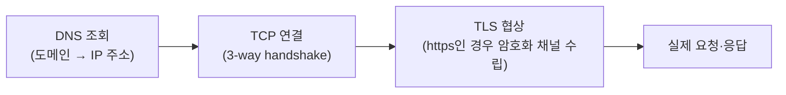
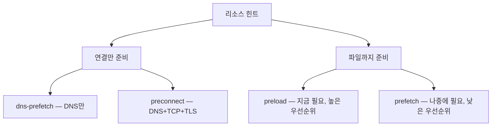

<Callout type="info">
  **이번 문서의 목표:** 이 문서를 다 읽으면 `preconnect`·`dns-prefetch`·`preload`·`prefetch` 네 가지 리소스 힌트(resource hint)의 역할 차이를 구분하고, `as` 속성의 의미와 힌트를 과도하게 쓸 때 생기는 역효과를 설명할 수 있게 됩니다.
</Callout>

## 왜 필요한가 — 브라우저는 미래를 모른다

브라우저는 HTML 문서를 위에서부터 읽으며 그때그때 발견하는 태그를 보고서야 이미지·스크립트·폰트를 요청합니다. 그런데 개발자는 이미 알고 있는 정보가 있습니다 — "이 페이지는 곧 `api.example.com`에 요청을 보낼 것이다", "이 폰트 파일은 텍스트가 그려지려면 반드시 필요하다", "사용자가 다음에 누를 버튼은 십중팔구 이 페이지로 이동한다" 같은 것들입니다.

**리소스 힌트**(resource hint)는 이렇게 개발자가 미리 아는 정보를 `<link>` 태그로 브라우저에 귀띔해서, 브라우저가 실제로 그 태그를 만나기 **전에** 미리 준비를 시작하게 만드는 장치입니다.

> **쉽게 말하면:** 리소스 힌트는 식당에 전화로 "우리 이제 출발하니 물 좀 미리 받아두세요"라고 알려주는 것입니다. 도착해서 자리에 앉은 뒤에야 주문하면 그만큼 늦습니다.

## 1. 연결만 미리 여는 힌트 — `preconnect`와 `dns-prefetch`

### 네트워크 연결의 세 단계

다른 서버로 요청을 보내기 전에는 항상 세 단계가 필요합니다.



이 세 단계 각각이 왕복 시간(RTT, Round Trip Time)을 소모합니다. `preconnect`와 `dns-prefetch`는 이 단계를 **실제 요청이 필요해지기 전에** 미리 끝내 둡니다.

### `dns-prefetch` — 도메인 이름만 미리 풀어두기

```html
<link rel="dns-prefetch" href="//cdn.example.com" />
```

DNS 조회, 즉 위 그림의 첫 단계만 미리 해둡니다. 가장 가볍고, 브라우저 지원 폭도 가장 넓습니다.

### `preconnect` — 연결 전체를 미리 맺기

```html
<link rel="preconnect" href="https://fonts.gstatic.com" crossorigin />
```

DNS 조회부터 TCP 연결, (https라면) TLS 협상까지 **전체**를 미리 끝내 둡니다. `dns-prefetch`보다 훨씬 큰 이득을 주지만, 그만큼 브라우저 자원(소켓, 메모리)도 더 씁니다.

<Callout type="warning">
  **자주 틀리는 점:** 폰트 파일처럼 CORS(Cross-Origin Resource Sharing, 교차 출처 자원 공유) 모드로 요청되는 자원에 `preconnect`를 걸 때 `crossorigin` 속성을 빠뜨리면, 연결은 미리 열리지만 **실제 요청 때 다른 연결 모드가 필요해 새 연결을 다시 맺는** 낭비가 생깁니다. CORS로 요청될 자원의 오리진에는 `crossorigin`을 함께 씁니다.
</Callout>

### 오남용의 위험 — 왜 몇 개만 골라야 하는가

```html
<!-- 나쁜 예: 페이지에 등장하는 모든 외부 도메인에 preconnect -->
<link rel="preconnect" href="https://a.example.com" />
<link rel="preconnect" href="https://b.example.com" />
<link rel="preconnect" href="https://c.example.com" />
<link rel="preconnect" href="https://d.example.com" />
<link rel="preconnect" href="https://e.example.com" />
```

브라우저가 동시에 열어둘 수 있는 연결 수는 무한하지 않습니다. `preconnect`를 여러 오리진에 남발하면, 정작 열어놓은 연결들이 실제로 곧 쓰이지 않을 때 **CPU와 메모리만 낭비하고 정작 중요한 연결의 순위를 밀어내는** 역효과가 납니다. 실무 원칙은 "정말 이 페이지 로드 초반에 곧바로 쓰일 것이 확실한 오리진 몇 개(보통 2~4개 이내)"로 제한하는 것입니다.

## 2. 실제 자원까지 미리 받는 힌트 — `preload`와 `prefetch`

`preconnect`/`dns-prefetch`가 "길만 뚫어놓는" 힌트였다면, `preload`와 `prefetch`는 **파일 자체를 미리 내려받습니다.**

### `preload` — 지금 이 페이지에 반드시 필요한 자원을 앞당기기

```html
<link rel="preload" href="/fonts/brand.woff2" as="font" type="font/woff2" crossorigin />
<link rel="preload" href="/hero.jpg" as="image" fetchpriority="high" />
```

`preload`는 "이 페이지가 렌더링되려면 어차피 곧 필요한데, 브라우저가 스스로 발견하는 시점이 너무 늦은 자원"에 씁니다. 대표적인 예가 CSS 파일 안에서 `@font-face`로 지정된 폰트입니다 — 브라우저는 CSS를 다 해석해야 그 폰트가 필요한 걸 알게 되는데, `preload`로 미리 알려주면 CSS 해석과 동시에 폰트 다운로드가 시작됩니다.

### `prefetch` — 다음에 필요할 가능성이 큰 자원을 낮은 우선순위로

```html
<link rel="prefetch" href="/next-page.html" as="document" />
```

`prefetch`는 "지금 이 페이지에는 필요 없지만, 사용자가 다음에 이동할 가능성이 큰 페이지의 자원"에 씁니다. 예를 들어 장바구니 페이지에서 다음 단계인 결제 페이지의 스크립트를 미리 받아두는 식입니다. 브라우저 여유 대역폭이 있을 때만, 낮은 우선순위로 처리됩니다.

### `preload` vs `prefetch` 비교

| 구분 | `preload` | `prefetch` |
|------|-----------|------------|
| 대상 | **지금** 이 페이지 렌더링에 필요한 자원 | **다음**에 필요할 가능성이 있는 자원 |
| 우선순위 | 높음 — 거의 즉시 다운로드 시작 | 낮음 — 여유 대역폭이 있을 때 |
| 안 쓰이면 | 브라우저가 콘솔에 경고를 띄울 수 있음("preload했지만 몇 초 안에 쓰이지 않았다") | 상대적으로 페널티가 적음(애초에 낮은 우선순위이므로) |
| 대표 예시 | LCP 이미지, `@font-face` 폰트, 렌더링 차단 스크립트 | 다음 페이지 이동, 예측 가능한 다음 동작의 자원 |

### `as` 속성 — 무엇으로 쓰일지 미리 알려주기

`preload`(그리고 `prefetch`의 문서 자원)에는 `as` 속성으로 그 자원이 **어떤 종류로 쓰일지**를 함께 알려줘야 합니다.

```html
<link rel="preload" href="/app.css" as="style" />
<link rel="preload" href="/app.js" as="script" />
<link rel="preload" href="/hero.jpg" as="image" />
<link rel="preload" href="/brand.woff2" as="font" crossorigin />
```

`as`가 중요한 이유는 두 가지입니다. 첫째, 브라우저가 **올바른 요청 우선순위**를 매기는 데 씁니다(폰트와 이미지는 우선순위 기준이 다릅니다). 둘째, **같은 URL이라도 용도가 다르면 브라우저는 다른 캐시 항목으로 취급**하기 때문에, `as`가 실제 사용 시점의 요청과 일치하지 않으면 미리 받아둔 파일이 버려지고 중복으로 다시 받는 낭비가 생깁니다.

<Callout type="warning">
  **자주 틀리는 점:** `as="font"`로 `preload`한 폰트에 `crossorigin`을 빠뜨리는 실수가 매우 흔합니다. 웹 폰트는 same-origin(같은 오리진)이더라도 명세상 **항상 익명(anonymous) CORS 모드로 요청**되므로, `crossorigin` 속성이 없으면 `preload`로 받아둔 파일과 실제 `@font-face`가 요청하는 파일이 서로 다른 요청으로 취급되어 두 번 다운로드됩니다.
</Callout>

## 3. 네 가지 힌트 한눈에 비교

| 힌트 | 무엇을 미리 하는가 | 씀씀이 |
|------|---------------------|--------|
| `dns-prefetch` | 도메인 이름 조회만 | 가장 가볍다. 확실치 않은 서드파티 도메인이 여럿일 때 |
| `preconnect` | DNS+TCP+TLS 연결 전체 | `dns-prefetch`보다 무겁다. 확실히 곧 쓰일 오리진 2–4개 이내로 |
| `prefetch` | 실제 파일을 낮은 우선순위로 | 다음 내비게이션에 쓰일 자원 |
| `preload` | 실제 파일을 높은 우선순위로 | 지금 이 페이지 렌더링에 반드시 필요한데 발견이 늦는 자원 |



## 4. 브라우저별 처리 차이

리소스 힌트는 표준 문서상 **강제가 아니라 힌트**입니다. 브라우저는 이 힌트를 참고만 할 뿐, 내부 자원 사정(이미 열린 연결 수, 메모리 압박 등)에 따라 무시하거나 지연시킬 수 있습니다. 또한 브라우저마다 힌트를 처리하는 세부 우선순위 로직에 차이가 있다고 알려져 있어, "이 힌트를 걸면 항상 몇 밀리초 단축된다"처럼 단정적으로 말하기는 어렵습니다. 실무에서는 힌트를 건 뒤 실제 브라우저 개발자 도구의 네트워크 패널로 효과를 직접 확인하는 것이 정확합니다.

## 핵심 정리

- 리소스 힌트는 브라우저가 태그를 실제로 만나기 전에 연결이나 파일 다운로드를 앞당기게 하는 `<link>` 기반 귀띔이다.
- `dns-prefetch`는 도메인 이름 조회만, `preconnect`는 DNS+TCP+TLS 연결 전체를 미리 맺는다 — 후자가 더 강력하지만 더 비싸다.
- `preload`는 지금 이 페이지에 반드시 필요한데 브라우저가 늦게 발견하는 자원에, `prefetch`는 다음에 필요할 가능성이 있는 자원에 낮은 우선순위로 쓴다.
- `as` 속성은 우선순위 판단과 캐시 매칭에 쓰이며, 실제 사용 시점의 요청과 일치하지 않으면 중복 다운로드가 발생한다. 폰트에는 `crossorigin`을 함께 잊지 않는다.
- 모든 리소스 힌트는 브라우저가 참고만 하는 힌트이지 강제가 아니며, 남발하면 오히려 자원을 낭비해 역효과가 난다.

## 마무리 복습

<Quiz
  questionNumber={1}
  question="preconnect가 dns-prefetch보다 더 강력하지만 더 비싼 이유는?"
  options={['preconnect는 파일까지 전부 내려받기 때문이다', 'preconnect는 DNS 조회뿐 아니라 TCP 연결과 TLS 협상까지 전부 미리 끝내기 때문이다', 'preconnect는 여러 도메인을 동시에 처리하기 때문이다', 'dns-prefetch는 오래된 브라우저에서 지원되지 않기 때문이다']}
  correctAnswer={2}
  explanation="dns-prefetch는 도메인 이름 조회 한 단계만 미리 하지만, preconnect는 DNS 조회에 이어 TCP 연결과(https라면) TLS 협상까지 연결의 전 단계를 미리 완료해 둔다. 그만큼 더 많은 자원을 미리 소모한다."
  optionExplanations={['파일 다운로드는 preload나 prefetch의 역할이다', '정답 — 연결의 전 단계를 미리 완료하기 때문이다', '동시 처리 여부는 이 둘의 차이가 아니다', 'dns-prefetch도 지원 폭이 넓은 편이다']}
/>

<Quiz
  questionNumber={2}
  question="preload와 prefetch의 핵심 차이로 가장 알맞은 것은?"
  options={['preload는 이미지 전용, prefetch는 스크립트 전용이다', 'preload는 지금 이 페이지에 필요한 자원을 높은 우선순위로, prefetch는 다음에 필요할 자원을 낮은 우선순위로 받는다', 'prefetch가 preload보다 항상 더 빠르다', 'preload는 as 속성이 필요 없다']}
  correctAnswer={2}
  explanation="preload는 현재 페이지 렌더링에 필요한데 브라우저가 늦게 발견하는 자원을 높은 우선순위로 당겨오고, prefetch는 다음 내비게이션에서 쓰일 가능성이 있는 자원을 낮은 우선순위로 받는다."
  optionExplanations={['둘 다 특정 파일 종류에 국한되지 않는다', '정답 — 시점과 우선순위 모두 다르다', '우선순위가 더 높은 것은 preload다', 'preload는 as 속성으로 용도를 명시해야 한다']}
/>

<Quiz
  questionNumber={3}
  question="preload로 폰트 파일을 미리 받았는데 실제 렌더링 시점에 다시 다운로드되는 흔한 원인은?"
  options={['as 속성에 style을 지정해서', 'crossorigin 속성을 빠뜨려서 preload 요청과 실제 요청의 모드가 달라졌기 때문', '폰트 파일 확장자가 woff2라서', 'preload를 head가 아닌 body에 넣어서']}
  correctAnswer={2}
  explanation="웹 폰트는 same-origin이라도 명세상 항상 익명 CORS 모드로 요청된다. preload 태그에 crossorigin을 빠뜨리면 preload 요청과 실제 @font-face 요청의 모드가 달라져 서로 다른 캐시 항목으로 취급되어 두 번 받게 된다."
  optionExplanations={['폰트에는 as=font를 써야 하며, style은 CSS 파일용이다', '정답 — CORS 모드 불일치가 중복 다운로드의 흔한 원인이다', '확장자 자체는 이 문제의 원인이 아니다', '위치보다 crossorigin 누락이 실제 원인이다']}
/>

<Quiz
  questionNumber={4}
  question="페이지에 등장하는 모든 외부 도메인에 preconnect를 거는 것이 권장되지 않는 이유는?"
  options={['preconnect는 도메인을 하나만 지원하기 때문이다', '동시에 열 수 있는 연결 자원이 한정되어 있어 남발하면 정작 중요한 연결의 순위를 밀어내기 때문이다', 'preconnect는 https 사이트에서 사용할 수 없기 때문이다', '브라우저가 두 개 이상의 preconnect를 아예 무시하기 때문이다']}
  correctAnswer={2}
  explanation="연결을 미리 맺는 데도 브라우저의 소켓·메모리 자원이 든다. 확실히 곧 쓰일 오리진 소수에만 적용해야 하며, 남발하면 자원을 낭비하고 중요한 연결의 우선순위를 밀어낼 수 있다."
  optionExplanations={['여러 도메인 각각에 preconnect를 걸 수 있다', '정답 — 연결 자원 낭비와 우선순위 역전이 문제다', 'https 사이트에서도 정상적으로 쓰인다', '그런 개수 제한 무시 규칙은 없다']}
/>

<Quiz
  questionNumber={5}
  question="리소스 힌트의 실제 처리에 대한 설명으로 가장 정확한 것은?"
  options={['모든 브라우저가 힌트를 100% 동일하게, 반드시 지정된 순서대로 처리한다', '힌트는 강제가 아니라 참고 신호이며, 브라우저 자원 사정에 따라 무시되거나 지연될 수 있다', '힌트를 걸면 항상 정확히 몇 밀리초가 단축된다고 명세에 수치로 규정되어 있다', '리소스 힌트는 HTTP 헤더로만 지정할 수 있고 태그로는 불가능하다']}
  correctAnswer={2}
  explanation="리소스 힌트는 브라우저에게 참고가 되는 귀띔일 뿐 강제 규칙이 아니다. 브라우저마다 내부 처리 방식과 우선순위 로직에 차이가 있어 실제 효과는 개발자 도구로 직접 확인하는 것이 정확하다."
  optionExplanations={['브라우저마다 처리 방식에 차이가 있다고 알려져 있다', '정답 — 강제가 아닌 참고 신호다', '그런 고정 수치는 명세에 존재하지 않는다', 'link 태그로 지정하는 것이 일반적인 방식이다']}
/>

<Quiz
  questionNumber={6}
  question="preload로 받아온 자원이 몇 초 안에 실제로 쓰이지 않으면 흔히 일어나는 일은?"
  options={['브라우저가 자동으로 자원을 삭제하고 페이지를 새로고침한다', '브라우저가 콘솔에 경고를 띄울 수 있다', '해당 자원의 이후 모든 요청이 영구적으로 차단된다', '페이지의 다른 리소스 힌트가 모두 무효화된다']}
  correctAnswer={2}
  explanation="preload는 지금 곧 쓰일 것을 전제로 높은 우선순위로 자원을 받아오므로, 몇 초 안에 실제로 쓰이지 않으면 브라우저가 콘솔에 경고를 띄울 수 있다. prefetch는 애초에 우선순위가 낮아 이런 페널티가 상대적으로 적다."
  optionExplanations={['자원을 자동으로 삭제하거나 새로고침하는 동작은 없다', '정답 — 안 쓰이는 preload는 콘솔 경고로 이어질 수 있다', '영구 차단 같은 동작은 존재하지 않는다', '다른 힌트가 무효화되는 연쇄 효과는 없다']}
/>

<Quiz
  questionNumber={7}
  question="preload에 as 속성을 정확히 지정해야 하는 이유로 옳은 것은?"
  options={['as는 시각적 스타일을 지정하는 속성이기 때문이다', '올바른 요청 우선순위를 매기고, 실제 사용 시점의 요청과 캐시 항목을 일치시키기 위해서다', 'as가 없으면 브라우저가 파일을 아예 다운로드하지 않기 때문이다', 'as는 crossorigin을 대체하는 속성이기 때문이다']}
  correctAnswer={2}
  explanation="as 속성은 브라우저가 올바른 우선순위를 매기는 데 쓰이고, 같은 URL이라도 용도가 다르면 다른 캐시 항목으로 취급되므로 실제 사용 시점의 요청과 일치시켜야 중복 다운로드를 막을 수 있다."
  optionExplanations={['as는 스타일이 아니라 자원의 용도를 알리는 속성이다', '정답 — 우선순위 판단과 캐시 매칭 두 가지 이유 때문이다', 'as를 생략해도 다운로드 자체는 일어날 수 있다', 'as와 crossorigin은 서로 다른 목적을 가진 별개의 속성이다']}
/>

## 참고 자료

- [MDN — `fetchpriority` 속성](https://developer.mozilla.org/en-US/docs/Web/HTML/Reference/Attributes/fetchpriority)
- [MDN — `<link>` 요소 레퍼런스](https://developer.mozilla.org/en-US/docs/Web/HTML/Reference/Elements/link)
