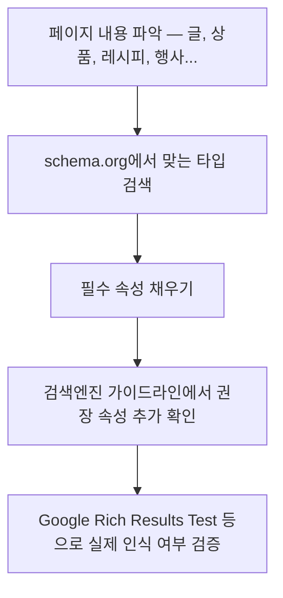

<Callout type="info">
  **이번 문서의 목표:** 이 문서를 다 읽으면 `<script type="application/ld+json">` 문법으로 페이지 내용을 검색엔진이 이해할 수 있는 구조로 표시하고, schema.org에서 어떤 어휘를 골라야 할지 판단하며, 이것이 검색 결과의 리치 스니펫(rich snippet)과 어떻게 연결되는지 설명할 수 있게 됩니다.
</Callout>

## 왜 필요한가 — 검색엔진은 페이지를 사람처럼 읽지 않는다

22편에서 다룬 Open Graph는 "메신저에 링크를 붙여넣을 때의 미리보기"를 위한 것이었습니다. 이번에는 또 다른 독자, **검색엔진**을 위한 메타데이터입니다.

사람은 레시피 페이지를 보면 조리 시간이 얼마인지, 별점이 몇 점인지 한눈에 파악합니다. 하지만 검색엔진의 크롤러는 `<p>재료 준비 시간은 약 15분입니다.</p>`라는 문장을 봐도 그 "15분"이 조리 시간을 뜻하는 숫자인지, 그냥 본문에 등장한 숫자인지 확신할 수 없습니다. HTML의 시맨틱 태그(`<article>`, `<time>` 등)가 어느 정도 힌트를 주지만, "이 값이 정확히 무슨 의미의 데이터인가"까지는 표현하지 못합니다.

**구조화 데이터**(structured data)는 이 모호함을 없애기 위해, 페이지 안의 정보를 검색엔진이 정확히 파싱할 수 있는 형식(공통 어휘 + 기계가 읽는 문법)으로 별도로 적어 두는 것입니다.

## 1. JSON-LD 문법 — 문서 안에 데이터 섬을 만든다

### 이름 풀어보기

**JSON-LD**는 **JSON**(JavaScript Object Notation, 자바스크립트 객체 표기법)에 **LD**(Linked Data, 연결된 데이터)를 붙인 이름입니다. JSON은 이미 익숙한 키-값 표기법이고, Linked Data는 "이 데이터가 어떤 어휘 체계를 따르는지"를 함께 표시해 서로 다른 사이트의 데이터끼리도 같은 뜻으로 연결해서 읽을 수 있게 하는 개념입니다.

HTML 문서 안에 JSON-LD를 넣는 방법은 `<script type="application/ld+json">` 요소 하나입니다.

```html
<script type="application/ld+json">
{
  "@context": "https://schema.org",
  "@type": "Recipe",
  "name": "김치볶음밥",
  "totalTime": "PT15M",
  "recipeIngredient": ["밥 2공기", "김치 1컵", "식용유 1큰술"],
  "aggregateRating": {
    "@type": "AggregateRating",
    "ratingValue": "4.6",
    "ratingCount": "128"
  }
}
</script>
```

| 필드 | 뜻 |
|------|----|
| `@context` | 이 JSON이 어떤 어휘 사전을 따르는지 선언. 거의 항상 `https://schema.org`를 씀 |
| `@type` | 이 데이터 덩어리가 표현하는 대상의 종류(`Recipe`, `Article`, `Product` 등) |
| 나머지 키 | `@type`이 정의한 어휘에서 허용하는 속성 이름들 |

이 `<script>` 요소는 **화면에 아무것도 렌더링하지 않습니다.** 브라우저는 `type` 속성이 알려진 스크립트 타입(`text/javascript`, `module` 등)이 아니면 실행하지 않고 그냥 데이터 덩어리로 무시하는데, `application/ld+json`이 정확히 그런 경우입니다. 검색엔진 크롤러만 이 내용을 파싱해서 읽어 갑니다.

> **쉽게 말하면:** JSON-LD 블록은 화면에는 안 보이지만 문서 한쪽에 붙여 둔 "검색엔진 전용 요약 카드"입니다.

### 마이크로데이터·RDFa와의 관계 — 왜 JSON-LD가 대세인가

구조화 데이터를 표시하는 방법은 원래 세 가지였습니다. **마이크로데이터**(Microdata)와 **RDFa**는 `itemscope`, `itemprop`, `property` 같은 속성을 본문 태그에 직접 흩뿌리는 방식입니다. 이 방식은 본문 마크업과 데이터 마크업이 뒤섞여 유지보수가 번거롭고, 본문 구조를 바꿀 때 데이터까지 같이 깨지기 쉽습니다.

JSON-LD는 본문과 완전히 분리된 `<script>` 블록 하나로 몰아 쓸 수 있어, 구글을 비롯한 주요 검색엔진이 권장하는 방식으로 자리 잡았습니다.

| 방식 | 위치 | 본문 마크업과의 관계 | 유지보수 |
|------|------|----------------------|----------|
| JSON-LD | `<script type="application/ld+json">` 한 블록 | 완전히 분리 | 쉬움 — 데이터만 따로 관리 |
| 마이크로데이터 | 본문 태그의 `itemscope`/`itemprop` 속성 | 본문에 섞임 | 본문 구조 변경 시 함께 깨지기 쉬움 |
| RDFa | 본문 태그의 `property`/`typeof` 속성 | 본문에 섞임 | 마이크로데이터와 비슷한 어려움 |

## 2. schema.org 어휘 고르는 법

**schema.org**는 구글·마이크로소프트·야후·얀덱스가 함께 만든 공용 어휘 사전으로, "이런 종류의 대상에는 이런 이름의 속성을 쓰자"는 약속을 웹 전체가 공유합니다. 종류(`@type`)를 잘못 고르면 검색엔진이 데이터를 아예 이해하지 못하거나 엉뚱하게 해석합니다.

고르는 절차는 다음과 같습니다.

1. **이 페이지가 무엇을 설명하는가**를 한 단어로 말해 봅니다 — 글(`Article`), 상품(`Product`), 레시피(`Recipe`), 행사(`Event`), 조직(`Organization`), 자주 묻는 질문(`FAQPage`) 등.
2. schema.org 사이트에서 그 타입 페이지를 찾아, **필수(required)** 로 표시된 속성을 먼저 채웁니다. 예를 들어 `Recipe`는 `name`, `image`, `recipeIngredient`, `recipeInstructions`가 검색 결과 노출에 중요합니다.
3. 검색엔진마다(구글 검색 센터 문서 등) 리치 스니펫을 띄우기 위한 **추가 권장 속성**이 있으므로, 실제로 노출하려는 검색엔진의 최신 가이드라인을 다시 확인합니다. schema.org 자체는 어휘 사전일 뿐, "이 속성을 채우면 리치 스니펫이 뜬다"는 보장까지 정의하지는 않습니다.



<Callout type="warning">
  **자주 틀리는 점:** `@type`을 실제 페이지 내용과 다르게 쓰거나, 화면에는 없는 정보(예: 가짜 별점)를 JSON-LD에만 적어 넣는 것은 검색엔진의 스팸 정책 위반입니다. 구조화 데이터는 **화면에 실제로 존재하는 정보를 기계가 읽기 좋은 형태로 다시 적는 것**이어야지, 화면에 없는 내용을 지어내는 자리가 아닙니다.
</Callout>

## 3. 리치 스니펫과의 관계 — 표시는 검색엔진의 판단

**리치 스니펫**(rich snippet)은 검색 결과 목록에서 별점·조리 시간·가격 같은 추가 정보가 파란 링크 밑에 붙어 나오는 것을 말합니다. 여기서 반드시 짚어야 할 인과관계가 있습니다.

- 구조화 데이터를 정확히 넣는 것은 리치 스니펫이 뜨기 위한 **필요조건**이지, **충분조건이 아닙니다.**
- 리치 스니펫을 실제로 보여줄지, 어떤 모양으로 보여줄지는 전적으로 검색엔진(구글 등)의 알고리즘 판단입니다. 문법을 완벽히 지켜도 표시되지 않을 수 있습니다.

| 구분 | Open Graph (22편) | JSON-LD 구조화 데이터 |
|------|--------------------|------------------------|
| 주 독자 | 메신저·소셜 플랫폼 크롤러 | 검색엔진 크롤러 |
| 목적 | 공유 카드의 제목·이미지 구성 | 페이지 의미를 기계가 이해하도록 표시 |
| 표시 보장 | 태그를 채우면 대체로 카드에 그대로 반영 | 채워도 리치 스니펫 노출은 검색엔진 판단에 달림 |
| 문법 | `<meta property="og:...">` | `<script type="application/ld+json">` |

## 값을 바꿔가며 구조 확인하기

<CodePlayground
  template="static"
  activeFile="/index.html"
  label="Recipe 타입 JSON-LD — @type과 속성 값을 바꿔보며 구조를 확인"
  files={{
    '/index.html': `<!DOCTYPE html>
<html lang="ko">
<head>
  <meta charset="UTF-8" />
  <title>김치볶음밥 레시피</title>
  <link rel="stylesheet" href="/styles.css" />
  <script type="application/ld+json">
  {
    "@context": "https://schema.org",
    "@type": "Recipe",
    "name": "김치볶음밥",
    "author": { "@type": "Person", "name": "제노" },
    "totalTime": "PT15M",
    "recipeIngredient": ["밥 2공기", "김치 1컵", "식용유 1큰술"],
    "recipeInstructions": [
      { "@type": "HowToStep", "text": "팬에 기름을 두르고 김치를 볶는다." },
      { "@type": "HowToStep", "text": "밥을 넣고 골고루 섞으며 볶는다." }
    ],
    "aggregateRating": {
      "@type": "AggregateRating",
      "ratingValue": "4.6",
      "ratingCount": "128"
    }
  }
  </script>
</head>
<body>
  <article>
    <h1>김치볶음밥</h1>
    <p>조리 시간: 약 15분 · 평점 4.6 (128명 참여)</p>
    <p>위 script 태그 안 JSON은 화면에 렌더링되지 않습니다. 검색엔진 전용 데이터입니다.</p>
    <ol>
      <li>팬에 기름을 두르고 김치를 볶는다.</li>
      <li>밥을 넣고 골고루 섞으며 볶는다.</li>
    </ol>
  </article>
</body>
</html>`,
    '/styles.css': `body { font-family: system-ui, sans-serif; padding: 24px; max-width: 480px; }
h1 { margin-bottom: 4px; }`,
  }}
/>

미리보기 화면에는 조리법 문단만 보이고 `<script>` 안의 JSON은 나타나지 않습니다. `totalTime`이나 `ratingValue` 값을 바꿔도 화면은 그대로지만, 검색엔진이 이 문서를 다시 읽으면 바뀐 값을 그대로 인식합니다. 실제로 검색엔진이 이 데이터를 어떻게 해석하는지는 구글 Rich Results Test 같은 검증 도구로 배포 후 확인하는 것이 정확합니다.

## 핵심 정리

- JSON-LD는 `<script type="application/ld+json">` 안에 `@context`(어휘 사전)와 `@type`(데이터 종류)을 포함한 JSON을 적어, 화면 렌더링 없이 검색엔진에게만 구조화된 의미를 전달하는 방식이다.
- 마이크로데이터·RDFa는 본문 태그에 속성을 흩뿌리는 방식이라 유지보수가 어렵고, JSON-LD는 데이터를 본문과 분리해 관리가 쉬워 주요 검색엔진의 권장 방식이 되었다.
- `@type`은 schema.org 어휘 사전에서 페이지 성격에 맞는 것을 고르고, 필수 속성을 먼저 채운 뒤 검색엔진별 가이드라인의 권장 속성을 확인한다.
- 구조화 데이터를 정확히 넣는 것은 리치 스니펫 노출의 필요조건일 뿐 충분조건이 아니다. 실제 노출 여부와 형태는 검색엔진의 판단이다. 화면에 없는 정보를 JSON-LD에만 지어내는 것은 스팸 정책 위반이다.

## 마무리 복습

<Quiz
  questionNumber={1}
  question="JSON-LD 구조화 데이터를 HTML 문서에 삽입하는 표준 방식은?"
  options={['본문 태그에 itemscope, itemprop 속성을 직접 붙인다', 'script 요소에 type="application/ld+json"을 지정하고 그 안에 JSON을 작성한다', 'meta 요소에 property="og:data"를 지정해 사용한다', 'CSS 파일 안에 데이터를 주석으로 남긴다']}
  correctAnswer={2}
  explanation="JSON-LD는 script 요소에 type을 application/ld+json으로 지정한 블록 하나로, 본문과 분리해 삽입하는 방식이다. itemscope와 itemprop 속성은 마이크로데이터 방식이다."
  optionExplanations={['이것은 마이크로데이터 방식이며 본문에 속성이 섞인다', '정답 — JSON-LD의 표준 삽입 방식이다', 'og:data라는 표준 Open Graph 속성은 존재하지 않는다', 'CSS 주석은 검색엔진이 구조화 데이터로 인식하지 않는다']}
/>

<Quiz
  questionNumber={2}
  question="script 요소의 type을 application/ld+json으로 지정했을 때, 그 안의 내용이 브라우저 화면에 렌더링되지 않는 이유는?"
  options={['CSS로 숨김 처리가 되어 있기 때문이다', '브라우저가 알려진 실행 가능 스크립트 타입이 아니면 내용을 화면에 그리지 않고 무시하기 때문이다', '자바스크립트 오류가 발생해 실행이 중단되기 때문이다', '검색엔진이 서버에서 미리 제거하기 때문이다']}
  correctAnswer={2}
  explanation="application/ld+json은 브라우저가 실행하는 스크립트 타입이 아니라서, 화면에 그리지도 실행하지도 않고 데이터 블록으로만 취급한다. 검색엔진 크롤러만 이 내용을 파싱한다."
  optionExplanations={['CSS 숨김 처리와는 무관하다', '정답 — 알려진 스크립트 타입이 아니므로 브라우저가 무시한다', '오류로 중단되는 것이 아니라 애초에 실행 대상이 아니다', '서버가 제거하지 않으며 그대로 클라이언트에 전달된다']}
/>

<Quiz
  questionNumber={3}
  question="@context 필드가 하는 역할은?"
  options={['이 데이터 덩어리가 표현하는 대상의 종류를 지정한다', '이 JSON이 따르는 어휘 사전(주로 schema.org)을 선언한다', '검색엔진에게 리치 스니펫을 강제로 표시하라고 지시한다', '페이지의 언어(lang) 속성을 지정한다']}
  correctAnswer={2}
  explanation="@context는 이 JSON 데이터가 어떤 어휘 체계를 따르는지 선언하는 필드로, 거의 항상 schema.org 주소를 값으로 쓴다. 대상의 종류는 @type이 담당한다."
  optionExplanations={['그 역할은 @type이 담당한다', '정답 — 어휘 사전을 선언하는 필드다', '검색엔진의 표시 여부를 강제하는 필드는 존재하지 않는다', 'lang 속성과는 무관한 필드다']}
/>

<Quiz
  questionNumber={4}
  question="마이크로데이터·RDFa와 비교했을 때 JSON-LD의 장점으로 가장 알맞은 것은?"
  options={['검색엔진이 JSON-LD만 인식하고 나머지는 완전히 무시한다', '본문 마크업과 데이터가 분리되어 있어 유지보수가 쉽다', 'JSON-LD는 CSS 없이도 화면에 자동으로 예쁘게 표시된다', 'JSON-LD는 schema.org 외의 임의 어휘를 허용하지 않는다는 점에서 더 엄격하다']}
  correctAnswer={2}
  explanation="JSON-LD는 하나의 script 블록에 데이터를 몰아 쓸 수 있어 본문 구조 변경과 무관하게 유지보수하기 쉽다는 것이 가장 큰 실무적 장점이다."
  optionExplanations={['세 방식 모두 여러 검색엔진이 지원한다', '정답 — 본문과 데이터의 분리가 핵심 장점이다', '화면 렌더링과는 무관한 데이터 블록이다', '어휘 자체는 세 방식 모두 schema.org를 공통으로 사용할 수 있다']}
/>

<Quiz
  questionNumber={5}
  question="구조화 데이터를 정확히 작성했을 때의 결과로 옳은 것은?"
  options={['리치 스니펫이 반드시 즉시 표시된다', '검색엔진 순위가 다른 요소와 무관하게 자동으로 상승한다', '리치 스니펫 노출의 필요조건을 충족할 뿐, 실제 표시 여부는 검색엔진의 판단에 달려 있다', '페이지의 Open Graph 카드가 자동으로 함께 갱신된다']}
  correctAnswer={3}
  explanation="구조화 데이터를 정확히 넣는 것은 리치 스니펫 노출을 위한 필요조건이지 충분조건이 아니다. 실제 노출 여부와 형태는 검색엔진이 판단한다."
  optionExplanations={['문법을 지켜도 표시되지 않을 수 있다', '순위 상승을 자동으로 보장하지 않는다', '정답 — 필요조건일 뿐 충분조건은 아니다', 'Open Graph는 별개의 메타데이터 체계로 자동 연동되지 않는다']}
/>

<Quiz
  questionNumber={6}
  question="JSON-LD 작성 시 피해야 할 행동으로 가장 알맞은 것은?"
  options={['페이지에 실제로 표시된 정보를 그대로 구조화해 적는다', '화면에는 없는 가짜 평점 정보를 JSON-LD에만 추가한다', '페이지 성격에 맞는 @type을 schema.org에서 찾아 사용한다', '필수 속성을 먼저 채우고 권장 속성을 추가로 검토한다']}
  correctAnswer={2}
  explanation="화면에 실제로 존재하지 않는 정보(예: 가짜 별점)를 구조화 데이터에만 적는 것은 검색엔진의 스팸 정책 위반이다. 구조화 데이터는 실제 콘텐츠를 다시 표현하는 것이어야 한다."
  optionExplanations={['이것이 구조화 데이터의 올바른 목적이다', '정답 — 화면에 없는 정보를 지어내는 것은 정책 위반이다', '올바른 절차다', '올바른 절차다']}
/>

## 참고 자료

- [schema.org — Full Hierarchy](https://schema.org/docs/full.html)
- [Google Search Central — 구조화 데이터 소개](https://developers.google.com/search/docs/appearance/structured-data/intro-structured-data)
- [W3C — JSON-LD 1.1](https://www.w3.org/TR/json-ld11/)
