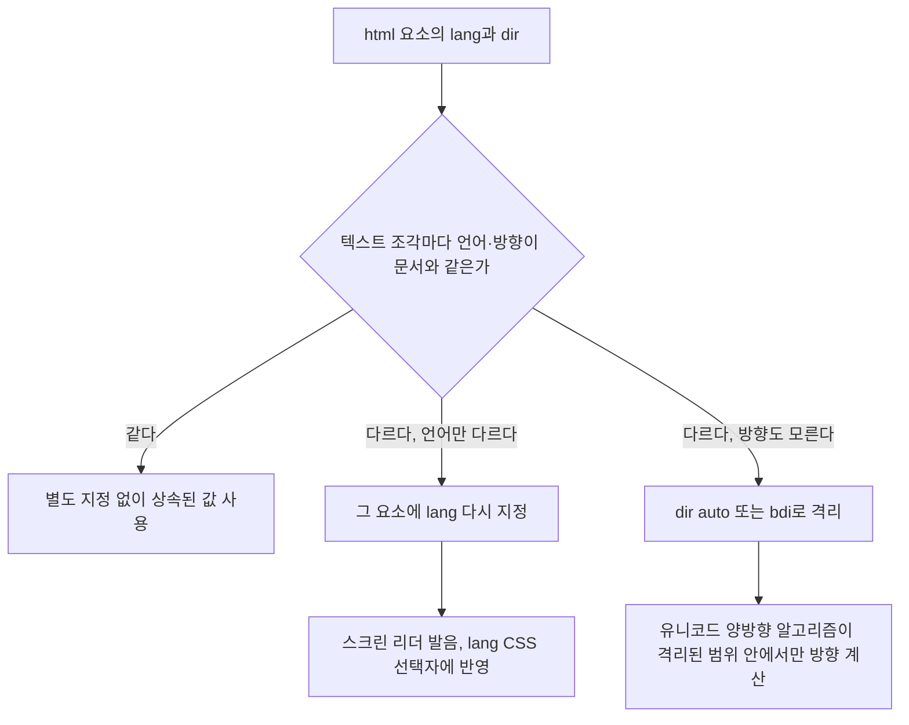

<Callout type="info">
  **이번 문서의 목표:** 이 문서를 다 읽으면 `lang` 속성이 왜 단순한 메타데이터가 아니라 스크린 리더 발음과 CSS 선택자에 실제로 영향을 주는 값인지 설명하고, `dir="rtl"`이 필요한 상황과 사용자 생성 콘텐츠의 방향이 문서 전체를 흐트러뜨리는 문제를 `bdi` 요소로 격리하는 방법을 익히고, `ruby`·`rt`·`rp`로 후리가나 같은 발음 주석을 붙이면서 구형 브라우저 폴백까지 챙길 수 있게 됩니다.
</Callout>

## 왜 "언어와 방향"을 별도로 다루는가

지금까지 이 과목에서 다룬 기능들은 대부분 "무엇을 보여줄까"에 관한 것이었습니다. `lang`·`dir`·`bdi`·`ruby`는 조금 다릅니다. 이들은 **같은 텍스트를 다른 언어권 사용자·기기가 어떻게 소리 내어 읽고, 어느 방향으로 흘려보낼지**를 결정하는 속성입니다.

한 사이트에 한국어와 영어만 섞여 있다면 이 문제를 거의 못 느낍니다. 하지만 다음 상황을 겪어 보면 사정이 달라집니다.

- 스크린 리더(screen reader, 화면 읽어주는 프로그램)가 영어 문장을 한국어 발음 규칙으로 읽어 어색하게 들립니다.
- 아랍어(오른쪽에서 왼쪽으로 쓰는 언어)로 된 문장 안에 영어 상표명이 하나 섞이면, 괄호나 숫자의 위치가 뒤집혀 보입니다.
- 사용자 이름이 자유 입력 값이라 어떤 언어로 쓰일지 모르는데, 이 이름 하나 때문에 목록 전체의 정렬 방향이 깨집니다.

이 세 가지 문제는 전부 "브라우저가 이 텍스트를 어떤 언어·어떤 방향으로 다뤄야 하는지 모른다"는 한 가지 원인에서 나옵니다. `lang`·`dir`·`bdi`·`ruby`는 이 정보를 브라우저에게 명시적으로 알려주는 도구입니다.

## 1. `lang` 속성 — 이 텍스트는 무슨 언어인가

### 정의와 문법

`lang` 속성은 모든 HTML 요소에 붙일 수 있는 전역 속성(global attribute)으로, 그 요소 안 텍스트의 **자연어**(natural language, 사람이 쓰는 언어)가 무엇인지 선언합니다. 값은 BCP 47이라는 규격의 언어 태그를 씁니다.

```html
<html lang="ko">
  <p lang="en">This sentence is in English.</p>
</html>
```

언어 태그는 `ko`(한국어), `en`(영어), `en-US`(미국 영어), `ja`(일본어)처럼 짧은 코드로 씁니다. 상속되는 값이라, `html` 요소에 `lang="ko"`를 걸어두면 하위 요소는 별도로 지정하지 않는 한 전부 한국어로 취급됩니다. 문서 중간에 다른 언어 문장이 섞이면 그 부분에만 `lang`을 다시 걸어 덮어씁니다.

> **쉽게 말하면:** `lang`은 브라우저와 스크린 리더에게 "지금부터 이 언어의 발음·표기 규칙을 적용하라"고 알려주는 안내판입니다. 안내판이 없으면 기본값(대개 사용자 시스템 언어)으로 읽습니다.

### 실제로 무엇이 바뀌는가

`lang`을 정확히 안 붙였을 때 눈에 안 보이지만 실제로 벌어지는 일이 세 가지 있습니다.

| 영향 범위 | `lang`이 정확할 때 | `lang`이 없거나 틀렸을 때 |
|---|---|---|
| 스크린 리더 발음 | 각 언어의 음성 엔진과 억양 규칙으로 읽는다 | 문서 전체 언어(또는 시스템 기본 언어) 규칙으로 잘못 읽는다 |
| CSS `:lang()` 선택자 | 언어별로 다른 인용부호·글꼴 등을 선택자로 지정 가능 | 선택자가 매치되지 않아 스타일이 적용되지 않는다 |
| 검색엔진·번역 도구 | 문서 언어를 정확히 인식 | 언어 자동 감지에 의존해 오탐 가능 |

CSS의 `:lang()` 의사 클래스(pseudo-class, 가상 클래스)는 이 `lang` 값을 그대로 선택자로 씁니다. 예를 들어 언어마다 다른 인용부호 스타일을 자동으로 적용할 수 있습니다.

```css
/* 한국어 문단에는 낫표 스타일, 영어 문단에는 영어식 따옴표 스타일을 각각 적용 */
:lang(ko) q::before { content: "\300C"; }
:lang(ko) q::after  { content: "\300D"; }
:lang(en) q::before { content: "\201C"; }
:lang(en) q::after  { content: "\201D"; }
```

<Callout type="warning">
  **자주 틀리는 점:** `lang`을 CSS `font-family`를 언어별로 바꾸는 용도로만 쓰는 것으로 오해하기 쉽지만, 실제 첫 번째 수혜자는 **스크린 리더 사용자**입니다. `lang` 없이 여러 언어가 섞인 페이지는 시각 장애 사용자에게 발음이 뒤죽박죽인 페이지로 들립니다. 접근성 관점에서 `lang`은 장식이 아니라 필수 메타데이터입니다.
</Callout>

## 2. `dir` 속성과 양방향 텍스트

### 왜 필요한가

한국어·영어·일본어는 전부 왼쪽에서 오른쪽으로 씁니다. 하지만 아랍어·히브리어처럼 오른쪽에서 왼쪽으로 쓰는 언어도 있습니다. 이 성질을 **양방향**(bidirectional, 줄여서 bidi)이라 부르는데, 한 문서 안에 두 방향이 섞이면 브라우저는 유니코드 양방향 알고리즘(Unicode Bidirectional Algorithm)이라는 규칙에 따라 자동으로 방향을 판단합니다. 문제는 이 자동 판단이 항상 저자의 의도와 같지는 않다는 점입니다.

`dir` 속성은 이 자동 판단에 명시적인 힌트를 주는 전역 속성입니다.

| 값 | 의미 |
|---|---|
| `ltr` | 왼쪽에서 오른쪽(left to right) — 기본값 |
| `rtl` | 오른쪽에서 왼쪽(right to left) — 아랍어·히브리어 등 |
| `auto` | 요소 안 텍스트의 첫 강한 방향성 문자를 보고 브라우저가 방향을 추측 |

```html
<p dir="rtl">هذا نص باللغة العربية</p>
```

`dir="rtl"`을 걸면 텍스트의 정렬 방향뿐 아니라, 그 요소 안에 있는 목록의 순서, 스크롤바 위치, 심지어 숫자와 괄호의 시각적 배치까지 함께 뒤집힙니다. 이는 단순히 `text-align: right`를 CSS로 거는 것과는 전혀 다릅니다. `text-align`은 글자 정렬만 바꾸지만, `dir`은 브라우저의 양방향 알고리즘 자체를 재구성해 문장 부호와 중첩된 방향까지 올바르게 계산합니다.

> **쉽게 말하면:** `text-align: right`는 "글자를 오른쪽으로 붙여라"라는 미용 지시이고, `dir="rtl"`은 "이 텍스트는 애초에 오른쪽에서 왼쪽으로 흐르는 언어다"라는 사실 선언입니다. 미용 지시만으로는 괄호·숫자·구두점의 논리적 순서까지 못 바로잡습니다.

### `dir="auto"`가 필요한 상황

문서 언어는 `ltr`이지만, 사용자가 입력한 댓글이나 채팅 메시지처럼 **어떤 언어로 올지 저자가 미리 알 수 없는 텍스트**가 있습니다. 이럴 때 `dir="auto"`를 걸면 브라우저가 텍스트 내용을 보고 그때그때 방향을 정합니다.

```html
<!-- 사용자가 아랍어로 댓글을 남기면 자동으로 rtl로 렌더링됨 -->
<p dir="auto">사용자가 입력한 댓글 내용이 여기 들어간다</p>
```

## 3. `<bdi>` — 방향을 모르는 조각을 격리하기

### `dir="auto"`만으로 안 되는 경우

`dir="auto"`는 요소 하나를 통째로 감싸 방향을 추측할 때는 잘 동작하지만, **한 줄 문장 안에 방향을 모르는 짧은 조각(예: 사용자 이름)이 끼어 있고, 그 조각이 주변 문장의 방향에 영향을 주면 안 되는 경우**에는 부족합니다.

예를 들어 왼쪽에서 오른쪽으로 쓰는 목록에 아랍어로 된 사용자 이름이 하나 섞이면, 유니코드 양방향 알고리즘이 그 이름 뒤에 오는 숫자나 구두점의 위치까지 함께 흐트러뜨릴 수 있습니다.

```html
<!-- 문제 상황: 아랍어 이름 뒤에 오는 숫자 위치가 예상과 다르게 보일 수 있다 -->
<ul>
  <li>이광수: 5개의 글</li>
  <li>أحمد: 3개의 글</li>
</ul>
```

### `<bdi>`(Bidirectional Isolate, 양방향 격리)

이 문제를 풀기 위한 요소가 **`<bdi>`**입니다. 이름을 풀면 **양방향**(bidirectional)의 **격리**(isolate)로, "이 안의 텍스트가 무슨 방향이든 바깥 텍스트의 방향 계산에 영향을 주지 않도록 담을 친다"는 뜻입니다. `<bdi>`로 감싼 조각은 내용에 맞춰 스스로 방향을 판단하되, 그 판단 결과가 앞뒤 문장으로 새어나가지 않습니다.

```html
<ul>
  <li>이광수: 5개의 글</li>
  <li><bdi>أحمد</bdi>: 3개의 글</li>
</ul>
```

<CodePlayground
  template="static"
  activeFile="/index.html"
  label="bdi로 사용자 이름을 격리했을 때와 안 했을 때 비교"
  files={{
    '/index.html': `<!DOCTYPE html>
<html lang="ko">
<head><link rel="stylesheet" href="styles.css"></head>
<body>
  <h3>bdi 없이 (숫자·콜론 위치가 뒤섞일 수 있음)</h3>
  <ul>
    <li>أحمد الشريف: 3개의 글</li>
  </ul>

  <h3>bdi로 격리 (이름의 방향이 문장 밖으로 새지 않음)</h3>
  <ul>
    <li><bdi>أحمد الشريف</bdi>: 3개의 글</li>
  </ul>
</body>
</html>`,
    '/styles.css': `body { font-family: system-ui, sans-serif; padding: 1rem; }
li { margin-bottom: 0.5rem; }`,
  }}
/>

두 목록을 비교하면, `bdi`로 감싸지 않은 첫 줄은 아랍어 이름의 오른쪽에서 왼쪽 방향성이 콜론과 숫자의 배치에까지 번져 순서가 헷갈리게 보일 수 있습니다. `bdi`로 감싼 둘째 줄은 이름 내부만 오른쪽에서 왼쪽으로 흐르고, 그 뒤 "`: 3개의 글`"은 문서 전체 방향(한국어, 왼쪽에서 오른쪽)을 그대로 유지합니다.

### `dir="auto"`와 `<bdi>`의 역할 차이

| | `dir="auto"` | `<bdi>` |
|---|---|---|
| 적용 대상 | 임의의 블록·인라인 요소 | 인라인 요소 전용(격리가 목적) |
| 하는 일 | 그 요소 자신의 방향을 내용에 맞춰 추측 | 방향을 추측하면서 **동시에 바깥으로 영향이 새지 않게 담을 침** |
| 주로 쓰는 상황 | 댓글·채팅 메시지처럼 요소 전체의 방향이 불확실할 때 | 문장 안에 끼워 넣는 사용자 이름·태그처럼 짧은 조각을 격리할 때 |

실무에서는 둘을 함께 쓰는 경우가 많습니다. `<bdi dir="auto">`처럼 명시적으로 붙이는 브라우저도 있지만, `<bdi>`는 기본적으로 `dir="auto"`와 같은 추측 동작을 내장하고 있어 별도로 붙이지 않아도 됩니다.

### 접근성 관점

`<bdi>`는 시각적 방향만 바로잡는 것이 아니라, 스크린 리더가 텍스트를 순서대로 읽을 때도 조각별로 올바른 방향을 인식하게 돕습니다. 격리 없이 방향이 섞인 텍스트는 스크린 리더가 단어 순서를 실제와 다르게 읽어줄 위험이 있습니다. 사용자 생성 콘텐츠(댓글, 사용자 이름, 상품 리뷰 등)를 다루는 화면에서는 `<bdi>`를 기본 습관으로 두는 것이 좋습니다.

## 4. `<ruby>`·`<rt>`·`<rp>` — 발음 주석 달기

### 왜 필요한가

한자나 한국어의 한자 병기, 일본어의 후리가나(furigana)처럼, **본문 글자 위나 옆에 작은 발음 주석을 붙이는 표기 관행**이 동아시아 언어에는 흔합니다. 이걸 이미지로 만들거나 괄호로 풀어 쓰면 검색·복사·스타일링이 모두 불편해집니다. HTML은 이 용도를 위해 전용 요소 셋을 제공합니다.

- **`<ruby>`**: 본문과 주석을 함께 감싸는 컨테이너
- **`<rt>`**: Ruby Text(루비 텍스트)의 약자로, 실제 발음·주석 문자
- **`<rp>`**: Ruby Parenthesis(루비 괄호)의 약자로, `<ruby>`를 지원하지 않는 브라우저에서 대신 보일 괄호

```html
<ruby>
  漢字<rp>(</rp><rt>かんじ</rt><rp>)</rp>
</ruby>
```

> **쉽게 말하면:** `<ruby>`는 "본문 글자 위에 작은 발음 표를 붙이는 특수 괄호"입니다. `<rt>`가 그 발음 표 내용이고, `<rp>`는 이 기능을 모르는 옛날 브라우저를 위해 준비해 둔 진짜 괄호 문자입니다.

### `<rp>`가 왜 필요한가 — 폴백의 원리

`<ruby>`를 지원하는 브라우저는 `<rt>` 안의 텍스트를 본문 위(또는 옆)에 작은 글씨로 얹어 그리고, `<rp>` 안의 괄호 문자는 화면에서 숨깁니다. 반대로 `<ruby>` 자체를 모르는 아주 오래된 브라우저는 태그를 모두 무시하고 텍스트만 순서대로 출력하는데, 이때 `<rp>`의 괄호가 숨겨지지 않고 그대로 나와 "`漢字(かんじ)`"처럼 최소한 읽을 수 있는 형태로 저하(graceful degradation, 우아한 성능 저하)됩니다. `<rp>`를 빼면 지원하지 않는 환경에서 "`漢字かんじ`"처럼 붙어 나와 무엇이 본문이고 무엇이 주석인지 구분할 수 없게 됩니다.

<CodePlayground
  template="static"
  activeFile="/styles.css"
  label="ruby로 한자 위에 발음을 다는 예시 (styles.css를 바꿔 크기·색을 조정해 보세요)"
  files={{
    '/index.html': `<!DOCTYPE html>
<html lang="ja">
<head><link rel="stylesheet" href="styles.css"></head>
<body>
  <p style="font-size: 1.5rem;">
    今日は
    <ruby>
      東京<rp>(</rp><rt>とうきょう</rt><rp>)</rp>
    </ruby>
    に行きます。
  </p>
</body>
</html>`,
    '/styles.css': `rt {
  font-size: 0.6em;
  color: #555;
}`,
  }}
/>

`rt`도 일반 요소이므로 CSS로 글자 크기·색을 자유롭게 조정할 수 있습니다. 위 실습기에서 `rt` 규칙의 `font-size` 값을 바꿔보면 발음 주석의 크기가 즉시 달라지는 것을 볼 수 있습니다.

### 접근성 관점

스크린 리더는 `<ruby>` 구조를 만나면 기본 텍스트와 주석 텍스트를 구현체에 따라 다르게 처리합니다(둘 다 읽거나, 주석만 건너뛰는 등). 발음 자체가 의미 전달에 필수적인 경우(생소한 한자어 등)라면 본문에 읽는 법을 문장으로 함께 풀어주는 것이 더 안전한 대체 수단이 될 수 있습니다.

## 5. 네 가지가 겹치는 실전 시나리오

이 네 가지는 독립적으로도 쓰이지만, 다국어 서비스에서는 함께 맞물립니다. 문서 전체 언어와 방향을 결정하는 흐름을 정리하면 다음과 같습니다.



<Callout type="warning">
  **자주 틀리는 점:** `lang`·`dir`을 "영어권 사이트에는 필요 없는 속성"이라 여기고 아예 생략하는 경우가 많습니다. 하지만 `html lang` 하나만 빠져도 스크린 리더는 기본 언어 규칙으로 문서 전체를 읽으려 시도하며, 다국어 콘텐츠가 조금이라도 섞이면 그 순간부터 접근성 문제가 발생합니다. `lang`은 시각적으로 아무것도 안 바뀌어서 빠뜨리기 쉬운, 그러나 접근성에는 큰 영향을 주는 속성입니다.
</Callout>

## 핵심 정리

- `lang` 속성은 스크린 리더 발음 규칙과 CSS `:lang()` 선택자 매칭에 실제로 영향을 주는 필수 메타데이터이며, 문서 언어와 다른 언어 구간마다 다시 지정해야 한다.
- `dir="rtl"`은 단순 정렬이 아니라 유니코드 양방향 알고리즘 자체를 재구성해 구두점·숫자 순서까지 바로잡으며, `dir="auto"`는 내용을 보고 방향을 추측한다.
- `<bdi>`는 사용자 생성 콘텐츠처럼 방향을 알 수 없는 짧은 조각을 격리해, 그 방향 판단이 앞뒤 문장으로 새어나가지 않게 막는다.
- `<ruby>`/`<rt>`/`<rp>`는 본문에 발음 주석을 붙이는 표준 방법이며, `<rp>`는 `<ruby>`를 지원하지 않는 환경에서 괄호로 우아하게 저하되도록 하는 폴백 장치다.
- 이 네 속성·요소는 시각적으로 드러나지 않을 때가 많아 빠뜨리기 쉽지만, 스크린 리더 사용자와 다국어 사용자에게는 콘텐츠의 정확한 전달 여부를 좌우한다.

## 마무리 복습

<Quiz
  questionNumber={1}
  question="lang 속성이 실제로 영향을 주는 것으로 옳지 않은 것은?"
  options={['스크린 리더가 텍스트를 읽는 발음 규칙', 'CSS의 lang 의사 클래스가 매치되는지 여부', '요소의 박스 모델에서 padding이 계산되는 방식', '검색엔진이나 번역 도구가 언어를 인식하는 정확도']}
  correctAnswer={3}
  explanation="lang은 발음, CSS lang 선택자 매칭, 언어 인식 정확도에 영향을 주지만 박스 모델의 padding 계산과는 무관하다."
  optionExplanations={['정확한 발음 규칙 적용에 lang이 직접 영향을 준다', 'lang 의사 클래스는 lang 속성값을 그대로 선택자로 사용한다', '정답 — padding 등 박스 모델 계산은 lang과 관련이 없다', '언어 태그가 정확할수록 자동 인식 도구의 정확도가 올라간다']}
/>

<Quiz
  questionNumber={2}
  question="dir=rtl과 CSS의 text-align: right의 차이로 가장 정확한 설명은?"
  options={['두 방법은 완전히 동일하게 동작한다', 'text-align은 글자 정렬만 바꾸지만 dir=rtl은 양방향 알고리즘 자체를 재구성해 구두점과 숫자 순서까지 바로잡는다', 'dir=rtl은 시각적 효과가 전혀 없고 스크린 리더에만 영향을 준다', 'text-align은 전역 속성이고 dir는 특정 요소에만 적용 가능한 속성이다']}
  correctAnswer={2}
  explanation="dir는 텍스트가 실제로 어느 방향의 언어인지 선언해 유니코드 양방향 알고리즘의 계산 기준 자체를 바꾸지만, text-align은 이미 계산된 텍스트를 정렬만 다시 하는 미용 속성이다."
  optionExplanations={['적용 범위와 계산 방식이 서로 다르다', '정답 — 알고리즘 재구성 여부가 핵심 차이다', 'dir=rtl은 시각적 배치에도 실제로 영향을 준다', 'dir 역시 전역 속성으로 대부분의 요소에 적용할 수 있다']}
/>

<Quiz
  questionNumber={3}
  question="bdi 요소를 쓰는 가장 적절한 상황은?"
  options={['문서 전체의 기본 언어를 선언할 때', '방향을 알 수 없는 사용자 이름 등 짧은 조각이 주변 문장의 방향 계산에 영향을 주지 않게 격리하고 싶을 때', '한자 위에 발음 주석을 붙이고 싶을 때', 'CSS 선택자로 언어별 스타일을 분기하고 싶을 때']}
  correctAnswer={2}
  explanation="bdi는 방향을 모르는 짧은 텍스트 조각을 격리해 그 방향 판단이 바깥 문장으로 새어나가지 않게 막는 데 특화된 요소다."
  optionExplanations={['문서 전체 언어 선언은 html 요소의 lang 속성이 담당한다', '정답 — 격리가 bdi의 핵심 목적이다', '발음 주석은 ruby, rt, rp 조합이 담당한다', '언어별 CSS 분기는 lang 의사 클래스가 담당한다']}
/>

<Quiz
  questionNumber={4}
  question="ruby 요소 구조에서 rp가 하는 역할은?"
  options={['발음 주석 자체의 텍스트를 담는다', 'ruby를 지원하지 않는 브라우저에서 괄호를 보여줘 최소한의 가독성을 유지하는 폴백 역할을 한다', '본문 글자의 색상을 지정한다', '문서 전체의 기본 방향을 지정한다']}
  correctAnswer={2}
  explanation="rp 안의 괄호는 ruby를 지원하는 브라우저에서는 숨겨지고, 지원하지 않는 브라우저에서는 그대로 노출되어 본문과 발음 주석을 괄호로 구분해 주는 폴백 장치다."
  optionExplanations={['발음 주석 텍스트는 rt가 담당한다', '정답 — 미지원 환경을 위한 폴백이 rp의 목적이다', '색상 지정은 CSS의 역할이며 rp와 무관하다', '문서 방향 지정은 dir 속성의 역할이다']}
/>

<Quiz
  questionNumber={5}
  question="dir=auto와 bdi 요소의 차이를 가장 정확히 설명한 것은?"
  options={['dir=auto는 인라인 요소에만 쓸 수 있고 bdi는 블록 요소에만 쓸 수 있다', '둘 다 요소 내용을 보고 방향을 추측하지만, bdi는 그 판단이 바깥 문장으로 새어나가지 않도록 격리까지 함께 한다', 'dir=auto는 스크린 리더 발음에 영향을 주지만 bdi는 시각적 배치에만 영향을 준다', 'bdi는 반드시 dir=rtl과 함께 써야만 동작한다']}
  correctAnswer={2}
  explanation="두 방법 모두 내용을 보고 방향을 추측하는 점은 같지만, bdi는 인라인 요소로서 짧은 조각을 격리해 주변 텍스트의 방향 계산에 영향을 주지 않도록 하는 목적에 특화되어 있다."
  optionExplanations={['적용 가능한 요소 범위가 그렇게 엄격히 나뉘지 않는다', '정답 — 격리 여부가 핵심 차이다', '두 방법 모두 시각적 배치와 접근성 모두에 영향을 준다', 'bdi는 기본적으로 자체 방향 추측 기능을 내장하고 있어 별도 dir 지정이 필수는 아니다']}
/>

<Quiz
  questionNumber={6}
  question="다국어 콘텐츠를 다루는 페이지에서 lang을 생략했을 때 생기는 문제로 가장 적절한 것은?"
  options={['CSS 레이아웃이 즉시 깨진다', '시각적으로는 드러나지 않지만 스크린 리더가 기본 언어 규칙으로 텍스트를 잘못 읽을 수 있다', '자바스크립트 실행이 중단된다', 'HTML 문서가 파싱조차 되지 않는다']}
  correctAnswer={2}
  explanation="lang을 생략해도 화면상 레이아웃이나 실행에는 문제가 없지만, 스크린 리더는 언어 정보를 근거로 발음 규칙을 정하므로 다국어 텍스트를 잘못된 억양으로 읽어줄 위험이 있다."
  optionExplanations={['lang 누락은 시각적 레이아웃과 직접 관련이 없다', '정답 — 접근성 문제가 조용히 발생한다', '자바스크립트 실행과 lang은 무관하다', 'lang이 없어도 HTML 파싱 자체는 정상적으로 이루어진다']}
/>

## 참고 자료

- [MDN — dir 전역 속성](https://developer.mozilla.org/en-US/docs/Web/HTML/Reference/Global_attributes/dir)
- [MDN — lang 전역 속성](https://developer.mozilla.org/en-US/docs/Web/HTML/Reference/Global_attributes/lang)
- [MDN — bdi 요소](https://developer.mozilla.org/en-US/docs/Web/HTML/Reference/Elements/bdi)
- [MDN — ruby 요소](https://developer.mozilla.org/en-US/docs/Web/HTML/Reference/Elements/ruby)
