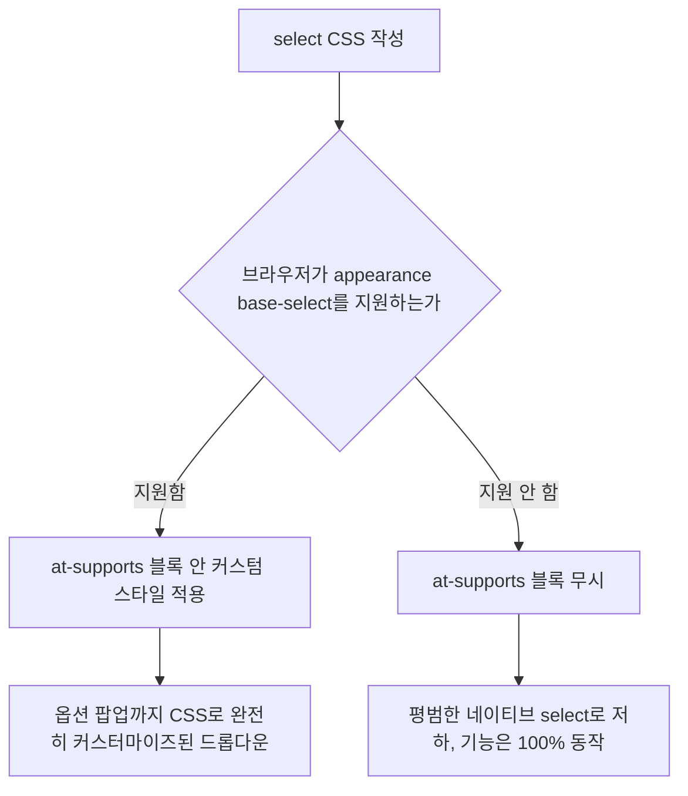

<Callout type="info">
  **이번 문서의 목표:** 이 문서를 다 읽으면 왜 `select` 요소가 지금까지 CSS로 자유롭게 꾸밀 수 없었는지 설명하고, `appearance: base-select`와 `selectedcontent` 요소가 이 한계를 어떻게 푸는지 이해하고, 이 기능이 2026-09 시점에 아직 모든 브라우저에서 쓸 수 없다는 사실을 근거를 갖고 판단해 `@supports`로 안전하게 점진적 향상을 설계할 수 있게 됩니다.
</Callout>

<Callout type="warning">
  **실험적 기능 고지:** 이 편에서 다루는 `appearance: base-select`와 `selectedcontent`는 2026-09 시점 기준 **Baseline에 도달하지 못한 실험적 기능**입니다. Chrome·Edge 135 이상에서는 안정적으로 지원하지만, Safari는 Technology Preview(정식 출시 전 미리보기 빌드) 단계이고 Firefox는 Nightly(개발자용 야간 빌드)에서 플래그를 켜야 하는 프로토타입 단계입니다. "이제 select를 자유롭게 스타일링할 수 있다"고 단정할 단계가 아니며, 실무에 쓰려면 반드시 이 편의 폴백 패턴과 함께 적용해야 합니다. 이 지원 현황은 여러분이 이 문서를 읽는 시점에 바뀌어 있을 수 있으므로, 적용 전 02편에서 배운 방법으로 MDN 호환성 표를 직접 다시 확인하십시오.
</Callout>

## 왜 `select`는 지금까지 자유롭게 못 꾸몄는가

12편에서 다룬 새 입력 타입들은 대부분 CSS로 어느 정도 겉모습을 조정할 수 있었습니다. 그런데 드롭다운을 만드는 `select` 요소는 사정이 달랐습니다. `select`를 열었을 때 나오는 옵션 목록(팝업)은 **운영체제 수준에서 그려지는 네이티브 위젯**이라, `background`나 `padding` 정도의 기본 스타일만 먹혔을 뿐 옵션 하나하나에 아이콘을 넣거나 레이아웃을 바꾸는 일은 불가능했습니다.

이 한계 때문에 실무에서는 오랫동안 두 가지 방법 중 하나를 택해 왔습니다.

- **네이티브 `select`를 그대로 쓴다**: 접근성과 키보드 동작은 브라우저가 공짜로 챙겨주지만, 디자인 자유도가 거의 없다.
- **`div`와 `li`로 드롭다운을 직접 만든다("커스텀 셀렉트")**: 디자인은 마음대로지만, 키보드 탐색·스크린 리더 역할(role)·포커스 관리를 전부 자바스크립트로 손수 구현해야 하고, 놓치기 쉬운 접근성 버그가 잘 생긴다.

**Customizable `select`**(커스터마이즈 가능한 select)는 이 딜레마를 없애려는 시도입니다. 네이티브 `select`가 원래 가지고 있던 키보드 탐색·접근성 트리·폼 제출 동작은 그대로 유지하면서, 옵션 목록의 겉모습만 CSS로 완전히 새로 그릴 수 있게 브라우저 표준에 새 기능을 추가하는 방향입니다.

> **쉽게 말하면:** 지금까지 `select`는 "내용은 마음대로, 겉모습은 운영체제 마음대로"였습니다. Customizable select는 "내용도 겉모습도 전부 내 마음대로, 그런데 키보드·접근성은 여전히 브라우저가 공짜로 챙겨준다"를 목표로 합니다.

## 1. `appearance: base-select` — 네이티브 동작은 유지한 채 스타일만 벗기기

### `appearance` 속성 복습

CSS의 `appearance` 속성은 원래 폼 컨트롤의 운영체제 기본 스타일(버튼처럼 보이는 테두리, 셀렉트박스의 화살표 등)을 켜고 끄는 속성이었습니다. `appearance: none`을 걸면 기본 스타일이 사라지지만, 지금까지 `select`에 이 값을 걸어도 **닫힌 상태의 상자만** 스타일이 벗겨질 뿐, 열었을 때 나오는 옵션 팝업은 여전히 운영체제가 그렸습니다.

`appearance: base-select`는 여기서 한 걸음 더 나갑니다. 이 값을 `select`와 그 안의 `option`에 걸면, 옵션 팝업 자체를 웹 개발자가 CSS로 완전히 새로 그릴 수 있는 **베이스 렌더링**(base rendering, 브라우저가 제공하는 최소한의 기본 골격) 모드로 전환됩니다.

```css
select,
::picker(select) {
  appearance: base-select;
}
```

`::picker(select)`는 옵션 목록이 뜨는 팝업 부분을 가리키는 새 의사 요소(pseudo-element, 가상 요소)입니다. `select` 자체(닫혀 있을 때 보이는 상자)와 `::picker(select)`(열렸을 때 나오는 목록)에 각각 스타일을 따로 걸 수 있습니다.

### 무엇이 달라지는가 — 비교

| | 기존 `select` (`appearance: none`) | Customizable `select` (`appearance: base-select`) |
|---|---|---|
| 닫힌 상자 스타일 | CSS로 조정 가능 | CSS로 조정 가능 |
| 열렸을 때 옵션 목록 스타일 | 운영체제가 그림, CSS 개입 거의 불가 | `::picker(select)`로 배경·테두리·레이아웃을 CSS로 완전히 조정 |
| 옵션 안에 아이콘·여러 줄 텍스트 배치 | 불가능(옵션은 순수 텍스트만) | `option` 안에 임의의 HTML을 넣어 아이콘·부가 설명 배치 가능 |
| 키보드 탐색(화살표, 타이핑으로 찾기) | 브라우저가 자동 처리 | 그대로 브라우저가 자동 처리(유지됨) |
| 접근성 트리(role, 상태) | 브라우저가 자동 부여 | 그대로 브라우저가 자동 부여(유지됨) |

가장 중요한 줄은 마지막 두 줄입니다. 직접 만든 커스텀 셀렉트에서 가장 많이 버그가 나는 지점(키보드 탐색, 접근성 트리)이 Customizable select에서는 그대로 브라우저 몫으로 남아 있습니다. 개발자가 새로 신경 써야 하는 부분은 **겉모습**뿐입니다.

## 2. `<selectedcontent>` — 닫힌 상자에 무엇을 보여줄지 고르기

### 왜 별도 요소가 필요한가

옵션 안에 아이콘과 텍스트를 자유롭게 넣을 수 있게 되면 새 질문이 생깁니다. **옵션을 선택해서 목록이 닫혔을 때, 그 닫힌 상자 안에는 무엇을 보여줄 것인가?** 옵션 전체(아이콘 + 부가 설명 + 텍스트)를 그대로 복사해 보여주면 상자가 너무 복잡해 보일 수 있고, 반대로 텍스트만 보여주고 싶을 수도 있습니다.

이 선택을 제어하는 요소가 **`<selectedcontent>`**입니다. 이름 그대로 "선택된(selected) 내용(content)"을 표시하는 자리로, `select` 안에 직접 넣어두면 사용자가 고른 `option`의 내용이 실시간으로 이 자리에 복제되어 나타납니다.

```html
<select>
  <button>
    <selectedcontent></selectedcontent>
  </button>
  <option value="apple">
    <span class="icon">🍎</span> 사과
  </option>
  <option value="banana">
    <span class="icon">🍌</span> 바나나
  </option>
</select>
```

위 구조에서 `select` 바로 아래 `button`은 닫힌 상태에서 보이는 상자 역할을 하는 새 문법입니다. `<selectedcontent>`는 이 버튼 안에 놓여, 현재 선택된 `option`의 내용을 그대로 복제해 보여줍니다. 사용자가 "바나나"를 고르면 `<selectedcontent>` 안에는 바나나 옵션에 있던 아이콘과 텍스트가 그대로 나타납니다.

> **쉽게 말하면:** `<selectedcontent>`는 "지금 고른 옵션의 모습을 실시간으로 비춰 주는 거울"입니다. 옵션 안의 아이콘까지 통째로 비출지, 텍스트만 따로 빼서 비출지는 이 안에 무엇을 넣느냐에 따라 결정됩니다.

### 코드로 확인하기

<CodePlayground
  template="static"
  activeFile="/styles.css"
  label="Customizable select — 지원 브라우저에서만 아이콘 포함 드롭다운으로 보인다"
  files={{
    '/index.html': `<!DOCTYPE html>
<html lang="ko">
<head><link rel="stylesheet" href="styles.css"></head>
<body>
  <label for="과일선택">좋아하는 과일</label>
  <select id="과일선택" name="fruit">
    <button>
      <selectedcontent></selectedcontent>
    </button>
    <option value="apple">
      <span class="icon">🍎</span> 사과
    </option>
    <option value="banana">
      <span class="icon">🍌</span> 바나나
    </option>
    <option value="grape">
      <span class="icon">🍇</span> 포도
    </option>
  </select>
</body>
</html>`,
    '/styles.css': `/* 이 규칙을 지원하는 브라우저에서만 옵션 목록의 겉모습이 바뀐다 */
@supports (appearance: base-select) {
  select,
  ::picker(select) {
    appearance: base-select;
  }

  select {
    border: 2px solid #6b46c1;
    border-radius: 8px;
    padding: 0.5rem 0.75rem;
  }

  ::picker(select) {
    border: 2px solid #6b46c1;
    border-radius: 8px;
    padding: 0.25rem;
  }

  option {
    padding: 0.5rem;
    border-radius: 6px;
  }

  option:hover {
    background: #f3e8ff;
  }

  .icon {
    margin-right: 0.4rem;
  }
}`,
  }}
/>

이 코드를 Chrome이나 Edge 135 이상에서 열면 옵션 목록에 보라색 테두리와 아이콘 간격이 적용된 커스텀 드롭다운이 보이지만, 아직 지원하지 않는 브라우저에서는 `@supports` 블록 전체가 무시되고 **평범한 네이티브 select**로 조용히 저하됩니다. 어느 쪽이든 폼 제출 값(`fruit`)은 정상적으로 동작합니다.

## 3. `@supports`로 점진적 향상 설계하기

### 왜 `@supports`가 필수인가

이 기능은 Baseline에 도달하지 못했으므로, `appearance: base-select`를 지원하지 않는 브라우저에서는 이 값 자체를 브라우저가 이해하지 못하고 무시합니다. 문제는 **일반 CSS 규칙을 무작정 걸면**, 지원하지 않는 브라우저에서 "닫힌 상자는 새 스타일이 적용됐는데 옵션 팝업은 옛날 그대로"인 어중간한 상태가 될 수 있다는 점입니다. `@supports`(CSS 기능 질의 규칙)로 감싸면 "이 기능을 브라우저가 실제로 지원할 때만" 새 스타일 세트를 통째로 적용해, 지원 여부에 따라 완전히 두 가지 일관된 모습 중 하나만 보이게 만들 수 있습니다.

```css
/* 이 브라우저가 appearance: base-select를 이해하는 경우에만 아래 블록 전체 적용 */
@supports (appearance: base-select) {
  select, ::picker(select) {
    appearance: base-select;
  }
  /* 커스텀 스타일 전부 이 안에 몰아넣는다 */
}
```

### 설계 원칙

| 원칙 | 이유 |
|---|---|
| 커스텀 스타일은 전부 `@supports` 블록 안에 몰아넣는다 | 지원하지 않는 브라우저에서 어중간하게 섞인 스타일이 남지 않게 하기 위해 |
| 기본 상태(폴백)는 평범한 네이티브 `select`로 둔다 | 미지원 브라우저에서도 폼이 정상적으로 동작하고 접근성이 보장되기 때문 |
| 옵션 안에 아이콘 등 장식 요소를 넣더라도 텍스트 의미가 살아 있게 마크업한다 | 미지원 브라우저에서는 옵션이 순수 텍스트처럼 보여야 하므로 |
| 프로덕션 적용 전 대상 브라우저의 실제 점유율과 최신 호환성 표를 확인한다 | 이 기능의 지원 범위는 이 문서 작성 시점(2026-09) 이후 계속 바뀔 것이기 때문 |



<Callout type="warning">
  **자주 틀리는 점:** `appearance: base-select`를 걸었으니 `option` 안에 이미지나 복잡한 레이아웃을 마음껏 넣어도 된다고 생각하기 쉽지만, 미지원 브라우저에서는 그 `option`이 여전히 **순수 텍스트 컨트롤**로 렌더링됩니다. `option` 안에 `div`나 `img` 태그를 넣으면 미지원 브라우저는 그 태그를 무시하고 텍스트 내용만 이어붙여 보여주므로, 대체 텍스트가 자연스럽게 읽히는 마크업 구조를 먼저 설계해야 합니다.
</Callout>

## 4. 이 기능을 실무에 쓸지 판단하는 법

02편에서 배운 절차를 그대로 이 기능에 적용해 봅니다.

1. **MDN 호환성 표를 확인한다** — `appearance` 속성 문서와 `<selectedcontent>` 문서 하단의 브라우저 호환성 표에서 Safari·Firefox의 지원 여부가 이 문서 작성 시점 이후 바뀌었는지 확인합니다.
2. **Baseline 배지를 확인한다** — "Newly available"(막 도달)이나 "Widely available"(널리 사용 가능) 배지가 붙었는지 확인합니다. 2026-09 시점에는 이 배지가 아직 없습니다.
3. **대상 사용자의 브라우저 분포를 확인한다** — 사내 관리 도구처럼 Chrome 계열만 쓰는 환경이라면 지금 당장 채택할 여지가 있지만, 불특정 다수를 대상으로 하는 공개 서비스라면 아직 이르다고 판단하는 것이 안전합니다.
4. **`@supports` 폴백을 항상 함께 배치한다** — 어떤 판단을 내리든, 미지원 브라우저에서도 폼이 정상 동작해야 하므로 폴백은 선택이 아니라 필수입니다.

## 핵심 정리

- 지금까지 `select`의 옵션 팝업은 운영체제가 그리는 네이티브 위젯이라 CSS로 꾸밀 수 없었고, 이를 우회하려는 커스텀 셀렉트는 키보드·접근성을 직접 구현해야 하는 부담이 있었다.
- `appearance: base-select`는 `select`와 `::picker(select)`에 걸어 옵션 팝업 자체를 CSS로 새로 그릴 수 있게 하면서, 키보드 탐색과 접근성 트리는 그대로 브라우저가 유지한다.
- `<selectedcontent>`는 현재 선택된 `option`의 내용을 닫힌 상자 안에 실시간으로 비춰 주는 요소다.
- 이 두 기능은 2026-09 시점 **Baseline 미도달의 실험적 기능**이며, Chrome·Edge는 안정 지원하지만 Safari는 Technology Preview, Firefox는 Nightly 플래그 단계다. 반드시 `@supports (appearance: base-select)`로 커스텀 스타일을 감싸 미지원 브라우저에서 평범한 네이티브 `select`로 저하되게 설계해야 한다.
- 실무 채택 여부는 이 문서를 읽는 시점의 최신 MDN 호환성 표와 대상 사용자의 브라우저 분포를 직접 확인한 뒤 판단해야 한다.

## 마무리 복습

<Quiz
  questionNumber={1}
  question="지금까지 select 요소를 CSS로 자유롭게 꾸밀 수 없었던 가장 근본적인 이유는?"
  options={['select는 폼 요소가 아니기 때문이다', '옵션 목록 팝업이 운영체제 수준에서 그려지는 네이티브 위젯이었기 때문이다', 'select에는 class 속성을 붙일 수 없기 때문이다', 'select는 자바스크립트로만 제어할 수 있기 때문이다']}
  correctAnswer={2}
  explanation="닫힌 상자는 어느 정도 CSS로 조정할 수 있었지만, 열렸을 때 나오는 옵션 목록은 운영체제가 그리는 네이티브 위젯이라 CSS 개입이 거의 불가능했다."
  optionExplanations={['select는 명백한 폼 컨트롤 요소다', '정답 — 네이티브 위젯이라는 점이 근본 원인이다', 'select에도 class 속성을 정상적으로 붙일 수 있다', 'select는 HTML만으로도 기본 동작이 전부 가능하다']}
/>

<Quiz
  questionNumber={2}
  question="appearance: base-select를 적용해도 여전히 브라우저가 자동으로 처리해 주는 것은?"
  options={['옵션 팝업의 배경색과 테두리 스타일', '옵션 안에 넣은 아이콘의 배치 위치', '키보드 화살표 탐색과 접근성 트리 부여', '닫힌 상자 안에 표시할 텍스트 내용']}
  correctAnswer={3}
  explanation="Customizable select의 핵심은 겉모습만 새로 그리게 하고, 키보드 탐색과 접근성 트리처럼 버그가 나기 쉬운 부분은 그대로 브라우저가 처리하게 유지하는 것이다."
  optionExplanations={['배경색과 테두리는 개발자가 CSS로 직접 지정하는 부분이다', '아이콘 배치도 개발자가 마크업과 CSS로 직접 구성한다', '정답 — 키보드·접근성은 브라우저가 그대로 담당한다', '표시 내용은 selectedcontent 안에 무엇을 두느냐로 개발자가 결정한다']}
/>

<Quiz
  questionNumber={3}
  question="selectedcontent 요소의 역할로 가장 정확한 것은?"
  options={['옵션 목록 전체를 감싸는 컨테이너다', '현재 선택된 option의 내용을 닫힌 상자 안에 실시간으로 복제해 보여준다', '폼 제출 시 서버로 전송되는 값 자체를 담는다', '옵션 팝업의 위치를 계산하는 자바스크립트 API다']}
  correctAnswer={2}
  explanation="selectedcontent는 사용자가 고른 option의 내용을 닫힌 상자 자리에 실시간으로 비춰 보여주는 역할을 한다."
  optionExplanations={['옵션 목록 전체는 select와 그 안의 option들이 구성한다', '정답 — 선택된 옵션 내용을 실시간으로 비추는 역할이다', '서버로 전송되는 값은 option의 value 속성이 담당한다', '위치 계산은 브라우저 내부 렌더링 로직이 처리하며 별도 API가 아니다']}
/>

<Quiz
  questionNumber={4}
  question="2026-09 기준 Customizable select의 브라우저 지원 현황을 가장 정확히 설명한 것은?"
  options={['모든 주요 브라우저에서 이미 안정적으로 지원한다', 'Chrome과 Edge는 안정 지원하지만 Safari는 Technology Preview, Firefox는 Nightly 플래그 단계로 Baseline에 도달하지 못했다', '이 기능은 아직 어떤 브라우저에도 구현되어 있지 않다', 'Firefox만 유일하게 안정 지원하고 나머지 브라우저는 지원 계획이 없다']}
  correctAnswer={2}
  explanation="이 문서 작성 시점 기준 Chrome/Edge 135 이상은 안정 지원하지만 Safari는 미리보기 빌드, Firefox는 개발자용 야간 빌드에서 플래그를 켜야 하는 단계로, 아직 Baseline에 도달하지 못한 실험적 기능이다."
  optionExplanations={['모든 브라우저 안정 지원은 아직 사실이 아니다', '정답 — 브라우저별 지원 단계가 서로 다르다', 'Chrome과 Edge에는 이미 구현되어 있다', 'Chrome과 Edge가 오히려 먼저 안정 지원하고 있다']}
/>

<Quiz
  questionNumber={5}
  question="Customizable select용 CSS를 @supports (appearance: base-select) 블록으로 감싸야 하는 이유는?"
  options={['그렇게 하지 않으면 CSS 파일 용량이 커지기 때문이다', '지원하지 않는 브라우저에서 스타일이 어중간하게 섞이지 않고, 평범한 네이티브 select로 일관되게 저하되도록 하기 위해서다', '@supports가 없으면 select 요소 자체가 화면에 나타나지 않기 때문이다', 'appearance 속성은 @supports 없이는 아예 문법 오류를 일으키기 때문이다']}
  correctAnswer={2}
  explanation="@supports로 감싸면 이 기능을 지원하는 브라우저에서는 커스텀 스타일 전체가, 지원하지 않는 브라우저에서는 아무 스타일도 적용되지 않아 평범한 네이티브 select로 일관되게 저하된다."
  optionExplanations={['파일 용량과 @supports 사용 여부는 직접 관련이 없다', '정답 — 일관된 저하를 보장하기 위한 것이다', 'select 요소는 @supports 여부와 무관하게 항상 렌더링된다', '지원하지 않는 브라우저는 문법 오류 없이 해당 선언을 조용히 무시한다']}
/>

<Quiz
  questionNumber={6}
  question="옵션 안에 아이콘이나 부가 요소를 넣을 때 주의해야 할 점으로 옳은 것은?"
  options={['미지원 브라우저에서는 option이 순수 텍스트 컨트롤로 렌더링되므로, 텍스트만으로도 의미가 통하는 마크업 구조를 먼저 설계해야 한다', 'appearance: base-select를 걸면 모든 브라우저에서 아이콘이 항상 정상적으로 보인다', '아이콘을 넣으면 폼 제출 시 전송되는 value 값이 자동으로 바뀐다', 'option 안에는 텍스트 노드 외에 어떤 요소도 넣을 수 없다']}
  correctAnswer={1}
  explanation="이 기능을 지원하지 않는 브라우저에서는 option 안의 장식용 요소가 무시되고 텍스트만 이어붙여 보이므로, 텍스트만으로도 뜻이 통하는 마크업을 우선 고려해야 한다."
  optionExplanations={['정답 — 미지원 환경에서의 텍스트 폴백을 먼저 고려해야 한다', '미지원 브라우저에서는 아이콘 관련 마크업이 무시될 수 있다', 'value 값은 option의 value 속성으로 개발자가 직접 지정하는 값이다', 'Customizable select를 지원하는 브라우저에서는 option 안에 임의의 요소를 넣을 수 있다']}
/>

## 참고 자료

- [MDN — selectedcontent 요소](https://developer.mozilla.org/en-US/docs/Web/HTML/Reference/Elements/selectedcontent)
- [MDN Learn — Customizable select elements](https://developer.mozilla.org/en-US/docs/Learn_web_development/Extensions/Forms/Customizable_select)
