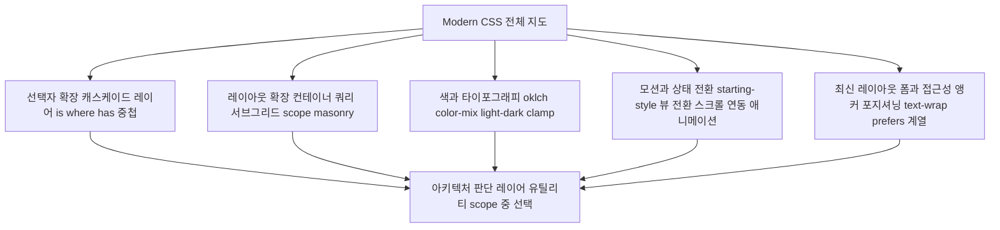

<Callout type="info">
  **이번 문서의 목표:** 이 문서를 다 읽으면 이 과목이 CSS 기본기(CSS Fundamentals)의 어느 지점에서 이어받는지 정확히 말할 수 있고, 앞으로 30편에 걸쳐 배울 내용을 캐스케이드·레이아웃·색·모션·접근성이라는 다섯 갈래 지도로 머릿속에 펼쳐놓을 수 있게 됩니다.
</Callout>

## 왜 "경계"부터 그리는가

새 과목을 시작할 때 가장 먼저 손해 보는 방식은 "일단 진도부터 나가는 것"입니다. 이 과목은 캐스케이드 레이어(cascade layer)부터 앵커 포지셔닝(anchor positioning)까지 스물여섯 개 본론 편을 다룹니다. 그런데 그 편들 중 어느 하나도 "선택자란 무엇인가", "명시도는 어떻게 계산하는가", "Flexbox 컨테이너는 어떻게 만드는가" 같은 기초를 다시 설명하지 않습니다. 그 이유는 간단합니다. 이미 다른 과목이 그 자리를 맡고 있기 때문입니다.

이 경계를 먼저 긋지 않으면 두 가지 문제가 생깁니다.

- 본론에서 "당연히 안다고 치고 넘어가는" 개념이 나올 때마다 낯설게 느껴져 진도가 막힙니다.
- 반대로 이미 아는 내용을 이 과목이 또 설명해줄 거라 기대하다가, 새로운 내용만 압축적으로 이어지는 전개에 당황합니다.

그래서 1편은 코드를 거의 쓰지 않습니다. 대신 **"여기부터 시작한다"는 선**을 명확히 긋고, 그 선 너머의 지형을 지도로 그립니다.

## 이 과목이 전제로 삼는 것 — CSS Fundamentals

이 사이트에는 이미 CSS 기본기(CSS Fundamentals) 과목이 있습니다. 그 과목은 CSS라는 언어 자체의 규칙을 처음부터 다룹니다. 아래 표에 정리한 내용은 전부 **안다고 전제**하고, 이 과목에서는 반복 설명하지 않습니다.

| 전제로 삼는 지식 | CSS Fundamentals에서 다루는 위치(참고) |
|---|---|
| 선택자 기본 문법(타입·클래스·ID·속성 선택자, 결합자) | `/web/css/css_fundamentals/04_selectors-basic`, `/web/css/css_fundamentals/05_selectors-combinators` |
| 의사 클래스·의사 요소 기본(`:hover`, `::before` 등) | `/web/css/css_fundamentals/06_pseudo-classes`, `/web/css/css_fundamentals/07_pseudo-elements` |
| 캐스케이드·출처(origin)·`!important`의 기본 우선순위 | `/web/css/css_fundamentals/08_cascade-and-origin` |
| 명시도 (a, b, c) 계산법 | `/web/css/css_fundamentals/09_specificity` |
| 상속과 값 처리 과정 | `/web/css/css_fundamentals/10_inheritance-and-value-processing` |
| 박스 모델, 마진 상쇄(margin collapsing) | `/web/css/css_fundamentals/11_box-model-basics`, `/web/css/css_fundamentals/12_margin-collapsing` |
| 단위와 `calc()` | `/web/css/css_fundamentals/13_units-and-calc` |
| Flexbox·Grid 기본 문법 | CSS Fundamentals 후반부 |
| 미디어 쿼리 기초(`@media`) | CSS Fundamentals 후반부 |

> **쉽게 말하면:** CSS Fundamentals가 "문법책"이라면, 이 과목은 "그 문법책이 나온 뒤 몇 년 사이에 나온 신조어와 새 표현법 사전"입니다. 신조어 사전을 펴 들었는데 알파벳부터 설명하고 있으면 이상하겠죠. 이 과목은 알파벳을 이미 아는 독자를 대상으로 합니다.

예를 들어 09편에서 배울 캐스케이드 레이어(cascade layer, `@layer`)는 "명시도(specificity)보다 먼저 승부를 가르는 새로운 우선순위 축"입니다. 이 문장을 이해하려면 명시도가 이미 몸에 붙어 있어야 합니다. 명시도 계산이 아직 헷갈린다면, 이 과목을 계속 읽기 전에 CSS Fundamentals의 09편부터 확실히 해두는 것을 권합니다.

<Callout type="warning">
  **자주 틀리는 점:** "모던 CSS니까 옛날 규칙(캐스케이드·명시도·상속)은 이제 안 중요하겠지"라고 생각하는 것입니다. 정반대입니다. 이 과목에서 다루는 새 기능 대부분은 **기존 규칙 위에 새로운 층을 하나 더 얹는 것**입니다. 캐스케이드 레이어는 캐스케이드를 없애지 않고 그 앞에 새 단계를 추가합니다. 컨테이너 쿼리는 미디어 쿼리를 대체하지 않고 또 다른 조건을 추가합니다. 기존 규칙을 모르면 "얹힌 층"의 의미 자체를 이해할 수 없습니다.
</Callout>

## "최근 몇 년 사이 바뀐 것"이라는 기준

이 과목의 이름은 모던 CSS(Modern CSS)입니다. 그런데 "모던"이라는 말은 애매합니다. 5년 전 기능도 누군가에게는 여전히 새롭고, 어제 나온 실험적 문법도 누군가에게는 이미 익숙할 수 있습니다. 그래서 이 과목은 "모던"을 감으로 판단하지 않고 두 가지 구체적인 기준으로 좁힙니다.

1. **CSS Fundamentals가 다루지 않는 기능**이어야 합니다. 즉 선택자·박스 모델·Flexbox/Grid 기본기처럼 이미 자리 잡은 지 10년 이상 된 것은 제외합니다.
2. **작성 방식 자체를 바꾼 기능**이어야 합니다. 단순히 새 속성 하나가 추가된 것이 아니라, "이걸 알면 CSS를 짜는 습관이 달라지는" 수준의 변화여야 합니다.

이 기준으로 걸러진 내용을 다섯 갈래로 나누면 다음과 같습니다.

각 갈래가 이 과목 안에서 다루는 대표 기능은 다음과 같습니다.

| 갈래 | 대표 기능 | 왜 "작성 방식을 바꿨다"고 보는가 |
|---|---|---|
| 선택자·캐스케이드 확장 | `@layer`, `:is()`/`:where()`, `:has()`, 중첩(nesting) | 우선순위를 명시도 계산이 아니라 레이어 선언 순서로 미리 설계하게 됨 |
| 레이아웃 확장 | 컨테이너 쿼리, 서브그리드, `@scope` | "뷰포트 기준"이 아니라 "부모 크기 기준"으로 반응형을 설계하게 됨 |
| 색과 타이포그래피 | `oklch`, `color-mix()`, `light-dark()`, `clamp()` | 색을 좌표가 아니라 지각적 감각으로 다루고, 화면 폭 대신 함수로 크기를 계산하게 됨 |
| 모션과 상태 전환 | `@starting-style`, 뷰 전환(View Transitions), 스크롤 연동 애니메이션 | 자바스크립트 애니메이션 라이브러리 없이 CSS만으로 진입·전환·스크롤 효과를 구현하게 됨 |
| 최신 레이아웃/폼과 접근성 | 앵커 포지셔닝, `text-wrap`, `prefers-*`, `:focus-visible` | 자바스크립트 위치 계산 라이브러리 없이, 사용자 선호를 기본값으로 반영하며 배치하게 됨 |

이 다섯 갈래를 관통하는 마지막 목적지가 28편의 **아키텍처 판단**입니다. 레이어를 쓸지, 유틸리티 클래스를 쓸지, `@scope`로 컴포넌트를 격리할지는 정답이 하나가 아니라 프로젝트 상황에 따른 선택입니다. 이 과목의 본론 26편은 결국 그 선택을 근거 있게 내리기 위한 재료를 쌓는 과정입니다.

## 이 과목에서 유난히 반복되는 것 — 지원 상태 표기

CSS Fundamentals의 기능들은 대부분 10년 넘게 모든 브라우저에서 동일하게 동작합니다. 반면 이 과목이 다루는 기능은 표준화 시점 자체가 최근이라, **같은 "모던 CSS" 안에서도 브라우저 지원 범위가 크게 갈립니다.** 예를 들어 캐스케이드 레이어는 이미 모든 주요 브라우저에서 오래전부터 동작하지만, 스크롤 연동 애니메이션(scroll-driven animation)은 2026년 9월 현재도 일부 브라우저에서만 동작합니다.

그래서 이 과목은 매 편마다 그 편이 다루는 기능의 지원 상태를 다음 세 단계 중 하나로 명시합니다.

| 표기 | 의미 |
|---|---|
| 널리 사용 가능 | 주요 브라우저 대부분에서 오래 안정적으로 동작. 실무에 바로 사용 가능 |
| 최신 브라우저 기준 | 최근에 표준으로 자리 잡음. 대부분 동작하지만 오래된 브라우저나 일부 세부 기능은 확인 필요 |
| 제한적·실험적 | 일부 브라우저만 지원하거나 문법이 아직 확정되지 않음. `@supports`로 감싸거나 대안을 함께 준비해야 함 |

이 세 단계를 정확히 읽는 법과, "최신 브라우저 기준"·"제한적" 기능을 실무에 안전하게 들이는 절차(`@supports`를 이용한 점진적 향상)는 바로 다음 2편에서 다룹니다. 이후 본론 편들은 새 기능이 나올 때마다 이 표기를 그대로 붙여, "이건 지금 바로 써도 되는지"를 매번 스스로 판단할 수 있게 합니다.

<Callout type="warning">
  **자주 틀리는 점:** "모던 CSS 기능은 다 최신이니까 다 위험하겠지" 또는 반대로 "모던 CSS라는 이름이 붙었으니 다 안전하게 쓸 수 있겠지"라는 뭉뚱그린 판단입니다. 실제로는 `@layer`처럼 2022년부터 이미 널리 지원된 기능과, 스크롤 연동 애니메이션처럼 2026년 9월 현재도 일부 브라우저에서만 동작하는 기능이 같은 과목 안에 섞여 있습니다. 기능 하나하나를 개별로 확인하는 습관이 이 과목의 핵심 태도입니다.
</Callout>

## 이 과목이 다루지 않는 것

다음 주제는 이 과목의 범위 밖입니다. 관련된 내용이 나오면 한두 문장 요약과 함께 해당 과목으로 안내합니다.

- 브라우저 렌더링 파이프라인 자체(HTML 파싱부터 픽셀 출력까지의 전체 흐름) → `/web/javascript/web_apis` 과목 참조
- Shadow DOM·웹 컴포넌트(Web Components) 구현 자체 → `/web/javascript/web_component` 과목 참조 (단, `@scope`가 무엇이 다른지는 09편에서 짚습니다)
- Sass·PostCSS 같은 전처리기, CSS-in-JS 라이브러리별 문법
- Tailwind 같은 특정 유틸리티 프레임워크의 클래스 이름 목록(아키텍처 판단 기준으로만 28편에서 언급)

## 핵심 정리

- 이 과목은 CSS Fundamentals가 끝나는 지점, 즉 선택자·명시도·박스 모델·Flexbox/Grid 기본기를 이미 안다는 전제에서 시작한다.
- "모던"의 기준은 감이 아니라 두 가지다. CSS Fundamentals가 다루지 않는 기능이면서, 작성 방식 자체를 바꾼 기능이어야 한다.
- 본론 26편은 선택자·캐스케이드, 레이아웃, 색·타이포그래피, 모션, 최신 레이아웃/폼·접근성 다섯 갈래로 나뉘고, 마지막에 아키텍처 판단으로 모인다.
- 이 과목의 기능들은 지원 범위가 편차가 커서 "널리 사용 가능 / 최신 브라우저 기준 / 제한적·실험적" 세 단계로 매 편 명시한다. 이 표기법은 2편에서 자세히 다룬다.

## 마무리 복습

<Quiz
  questionNumber={1}
  question="이 과목이 CSS Fundamentals와 겹치지 않도록 설정한 기준으로 옳은 것은?"
  options={['새로 나온 CSS 속성이면 무조건 이 과목에서 다룬다', 'CSS Fundamentals가 다루지 않으면서 작성 방식 자체를 바꾼 기능만 다룬다', '브라우저 지원이 100퍼센트인 기능만 다룬다', '실무에서 자주 쓰이는 기능이면 기존 과목과 겹쳐도 다시 다룬다']}
  correctAnswer={2}
  explanation="이 과목은 CSS Fundamentals가 다루지 않는 영역이면서, 단순 속성 추가가 아니라 작성 습관 자체를 바꾸는 기능만 범위로 삼는다."
  optionExplanations={['새로움만으로는 기준이 되지 않는다. 작성 방식을 바꾸는지가 중요하다', '정답 — 두 조건을 모두 만족하는 기능만 다룬다', '지원 범위는 편마다 명시할 뿐 다룰지 말지의 기준이 아니다', '중복을 피하는 것이 이 과목의 설계 원칙 중 하나다']}
/>

<Quiz
  questionNumber={2}
  question="캐스케이드 레이어(cascade layer)를 이해하려면 CSS Fundamentals의 어느 개념이 선행되어야 하는가?"
  options={['박스 모델', '명시도(specificity)', 'Flexbox 컨테이너 문법', '미디어 쿼리 문법']}
  correctAnswer={2}
  explanation="캐스케이드 레이어는 명시도보다 먼저 승부를 가르는 새로운 우선순위 축이다. 명시도 개념 없이는 이 관계 자체를 이해할 수 없다."
  optionExplanations={['박스 모델은 레이어 개념과 직접 관련이 없다', '정답 — 레이어는 명시도보다 앞선 우선순위 축이라는 관계로 설명된다', 'Flexbox 문법은 선택자·캐스케이드 주제와 무관하다', '미디어 쿼리는 컨테이너 쿼리 편에서 비교 대상이지 레이어의 선행 개념이 아니다']}
/>

<Quiz
  questionNumber={3}
  question="이 과목이 정의하는 지원 상태 세 단계 중 '최신 브라우저 기준'이 의미하는 바로 가장 정확한 것은?"
  options={['모든 브라우저에서 동작하지 않으므로 실무에 절대 쓸 수 없다', '최근 표준으로 자리 잡아 대부분 동작하지만 오래된 브라우저나 일부 세부 기능은 확인이 필요하다', '문법 자체가 아직 확정되지 않아 브라우저마다 다르게 구현된다', '10년 이상 안정적으로 지원되어 온 기능이다']}
  correctAnswer={2}
  explanation="'최신 브라우저 기준'은 최근에 Baseline에 새로 진입해(newly available) 대부분 동작하지만, 오래된 환경이나 세부 기능은 개별 확인이 필요한 중간 단계를 뜻한다."
  optionExplanations={['그 정도로 사용 불가능한 단계는 제한적·실험적에 해당한다', '정답 — 최근 자리 잡았지만 세부 확인이 필요한 중간 단계다', '문법 미확정은 제한적·실험적 단계의 특징이다', '10년 이상 안정적인 것은 널리 사용 가능 단계다']}
/>

<Quiz
  questionNumber={4}
  question="다음 중 이 과목의 범위(포함 대상)에 해당하는 것은?"
  options={['CSS 선택자의 기본 문법과 결합자', '컨테이너 쿼리와 서브그리드', 'Sass의 중첩 문법과 믹스인(mixin)', 'Shadow DOM 기반 웹 컴포넌트 구현']}
  correctAnswer={2}
  explanation="컨테이너 쿼리와 서브그리드는 레이아웃 확장 갈래에 속하는 이 과목의 본론 주제다. 나머지는 각각 CSS Fundamentals, 전처리기, web_component 과목의 영역이다."
  optionExplanations={['선택자 기본 문법은 CSS Fundamentals의 영역이다', '정답 — 레이아웃 확장 갈래의 본론 주제다', 'Sass 전처리기 문법은 이 과목의 범위 밖이다', 'Shadow DOM 구현 자체는 web_component 과목의 영역이다']}
/>

<Quiz
  questionNumber={5}
  question="이 과목의 본론 26편이 다섯 갈래로 나뉜 뒤 마지막에 모이는 지점은 무엇인가?"
  options={['접근성 체크리스트 암기', '레이어·유틸리티·scope 중 프로젝트에 맞는 CSS 아키텍처를 선택하는 판단력', '브라우저 호환성 표를 통째로 외우기', '모든 기능을 항상 최신 문법으로만 작성하는 것']}
  correctAnswer={2}
  explanation="다섯 갈래(선택자·레이아웃·색·모션·최신 레이아웃)는 28편의 아키텍처 판단(레이어/유틸리티/컴포넌트 스코핑 선택)으로 수렴한다."
  optionExplanations={['체크리스트는 마지막 실습 편에서 다루지만 다섯 갈래가 수렴하는 목적지는 아니다', '정답 — 28편 아키텍처 판단이 다섯 갈래의 종착점이다', '호환성 표 암기는 이 과목의 목표가 아니라 매번 직접 확인하는 습관을 기르는 것이 목표다', '지원 상태에 따라 폴백을 함께 설계하는 것이 목표이지 무조건 최신 문법만 쓰는 것이 아니다']}
/>

<Quiz
  questionNumber={6}
  question="캐스케이드 레이어처럼 이미 널리 지원되는 기능과 스크롤 연동 애니메이션처럼 지원이 갈리는 기능이 같은 과목에 섞여 있는 이유에 대한 설명으로 가장 적절한 것은?"
  options={['과목 구성이 잘못되었으므로 무시해도 된다', '모던 CSS라는 범주 안에서도 표준화 시점과 지원 속도가 기능마다 다르기 때문이다', '오래된 브라우저는 이 과목의 고려 대상이 아니기 때문이다', '실험적 기능은 실무에서 전혀 쓸 일이 없기 때문에 상관없다']}
  correctAnswer={2}
  explanation="이 과목은 '최근 몇 년 사이 바뀐 것'을 기준으로 삼을 뿐, 개별 기능의 표준화·지원 시점은 서로 다르다. 그래서 매 편마다 지원 상태를 따로 확인해야 한다."
  optionExplanations={['의도된 구성이며 오류가 아니다', '정답 — 기준은 같아도 표준화·지원 속도는 기능마다 다르기 때문이다', '오래된 브라우저 고려 여부는 프로젝트마다 다르며, 이 과목은 그 판단 재료를 제공한다', '제한적 기능도 상황에 따라 점진적 향상으로 도입할 수 있다']}
/>

## 참고 자료

- [MDN — CSS cascading and inheritance](https://developer.mozilla.org/en-US/docs/Web/CSS/Guides/Cascade)
- [web.dev — Baseline](https://web.dev/baseline)
